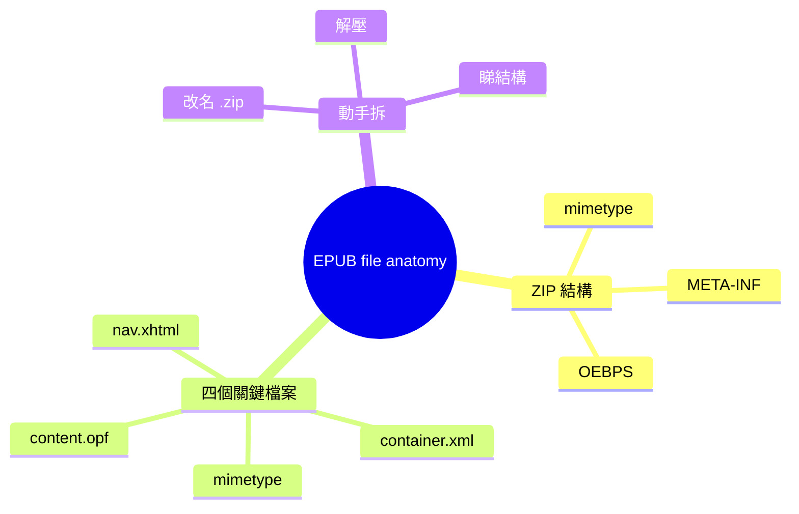

# Module 02: EPUB file anatomy + 動手拆

> **Part I: EPUB 係乜** · 估計閱讀 60 分鐘 · 廣東話 casual



## 學習目標

學完呢個單元，你會知：
- EPUB 嘅 ZIP 入面有乜嘢
- 每一個檔案嘅角色同重要性
- 點樣動手拆開一個 EPUB
- mimetype 點解要 STORED（唔壓縮）
- manifest 同 spine 嘅分別

---

## 1. EPUB 係一個 ZIP

上個單元講過：EPUB 就係「將網頁打包成一本書」。

而家打開呢個「包裝」睇下。

將一個 `.epub` 檔案改名做 `.zip`，撳兩下解壓，你會見到：

```
my-book.epub
├── mimetype               ← 8 個 byte，寫住 application/epub+zip
├── META-INF/
│   └── container.xml      ← 指向「主菜喺邊」
└── OEBPS/
    ├── content.opf         ← manifest + spine + metadata
    ├── nav.xhtml           ← 目錄
    ├── chapter1.xhtml      ← 內容頁
    ├── chapter2.xhtml
    ├── images/
    │   ├── cover.jpg
    │   └── diagram.png
    └── styles/
        └── main.css
```

呢個就係 EPUB 嘅全部。冇魔法，冇神秘。

> **Think**：你見到 OEBPS 呢個名，點睇係咩意思？
>
> OEBPS = Open eBook Publication Structure。呢個名由 1999 年 OEBPS 規格留落嚟，到 EPUB 普及之後仲未改。其實就係「本書嘅內容放喺邊」嘅目錄名。

---

## 2. mimetype — 身份證

**mimetype** 係 EPUB 最重要嘅一個檔案。8 個 byte，寫住：

```
application/epub+zip
```

就咁多。冇 newline，冇 BOM，冇任何其他嘢。

### 點解咁簡單？

因為閱讀器要喺未 unzip 之前就知道呢個係 EPUB。佢哋會做「byte-sniff」— 直接讀取 ZIP 入面前幾個 byte，睇下係咪 `application/epub+zip` 呢個 string。

如果壓縮咗，byte-sniff 就做唔到 — 你唔可以喺一堆 compressed binary 入面搵到一個 ASCII string。

所以 EPUB 規格要求：
- mimetype 必須係 ZIP 入面第一個檔案
- 必須用 **STORED** 方法（即係唔壓縮）
- 其他檔案可以用 DEFLATE（壓縮）

> **Think**：如果 mimetype 被壓縮咗，閱讀器點做？
>
> 閱讀器會 fallback 去睇副檔名 `.epub`，或者睇 `META-INF/container.xml`。但 byte-sniff 係最快、最可靠嘅方法。

---

## 3. META-INF/container.xml — 指路牌

`META-INF/container.xml` 告訴閱讀器：「本書嘅主菜（package document）喺邊度」。

通常指向 `OEBPS/content.opf`。

```xml
<?xml version="1.0" encoding="UTF-8"?>
<container version="1.0" xmlns="urn:oasis:names:tc:opendocument:xmlns:container">
  <rootfiles>
    <rootfile full-path="OEBPS/content.opf" media-type="application/oebps-package+xml"/>
  </rootfiles>
</container>
```

呢個 XML 好簡單：淨係講「package document 喺 `OEBPS/content.opf`」。

### 點解唔直接寫喺 mimetype 度？

因為一個 ZIP 可以有好多個 package document（雖然實際上冇人會咁做）。`container.xml` 做一個「指路牌」，靈活啲。

---

## 4. content.opf — 心臟

`content.opf` 係 EPUB 嘅心臟。入面有三樣嘢：

### 4.1 metadata（書嘅資料）

```xml
<metadata xmlns:dc="http://purl.org/dc/elements/1.1/">
  <dc:title>電子書入門</dc:title>
  <dc:language>yue</dc:language>
  <dc:identifier>urn:uuid:12345</dc:identifier>
  <dc:creator>作者名</dc:creator>
</metadata>
```

`dc:title` 就係書名。`dc:language` 係語言（`yue` = 廣東話）。`dc:identifier` 係 ISBN 或者 UUID。

### 4.2 manifest（所有檔案嘅清單）

```xml
<manifest>
  <item id="ch1" href="chapter1.xhtml" media-type="application/xhtml+xml"/>
  <item id="ch2" href="chapter2.xhtml" media-type="application/xhtml+xml"/>
  <item id="css" href="styles/main.css" media-type="text/css"/>
  <item id="img" href="images/cover.jpg" media-type="image/jpeg"/>
</manifest>
```

manifest 就係「本書入面有邊啲檔案」。每個 item 有 id、href、media-type。

> **Think**：點解 manifest 要列出所有檔案，而唔係閱讀器自己掃？
>
> 因為 ZIP 入面可以有好多無關嘅檔案（例如 `.DS_Store`、`Thumbs.db`）。manifest 告訴閱讀器：「淨係用呢啲檔案，其他唔好理。」

### 4.3 spine（閱讀順序）

```xml
<spine>
  <itemref idref="ch1"/>
  <itemref idref="ch2"/>
</spine>
```

spine 就係「邊個 HTML 頁面先，邊個後」。閱讀器跟呢個順序顯示內容。

### manifest vs spine

| | manifest | spine |
|---|----------|-------|
| 做乜 | 列出所有檔案 | 規定閱讀順序 |
| 包含乜 | XHTML、CSS、圖片、字型、NCX | 靜係 XHTML（同 SVG） |
| 必須？ | 係 | 係 |

> **Think**：點解 CSS 唔喺 spine 入面？
>
> 因為 CSS 係樣式，唔係內容頁。閱讀器唔需要「按順序顯示 CSS」。CSS 只係被 XHTML 引用，閱讀器識得自動加載。

---

## 5. nav.xhtml — 目錄

`nav.xhtml` 係目錄頁。閱讀器用呢個檔案嚟顯示章節列表。

```xml
<nav epub:type="toc" xmlns:epub="http://www.idpf.org/2007/ops">
  <h1>目錄</h1>
  <ol>
    <li><a href="chapter1.xhtml">第一章：開頭</a></li>
    <li><a href="chapter2.xhtml">第二章：發展</a></li>
  </ol>
</nav>
```

呢個 XHTML 檔案有個 `<nav epub:type="toc">` 元素。閱讀器會自動搵呢個元素，顯示畀你睇。

### 點解唔係 NCX？

EPUB 2.0 用 NCX（Navigation Control for XML）做目錄。EPUB 3.0 改用 XHTML 嘅 `<nav>` 元素。原因：XHTML 更靈活，可以用 CSS 樣式，而且同 web 標準一致。

---

## 6. 其他檔案

EPUB 入面仲有其他檔案：

| 檔案 | 角色 |
|------|------|
| `*.xhtml` | 內容頁（HTML 格式） |
| `*.css` | 樣式表 |
| `images/*` | 圖片 |
| `fonts/*` | 字型 |
| `*.smil` | media overlay（音頻同步，Module 5 講） |
| `*.svg` | 向量圖 |

每個檔案都要喺 manifest 入面登記。冇登記嘅檔案，閱讀器唔會理。

---

## 7. 動手試

而家你已經知 EPUB 嘅結構。揾一個 `.epub` 檔案，動手拆：

### 步驟 1：改名

將 `xxx.epub` 改做 `xxx.zip`。

### 步驟 2：解壓

撳兩下或者用 `unzip xxx.zip`。

### 步驟 3：睇結構

1. 有冇 `mimetype` 檔案？入面寫乜？
2. 有冇 `META-INF/container.xml`？開嚟睇下佢指去邊
3. 有冇 `.opf` 檔案？搵下 `<manifest>` 同 `<spine>`
4. 入面有幾多個 XHTML 檔案？
5. 有冇 `nav.xhtml`？目錄有幾多個章節？

### 步驟 4：試改

用文字編輯器開一個 XHTML 檔案，改少少嘢（例如加一行字），存檔，再用閱讀器開嚟睇。

你會發現：EPUB 真係好簡單，就係 ZIP + XML + HTML。

> **Spot the Mistake**：有個人話「EPUB 就係一班 HTML 頁面壓縮埋一齊」。呢句說話有兩個問題。
>
> 第一，EPUB 唔係淨係 HTML — 仲有 CSS、圖片、字型、metadata。第二，唔係「壓縮埋」咁簡單 — mimetype 要 STORED（唔壓縮），而且有特定嘅目錄結構（META-INF、OEBPS）同清單檔案（manifest/spine）。ZIP 只係包裝，EPUB 係一套完整嘅結構約定。

---

## 8. EPUB 嘅「骨架」總結

| 檔案 | 角色 | 類比 |
|------|------|------|
| mimetype | 身份證 | 外賣盒上面嘅餐廳名 |
| container.xml | 指路牌 | 外賣盒入面張單嘅「內容喺邊」 |
| content.opf | 心臟 | 張單（metadata + manifest + spine） |
| nav.xhtml | 目錄 | 餐廳菜單 |
| *.xhtml | 內容頁 | 飯、餸、湯 |

---

## 填一填

1. EPUB 嘅 mimetype 必須用 STORED 方法，即係唔壓縮。
2. container.xml 告訴閱讀器：package document 喺 OEBPS/content.opf。
3. manifest 列出所有檔案（XHTML、CSS、圖片、字型）。
4. spine 規定閱讀順序（邊個 HTML 頁面先，邊個後）。
5. EPUB 3.0 用 XHTML nav 元素做目錄，取代 EPUB 2.0 嘅 NCX。

---

## 點睇？

> **Q1**：mimetype 點解唔可以用 DEFLATE 壓縮？
>
> 因為閱讀器要做 byte-sniff — 直接讀取 ZIP 入面前幾個 byte，睇下係咪 `application/epub+zip`。壓縮咗就搵唔到呢個 string，byte-sniff 做唔到。
>
> **Q2**：manifest 同 spine 嘅分別係乜？一個冇另一個會點？
>
> manifest = 所有檔案嘅清單（閱讀器要知道有邊啲檔案）。spine = 閱讀順序（閱讀器要知道邊個先邊個後）。冇 manifest，閱讀器唔知有邊啲檔案。冇 spine，閱讀器唔知顯示順序。
>
> **Q3**：你解壓一個 EPUB，見到 mimetype 檔案唔係第一個。呢個 EPUB 有冇問題？點解？
>
> 有問題。EPUB 規格要求 mimetype 必須係 ZIP 入面第一個檔案，而且用 STORED 方法。如果唔係第一個，部分閱讀器可能認唔到。

---

## 下一步

下一個單元：EPUB 嘅三種形態 — reflowable、fixed layout、有聲書。
