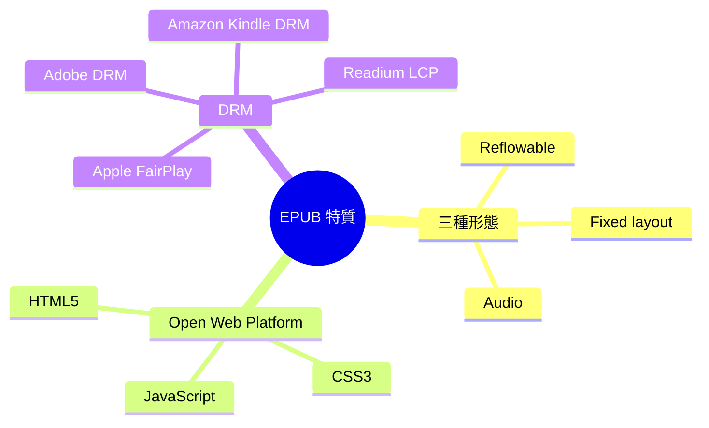
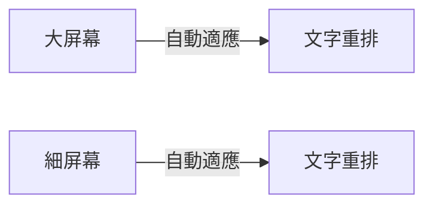

# Module 03: EPUB 特質 + 三種形態 + DRM

> **Part II: EPUB 嘅特質** · 估計閱讀 60 分鐘 · 廣東話 casual

## 學習目標

學完呢個單元，你會知：
- EPUB 嘅三種形態有咩分別
- 點解 EPUB 3.0 用 HTML5 係一個革命
- DRM 點解存在、讀者會遇到咩問題
- 四個主流 DRM 系統嘅分別
- LCP 點解成新趨勢

---

## 1. 三種形態

EPUB 唔係只有一種。根據內容，有三種主要形態：

| 形態 | 特點 | 適合 |
|------|------|------|
| Reflowable | 文字自動適應屏幕大小 | 小說、散文、教科書 |
| Fixed layout | 每頁固定版面，唔會變 | 漫畫、雜誌、設計稿 |
| Audio | 有聲書，有 audio + media overlay | 有聲書、語言學習 |

三種都係同一個格式，只係入面裝嘅嘢唔同。

### Reflowable（最常見）

呢個係 EPUB 嘅預設形態。文字內容會自動 reflow — 即係喺唔同大小嘅屏幕上，文字會自動重排。

**優點：**
- 一個檔案適應所有屏幕
- 讀者可以改字型大小
- 通風設備、手機、平板都睇到

**缺點：**
- 圖片位置可能唔啱
- 排版唔可以精準控制

### Fixed layout

每頁固定版面，一頁一頁咁顯示。排版同紙本書一樣。

**優點：**
- 排版精準，適合漫畫、雜誌
- 圖片位置固定
- 設計稿、攝影集

**缺點：**
- 唔適應屏幕大小
- 要放大縮小
- 細屏幕睇唔到全頁

### Audio

有聲書，入面有 audio 檔案同 media overlay（SMIL）。

**優點：**
- 可以聽書
- 適合語言學習
- 有字幕同步（media overlay）

**缺點：**
- 檔案大
- 需要播放器支援

> **Think**：點睇邊種形態最普及？
>
> Reflowable。因為 most-ebook 都係文字內容（小說、教科書、非-fiction），reflowable 最通用。

---

## 2. EPUB 3.0 嘅革命

EPUB 2.0（2007）用 XHTML 1.1 + 限制 CSS。EPUB 3.0（2011）直接用 HTML5 + CSS3 + JavaScript。

呢個改動有兩個深遠影響：

### 第一，網頁開發者識嘅嘢直接用到

Flexbox、Grid、Video、Font、Animation — 全部 HTML5 標準，唔係 EPUB 自創。之前要重新學，而家唔使。

### 第二，fixed layout 變可能

CSS `@page` 同 `@viewport` 標準化之後，一個 HTML 檔案對應一頁嘅概念出現。Apple 2013 年 iBooks Author 推漫畫 fixed layout。

### 第三，media overlay

EPUB 3.0 加咗 media overlay（SMIL），可以做音頻同步 — 即係有聲書 + 字幕。

> **Predict**：點睇 EPUB 用 HTML5 之後，邊個群體最開心？
>
> 網頁開發者。佢哋唔使再學一個新格式，直接用自己識嘅 HTML + CSS 就可以出電子書。

---

## 3. DRM — 點解有？

DRM（Digital Rights Management）就係「數碼版權管理」。簡單講：防止你將電子書複製畀其他人。

### 點解出版商要 DRM？

因為出版商驚：
- 你買咗一本電子書，複製 1000 份送畀朋友
- 電子書好容易完美複製
- 唔似紙本書，複製要有成本（印紙、裝訂）

所以出版商要求加 DRM — 唔經授權嘅裝置，開唔到本書。

### DRM 點影響讀者？

| 問題 | 講法 |
|------|------|
| 跨平台唔通 | 喺 Kobo 買嘅書，唔可以喺 Kindle 睇 |
| 借書過期消失 | 圖書館借嘅電子書，過期咗自動消失 |
| 裝置限制 | 一部機只可以開幾本書 |
| 備份困難 | 唔可以輕易備份自己買嘅書 |

---

## 4. 四個主流 DRM 系統

| DRM | 用喺邊 | 特點 |
|-----|--------|------|
| Adobe DRM | Kobo、Google Play Books、大部分公共圖書館 | 用 Adobe Digital Editions 開，最多 6 部裝置 |
| Apple FairPlay | Apple Books | 只可以用 Apple 裝置開 |
| Amazon Kindle DRM | Kindle | 只可以用 Kindle 裝置或 App 開 |
| Readium LCP | 新標準，Kobo、Publica 等開始用 | 開放標準，唔鎖死喺一個廠商 |

### Adobe DRM

Adobe DRM 係最老牌嘅 DRM。用 Adobe Digital Editions（ADE）管理。你買書時要登入 Adobe ID，授權裝置。

**優點：** 多裝置支援（最多 6 部）
**缺點：** 要裝 ADE、Adobe ID 管理麻煩

### Apple FairPlay

Apple 用自家 FairPlay DRM。只可以用 Apple 裝置（iPhone、iPad、Mac）開電子書。

**優點：** 喺 Apple 裝置上面好流暢
**缺點：** 完全鎖死喺 Apple 生態圈

### Amazon Kindle DRM

Amazon 用自家 Kindle DRM。只可以用 Kindle 裝置或 Kindle App 開。

**優點：** Kindle 生態圈完整（書多、裝置好用）
**缺點：** 鎖死喺 Amazon

### Readium LCP

LCP（Licensed Content Protection）係新標準，由 Readium 基金會開發。目標係取代 Adobe DRM，成為行業標準。

**優點：** 開放標準、唔鎖死廠商、效能更好
**缺點：** 仲未普及

> **Think**：點睇 LCP 點解會成新趨勢？
>
> 因為出版商唔想被一個廠商（Adobe）控制。LCP 係開放標準，邊個都可以用，而且效能比 Adobe DRM 好。Kobo、Publica 等已經開始用。

---

## 5. 點解有時睇唔到書？

讀者常見問題：

**問題 1：「我買咗書，但開唔到」**
- 原因：DRM 鎖咗裝置。你買嘅書只可以用特定裝置或 App 開。
- 解法：用正確嘅 App（例如 Kobo 書用 Kobo App，Kindle 書用 Kindle App）

**問題 2：「圖書館借嘅書過期咗，唔見晒」**
- 原因：DRM 自動刪除過期內容。
- 解法：重新借，或者買一本。

**問題 3：「我想將 Kobo 嘅書搬去 Kindle」**
- 原因：唔同 DRM 系統唔兼容。
- 解法：基本上冇解。你買咗邊個平台嘅書，就喺邊個平台睇。

> **Spot the Mistake**：有個人話「EPUB 一定有 DRM」。呢句說話問題喺邊？
>
> EPUB 本身係開放格式，冇 DRM。DRM 係出版商選擇加唔加。事實上好多獨立作者出 DRM-free 嘅 EPUB。EPUB = 格式，DRM = 額外嘅鎖。

---

## 6. EPUB 同其他格式比較

| 維度 | EPUB | PDF | 純 HTML 網頁 | App |
|------|------|-----|-------------|-----|
| 重新排版 | 自動 reflow | 固定版面 | 自動 reflow | 視乎設計 |
| 離線閱讀 | 得 | 得 | 唔得，要上網 | 視乎設計 |
| 閱讀器功能 | 改字型、高亮、書籤 | 有限 | 冇 | 視乎 App |
| 跨裝置同步 | 得（閱讀器內建） | 唔得 | 唔得 | 視乎 App |
| Accessibility | 好（結構化語義） | 差 | 好（HTML 天生） | 視乎設計 |
| 圖書館借書 | 得（加 DRM） | 唔得 | 唔得 | 唔得 |
| 檔案大小 | 細（壓縮 HTML） | 大（嵌入字型/圖） | — | 大 |
| 適合內容 | 小說、教科書、工具書 | 雜誌、設計稿 | 新聞、部落格 | 遊戲、互動 |

重點：冇一個格式係萬能。EPUB 嘅強項係「結構化嘅文字內容」— 小說、教科書、工具書。PDF 嘅強項係「固定版面」— 需要精準排版嘅嘢。HTML 嘅強項係「互動」— 需要用戶參與嘅嘢。

---

## 7. 唔同類型嘅 EPUB

| 類型 | 入面有乜 | 例子 |
|------|----------|------|
| 純文字 | XHTML + CSS + 少量圖片 | 小說、散文、教科書 |
| 漫畫/圖書 | 大量圖片，有時每頁一張圖 | 日本漫畫、兒童繪本 |
| 有聲 | 加埋 audio 檔案 + media overlay | 有聲書、語言學習 |

三種都係同一個格式，只係入面裝嘅嘢唔同。

---

## 填一填

1. Reflowable EPUB 會根據屏幕大小自動 reflow（文字重排）。
2. Fixed layout EPUB 嘅每頁版面係固定，唔會變。
3. DRM 係 Digital Rights Management 嘅縮寫，目的係防止電子書被輕易複製。
4. LCP 係由 Readium 基金會開發嘅新 DRM 標準。
5. EPUB 3.0 用 HTML5 + CSS3 + JavaScript，取代 EPUB 2.0 嘅 XHTML 1.1。

---

## 點睇？

> **Q1**：Reflowable 同 Fixed layout 最大嘅分別係乜？邊種更普及？點解？
>
> 最大分別係 reflowable 會自動適應屏幕，fixed layout 每頁固定。Reflowable 更普及，因為大部分電子書都係文字內容（小說、教科書），reflowable 最通用，適應所有裝置。
>
> **Q2**：點睇點解 Amazon 唔用 Adobe DRM 或者 LCP，而係用自家嘅 Kindle DRM？
>
> 因為 Amazon 想鎖住用戶喺自家生態圈。用自家 DRM，Kindle 用戶只可以用 Kindle 裝置或 App 開書，唔可以輕易轉去其他平台。呢個係廠商鎖定策略。
>
> **Q3**：如果你係出版商，你會唔會加 DRM？列出兩個理由。
>
> 會加：防止盜版、保護收入。唔會加：DRM 影響讀者體驗（跨平台唔通、備份困難）、DRM-free 吸引更多讀者。兩邊都有道理，取決於出版商嘅策略。

---

## 下一步

下一個單元：動手玩 EPUB — 用 Calibre 同 Sigil 修改 metadata 同 CSS。
