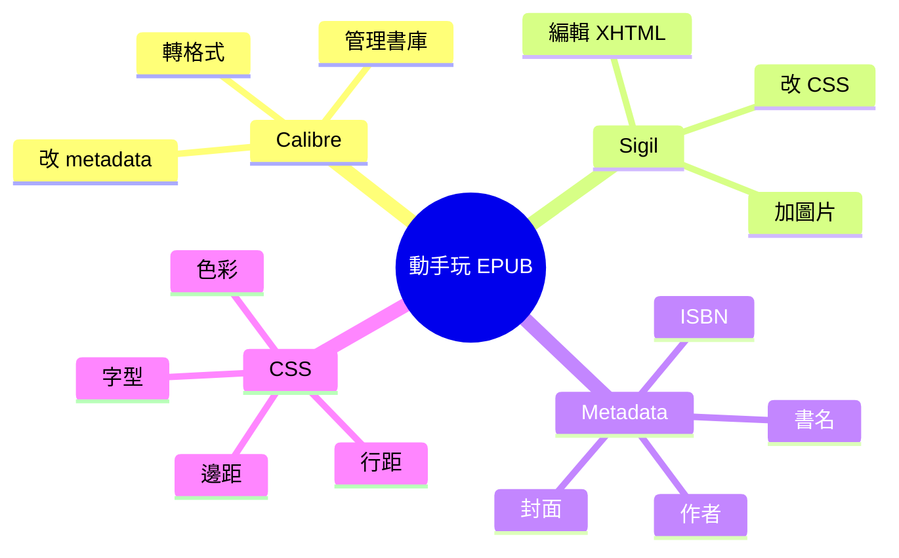

# Module 04: 動手玩 EPUB — metadata + CSS

> **Part II: EPUB 嘅特質** · 估計閱讀 60 分鐘 · 廣東話 casual



## 學習目標

學完呢個單元，你會知：
- 點樣用 Calibre 管理同轉格式電子書
- 點樣用 Sigil 直接編輯 EPUB 入面嘅檔案
- EPUB 嘅 metadata 有乜嘢、點改
- 點樣用 CSS 改 EPUB 嘅樣式

---

## 1. 兩個工具：Calibre 同 Sigil

### Calibre — 電子書管理

Calibre 係開源嘅電子書管理軟件。可以用嚟：

- **管理書庫**：將所有電子書放喺一個地方
- **轉格式**：EPUB ↔ MOBI ↔ PDF ↔ AZW ↔ TXT
- **改 metadata**：書名、作者、封面、分類
- **睇書**：內建閱讀器
- **同步**：將書推送去 Kindle 或者其他裝置

**下載：** calibre-ebook.com（免費）

### Sigil — EPUB 編輯器

Sigil 係開源嘅 EPUB 編輯器。可以用嚟：

- **直接編輯 XHTML**：改內容、改結構
- **改 CSS**：改樣式、改排版
- **加圖片**：插入封面、插圖
- **改 metadata**：改書名、作者、ISBN
- **預覽**：即時睇效果

**下載：** sigil-ebook.com（免費）

> **Think**：Calibre 同 Sigil 嘅分別係乜？
>
> Calibre 係「管理」工具 — 轉格式、改 metadata、管理書庫。Sigil 係「編輯」工具 — 直接開 EPUB 入面嘅檔案改。如果你淨係想改 metadata，用 Calibre 就夠。如果你想改內容或 CSS，用 Sigil。

---

## 2. Metadata — 書嘅資料

EPUB 嘅 metadata 有以下幾樣嘢：

| 欄位 | 講乜 | 例子 |
|------|------|------|
| 書名 | dc:title | 電子書入門 |
| 作者 | dc:creator | 作者名 |
| 語言 | dc:language | yue（廣東話） |
| ISBN | dc:identifier | 978-3-16-148410-0 |
| 封面 | meta name="cover" | cover.jpg |
| 出版日期 | dc:date | 2026-01-01 |
| 分類 | dc:subject | 教育、科技 |
| 描述 | dc:description | 一本關於 EPUB 嘅入門書 |

### 點改 metadata？

**用 Calibre：**
1. 開 Calibre
2. 將 EPUB 拖入書庫
3. 右鍵 → 編輯 metadata
4. 改書名、作者、封面、ISBN
5. 儲存

**用 Sigil：**
1. 開 Sigil
2. 開 EPUB 檔案
3. 喺左邊「Book Browser」搵 `content.opf`
4. 直接改 `<metadata>` 入面嘅 XML
5. 儲存

> **Think**：封面（cover）點解重要？
>
> 封面係讀者第一眼見到嘅嘢。冇封面。冇封面嘅電子書，喺書城入面好難吸引人。Calibre 可以自動從網路搵封面，或者你手動加一張。

---

## 3. CSS — 改樣式

EPUB 嘅 CSS 同網頁嘅 CSS 差唔多。你可以改：

| 屬性 | 效果 | 例子 |
|------|------|------|
| 字型 | 改字體 | `font-family: "Noto Sans CJK SC";` |
| 字型大小 | 改字大 | `font-size: 1.2em;` |
| 行距 | 改行與行之間距離 | `line-height: 1.6;` |
| 邊距 | 改頁面邊距 | `margin: 1em;` |
| 顏色 | 改文字顏色 | `color: #333;` |
| 背景色 | 改背景 | `background: #f5f5f5;` |
| 對齊 | 改文字對齊 | `text-align: justify;` |

### 用 Sigil 改 CSS

1. 開 Sigil
2. 開 EPUB
3. 搵 `styles/main.css`（或者你嘅 CSS 檔案）
4. 直接改 CSS
5. 喺預覽度睇效果
6. 儲存

### 用 Calibre 改 CSS

Calibre 有「編輯 CSS」功能，但比較基本。如果要精準控制，用 Sigil。

---

## 4. 動手試

### 試 Calibre：改 metadata

1. 下載 Calibre（calibre-ebook.com）
2. 拖一個 EPUB 入去
3. 右鍵 → 編輯 metadata
4. 改書名做「我嘅第一本電子書」
5. 加一個作者名
6. 加一張封面（或者用 Calibre 自動搵）
7. 儲存
8. 用閱讀器開嚟睇，你會見到新嘅 metadata

### 試 Sigil：改 CSS

1. 下載 Sigil（sigil-ebook.com）
2. 開一個 EPUB
3. 搵 CSS 檔案
4. 加一行：`body { background: #fffff0; }`（米色背景）
5. 儲存
6. 用閱讀器開嚟睇，你會見到背景變咗色

### 試 Sigil：加一個新章節

1. 開 EPUB
2. 右鍵 → Add Blank HTML File
3. 打標題「新章節」
4. 打少少內容
5. 喺 `content.opf` 嘅 manifest 加呢個檔案
6. 喺 spine 加呢個檔案嘅順序
7. 儲存
8. 用閱讀器開嚟睇，你會見到新章節

> **Spot the Mistake**：有個人話「改咗 EPUB 入面嘅 XHTML 檔案就夠，唔使改 manifest」。呢句說話問題喺邊？
>
> 唔夠。manifest 係閱讀器嘅「檔案清單」。如果你加咗一個 XHTML 檔案但冇喺 manifest 登記，閱讀器唔會理呢個檔案。你仲要喺 manifest 加 `<item>`，喺 spine 加 `<itemref>`。

---

## 5. 實用技巧

### 字型選擇

EPUB 嘅字型有兩種：
- **內嵌字型**：將字型檔案（.ttf / .otf / .woff）放入 EPUB，任何裝置都顯示一樣
- **系統字型**：唔嵌入字型，用裝置本身嘅字型

**建議：** 如果係中文 EPUB，考慮內嵌字型（例如 Noto Sans CJK），因為唔同裝置嘅中文字型差異大。

### CSS reset

EPUB 嘅 CSS 可能同閱讀器嘅預設衝突。加一個 CSS reset：

```css
body {
  margin: 0;
  padding: 0;
  font-family: serif;
  line-height: 1.6;
}
```

### 響應式圖片

如果 EPUB 有圖片，可以用 CSS 控制大小：

```css
img {
  max-width: 100%;
  height: auto;
}
```

---

## 6. 總結

| 工具 | 用途 | 難度 |
|------|------|------|
| Calibre | 轉格式、改 metadata、管理書庫 | 簡單 |
| Sigil | 編輯 XHTML、改 CSS、加圖片 | 中等 |

重點：Calibre 係「管理」，Sigil 係「編輯」。兩個都免費，兩個都應該試。

---

## 填一填

1. Calibre 主要用嚟管理同轉格式電子書。
2. Sigil 可以直接編輯 EPUB 入面嘅 XHTML 同 CSS。
3. EPUB 嘅封面喺 metadata 度用 meta name="cover" 標籤標記。
4. 如果要改 EPUB 嘅背景色，可以用 CSS 嘅 background 屬性。
5. 加咗新嘅 XHTML 檔案之後，仲要喺 manifest 登記。

---

## 點睇？

> **Q1**：點睇 Calibre 同 Sigil 邊個更適合新手？
>
> Calibre 更適合新手。介面簡單，主要做轉格式同改 metadata，唔需要直接寫 code。Sigil 適合想改內容或 CSS 嘅用戶，但需要少少 HTML/CSS 知識。
>
> **Q2**：如果你將 EPUB 嘅 CSS 改咗背景色，喺唔同閱讀器開會唔會一樣？
>
> 唔一定。唔同閱讀器對 CSS 嘅支援程度唔同。Kobo 同 Apple Books 支援比較好，Kindle 對 CSS 嘅支援比較差。所以同一個 CSS 效果可能唔同。
>
> **Q3**：點解有啲 EPUB 有內嵌字型，有啲冇？
>
> 內嵌字型可以確保任何裝置都顯示一樣嘅字型。但內嵌字型會增加檔案大小，而且涉及字型授權問題。所以有啲出版商選擇唔嵌入，用裝置本身嘅字型。

---

## 下一步

下一個單元：動手玩 EPUB — accessibility 同有聲書。
