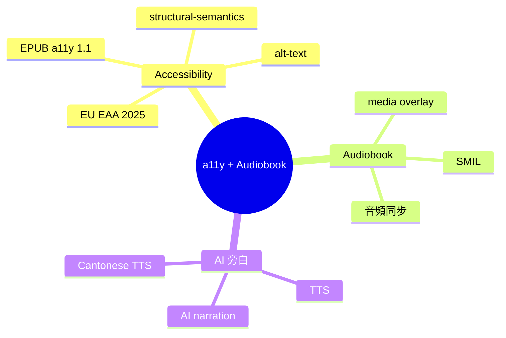

# Module 05: 動手玩 EPUB — a11y + Audiobook + AI 旁白

> **Part II: EPUB 嘅特質** · 估計閱讀 60 分鐘 · 廣東話 casual



## 學習目標

學完呢個單元，你會知：
- EPUB a11y 係乜、點解重要
- EU EAA 2025 對電子書嘅影響
- 點樣加 alt-text 同 structural semantics
- EPUB 同 audiobook 嘅 crossover
- media overlay（SMIL）點運作
- AI 旁白趨勢

---

## 1. Accessibility — 唔係選項

a11y = accessibility。EPUB a11y 1.1 係 W3C 嘅規格，定義電子書點樣先「accessible」。

### 點解重要？

因為有障礙嘅人（視障、聽障、動作障礙）都要睇書。

- 視障讀者：用 screen reader 讀 EPUB，需要正確嘅 alt-text 同結構
- 動作障礙讀者：用語音控制、大按鈕，需要 keyboard 可達
- 認知障礙讀者：需要簡單語言、清楚結構

### EU EAA 2025

歐盟嘅 European Accessibility Act（EAA）2025 年生效。所有喺歐盟賣嘅電子書都要 compliant 唔 compliant 嘅書唔可以賣。

> **Think**：EU EAA 2025 對出版商有咩影響？
>
> 出版商要確保佢哋嘅 EPUB 符合 a11y 標準。唔係淨係加 alt-text 就夠 — 要有正確嘅 heading structure、language declaration、reading order。呢個推動整個行業重視 a11y。

---

## 2. EPUB a11y 1.1 規格

EPUB a11y 1.1 定義咗三個層級：

| 層級 | 要求 | 例子 |
|------|------|------|
| **Baseline** | 最基本 | 有 lang attribute、有 heading structure |
| **Accessible** | 中等 | 有 alt-text、有 reading order |
| **Accessible + Enhanced** | 最高 | 完整 structural semantics、所有圖片有 alt-text、符合 WCAG 2.1 AA |

### 關鍵要求

**1. Language declaration**
每個 XHTML 檔案要有 `lang` 屬性：
```xml
<html lang="yue">
```

**2. Heading structure**
用 `<h1>` → `<h2>` → `<h3>`，唔好跳級。

**3. Alt-text**
每個 `` 要有 `alt` 屬性：
```xml

```

**4. Reading order**
確保閱讀器按正確順序顯示內容（spine）。

**5. Table accessibility**
表格要有 `<th>` 同 `scope` 屬性。

> **Think**：點睇大部分電子書有冇符合 EU EAA 2025？
>
> 大部分冇。好多電子書冇 alt-text、冇正確 heading structure。呢個係一個大問題 — 但亦係一個機會：如果你出書時做好 a11y，已經勝過大部分競爭對手。

---

## 3. 動手試：加 alt-text

用 Sigil 開一個 EPUB：

1. 搵一個 `` 標籤
2. 加 `alt` 屬性
3. 寫清楚呢張圖講乜

```xml
<!-- 之前 -->


<!-- 之後 -->

```

### Alt-text 嘅好與壞

| 壞嘅 alt-text | 好嘅 alt-text |
|---------------|---------------|
| `alt="圖片"` | `alt="EPUB 結構圖：ZIP 入面有 mimetype、META-INF、OEBPS"` |
| `alt="photo"` | `alt="作者相：一個戴眼鏡嘅男人喺書房度"` |
| `alt=""` | 唔加 alt（最差） |

---

## 4. EPUB 同 Audiobook — 點 crossover

EPUB 可以做有聲書。方法係加 **media overlay**（SMIL）。

### Media Overlay 係乜？

SMIL（Synchronized Multimedia Integration Language）係一個 XML 格式，用嚟同步音頻同文字。

```xml
<smil>
  <body>
    <par>
      <text src="chapter1.xhtml#p1"/>
      <audio src="audio/chapter1.mp3" clipBegin="0s" clipEnd="5s"/>
    </par>
    <par>
      <text src="chapter1.xhtml#p2"/>
      <audio src="audio/chapter1.mp3" clipBegin="5s" clipEnd="12s"/>
    </par>
  </body>
</smil>
```

呢個 SMIL 講：「第 1 段文字對應第 0-5 秒嘅音頻，第 2 段文字對應第 5-12 秒嘅音頻。」

### 點用？

閱讀器會：
1. 播放音頻
2. 同時高亮對應嘅文字
3. 讀者可以跟住聽 + 睇

呢個技術叫做「同步有聲書」— 即係有聲書 + 字幕。

> **Think**：點睇 media overlay 有咩限制？
>
> 最大限制係要逐段對齊。如果你有 100 頁文字，要逐頁對齊音頻，工作量巨大。所以大部分有聲書唔用 media overlay，而係用其他方法（例如 Audiobook 嘅 Dublin Core metadata）。

---

## 5. AI 旁白 — 新趨勢

2020 年代，AI TTS（Text-to-Speech）技術大躍進。多咗人用 AI 旁白做有聲書。

### AI 旁白嘅好處

- **成本低**：唔使請配音員
- **速度快**：幾分鐘出一本有聲書
- **多語言**：可以做廣東話、國語、英語

### AI 旁白嘅問題

- **自然度**：同真人配音仲有差距
- **情感**：AI 唔識得表達情感
- **粵語支持**：粵語 TTS 仲唔夠成熟

### 趨勢

- Amazon 2023 年推 AI 旁白功能
- Google 2024 年改進 TTS 自然度
- 粵語 TTS 仲喺發展階段

> **Predict**：點睇 5 年後 AI 旁白會唔會取代真人配音？
>
> 唔會完全取代，但會共存。AI 旁白適合大量生產、低成本嘅有聲書。真人配音適合高質量、情感豐富嘅有聲書。

---

## 6. EPUB 3.3 — 最新版本

EPUB 3.3 係 2026 年 W3C 嘅最新 Recommendation。主要改進：

- **a11y 更完善**：同 WCAG 2.1 同步
- **性能更好**：ZIP 解壓更快
- **兼容更好**：同舊版本兼容

### 點讀 W3C spec？

W3C EPUB 3.3 spec 喺：https://www.w3.org/TR/epub-33/

入面有：
- **OCF**（Open Container Format）：ZIP 結構
- **OPF**（Open Packaging Format）：manifest + spine
- **Content Documents**：XHTML + SVG
- **Media Overlays**：SMIL
- **EPUB a11y**：無障礙

> **Think**：W3C EPUB 3.3 spec 有幾長？
>
> 幾百頁。但你唔需要全部睇。最實用嘅係 Content Documents（XHTML 規範）同 Media Overlays（音頻同步）。

---

## 7. 總結

| 主題 | 重點 |
|------|------|
| a11y | EU EAA 2025 強制，唔可以忽視 |
| Alt-text | 每個 `` 要有 `alt` |
| Media overlay | SMIL 同步音頻同文字 |
| AI 旁白 | 成本低、速度快、自然度仲爭 |
| EPUB 3.3 | 最新版本，W3C Recommendation |

---

## 填一填

1. a11y 係 accessibility 嘅縮寫。
2. EU EAA 2025 要求所有喺歐盟賣嘅電子書都要符合無障礙標準。
3. Media overlay 用 SMIL 格式同步音頻同文字。
4. AI 旁白嘅好處係成本低、速度快，但自然度仲爭。
5. EPUB 3.3 係 2026 年嘅 W3C Recommendation。

---

## 點睇？

> **Q1**：點睇 a11y 對出版商有咩實際影響？
>
> 出版商要確保 EPUB 符合 a11y 標準，包括加 alt-text、正確 heading structure、language declaration。唔係淨係加 alt-text 就夠 — 要符合 WCAG 2.1 AA。呢個增加出版成本，但係法律要求。
>
> **Q2**：如果你出一本中文 EPUB，你會唔會加 AI 旁白？點解？
>
> 視乎預算同目標讀者。如果係大眾市場、預算有限，加 AI 旁白可以擴大受眾（視障讀者、想聽書嘅人）。如果係高端市場、追求質量，真人配音更好。粵語 TTS 仲唔夠成熟，可能影響體驗。
>
> **Q3**：EPUB 3.3 同 EPUB 3.0 最大嘅分別係乜？
>
> EPUB 3.3 更完善：a11y 同 WCAG 2.1 同步、性能更好（ZIP 解壓更快）、兼容更好（同舊版本兼容）。主要係同 W3C 標準同步，唔係大改。

---

## 下一步

下一個單元：點繼續 + 5 個常見誤解 + EPUB 3.3 spec 入門。
