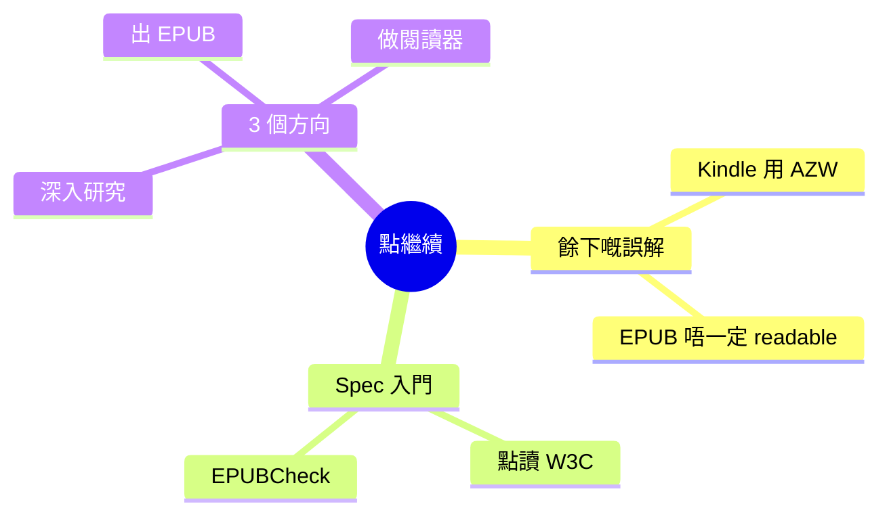

# Module 06: 點繼續

> **Part III: 點繼續** · 估計閱讀 15 分鐘 · 廣東話 casual



## 學習目標

學完呢個單元，你會知：
- 兩個課程未深入嘅常見誤解
- EPUB 3.3 spec 邊度開始讀
- EPUBCheck 點用
- 根據目標，下一步可以點做

---

## 1. 兩個餘下嘅誤解

其他三個誤解（EPUB = PDF 替代、EPUB 一定有 DRM、EPUB 同 HTML 一樣）喺 Module 1 已經拆解過。以下兩個值得再提一次：

### 誤解 4：Kindle 用 EPUB

**唔係。** Kindle 用自家嘅 AZW 格式（源自 MOBI）。Amazon 2023 年先喺 firmware 加 EPUB 支持，但內部仲係轉做 AZW 先顯示。

### 誤解 5：EPUB 一定 readable

**唔係。** EPUB 可以加 DRM、可以冇 alt-text、可以冇 heading structure。一本唔 accessible 嘅 EPUB，screen reader 讀唔到。EPUB = 格式；readable = 要做好 a11y 先得（Module 5 詳述）。

---

## 2. Spec 入門

### 邊度開始讀 W3C EPUB 3.3 spec

[https://www.w3.org/TR/epub-33/](https://www.w3.org/TR/epub-33/) — 幾百頁，由呢個順序開始：

1. **Content Documents** — XHTML + SVG 喺 EPUB 點用（最常見）
2. **OCF** — ZIP 結構、mimetype 規則（Module 2 講過嘅 spec 來源）
3. **Media Overlays** — SMIL 音頻同步（Module 5 講過嘅 spec 來源）
4. **EPUB a11y** — 無障礙要求（Module 5 詳述）

### EPUBCheck

[https://github.com/w3c/epubcheck](https://github.com/w3c/epubcheck) — W3C 嘅 EPUB 驗證工具。

```bash
brew install epubcheck
epubcheck my-book.epub
```

三種報告：
- **ERROR** — 必須修正（例如 mimetype 唔啱）
- **WARNING** — 建議修正（例如冇 alt-text）
- **INFO** — 資訊（例如 metadata）

出書之前必跑一次。

---

## 3. 三個方向

根據你想點用 EPUB，下一步唔同：

### 想深入研究 EPUB

- 由 W3C spec 嘅 Content Documents 開始讀
- 跑 EPUBCheck 喺你收集嘅 EPUB 上面，睇下有咩 warning
- 用 Calibre 轉格式（EPUB ↔ PDF），比較兩者分別

### 想出 EPUB

- 用 Sigil 寫第一本（Module 4 嘅 workflow）
- 用 EPUBCheck 驗證
- 上傳去 KDP、Apple Books、Kobo 自出版平台
- EU 賣書要符合 EAA 2025（Module 5）

### 想做 EPUB 閱讀器

- 研究 Readium SDK（[readium.org](https://readium.org)）
- 由 EPUB 3.3 spec 嘅 Content Documents + Media Overlays 入手
- 細閱 OCF 嘅 zip container 規則

---

## 填一填

1. W3C EPUB 3.3 spec 推薦由 **Content Documents** 開始讀。
2. EPUBCheck 嘅 **ERROR** 係必須修正，**WARNING** 係建議修正。
3. Kindle 內部仲係用 **AZW** 顯示，就算 2023 年支持 EPUB。
4. EPUB 本身唔保證 readable，要做好 **a11y** 先得。
5. 想做閱讀器可以由 **Readium SDK** 開始。

---

## 點睇？

> **Q1**：你想點用 EPUB？揀一個方向，講出你嘅第一步行動。
>
> （開放式。三個方向都係有效答案。重點係具體行動 — 例如「我會下載 Sigil，跟 Module 4 試改 metadata」比「我想出書」更實在。）

---

## 課程完結

六個單元，5.5 個鐘，由失敗歷史到動手做。

下一步係你自己嘅。揀個方向，做落去。
