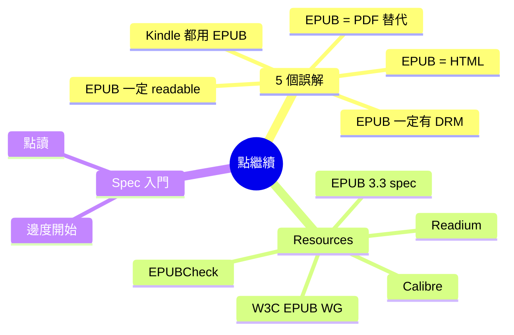

# Module 06: 點繼續 + 5 個誤解 + spec 入門

> **Part III: 點繼續** · 估計閱讀 30 分鐘 · 廣東話 casual



## 學習目標

學完呢個單元，你會知：
- 5 個常見誤解同點解錯
- EPUB 3.3 spec 邊度睇
- 下一步點學 EPUB

---

## 1. 5 個常見誤解

### 誤解 1：EPUB 就係 PDF 嘅替代品

**唔完全係。** PDF 需要固定版面（雜誌、設計稿），EPUB 做唔到。EPUB 做到嘅係 reflowable 嘅文字內容。

**簡單講：** PDF = 固定版面（一頁一頁）。EPUB = 自動排版（適應屏幕）。兩種格式解決唔同問題。

### 誤解 2：EPUB 一定有 DRM

**唔係。** EPUB 本身係開放格式，冇 DRM。DRM 係出版商選擇加唔加。事實上好多獨立作者出 DRM-free 嘅 EPUB。

**簡單講：** EPUB = 格式（開放）。DRM = 鎖（可選）。兩件事獨立。

### 誤解 3：EPUB 同 HTML 一樣

**唔係。** HTML 係一個網頁技術，EPUB 係一個包裝格式。EPUB 入面用 HTML，但有兩大分別：

第一，EPUB 有結構（manifest、spine、metadata）同規則（mimetype、container.xml）。第二，EPUB 入面嘅 XHTML 有 strict 嘅 well-formedness requirement — 不容許 HTML5 嘅容錯 parsing。

**簡單講：** HTML = 網頁內容。EPUB = 將 HTML 打包成一本書。

### 誤解 4：Kindle 都用 EPUB

**唔係。** Kindle 用自家嘅 AZW 格式（源自 MOBI）。Amazon 2023 年先支持 EPUB，但內部仲係轉做 AZW 先顯示。

**簡單講：** Kindle = Amazon 生態圈。EPUB = 開放標準。Amazon 2023 年先加入 EPUB 支持。

### 誤解 5：EPUB 一定 readable

**唔係。** EPUB 可以加 DRM、可以冇 alt-text、可以冇 heading structure。一本唔 accessible 嘅 EPUB，screen reader 讀唔到。

**簡單講：** EPUB = 格式。readable = 要做好 a11y 先得。

---

## 2. Resources — 推薦

### EPUB 3.3 spec

https://www.w3.org/TR/epub-33/

W3C 嘅官方規格。幾百頁，但最實用嘅係：
- **OCF**：ZIP 結構
- **Content Documents**：XHTML + SVG
- **Media Overlays**：SMIL

### EPUBCheck

https://github.com/w3c/epubcheck

W3C 嘅 EPUB 驗證工具。可以檢查你嘅 EPUB 有冇符合規格。

用法：`epubcheck my-book.epub`

### Calibre

https://calibre-ebook.com

開源電子書管理軟件。轉格式、改 metadata、管理書庫。

### Readium

https://readium.org

開源 EPUB 閱讀引擎。好多閱讀器（Kobo、Google Play Books）用 Readium。

### W3C EPUB Working Group

https://www.w3.org/groups/wg/epub/

W3C 嘅 EPUB 工作組，負責 EPUB 標準發展。

---

## 3. Spec 入門

### 點讀 W3C spec？

1. **由 Content Documents 開始**：呢度講 XHTML 同 SVG 喺 EPUB 點用
2. **睇 OCF**：呢度講 ZIP 結構同 mimetype
3. **睇 Media Overlays**：呢度講音頻同步
4. **最後睇 EPUB a11y**：呢度講無障礙

### EPUBCheck 點用？

```bash
# 安裝
# macOS
brew install epubcheck

# 驗證
epubcheck my-book.epub
```

EPUBCheck 會報告：
- **ERROR**：必須修正（例如 mimetype 唔啱）
- **WARNING**：建議修正（例如冇 alt-text）
- **INFO**：資訊（例如 metadata）

### Calibre 點用？

1. 下載 Calibre
2. 拖 EPUB 入去
3. 雙擊開嚟睇
4. 右鍵 → 轉格式
5. 右鍵 → 編輯 metadata

---

## 4. 下一步點學？

### 想深入了解 EPUB

- 讀 EPUB 3.3 spec（由 Content Documents 開始）
- 用 EPUBCheck 驗證你嘅 EPUB
- 用 Calibre 轉格式，比較唔同格式嘅分別

### 想出 EPUB

- 用 Sigil 編輯 EPUB
- 用 Calibre 管理書庫
- 用 EPUBCheck 驗證
- 上傳去 KDP / Apple Books / Kobo

### 想做 EPUB 閱讀器

- 研究 Readium SDK
- 研究 EPUB 3.3 spec 嘅 Content Documents
- 研究 Media Overlays

---

## 5. 課程總結

六個單元，你已經學咗：

| 單元 | 重點 |
|------|------|
| M1 | EPUB 由失敗講到普及、外賣盒比喻、2007 場景 |
| M2 | EPUB file anatomy、ZIP 結構、四個關鍵檔案 |
| M3 | 三種形態、DRM 四個系統、LCP 趨勢 |
| M4 | Calibre + Sigil、metadata、CSS |
| M5 | a11y + EU EAA、media overlay、AI 旁白 |
| M6 | 5 個誤解、resources、spec 入門 |

**你已經有基礎知識同動手能力。下一步係出一本 EPUB，或者深入研究某一個方向。**

---

## 填一填

1. EPUB 同 PDF 最大嘅分別係 EPUB 自動 reflow（文字重排），PDF 固定版面。
2. EPUBCheck 嘅 ERROR 係必須修正，WARNING 係建議修正。
3. EPUB a11y 1.1 同 WCAG 2.1 同步。
4. Readium 係開源嘅 EPUB 閱讀引擎。
5. EPUB 3.3 spec 喺 W3C 嘅網站（w3.org/TR/epub-33）。

---

## 點睇？

> **Q1**：你會選擇出 DRM-free 定有 DRM 嘅 EPUB？點解？
>
> 視乎策略。DRM-free 吸引更多讀者、跨平台通用、讀者體驗好。但 DRM 保護收入、防止盜版。大部分獨立作者選擇 DRM-free（吸引更多讀者），大出版商選擇 DRM（保護版權）。
>
> **Q2**：點睇 EPUB 4.0 會有咩新功能？
>
> 可能包括：更好的 a11y 支援、更好的 media overlay、更好的 JavaScript 支援、更好的固定版面標準。但 W3C 治理比較慢，EPUB 3.0 到 3.3 用咗 15 年，預計 2030 年代先有 EPUB 4.0。
>
> **Q3**：如果你要教一個朋友 EPUB 係乜，你會點講？
>
> EPUB 就係「將網頁打包成一本書」。入面有 HTML 頁面、CSS 樣式、圖片，包喺一個 ZIP 入面。你改名做 .zip 解壓就見到。佢同 PDF 嘅分別係 EPUB 會自動適應屏幕，PDF 固定版面。
