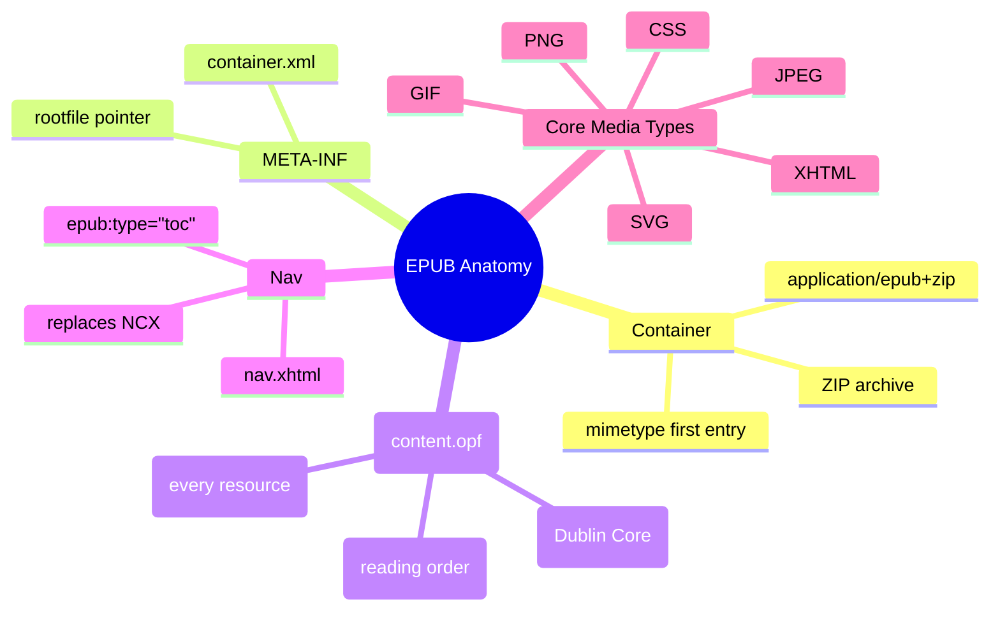
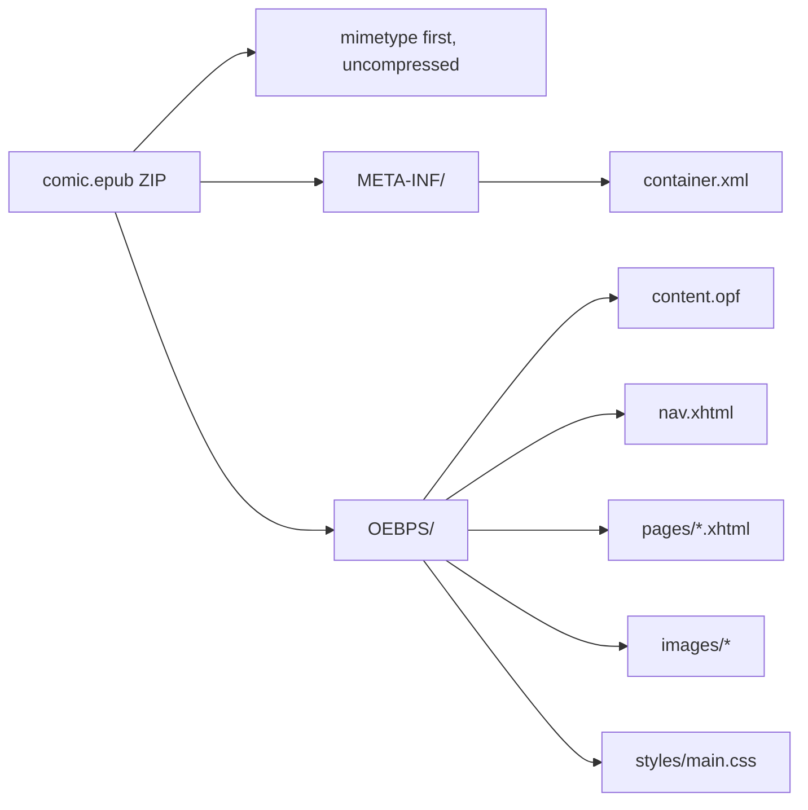

# Module 01: EPUB Anatomy

Est. study time: 35m
Language: en
Description: Mental model of an EPUB file. Decodes the ZIP container, mimetype, META-INF, OPF, spine, nav, and core media types before any code is written.

## Knowledge Map



---

## Learning Objectives (maps to course CILOs)
- Unzip any `.epub` file and identify its required parts
- Explain the role of mimetype, META-INF/container.xml, and content.opf
- Describe the manifest, the spine, and how they relate
- Identify which media types are "core" (no fallback required) and which are "foreign"

---

## Real-World Example

You download a comic from a publisher. The file ends in `.epub`. You suspect it is just a folder zipped up. You rename it to `comic.zip`, double-click, and a folder appears with the artwork and HTML inside. That hunch is correct — and now you have a working mental model of EPUB. Everything in this module formalises that intuition.

> **Think**: If an EPUB is just a ZIP, what stops you from making one by zipping random files and renaming the extension?
>
> *Answer: The reading system needs to find the package document to know the reading order. A ZIP without a specific structure has no entry point — the file is technically a ZIP, but no reader will render it. EPUB is a ZIP **with a contract**.*

---

## Core Content

### The ZIP container

An EPUB is a ZIP archive with a specific structure. The MIME type for the archive itself is `application/epub+zip`. The first file in the archive **must** be a file named `mimetype` containing exactly the text `application/epub+zip` with no trailing newline, stored without compression, and without any ZIP "extra field" metadata. This hard requirement is what lets reading systems detect an EPUB from raw bytes.

> **Think**: Why is "first entry, no compression" non-negotiable?
>
> *Answer: Reading systems read the first few bytes of the archive to decide the file type. If the mimetype is compressed or buried, the reader cannot use that fast path. The strict ordering also makes the format robust to partial corruption.*



### META-INF/container.xml

This file tells the reader which OPF (package document) is the root. Almost always there is one root file. The XML is fixed and tiny:

```xml
<?xml version="1.0" encoding="UTF-8"?>
<container version="1.0"
           xmlns="urn:oasis:names:tc:opendocument:xmlns:container">
  <rootfiles>
    <rootfile full-path="OEBPS/content.opf"
              media-type="application/oebps-package+xml"/>
  </rootfiles>
</container>
```

The `full-path` is the only thing that matters here. The reader opens it and starts reading the OPF.

> **Cloze**: "The XML file that points the reader to the root package document is {container.xml} located in the META-INF folder."
>
> *Answer: container.xml*

### content.opf — the brain of the EPUB

The package document is split into three required sections:

| Section | Purpose | Common content |
|---------|---------|----------------|
| `<metadata>` | Dublin Core bibliographic data | title, identifier, language, creator, modified date |
| `<manifest>` | Every file in the EPUB listed with id, href, media-type | cover, nav, all pages, all images, all CSS |
| `<spine>` | Reading order via `<itemref>` references to manifest ids | nav first, then cover, then pages in sequence |

`<metadata>` uses Dublin Core terms (`dc:title`, `dc:identifier`, `dc:language`, `dc:creator`). `<manifest>` is exhaustive — every file the reader might need must appear with its media type. `<spine>` does not list files; it lists manifest item ids in the order the reader turns pages.

> **Think**: Why does `<manifest>` list every file rather than letting the reader discover them in the ZIP?
>
> *Answer: Discovery via ZIP traversal is slow and ambiguous. The manifest is a contract: the author promises these resources exist, here are their types, and the spine tells the reader which order to render them. This also lets a reader validate the EPUB structurally before opening.*

### nav.xhtml — the modern table of contents

EPUB 3 uses a navigation document written in XHTML. The `<nav>` element carries `epub:type="toc"`. Inside is an ordered list of links. EPUB 2 used a separate `toc.ncx`; EPUB 3 readers also accept a legacy NCX if you ship one, but you do not need to.

```html
<nav epub:type="toc" role="doc-toc" aria-label="Table of Contents">
  <h1>Contents</h1>
  <ol>
    <li><a href="cover.xhtml">Cover</a></li>
    <li><a href="pages/page001.xhtml">Page 1</a></li>
  </ol>
</nav>
```

The manifest item that points to this file carries `properties="nav"` so the reader knows to treat it as the navigation document.

> **Predict**: If you ship an EPUB 3 with only a `toc.ncx` and no `nav.xhtml`, what happens on a strict EPUB 3 reader?
>
> *Answer: Strict EPUB 3 readers require nav.xhtml. The book may still render in lenient readers (because they fall back to NCX), but it will fail validation and be rejected by stores like Apple Books and Kobo. Always ship nav.xhtml.*

### Core media types

EPUB 3.3 §3.2 lists "core" media types that need no fallback chain:

| Media type | File extension | Role |
|------------|----------------|------|
| `application/xhtml+xml` | `.xhtml` | Content documents |
| `image/svg+xml` | `.svg` | Vector content (also core) |
| `text/css` | `.css` | Stylesheets |
| `image/png` | `.png` | Raster images |
| `image/jpeg` | `.jpg`, `.jpeg` | Raster images |
| `image/gif` | `.gif` | Raster images |

Anything else — fonts, audio, video, WebP — is "foreign" content and needs a fallback declared in the manifest. For an image-based comic using JPEG or PNG, no fallbacks are needed. WebP is foreign in EPUB 3.3 and not safe to rely on across readers (module 04 covers this).

> **Spot the Mistake**: A builder lists the cover image as `image/webp` in the manifest because "WebP is smaller." The EPUB validates. It opens in a Kobo Sage. On a Kobo Libra 2 it shows a broken-image icon.
>
> What's wrong?
>
> *Answer: WebP is foreign content in EPUB 3.3. Older Kobo firmware does not render it. Even where it does, the file is not a core media type, so the package is technically non-conformant. Use JPEG (photos) or PNG (line art, transparency). WebP requires a fallback image and reader-specific support.*

---

### Why This Matters

Every EPUB you build or debug starts here. The structure is the same whether the content is a novel, a comic, or a children's picture book. Once you can read an OPF and see which manifest items the spine points to, you have the foundational skill. The rest of the course layers rendering and tooling on top of this skeleton.

---

## Key Takeaways
- An EPUB is a ZIP archive with a strict first-entry contract: `mimetype` = `application/epub+zip`, uncompressed, no extra field
- `META-INF/container.xml` is the entry pointer to the package document
- `content.opf` has three required sections: `<metadata>`, `<manifest>`, `<spine>`
- `<manifest>` lists every resource with id, href, media-type
- `<spine>` orders manifest items into the reading sequence
- `nav.xhtml` with `epub:type="toc"` is the EPUB 3 navigation document
- JPEG, PNG, GIF, XHTML, SVG, CSS are core media types (no fallback needed); WebP is foreign

---

## Common Misconception

**"An EPUB is just HTML in a ZIP."**

Not quite. The HTML (XHTML) is one of several required contracts: the mimetype, the container pointer, the OPF metadata/manifest/spine, the navigation document, and a consistent media-type declaration. Skipping any one of these and the package is malformed. The container hides the contract, which is why many beginners think they can just zip up files and call it done.

---

## Spot the Mistake

A team builds their "first EPUB" by zipping an `OEBPS/` folder of pages and renaming it `.epub`. Apple Books refuses to open it. The team insists "it's a valid ZIP."

What's wrong?

*Answer: The mimetype file is missing or not the first entry. Without it, readers cannot identify the file as an EPUB at byte-sniff time. ZIP validity is necessary but not sufficient. The mimetype contract, the container pointer, and a valid OPF are all required.*

---

## Feynman Explain

(Pretend you are explaining EPUB to a coworker who only knows HTML. Start with the ZIP container, then walk them through why a manifest is needed, why the spine is separate from the manifest, and what role nav.xhtml plays. No EPUB jargon until they ask.)

---

## Reframe

(Judge the contract: the EPUB spec is verbose for a ZIP file. Is the OPF + manifest + spine + nav structure overkill for a 5-page comic? When would you push back on this overhead? When would you thank the spec authors?)

---

## Drill

Take the quiz. MCQs test recall, application, and scenario recognition.

Run: `learn.sh quiz epub-comics 01-epub-anatomy`
