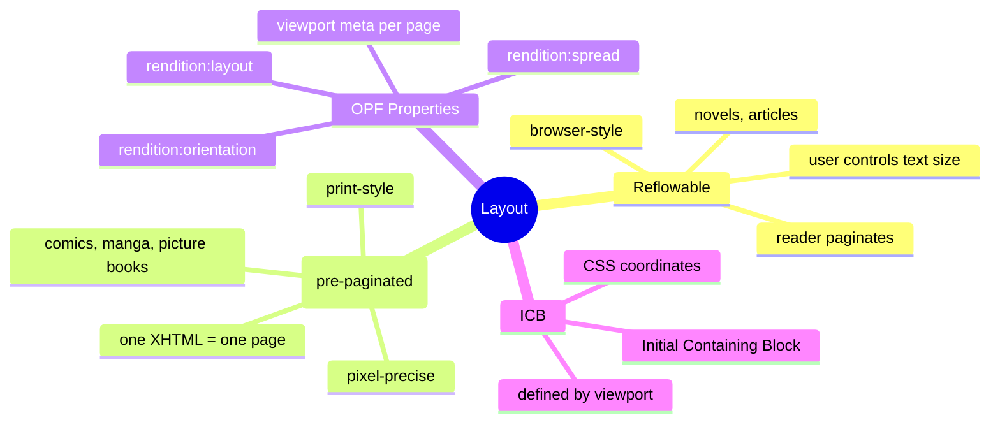
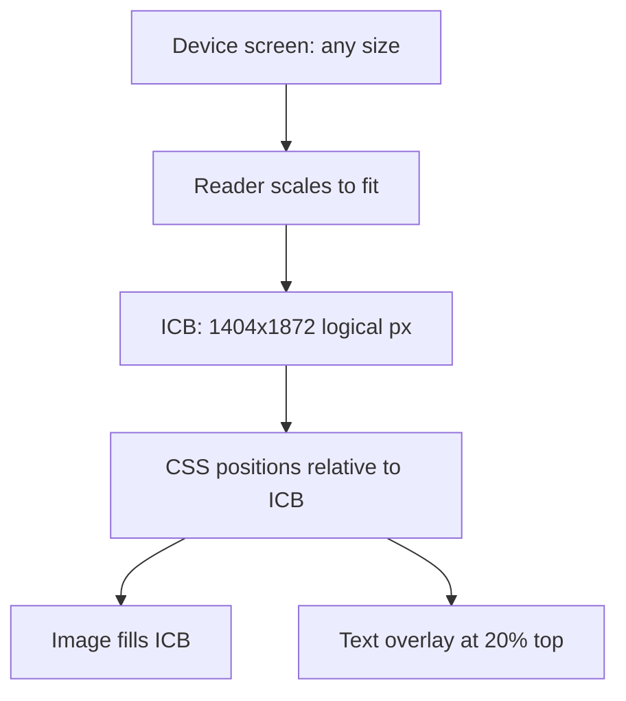

# Module 02: Fixed vs Reflowable Layout

Est. study time: 40m
Language: en
Description: The central decision in EPUB. Reflowable = browser-style pagination. Fixed = pixel-precise pages. For image-based comics, fixed layout is the answer; the spec mechanics matter for every module that follows.

## Knowledge Map



---

## Learning Objectives (maps to course CILOs)
- Explain the difference between reflowable and fixed (pre-paginated) layout
- Pick the correct layout for a given content type
- Declare the layout in OPF via `rendition:layout` and per-page `<meta name="viewport">`
- Describe the Initial Containing Block (ICB) and why it matters for fixed layout

---

## Real-World Example

You pick up a printed comic. Each page is exactly 17cm by 26cm. The artist placed the speech bubbles in precise positions. A reading system that tried to "reflow" the page would destroy the storytelling. The same problem exists digitally: a comic where the reader software resizes panels to fit the screen is unreadable. Fixed layout is the digital analog of print.

> **Think**: A novel does not need fixed layout — the text reflows nicely at any font size. Why would you ever use reflowable for an art book?
>
> *Answer: Reflowable is for prose. An art book with full-bleed photographs and captions anchored to specific image regions needs fixed layout so the captions stay tied to the right photo. The constraint is not "is it art" but "does spatial relationship carry meaning?" If yes, fixed.*

---

## Core Content

### Reflowable: the browser model

Reflowable EPUB behaves like a web page in a reader. The reader computes pages based on viewport size, font size, line height, margins, and orientation. The user can change all of these. The author controls typography, but the reader controls pagination.


For prose (novels, articles, technical writing) this is the right model. Tables, code, sidebars, and footnotes can break across pages, but readers handle that gracefully.

> **Predict**: A user rotates their e-reader from portrait to landscape mid-chapter in a reflowable EPUB. What happens?
>
> *Answer: The reader re-paginates. Each page now holds more or fewer words depending on the new viewport. The reading position is preserved but the page numbers shift. This is the desired behavior.*

### Fixed (pre-paginated): the print model

Fixed layout is also called "pre-paginated" because the author pre-decides every page. Each XHTML document is one page (or one spread). The reader renders it as-is. The user can zoom but cannot change font or reflow. The Initial Containing Block (ICB) is fixed in CSS pixels, and every element positions itself within that fixed box.

> **Cloze**: "An EPUB that uses one XHTML document per page and renders the content as-is without reflowing is called {pre-paginated} or fixed layout."
>
> *Answer: pre-paginated*

For comics, manga, picture books, art books, sheet music, and design portfolios, fixed layout is the only correct choice. Speech bubbles must anchor to specific panel positions. Captions must sit beside specific images. Reflow destroys all of this.

> **Think**: Why does fixed layout use the term "pre-paginated" rather than just "fixed"?
>
> *Answer: "Pre-paginated" emphasises that the pagination happens at author time, not reader time. The author decided what is on page 1, page 2, and so on. "Fixed" alone could be misread as "fixed font size" or "fixed width." The spec term is precise: pagination is decided before the book ships.*

### The OPF metadata that controls layout

The package metadata declares the default rendering intent:

| Property | Values | Effect |
|----------|--------|--------|
| `rendition:layout` | `reflowable` \| `pre-paginated` | Default layout for the whole book |
| `rendition:orientation` | `portrait` \| `landscape` \| `auto` | Default orientation hint |
| `rendition:spread` | `none` \| `landscape` \| `both` \| `auto` | Spread (two-page) display behaviour |
| `rendition:viewport` | `WxH` (e.g. `1404x1872`) | **Deprecated** in EPUB 3.3 — moved to per-page `<meta name="viewport">` |

These are declared as `<meta property="...">` inside `<metadata>`. A fixed-layout comic declares `rendition:layout` = `pre-paginated` and `rendition:orientation` = `portrait` at minimum.

```xml
<meta property="rendition:layout">pre-paginated</meta>
<meta property="rendition:orientation">portrait</meta>
<meta property="rendition:spread">none</meta>
```

> **Predict**: A publisher sets `rendition:spread="landscape"` on a comic. The user opens the book in portrait. What do they see?
>
> *Answer: Single pages. Spread-mode means "show two pages side by side when the device is in landscape orientation." Portrait orientation always shows single pages. The reader respects the orientation before honoring the spread property.*

### The viewport meta per page

EPUB 3.3 Appendix F moves the viewport declaration to each XHTML page. The first `<meta name="viewport">` in the document `<head>` wins; subsequent ones are ignored. This defines the ICB in CSS pixels for that page.

```html
<head>
  <title>Page 1</title>
  <meta name="viewport" content="width=1404, height=1872"/>
</head>
```

For a comic, every page gets the same viewport (matched to the artwork dimensions). For mixed content (module 07), each page declares its own viewport.

> **Cloze**: "In EPUB 3.3, the ICB for a fixed-layout page is defined by the {viewport} meta tag inside the page XHTML head."
>
> *Answer: viewport*

### Why ICB matters for positioning

Once the viewport declares the page size, CSS uses that as the canvas. An `` with `width: 100%; height: 100%` fills the page. An absolute-positioned text box at `top: 10%; left: 20%` lands at 10% and 20% of the ICB, regardless of the physical device screen size. The reader scales the ICB to fit the device, but the relative positions are preserved.



> **Spot the Mistake**: A developer writes `<meta name="viewport" content="device-width, initial-scale=1.0">` for a fixed-layout comic. The reader renders the page but the panels look "too small."
>
> What's wrong?
>
> *Answer: `device-width` makes the ICB equal to the physical device screen. On a phone in portrait that is small; on a tablet it is large. The result is that the image scales to the screen and the artwork is rendered at native resolution but the page composition is wrong. For fixed layout, declare explicit pixel dimensions that match the artwork (e.g., 1404x1872). The reader scales the entire ICB to fit.*

---

### Why This Matters

Choosing the right layout is a one-way decision for the book. Converting a fixed-layout comic to reflowable destroys the art. Converting a reflowable novel to fixed adds unnecessary constraints. The OPF properties and the viewport meta are the levers; the next module writes the XML and CSS that activate them.

---

## Key Takeaways
- Reflowable = reader-paginated, user-controlled font and size
- Fixed (pre-paginated) = author-paginated, one XHTML per page, pixel-precise
- Comics, manga, picture books, and art books require fixed layout
- The OPF declares defaults via `rendition:layout`, `rendition:orientation`, `rendition:spread`
- Per-page `<meta name="viewport" content="width=W, height=H">` defines the ICB in CSS pixels
- The reader scales the ICB to the physical screen; CSS positions are relative to the ICB
- `rendition:viewport` is deprecated in EPUB 3.3 in favour of per-page viewport meta

---

## Common Misconception

**"Fixed layout means fixed screen size."**

It means fixed *composition*. The reader still scales the page to fit the physical screen. What is fixed is the relationship between elements on the page: a speech bubble stays anchored to its panel even as the whole page scales up or down. The ICB is the logical coordinate system; the device screen is the physical surface.

---

## Spot the Mistake

A team ships a comic as a reflowable EPUB with `rendition:layout` left at the default. Each page XHTML is one image. The artwork renders, but on some devices the image is cropped or scaled weirdly because the reader treats the page like prose and tries to reflow the surrounding whitespace.

What's wrong?

*Answer: Reflowable layout tells the reader to compute pagination from the content. For a single-image page, the reader has no reflow rules to apply, so behaviour is undefined. The fix is to declare `rendition:layout` = `pre-paginated` and add a per-page viewport meta. Then the reader treats the page as a fixed composition.*

---

## Feynman Explain

(Explain to a coworker: when would you pick reflowable versus fixed layout for a children's book with one image per page and a sentence of text under each image? Justify your answer in terms of who controls the layout.)

---

## Reframe

(Judge the design: the EPUB spec offers three layout modes. Reflowable, pre-paginated, and "auto-paginated" (`rendition:flow` = `auto`). When would `auto-paginated` beat pre-paginated for a non-comic content type? When would it be a trap?)

---

## Drill

Take the quiz. MCQs test recall, application, and scenario recognition.

Run: `learn.sh quiz epub-comics 02-fixed-vs-reflowable`
