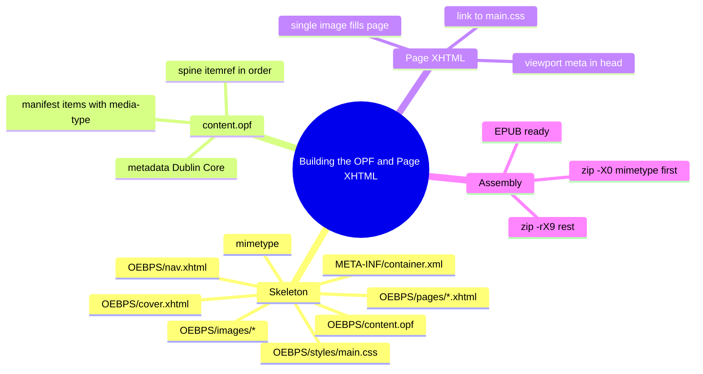

# Module 03: Building the OPF and Page XHTML

Est. study time: 50m
Language: en
Description: Hands-on. Author a complete EPUB 3 fixed-layout package: mimetype, container.xml, content.opf, nav.xhtml, cover.xhtml, page XHTML, main.css, and the zip command that assembles it. Knowledge only — no bundled sample, no validation step.

## Knowledge Map



---

## Learning Objectives (maps to course CILOs)
- Lay out the file skeleton for a fixed-layout comic EPUB
- Author content.opf with metadata, manifest, and spine for fixed layout
- Author a cover XHTML, a nav.xhtml, and a page XHTML
- Link a stylesheet and write minimal CSS to fill the page
- Assemble the EPUB with the `zip` command respecting the mimetype contract

---

## Real-World Example

You have a folder of page images and you want a working EPUB. No tool, no library, no validator. Just bash and your knowledge of the structure. The following skeleton is the minimum: every file is shown verbatim. Substitute your own image filenames and identifiers when you replicate it.

```
my-comic/
├── mimetype
├── META-INF/
│   └── container.xml
└── OEBPS/
    ├── content.opf
    ├── nav.xhtml
    ├── cover.xhtml
    ├── pages/
    │   ├── page001.xhtml
    │   └── page002.xhtml
    ├── images/
    │   ├── cover.jpg
    │   ├── page001.jpg
    │   └── page002.jpg
    └── styles/
        └── main.css
```

> **Think**: Why is the folder called `OEBPS`? Could you name it `stuff` instead?
>
> *Answer: The folder name is arbitrary. `OEBPS` is a convention left over from the Open eBook Publication Structure (the predecessor to EPUB). What matters is that the path in `container.xml` matches the actual folder. You can call it `stuff` and update the `full-path` accordingly. Convention helps humans; the spec does not care.*

---

## Core Content

### mimetype

The first file in the archive. Plain text, exact content, no newline at the end.

```
application/epub+zip
```

Saved as `mimetype` (no extension) at the root of the staging folder. The zip command must store this entry uncompressed with no extra field (the `-X` flag strips the extra field on most `zip` implementations).

### META-INF/container.xml

```xml
<?xml version="1.0" encoding="UTF-8"?>
<container version="1.0"
           xmlns="urn:oasis:names:tc:opendocument:xmlns:container">
  <rootfiles>
    <rootfile full-path="OEBPS/content.opf"
              media-type="application/oebps-package+xml"/>
  </rootfiles>
</container>
```

This is fixed. The only thing that changes across packages is `full-path` if you renamed the OPF folder.

### OEBPS/content.opf

```xml
<?xml version="1.0" encoding="UTF-8"?>
<package xmlns="http://www.idpf.org/2007/opf" version="3.0"
         unique-identifier="bookid" xml:lang="en"
         xmlns:dc="http://purl.org/dc/elements/1.1/"
         prefix="rendition: http://www.idpf.org/vocab/rendition/#">

  <metadata>
    <dc:identifier id="bookid">urn:uuid:YOUR-UUID-HERE</dc:identifier>
    <dc:title>My Comic</dc:title>
    <dc:language>en</dc:language>
    <dc:creator>Author Name</dc:creator>
    <dc:publisher>Self-published</dc:publisher>
    <dc:date>2026-09-04</dc:date>
    <meta property="dcterms:modified">2026-09-04T00:00:00Z</meta>

    <meta property="rendition:layout">pre-paginated</meta>
    <meta property="rendition:orientation">portrait</meta>
    <meta property="rendition:spread">none</meta>
  </metadata>

  <manifest>
    <item id="nav"   href="nav.xhtml"        media-type="application/xhtml+xml" properties="nav"/>
    <item id="cover" href="cover.xhtml"      media-type="application/xhtml+xml"/>
    <item id="cover-img" href="images/cover.jpg" media-type="image/jpeg" properties="cover-image"/>
    <item id="css"   href="styles/main.css"  media-type="text/css"/>

    <item id="p1"    href="pages/page001.xhtml" media-type="application/xhtml+xml"/>
    <item id="p2"    href="pages/page002.xhtml" media-type="application/xhtml+xml"/>

    <item id="i1"    href="images/page001.jpg" media-type="image/jpeg"/>
    <item id="i2"    href="images/page002.jpg" media-type="image/jpeg"/>
  </manifest>

  <spine>
    <itemref idref="cover"/>
    <itemref idref="p1"/>
    <itemref idref="p2"/>
  </spine>
</package>
```

> **Cloze**: "The spine of a fixed-layout comic lists the cover and each page XHTML as a separate {itemref} element."
>
> *Answer: itemref*

Three rules to remember:
1. Every file the reader needs is in the manifest with its media type
2. The cover image is `properties="cover-image"` on the manifest `<item>`, not a spine `linear="no"` flag
3. The `rendition:*` properties declare the default rendering intent

> **Predict**: A builder lists `cover.xhtml` in the manifest but forgets to add `properties="cover-image"` to the cover image. What does the reader show in the library?
>
> *Answer: A generic placeholder, or the first page of the book, depending on the reader. Without `cover-image` the manifest does not advertise the cover to the library. The cover will still render when the book opens, but the library view lacks proper art.*

### OEBPS/nav.xhtml

```xml
<?xml version="1.0" encoding="UTF-8"?>
<!DOCTYPE html>
<html xmlns="http://www.w3.org/1999/xhtml"
      xmlns:epub="http://www.idpf.org/2007/ops" xml:lang="en">
<head>
  <title>Contents</title>
</head>
<body>
  <nav epub:type="toc" role="doc-toc" aria-label="Table of Contents">
    <h1>Contents</h1>
    <ol>
      <li><a href="cover.xhtml">Cover</a></li>
      <li><a href="pages/page001.xhtml">Page 1</a></li>
      <li><a href="pages/page002.xhtml">Page 2</a></li>
    </ol>
  </nav>
</body>
</html>
```

Note: the `<nav>` element has `epub:type="toc"`, and the manifest item that points to this file has `properties="nav"`. Both are required.

### OEBPS/cover.xhtml

```xml
<?xml version="1.0" encoding="UTF-8"?>
<!DOCTYPE html>
<html xmlns="http://www.w3.org/1999/xhtml" xml:lang="en">
<head>
  <title>Cover</title>
  <meta name="viewport" content="width=1404, height=1872"/>
  <link rel="stylesheet" type="text/css" href="styles/main.css"/>
</head>
<body>
  <div class="page">
    
  </div>
</body>
</html>
```

Every fixed-layout page gets the viewport meta. The cover is just a special first page in the spine.

### OEBPS/pages/page001.xhtml

```xml
<?xml version="1.0" encoding="UTF-8"?>
<!DOCTYPE html>
<html xmlns="http://www.w3.org/1999/xhtml" xml:lang="en">
<head>
  <title>Page 1</title>
  <meta name="viewport" content="width=1404, height=1872"/>
  <link rel="stylesheet" type="text/css" href="../styles/main.css"/>
</head>
<body>
  <div class="page">
    
  </div>
</body>
</html>
```

The path from `pages/page001.xhtml` back to the stylesheet is `../styles/main.css` and back to the image is `../images/page001.jpg`. Adjust if your folder structure differs.

> **Spot the Mistake**: A builder writes `<link rel="stylesheet" href="styles/main.css">` from a page in `pages/`. The CSS does not load; the page renders unstyled. What is wrong?
>
> *Answer: The path is relative to the page XHTML, not the package root. From `pages/page001.xhtml` the CSS is at `../styles/main.css`. The missing `../` makes the reader look for `pages/styles/main.css` which does not exist.*

### OEBPS/styles/main.css

```css
@charset "UTF-8";

html, body {
  margin: 0;
  padding: 0;
  width: 100%;
  height: 100%;
  background: #000;
}

.page {
  position: relative;
  width: 100%;
  height: 100%;
  overflow: hidden;
}

.page-img {
  display: block;
  width: 100%;
  height: 100%;
  object-fit: contain;
  -webkit-user-select: none;
  user-select: none;
}
```

`html, body` fill the ICB. `.page` is the canvas. `.page-img` fills the canvas. `object-fit: contain` letterboxes if the image aspect ratio does not match the ICB. Module 04 expands the CSS surface area.

### Assembling with `zip`

```bash
#!/usr/bin/env bash
set -euo pipefail
ROOT="$(cd "$(dirname "$0")" && pwd)"
OUT="$ROOT/comic.epub"
TMP=$(mktemp -d)
cp -r "$ROOT/my-comic/." "$TMP/"

(cd "$TMP" && zip -X0 "$OUT" mimetype)
(cd "$TMP" && zip -rX9 "$OUT" META-INF OEBPS -x "mimetype")

rm -rf "$TMP"
echo "Built $OUT"
```

Three rules to enforce:
1. The mimetype is the first entry (`zip -X0` writes it first, stored, no extra field)
2. The mimetype is excluded from the second zip command (it was already added)
3. The rest of the content goes in with `-X9` (strip extra fields, deflate at level 9)

> **Predict**: You run the build script but accidentally swap the order — the rest of the content is zipped first, then the mimetype last. The ZIP still contains a mimetype file. Does the reader accept it?
>
> *Answer: No. The reader walks the archive from the first entry. If the first entry is anything other than the uncompressed mimetype, the reader cannot byte-sniff the format. Many readers will reject the file outright. Always zip mimetype first.*


---

### Why This Matters

This is the smallest possible valid fixed-layout comic EPUB. Every tool, library, and validator respects this structure. Once you have authored all of these by hand once, every higher-level tool (ebooklib, Calibre, Pandoc) becomes a way to generate the same files. The skill transfers.

---

## Key Takeaways
- Minimum fixed-layout EPUB = mimetype + META-INF/container.xml + OEBPS/content.opf + nav.xhtml + cover.xhtml + page XHTMLs + main.css + image files
- content.opf declares Dublin Core metadata, a complete manifest, and a spine that orders the reading
- `rendition:layout = pre-paginated` activates fixed layout for the whole package
- Every page XHTML declares `<meta name="viewport" content="width=W, height=H">` in the head
- nav.xhtml uses `<nav epub:type="toc">` and its manifest item has `properties="nav"`
- The cover image manifest item carries `properties="cover-image"` (not a spine `linear="no"` flag)
- Assemble with two `zip` invocations: mimetype first (`-X0`), rest afterwards (`-rX9`, excluding mimetype)

---

## Common Misconception

**"A valid EPUB needs EPUBCheck or a validator to be 'real'."**

EPUBCheck is a linter, not a creator. A hand-authored EPUB that obeys the structural contract (mimetype first, container pointer, valid OPF) is a real EPUB. Validators catch issues — they do not confer validity. The contract is what matters.

---

## Spot the Mistake

A builder writes the spine as:

```xml
<spine>
  <itemref href="cover.xhtml"/>
  <itemref href="pages/page001.xhtml"/>
</spine>
```

The reader ignores the entries and shows a blank book.

What's wrong?

*Answer: The spine uses `href` instead of `idref`. The spine references manifest item ids, not file paths. Without an `idref` the entry is invalid and the reader skips it. The fix is to use the manifest `id` values: `<itemref idref="cover"/>` and `<itemref idref="p1"/>`.*

---

## Feynman Explain

(Explain the file skeleton to a coworker who has never built an EPUB. Walk them through mimetype → container.xml → content.opf → nav.xhtml → page XHTML. For each file, name its single responsibility. No EPUB jargon until they ask.)

---

## Reframe

(Judge the design: the OPF forces every file to be listed in the manifest. For a 200-page comic that is 200 image manifest entries plus 200 page XHTML manifest entries — 400 lines. Is this overhead justified? When would you push for a simpler format? When would you defend the verbosity?)

---

## Drill

Take the quiz. MCQs test recall, application, and scenario recognition.

Run: `learn.sh quiz epub-comics 03-building-opf`
