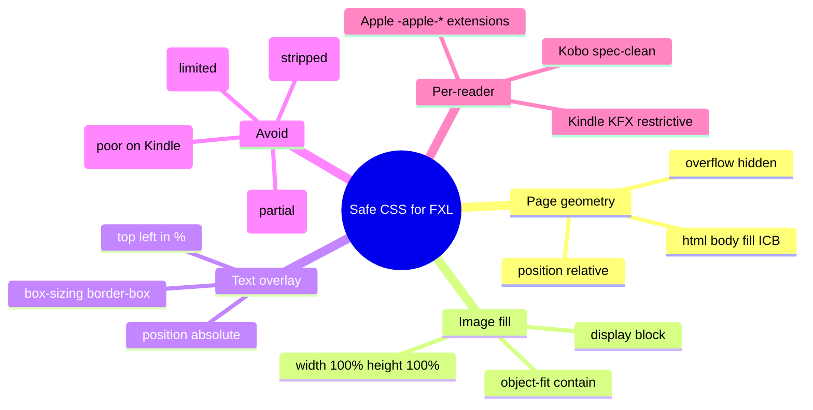
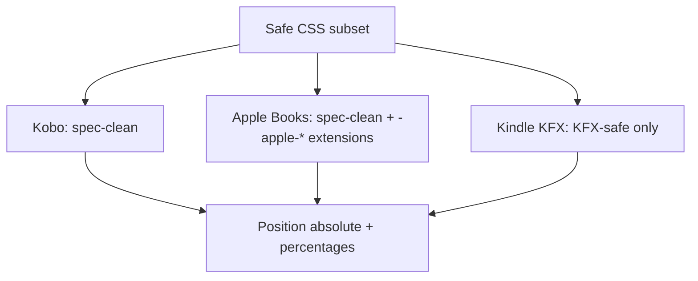

# Module 04: Safe CSS for Fixed-Layout Pages

Est. study time: 45m
Language: en
Description: The user's main gap. Viewport meta, position absolute, object-fit, what to avoid (Grid, Flex, transforms on Kindle), and the per-reader quirks table for Kobo, Apple Books, and Kindle.

## Knowledge Map



---

## Learning Objectives (maps to course CILOs)
- Write CSS that fills the ICB and positions a single image correctly
- Add text overlays anchored to specific page regions
- Identify which CSS properties are safe across Kobo, Apple Books, and Kindle
- Identify which properties to avoid and why
- Read a per-reader quirks table and adapt CSS for the target

---

## Real-World Example

You write a fixed-layout page with a speech bubble at `top: 10%, left: 20%` and an image filling the rest. It works on Kobo Sage. It works on Apple Books. On Kindle (KFX) the bubble lands in the wrong place because `position: absolute` with percentage values is interpreted differently when the KFX renderer flattens the layout. This module teaches you the safe subset that survives all three.

> **Think**: Why does Kindle's CSS support feel "different" from a web browser?
>
> *Answer: Kindle reads EPUB via conversion to KFX or KF8, then renders with a stripped-down CSS engine. The engine is older and more conservative than modern browsers. Features the engine cannot map faithfully (CSS Grid, complex flexbox, transforms) are dropped or reinterpreted. If you stay within the safe subset, the conversion is lossless.*

---

## Core Content

### The page geometry pattern

Every fixed-layout page starts with the same reset and container pattern. This pattern is identical across all three target readers and is the only one you need to memorise.

```css
@charset "UTF-8";

html, body {
  margin: 0;
  padding: 0;
  width: 100%;
  height: 100%;
  background: #000;
}

.page {
  position: relative;
  width: 100%;
  height: 100%;
  overflow: hidden;
}
```

Three rules to internalise:
1. `html, body` fill the ICB defined by the viewport meta (module 02)
2. `.page` is `position: relative` so absolute-positioned children anchor to it
3. `overflow: hidden` prevents any element from spilling outside the canvas

> **Cloze**: "The CSS property that makes an element the positioning ancestor for its absolutely-positioned children is {position: relative}."
>
> *Answer: position: relative*

### Filling the page with an image

```css
.page-img {
  display: block;
  width: 100%;
  height: 100%;
  object-fit: contain;
  user-select: none;
}
```

`display: block` removes the inline-image baseline gap. `width: 100%` and `height: 100%` make the image fill the `.page` container. `object-fit: contain` letterboxes the image to preserve aspect ratio if the image dimensions do not match the ICB. `user-select: none` prevents the reader's text-selection tool from highlighting the image.

> **Predict**: A 4:3 image sits inside a 16:9 ICB with `object-fit: contain`. What does the user see?
>
> *Answer: Black bars (letterbox) on the left and right. The image keeps its 4:3 aspect ratio and is centered. With `object-fit: cover` the image would fill the canvas but the top and bottom would be cropped.*

### Text overlays (speech bubbles, SFX, captions)

```css
.balloon {
  position: absolute;
  top: 10%;
  left: 15%;
  width: 30%;
  height: auto;
  font-family: sans-serif;
  font-size: 1em;
  color: #000;
  background: #fff;
  padding: 0.5em;
  box-sizing: border-box;
  border: 2px solid #000;
  border-radius: 1em;
}
```

The pattern is `position: absolute` with top/left/width in percent of the ICB, font-size in `em` (scales with reader zoom), `box-sizing: border-box` so padding is included in the width.

> **Think**: Why use percentage top/left instead of pixel values?
>
> *Answer: The ICB is fixed in CSS pixels, but the reader scales the ICB to fit the physical screen. Percentages also scale because they are relative to the ICB. Pixel values would also work, but percentages are easier to reason about when the ICB is 1404x1872 vs 1264x1680. Pick one convention per project.*

### The safe subset

| Property | Kobo | Apple Books | Kindle | Notes |
|----------|------|-------------|--------|-------|
| `position: relative/absolute` | Yes | Yes | Yes | The cornerstone of fixed layout |
| `width`, `height` (px or %) | Yes | Yes | Yes | |
| `top`, `left`, `right`, `bottom` (px or %) | Yes | Yes | Yes | |
| `margin`, `padding` | Yes | Yes | Yes | |
| `display: block/inline/inline-block` | Yes | Yes | Yes | |
| `font-*` properties | Yes | Yes | Yes | Font choice is per-file via `@font-face` (limited on Kindle) |
| `color`, `background-color` | Yes | Yes | Yes | |
| `border`, `border-radius` | Yes | Yes | Yes | |
| `box-sizing: border-box` | Yes | Yes | Yes | |
| `object-fit: contain/cover` | Partial | Yes | Limited | Use `width/height: 100%` and let the image be its natural size as a safer fallback |
| `@font-face` | Yes | Yes | Subset only | Kindle strips unrecognised fonts; embed font in KPF |
| `vh`, `vw` | Yes | Yes | Limited | Prefer percentages of the ICB |

> **Cloze**: "The CSS positioning property that makes an element the coordinate origin for its absolutely-positioned children is {position: relative}."
>
> *Answer: position: relative*

### The unsafe subset

| Property | Why avoid | Safe alternative |
|----------|-----------|------------------|
| CSS Grid | Kindle support is poor; partial on Kobo | Absolute positioning + percentages |
| Flexbox (complex) | Kindle support is poor; partial on Kobo | Block layout with explicit dimensions |
| `transform` | Kindle strips; limited elsewhere | Top/left/width/height |
| `filter`, `mix-blend-mode` | Limited support everywhere | Pre-process images (module 05) |
| `transition`, `animation` | Stripped on Kindle | None — fixed layout is static |
| JavaScript | Stripped on Kindle; optional on others | Pure CSS or no interactivity |
| `float` | Unpredictable in FXL | Absolute positioning |
| `@media` queries | Limited use in FXL | Per-page viewport meta is enough |

> **Spot the Mistake**: A developer writes a flexbox layout for a comic page with three speech bubbles in a row. It works on Kobo and Apple Books. On Kindle, the bubbles stack vertically or overflow.
>
> What's wrong?
>
> *Answer: Complex flexbox is poorly supported on Kindle's KFX renderer. The conversion drops or misinterprets the layout. The fix is to use absolute positioning with explicit top/left/width/height values per bubble. This is the KFX-safe pattern.*

### Apple Books extensions (only when targeting Apple)

Apple Books supports a small set of `-apple-*` CSS properties for fixed layout. These are ignored by Kobo and Kindle. If you target Apple Books specifically, you can use them; otherwise leave them out.

```css
.page {
  -apple-justify-content: center;
  -apple-fixed-line-height: 1.2;
}
```

These are documented in the Apple Books Asset Guide. The course treats them as advanced knowledge (footnote) — the safe subset above is enough for cross-reader delivery.

### A complete safe-CSS example

```css
@charset "UTF-8";

html, body {
  margin: 0;
  padding: 0;
  width: 100%;
  height: 100%;
  background: #000;
  font-family: sans-serif;
}

.page {
  position: relative;
  width: 100%;
  height: 100%;
  overflow: hidden;
}

.page-img {
  display: block;
  width: 100%;
  height: 100%;
  object-fit: contain;
  user-select: none;
}

.balloon {
  position: absolute;
  top: 10%;
  left: 15%;
  width: 30%;
  box-sizing: border-box;
  padding: 0.5em;
  background: #fff;
  border: 2px solid #000;
  border-radius: 1em;
  font-size: 1em;
  color: #000;
}

.sfx {
  position: absolute;
  top: 60%;
  right: 10%;
  font-size: 2em;
  font-weight: bold;
  color: #f00;
  -webkit-text-stroke: 1px #000;
}
```

This is the entire CSS surface you need for a 95% case. Add more only when a specific effect cannot be achieved any other way, and always test on the target reader.



---

### Why This Matters

CSS is the surface where fixed-layout EPUB diverges from web development. A web engineer who reaches for Grid or Flexbox will get bitten on Kindle. A small, disciplined subset of CSS — the safe subset — produces consistent rendering across all three target readers. The discipline is the skill.

---

## Key Takeaways
- The page geometry pattern (`html, body, .page` filling the ICB) is identical across readers
- Use `position: absolute` with top/left/width in % for text overlays
- `object-fit: contain` letterboxes; `object-fit: cover` crops — pick by use case
- Avoid CSS Grid, complex flexbox, transforms, animations, and JavaScript
- Apple Books accepts `-apple-*` extensions; Kobo and Kindle ignore them
- Kindle's KFX renderer is the most conservative; the safe subset is KFX-safe

---

## Common Misconception

**"If it works in Chrome it will work in Kobo and Kindle."**

No. The EPUB reading systems are not Chrome. They are reading engines with a stripped CSS profile. Kindle's KFX is the most restrictive. CSS Grid, complex flexbox, transforms, and many modern features are dropped or reinterpreted. Test on the target reader, or stay in the safe subset.

---

## Spot the Mistake

A team uses CSS Grid to lay out a comic page with panels in a 3x2 grid. On Kobo and Apple Books it renders correctly. On Kindle, the panels stack vertically and overflow the page.

What's wrong?

*Answer: CSS Grid is poorly supported on Kindle's KFX renderer. The conversion drops the grid layout. The fix is to use absolute positioning per panel with explicit top/left/width/height. Six absolute-positioned divs replace one grid container.*

---

## Feynman Explain

(Explain to a web engineer why their favourite modern CSS feature might not work in a fixed-layout EPUB. Use one concrete property (CSS Grid) and trace it through the conversion to KFX. What gets dropped? What survives?)

---

## Reframe

(Judge the design: the safe subset is small and repetitive. Is the constraint worth it for the cross-reader consistency? When would you abandon the safe subset and write Apple-specific CSS for a one-reader build?)

---

## Drill

Take the quiz. MCQs test recall, application, and scenario recognition.

Run: `learn.sh quiz epub-comics 04-safe-css`
