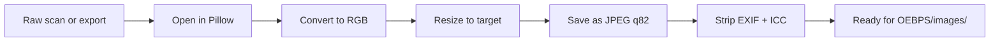

# Module 05: Image Preprocessing and Reader Targeting

Est. study time: 40m
Language: en
Description: Resize images to target device dimensions (Kobo 1404x1872 etc.), set sRGB color, choose JPEG quality 80-85, and pick a one-size-fits-all or per-device strategy. Reader-by-reader dimension table included.

## Knowledge Map

```mermaid
mindmap
  root((Image Preprocessing))
    Dimensions
      Kobo Sage 1404x1872
      Kobo Libra 1264x1680
      Kobo Clara 1072x1448
      Apple iPad 2048x2732
      Kindle Paperwhite 1236x1648
    Color
      sRGB
      no CMYK
      no ICC profiles
    Format
      JPEG q80-85 photos
      PNG line art + transparency
      WebP foreign
    Pipeline
      Pillow or vips
      resize preserve aspect
      strip metadata
      letterbox if needed
```



---

## Learning Objectives (maps to course CILOs)
- Pick correct image dimensions per target reader
- Convert images to sRGB color space and strip metadata
- Choose JPEG quality and format per image type
- Decide between one-size-fits-all and per-device build strategies

---

## Real-World Example

You have 200 page images at 4000x6000 pixels from a scanner. You target Kobo Sage (8" screen, 1404x1872 native). The reader scales the ICB to fit, so any image size works — but the file size of 4000x6000 JPEGs is enormous and the reader still scales them down. A 1404x1872 JPEG at quality 82 is the right size for Kobo Sage: matches the ICB, no scaling artefacts, reasonable file size. For a multi-reader build, pick the largest common dimension or generate per-device builds.

> **Think**: The reader scales the ICB to fit. Does image resolution above the ICB resolution ever help?
>
> *Answer: Marginally. The reader's scaling algorithm may produce slightly sharper results on a high-DPI screen if the image is 1.5x to 2x the ICB. But the file size grows linearly with pixel count, and the visual gain on e-ink is invisible. Match the ICB unless you have a measured reason to upscale.*

---

## Core Content

### Target reader dimensions

The "viewport" you declare per page should match the artwork dimensions. Pick a target reader and size the artwork to that reader's ICB. For multi-reader delivery, pick the largest common dimension or generate per-device builds.

| Device | Screen | Recommended ICB (CSS px) | Aspect |
|--------|--------|--------------------------|--------|
| Kobo Sage / Elipsa 10.3" | 8" / 10.3" | 1404 x 1872 | 3:4 (portrait) |
| Kobo Libra 2 / Libra Colour | 7" | 1264 x 1680 | ~3:4 |
| Kobo Clara BW / Colour | 6" | 1072 x 1448 | ~3:4 |
| Apple iPad Pro 12.9" | 12.9" | 2048 x 2732 | 3:4 |
| Apple iPad 10.2" | 10.2" | 1620 x 2160 | 3:4 |
| Apple iPhone 15 Pro Max | 6.7" | 1290 x 2796 (cropped) | 19.5:9 |
| Kindle Paperwhite 11 | 6.8" | 1236 x 1648 | 3:4 |
| Kindle Oasis 3 | 7" | 1264 x 1680 | ~3:4 |
| Kindle Scribe | 10.2" | 1860 x 2480 | 3:4 |

> **Cloze**: "For a Kobo Sage fixed-layout comic, the recommended viewport meta is {width=1404, height=1872}."
>
> *Answer: width=1404, height=1872*

Most e-readers cluster around a 3:4 aspect ratio. Choosing 1404x1872 as a one-size-fits-all for Kobo + Apple + Kindle Paperwhite loses some sharpness on Apple iPad (which would prefer 2048x2732) but is acceptable for cross-device delivery.

### Color: sRGB only

EPUB reading systems expect sRGB. CMYK images render with shifted colors. ICC profiles in the image are often ignored. Convert to sRGB before packaging and strip embedded profiles.

```bash
# ImageMagick: convert to sRGB and strip profile
convert input.jpg -colorspace sRGB -strip output.jpg
```

```python
# Pillow: convert to sRGB
from PIL import Image
img = Image.open("input.jpg")
if img.mode != "RGB":
    img = img.convert("RGB")
img.save("output.jpg", "JPEG", quality=82, optimize=True)
```

> **Think**: Why is CMYK a problem if the source art was printed as CMYK?
>
> *Answer: Print uses CMYK because ink is subtractive. Screens are additive RGB. A reader's screen cannot display CMYK directly — it has to be converted, and the result is approximate. Worse, the KFX renderer in Kindle often ignores CMYK data entirely, so the image shows as black. Convert to sRGB at production time.*

### JPEG quality

JPEG quality 80-85 is the sweet spot for photographic content. Below 80 artefacts become visible on compression. Above 85 the file size grows without visual gain on e-ink.

| Quality | Use case | File size (1404x1872) |
|---------|----------|------------------------|
| 60-70 | Thumbnail / preview | ~150 KB |
| 80-85 | Production comics | ~300-500 KB |
| 90-95 | Archival master | ~700 KB+ |

> **Predict**: A 200-page comic uses JPEG quality 95. The EPUB is 200 MB. The user cannot send it to Kindle via email (Amazon's limit is 50 MB). What went wrong?
>
> *Answer: Quality 95 is wasteful for e-ink delivery. Quality 82 produces a visually identical result on e-ink at one-third the size. The fix is to re-encode at quality 82 and reduce the total file size to ~50-60 MB.*

### PNG for line art and transparency

JPEG is lossy. For line art (sharp edges, text overlays baked in), JPEG produces visible artefacts around edges. PNG is lossless. Use PNG for:
- Pages with baked-in speech bubbles and text
- Pages with transparency (rare in fixed layout)
- Cover art if it has transparency

For full-color photographic pages, JPEG is fine.

### WebP is foreign

WebP is not a core media type in EPUB 3.3. It requires a fallback image in the manifest. Reader support is inconsistent: newer Kobo firmware may render it, Apple Books is limited, Kindle does not support it. For cross-reader delivery, stick to JPEG and PNG.

### The preprocessing pipeline

```python
from PIL import Image
import os, glob

PAGES_DIR = "raw_pages/"
OUT_DIR = "OEBPS/images/"
TARGET_W, TARGET_H = 1404, 1872
JPEG_QUALITY = 82

os.makedirs(OUT_DIR, exist_ok=True)

for path in sorted(glob.glob(PAGES_DIR + "*")):
    img = Image.open(path)
    if img.mode != "RGB":
        img = img.convert("RGB")
    img = img.resize((TARGET_W, TARGET_H), Image.LANCZOS)
    name = os.path.splitext(os.path.basename(path))[0] + ".jpg"
    img.save(os.path.join(OUT_DIR, name), "JPEG",
             quality=JPEG_QUALITY, optimize=True)
```

This is the entire preprocessing script. Adjust `TARGET_W, TARGET_H` per device, and `JPEG_QUALITY` per taste. The `optimize=True` flag triggers Pillow's entropy coding for smaller files.



> **Spot the Mistake**: A team uses Pillow's default resize, which is `Image.BICUBIC`. The result is slightly blurry on a 200-page manga. The team wonders why.
>
> What's wrong?
>
> *Answer: BICUBIC is fast but not the highest-quality resampler. For downscaling, `Image.LANCZOS` (or vips's `lanczos3`) produces sharper results. The visual difference is most noticeable on line art and high-contrast edges. Use LANCZOS for production.*

### One-size-fits-all vs per-device

| Strategy | Pros | Cons |
|----------|------|------|
| One-size-fits-all (e.g., 1404x1872) | Single build, simple distribution | Sub-optimal on high-DPI tablets and small phones |
| Per-device builds | Optimal on every device | Multiple EPUBs to maintain, distribution complexity |
| Two-tier (small + large) | Compromise | Still requires version management |

For most comics, the one-size-fits-all 1404x1872 build is the right answer. Apple iPad users will see slightly softer pages, but the visual difference on comic art is usually acceptable. Reserve per-device builds for premium or art-book projects.

---

### Why This Matters

Image preprocessing is the single biggest factor in file size and visual quality. A 200 MB EPUB with high-resolution scans is unwieldy; a 50 MB EPUB at the right dimensions and JPEG quality reads beautifully on every device. The pipeline above is the minimum you need.

---

## Key Takeaways
- Match image dimensions to the ICB declared in the viewport meta
- Kobo Sage = 1404x1872, Kobo Libra = 1264x1680, Kobo Clara = 1072x1448
- Apple iPad Pro 12.9" = 2048x2732, Kindle Paperwhite 11 = 1236x1648
- Convert to sRGB; strip ICC profiles; strip EXIF metadata
- JPEG quality 82 is the sweet spot for e-ink delivery
- PNG for line art and transparency; JPEG for photos
- WebP is foreign in EPUB 3.3; use JPEG or PNG
- Resampling: LANCZOS (Pillow) or lanczos3 (vips) for sharpest downscale

---

## Common Misconception

**"Higher resolution always means better quality."**

For e-ink screens, resolution above the screen's native pixel density is invisible. A 4000x6000 JPEG scaled down to a 1072x1448 display looks identical to a 1072x1448 source. The extra pixels cost file size with no visual gain. Match the ICB; do not exceed it.

---

## Spot the Mistake

A team ships a comic as PNG for every page because "PNG is lossless." The EPUB is 800 MB. Users cannot side-load it to Kindle (which has storage limits) and the Kobo struggles to render it.

What's wrong?

*Answer: PNG is lossless, but for photographic content the visual gain over JPEG q82 is invisible on e-ink. The 5x file size cost is not justified. Use JPEG q82 for photo pages; reserve PNG for pages with transparency or sharp line art.*

---

## Feynman Explain

(Explain to a coworker why 200 MB is too large for a 200-page comic. Walk them through pixel dimensions, JPEG quality, and the difference between photographic and line art. No EPUB jargon until they ask.)

---

## Reframe

(Judge the strategy: one-size-fits-all 1404x1872 vs per-device builds. When would you push for per-device? When would you refuse to maintain three EPUBs?)

---

## Drill

Take the quiz. MCQs test recall, application, and scenario recognition.

Run: `learn.sh quiz epub-comics 05-image-preprocessing`
