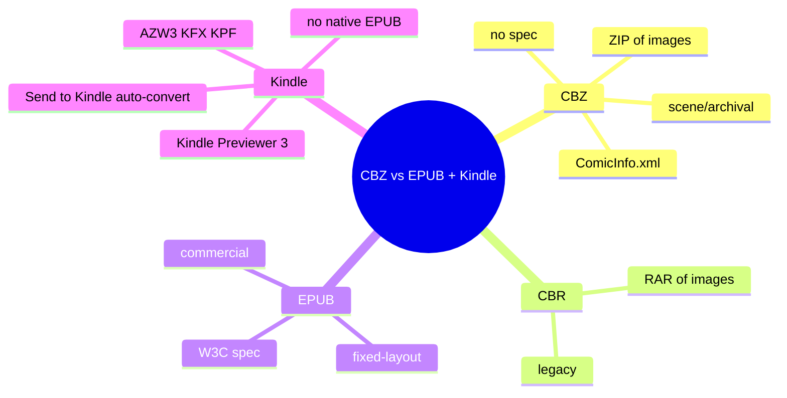
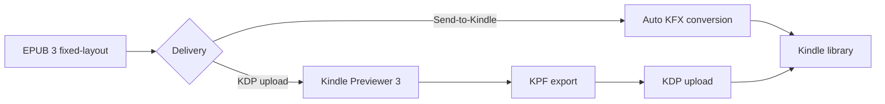

# Module 06: CBZ and CBR vs EPUB plus Kindle Pipeline

Est. study time: 40m
Language: en
Description: CBZ/CBR are legacy archive formats, not modern specs. They fit personal archives and self-hosted libraries. For commercial delivery, fixed-layout EPUB is the answer. The Kindle pipeline: EPUB 3 fixed-layout → Kindle Previewer 3 (KPF) → KFX, or Send-to-Kindle auto-conversion.

## Knowledge Map



---

## Learning Objectives (maps to course CILOs)
- Explain the structure of CBZ and CBR archives
- Decide when CBZ/CBR is appropriate versus fixed-layout EPUB
- Read a ComicInfo.xml metadata block
- Ship an EPUB to Kindle via Kindle Previewer 3 or Send-to-Kindle

---

## Real-World Example

You have a folder of CBZ files you have collected over the years. You want to read them on a Kobo. Kobo does not read CBZ natively. You can convert with Calibre (`ebook-convert input.cbz output.epub`) and the result is a fixed-layout EPUB. The conversion preserves image quality but strips page-level metadata and may mishandle right-to-left manga. The choice between CBZ and EPUB is not "which is better" — it is "personal archive vs commercial distribution."

> **Think**: A scanlation group distributes its manga as CBZ. Modern publishers distribute the same manga as fixed-layout EPUB on Kobo, Apple Books, and Kindle. Why the difference?
>
> *Answer: CBZ is a de facto convention that requires no tooling beyond a ZIP library and an image viewer. Scanlation groups prioritise fast distribution with minimal overhead. Publishers target commercial stores which require EPUB (or PDF, or proprietary formats like AZW). The formats optimise for different goals.*

---

## Core Content

### CBZ: ZIP of images

CBZ is a ZIP archive of images. Pages are sorted alphabetically by filename — the filename order is the reading order. There is no spec, no formal metadata, and no standardisation body. The format dates to David Ayton's CDisplay (~1998) and persists by convention.

```
my-comic.cbz (ZIP)
├── ComicInfo.xml      (optional metadata)
├── 00.jpg             (cover)
├── 01.jpg
├── 02.jpg
├── ...
└── 99.jpg
```

### CBR: RAR of images

CBR is identical to CBZ but uses RAR (often RAR4) instead of ZIP. RAR5 support is inconsistent across readers. Most current projects prefer CBZ because ZIP is universally supported.

### ComicInfo.xml (de facto)

Many CBZ/CBR files include a `ComicInfo.xml` at the archive root. The format originated with ComicRack and is now maintained by the Anansi Project (community governance). Version 2.0 is current; 2.1 is in draft.

```xml
<?xml version="1.0" encoding="utf-8"?>
<ComicInfo>
  <Title>My Comic Issue 1</Title>
  <Series>My Comic</Series>
  <Number>1</Number>
  <Summary>A short description.</Summary>
  <Writer>Author Name</Writer>
  <Penciller>Artist Name</Penciller>
  <Publisher>Self-published</Publisher>
  <Year>2026</Year>
  <Month>9</Month>
  <PageCount>24</PageCount>
  <LanguageISO>en</LanguageISO>
  <Manga>No</Manga>
</ComicInfo>
```

> **Cloze**: "The de facto metadata file embedded at the root of many CBZ/CBR archives is {ComicInfo.xml}."
>
> *Answer: ComicInfo.xml*

### Reader support in 2026

| Reader | Reads CBZ? | Reads fixed-layout EPUB? |
|--------|-----------|--------------------------|
| Kobo | No (EPUB + KEPUB + PDF only) | Yes |
| Apple Books | No (EPUB + PDF only) | Yes (best-in-class) |
| Kindle | No (AZW3 + KFX + PDF) | Via KPF/KFX conversion |
| Calibre | Yes | Yes |
| YACReader | Yes | Yes |
| Komga / Kavita (self-hosted) | Yes (streams pages) | N/A (streaming) |
| Onyx Boox (e-ink tablet) | Yes (built-in reader) | Yes |
| PocketBook e-reader | Yes (built-in) | Yes |

> **Think**: A user with a Kobo Sage and a large CBZ library wants to read on the Kobo. What is the practical path?
>
> *Answer: Convert CBZ to fixed-layout EPUB with Calibre (`ebook-convert input.cbz output.epub`) and side-load the EPUB. The conversion preserves image quality. Page-level ComicInfo metadata is dropped. Manga R2L reading direction may need manual adjustment of `page-progression-direction` in the OPF spine.*

### CBZ is legacy, EPUB is the modern spec

CBZ/CBR are not a "modern spec" — they are a de facto convention with no standards body. EPUB 3 fixed-layout is a W3C Recommendation with formal conformance requirements. Commercial stores (Kobo, Apple Books, Kindle) sell and read EPUB (or EPUB-derived formats). They do not sell or natively read CBZ.

> **Spot the Mistake**: A team decides to distribute their comic as CBZ because "it is simpler — just a ZIP of images." The Kobo and Apple Books stores reject the file.
>
> What's wrong?
>
> *Answer: Kobo and Apple Books do not accept CBZ. They require EPUB (or PDF). CBZ is for personal archiving and self-hosted libraries, not commercial distribution. For commercial delivery, package as fixed-layout EPUB.*

### The Kindle pipeline

Kindle does not read EPUB directly. Two paths:

**Path 1: Send-to-Kindle (easiest)**
1. Email the EPUB to your Send-to-Kindle address (or use the Send to Kindle app)
2. Amazon's server converts EPUB to KFX automatically
3. The book appears in your Kindle library

Caveats:
- Conversion is lossy for fixed-layout; spreads and panels sometimes distort
- File size limit 50 MB for email, 200 MB for the app
- Amazon may add DRM (serverside)

**Path 2: Kindle Previewer 3 (more control)**
1. Download Kindle Previewer 3 (macOS/Windows, free)
2. Open the EPUB
3. Preview as KF8 / KFX / Mobi
4. Export to KPF (Kindle Package Format) for direct upload to KDP
5. Optionally convert to AZW3 for sideloading

Kindle Previewer 3 catches Kindle-specific issues (panel view, font support, fixed-layout rendering) before upload. This is the recommended path for fixed-layout comics targeting Kindle.



> **Predict**: A user sends a fixed-layout comic EPUB to Send-to-Kindle. The book appears in their library, but on the Kindle the panels are slightly misaligned. Why?
>
> *Answer: The Send-to-Kindle auto-conversion to KFX is lossy for fixed layout. Panel coordinates may shift slightly. The fix is to use Kindle Previewer 3, validate the rendering locally, and either accept the result or adjust the EPUB before re-uploading.*

### Cross-reader checklist

| Step | Kobo | Apple Books | Kindle |
|------|------|-------------|--------|
| Format | EPUB 3 fixed-layout | EPUB 3 fixed-layout | EPUB 3 → KPF → KFX |
| Validation | EPUBCheck (optional) | EPUBCheck (optional) | Kindle Previewer 3 |
| Image format | JPEG / PNG | JPEG / PNG | JPEG (preferred) |
| Color | sRGB | sRGB | sRGB |
| CSS | Spec-clean | Spec-clean + optional `-apple-` extensions | KFX-safe subset |
| FXL features | Full spec | Full spec + extensions | Partial; test on device |

---

### Why This Matters

Choosing CBZ vs EPUB is the distribution decision. Choosing Send-to-Kindle vs Kindle Previewer 3 is the quality decision. Both are independent of the file-build pipeline in modules 01-05. Once the EPUB is built, the delivery step is just routing.

---

## Key Takeaways
- CBZ is a ZIP of images; CBR is a RAR. Neither is a formal spec.
- ComicInfo.xml is a de facto metadata format (Anansi Project, v2.0)
- Kobo, Apple Books, and Kindle do not read CBZ natively
- For commercial distribution, fixed-layout EPUB is the answer
- Calibre converts CBZ to EPUB; page-level metadata and manga R2L are lossy
- Kindle cannot read EPUB directly; use Send-to-Kindle or Kindle Previewer 3
- Kindle Previewer 3 produces KPF (Kindle Package Format) for KDP upload
- Send-to-Kindle auto-converts to KFX; lossy for fixed layout

---

## Common Misconception

**"CBZ is a modern comic distribution format."**

It is a de facto convention from 1998, not a spec. Modern publishers distribute comics as fixed-layout EPUB. CBZ is for personal archives and self-hosted libraries (Komga, Kavita). The two formats serve different goals.

---

## Spot the Mistake

A team delivers a comic to Kobo, Apple Books, and Kindle by converting the source CBZ to EPUB once with Calibre and uploading the same file to all three stores. On Kindle, the manga is read left-to-right instead of right-to-left.

What's wrong?

*Answer: Calibre's comic-to-EPUB conversion often drops the manga R2L reading direction. The fix is to manually set `<spine page-progression-direction="rtl">` in the content.opf after conversion, or to re-package the EPUB from the source images (modules 01-05) with the correct direction set.*

---

## Feynman Explain

(Explain to a coworker why the same comic has three different delivery paths for Kobo, Apple Books, and Kindle. Walk them through the role of EPUB 3 fixed-layout as the common starting point and the conversion step that each platform requires. No EPUB jargon until they ask.)

---

## Reframe

(Judge the strategy: is the Send-to-Kindle auto-conversion acceptable for personal use? When would you push for Kindle Previewer 3 + KPF even for personal use? When would you accept the lossy conversion?)

---

## Drill

Take the quiz. MCQs test recall, application, and scenario recognition.

Run: `learn.sh quiz epub-comics 06-cbz-kindle`
