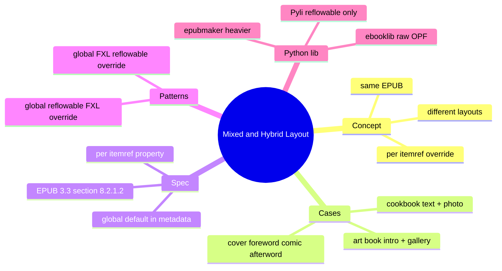
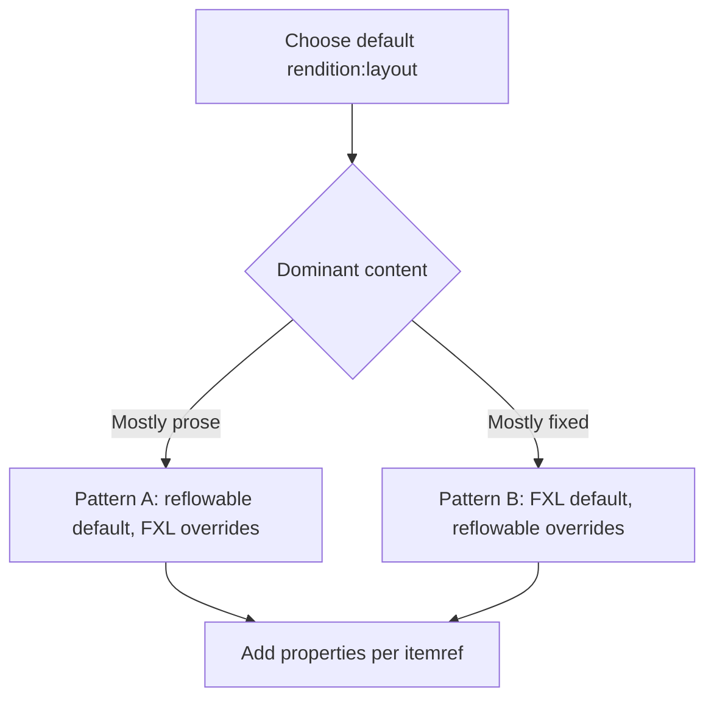
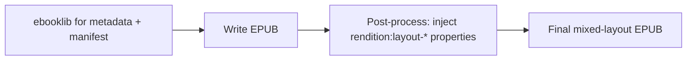

# Module 07: Mixed and Hybrid Layout

Est. study time: 50m
Language: en
Description: Combine fixed-layout and reflowable pages in the same EPUB. Per-itemref override of `rendition:layout`. Real cases. Python library reference. Hands-on OPF pattern.

## Knowledge Map



---

## Learning Objectives (maps to course CILOs)
- Define mixed/hybrid layout and identify real-world use cases
- Override `rendition:layout` per `<itemref>` in the spine
- Choose the right global default and per-itemref override pattern
- Identify which Python library to use for mixed EPUB and what its limitations are
- Sketch the OPF skeleton for a mixed-layout book from memory

---

## Real-World Example

You publish a comic with an author foreword. The foreword is plain prose (reflowable is right). The comic itself is image-based (fixed layout is right). The afterword is a thank-you note from the artist (reflowable again). One EPUB, three layout sections. This is mixed layout.

> **Think**: Why not just put everything in fixed layout? The foreword would render as one image per page.
>
> *Answer: Reflowable text is the right user experience for prose. The reader can resize the text. Fixed layout forces a specific font size and reflows awkwardly. The cost of mixing is one extra OPF property per itemref — a small price for the right reading experience per section.*

---

## Core Content

### What "mixed" means

A mixed-layout EPUB (業界口語: mixed layout; 混合式版面; Hybrid layout) is a single EPUB that contains both fixed-layout and reflowable pages. The package metadata declares a default `rendition:layout`; individual `<itemref>` elements override that default for the pages where the override applies.

> **Cloze**: "A mixed-layout EPUB uses the OPF property {rendition:layout} declared globally in metadata, with per-itemref overrides in the spine."
>
> *Answer: rendition:layout*

### Real cases

| Case | Reflowable section | Fixed-layout section |
|------|--------------------|-----------------------|
| Graphic novel with prose | Author foreword, afterword, bonus text | Comic pages |
| Cookbook with photos | Ingredient lists, instructions | Full-bleed photo pages |
| Art book | Artist biography, exhibition notes | Gallery pages |
| Children's picture book | Read-aloud narration text | Illustration pages |
| Manga with author note | Translator's note, author bio | Manga pages |

The pattern is always the same: prose goes reflowable, art goes fixed. The OPF wires them up with per-itemref properties.

### Spec mechanics: EPUB 3.3 §8.2.1.2

The package metadata declares the default:

```xml
<meta property="rendition:layout">reflowable</meta>
```

Individual `<itemref>` elements in the spine override the default:

```xml
<itemref idref="cover"   properties="rendition:layout-pre-paginated"/>
<itemref idref="foreword" properties="rendition:layout-reflowable"/>
<itemref idref="page001" properties="rendition:layout-pre-paginated"/>
<itemref idref="page002" properties="rendition:layout-pre-paginated"/>
<itemref idref="afterword" properties="rendition:layout-reflowable"/>
```

The two valid values for the property are `rendition:layout-pre-paginated` (fixed) and `rendition:layout-reflowable`. The default (when the property is absent on the itemref) is the package-level `rendition:layout`.

> **Predict**: A builder writes `<itemref idref="page001" properties="pre-paginated"/>` without the `rendition:layout-` prefix. What happens?"
>
> *Answer: The reader does not recognise the property. The itemref falls back to the package-level default. For a reflowable-default package, the page renders as reflowable despite the intent. The property must be the full URI value, not the short alias.*

### Two OPF patterns

**Pattern A: Global reflowable, FXL sections override**

Use when the book is mostly prose with a few fixed-layout sections (graphic novel with foreword, cookbook with photo chapters).

```xml
<meta property="rendition:layout">reflowable</meta>
...
<spine>
  <itemref idref="nav"/>
  <itemref idref="foreword"/>
  <itemref idref="page001" properties="rendition:layout-pre-paginated"/>
  <itemref idref="page002" properties="rendition:layout-pre-paginated"/>
  <itemref idref="afterword"/>
</spine>
```

**Pattern B: Global FXL, reflowable sections override**

Use when the book is mostly fixed layout with a few reflowable sections (comic with author note, art book with intro).

```xml
<meta property="rendition:layout">pre-paginated</meta>
...
<spine>
  <itemref idref="nav"/>
  <itemref idref="cover"/>
  <itemref idref="page001"/>
  <itemref idref="foreword" properties="rendition:layout-reflowable"/>
  <itemref idref="page002"/>
  <itemref idref="afterword" properties="rendition:layout-reflowable"/>
</spine>
```

Pattern A is the more common case. Pick whichever matches the dominant content type.



### CSS implications

Each page XHTML still needs its own viewport meta if it is fixed layout. Reflowable pages do not need a viewport meta (the reader computes it from the device).

```html
<!-- FXL page -->
<head>
  <meta name="viewport" content="width=1404, height=1872"/>
  <link rel="stylesheet" href="../styles/fxl.css"/>
</head>

<!-- Reflowable page -->
<head>
  <link rel="stylesheet" href="../styles/reflow.css"/>
</head>
```

You can use two stylesheets (one for FXL, one for reflowable) or one stylesheet with media queries. For the safe subset, two stylesheets is simpler.

> **Spot the Mistake**: A builder sets the package default to `pre-paginated` and forgets to add the per-itemref override on the foreword. The foreword renders as a single page with one image (or as a reflowable page that the reader tries to interpret as FXL).
>
> What's wrong?
>
> *Answer: The foreword's itemref needs `properties="rendition:layout-reflowable"` to override the global `pre-paginated` default. Without the override, the reader treats the foreword as FXL and the prose reflows unpredictably. Always set the override on reflowable sections when the global is FXL.*

### Reader support

| Reader | Mixed layout support | Caveats |
|--------|----------------------|---------|
| Kobo | Full | Honors per-itemref properties |
| Apple Books | Full | Honors per-itemref properties |
| Kindle (KFX) | Partial | Conversion may misclassify; test on device |
| Readium SDK | Full | Reference implementation |

> **Think**: Why does Kindle conversion sometimes misclassify mixed-layout sections?
>
> *Answer: The Send-to-Kindle auto-conversion and Calibre's EPUB-to-KFX conversion both look at the package-level `rendition:layout` and may not always honor per-itemref overrides. Kindle Previewer 3 with local validation is the safer path for mixed-layout Kindle delivery.*

### Python library reference

The course tool is `ebooklib`, the most common Python library for EPUB generation.

| Library | Mixed layout support | Notes |
|---------|----------------------|-------|
| `ebooklib` | Partial (since v0.18) | Supports per-itemref properties; FXL story is thin; need to inject raw OPF for `rendition:layout-*` |
| `epubmaker` | Full | Heavier API; more control; smaller community |
| `Pyli` | None | Reflowable only — not suitable for mixed |
| `pandoc` | None (reflowable only) | Not suitable for any FXL work |

For the mixed-layout case, the recommended approach is `ebooklib` with raw OPF injection for the `rendition:layout-*` properties that the high-level API does not expose:

```python
from ebooklib import epub
import zipfile

# Build the book with ebooklib
book = epub.EpubBook()
# ... add metadata, manifest items, default spine ...

# After epub.write_epub(), inject the per-itemref properties by post-processing
# the content.opf inside the ZIP
```

Most production pipelines for mixed-layout EPUB fall back to the manual `zip`-based approach from module 03 because the OPF control is total. The Python library adds convenience for the metadata and manifest; the spine properties are easier to write by hand.



> **Predict**: A team uses `ebooklib` exclusively to build a mixed-layout EPUB. The Kobo renders correctly. Apple Books shows the reflowable sections as fixed. Why?
>
> *Answer: ebooklib's high-level API may not set the per-itemref `rendition:layout-*` properties correctly, or the property names may not match what Apple Books expects. The fix is to inject the properties via raw OPF manipulation, or to fall back to the manual zip-based approach for the spine.*

### Hands-on: sketch the OPF from memory

Pretend you are building a graphic novel:

1. Cover (FXL)
2. Foreword by the author (reflowable, 2 paragraphs)
3. Comic pages 1-5 (FXL)
4. Afterword (reflowable, thank-you note)

Without looking at the examples above, write the OPF metadata, manifest, and spine. Then compare.

```xml
<!-- metadata: default reflowable, override per itemref -->
<meta property="rendition:layout">reflowable</meta>

<!-- manifest: every resource -->
<item id="nav" href="nav.xhtml" media-type="application/xhtml+xml" properties="nav"/>
<item id="cover" href="cover.xhtml" media-type="application/xhtml+xml"/>
<item id="cover-img" href="images/cover.jpg" media-type="image/jpeg" properties="cover-image"/>
<item id="foreword" href="foreword.xhtml" media-type="application/xhtml+xml"/>
<item id="page001" href="pages/page001.xhtml" media-type="application/xhtml+xml"/>
<item id="page002" href="pages/page002.xhtml" media-type="application/xhtml+xml"/>
<item id="page003" href="pages/page003.xhtml" media-type="application/xhtml+xml"/>
<item id="page004" href="pages/page004.xhtml" media-type="application/xhtml+xml"/>
<item id="page005" href="pages/page005.xhtml" media-type="application/xhtml+xml"/>
<item id="afterword" href="afterword.xhtml" media-type="application/xhtml+xml"/>
<item id="css-fxl" href="styles/fxl.css" media-type="text/css"/>
<item id="css-reflow" href="styles/reflow.css" media-type="text/css"/>

<!-- spine: per-itemref override -->
<spine>
  <itemref idref="cover" properties="rendition:layout-pre-paginated"/>
  <itemref idref="foreword" properties="rendition:layout-reflowable"/>
  <itemref idref="page001" properties="rendition:layout-pre-paginated"/>
  <itemref idref="page002" properties="rendition:layout-pre-paginated"/>
  <itemref idref="page003" properties="rendition:layout-pre-paginated"/>
  <itemref idref="page004" properties="rendition:layout-pre-paginated"/>
  <itemref idref="page005" properties="rendition:layout-pre-paginated"/>
  <itemref idref="afterword" properties="rendition:layout-reflowable"/>
</spine>
```

> **Cloze**: "In a mixed-layout EPUB, the per-itemref property that activates fixed layout for a single spine entry is {rendition:layout-pre-paginated}."
>
> *Answer: rendition:layout-pre-paginated*

---

### Why This Matters

Mixed layout is the most general case. Many real books have prose and art in the same package. The per-itemref override is the spec mechanism that makes this work. Once you understand it, the rest of EPUB is repetition of patterns you already know.

---

## Key Takeaways
- Mixed/hybrid layout = same EPUB, different layouts per page
- Package metadata declares the default `rendition:layout`; per-itemref properties override
- Valid override values are `rendition:layout-pre-paginated` and `rendition:layout-reflowable`
- Pattern A: reflowable default, FXL sections override (most common)
- Pattern B: FXL default, reflowable sections override
- Each FXL page still needs its own viewport meta
- Kobo and Apple Books honor per-itemref overrides fully; Kindle may misclassify
- `ebooklib` is the common Python library but the FXL/mixed story is thin; raw OPF injection is often required
- For mixed-layout Python pipelines, fall back to the manual zip-based approach for full OPF control

---

## Common Misconception

**"An EPUB is either fixed or reflowable, not both."**

EPUB 3 supports per-itemref layout overrides. A single EPUB can mix the two. The package metadata declares the default; individual spine entries override. This is one of the most underused features of EPUB 3.

---

## Spot the Mistake

A team builds a mixed-layout EPUB. They set `rendition:layout` = `reflowable` at the package level. They add the FXL comic pages to the spine with no `properties` attribute. The reader renders the entire book as reflowable; the comic pages are unreadable.

What's wrong?

*Answer: The FXL pages need `properties="rendition:layout-pre-paginated"` on each itemref to override the reflowable default. Without the property, the itemref falls back to the global default and the pages render as reflowable. Always set the override on every FXL itemref in a reflowable-default package.*

---

## Feynman Explain

(Explain to a coworker why a graphic novel EPUB might have both fixed-layout and reflowable pages. Walk them through the OPF metadata, the per-itemref properties, and how the reader decides which layout to use. No EPUB jargon until they ask.)

---

## Reframe

(Judge the design: is mixed layout worth the added OPF complexity? When would you push for an all-reflowable book even with art? When would you defend the per-itemref overrides?)

---

## Drill

Take the quiz. MCQs test recall, application, and scenario recognition.

Run: `learn.sh quiz epub-comics 07-mixed-hybrid`
