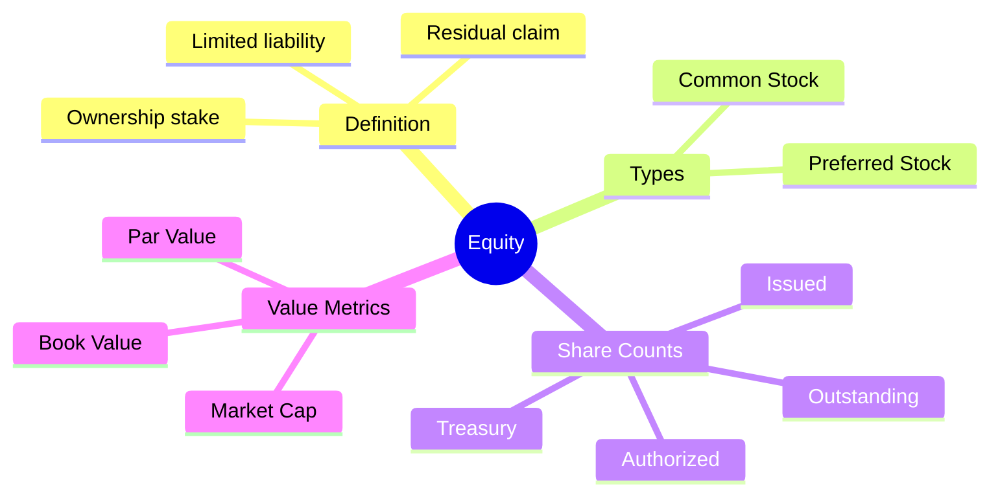
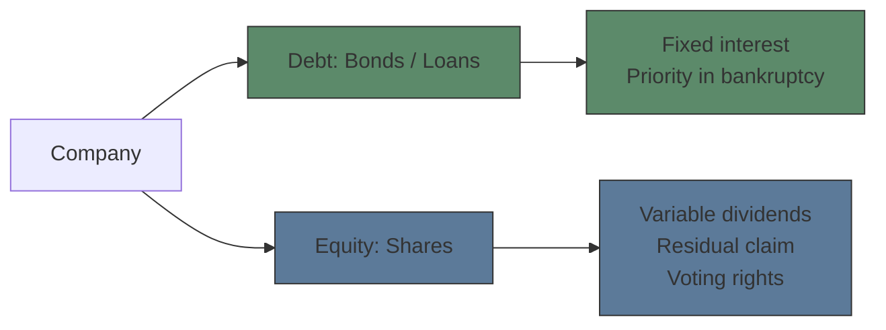
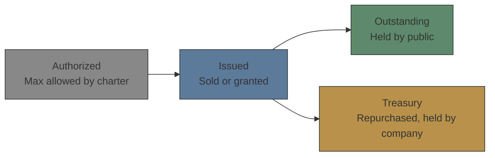

# Module 1: What Is Equity

Est. study time: 2.0h
Language: en
Description: Stock definition, common vs preferred, shares outstanding, market cap

## Knowledge Map

---

## Learning Objectives
- Define equity and explain how equity differs from debt
- Distinguish common stock from preferred stock
- Differentiate authorized, issued, outstanding, and treasury shares
- Calculate market capitalization and interpret what it represents

---

## Real-World Example

Your colleague says: "Apple's market cap is $3T — that means Apple has $3 trillion cash in the bank, right?" You know that's wrong, but can you explain why? And when someone says "Apple has 15.5 billion shares outstanding" — what does *outstanding* actually mean?

> **Think**: If market cap is not cash, what does it measure? Is Apple worth $3T or is that just the stock price times shares?
>
> *Answer: Market cap = price × shares outstanding. It measures aggregate equity value assigned by the market, not cash held. Apple's actual cash on hand is ~$60B — a fraction of $3T. Market cap reflects investor expectations of future profits, not a bank balance.*

---

## Core Content

### Section 1: What Is Equity?

Equity = ownership in a company. When you buy a share, you buy a slice of the business: a proportional claim on assets and earnings after all debts are paid (residual claim).

Key difference from debt:
- Debt pays fixed interest. Equity pays variable dividends (or none).
- Debt holders get paid first in bankruptcy. Equity holders get whatever remains.
- Debt has maturity date. Equity is perpetual (no repayment obligation).
- Equity carries voting rights (usually). Debt does not.

> **Think**: Company goes bankrupt with $100M assets, $80M debt. How much do equity holders get?
>
> *Answer: $20M ($100M - $80M). Equity = residual claim. Everything left after debt is paid. If debt were $120M, equity gets $0 — shares become worthless.*

> **Cloze**: "Equity holders have a {residual claim} on company assets, meaning they get paid only after all {debt holders} are satisfied."
>
> *Answer: residual claim, debt holders*

### Section 2: Common Stock vs Preferred Stock

Not all equity is the same. Two main classes:

| Feature | Common Stock | Preferred Stock |
|---------|-------------|-----------------|
| Dividends | Variable (board decides) | Fixed (stated rate) |
| Voting | Yes (usually 1 vote/share) | No (usually) |
| Bankruptcy priority | Last | Before common, after debt |
| Price volatility | Higher | Lower (behaves like bond) |
| Dividend accumulation | Not cumulative (unless stated otherwise) | Cumulative by default for most US preferreds — missed dividends accrue |

> **Think**: Why would an investor buy preferred stock if it has lower upside than common?
>
> *Answer: Preferred offers steady fixed income (like a bond) with higher priority than common. An insurance company or pension fund might prefer predictable dividends over common stock volatility. Preferred also pays before common dividends.*

> **Cloze**: "Preferred stock dividends are typically {cumulative} — if the company skips a dividend payment, it must pay {all missed payments} before paying common dividends."
>
> *Answer: cumulative, all missed payments*

> **Spot the Mistake**: "Preferred stock is better than common stock because dividends are guaranteed and you get paid first."
>
> What's wrong?
>
> *Answer: Preferred dividends are fixed but NOT guaranteed — they can be suspended (though cumulative). And "paid first" is only relative to common; debt holders get paid before both preferred and common. Preferred is junior to all debt.*

### Section 3: Shares — Authorized, Issued, Outstanding, Treasury

Share counts matter. Four distinct concepts:

- **Authorized**: Maximum shares company can issue (set in charter). Changing requires shareholder vote.
- **Issued**: Shares actually sold or granted to anyone (public + insiders + treasury).
- **Outstanding**: Shares held by investors (public + insiders). Used for market cap calc and voting.
- **Treasury**: Shares company bought back. Issued but not outstanding. No voting, no dividends.

Formula: `Issued = Outstanding + Treasury`

> **Think**: Company authorized 100M shares, issued 80M, bought back 5M. What's outstanding? Why does buyback reduce outstanding?
>
> *Answer: Outstanding = 80M - 5M = 75M. Buyback reduces outstanding because company removes those shares from public circulation. Less supply, each remaining share represents larger ownership slice. EPS often rises after buyback (same earnings ÷ fewer shares).*

> **Predict**: Company announces $10B buyback. What happens to outstanding shares and EPS?
>
> *Answer: Outstanding shares decrease (company buys and retires shares). EPS increases because net income is divided by fewer shares. This is one reason buybacks boost stock price — not just demand signal but mechanical EPS improvement.*

### Section 4: Market Capitalization

Market cap = share price × shares outstanding

Size categories (guidelines, not official):
| Category | Market Cap |
|----------|-----------|
| Mega-Cap | >$200B |
| Large-Cap | $10B - $200B |
| Mid-Cap | $2B - $10B |
| Small-Cap | $300M - $2B |
| Micro-Cap | $50M - $300M |

Market cap does NOT equal company value in cash — it reflects what investors collectively think the equity is worth, incorporating expectations of future earnings, growth, and risk.

> **Think**: Stock price drops 20% on bad earnings. Did the company lose 20% of its cash? What actually happened?
>
> *Answer: No cash was lost. Market repriced expected future earnings downward. Shareholders' collective valuation fell. Market cap decline = wealth transfer in perception, not cash destroyed.*

> **Cloze**: "A company with stock price $50 and 200M shares outstanding has a market cap of {($50 × 200M = $10B)}."
>
> *Answer: $10B*

---

### Why This Matters

Every trade, every valuation, every earnings report starts here. "Shares outstanding" drives EPS calculation — single most-watched metric. Market cap determines index membership (S&P 500 = large-cap only). Preferred vs common affects dividend strategy for income investors. If you don't know whether you're trading common or preferred, you might buy a stock that trades like a bond, or issue shares without authorized capacity. This foundation prevents basic-but-expensive mistakes.

---

## Key Takeaways
- Equity = residual ownership after all debts paid. Different from debt in priority, payout, and duration.
- Common stock has voting rights and variable dividends. Preferred has fixed dividends, no vote, higher bankruptcy priority.
- Authorized ≥ Issued ≥ Outstanding. Treasury shares = issued but not outstanding.
- Market Cap = Price × Outstanding Shares. Measures market's expected value, not cash on hand.
- Buybacks reduce outstanding shares → mechanically boost EPS.

---

## Common Misconception

**"More shares outstanding means the company is bigger."**
Wrong. Number of shares is arbitrary — a company can split (2:1 → doubles shares, halves price, market cap unchanged). Market cap is the size metric, not share count. Apple has 15.5B shares outstanding; Berkshire Hathaway has ~1.45M Class A shares. Berkshire is worth ~$900B, not proportional to share count at all.

---

## Spot the Mistake

"Company XYZ has 10M authorized shares, 8M issued, 2M treasury. Outstanding shares = 10M."

What's wrong?

*Answer: Outstanding = Issued - Treasury = 8M - 2M = 6M. Authorized is the cap, not the current count. Outstanding is what's in public hands.*

---

## Feynman Explain
(Explain "equity" to a colleague who only understands bonds. Use simplest words. Start with: "Imagine you and I start a lemonade stand...")

---

## Reframe
(Pause. Judge: Is equity inherently riskier than debt? When would you prefer preferred stock over bonds? When is market cap misleading? Write evaluation.)

---

## Drill
Run: `learn.sh quiz equity-trading 1`
Run: `learn.sh cloze equity-trading 1`
