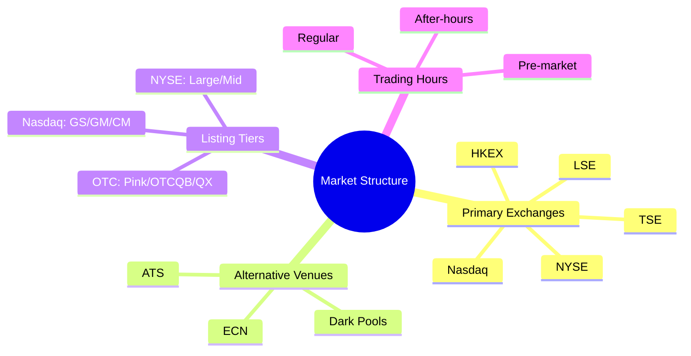
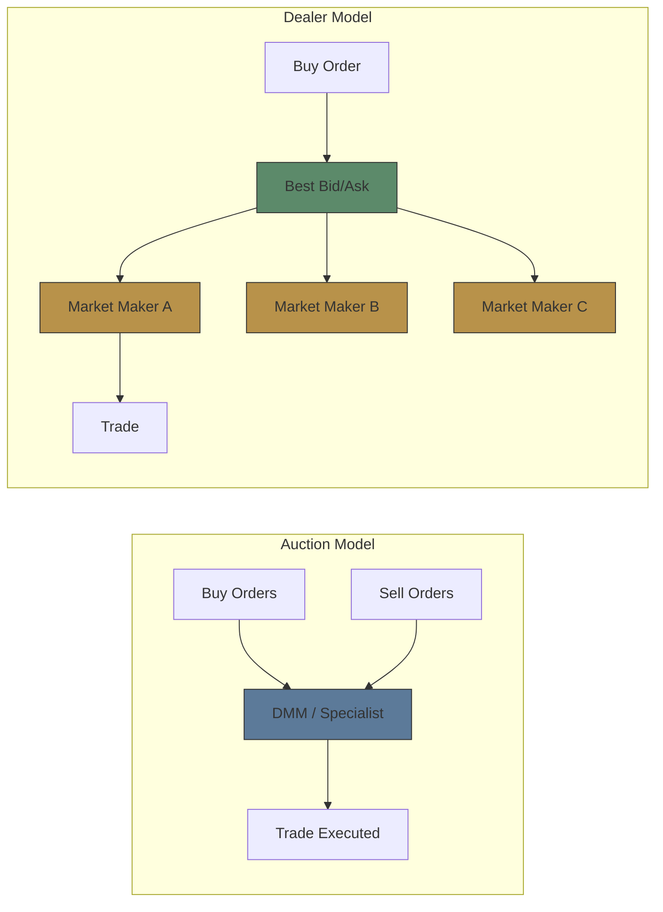

# Module 2: Stock Exchanges & Market Structure

Est. study time: 2.0h
Language: en
Description: NYSE, Nasdaq, listing tiers, trading hours, dark pools, ATS

## Knowledge Map

---

## Learning Objectives
- Compare exchange models: auction (NYSE) vs dealer (Nasdaq)
- Distinguish listing tiers and their requirements
- Identify alternative trading venues (dark pools, ATS, ECN)
- Describe trading sessions and their liquidity characteristics

---

## Real-World Example

You place a market order to buy 100 shares of Apple at 9:35 AM ET. The fill comes back at $178.02 — but Apple's last trade before your order was $177.95. Your colleague says "the exchange ripped you off." Did it? Or is the price difference normal market mechanics?

> **Think**: What determines the price you actually pay? Is it the exchange itself, or someone on the other side of the trade?
>
> *Answer: Your buy order matched with a sell order at $178.02. The exchange just facilitates the match. Price moved because someone was willing to sell at $178.02 — liquidity dynamics, not exchange malfeasance. Spread and order flow determine exact fill price.*

---

## Core Content

### Section 1: Primary Exchanges — Auction vs Dealer Model

Two dominant US exchange models:

**NYSE (Auction / Specialist Model):**
- Designated Market Maker (DMM) assigned to each stock
- DMM maintains fair & orderly market, steps in when no natural buyers/sellers
- Physically trades at floor + electronic (NYSE Arca)
- Used for larger, blue-chip companies
- DMM can delay open if order imbalance detected

**Nasdaq (Dealer / Electronic Model):**
- Multiple competing market makers per stock
- All electronic — no trading floor
- Quote-driven: dealers post bid/ask, trades route to best price
- Faster execution, narrower spreads for liquid names
- Used for tech/growth companies historically

> **Think**: Which model gives you better price for a liquid stock like Apple vs an illiquid penny stock? Why?
>
> *Answer: For liquid stocks (Apple), Nasdaq's competing dealers narrow the spread — best price wins. For illiquid stocks, NYSE's DMM provides continuity — they're obligated to trade when no one else will, reducing gap risk. Each model optimized for different liquidity profiles.*

> **Cloze**: "NYSE uses an {auction model} with a designated {DMM} maintaining order. Nasdaq uses a {dealer model} with multiple competing {market makers}."
>
> *Answer: auction model, DMM, dealer model, market makers*

### Section 2: Listing Tiers

Not all stocks trade on NYSE or Nasdaq. Listing requirements determine tier:

| Tier | Exchange | Min Market Cap | Other Requirements |
|------|----------|---------------|-------------------|
| NYSE Listed | NYSE | $100M+ | $4 min price, earnings test |
| Nasdaq GS | Nasdaq | $100M+ | $4 min price, strict governance |
| Nasdaq CM | Nasdaq | $50M+ | $2 min price, lower standards |
| OTCQX | OTC Markets | No min | Financial reporting required |
| OTCQB | OTC Markets | No min | Current reporting |
| Pink Sheets | OTC Markets | None | No reporting required |

Moving from OTC Pink to Nasdaq requires: clean audit, $4+ stock price, shareholder equity >$5M, SEC reporting, underwriter.

> **Think**: Why would a company choose Nasdaq over NYSE? What signals does the choice send?
>
> *Answer: Nasdaq historically signals tech/growth. NYSE signals established blue-chip. Fees differ. Some institutional mandates restrict to NYSE-listed. The choice matters for investor perception — a biotech startup listing on NYSE might look premature; a mature industrial on Nasdaq might seem unusual.*

> **Predict**: Company trades at $1.20 on OTC Pink, announces NASDAQ listing application. What likely happens to price?
>
> *Answer: Price typically jumps. Nasdaq listing = higher visibility, institutional eligibility, stricter governance = perceived quality upgrade. But must maintain $4 minimum — risk of reverse split if price too low.*

### Section 3: Alternative Trading Venues

Trades don't have to go to NYSE/Nasdaq. Three alternatives:

**Dark Pools:**
- Private exchanges where orders don't show in public order book
- Institutional investors use to avoid moving price (information leakage)
- No pre-trade transparency — trade reported after execution
- ~40% of US equity volume now in dark pools

**ATS (Alternative Trading System):**
- Registered broker-dealer that matches orders
- Includes dark pools + some lit venues
- Must register with SEC, report trades
- Examples: Liquidnet, Luminex

**ECN (Electronic Communication Network):**
- Automated matching of limit orders
- Shows quotes to subscribers
- Used by HFT firms
- Many now absorbed into exchanges or ATS structures

> **Think**: Why would a pension fund selling 2M shares of IBM prefer a dark pool over NYSE?
>
> *Answer: Selling 2M on NYSE would show in order book → other traders see pressure → bid side drops → worse execution price. Dark pool hides the order → trade fills at midpoint or better. Reduced market impact saves millions. This is "information leakage" — the biggest cost of large trades.*

> **Cloze**: "Institutional investors use {dark pools} to execute large orders without revealing their {intent} to the market. This avoids {information leakage}."
>
> *Answer: dark pools, intent, information leakage*

### Section 4: Trading Hours

Three sessions in US equities:

| Session | Time (ET) | Liquidity | Spreads |
|---------|----------|-----------|---------|
| Pre-market | 4:00 AM - 9:30 AM | Low | Wide |
| Regular | 9:30 AM - 4:00 PM | High | Tight |
| After-hours | 4:00 PM - 8:00 PM | Low | Wide |

**Key patterns:**
- Opening auction (9:30) and closing auction (4:00) concentrate ~10-15% of daily volume
- Mid-day (12-2 PM) often lowest volatility
- 10:30-11:30 AM = highest volume (overnight positioning resolved)
- Last 30 min = increased activity (ETF rebalancing, institutional closing orders)

> **Think**: Retail trader places market order at 7:30 AM ET. Why is this risky?
>
> *Answer: Pre-market liquidity is thin — few participants. A market order could fill at extreme price (wide spread). Bid-ask could be 50¢ vs 2¢ during regular hours. Professional advice: use limit orders outside regular hours, or wait for regular session.*

> **Spot the Mistake**: "Dark pools are illegal because they hide prices from the public."
>
> What's wrong?
>
> *Answer: Dark pools are legal SEC-regulated venues. They exist precisely because large trades need privacy to function efficiently. Post-trade transparency still exists — trades are reported. Pre-trade opacity is the feature, not a bug. ~40% of US volume goes through dark pools.*

---

### Why This Matters

Where and when you trade directly impacts your P&L. Trading a small-cap stock in after-hours with a market order can cost 5-10% in slippage. Knowing which venue handles your stock (Nasdaq for tech, NYSE for industrials) helps you predict liquidity and spread. Understanding dark pools explains why large prints don't always move the tape.

---

## Key Takeaways
- NYSE = auction/DMM model. Nasdaq = dealer/multiple MM model.
- Listing tiers reflect reporting standards and size. OTC is unregulated relative to exchange-listed.
- Dark pools hide order flow to reduce market impact for large trades.
- ~40% of US equity volume is off-exchange.
- Pre/after-hours have wide spreads. Limit orders recommended.

---

## Common Misconception

**"All stocks trade on NYSE or Nasdaq."**
False. Thousands trade OTC (Pink Sheets, OTCQB, OTCQX). Many foreign companies trade as ADRs on OTC markets. Only ~3,000 stocks on NYSE, ~3,300 on Nasdaq — but OTC lists ~10,000+ securities.

---

## Spot the Mistake

"NYSE and Nasdaq are the same — just different computers matching orders."

What's wrong?

*Answer: Different models entirely. NYSE has a physical floor and DMMs who can delay opens and provide liquidity in stressed conditions. Nasdaq is fully electronic with competing dealers. NYSE lists ~2800 stocks, Nasdaq ~3300. Governance requirements differ. The models produce different trading dynamics during volatility.*

---

## Feynman Explain
(Explain the difference between NYSE and Nasdaq to someone who's never traded. Use a farmer's market vs online marketplace analogy.)

---

## Reframe
(Judge: Do dark pools hurt retail traders? Consider: liquidity fragmentation vs reduced market impact for institutions. Does hiding orders benefit or harm price discovery?)

---

## Drill
Run: `learn.sh quiz equity-trading 2`
Run: `learn.sh cloze equity-trading 2`
