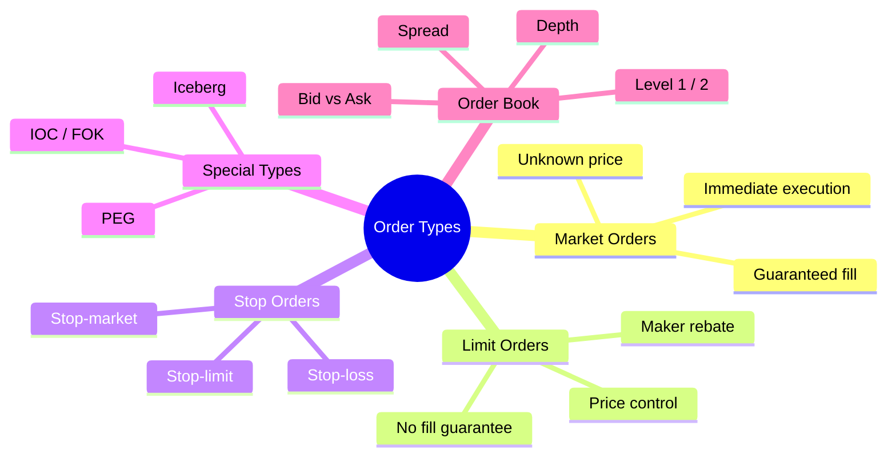
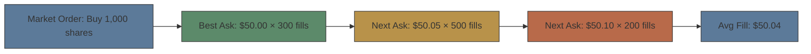
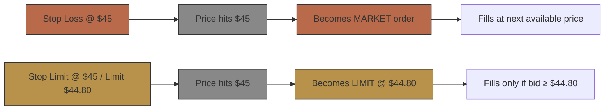

# Module 3: Order Types & Execution

Est. study time: 2.5h
Language: en
Description: Market, limit, stop, iceberg orders, order book mechanics, spread

## Knowledge Map



---

## Learning Objectives
- Explain trade-offs between market, limit, and stop orders
- Read Level 2 order book data: bid/ask sizes, spread, depth
- Calculate crossing the spread cost
- Describe iceberg, IOC, FOK order behaviors
- Choose correct order type for different scenarios

---

## Real-World Example

You put a market order for 10,000 shares of a mid-cap biotech. Fill comes back at $45.20 — but last trade was $44.80. You paid $0.40 more than expected = $4,000 slippage. The order book showed only 1,500 shares at the best ask ($44.85). Your order walked up the book, eating thin liquidity.

> **Think**: What order type would have prevented this slippage?
>
> *Answer: A limit order at $44.90 would cap max price. Only 1,500 shares might fill, but you control cost. Iceberg could hide size. The market order guaranteed execution but surrendered price control — classic trade-off.*

---

## Core Content

### Section 1: Market Orders — Guaranteed Fill, Unknown Price

**Market order:** Buy/sell immediately at best available price.

| Pros | Cons |
|------|------|
| Guaranteed execution | Fill price uncertain |
| Fast — executes instantly | Slippage on thin liquidity |
| Simple — no decisions | Walks the book for large size |



The order "walks the book" — consuming multiple price levels. Total slippage = weighted average fill vs best ask.

> **Think**: Stock has best ask 1,000 @ $100. You buy 800 shares market order. What's your expected fill?
>
> *Answer: All 800 fill at $100 (assuming sufficient size at best ask). No slippage because order is smaller than best ask size. Only when order size exceeds depth at top level does the book walk.*

> **Cloze**: "Market orders guarantee {execution} but not {price}. Limit orders guarantee {price} but not {execution}."
>
> *Answer: execution, price, price, execution*

### Section 2: Limit Orders — Price Control, Uncertain Fill

**Limit order:** Buy/sell at specified price or better. Sits on order book until filled or cancelled.

- Buy limit: max price you're willing to pay
- Sell limit: min price you're willing to accept
- Adds liquidity to the book → earns **maker rebate** (varies by venue, roughly $0.001-0.003/share — Nasdaq ~$0.0014-0.0030, NYSE ~$0.0017)
- Market order removes liquidity → pays **taker fee** (varies by venue, roughly $0.002-0.003/share)

> **Think**: Why would a high-frequency trading firm use limit orders despite uncertain fill?
>
> *Answer: Maker rebate. If a firm can predict order flow and place limit orders that get filled 60%+ of the time, the rebates alone generate significant profit. This is "liquidity rebate arbitrage" — earning pennies per share across millions of shares.*

> **Predict**: You place a limit buy at $49.90. Stock trades down to $49.85 then rebounds to $51. Did your order fill?
>
> *Answer: Yes — limit order fills at $49.90 or better. Price hitting $49.85 means the best offer likely dropped below $49.90, so your order filled near $49.90. If it didn't fill (no one sold at $49.90), price moving below doesn't guarantee execution.*

### Section 3: Stop Orders — Conditional Triggers

**Stop-loss order:** Becomes market order when price hits stop level.
**Stop-limit order:** Becomes limit order when price hits stop level.



**Stop-loss problem:** Gap down. Stock closes $46 Friday. Stop at $45. Overnight news — opens $40 Monday. Stop-loss triggers at $45 (open price), fills at $40. No protection against overnight gaps.

> **Think**: Stop-loss at $42 protects against what exactly?
>
> *Answer: Protects against intra-day declines that hit $42 in continuous trading. Does NOT protect against overnight gaps. Stock closing $43, opening $38 → stop triggers at open (~$38), not $42. Gap risk requires options or position size adjustment, not stops.*

> **Cloze**: "A stop-loss order becomes a {market order} when the stop price is triggered. A stop-limit order becomes a {limit order} with a specified price."
>
> *Answer: market order, limit order*

### Section 4: Special Order Types

| Type | Behavior | Use Case |
|------|----------|----------|
| **Iceberg** | Shows only part of order size (peak). Rest hidden. | Large orders without revealing full size |
| **IOC** (Immediate-or-Cancel) | Fills immediately what's available, cancels rest. | Quick execution, partial fill OK |
| **FOK** (Fill-or-Kill) | Must fill entire order immediately or cancel. | Only if full size available instantly |
| **PEG** (Pegged) | Price follows best bid/ask automatically. | Smart order routing |

> **Think**: Institution wants to buy 200K shares without moving price. What order type(s) should they use?
>
> *Answer: Iceberg orders (hide true size) + limit price (cap cost). Split across venues. Use dark pool to avoid information leakage. Algorithm could VWAP over hours. A single market order would walk the book and cause massive slippage.*

> **Spot the Mistake**: "FOK and IOC are the same thing."
>
> What's wrong?
>
> *Answer: IOC fills what it can immediately and cancels the rest (partial fill OK). FOK requires the FULL order to fill immediately or cancels entirely (zero fill if not enough size). FOK is stricter — orders that want certainty of full execution size.*

### Section 5: The Order Book (Level 2)

Order book shows all pending limit orders at each price level:

```text
Level 2 Data for XYZ Stock:
  Bid (Buys)          Ask (Sells)
  Price    Size       Price    Size
  49.95    1,200      50.00    800
  49.90    3,500      50.05    1,500
  49.85    5,000      50.10    2,200
  49.80    8,000      50.15    1,000
```

- **Spread**: $50.00 - $49.95 = $0.05 (best bid vs best ask)
- **Depth**: Total size at each level. Thick book = stable price
- **Inside market**: Best bid/ask (Level 1 data)
- **NBBO**: National Best Bid/Offer — best price across all exchanges

> **Think**: Which has more information — Level 1 or Level 2 data?
>
> *Answer: Level 2 shows depth beyond inside market. Seeing 3,500 at $49.90 indicates support. Large sell wall at $50.10 suggests resistance. Level 1 only shows best bid/ask — insufficient to judge true supply/demand. Professional traders use Level 2.*

---

### Why This Matters

Wrong order type costs real money. Market order during low liquidity = slippage. Stop-loss during gap = no protection. Iceberg hides intent from HFTs who front-run large orders. Knowing which type to use — and when — is the difference between professional and amateur execution.

---

## Key Takeaways
- Market order = certain fill, uncertain price. Limit order = certain price, uncertain fill.
- Crossing the spread = cost. Buy at ask, sell at bid.
- Stop-loss protects intra-day, not overnight. Gap risk remains.
- Iceberg hides order size from the book. FOK requires full fill, IOC accepts partial.
- Level 2 shows depth. Thick book = stable price. Walls = support/resistance.

---

## Common Misconception

**"Stop-loss guarantees max loss."**
False. Stop-loss guarantees conversion to market order at the stop price — but market order fills at whatever price available. In fast markets, fill can be far from stop. Also does not protect against gap openings. A more accurate term: "stop-loss trigger" not "stop-loss limit."

---

## Spot the Mistake

"Best bid is $20.00 × 5,000, best ask is $20.05 × 200. I place market buy for 500 shares. I get 200 at $20.05 and 300 at $20.00."

What's wrong?

*Answer: Market buy order crosses the spread, buying from the ask side. It would buy 200 @ $20.05 (top ask), then walk to next ask. It would NOT buy at $20.00 — that's the bid side (where sellers would sell at $20.00, but no one sells at bid). Market buys consume available offers (asks), not bids.*

---

## Feynman Explain
(Explain market vs limit order using a flea market analogy. One vendor has fixed prices, another negotiates. Which is better for buyer? For seller?)

---

## Reframe
(Judge: Some exchanges eliminated maker-taker rebates (e.g., IEX). Does paying for order flow hurt retail traders? Consider: zero commissions, slightly worse fills. Is the trade-off worth it?)

---

## Drill
Run: `learn.sh quiz equity-trading 3`
Run: `learn.sh cloze equity-trading 3`
