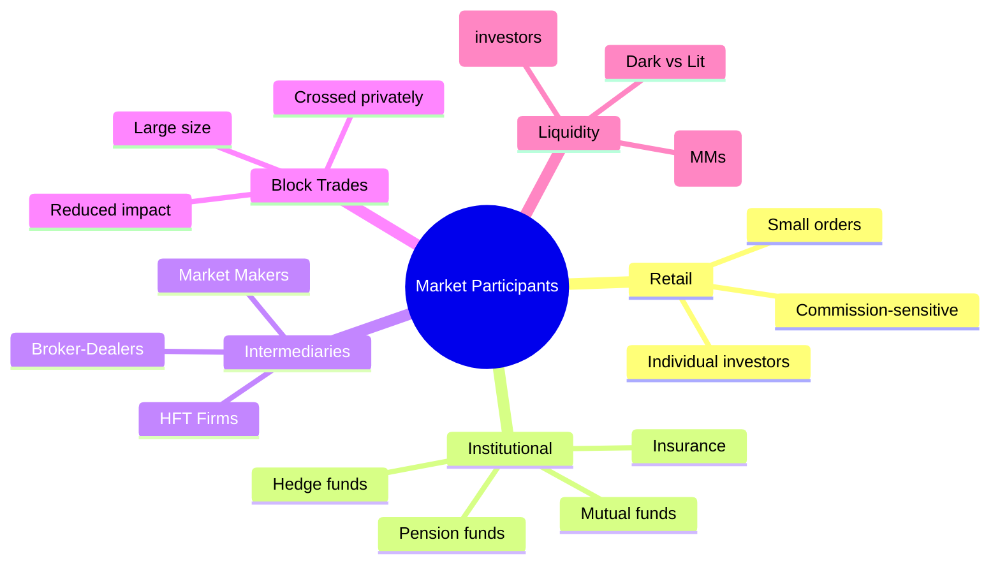
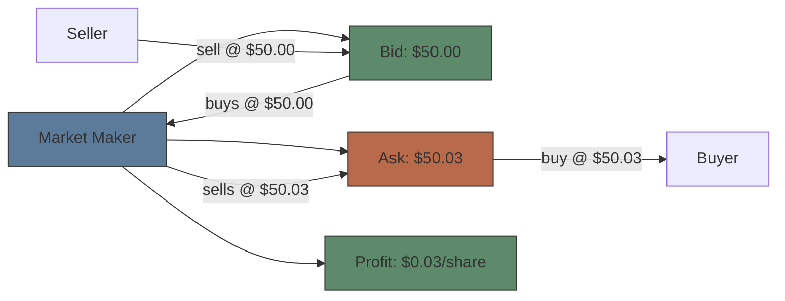
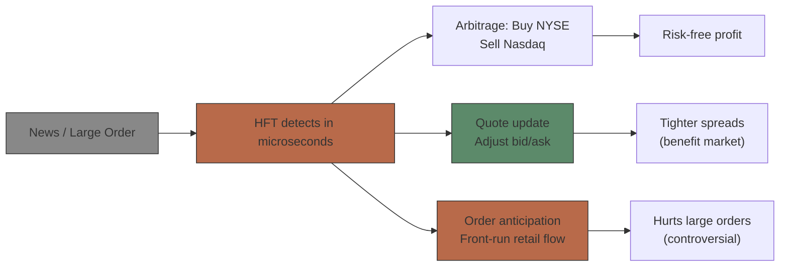

# Module 4: Market Participants

Est. study time: 2.0h
Language: en
Description: Retail, institutional, market maker, HFT, block trades, liquidity provision

## Knowledge Map

---

## Learning Objectives
- Distinguish retail, institutional, and professional trading behaviors
- Explain market maker obligations and profit sources
- Describe how HFT interacts with other participants
- Define block trades and how they differ from standard execution

---

## Real-World Example

Your 500-share market order fills instantly at advertised price. An institution's 500,000-share order takes hours — executed algorithmically across 15 venues. Same stock, same day, completely different experience. Why?

> **Think**: Who provides the liquidity for your 500 shares? Who provides liquidity for the institution's 500K? Is it the same entity?
>
> *Answer: Your 500 shares came from a market maker or HFT providing fast execution to the NBBO. The 500K needs natural counterparties — pension fund selling, mutual fund buying. No single market maker can absorb 500K without massive risk. Large orders need natural flow via algos, dark pools, and block desks.*

---

## Core Content

### Section 1: Retail Traders

**Characteristics:**
- Small order size (typically 100-500 shares)
- Commission-sensitive (zero-commission brokers)
- Order flow often sold to wholesalers (Citadel, Virtu) — PFOF
- Tend to be directional (long bias), reactive to news
- Collectively significant: ~25% of daily volume

> **Think**: Why does Robinhood sell order flow to Citadel instead of routing to NYSE?
>
> *Answer: Payment for Order Flow (PFOF). Robinhood gets ~$0.003/share from Citadel for routing orders there. Citadel executes profitably because they internalize — matching buy/sell retail flow in-house. Retail gets zero commission. Citadel gets profitable order flow. Critics: price improvement vs conflicts of interest debate.*

> **Cloze**: "Retail order flow is often routed to {wholesalers} instead of exchanges. This practice is called {payment for order flow} (PFOF)."
>
> *Answer: wholesalers, payment for order flow*

### Section 2: Institutional Investors

| Type | Behavior | Holding Period | Typical Size |
|------|----------|---------------|-------------|
| Pension fund (CalPERS) | Long-only, low turnover | Years | $100M+ positions |
| Mutual fund (Fidelity) | Active/passive, diversified | Quarters-years | $50M+ per name |
| Hedge fund (Citadel) | Long/short, high turnover | Days-months | Varies |
| Insurance (MetLife) | Yield-focused, buy-and-hold | Years | Large |
| Sovereign wealth fund | Strategic, ultra-long | Decades | Largest |

**Key behaviors:**
- Trade in size: orders of 50K-1M+ shares common
- Use algo trading (VWAP, TWAP, Implementation Shortfall)
- Prefer dark pools for large size (minimize market impact)
- Often restricted by mandate (e.g., "no stocks under $5")

> **Think**: Pension fund wants to rebalance — sell $500M of large-cap, buy $500M of mid-cap. How long does execution take?
>
> *Answer: Days, not minutes. $500M would move markets if executed instantly. Algo splits into small slices across days. Implementation Shortfall algorithm balances market impact vs opportunity cost. Could take 2-5 days depending on liquidity.*

### Section 3: Market Makers

**Role:** Provide continuous bid/ask quotes, profit from spread.

**Obligations (for registered MMs):**
- Maintain two-sided quote within regulatory spread
- Trade minimum size at quoted prices
- Trade in stressed conditions (NYSE DMMs)
- Continuous quoting during market hours (exceptions in volatility)

**Profit sources:**
1. **Spread capture:** Buy bid, sell ask = $0.03/share
2. **Rebates:** Earn maker rebates for adding liquidity
3. **Position profits:** Net long/short positions from order flow asymmetry
4. **PFOF:** From routing brokers

> **Think**: What happens to a market maker when a stock suddenly gaps down 10% on news?
>
> *Answer: MM is long inventory (bought on bid side). Gap down → inventory loses value. MM widens spread (reduces risk), possibly stops quoting. NYSE DMM must continue (obligation). This is the risk of market making — providing liquidity during calm is profitable, but supplying it during stress can be very costly.*

> **Predict**: Market maker sees more sell orders than buy orders all morning. What adjustment do they make?
>
> *Answer: Lower bid price (reduce inventory accumulation), lower ask price (attract buyers, clear inventory). MM wants to balance inventory. Persistent sell pressure → MM becomes net long aggressively → risk increases. MM may hedge with options or reduce quote size.*

### Section 4: HFT Firms

**High-Frequency Trading:** Latency-sensitive strategies using speed advantage.

Common HFT strategies:
- **Market making:** Faster quotes, tighter spreads
- **Arbitrage:** Exploit price discrepancies across venues (microseconds)
- **Momentum ignition:** Trigger stop-losses to capture liquidations
- **Toxic flow detection:** Identify large orders, trade ahead (controversial)

> **Think**: Is HFT good or bad for markets?
>
> *Answer: Both. Good: tighter spreads, faster price discovery, lower costs for retail. Bad: increased toxicity for large orders, "phantom liquidity" (quotes that vanish before retail can trade), arms race for speed that benefits exchanges selling co-location. Net effect: beneficial for small orders, harmful for institutional.*

> **Cloze**: "HFT firms use {co-location} — placing servers next to exchange matching engines — to reduce {latency} by microseconds."
>
> *Answer: co-location, latency*

### Section 5: Block Trades

**Block trade:** Order of 10,000+ shares or >$200K notional (varies by venue).

How blocks execute:
1. **Upstairs market:** Block desks at banks find natural counterparties
2. **Crossing:** Match buyer and seller at mid-price, report as single trade
3. **Risk principal:** Block desk buys entire block, then distributes
4. **Dark pool:** Algorithm searches for block-sized liquidity

> **Think**: Why does a block trade often execute at a discount to the current market price?
>
> *Answer: Liquidity premium. Seller demands immediate large size execution. Buyer charges for providing liquidity — risks being overweight a falling stock. The discount compensates the buyer for risk. Typical block discount: 10-50 bps for liquid names, more for illiquid.*

> **Spot the Mistake**: "Block trades happen on the exchange floor just like regular trades."
>
> What's wrong?
>
> *Answer: Most block trades happen "upstairs" — negotiated between block desks and institutions off-exchange. They're reported but not executed through public order book. The block desk takes principal risk or crosses counterparties. Only small blocks get routed to exchange.*

---

### Why This Matters

Every trade has a counterparty. Knowing who you're trading against determines your strategy: retail flow against HFTs is a losing game for speed; institutions need dark pools; market makers are counterparty to most small orders. Understanding participant behavior explains why certain order types work or fail.

---

## Key Takeaways
- Retail orders go to wholesalers via PFOF. Zero commission has hidden costs.
- Institutions trade large size via algorithms and dark pools over hours/days.
- Market makers earn spread + rebates, take inventory risk.
- HFT improves spreads for small orders, hurts large orders with adverse selection.
- Block trades are negotiated off-exchange with discounts reflecting liquidity premium.

---

## Common Misconception

**"Market makers predict where the stock will go."**
False. Market makers are liquidity providers, not forecasters. They profit from spread regardless of direction. An MM doesn't want to predict — wants to buy at bid, sell at ask. Directional bets are inventory management, not core business.

---

## Spot the Mistake

"Dark pools are only for institutions. Retail traders cannot access them."

What's wrong?

*Answer: Many retail brokers route orders to dark pools. Some wholesalers also operate internal dark pools. Retail orders may execute in dark pools without the trader knowing. Certain brokers offer "dark pool access" to retail. The key difference is institutions use them deliberately; retail flows there passively via broker routing.*

---

## Feynman Explain
(Explain market making like a lemonade stand: you buy lemons (bid) and sell lemonade (ask). You don't care if lemon prices go up or down — you just want the spread.)

---

## Reframe
(Judge: Should PFOF be banned (EU/UK approach) or allowed (US approach)? Consider: zero commissions vs best execution. Does the conflict of interest outweigh consumer benefit?)

---

## Drill
Run: `learn.sh quiz equity-trading 4`
Run: `learn.sh cloze equity-trading 4`
