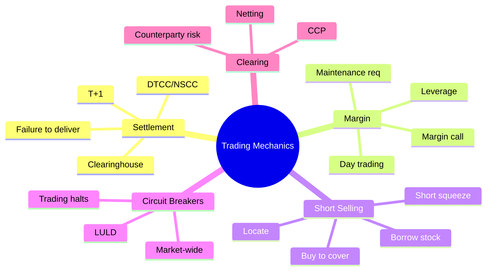
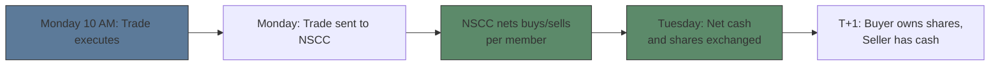
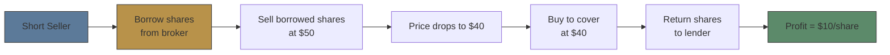

# Module 5: Trading Mechanics

Est. study time: 2.5h
Language: en
Description: Settlement cycles, margin trading, short selling, circuit breakers, clearing

## Knowledge Map

---

## Learning Objectives
- Explain T+1 settlement and the role of clearinghouse
- Calculate margin requirements and margin call levels
- Describe short selling mechanics: borrow, locate, cover
- Identify circuit breaker levels and their triggers
- Understand how clearing reduces counterparty risk

---

## Real-World Example

You buy 100 shares on Monday, sell on Tuesday — cash available Wednesday. Your friend says "settlement takes 2 business days." But Robinhood lets you trade instantly. Who's providing the credit? And what happens when a hedge fund shorts a stock but can't find shares to borrow?

> **Think**: If settlement takes T+1, how do day traders trade 20 times in one day? Is there a risk?
>
> *Answer: Broker extends intraday credit — settling net position at end of day. The clearinghouse nets trades across all market participants. Each trader's net buy/sell settles. Day trading is possible because most trades cancel each other before settlement. Risk: if trader defaults, broker covers.*

---

## Core Content

### Section 1: Settlement — T+1 and Clearing

**Settlement cycle:** Time between trade execution and final exchange of cash/securities.

- **T+1:** Trade date + 1 business day (US equities, since May 2024)
- **T+2:** Previously (before May 2024), still used for corporate bonds
- **Clearinghouse** (NSCC/DTCC): Central counterparty that guarantees trades

**Why T+1 matters:**
- Reduces counterparty risk exposure time
- Frees capital faster (collateral released)
- Failures to deliver shorter-lived

> **Think**: What happens if buyer doesn't have cash at settlement?
>
> *Answer: Broker must cover. Broker is responsible to NSCC. If buyer defaults, broker pays NSCC and pursues buyer separately. This is why brokers require settled cash or margin — they bear the settlement risk.*

> **Cloze**: "US equities settled {T+1} as of {May 2024}. Previously they settled {T+2}. The change reduces {counterparty risk}."
>
> *Answer: T+1, May 2024, T+2, counterparty risk*

### Section 2: Margin Trading

**Cash account:** Can only trade with available cash.
**Margin account:** Broker lends money to trade larger positions.

| Term | Definition |
|------|-----------|
| Initial margin | Min equity required to open position (50% for stocks under Reg T) |
| Maintenance margin | Min equity to keep position (25% typical, broker may set higher) |
| Leverage | Total position ÷ equity. 2:1 max for stocks (4:1 intraday for pattern day traders under day-trading buying power) |
| Margin call | Broker demands deposit when equity < maintenance |

**Example:**
- You deposit $10K. Max buying power = $20K (2:1 leverage).
- Buy $20K of stock at $100/share = 200 shares.
- Stock drops to $75 → position worth $15K. Loan = $10K. Equity = $5K.
- Equity % = $5K / $15K = 33%. Still above 25% maintenance.
- Stock drops to $65 → position worth $13K. Equity = $3K. Equity % = $3K/$13K ≈ 23% → **MARGIN CALL.**

> **Think**: At what stock price does a margin call occur on $20K position with $10K loan, 25% maintenance?
>
> *Answer: Equity = Position Value - Loan. Maintenance = 25% of Position Value. Position Value - $10K = 0.25 × Position Value. 0.75 × PV = $10K. PV = $13,333. Stock price = $13,333 / 200 = $66.67. Below this → margin call.*

> **Predict**: Stock drops 30% in a day. A trader with max margin (2:1) loses what % of equity?
>
> *Answer: 30% × 2 = 60% equity loss. Leverage amplifies losses. $20K position with $10K equity — 30% drop = $6K loss = 60% of equity. This is why margin accounts get closed during flash crashes.*

### Section 3: Short Selling

**Short selling:** Sell borrowed stock, hoping to buy back cheaper later.

**Mechanics:**
1. **Locate:** Broker must locate shares available to borrow before executing the short (SEC Reg SHO Rule 203(b)(1))
2. **Borrow:** Shares from brokerage inventory, other clients' margin accounts, or lending desks
3. **Sell:** Sale proceeds credited to account (but cannot withdraw — held as collateral)
4. **Cover:** Buy back shares, return to lender

**Risks:**
- **Unlimited loss potential:** Stock can rise 100%, 500%, 1000%+. Short seller must buy at any price.
- **Buy-in:** Lender recalls shares → broker forces cover.
- **Short squeeze:** Rapid price rise as shorts scramble to cover (GameStop 2021, VW 2008).

> **Think**: Why is short selling called "trading against the market" and why do regulators restrict it?
>
> *Answer: Short sellers profit when stocks fall. In a crisis, short selling can accelerate declines (death spiral). Regulators impose uptick rules, ban short-selling specific stocks during stress (2008 financial stocks, 2020 COVID). Critics: short sellers provide price discovery. Debate continues.*

> **Cloze**: "To short a stock, the broker must first {locate} shares available to {borrow}. If lender recalls, broker can {buy in} the position."
>
> *Answer: locate, borrow, buy in*

### Section 4: Circuit Breakers

Three levels of market-wide circuit breakers (Rule 48/2018 revision):

| Level | S&P 500 Decline | Trading Response |
|-------|----------------|-----------------|
| Level 1 | 7% | 15-min halt |
| Level 2 | 13% | 15-min halt |
| Level 3 | 20% | Close for day |

**LULD (Limit Up / Limit Down):**
- Individual stocks have price bands (varies by price and tier)
- If trade would occur outside band → 5-second pause (Limit State)
- Extends to trading halt if limit state persists

**Trading halts:**
- News pending: Stock halted pending material news
- Regulatory: SEC/FINRA concern
- Volatility: LULD triggered

> **Think**: During March 2020 COVID crash, S&P 500 triggered Level 1 and Level 2 circuit breakers multiple times. Why didn't Level 3 close the market permanently?
>
> *Answer: Circuit breakers reset daily. Level 1/2 triggered Monday, Wednesday, Thursday. Market recovered before hitting 20% decline on any single day (S&P 500 dropped ~34% peak-to-trough, but across days, not one day). Day ends at 4 PM regardless. Level 3 would close for entire day.*

> **Spot the Mistake**: "Circuit breakers prevent stock crashes."
>
> What's wrong?
>
> *Answer: Circuit breakers PAUSE trading — they don't prevent declines. After 15-min halt, trading resumes at new (possibly lower) price. The pause gives time for information dissemination and order book recalibration. Crashes still happen; halts just slow them down.*

---

### Why This Matters

Settlement affects cash availability (T+1 = funds available next day). Margin is double-edged — amplifies gains AND losses. Short selling has unlimited risk — many traders blow up not knowing borrow mechanics. Circuit breakers pause markets but don't save positions.

---

## Key Takeaways
- T+1 settlement since May 2024. Clearinghouse nets trades to minimize delivery.
- Reg T: 50% initial margin, 25% maintenance. Margin call when equity below threshold.
- Short selling requires locate and borrow. Unlimited loss potential.
- Market-wide circuit breakers at 7%/13%/20% S&P 500 decline.
- LULD = 5-second limit state for trades outside price band.

---

## Common Misconception

**"You can buy a stock and it settles immediately — that's why you can sell it 5 minutes later."**
False. You can sell because your broker guarantees settlement. The trade hasn't settled yet (T+1). The "free riding" rule (Reg T) prohibits selling before paying — if you sell before paying for the buy with settled cash, you may get a 90-day restriction.

---

## Spot the Mistake

"Short selling is limited risk because you can buy to cover anytime."

What's wrong?

*Answer: Short selling has UNLIMITED potential loss. Stock at $50 shorted can rise to $100 (loss: 100%), $200 (300%), $500 (900%). There's no cap. The "buy to cover anytime" assumes liquidity — during a squeeze, liquidity dries up and shares can't be bought at any price. GameStop shorts lost billions.*

---

## Feynman Explain
(Explain short selling using a neighbor's lawnmower analogy: you borrow the mower, sell it to someone else, then want to buy it back cheaper before neighbor notices.)

---

## Reframe
(Judge: Should short selling be banned? Consider: price discovery vs market stability. During a crash, does banning shorts help or hurt? What about the 2008 financial stock ban?)

---

## Drill
Run: `learn.sh quiz equity-trading 5`
Run: `learn.sh cloze equity-trading 5`
