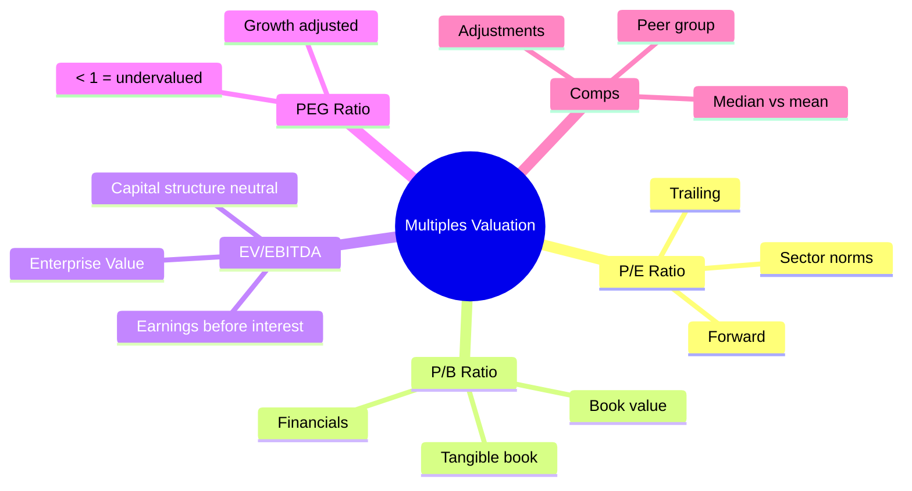
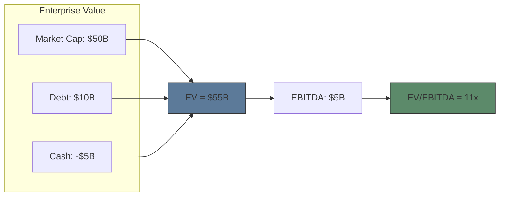

# Module 6: Equity Valuation — Multiples

Est. study time: 2.5h
Language: en
Description: P/E, P/B, EV/EBITDA, PEG, comparable company analysis, forward vs trailing

## Knowledge Map

---

## Learning Objectives
- Calculate and interpret P/E, P/B, EV/EBITDA, PEG ratios
- Distinguish trailing vs forward multiples
- Build a comparable company analysis
- Adjust multiples for non-recurring items and capital structure

---

## Real-World Example

Your analyst says "XYZ trades at 25x P/E, sector average is 18x — stock is overvalued." But XYZ grows revenue 30%/year while sector grows 8%. The PEG ratio is 0.83 (<1). Same stock, two different conclusions.

> **Think**: Which metric matters more — P/E or PEG? When would P/E alone be misleading?
>
> *Answer: P/E ignores growth. A high-P/E stock may be cheap relative to growth (low PEG). But PEG also has flaws — assumes linear growth, ignores risk. Sector averages need adjustment for growth differences. Always triangulate.*

---

## Core Content

### Section 1: P/E Ratio — The Universal Metric

**P/E = Price ÷ Earnings Per Share (EPS)**

Two versions:
| Type | EPS Used | Indicates |
|------|---------|-----------|
| Trailing P/E | Last 12 months actual | What happened |
| Forward P/E | Next 12 months estimated | What market expects |
| GAAP P/E | Reported earnings (includes one-time items) | Full picture |
| Adjusted P/E | Operating earnings (excludes one-time) | Core business |

**Sector reference:**
| Sector | Typical P/E Range | Why |
|--------|------------------|-----|
| High-growth tech | 25-50x | Future earnings expected |
| Consumer staples | 15-25x | Stable but low growth |
| Banks | 10-15x | Leveraged, cyclical |
| Energy | 8-15x | Commodity cyclical |
| Distressed | Below 10x or negative | Risk or losses |

> **Think**: Company has P/E of 50. Is it always overvalued?
>
> *Answer: Not necessarily. A biotech with drug about to launch may have $0.50 EPS now but $5 EPS next year → forward P/E = 10x. High trailing P/E may reflect temporary low earnings, not overvaluation. Compare P/E to growth rate (PEG) and peer group.*

> **Cloze**: "P/E = price divided by {EPS}. {Trailing} P/E uses last 12 months earnings. {Forward} P/E uses estimated future earnings."
>
> *Answer: EPS, Trailing, Forward*

### Section 2: EV/EBITDA — Capital Structure Neutral

**Enterprise Value = Market Cap + Debt - Cash**
**EBITDA = Earnings Before Interest, Taxes, Depreciation, Amortization**

Why EV/EBITDA > P/E:
- Ignores capital structure (debt vs equity financing)
- Ignores tax rates (different jurisdictions)
- Ignores non-cash charges (D&A)
- Useful for comparing companies with different debt levels

> **Think**: Two identical companies. Company A has $0 debt, Company B has $5B debt. Which has higher P/E? Which has higher EV/EBITDA?
>
> *Answer: Same P/E (same net income, same shares). Company B has higher EV (debt adds to EV) → higher EV/EBITDA. EV/EBITDA penalizes debt, P/E doesn't. This is why EV/EBITDA better for comparing across capital structures.*

> **Predict**: Company raises $1B in debt to buy back shares. What happens to P/E and EV/EBITDA?
>
> *Answer: Buyback reduces shares outstanding → EPS increases → P/E decreases (assuming same price). EV increases (more debt) → EV/EBITDA increases. Metrics diverge — P/E looks cheaper, EV/EBITDA looks more expensive. That's the capital structure distortion.*

### Section 3: P/B and PEG Ratios

**P/B = Price ÷ Book Value Per Share**
- Book value = Assets - Liabilities (shareholders' equity)
- Used primarily for financial companies (banks, insurance)
- P/B < 1: trading below liquidation value (possible value trap)
- Tangible book value excludes goodwill/intangibles

**PEG = P/E ÷ Earnings Growth Rate**
- PEG < 1: potentially undervalued relative to growth
- PEG > 2: potentially overvalued
- Growth rate = expected annual EPS growth (usually 3-5 years)
- Problem: growth is estimated, not known

| Ratio | Formula | Best For |
|-------|---------|----------|
| P/E | Price / EPS | Broad comparison |
| P/B | Price / Book Value | Financials, liquidations |
| EV/EBITDA | EV / EBITDA | Capital-structure-neutral |
| PEG | P/E / Growth % | Growth companies |

> **Think**: PEG ratio assumes what about growth? What's the flaw?
>
> *Answer: PEG assumes growth is linear and sustainable. High-growth companies eventually slow (regression to mean). A PEG of 1 based on 30% growth for 5 years means P/E of 30 — but if growth collapses to 10% in year 3, true PEG was much higher. PEG works best for stable growth companies.*

> **Cloze**: "PEG = P/E divided by {earnings growth rate}. PEG below {1} suggests undervaluation relative to growth rate."
>
> *Answer: earnings growth rate, 1*

### Section 4: Comparable Company Analysis (Comps)

Steps:
1. **Identify peer group** — similar business, size, growth, margins
2. **Calculate multiples** for each peer
3. **Determine median/mean** of each multiple
4. **Apply to target** — peer median P/E × target's EPS = implied price
5. **Triangulate** — use multiple ratio types, weight by relevance

| Company | P/E | EV/EBITDA | PEG |
|---------|-----|-----------|-----|
| Peer A | 22x | 14x | 1.5 |
| Peer B | 18x | 12x | 1.2 |
| Peer C | 25x | 16x | 1.8 |
| **Median** | **22x** | **14x** | **1.5** |
| **Target EPS** | **$4.00** | - | **15% growth** |
| **Implied Price** | **$88** | - | **$90** |

> **Think**: Target's implied price is $88 from P/E comps and $90 from PEG. Current price is $95. What does this suggest?
>
> *Answer: Slightly overvalued relative to peers (~7-8%). But 10% range is noise — could be justified by competitive advantages, brand, market leadership. Comps are directional, not precise. If $120 → clearly overvalued. If $70 → undervalued.*

> **Spot the Mistake**: "P/B of 0.5 always means a bargain."
>
> What's wrong?
>
> *Answer: P/B < 1 means trading below liquidation value, but book value may be overstated. Declining company may have assets worth less than book (bad loans, obsolete inventory, impaired goodwill). P/B below 1 can be a value TRAP — assets are worth less than stated. Always check if book value is "good" book value.*

---

### Why This Matters

Every stock research report uses multiples. Every earnings call discusses "trading at X times earnings." Understanding what multiples capture — and what they miss — is the difference between reading a metric and understanding valuation. Comps are how buy-side analysts set price targets.

---

## Key Takeaways
- P/E is universal but distorted by leverage and one-time items.
- EV/EBITDA removes capital structure and tax effects.
- PEG adjusts for growth but assumes linear growth.
- P/B best for financials; value trap when < 1.
- Comps are directional. Triangulate multiple ratios.

---

## Common Misconception

**"A stock with a low P/E is always a good value."**
False. Low P/E may mean low expected growth, high risk, cyclical peak earnings, or accounting distortions. Always ask WHY P/E is low. Sometimes the market is correctly pricing risk.

---

## Spot the Mistake

"Company has P/E of 15. The market P/E is 20. The company must be undervalued."

What's wrong?

*Answer: A low P/E relative to market doesn't automatically mean undervalued. The company may have lower growth, higher risk, weaker competitive position. Its "fair" P/E might be 12x, making 15x overvalued. Need peer group comparison, not just market average.*

---

## Feynman Explain
(Explain P/E ratio using apartment rental analogy: price = apartment cost, earnings = annual rent. A $1M apartment generating $50K/year in rent has P/E = 20. Good deal?)

---

## Reframe
(Judge: Do multiples tell you anything about absolute valuation, or only relative? Can the entire sector be overvalued based on multiples?)

---

## Drill
Run: `learn.sh quiz equity-trading 6`
Run: `learn.sh cloze equity-trading 6`
