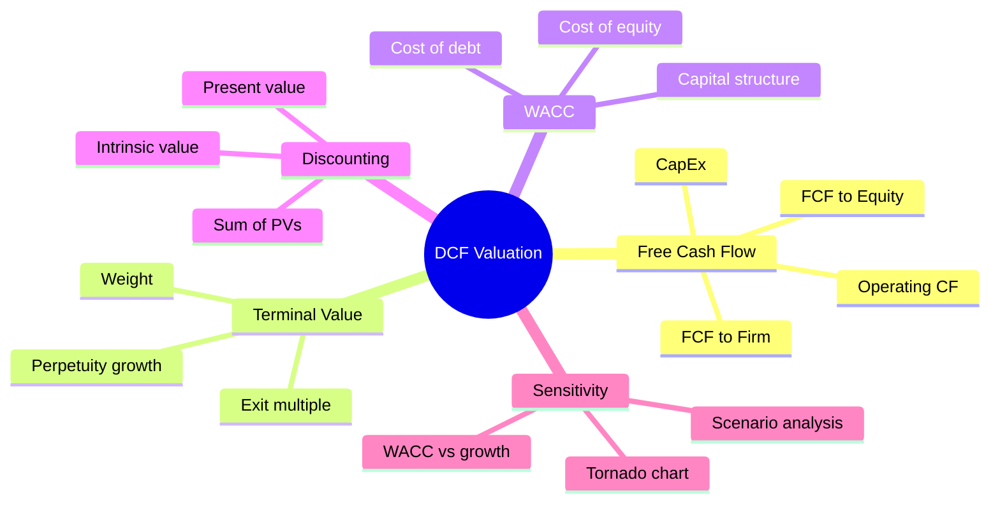
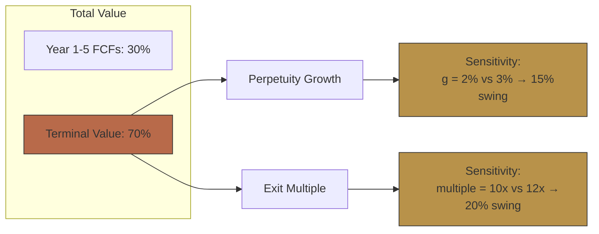
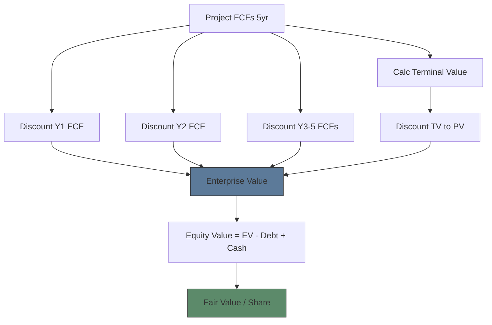

# Module 7: Equity Valuation — DCF

Est. study time: 3.0h
Language: en
Description: Free cash flow, terminal value, WACC, discounting, sensitivity analysis

## Knowledge Map



---

## Learning Objectives
- Calculate Free Cash Flow from financial statements
- Estimate terminal value via perpetuity growth and exit multiple methods
- Compute WACC and explain each component
- Build a simple DCF model and perform sensitivity analysis
- Identify DCF's limitations and when not to use it

---

## Real-World Example

An M&A analyst values Target at $50/share via DCF. Target currently trades at $42. The analyst recommends acquisition. But the DCF assumes 3% perpetual growth — what if growth is only 2%? Or WACC is 10% instead of 9%? Small input changes can swing the valuation by 30%+.

> **Think**: If DCF is so sensitive to assumptions, why do professionals still use it? Why not just use multiples?
>
> *Answer: DCF gives intrinsic value based on cash flows — not relative to peers. Multiples can be wrong if entire sector is mispriced. DCF forces explicit assumptions about growth, margins, risk. The sensitivity analysis shows which assumptions matter most. Both are needed: DCF for absolute value, multiples for relative value.*

---

## Core Content

### Section 1: Free Cash Flow — The Foundation

**Free Cash Flow to Firm (FCFF):** Cash available to all capital providers (debt + equity) after operations and investments.

```text
FCFF = EBIT × (1 - tax) + D&A - CapEx - Change in Working Capital
```

| Component | Source | Meaning |
|-----------|--------|---------|
| EBIT(1-t) | Income statement | After-tax operating profit |
| + D&A | Cash flow / Income | Non-cash add-back |
| - CapEx | Cash flow | Investment in PP&E |
| - ΔWC | Balance sheet | Working capital needs |

**Free Cash Flow to Equity (FCFE):** Cash available to equity holders after debt obligations.

```text
FCFE = FCFF - Interest × (1-t) + Net Borrowing
```

> **Think**: A company has high net income but negative FCF. How is this possible?
>
> *Answer: High CapEx (growing company building factories) or large working capital buildup (customer not paying on time). Amazon had negative FCF for years while showing profit — investing in warehouses. Negative FCF is normal for high-growth companies. Positive FCF signals mature, cash-generative business.*

> **Cloze**: "FCF = {operating cash flow} minus {capital expenditures}. Positive FCF means company generates cash after {investments}."
>
> *Answer: operating cash flow, capital expenditures, investments*

### Section 2: Terminal Value — Where 70% of Value Lives

Terminal value = value of all cash flows after the explicit forecast period (usually 5-10 years).

**Two methods:**

**1. Perpetuity Growth Model (Gordon Growth):**
```text
Terminal Value = FCF_(n+1) / (WACC - g)
```
Where g = perpetual growth rate (typically 2-3% real growth, capped at long-run nominal GDP growth ~4-5% for mature developed markets; should NEVER exceed the discount rate WACC)

**2. Exit Multiple Method:**
```text
Terminal Value = EBITDA_n × Selected EV/EBITDA Multiple
```



> **Think**: Terminal value is often 70%+ of DCF value. Does that make DCF unreliable?
>
> *Answer: It highlights that most value comes from cash flows beyond 5 years — which means DCF is very sensitive to terminal assumptions. Cross-check: if TV > 80% of value, the explicit forecast is too short. Extend to 10 years. If TV still dominant, company is long-duration (growth stock) and DCF is less reliable — use multiples instead.*

> **Predict**: WACC = 10%, perpetual growth = 3% vs 4%. How much does terminal value change?
>
> *Answer: TV = FCF / (10% - 3%) = FCF / 7% = 14.3× FCF. TV at 4% = FCF / 6% = 16.7× FCF. Difference = 16.7/14.3 = 17% higher. A 1% growth change swings TV by 17%. This is why DCF sensitivity analysis is mandatory.*

### Section 3: WACC — The Discount Rate

**WACC = Weighted Average Cost of Capital**

```text
WACC = (E/V) × Ke + (D/V) × Kd × (1 - tax)
```

| Component | Formula | What It Means |
|-----------|---------|---------------|
| Ke (Cost of Equity) | Rf + β × (Rm - Rf) | CAPM: risk-free + beta × equity risk premium |
| Kd (Cost of Debt) | Interest rate × (1-tax) | After-tax borrowing cost |
| E/V | Equity / (Equity + Debt) | Equity weight |
| D/V | Debt / (Equity + Debt) | Debt weight |

**Typical ranges:**
- Risk-free rate: 10yr Treasury (4-5% in 2024)
- Equity risk premium: 4-6% (historical US)
- β (beta): 0.8 (defensive) to 1.5 (volatile)
- WACC: 8-12% typically

> **Think**: Why use after-tax cost of debt? Why not include preferred stock in WACC?
>
> *Answer: Interest is tax deductible — the government subsidizes debt. After-tax cost reflects true burden. Preferred stock can be included as a separate component. Many models include it if preferred is material. WACC should reflect ALL capital sources.*

> **Cloze**: "WACC = cost of {equity} × equity weight + cost of {debt} after-tax × debt weight. Beta measures {systematic risk} relative to the market."
>
> *Answer: equity, debt, systematic risk*

### Section 4: Building a DCF

```text
Step 1: Project FCF for 5-10 years
Step 2: Calculate Terminal Value
Step 3: Discount all cash flows to present
Step 4: Sum = Enterprise Value
Step 5: EV - Debt + Cash = Equity Value
Step 6: Equity Value / Shares Outstanding = Fair Value per Share
```



**Sensitivity table example:**
```text
          WACC
          8.0%   9.0%   10.0%
Growth
2.0%     $55    $48     $42
2.5%     $60    $52     $45
3.0%     $67    $57     $49
```

Range: $42 - $67. Current price $50 — slightly undervalued at base case ($52), slightly overvalued if WACC is 10%.

> **Think**: Based on the sensitivity table, what's your confidence in buying at $50?
>
> *Answer: Moderate. At base case (9% WACC, 2.5% growth), fair value = $52 — close to current price. At 8% WACC, clearly undervalued ($55-67). At 10% WACC, overvalued ($42-49). The valuation is sensitive to WACC assumptions. Proceed with position sizing reflecting uncertainty.*

> **Spot the Mistake**: "DCF gives me the TRUE value of the stock. I can buy if market is below it."
>
> What's wrong?
>
> *Answer: DCF output depends entirely on inputs. Change growth by 0.5% → value swings 10-20%. DCF is a FRAMEWORK for thinking about value, not a truth machine. Warren Buffett: "Better to be approximately right than precisely wrong." Always combine DCF with multiples and qualitative factors.*

---

### Why This Matters

DCF is how the buy-side sets intrinsic value. Activist investors use DCF to argue stock is undervalued. M&A uses DCF to set bid prices. Every equity research report includes a DCF (often sensitivity table). Even if you don't build one, understanding DCF helps you evaluate assumptions behind price targets.

---

## Key Takeaways
- FCF captures actual cash generation, not accounting profit.
- Terminal value often 70%+ of total DCF value. Small assumption changes matter.
- WACC = weighted average of equity and after-tax debt costs.
- DCF sensitivity analysis is mandatory — shows range of outcomes.
- DCF is a framework, not a truth machine. Triangulate with multiples.

---

## Common Misconception

**"DCF is too academic. No one actually uses it."**
False. Every investment bank, hedge fund, and asset manager uses DCF as one tool in the toolkit. The output is a range, not a single number. It's particularly useful for stable, mature businesses (consumer staples, utilities) and less useful for high-growth or distressed.

---

## Spot the Mistake

Terminal value calculated as: FCF_(n+1) / (WACC - g). If WACC = 9% and g = 9%, terminal value = FCF / 0 = infinite.

What's wrong?

*Answer: Perpetuity growth MUST be less than WACC. If g ≥ WACC, the formula breaks (division by zero or negative). In practice, g should not exceed long-term GDP growth (2-3%). 9% perpetual growth is unsustainable — no company grows faster than the economy forever.*

---

## Feynman Explain
(Explain DCF with a rental property: future rent minus expenses = FCF. Terminal value = what you sell property for. Discount because future rent is worth less than cash today.)

---

## Reframe
(Judge: Is DCF more useful for stable companies or high-growth companies? Should you trust a DCF for Tesla? Why or why not?)

---

## Drill
Run: `learn.sh quiz equity-trading 7`
Run: `learn.sh cloze equity-trading 7`
