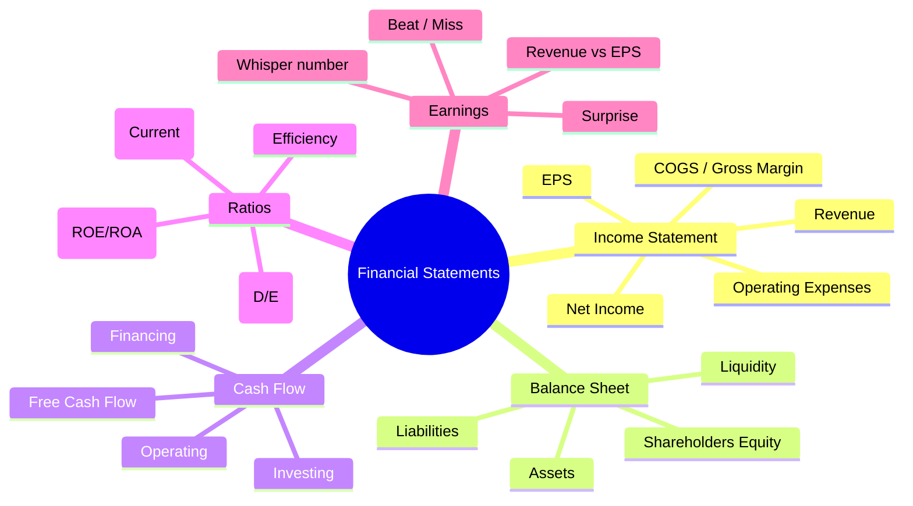
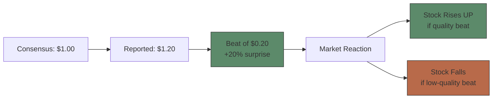

# Module 8: Financial Statements for Trading

Est. study time: 3.0h
Language: en
Description: Income statement, balance sheet, cash flow, key ratios, earnings surprise

## Knowledge Map



---

## Learning Objectives
- Read income statement, balance sheet, and cash flow statement
- Calculate key financial ratios relevant to trading decisions
- Distinguish operating vs non-recurring items
- Interpret earnings surprise and market reaction
- Identify red flags in financial statements

---

## Real-World Example

Company reports EPS of $1.50 — beat by $0.30. Stock drops 5%. Confused, you check: revenue also beat. What happened? The beat came from a one-time tax benefit, not core operations. The market saw through the headline — it cares about quality of earnings, not just reported EPS.

> **Think**: Why do traders watch revenue more closely than EPS for some companies?
>
> *Answer: Revenue is harder to manipulate than EPS. EPS can be boosted by buybacks, one-time gains, lower tax rates, accounting changes. Revenue is the top line — reflects real demand. High-growth companies especially: market rewards revenue beats even with EPS misses.*

---

## Core Content

### Section 1: Income Statement — The Profit Story

| Line Item | What It Tells You |
|-----------|------------------|
| Revenue | Top line. Demand for products/services |
| - COGS | Direct costs to deliver |
| = Gross Profit | Revenue - COGS. Gross margin = GP/Revenue |
| - Operating Expenses | SG&A, R&D, D&A |
| = Operating Income (EBIT) | Profit from core business |
| - Interest + Taxes | Financing costs + government |
| = Net Income | Bottom line. Available to shareholders |
| / Shares Outstanding | = EPS |

**Gross margin** decline → pricing pressure or cost inflation (negative signal)
**Operating margin** expansion → scale benefits or cost control (positive signal)
**Net income** ≠ cash flow (D&A, accruals, one-time items distort)

> **Think**: Company reports 20% revenue growth but operating margin drops from 15% to 10%. Bullish or bearish?
>
> *Answer: Mixed. Top-line growth is good, but margin compression suggests growth is expensive (heavy marketing spend, discounting). Question: is margin compression temporary (investing for growth) or structural (competitive pressure)? Check if R&D or SG&A drove it. Temporary → bullish. Structural → bearish.*

> **Cloze**: "Gross margin = {gross profit} divided by {revenue}. Declining gross margin suggests {pricing pressure} or rising {input costs}."
>
> *Answer: gross profit, revenue, pricing pressure, input costs*

### Section 2: Balance Sheet — The Snapshot

```text
Assets = Liabilities + Shareholders' Equity
```

**Assets:** What company owns
- Current: Cash, receivables, inventory (< 1 year)
- Non-current: PP&E, intangibles, goodwill (> 1 year)

**Liabilities:** What company owes
- Current: Accounts payable, short-term debt (< 1 year)
- Non-current: Long-term debt, deferred taxes (> 1 year)

**Equity:** Book value = assets - liabilities

**Key trading signals from balance sheet:**
- **Cash pile growing** → safe, can weather downturns, potential buybacks
- **Debt increasing** → risk of distress, interest rate sensitivity
- **Inventory rising faster than sales** → potential write-downs ahead
- **Receivables growing faster than revenue** → customers not paying, revenue quality suspect

> **Think**: Company A has $10B cash, $5B debt. Company B has $1B cash, $6B debt. Same market cap. Which is safer?
>
> *Answer: Company A has net cash position ($5B) — zero financial risk. Company B has net debt ($5B) — higher risk if rates rise or earnings drop. All else equal, Company A is safer. This is why enterprise value analysis matters.*

> **Predict**: Inventory growing 30% while revenue grows 5%. What's likely coming?
>
> *Answer: Inventory write-down. Products not selling → future writedowns or discounting (hurts gross margin). Retail and tech companies are especially sensitive. This is a classic "canary in the coal mine" signal. Watch the inventory-to-sales ratio.*

### Section 3: Cash Flow Statement — The Truth

Three sections:

| Section | What It Shows | Positive Signal |
|---------|---------------|-----------------|
| Operating | Cash from core business | Positive = self-funding |
| Investing | CapEx, acquisitions, asset sales | Negative = investing in growth |
| Financing | Debt, equity, dividends, buybacks | Positive = raising capital |

**Why cash flow matters more than earnings:**
- Earnings include non-cash items (D&A, accruals)
- Cash can't be faked (much harder to manipulate)
- Positive operating CF + negative investing CF = growing company
- Negative operating CF = burning cash (need financing or cut spending)

> **Think**: Company has Net Income $100M, Operating CF $50M. Gap of $50M. What could explain it?
>
> *Answer: Working capital buildup: receivables increased (sales booked but not collected) or inventory increased. Or D&A is small. The gap means earnings quality is lower — company is booking profit but not collecting cash. Track over time: if gap widens, it's a red flag.*

> **Cloze**: "Operating cash flow = net income + {non-cash charges} +/- changes in {working capital}. It measures cash generated by {core business}."
>
> *Answer: non-cash charges, working capital, core business*

### Section 4: Key Ratios for Traders

| Ratio | Formula | What It Tells | Threshold |
|-------|---------|---------------|-----------|
| ROE | Net Income / Equity | Return to shareholders | >15% good |
| ROA | Net Income / Assets | Asset efficiency | >5% good |
| Current Ratio | Current Assets / Current Liabilities | Short-term solvency | >1.5 |
| D/E | Total Debt / Equity | Leverage | Varies by sector |
| Interest Coverage | EBIT / Interest | Ability to pay debt | >3x safe |
| Payout Ratio | Dividends / Net Income | Dividend sustainability | <60% sustainable |

**Sector-specific expectations:**
- Banks: high D/E (leverage is business model). ROE is key metric.
- Tech: low D/E, high margins, negative FCF during growth phase.
- Utilities: high D/E (stable cash flows support leverage), high payout ratios.
- Retail: inventory turnover, same-store sales growth.

> **Think**: Tech company with ROE 30%, zero debt, net cash. Growing 20%+/year. What does this DCF suggest about valuation?
>
> *Answer: High ROE + zero debt + growth = premium valuation justified. Company reinvests capital at high returns. WACC is low (no debt). DCF terminal value will be large. Market typically awards 30-50x P/E for such businesses. But reversion to mean is risk — high ROE attracts competitors.*

> **Spot the Mistake**: "D/E ratio of 0.5 means the company has 50 cents of debt for every dollar of equity."
>
> Is this correct? What could be misleading about it?
>
> *Answer: Correct definition, but D/E alone is insufficient. Look at interest coverage (can company actually service the debt?). Also check debt maturity schedule (when does it need to refinance?). A company with D/E 0.5 but interest coverage of 1.5x is riskier than D/E 1.5 with coverage 5x.*

### Section 5: Earnings Surprise — The Market Reaction

**Surprise = Reported EPS - Consensus Estimate**



**Market pays attention to:**
1. **Beat magnitude:** Bigger beat → bigger move (up to a point)
2. **Revenue beat vs EPS beat:** Revenue beats rewarded more
3. **Guidance:** Future expectations matter more than past
4. **Quality of beat:** One-time vs recurring
5. **Whisper number:** Unofficial consensus (whisper = $1.10, beat of $0.10, not $0.20)

> **Think**: Stock beats EPS by 10% but provides weak forward guidance. Stock drops 8%. What matters more — past or future?
>
> *Answer: Future. Markets are forward-looking. A beat is nice, but guidance is what drives price. "Buy the rumor, sell the news" — if guidance disappoints, the quarter doesn't matter. Most analysts update models based on guidance more than reported quarter.*

---

### Why This Matters

Earnings reports drive 30-50% of a stock's annual return in just a few days. Understanding what's behind the headline numbers — quality of earnings, cash flow vs net income, balance sheet risks — determines whether you buy, sell, or hold through earnings season.

---

## Key Takeaways
- Income statement shows profitability; balance sheet shows financial health; cash flow shows reality.
- Revenue growth + expanding margins = ideal combo. Divergence = red flag.
- Cash flow harder to manipulate than earnings. Track operating CF vs net income gap.
- D/E, current ratio, interest coverage measure financial risk.
- Earnings surprise direction matters, but QUALITY of beat + forward guidance matters more.

---

## Common Misconception

**"Earnings beat = stock goes up."**
False. A beat can send stock down if: (1) guidance is weak, (2) beat is from one-time items, (3) whisper number was higher, (4) revenue missed even if EPS beat, (5) margins compressed. Market prices forward expectations, not backward results.

---

## Spot the Mistake

"Company reports net income $500M, operating CF $450M. Everything looks healthy."

What could be hidden?

*Answer: Operating CF < net income means working capital is consuming cash. If gap is growing each quarter, it's a red flag. Also check: is net income boosted by one-time gains? Is CapEx growing faster than D&A (maintenance CapEx vs total CapEx)? Operating CF should be > net income for a quality business (because of D&A add-back).*

---

## Feynman Explain
(Explain the three financial statements as: Income = report card (did we make money?). Balance sheet = photo (what we own/owe right now). Cash flow = bank statement (what actually hit the account).)

---

## Reframe
(Judge: Should traders focus more on cash flow statement or income statement? When would income statement matter more than cash flow? Consider a distressed vs growth company.)

---

## Drill
Run: `learn.sh quiz equity-trading 8`
Run: `learn.sh cloze equity-trading 8`
