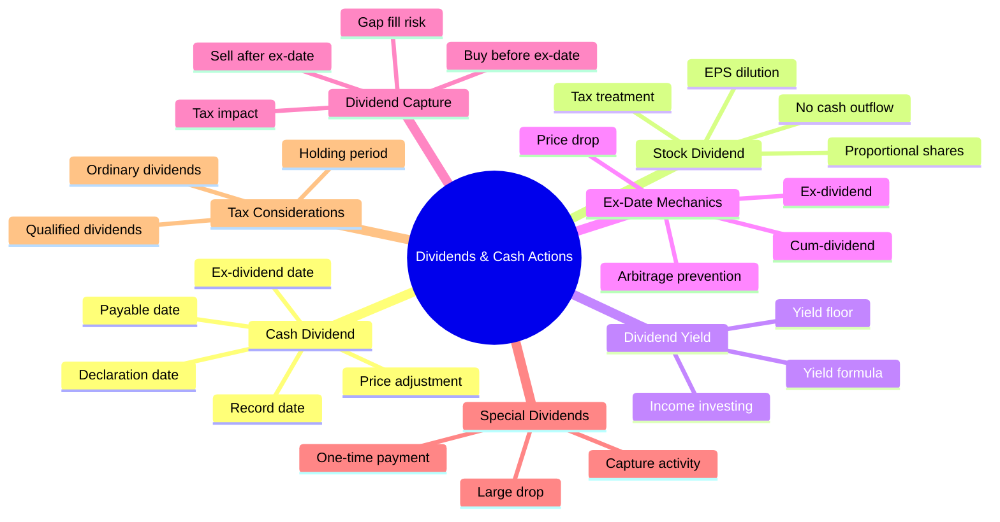
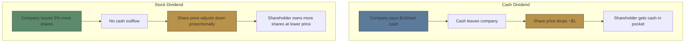

# Module 9: Dividends & Cash Actions

Est. study time: 2.5h
Language: en
Description: Cash dividends, stock dividends, ex-date mechanics, dividend capture strategy, special dividends, tax treatment

## Knowledge Map

---

## Learning Objectives
- Distinguish cash dividends from stock dividends and calculate dividend yield
- Explain ex-dividend date mechanics and why price adjusts on ex-date
- Identify key dividend dates in order: declaration, ex-date, record, payable
- Evaluate dividend capture strategy risks and tax implications
- Understand qualified vs ordinary dividend tax treatment
- Analyze special dividend scenarios and market impact

---

## Real-World Example

Apple (AAPL) has paid ~$0.96/quarter per share since 2012 dividend reinstatement. On May 2, 2024, Apple declared a $0.25 dividend with ex-date May 10. Traders who bought before May 10 got dividend; those who bought May 10 missed it. The stock price adjusted down by approximately $0.25 on ex-date, eliminating any arbitrage opportunity.

> **Think**: Why would a cash-rich company like Apple pay dividends instead of reinvesting all profits?
>
> *Answer: Mature companies generate more cash than profitable reinvestment opportunities. Dividends return excess capital to shareholders. They also signal financial health and attract income-focused institutional investors. Apple's $100B+ cash hoard makes dividends a capital allocation tool.*

---

## Core Content

### Section 1: Cash Dividends

**Dividend:** Distribution of company profits to shareholders. Board declares dividend on **declaration date**.

| Term | Definition | Example |
|------|-----------|---------|
| Declaration date | Board announces dividend | Feb 1 |
| Ex-dividend date | First day stock trades WITHOUT dividend right | Mar 6 |
| Record date | Shareholders of record eligible for dividend | Mar 8 |
| Payable date | Cash sent to shareholders | Mar 31 |

**Ex-date mechanics (critical):**

> **Cloze**: "On ex-dividend date, stock price drops approximately by the {dividend amount} because new buyers are not entitled to the {dividend}. The adjustment ensures {no arbitrage} opportunity."
>
> *Answer: dividend amount, dividend, no arbitrage*

Example: Stock $100, dividend $1. On ex-date, stock opens at ~$99. The $1 value transfers from stock price to cash in shareholder's pocket.

#### Dividend Yield

**Yield = Annual dividend ÷ Stock price**

- High-dividend stock: $4/year ÷ $100 = 4% yield
- Growth stock (no dividend): 0% yield

> **Think**: Stock price drops 20%. Dividend unchanged. What happens to yield?
>
> *Answer: Yield increases. $4 dividend, stock drops from $100 to $80 → yield = $4/$80 = 5%. Higher yield often attracts income investors, potentially supporting price. This is why dividend stocks are less volatile during downturns — the yield floor.*

#### Stock Dividend

Company issues additional shares instead of cash. Example: 5% stock dividend = 5 extra shares per 100 owned.

- Conserves cash (no cash outflow)
- Dilutes EPS proportionally
- Taxed differently — generally not taxable until sale (treated as a return of capital), BUT this assumes the company has sufficient earnings & profits (E&P). Stock dividends from companies without adequate E&P can be taxable as ordinary income

> **Predict**: Company pays $2 cash dividend and simultaneously declares 10% stock dividend. What happens to share price?
>
> *Answer: Double effect. Cash dividend → price drops ~$2. Stock dividend → price further adjusts by ~9.1% (to account for extra shares). Net effect: price × (1 - $2/price) × (1 / 1.10). Shareholder total value similar but distributed differently (cash + more shares).*

---

### Section 2: Ex-Date Mechanics & Dividend Capture

**Ex-date** is the key date for traders:

| Trade Date | Dividend Eligible? |
|------------|-------------------|
| Day before ex-date (cum-dividend) | YES — buyer gets dividend |
| Ex-date or after | NO — seller keeps dividend |

**Why price drops on ex-date:**
- Before ex-date: stock includes dividend entitlement (cum-dividend)
- On ex-date: stock trades ex-dividend (without entitlement)
- Price adjusts by ~dividend amount to prevent arbitrage

> **Think**: If price didn't adjust on ex-date, what would happen?
>
> *Answer: Arbitrage. Buy stock day before ex-date at $100, get $1 dividend, sell same day at $100 → free $1. Everyone would do this. Price drop prevents risk-free profit. In practice, adjustment is approximate — market forces (supply/demand, tax, sentiment) cause deviation.*

#### Dividend Capture Strategy

Buy stock just before ex-date, collect dividend, sell after ex-date (or on ex-date).

**Reality check:**
- Price drops by ~dividend → net $0 before taxes
- After tax: cash dividend taxed as ordinary income (or qualified at lower rate)
- If stock drops by dividend amount: you lose dividend to price decline → taxed on phantom gain
- **Strategy works only if price recovers quickly (gap fill)**

> **Cloze**: "Dividend capture strategy assumes stock price {recovers} after ex-date drop. In reality, price drop offsets {dividend}. After {tax}, strategy often loses money unless price {appreciates}."
>
> *Answer: recovers, dividend, tax, appreciates*

> **Spot the Mistake**: "Buying a stock right before ex-date is free money — you collect the dividend and can sell the next day."
>
> What's wrong?
>
> *Answer: Price drops by approximately the dividend amount on ex-date. You collect $1 dividend but lose ~$1 in share value. After taxes, you lose money. The strategy only profits if the stock price recovers quickly (gap fills), which is uncertain. Market prices dividend capture into the ex-date adjustment.*

#### Special Dividends and Extra Dividends

Occasional large one-time dividends (e.g., Microsoft $3 special in 2004, $32B total). These cause larger ex-date price drops and attract more capture activity.

**Tax considerations:**
- Qualified dividends: taxed at capital gains rate (0%/15%/20%)
- Ordinary dividends: taxed as regular income
- Holding period requirement: must hold stock for **more than 60 days during the 121-day period that begins 60 days before the ex-dividend date** (per IRS) for qualified status

> **Predict**: Stock at $200 announces $5 special dividend. Ex-date is 2 weeks away. Institutional holders own 70% of shares. What happens to price and volume before and after ex-date?
>
> *Answer: Arbitrageurs and dividend-capture traders buy before ex-date, pushing price up slightly (price includes dividend). Volume spikes. On ex-date, price drops $5 at open. Many short-term sellers exit. Price may continue downward if no natural buyers at adjusted price. Institutions who hold for qualified dividend treatment absorb some selling. Net effect: temporary price distortion around ex-date from dividend-related trading.*

---

### Why This Matters

Dividend dates determine cash flows from your portfolio. Missing an ex-date means losing a dividend you expected. Misunderstanding dividend capture can lead to unprofitable trades. Tax treatment of dividends directly affects after-tax returns — qualified vs ordinary status can double your tax bill. Every equity trader needs to understand ex-date mechanics to avoid costly mistakes.

---

## Key Takeaways
- Cash dividend: company distributes profit. Ex-date → price drops ~dividend amount.
- Stock dividend: more shares, proportional price adjustment, no cash outflow.
- Dividend yield = annual dividend / stock price. Yield rises when price falls.
- Ex-date is cutoff for dividend eligibility. Buy before ex-date, not on/after.
- Dividend capture rarely profitable after tax and price adjustment.
- Qualified dividends taxed at lower capital gains rate; ordinary dividends taxed as income.
- Special dividends cause larger ex-date drops and attract more capture activity.

---

## Common Misconception

**"I can buy a stock the day before ex-date, collect the dividend, sell the next day, and make free money."**

False. Price drops by ~dividend amount on ex-date. You collect $1 dividend but lose $1 in share value. After taxes, you lose money. Strategy only works if stock recovers quickly (gap fill) or if you hold long enough. The market prices dividend capture into the ex-date adjustment.

---

## Spot the Mistake

"A 5% stock dividend gives you 5% more value because you own more shares."

What's wrong?

*Answer: More shares but each share worth proportionally less. 100 shares at $50 each = $5,000 total. 5% stock dividend → 105 shares at ~$47.62 each = $5,000 total. Economic value identical. Stock dividends are cosmetic — they conserve cash but don't create value.*

---

## Feynman Explain

(Explaining ex-dividend date to a friend who thinks they can "buy the dividend": It's like buying a $20 pizza that comes with a free $5 soda. On ex-date, the pizza becomes $15 and no soda. The soda was part of the price. You didn't "get" $5 — you just swapped value from one pocket to another.)

---

## Reframe

(Company CEO proposes eliminating dividend to fund R&D. As a board member, argue both sides: dividend signals stability and attracts income investors vs R&D investment drives long-term growth. What if the company is mature vs early-stage? What if shareholders are primarily retirees vs growth funds?)

---

## Drill

Run: `learn.sh quiz equity-trading 9`
Run: `learn.sh cloze equity-trading 9`
