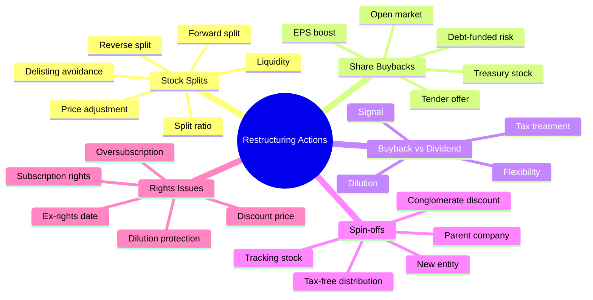
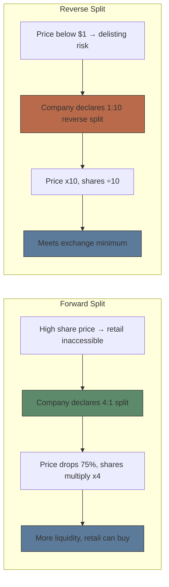

# Module 10: Restructuring Actions

Est. study time: 2.5h
Language: en
Description: Stock splits (forward and reverse), share buybacks, spin-offs, tracking stock, rights issues, dilution mechanics

## Knowledge Map

---

## Learning Objectives
- Describe forward and reverse stock splits — ratio mechanics and why companies use each
- Calculate post-split price and share count for any split ratio
- Understand buyback methods and EPS impact
- Compare buybacks vs dividends as capital return mechanisms
- Identify spin-off mechanics and rationale
- Evaluate rights issue mechanics and calculate theoretical ex-rights price

---

## Real-World Example

Apple announced a 4:1 stock split in 2020 — share price went from ~$500 to ~$125 overnight. Your portfolio value unchanged. Why do companies do this? Meanwhile, struggling companies like Citigroup did 1:10 reverse splits to avoid delisting. And Apple has spent over $500B on buybacks since 2012, repurchasing ~40% of its outstanding shares.

> **Think**: Stock split cuts price in half (2:1). Does it create value for shareholders?
>
> *Answer: No — total market cap unchanged. More shares at lower price. Economic value same. Splits make shares more accessible to retail investors and may improve liquidity. Some argue splits signal confidence. Statistically, split stocks outperform post-split (liquidity + signaling effect). But mechanically, it's a cosmetic change.*

---

## Core Content

### Section 1: Stock Splits — Forward & Reverse

#### Forward Split

Company increases shares outstanding proportionally. Split ratio expressed as N:1.

| Ratio | Before | After |
|-------|--------|-------|
| 2:1 | 100 shares @ $200 | 200 shares @ $100 |
| 3:1 | 100 shares @ $300 | 300 shares @ $100 |
| 4:1 | 100 shares @ $500 | 400 shares @ $125 |

**Who does forward splits and why:**
- High-price stocks (Apple $500, Tesla $900, Nvidia $1,200)
- Lower price → retail affordability → liquidity improvement
- Psychological: $100/share "feels" cheaper than $500
- No change in market cap, voting power, or economic value

#### Reverse Split

Company reduces shares outstanding. Stock price increases proportionally.

| Ratio | Before | After |
|-------|--------|-------|
| 1:10 | 100 shares @ $0.50 | 10 shares @ $5.00 |
| 1:25 | 100 shares @ $0.20 | 4 shares @ $5.00 |

**Who does reverse splits and why:**
- Stocks falling below exchange minimum bid price ($1 for NYSE/Nasdaq)
- Avoid delisting — reverse split boosts price above $1
- Also used to attract institutional investors (many banned from sub-$5 stocks)
- Perception problem: often signals distress

> **Think**: Reverse split creates higher share price. Does it fix underlying business problems?
>
> *Answer: No — total market cap unchanged. Reverse split doesn't add value. It's cosmetic, like exchanging one $5 bill for five $1 bills. Companies doing reverse splits often continue declining afterwards. Studies show reverse split stocks underperform post-split — the signal is weakness.*

> **Cloze**: "Forward split {increases} shares outstanding and {decreases} share price. Reverse split {decreases} shares outstanding and {increases} share price. In both cases, market cap is {unchanged}."
>
> *Answer: increases, decreases, decreases, increases, unchanged*

> **Predict**: Stock trading at $0.80 announces 1:20 reverse split. Post-split price? What if price still drops after?
>
> *Answer: $0.80 × 20 = $16.00. If stock continues falling below $1, company needs another reverse split or faces delisting. Some companies do multiple reverse splits. Eventually hits zero regardless of split mechanics.*

---

### Section 2: Share Buybacks

Company buys own shares in open market or via tender offer.

**How it works:**
- Company spends cash to buy shares
- Shares become treasury stock (or retired)
- Fewer shares outstanding → higher EPS

**Example:**
- Company earns $100M, 50M shares outstanding → EPS = $2.00
- Buys back 10M shares → 40M shares outstanding → EPS = $2.50
- EPS boosted 25% without any earnings growth

**Buyback vs Dividend:**

| | Buyback | Dividend |
|---|---------|----------|
| Tax treatment | Deferred (capital gains) | Immediate (taxable income) |
| Flexibility | No commitment | Hard to cut without angering investors |
| Signal | Shares undervalued | Confidence in cash flow |
| Dilution | Reduces dilution | No effect on share count |

**Criticism:** Buybacks criticized for enriching executives (options tied to EPS), reducing investment, and inflating stock prices.

> **Think**: Company borrows money to buy back stock. EPS increases. Did the company create value?
>
> *Answer: Maybe not. Leverage increases risk. Debt-funded buybacks boost EPS but increase financial fragility. If recession hits, company now must service debt while earnings decline. Some argue buybacks are value-neutral (Modigliani-Miller), while others see them as optimal capital return when tax-advantaged.*

> **Spot the Mistake**: "Buybacks always benefit shareholders because EPS increases."
>
> What's wrong?
>
> *Answer: EPS increases mechanically from fewer shares, but the company spent cash to achieve this. If shares were bought above intrinsic value, remaining shareholders lose. Debt-funded buybacks increase financial risk. EPS is an accounting metric — value creation depends on whether the buyback price was below intrinsic value.*

---

### Section 3: Spin-offs & Rights Issues

#### Spin-offs

Parent company separates subsidiary or division into independent company. Shares distributed pro-rata to existing shareholders.

**Example:** PayPal spin-off from eBay (2015). eBay shareholders received 1 PayPal share for each eBay share held.

**Why spin-off:**
- Unlock value — sum of parts > whole (conglomerate discount)
- Focus — each company pursues own strategy
- Tax-free distribution to shareholders
- Pure-play investment for shareholders

**Tracking stock:** Not a true spin-off. Parent issues tracking stock tied to division performance. Shareholders have limited rights — used when full separation impractical.

> **Cloze**: "A spin-off creates a new {independent} company whose shares are distributed to existing shareholders. This can unlock value by eliminating the {conglomerate} discount. {Tracking} stock is an alternative with limited shareholder rights."
>
> *Answer: independent, conglomerate, Tracking*

#### Rights Issues (Rights Offering)

Company offers existing shareholders right to buy additional shares at discount.

**Mechanics:**
- Company issues **rights** to shareholders
- Each right allows buying X new shares at Y price (below market)
- Rights tradable on exchange during offering period
- **Ex-rights date:** Stock trades without rights attached

**Why companies use rights issues:**
- Raise capital quickly
- Existing shareholders maintain ownership percentage (pre-emptive rights)
- Alternative to secondary offering (which dilutes existing holders)

> **Cloze**: "Rights issue gives existing shareholders right to buy new shares at a {discount} to market price. This protects against {dilution}. Rights are often {tradable} during the offering period. The ex-rights date marks when stock trades {without} rights."
>
> *Answer: discount, dilution, tradable, without*

**Oversubscription privilege:** Shareholders can buy more than their pro-rata share if other rights go unexercised.

> **Predict**: Stock at $50. Company announces 1-for-5 rights issue at $40. What is theoretical ex-rights price?
>
> *Answer: Formula = (5 × $50 + 1 × $40) / (5 + 1) = ($250 + $40) / 6 = $48.33. Right value = $48.33 − $40 = $8.33 per right. Without subscription, shareholder loses value (dilution).*

---

### Why This Matters

Corporate restructuring actions directly impact portfolio value. Split ratios change position sizes. Buybacks affect EPS and stock prices. Spin-offs create separate companies to value. Rights issues require decision — subscribe or watch dilution. Ignoring these events means leaving money on the table or taking unnecessary losses.

---

## Key Takeaways
- Forward split reduces price (retail accessibility). Reverse split increases price (avoid delisting).
- Market cap unchanged in both split types. Economic value identical.
- Buybacks reduce shares outstanding, increase EPS. Controversial when debt-funded.
- Buybacks offer tax advantage vs dividends but lack dividend's commitment signal.
- Spin-off creates independent company, shares distributed to parent shareholders.
- Rights issue lets existing holders buy discounted shares, protecting from dilution.
- Ex-rights date determines eligibility. Subscribe or face dilution.

---

## Common Misconception

**"Stock splits make your shares more valuable."**

False. A 2:1 split doubles your shares but halves the price. Your total portfolio value is identical. The pizza is cut into 8 slices instead of 4 — you still have the same pizza. The only real effects: improved liquidity, potential retail demand, and psychological perception.

---

## Spot the Mistake

"A reverse split creates value by increasing the stock price — your shares are worth more."

What's wrong?

*Answer: Market cap unchanged. 10 shares at $0.50 become 1 share at $5.00. Total value same ($5). Reverse split doesn't fix underlying business problems. Often signals distress — stock may continue declining after split. Many companies delist despite (or after) reverse splits.*

---

## Feynman Explain

(Explaining stock splits: Imagine you have a $100 bill. Company does a 2:1 split — now you have two $50 bills. Same total money, just smaller denominations. Easier to spend (buy) but you're not richer. Reverse split: trading in ten $1 bills for one $10 bill. Still have $10. No value created.)

---

## Reframe

(Treasury Secretary considers banning stock buybacks. Argue both sides using: capital allocation efficiency vs executive enrichment, investment vs distribution, debt-funded buybacks vs dividend policy. What about companies like Apple with $100B cash?)

---

## Drill

Run: `learn.sh quiz equity-trading 10`
Run: `learn.sh cloze equity-trading 10`
