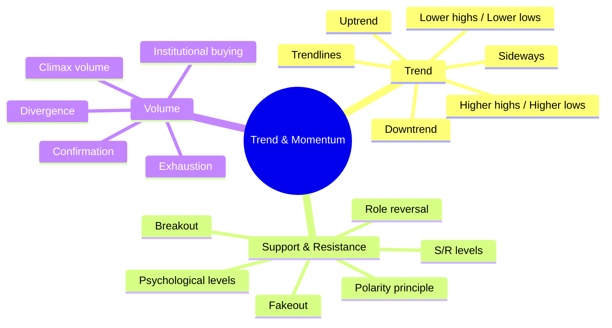
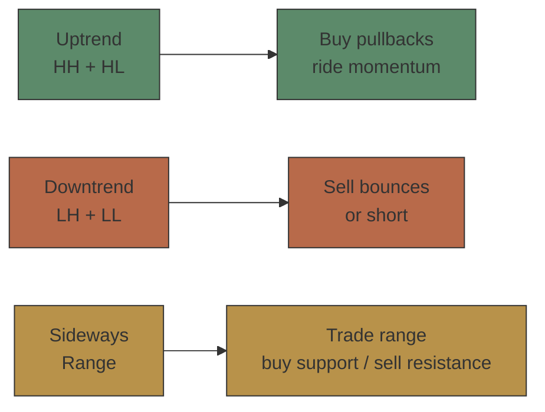
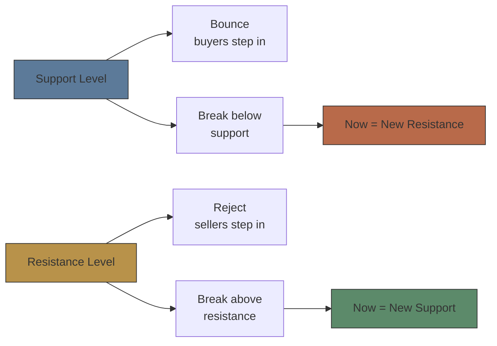

# Module 11: Technical Analysis — Trend & Momentum

Est. study time: 2.5h
Language: en
Description: Trends (uptrend, downtrend, sideways), trendlines, support and resistance, role reversal, volume analysis, divergence

## Knowledge Map

---

## Learning Objectives
- Identify uptrend, downtrend, and sideways market structure
- Draw trendlines and recognize valid trendline breaks
- Identify support/resistance levels and apply role reversal
- Distinguish breakout from fakeout using volume confirmation
- Interpret volume as confirmation or divergence signal
- Recognize climax volume as trend exhaustion warning

---

## Real-World Example

You buy AAPL at $175 after it rallied from $150. Next week it drops to $165. You panic-sell. Two weeks later, it's back at $180. What happened? You bought into a pullback within an uptrend — but you mistook a normal dip for a reversal. You had no framework for distinguishing pullback from trend change.

> **Think**: Why do novice traders sell at the worst possible time — bottoms of pullbacks in uptrends?
>
> *Answer: They lack trend context. They see red days and feel fear, not recognizing the larger uptrend structure. Every pullback feels like a crash. A trend framework provides context to distinguish noise from true reversals.*

---

## Core Content

### Section 1: Trend — The Market's Direction

**Trend** = persistent directional movement in price. Markets trend because of information flow, capital flows, and herding behavior.

Three types:

| Trend | Price Structure | Trader Action |
|-------|----------------|---------------|
| Uptrend | Higher highs + higher lows | Buy dips |
| Downtrend | Lower highs + lower lows | Sell rallies |
| Sideways | Range-bound, no clear direction | Buy low / sell high in range |

**Drawing trendlines:** Connect at least 2 swing lows (uptrend) or swing highs (downtrend). Third touch confirms. Steeper trendlines break faster.

> **Think**: Stock makes higher highs for 6 months. Suddenly it makes a lower low. Trend still intact?
>
> *Answer: One lower low alone doesn't end an uptrend — need sequence of lower highs AND lower lows. But it's a warning. If next swing high fails to exceed prior high, trend is weakening. Two failures = trend change probable.*

> **Cloze**: "An uptrend is defined by a series of {higher highs} and {higher lows}. A downtrend is defined by {lower highs} and {lower lows}."
>
> *Answer: higher highs, higher lows, lower highs, lower lows*

---

### Section 2: Support and Resistance — The Market's Memory

**Support** = price level where buying pressure overcomes selling pressure (floor).
**Resistance** = price level where selling pressure overcomes buying pressure (ceiling).

**Role reversal** (polarity principle): Once support breaks, it becomes resistance. Once resistance breaks, it becomes support.

**Key principles:**
- Round numbers ($100, $50) act as psychological S/R
- More touches = stronger level (tested 3x stronger than 1x)
- Support/resistance are ZONES, not exact lines (+/- 1-2%)
- Volume confirms: break on heavy volume → more reliable

> **Predict**: Stock trades in $50-$55 range for 3 months, touching $50 five times. It finally breaks below $50 on low volume. What happens next?
>
> *Answer: Low-volume break below strong support is suspect — could be a "fakeout" (bear trap). Price often snaps back above. If it holds below on high volume second attempt, $50 becomes resistance. Otherwise, expect reversion into range.*

> **Cloze**: "When a support level breaks, it often becomes a new {resistance} level. This is called {role reversal} or the {polarity} principle."
>
> *Answer: resistance, role reversal, polarity*

---

### Section 3: Volume Analysis — The Fuel Behind Price

Volume confirms price moves. Price + volume = conviction. Price alone = noise.

| Price Moves Up on | Interpretation |
|-------------------|---------------|
| Rising volume | Strong trend, conviction, institutional buying |
| Falling volume | Weak trend, exhaustion, possible reversal |
| **Price Moves Down on** | |
| Rising volume | Strong selling pressure, conviction |
| Falling volume | Weak selling, potential bottom |

**Volume divergence:** Price makes higher high but volume makes lower high → trend weakening. Bearish warning.

**Climax volume:** Spike in volume after prolonged trend → trend exhaustion → reversal likely.

> **Think**: Stock rallies 30% over 3 weeks. On the last up-day, volume is 3x average. Bullish or bearish?
>
> *Answer: Could be either. Climax volume suggests exhaustion — everyone who wanted to buy has bought. Remaining buyers are depleted. Often marks a top. But if it's breakout from long consolidation with new catalyst, high volume confirms conviction. Context matters: check if volume was increasing throughout rally or just at peak.*

> **Spot the Mistake**: "Declining volume on rising prices confirms the uptrend — no selling pressure."
>
> What's wrong?
>
> *Answer: Wrong. Declining volume on rising prices is DIVERGENCE — each new high attracts fewer buyers. Trend is weakening, not strengthening. Volume should INCREASE to confirm a healthy uptrend. This is a warning sign.*

> **Cloze**: "Volume should {confirm} price action. If price rises but volume falls, this is called {divergence} and signals trend {weakness}."
>
> *Answer: confirm, divergence, weakness*

---

### Why This Matters

Trend identification is the first step in every trading decision. Support/resistance levels determine where to enter, place stops, and take profits. Volume tells you whether a move is real or fake. Without these tools, traders buy tops, sell bottoms, and get stopped out by normal noise. Trend and momentum analysis provides the framework to trade with the market, not against it.

---

## Key Takeaways
- Identify trend structure first: HH/HL = up, LH/LL = down, range = sideways.
- Support/resistance levels are zones, not lines. Role reversal is key.
- Draw trendlines connecting at least 2 points; third touch confirms validity.
- Volume confirms or diverges from price — divergence warns of reversals.
- Breakout on low volume is suspect. Breakout on high volume is reliable.
- Climax volume after prolonged trend suggests exhaustion and potential reversal.

---

## Common Misconception

**"Technical analysis is self-fulfilling prophecy."**

Partial truth. S/R levels work because many traders watch them — but the mechanism is real: limit orders cluster at round numbers, algos react to level breaks, institutions accumulate at support. Self-fulfilling doesn't mean useless — it means the market is a social phenomenon. What matters is that enough participants believe in the level for it to function.

---

## Spot the Mistake

"Price broke below support on low volume. This confirms the downtrend."

What's wrong?

*Answer: Low-volume breakdown is often a fakeout (bear trap). It suggests lack of selling conviction, not genuine breakdown. Price frequently snaps back above. Wait for high-volume confirmation or a retest that fails before treating the break as valid.*

---

## Feynman Explain

(Explain support and resistance to a child using a bouncing ball. Price bounces off the floor (support) and hits the ceiling (resistance). Every time it hits the floor, it bounces back. Break through the floor = new basement. Break through the ceiling = new floor.)

---

## Reframe

(Trader relies only on price action ignoring volume. Another trader uses volume as primary filter. Compare outcomes over 100 trades. Which trader has better edge? When is volume more important — trending markets or range-bound markets?)

---

## Drill

Run: `learn.sh quiz equity-trading 11`
Run: `learn.sh cloze equity-trading 11`
