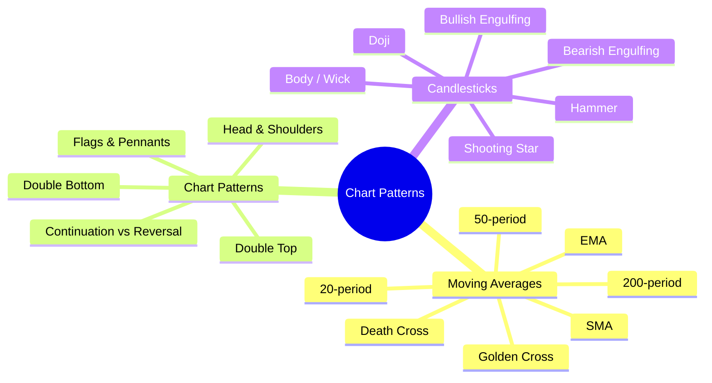
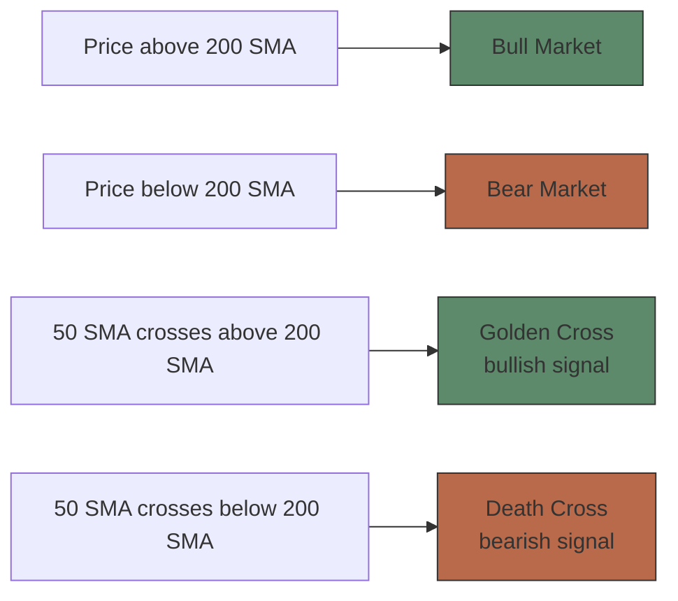
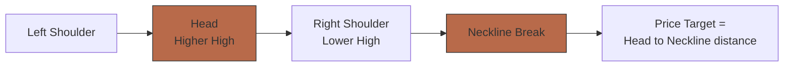

# Module 12: Technical Analysis — Chart Patterns

Est. study time: 2.5h
Language: en
Description: Moving averages (SMA, EMA), golden cross, death cross, head and shoulders, double top/bottom, flags, candlestick patterns

## Knowledge Map

---

## Learning Objectives
- Calculate SMA and EMA; explain why EMA responds faster
- Identify golden cross and death cross signals
- Recognize head and shoulders, double top/bottom, and flag patterns
- Calculate measured move price targets for chart patterns
- Read basic candlestick patterns: doji, hammer, shooting star, engulfing
- Distinguish continuation patterns from reversal patterns

---

## Real-World Example

In March 2020, the S&P 500's 50-day SMA crossed below its 200-day SMA — a death cross. The index had already fallen 30%. Many traders sold on the death cross, only to miss the subsequent rally. The death cross was a lagging confirmation of a crash that had already happened. Meanwhile, in August 2020, a golden cross formed as markets recovered. Which signal was more useful — the death cross or the golden cross?

> **Think**: Moving average crossovers are lagging indicators. Are they still useful despite the delay?
>
> *Answer: Yes — lagging doesn't mean useless. Crossovers confirm trend changes with high reliability. The trade-off: earlier entry (less confirmation) vs later entry (more confidence). Death crosses during corrections can be false signals if trend reverses quickly. Golden crosses in emerging uptrends are more reliable. Use with volume and price action for context.*

---

## Core Content

### Section 1: Moving Averages — Trend Smoothing

**Simple Moving Average (SMA):** Average price over N periods, equal weighting.
**Exponential Moving Average (EMA):** More weight to recent prices, reacts faster.

Formula: `SMA = (P₁ + P₂ + ... + Pₙ) / N`
Formula: `EMA = Price × k + EMA(prev) × (1 - k)`, where `k = 2 / (N + 1)`

| MA | Common Periods | Use Case |
|----|---------------|----------|
| 20 SMA/EMA | Short-term | Trend direction, pullback entries |
| 50 SMA/EMA | Medium-term | Trend health, support/resistance |
| 200 SMA | Long-term | Major trend, bull/bear market line |

**Golden Cross:** 50-day SMA crosses ABOVE 200-day SMA → bullish (long-term trend turning up).
**Death Cross:** 50-day SMA crosses BELOW 200-day SMA → bearish (long-term trend turning down).

**Price relative to MA:**
- Price above rising 50 SMA → trend is your friend
- Price below falling 50 SMA → stay away
- Price far above MA (20%+) → extended, likely to revert

> **Think**: 50-day SMA crosses above 200-day SMA while both are declining. Valid golden cross?
>
> *Answer: No. Golden cross requires BOTH averages sloping upward after the cross — indicates emerging uptrend. If both still declining, the cross is a whipsaw (both MAs still pointing down). Wait for confirmation: rising price above both MAs.*

> **Spot the Mistake**: "The 50-day SMA is more responsive to recent price changes than the 20-day EMA."
>
> What's wrong?
>
> *Answer: Two errors. (1) EMA is always more responsive than SMA of same period — EMA weights recent prices more. (2) 20-period moving average is more responsive than 50-period regardless of type. Shorter period = faster response. The statement reverses both facts.*

---

### Section 2: Chart Patterns — Market's Signature

**Head and Shoulders** (H&S) — Reversal pattern (top → downtrend)

Structure: Left shoulder → Higher high (head) → Lower high (right shoulder). Neckline = support line connecting lows. Break below neckline = confirmed.

**Double Top** — Bearish reversal. Two peaks at similar level. Break below valley between them = confirmed.

**Double Bottom** — Bullish reversal. Two troughs at similar level. Break above peak between them = confirmed.

**Flags** — Continuation pattern. Sharp move up (flagpole) → consolidation (flag) → continuation.

Difference: H&S/double top = trend REVERSAL. Flags = trend CONTINUATION.

> **Cloze**: "The head and shoulders pattern signals a trend {reversal} from bullish to {bearish}. The {neckline} is the support level connecting the two troughs."
>
> *Answer: reversal, bearish, neckline*

> **Predict**: After 6-month uptrend, stock forms double top at $60. The valley is at $54. Stock breaks below $54 on high volume. Price target?
>
> *Answer: Target = valley - (peak - valley) = $54 - ($60 - $54) = $54 - $6 = $48. Measured move projection. Break below $54 with high volume confirms the pattern. If volume was low, could be a fakeout — wait for confirmation.*

---

### Section 3: Candlestick Basics — Reading Single Bars

Candlestick parts: **Body** (open to close), **Wick/Shadow** (high to low), **Color** (green/white = close > open, red/black = close < open).

| Pattern | Appearance | Signal |
|---------|-----------|--------|
| **Doji** | Open ≈ Close, long wicks | Indecision. After uptrend → potential top. After downtrend → potential bottom |
| **Hammer** | Small body at top, long lower wick | Bullish reversal after downtrend |
| **Shooting Star** | Small body at bottom, long upper wick | Bearish reversal after uptrend |
| **Bullish Engulfing** | Red candle followed by larger green candle covering previous body | Bullish reversal after downtrend |
| **Bearish Engulfing** | Green candle followed by larger red candle covering previous body | Bearish reversal after uptrend |

> **Cloze**: "A {doji} forms when open and close are nearly equal, indicating {indecision}. After an uptrend, it warns of potential {reversal}. A hammer has a small body and long lower {wick}, signaling bullish reversal after a downtrend."
>
> *Answer: doji, indecision, reversal, wick*

> **Predict**: Stock in downtrend. Doji forms at support level on high volume. Next candle is a long green candle with close above doji's high. What happens next?
>
> *Answer: Bullish reversal setup. Doji = indecision (sellers losing control). Support level = institutional buying zone. High volume = conviction. Green candle confirms reversal. Anticipate move up. Stop loss below doji low.*

---

### Why This Matters

Moving averages define trend direction and dynamic support/resistance. Chart patterns reveal market psychology — where traders pile in and where they panic. Candlesticks show who's winning each session. Together, they provide a complete technical framework. Every institutional trader and algorithmic system watches these same patterns.

---

## Key Takeaways
- 20/50/200-period MAs identify trend direction. Crossovers signal regime changes.
- Golden cross = 50 SMA crosses above 200 SMA (bullish). Death cross = opposite (bearish).
- EMA responds faster than SMA of same period. Shorter period = faster response.
- H&S and double tops/bottoms indicate reversals. Flags indicate continuation.
- Measured move target: pattern height projected from breakout point.
- Single candlestick patterns (doji, hammer, engulfing) reveal short-term sentiment shifts.
- Always wait for confirmation (volume + follow-through) before acting on patterns.

---

## Common Misconception

**"Moving average crossovers predict market direction."**

They confirm, not predict. By the time a golden cross forms, price has already been rising for weeks. The crossover tells you the trend has changed, not that it will change. The value is in distinguishing signal from noise — confirming that a move has sufficient duration and magnitude to matter.

---

## Spot the Mistake

"A flag pattern signals trend reversal because price breaks the flag's lower boundary."

What's wrong?

*Answer: Flags are CONTINUATION patterns. Break of the lower boundary in an uptrend would be a failed flag, not a reversal signal. Flags consolidate after a sharp move then continue in the same direction. The expected direction is continuation, not reversal.*

---

## Feynman Explain

(Explaining moving averages: Imagine walking your dog. The dog (price) zigs and zags everywhere. But if you look at the path you walked over the last hour (moving average), you see the true direction. A 50-day MA is a 50-minute average of your walk. The EMA is like watching the last 10 minutes more carefully — you notice turns faster.)

---

## Reframe

(Judge: Are moving average crossovers (golden/death cross) actionable signals or lagging indicators that get you in late? Consider the trade-off between confirmation (wait for cross) and timeliness (enter before cross). When would a trader prefer leading vs lagging signals?)

---

## Drill

Run: `learn.sh quiz equity-trading 12`
Run: `learn.sh cloze equity-trading 12`
