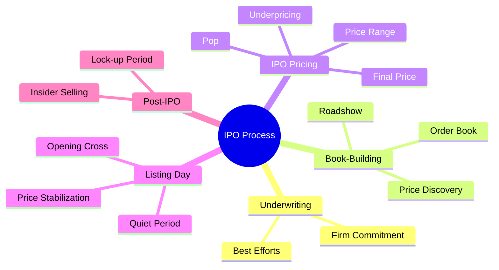
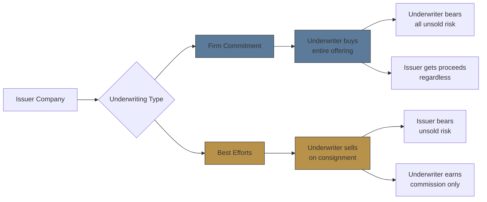
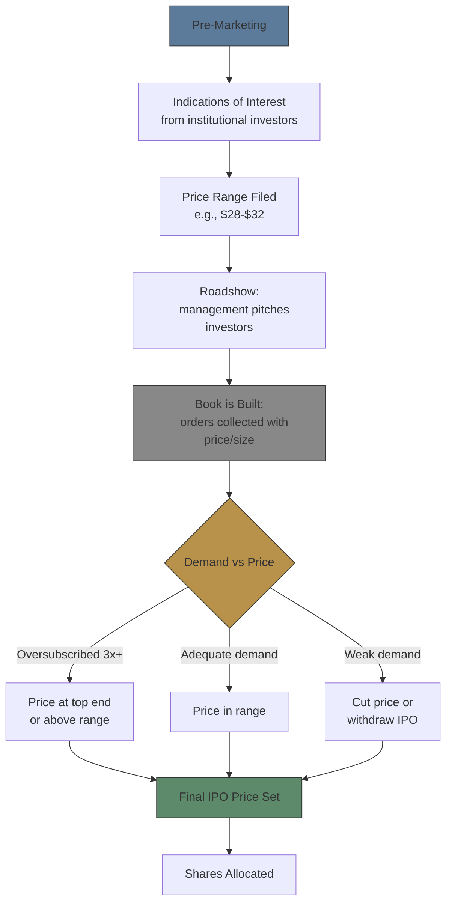
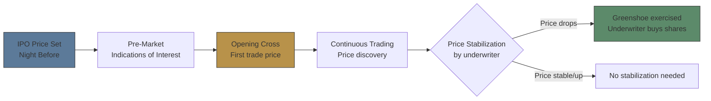

# Module 13: IPO Process

Est. study time: 1.5h
Language: en
Description: Underwriting, book-building, IPO pricing mechanics, listing day process, lock-up periods

## Knowledge Map



---

## Learning Objectives
- Distinguish firm commitment from best efforts underwriting
- Explain book-building process and how IPO price is determined
- Calculate IPO proceeds, underpricing, and money left on table
- Describe listing day mechanics and opening cross
- Define lock-up periods and their trading impact

---

## Real-World Example

Rivian IPO'd at $78 in Nov 2021. First trade hit $106 — $28/share "left on table." Company raised ~$12B but could have raised ~$16B at first-trade price. Was this a mistake?

> **Think**: If Rivian could have raised $28 more per share, why didn't they? What risk would they face by pricing too high?
>
> *Answer: Underpricing is often intentional — compensates institutional investors for risk on untested stock, ensures oversubscription, avoids reputational disaster of "broken IPO" (stock falls day one). Pricing too high risks weak demand → price drops → company burns underwriting relationships. Money left on table is insurance premium for successful debut.*

---

## Core Content

### Section 1: Underwriting — Firm Commitment vs Best Efforts

Underwriter = investment bank managing IPO, buying shares from issuer, reselling to public.



- **Firm Commitment**: Underwriter buys all shares at agreed price, resells to public. Underwriter bears risk. Most common for large IPOs.
- **Best Efforts**: Underwriter acts as agent — sells what it can, returns unsold to issuer. Issuer bears risk. Used for smaller/riskier offerings.

> **Think**: Why would issuer choose best efforts over firm commitment? Would you expect best efforts for well-known unicorn or small biotech?
>
> *Answer: Best efforts shifts risk to issuer. Small/risky companies use it because no bank will guarantee deal (e.g., early-stage biotech with no revenue). Well-known unicorns command firm commitment — banks compete for mandate.*

> **Cloze**: "In {firm commitment} underwriting, the underwriter bears the risk of unsold shares. In {best efforts} underwriting, the issuer bears that risk."
>
> *Answer: firm commitment, best efforts*

### Section 2: Book-Building Process

IPO price discovered through book-building, not formula:



Process:
1. File preliminary prospectus (S-1) with price range
2. Roadshow — management meets institutional investors, pitches story
3. Investors submit bids: "I want X shares at Y price"
4. Underwriter builds "book" of demand, gauges clearing price
5. Night before listing: final price set based on order book

> **Think**: Company files range $28-$32. Book shows 5x oversubscription at $32. Should they price above range?
>
> *Answer: Often yes — provided SEC allows. Many IPOs price above filed range when demand strong. But extreme jumps signal initial range was inaccurate, eroding trust. Example: Snowflake filed $75-$85, priced at $120 — more than doubled on day one.*

> **Cloze**: "The {book-building} process collects institutional orders at various price levels to determine the {clearing price} for an IPO."
>
> *Answer: book-building, clearing price*

**Example:**
```text
TechCo files IPO: range $30-$34
- Roadshow generates strong interest
- Final order book: 40M shares demanded, only 10M available
- Underwriter prices at $35 (above range)
- First trade opens at $42
- "Pop" = $7 (20%)
```

> **Predict**: What happens if book-building shows only 80% coverage at bottom of price range?
>
> *Answer: Underwriter likely cuts price (e.g., $30-$34 to $26-$28) or reduces deal size. If demand stays weak, they may withdraw IPO entirely. Continuing with weak demand guarantees "broken IPO" (first-day drop), damaging underwriter reputation.*

### Section 3: IPO Pricing — The Mechanics

Pricing is final step before listing:

```text
Final Price = f(supply, demand, market conditions, aftermarket stability)

Gross Proceeds = IPO Price × Shares Offered
Underwriter Fee = Gross Proceeds × Spread (typically 3-7%)
Net Proceeds = Gross Proceeds - Underwriter Fee
```

- **Spread**: Underwriter commission. Large IPOs: 3-4%. Small IPOs: 7%+.
- **Underpricing**: Deliberately set below expected first trade. Average first-day pop ~15% historically.
- **Money Left on Table**: (First Close - IPO Price) × Shares Offered. Measures cost of underpricing.

> **Think**: If average IPO pops 15%, that's $15M lost on $100M deal. Why not price at pop price?
>
> *Answer: Pop visible only AFTER trading starts. IPO price set BEFORE market opens with no demand certainty. Underwriter prices at discount to attract anchor investors for stability. 15% pop signals success; 5% drop signals failure. Reputation risk > leaving money on table.*

> **Cloze**: "The difference between the first-day closing price and the IPO price is called the {pop} (or {underpricing})."
>
> *Answer: pop, underpricing*

### Section 4: Listing Day Mechanics

First trading day uses special mechanisms:



- **Opening Cross**: Exchange collects buy/sell orders, finds single clearing price. First trade happens here — often above IPO price.
- **Price Stabilization**: Underwriter can bid for shares in open market for ~30 days to support price. Greenshoe option enables this.
- **Quiet Period**: SEC's "quiet period" actually spans two distinct restrictions: (1) the pre-filing through 25 days post-IPO, during which the issuer and underwriters are limited in promotional communications (Section 5 of Securities Act), and (2) the **post-IPO 25-day research blackout** under **Rule 139**, which restricts research analysts at participating banks from publishing on the company. The "no forward-looking statements" rule applies to issuer/underwriter communications during (1).

> **Think**: Stock opens at $50 (IPO price $40). You bought allocation at $40. Should you sell immediately?
>
> *Answer: Not necessarily. First-day pops often continue into first week (momentum + coverage initiation). But locking 25% immediate gain is defensible. Institutional investors often flip for quick profit ("stagging"). Risks: if everyone flips, price collapses.*

> **Cloze**: "The first trade price on listing day is determined through an {opening cross} process, not at the {IPO price}."
>
> *Answer: opening cross, IPO price*

### Section 5: Lock-Up Periods

Lock-up = contractual restriction preventing insiders from selling shares for specified period after IPO.

```text
Typical Lock-Up: 180 days (6 months)
Expiration can trigger: +20-40% increase in floating shares
Impact: Often 2-5% price drop on lock-up expiry day
```

- **Purpose**: Prevents insiders from dumping shares immediately, protects new public investors from dilution.
- **Variation**: 90-day, 180-day, or staggered lock-ups. Some have 365-day lock-ups.
- **Secondary Lock-Up**: Company can impose additional lock-up if analyst coverage changes.

> **Think**: You hold shares through IPO. Lock-up expires in 2 weeks. What do you expect? What would you do?
>
> *Answer: Expect downward pressure as insiders sell after waiting 6 months. Volume spikes, price often dips 2-5% around expiry. Many sell before lock-up expiry to avoid dip. But strong fundamentals mean temporary dip may be buying opportunity.*

> **Predict**: Lock-up expires Friday at 5PM. What happens Monday morning?
>
> *Answer: Monday open sees order imbalance — more sellers than buyers. Price gaps down initially. Volume spikes 2-3x normal as insiders sell and new buyers step in. Stock may recover over subsequent weeks if buyers absorb supply.*

> **Cloze**: "A {lock-up} period typically lasts {180} days after the IPO and restricts {insiders} from selling shares."
>
> *Answer: lock-up, 180, insiders*

---

### Why This Matters

IPO mechanics affect every institutional trader: underpricing affects allocation strategies; lock-ups create predictable trading patterns. Understanding firm commitment vs best efforts reveals underwriter conviction. Book-building determines who gets allocation and at what price. This is the plumbing behind every new listing.

---

## Key Takeaways
- Firm commitment: underwriter bears risk. Best efforts: issuer bears risk.
- Book-building discovers price through institutional order book before final pricing.
- IPO underpricing (pop) is deliberate — insurance against broken IPO.
- Opening cross determines first trade price, not the IPO price.
- Lock-up (typically 180 days) prevents insider dumping post-IPO.
- Money left on table measures underpricing cost, not real company loss.

---

## Common Misconception

**"A company that IPOs at $50 and trades up to $65 on day one 'lost' $15 per share."**

Wrong. Company only cares about IPO price — that's where they sold to underwriter. First-day pop goes to initial investors, not company. Company raised exactly what it intended. Many CFOs prefer pop — it generates positive press, attracts analyst coverage, makes future secondaries easier.

---

## Spot the Mistake

"Underwriters always prefer best efforts underwriting because it carries no risk."

What's wrong?

*Answer: Best efforts carries no risk for underwriter (they just earn commission), but they earn much less. Underwriters prefer firm commitment for large IPOs because: (1) they earn larger fees, (2) they can flip allocation to preferred clients, (3) greenshoe generates additional profit. Best efforts is used when deal too risky to guarantee.*

---

## Feynman Explain
(Explain greenshoe option to colleague who only trades stocks. Use bakery analogy: "Imagine you're selling cupcakes at a bake sale...")

---

## Reframe
(Pause. Judge: is deliberate underpricing ethical? Company leaves millions on table while institutional investors flip for profit. Where is line between market-making and rent extraction?)

---

## Drill
Run: `learn.sh quiz equity-trading 13`
Run: `learn.sh cloze equity-trading 13`
