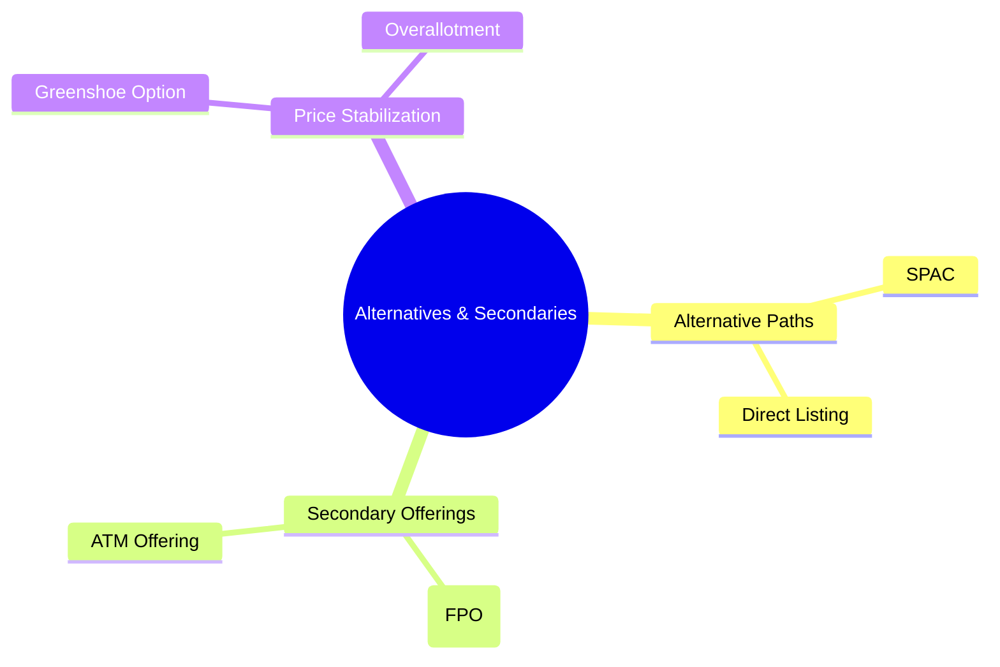
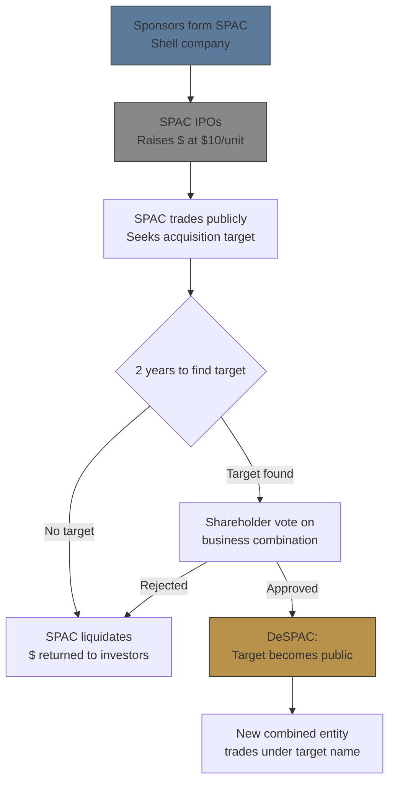
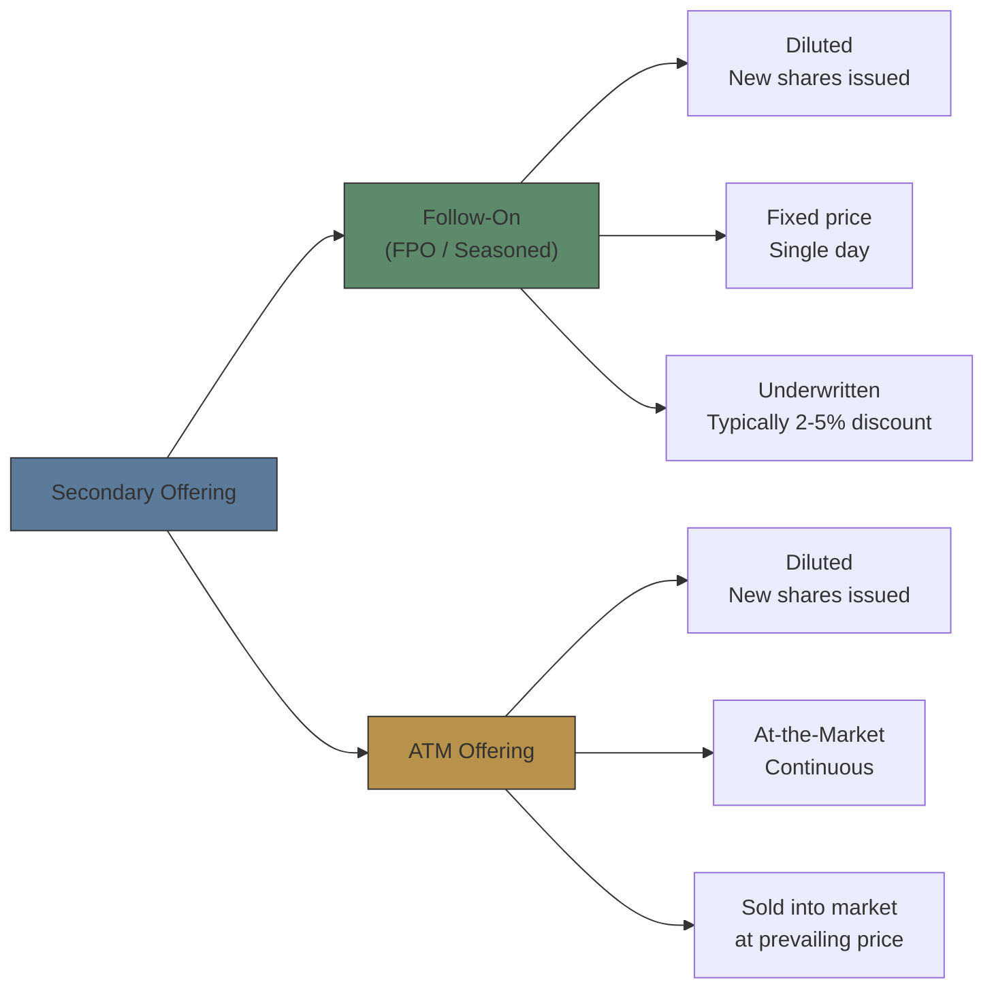
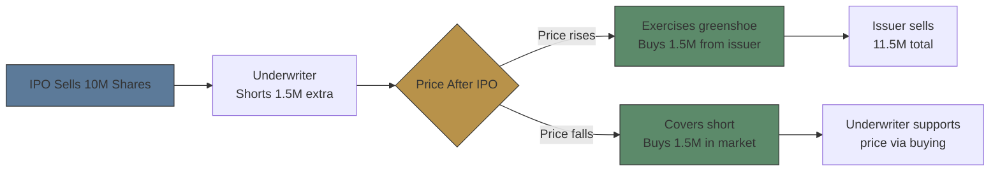

# Module 14: Alternative Listings & Secondary Offerings

Est. study time: 1.5h
Language: en
Description: SPACs, direct listings, follow-on offerings, ATM offerings, greenshoe option

## Knowledge Map

---

## Learning Objectives
- Explain SPAC structure, lifecycle, and investor rights
- Compare direct listing vs traditional IPO trade-offs
- Distinguish follow-on from ATM secondary offerings
- Explain greenshoe option mechanics for price stabilization

---

## Real-World Example

2021: 613 SPACs raised $162B — more than all prior years combined. By 2023, most traded below $10. One portfolio manager says: "SPACs democratized access to high-growth private companies." Another fires back: "SPACs are the most dilutive path to public markets ever invented."

> **Think**: Who is more accurate? What explains the boom and bust?
>
> *Answer: Both have truth. SPACs offer speed and price certainty but carry heavy dilution (sponsor promote ~20%, warrant dilution, underwriting ~9%). The 2021 boom was fueled by easy money + retail speculation. The bust: many targets had weak fundamentals exposed by rising rates. Redemption mechanics also caused surprise dilution.*

---

## Core Content

### Section 1: SPACs — Alternative Path to Public

SPAC = Special Purpose Acquisition Company. Shell company raises money in own IPO, then acquires private company (reverse merger), taking it public.

Key features:
- SPAC IPOs at $10/unit (1 share + warrant fraction)
- Trust: ~90% of proceeds held in trust until acquisition
- Investors can redeem shares for trust value if they don't like the target
- Warrants provide additional upside
- ~20% of US IPOs in 2020-2021 were SPACs

> **Think**: Why would private company choose SPAC merger over traditional IPO?
>
> *Answer: Speed (3-6 months vs 12-18 months for IPO), price certainty (negotiated upfront vs book-building risk), forward-looking projections allowed (SPAC uses PIPE investors), less scrutiny of historical financials. Downsides: higher dilution (sponsor promote ~20%), lower institutional coverage post-deal.*

> **Cloze**: "A {SPAC} is a shell company that raises capital through its own IPO, then merges with a private company to take it {public}."
>
> *Answer: SPAC, public*

### Section 2: Direct Listings

Direct listing = company lists existing shares on exchange without raising new capital, without underwriters.

| Feature | Traditional IPO | Direct Listing |
|---------|----------------|----------------|
| New capital raised | Yes | No |
| Underwriters | Yes | No (or limited role) |
| Lock-up | Yes (180 days) | No (insiders can sell immediately) |
| Price discovery | Book-building | Opening cross on listing day |
| Underpricing | Common | Minimal (no underpricing incentive) |
| Cost | 3-7% of proceeds | ~1-2% of market cap |

> **Think**: Spotify direct listed in 2018. Why didn't they need to raise money?
>
> *Answer: Spotify was well-capitalized with strong cash flow. Direct listing let existing shareholders sell directly to public without dilution. No lock-up meant immediate liquidity. No underwriter meant no 15% pop left on table. Savings: ~$50M+ in underwriting fees.*

> **Cloze**: "Unlike an IPO, a {direct listing} does not raise new capital for the company and has no {underwriters}."
>
> *Answer: direct listing, underwriters*

### Section 3: Secondary Offerings — Follow-On & ATM

Secondary offerings happen AFTER the IPO:

**Follow-On (FPO)**: Company issues new shares at fixed price (discounted 2-5% to market). Underwritten. Used for raising capital post-IPO.

**ATM Offering**: Company sells shares gradually into market at prevailing prices. No fixed price, no single day. Less dilutive impact because market absorbs over time.

> **Think**: Company announces $1B FPO at 3% discount. Stock drops 5% on announcement. Why?
>
> *Answer: Market interprets FPO as: (1) Dilution — more shares, EPS decreases. (2) Signal — company might be desperate for cash or management thinks stock fairly valued. (3) Supply — new shares pressure price. The 3% discount is mechanical; the 5% drop reflects signaling and dilution.*

> **Spot the Mistake**: "An ATM offering is priced at a fixed discount to the market, just like a follow-on."
>
> *Answer: ATM offerings sold at prevailing market price, NOT at fixed discount. Sold incrementally over days/weeks. No single price, no underwriting commitment. Issuer controls timing and volume.*

> **Cloze**: "A {follow-on} offering issues new shares at a fixed discount on a single day. An {ATM} offering sells shares gradually at market price."
>
> *Answer: follow-on, ATM*

### Section 4: Greenshoe Option

Greenshoe = over-allotment option. Underwriter can sell up to 15% more shares than the offering size.

How it works:
1. Underwriter sells 115% of offered shares (oversells)
2. Underwriter is "short" 15% — must buy them back
3. If price rises: greenshoe exercised → buys shares from issuer at IPO price → covers short
4. If price falls: greenshoe NOT exercised → buys shares in market at lower price → covers short + supports price

Purpose: Price stabilization without underwriter using own capital.

> **Think**: Underwriter oversells 15% of $50 IPO. Stock drops to $45. What happens?
>
> *Answer: Underwriter lets greenshoe expire. Buys 15% in open market at $45 to cover short. Profit = $5/share × 15% shares. Buying pressure helps stabilize stock at $45. Price stabilization without underwriter capital.*

> **Cloze**: "The {greenshoe} option allows the underwriter to issue up to {15%} additional shares to stabilize stock price after the IPO."
>
> *Answer: greenshoe, 15%*

---

> **Predict**: SPAC trades at $10.20 after IPO. Rumors circulate about a merger target. What happens to SPAC share price when a target is announced?

> *Answer: SPAC typically rises toward trust value + expected deal premium. But unlike IPOs, SPAC has downside protection — investors can redeem at ~$10. If market likes target, SPAC may trade above $10. If target is weak, it stays near $10 as redemption risk caps upside.*

### Why This Matters

SPACs vs IPOs changes deal pipeline and creates different trading patterns. Direct listings eliminate underpricing but raise no capital. Secondary offerings signal management sentiment — FPO dips can be buying opportunities or warning signs. Greenshoe activity reveals underwriter conviction about aftermarket price. Misread any of these and you miss trades or get diluted by surprise.

---

## Key Takeaways
- SPACs offer faster, price-certain alternative to IPO but with more dilution (sponsor promote + warrants).
- Direct listings raise no capital but avoid underpricing and underwriting fees.
- Follow-on = fixed discount, single day. ATM = market price, gradual.
- Greenshoe (15% overallotment) enables price stabilization without underwriter capital.
- SPAC investors can redeem shares for trust value if they disapprove of target.
- Direct listings have no lock-up — insiders can sell immediately.

---

## Common Misconception

**"SPACs are superior to IPOs because they have less dilution and lower costs."**

Wrong. SPACs have MORE dilution — sponsor promote (20% equity given for free), warrant dilution, underwriting fees (5.5% at IPO + 3.5% at merger = ~9% total). Traditional IPO has 3-7% underwriting fees and no promote dilution. SPAC advantage is speed and price certainty, not cost.

---

## Spot the Mistake

"Greenshoe option is exercised when the stock price falls to support the market."

What's wrong?

*Answer: Greenshoe is exercised when price RISES (underwriter buys extra shares from issuer at IPO price). When price FALLS, greenshoe is NOT exercised — instead underwriter buys in open market to cover short, which creates price support. The direction is opposite of what many assume.*

---

## Feynman Explain
(Explain SPAC to someone who only knows traditional IPO: "Imagine a blank-check company that raises money from investors, then goes shopping for a private company to buy. If you don't like what they pick, you get your money back.")

---

## Reframe
(Judge: Do SPACs create value or extract it? Sponsors get 20% promote for finding a deal — is that fair compensation for deal-sourcing skill, or excessive rent in a system where investors bear most risk?)

---

## Drill
Run: `learn.sh quiz equity-trading 14`
Run: `learn.sh cloze equity-trading 14`
