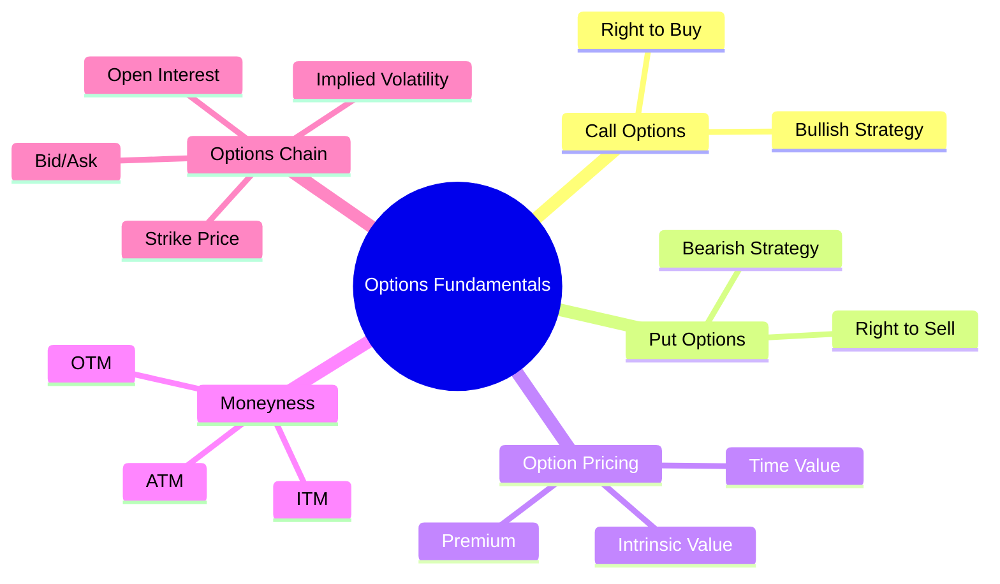
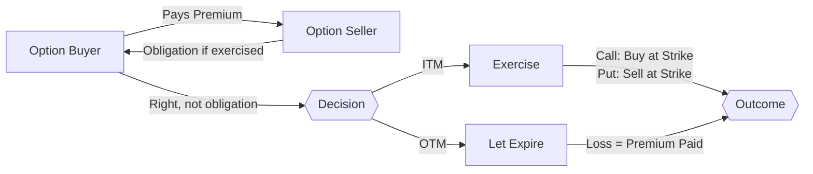
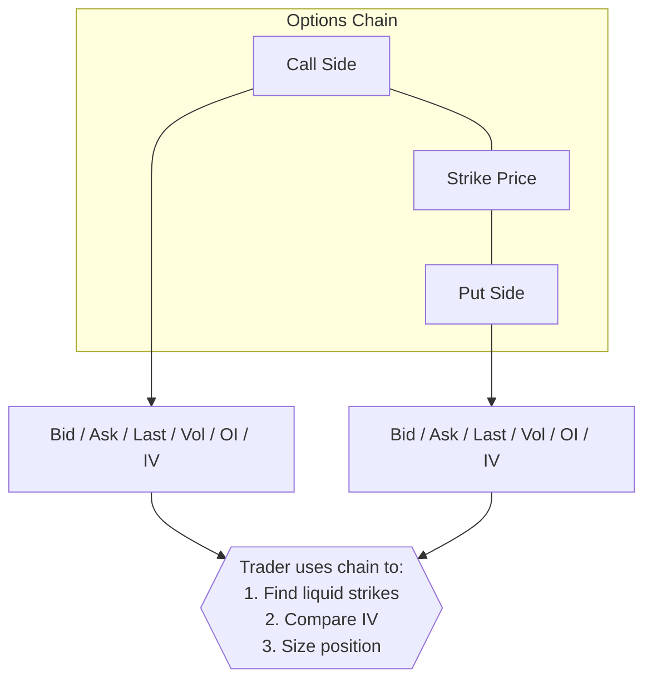

# Module 15: Options Fundamentals

Est. study time: 1.5h
Language: en
Description: Call and put options, intrinsic vs time value, options chain reading

## Knowledge Map



---

## Learning Objectives
- Distinguish call from put options and explain obligation vs right
- Compute intrinsic value, time value, and breakeven for option positions
- Read options chain and identify key data fields
- Understand moneyness (ITM/ATM/OTM) and its implications

---

## Real-World Example

Junior trader gets alpha signal: AAPL will rally 5% in 3 weeks. She buys 1,000 shares — spends $180,000. Overnight, Fed surprise drops AAPL 3%. She loses $5,400 before breakfast. Senior trader asks: "Why didn't you buy calls instead? $3,600 in premium would cap your loss to that, not $5,400."

> **Think**: Why does buying calls limit downside vs buying shares? What trade-off does premium represent?
>
> *Answer: Option buyer can only lose premium paid, not full notional. Premium is cost of limited liability. Trade-off: must be right on direction AND timing before expiration.*

---

## Core Content

### Section 1: Options Basics — Calls and Puts

Call option: right to *buy* underlying at strike price before expiration.
Put option: right to *sell* underlying at strike price before expiration.

Buyer pays premium to seller (writer). Writer takes obligation.

American-style: exercise any time before expiry. European-style: exercise only at expiry.



> **Think**: Why would anyone sell (write) an option if they take unlimited risk?
>
> *Answer: Writer collects premium as income. If view is underlying won't move past strike, writer keeps premium. Covered calls (owning shares) cap risk. Naked calls theoretically unlimited risk.*

> **Cloze**: "A {call} option gives holder right to {buy} underlying at strike price. A {put} option gives holder right to {sell} underlying."
>
> *Answer: call, buy, put, sell*

Formula (Call payout at expiry): `max(0, S_T - K)` where `S_T` = spot at expiry, `K` = strike

Formula (Put payout at expiry): `max(0, K - S_T)`

**Example:**
```text
AAPL at $180. Buy 1 call, strike $185, premium $4, expiry 30d.
If AAPL hits $200: payout = max(0, 200-185) = $15. Profit = $15 - $4 = $11/share.
If AAPL stays $180: payout = 0. Loss = $4/share (premium).
Breakeven = strike + premium = $185 + $4 = $189.
```

> **Predict**: You buy put on SPY at $500 strike for $8 premium. SPY drops to $480. What is your profit per share?
>
> *Answer: Payout = $500 - $480 = $20. Profit = $20 - $8 = $12/share. Return on premium = 150% ($12/$8).*

### Section 2: Intrinsic Value vs Time Value

Option premium = Intrinsic Value + Time Value.

Intrinsic value: how much option would be worth if exercised now. Call: `max(0, S - K)`. Put: `max(0, K - S)`.

Time value: everything else — probability of moving ITM before expiry, time to expiry, volatility, interest rates. Time decay (theta): option loses time value daily, accelerates in final weeks.

| Status | Definition | Intrinsic Value |
|--------|-----------|-----------------|
| ITM (In the Money) | Call: S > K. Put: K > S | Positive |
| ATM (At the Money) | S ≈ K | Zero |
| OTM (Out of the Money) | Call: S < K. Put: K < S | Zero |

> **Think**: Deep ITM option: more intrinsic value but less time value. Deep OTM option: almost all time value. Which loses money faster from time decay?
>
> *Answer: Deep OTM. High time value relative to premium. Theta eats it. ITM option has intrinsic floor — time decay only affects small time premium portion.*

> **Cloze**: "If AAPL is $180 and call strike is $175, intrinsic value = {5}. If premium is $8, time value = {3}."
>
> *Answer: 5, 3*

> **Spot the Mistake**: Trader says "AAPL at $180, I bought $185 call for $4. My intrinsic value is $4."
>
> *Answer: Strike $185 > spot $180, so option is OTM. Intrinsic value = $0. Entire $4 premium is time value.*

### Section 3: Options Chain

Options chain: table showing all available option series for given underlying. Columns: strike, bid, ask, last, change, volume, open interest, implied volatility.

| Strike | Bid | Ask | Last | Vol | OI | IV |
|--------|-----|-----|------|-----|----|----|
| 175 | 5.50 | 5.65 | 5.55 | 2,300 | 15,400 | 22% |
| 180 | 2.10 | 2.20 | 2.15 | 4,100 | 28,700 | 24% |
| 185 | 0.75 | 0.85 | 0.80 | 1,200 | 8,900 | 26% |

Bid-ask spread: wide for illiquid strikes, narrow for liquid. Open interest: total contracts open. Volume: contracts traded today. IV: market's expected volatility — higher IV = higher premium.

> **Think**: Strike $175 bid $5.50, ask $5.65. If you buy at ask and sell at bid immediately, how much do you lose? Why does this gap exist?
>
> *Answer: Loss = ask - bid = $0.15/share = $15/contract (1 contract = 100 shares). Gap = compensation for market maker providing liquidity. Wider for OTM/illiquid strikes.*



> **Predict**: You see call at $180 strike has volume 4,100 but OI only 200. What does this tell you?
>
> *Answer: Most of today's volume is new opening trades or closing trades, not rollover. High volume / low OI = mostly day trading activity. OI builds when positions held overnight.*

---

### Why This Matters

Options provide asymmetric risk — limited downside, unlimited upside for long positions. Reading options chain is table-stakes skill. Every equity desk uses options for hedging, income, or speculation. Misunderstanding option pricing leads to overpaying for premium or misjudging risk.

---

## Key Takeaways
- Call = right to buy. Put = right to sell. Premium = cost of right.
- Option value = intrinsic (ITM amount) + time value (probability/vol/time).
- Moneyness: ITM has intrinsic value, ATM/OTM have zero intrinsic.
- Options chain shows all strikes with bid/ask/vol/OI/IV — liquidity matters.
- Breakeven: call = strike + premium, put = strike - premium.
- Time decay (theta) accelerates in final weeks before expiry.

---

## Common Misconception

**"Options are too risky for serious investors."**

Reality: Properly sized options *reduce* risk. Buying calls limits downside to premium. Protective puts cap portfolio losses. Naked options are risky — that is user error, not instrument flaw. The tool is neutral.

---

## Spot the Mistake

Trader says: "I bought call at $100 strike for $5. Stock is $102. My option is worth $7 because intrinsic is $2 plus my $5 premium back."

What's wrong?

*Answer: Option value is intrinsic ($2) + time value (remaining time premium, not original premium). Original $5 is sunk. Current time value depends on remaining days and volatility. If expiry tomorrow, time value near $0, option worth ~$2.*

---

## Feynman Explain
(Explain option premium to child: "Option premium is like buying lottery ticket that says 'I can buy this stock at this price until this date.' If stock goes higher, ticket worth more. If not, ticket expires. You never owe more than ticket price.")

---

## Reframe
(Judge: Are options zero-sum? In strict payout: yes — buyer's gain is seller's loss. But derivatives enable risk transfer that makes markets more efficient. Hedgers transfer risk to speculators. Both get utility.)

---

## Drill
Run: `learn.sh quiz equity-trading 15`
Run: `learn.sh cloze equity-trading 15`
