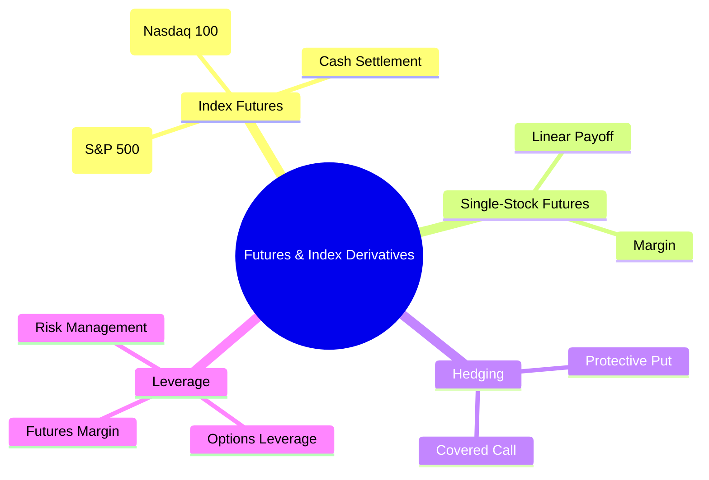
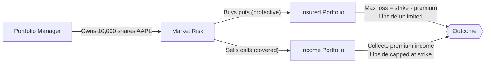
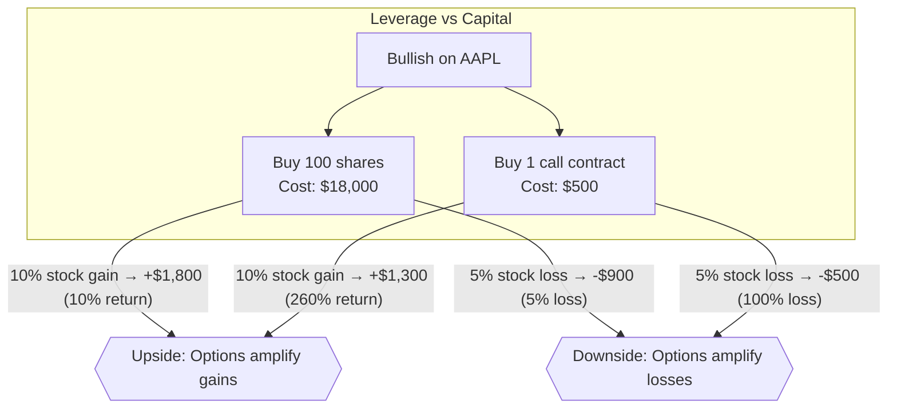

# Module 16: Futures & Index Derivatives

Est. study time: 1.5h
Language: en
Description: Index futures (ES, NQ), single-stock futures, hedging with options, leverage mechanics

## Knowledge Map



---

## Learning Objectives
- Explain how index futures (ES, NQ) and single-stock futures work
- Calculate P&L for futures positions given point moves
- Describe hedging strategies using protective puts and covered calls
- Compare leverage mechanics in options vs futures

---

## Core Content

### Section 1: Index Futures (ES, NQ)

Index futures: contracts to buy/sell cash value of stock index at future date. ES = E-mini S&P 500. NQ = E-mini Nasdaq 100.

| Future | Index | Multiplier | Tick Size | Tick Value | Contract Value (at 4500) |
|--------|-------|-----------|-----------|-----------|--------------------------|
| ES | S&P 500 | $50 | 0.25 | $12.50 | $225,000 |
| NQ | Nasdaq 100 | $20 | 0.25 | $5.00 | $320,000 |

Cash-settled — no physical delivery. Margin requirement ~5-10% of notional. Trade nearly 24h. Used for: portfolio hedging, directional bets, arbitrage.

> **Think**: Why would pension fund short ES futures instead of selling stocks?
>
> *Answer: Futures let them hedge portfolio without liquidating holdings (avoids tax + transaction costs). Short ES offsets market risk. If market drops, futures gain offsets portfolio loss.*

> **Cloze**: "ES tick size = {0.25} index points. Each tick = ${12.50}. If ES moves 10 points, P&L = ${500}."
>
> *Answer: 0.25, 12.50, 500*

### Section 2: Single-Stock Futures

SSF: futures contract on individual stock. Less common than options but useful for: leverage, shorting without uptick rule, avoiding stock borrow costs.

Unlike options: no premium paid upfront (just margin). Both buyer and seller have obligation. Linear payoff — profit/loss = change in stock price × contract size.

| Feature | Stock Options | Single-Stock Futures |
|---------|--------------|---------------------|
| Upfront cost | Premium | Margin only |
| Obligation | Buyer: right, not obligation | Both sides obligated |
| Payoff | Non-linear (convex) | Linear |
| Max loss | Premium paid | Full notional (unhedged) |

> **Think**: When would trader choose SSF over options?
>
> *Answer: When they want linear leverage without time decay. Options lose theta; SSF do not. Also useful when option liquidity poor for that stock or borrow rate makes shorting expensive.*

> **Cloze**: "SSF payoff is {linear}. Option payoff is {non-linear}. SSF buyer has {obligation} to settle. Option buyer has {right} to exercise."
>
> *Answer: linear, non-linear, obligation, right*

### Section 3: Hedging with Options

Protective put: own stock, buy put to insure against drop. Like insurance — premium is cost of protection.

Covered call: own stock, sell call to collect premium. Caps upside but generates income.



**Hedging Example:**
```text
Portfolio: $1M SPY exposure. Fear 5% correction in 3 months.
Buy 20 SPY put contracts, strike $475 (current $500), premium $8.
Cost = 20 × 100 × $8 = $16,000.
If SPY drops to $450: puts pay $25/share × 2,000 shares = $50,000.
Portfolio loss: $100,000 (10%). Net: $50,000 - $16,000 = $34,000 loss
  vs $100,000 unhedged. Hedge saved $66,000.
```

> **Think**: Insurance analogy — what happens if market goes up after buying puts? Is hedge "wasted"?
>
> *Answer: Premium cost is sunk regardless. If market rallies, put expires worthless but portfolio gains. Hedge cost is known premium; you don't call fire insurance "wasted" when house doesn't burn.*

### Section 4: Leverage Mechanics

Derivatives provide leverage: control large notional with small capital.

Options leverage: premium magnifies returns relative to stock move. If stock moves 5% and option costs 10% of stock, option can move 50%+.

Futures leverage: margin controls notional. 5% margin = 20:1 leverage.

**Leverage Example:**
```text
Buy 100 shares AAPL at $180: cost $18,000. Stock moves to $198 (10%).
Profit = $1,800. Return on capital = 10%.

Buy 1 AAPL $180 call at $5 ($500 cost). Stock moves to $198.
Option worth ~$18 intrinsic. Profit = $18 - $5 = $13/share = $1,300.
Return on capital = 260%. 26x leverage.

But if stock drops to $170: shares lose $1,000 (5.5%).
Option expires worthless: lose 100% of $500.
```



> **Predict**: Trader uses futures margin. ES at 4,500. One contract notional = $225,000. Initial margin = $12,000. ES drops 50 points. What is P&L and % return on margin?
>
> *Answer: P&L = -50 × $50 = -$2,500. Return on margin = -2,500/12,000 = -20.8%. Notional move was 1.1% (-50/4500), but margin lost 20.8%. That's 19x leverage.*

---

### Why This Matters

Every equity desk uses derivatives. Futures provide low-cost leverage and 24h liquidity for hedging and directional bets. Options provide asymmetric risk. Understanding leverage is essential — misuse is fastest way to blow up account. Protective puts are cheapest portfolio insurance available.

---

## Key Takeaways
- ES (S&P 500) and NQ (Nasdaq 100) are most liquid index futures. Cash-settled, nearly 24h.
- Single-stock futures: linear payoff, no premium, both sides obligated.
- Hedging: protective puts (insurance), covered calls (income).
- Leverage magnifies both gains and losses — position size accordingly.
- ES multiplier = $50, tick = 0.25 pts = $12.50.
- Futures margin typically 5-10% of notional value.

---

## Common Misconception

**"Futures are only for speculators."**

Reality: Futures are primarily used by institutions for hedging. Pension funds short ES to hedge equity exposure. Farmers sell crop futures to lock in prices. Airlines buy oil futures to cap fuel costs. Speculation is just one use case.

---

## Spot the Mistake

"ES futures have physical delivery — you must take delivery of all 500 stocks at expiration."

What's wrong?

*Answer: ES futures are cash-settled. No physical delivery. At expiration, contract settles to cash value of S&P 500 index. Your account is credited or debited the difference. No stocks change hands.*

---

## Feynman Explain
(Explain futures margin to beginner: "You don't pay full price for futures — just good-faith deposit (margin). Like putting $12,000 down on $225,000 house. If house value drops $2,500, your deposit takes that loss. High leverage means small moves hit deposit hard.")

---

## Reframe
(Judge: Is selling options (being net short volatility) a viable long-term strategy? Writers collect premium consistently but face tail risk of black swan events. Is it picking up pennies in front of steamroller?)

---

## Drill
Run: `learn.sh quiz equity-trading 16`
Run: `learn.sh cloze equity-trading 16`
