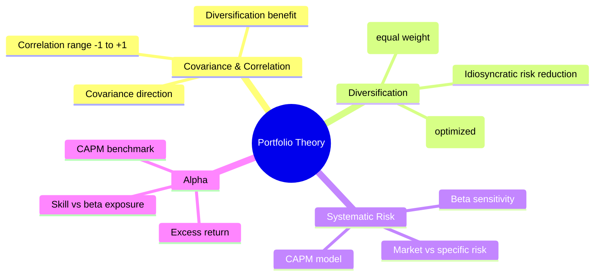
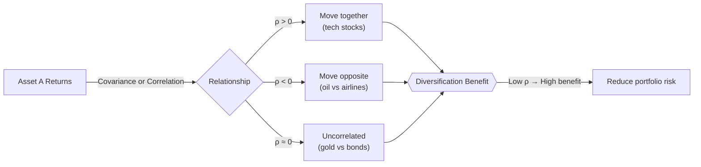
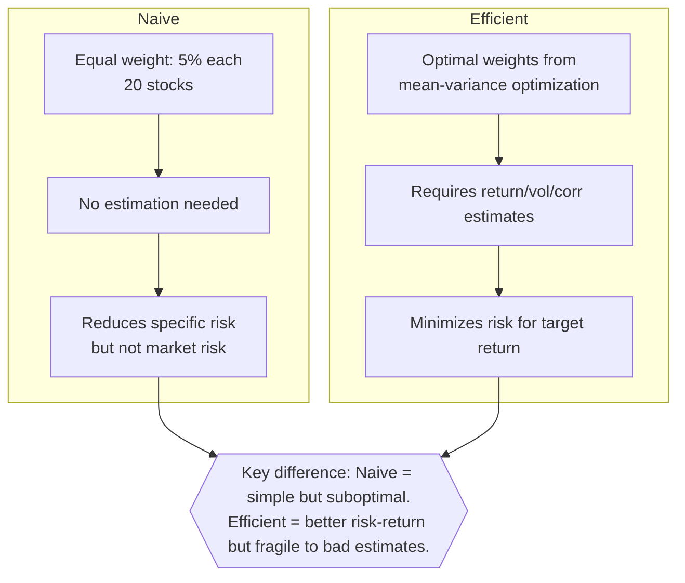
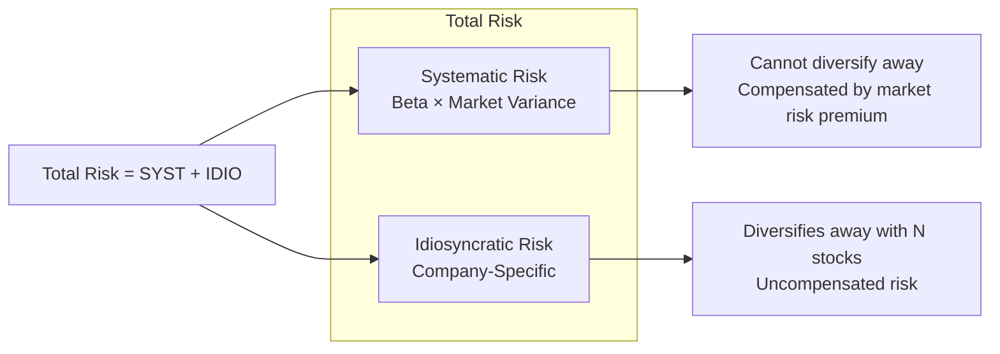
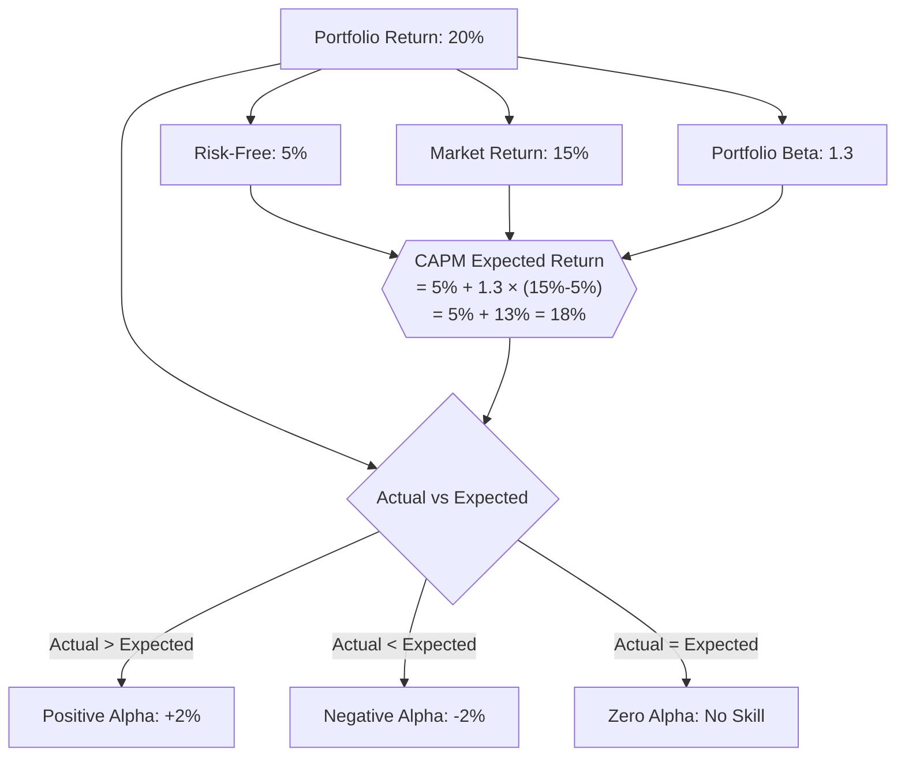

# Module 17: Portfolio Theory

Est. study time: 1.5h
Language: en

## Knowledge Map



---

## Learning Objectives (maps to course CILOs)
- Compute covariance and correlation between assets — serves CILO 2
- Distinguish naive vs efficient diversification — serves CILO 2
- Calculate beta and interpret systematic vs idiosyncratic risk — serves CILO 2
- Compute alpha as excess return vs CAPM benchmark — serves CILO 2

---

## Real-World Example

Junior analyst inherits 20-stock equal-weight portfolio, rebalanced quarterly. Colleague runs 8-stock concentrated portfolio with active weights. Over 2 years, colleague outperforms by 3% annually. Analyst thinks: "More stocks = safer, so why did I underperform?"

Senior PM looks at both: analyst's has beta 0.95, colleague's has beta 1.2. Both have similar Sharpe ratios when adjusted. Difference? Colleague took more systematic risk (higher beta) plus had specific alpha in tech allocation. Analyst was diversified but naive — equal weights across sectors meant no edge, just market exposure.

> **Think**: Did the analyst actually take less risk? What kind of risk did the colleague take that the analyst avoided?
>
> *Answer: Analyst reduced idiosyncratic risk (company-specific) via 20 stocks, but still carried market risk (beta). Colleague took more systematic risk (beta 1.2 vs 0.95) and concentrated bets. Analyst's "safety" was lower beta, not better diversification. Naive = less effort, not less risk.*

---

## Core Content

### Section 1: Covariance and Correlation

Covariance: how two assets move together. Positive: same direction. Negative: opposite. Magnitude depends on units, hard to interpret alone.

Correlation: normalized covariance, range [-1, +1]. +1 = perfect same direction. -1 = perfect opposite. 0 = no linear relationship.

Formula (correlation): `ρ_AB = Cov(r_A, r_B) / (σ_A × σ_B)`



> **Think**: Two stocks each have σ = 30%. Correlation ρ = 0.3. What happens to portfolio σ if you split 50/50? What if ρ = 0.9?
>
> *Answer: Portfolio σ = sqrt(w1²σ1² + w2²σ2² + 2w1w2ρσ1σ2). For ρ=0.3: σ = sqrt(0.5²×0.09 + 0.5²×0.09 + 2×0.5×0.5×0.3×0.3×0.3) = sqrt(0.0225 + 0.0225 + 0.0135) = sqrt(0.0585) = 24.2%. For ρ=0.9: σ = sqrt(0.0225+0.0225+0.0405) = sqrt(0.0855) = 29.2%. Lower correlation = lower portfolio risk.*

> **Cloze**: "Correlation ranges from {-1} to {+1}. Correlation of {0} means no linear relationship. Correlation of {+1} means perfect positive movement."
>
> *Answer: -1, +1, 0, +1*

> **Predict**: You add gold (ρ = -0.2 with stocks) to equity portfolio. What happens to portfolio volatility? What happens to returns if gold stays flat?
>
> *Answer: Negative correlation reduces portfolio volatility — diversification benefit. If gold returns 0%, portfolio return = weighted average. Volatility drops more than return. Sharpe ratio improves because denominator shrinks. This is the free lunch of diversification.*

### Section 2: Diversification — Naive vs Efficient

Naive diversification: equal weights across N assets. Simple, no estimation. Reduces idiosyncratic risk as N increases. Diminishing returns after ~15-20 stocks.

Efficient diversification: optimize weights to minimize risk for given return. Uses mean-variance optimization (Markowitz). Requires estimates of expected returns, variances, correlations.



**Example:**
```text
Naive: 20 stocks, 5% each, equal weight. Portfolio σ = ~18%.
Efficient: Same 20 stocks, optimal weights. Portfolio σ = ~14%.
Savings: 4% volatility reduction with same expected return.
But: efficient weights rely on estimated correlations. Wrong estimate → worse than naive.
```

> **Think**: Why might naive diversification outperform efficient on out-of-sample data?
>
> *Answer: Estimation error. Efficient weights use historical correlations that may shift. Naive weights don't rely on estimates — no estimation error. This is the "Markowitz curse": optimization magnifies input errors. In practice, naive often matches efficient out-of-sample.*

> **Cloze**: "Naive diversification uses {equal} weights for all assets. Efficient diversification uses {optimized} weights to minimize risk for given return. Naive is simpler but can be {suboptimal} if assets have different risk profiles."
>
> *Answer: equal, optimized, suboptimal*

### Section 3: Beta and Systematic Risk

Beta (β): sensitivity of stock returns to market returns. β = 1: moves with market. β > 1: amplified moves (cyclical). β < 1: dampened moves (defensive). β = 0: no correlation with market.

Formula: `β_i = Cov(r_i, r_m) / Var(r_m)`

Total risk = Systematic risk (market) + Idiosyncratic risk (specific). Beta captures systematic risk. Idiosyncratic risk diversifies away.

CAPM: `E(r_i) = r_f + β_i × (E(r_m) - r_f)`



> **Think**: Stock A: β = 1.5, stock B: β = 0.6. Market drops 10%. What happens to each? Which is "riskier"?
>
> *Answer: A drops ~15% (1.5 × 10%), B drops ~6% (0.6 × 10%). A is riskier in bear market. But in bull market, A gains 15% vs B's 6%. Beta measures systematic risk exposure, not total risk. Stock with high idiosyncratic risk but low beta can still be volatile.*

> **Cloze**: "Stock with β = 1.5 has {150%} of market sensitivity. Stock with β = {0} has no market correlation. Stock with β = {1} matches market exactly."
>
> *Answer: 150%, 0, 1*

> **Spot the Mistake**: Trader says: "My portfolio of 30 stocks is fully diversified. Beta doesn't matter because I eliminated all risk."
>
> What's wrong?
>
> *Answer: Portfolio still has systematic risk (beta). Diversification eliminates only idiosyncratic risk (specific to each stock). Systematic risk from market beta remains regardless of N stocks. In 2008, diversified portfolios dropped ~40% — that's systematic risk. Beta always matters.*

### Section 4: Alpha and Excess Return

Alpha (α): excess return not explained by beta/market. Positive alpha = manager added value beyond market exposure. Negative alpha = value destroyed.

Formula: `α = Actual Return - CAPM Expected Return = r_p - [r_f + β_p × (r_m - r_f)]`

Alpha ≠ raw outperformance. If benchmark returned 15% and manager returned 20% with β = 1.3, is that alpha? No — 1.3 × 15% = 19.5% expected. Alpha = 20% - 19.5% = 0.5%.



> **Think**: Hedge fund returns 25% in year market returns 10%. Fund's β = 2.0. Did manager generate alpha?
>
> *Answer: CAPM expected = r_f + 2.0 × (10% - r_f). Assume r_f = 3%. Expected = 3% + 2.0 × 7% = 17%. Alpha = 25% - 17% = 8%. Yes, positive alpha. But β = 2 means fund is 2x leveraged — if market dropped 10%, fund would lose ~20%. Alpha must be evaluated with beta context.*

> **Cloze**: "{Alpha} measures excess return not explained by market exposure. {Beta} measures sensitivity to market returns. Positive alpha suggests {skill} adds value beyond taking market risk."
>
> *Answer: Alpha, Beta, skill*

---

### Why This Matters

Every allocator builds portfolios. Covariance and correlation determine diversification benefit. Naive diversification is table stakes — reduces idiosyncratic risk but leaves systematic risk. Efficient diversification needs correlation estimates and optimization, but estimation error means simpler often wins. Beta tells how much market risk you carry. Alpha tells if your decisions add value. These are the building blocks of portfolio theory.

---

## Key Takeaways
- Correlation < 1 provides diversification benefit; lower correlation = greater risk reduction.
- Naive diversification (equal weights) reduces idiosyncratic risk but not systematic risk.
- Efficient diversification optimizes weights but is fragile to estimation error.
- Beta measures systematic risk exposure; total risk = systematic + idiosyncratic.
- Alpha = actual return minus CAPM expected return (beta-adjusted excess return).
- CAPM: E(r) = r_f + β × (r_m - r_f).

---

## Common Misconception

**"Adding more stocks always makes portfolio safer."**

Beyond ~20 stocks, additional diversification reduces idiosyncratic risk marginally. Systematic risk (beta) remains unchanged. Adding stocks with high correlation to existing holdings barely helps — you need low-correlation assets (bonds, alts, commodities) to truly reduce portfolio risk. The number of stocks matters less than their correlation structure.

---

## Spot the Mistake

Portfolio manager says: "My portfolio returned 18% this year. The market returned 12%. I generated 6% alpha."

Assume r_f = 4%, portfolio beta = 1.4.

What's wrong?

*Answer: CAPM expected return = 4% + 1.4 × (12% - 4%) = 4% + 11.2% = 15.2%. Alpha = 18% - 15.2% = 2.8%, not 6%. Manager ignored beta adjustment. Raw outperformance ≠ alpha. Half the "alpha" was just taking more market risk.*

---

## Feynman Explain
(Explain correlation to child: two friends walk to school — one walks in all weather, other only when sunny. Correlation = how often they walk together. Portfolio = pick friends who don't all get sick at same time.)

---

## Reframe
(Judge: Is minimizing portfolio volatility always right? Volatility ≠ permanent loss for long-term investors. But drawdown matters for retirees/margin users. Diversification reduces volatility but caps upside. Some concentrate for upside — "all eggs in one basket" risk. Write evaluation.)

---

## Drill
Take quiz.

Run: `learn.sh quiz equity-trading 17`
