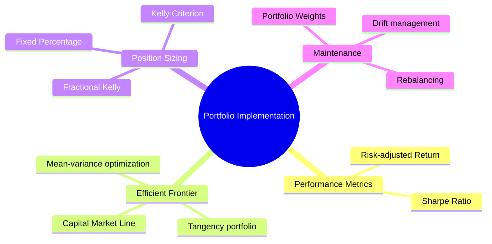
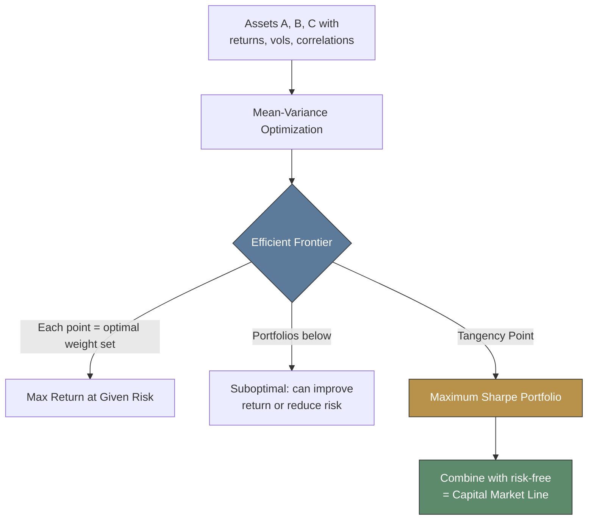
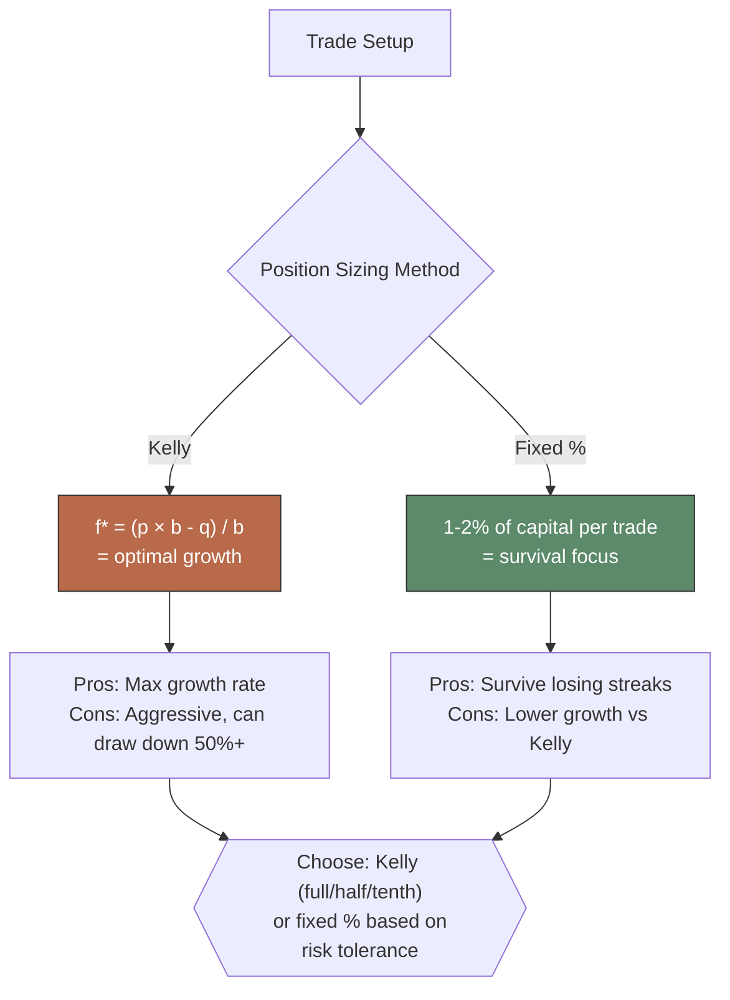
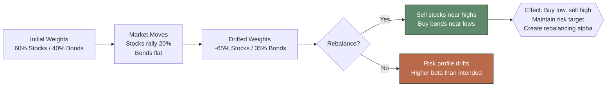

# Module 18: Portfolio Implementation

Est. study time: 1.5h
Language: en

## Knowledge Map



---

## Learning Objectives (maps to course CILOs)
- Calculate and interpret Sharpe ratio for risk-adjusted performance — serves CILO 3
- Construct efficient frontier and identify optimal portfolios — serves CILO 3
- Apply Kelly criterion and fixed-fraction position sizing — serves CILO 4
- Construct portfolio weights, rebalance, and manage drift — serves CILO 4

---

## Real-World Example

Two portfolio managers compete for same bonus. Manager A: 20% return with 25% volatility. Manager B: 12% return with 10% volatility. Raw return says A wins. But risk-adjusted view tells different story.

Senior allocator asks: "Can we lever Manager B's strategy to match A's risk?" If B borrows at 3% risk-free rate and scales 2.5x, B delivers 25.5% return at same 25% volatility — beating A's 20%. The allocator chooses B plus leverage.

> **Think**: Why does Sharpe ratio matter more than raw return for allocators who can use leverage?
>
> *Answer: Sharpe ratio measures return per unit of risk. Allocators can scale any strategy to target risk level. Highest Sharpe strategy, levered to desired risk, beats lower-Sharpe strategy at same risk. Sharpe cuts through raw return noise — it isolates skill from risk exposure.*

---

## Core Content

### Section 1: Sharpe Ratio

Sharpe ratio: excess return per unit of total risk. Most widely used risk-adjusted performance metric.

Formula: `Sharpe = (r_p - r_f) / σ_p`

Higher Sharpe = better risk-adjusted return. Sharpe > 1 considered good. Sharpe > 2 excellent.

| Portfolio | Return | σ | r_f | Sharpe |
|-----------|--------|---|-----|--------|
| A | 15% | 20% | 3% | (15-3)/20 = 0.60 |
| B | 12% | 10% | 3% | (12-3)/10 = 0.90 |
| C | 25% | 35% | 3% | (25-3)/35 = 0.63 |

Portfolio B has lower return but highest Sharpe — better risk-adjusted.

> **Think**: Portfolio A: 20% return, 25% vol. Portfolio B: 12% return, 10% vol. r_f = 3%. Which has better Sharpe? Which would you choose if you could lever B to same risk?
>
> *Answer: Sharpe A = 0.68. Sharpe B = 0.90. B is better risk-adjusted. If you lever B 2.5x to match A's 25% vol: return = 3% + 2.5 × 9% = 25.5%. That beats A's 20% return at same risk. Pick highest Sharpe, then scale.*

> **Cloze**: "Sharpe ratio = (portfolio return - {risk free rate}) / {portfolio standard deviation}. Higher Sharpe means better {risk-adjusted} return. Sharpe above {1} is generally considered good."
>
> *Answer: risk free rate, portfolio standard deviation, risk-adjusted, 1*

> **Predict**: You add uncorrelated asset with 8% return and 15% vol to portfolio with 10% return and 18% vol. Current Sharpe = 0.39 (r_f = 3%). What happens to portfolio Sharpe?
>
> *Answer: Adding uncorrelated asset reduces portfolio vol more than it reduces return (diversification benefit). Portfolio vol drops below 18%. If return stays near weighted average ~9%, Sharpe could improve. Low correlation = portfolio gets closer to efficient frontier.*

### Section 2: Portfolio Weights and Efficient Frontier

Portfolio weight: fraction of capital allocated to each asset. Sum of weights = 1 (100%).

Efficient frontier: set of portfolios offering maximum expected return for each risk level. Portfolios below frontier are suboptimal.



**Example:**
```text
Two assets: Stock (10% return, 20% vol), Bond (4% return, 8% vol), ρ = 0.2.

Weight combos:
  100% Stock: 10% return, 20% vol
  60/40: 7.6% return, ~13.5% vol
  40/60: 6.4% return, ~9.8% vol  
  100% Bond: 4% return, 8% vol

60/40 is on efficient frontier. But is it optimal? Depends on investor's risk tolerance.
```

> **Think**: Investor wants 8% expected return. She can pick any portfolio on efficient frontier. What determines which point she chooses?
>
> *Answer: Risk tolerance (utility function). More risk-averse = lower vol portfolio on frontier. More aggressive = higher vol, higher return. The tangency portfolio (max Sharpe) is optimal only if investor can lever/delever at risk-free rate.*

> **Cloze**: "Efficient frontier shows portfolios with {maximum} return for each risk level. Portfolios below frontier are {suboptimal}. Tangency portfolio has highest {Sharpe ratio}."
>
> *Answer: maximum, suboptimal, Sharpe ratio*

### Section 3: Position Sizing — Kelly Criterion and Fixed Percentage

Kelly criterion: optimal fraction of capital to bet given edge and odds. Maximizes long-term growth rate.

Formula (simplified for trading): `f* = (p × b - q) / b` where f* = fraction of capital, p = win probability, q = 1-p, b = win/loss ratio (net odds).

Fixed percentage: bet constant fraction of capital regardless of edge. Common: 1-2% per trade. Conservative approach.



**Example:**
```text
Strategy: win rate 60% (p=0.6), avg win = 2%, avg loss = 1%. b = 2/1 = 2.
Kelly: f* = (0.6 × 2 - 0.4) / 2 = (1.2 - 0.4) / 2 = 0.8 / 2 = 0.40
Kelly says bet 40% of capital per trade.

But: 40% is aggressive. Losing streak of 3 = equity drops to 0.6 × 0.6 × 0.6 = 21.6% of original.
Half-Kelly (20%): much smoother equity curve, still captures most growth.
```

> **Think**: Trader has 55% win rate, 1:1 risk/reward. Kelly says what fraction? If trader uses full Kelly and hits 5 losses in a row, what happens?
>
> ×Answer: f× = (0.55 × 1 - 0.45) / 1 = 0.10 = 10%. After 5 losses with 10% each trade: remaining = 0.9^5 = 59% of capital. Survives but painful. Full Kelly risks ~1/3 drawdown in worst case. Reason many use half-Kelly.×

> **Cloze**: "Kelly criterion maximizes long-term {growth rate}. Full Kelly can cause large {drawdowns}. Many traders use {half-Kelly} or {quarter-Kelly} for safety."
>
> *Answer: growth rate, drawdowns, half-Kelly, quarter-Kelly*

### Section 4: Rebalancing

Portfolio drift: asset weights change over time as returns diverge. Rebalancing: restore target weights. Sells winners, buys losers.

Methods: calendar (quarterly/annually), threshold (band), hybrid.



**Example:**
```text
Start: $100k. 60% stocks ($60k), 40% bonds ($40k).
Year 1: stocks +30% → $78k, bonds -5% → $38k. Portfolio = $116k.
Drifted: 67% stocks / 33% bonds. No longer 60/40.
Rebalance: sell $8k stocks, buy $8k bonds. Restore 60/40.
Now: stocks $70k (60%), bonds $46k (40%).
If stocks then correct: rebalanced portfolio loses less because you took gains.
Rebalancing bonus: sells high, buys low.
```

> **Think**: Why might rebalancing quarterly be better than daily? When would daily rebalancing be necessary?
>
> *Answer: Quarterly: lower transaction costs, taxes. Daily rebalancing for leveraged ETFs (mandated), high-frequency strategies, or tight risk limits. Daily rebalancing costs eat returns for most portfolios.*

> **Cloze**: "Rebalancing restores target {weights}. It forces selling {winners} and buying {losers}. This creates {rebalancing alpha} over time."
>
> *Answer: weights, winners, losers, rebalancing alpha*

> **Spot the Mistake**: Analyst says: "Rebalancing hurts returns because you sell winners and buy losers. I'll just let my winners run."
>
> What's wrong?
>
> *Answer: Letting winners run increases portfolio concentration and beta drift. In 2000, tech-heavy portfolios that didn't rebalance lost 80% in crash. Rebalancing enforces discipline: it locks in gains, reduces risk drift, and captures mean reversion. Analogy: rebalancing is like a seatbelt — doesn't help in every trip, but prevents catastrophe.*

---

### Why This Matters

Sharpe ratio cuts through raw return noise — best single metric for comparing strategies. Efficient frontier shows optimal risk-return tradeoff; tangency portfolio maximizes Sharpe. Kelly criterion prevents overbetting (blowup) and underbetting (leaving edge on table). Rebalancing enforces discipline — most individual investors fail because they let drift concentrate risk. Together, these tools implement portfolio theory into practice.

---

## Key Takeaways
- Sharpe ratio = (return - risk-free) / vol — best single performance metric.
- Efficient frontier = maximum return for each risk level.
- Tangency portfolio (max Sharpe) optimal with frictionless leverage.
- Kelly criterion maximizes long-term growth; half-Kelly safer in practice.
- Fixed percentage (1-2% per trade) prioritizes survival.
- Weights sum to 1; drift changes risk profile over time.
- Rebalancing sells winners, buys losers — creates small alpha and maintains risk target.

---

## Common Misconception

**"Highest return portfolio is the best portfolio."**

Raw return ignores risk. Portfolio with 25% return and 40% volatility has Sharpe 0.55 (r_f=3%). Portfolio with 15% return and 12% volatility has Sharpe 1.0. The 15% portfolio is better risk-adjusted and can be levered to 30%+ return at moderate risk. Always evaluate risk-adjusted, not raw return.

---

## Spot the Mistake

Trader says: "My strategy has 60% win rate with 2:1 reward-to-risk. Full Kelly says bet 40%. I'll use 40%."

What's wrong?

*Answer: Full Kelly 40% is extremely aggressive. One losing streak of 3 consecutive losses drops equity to 21.6% of starting capital. Practical traders use fractional Kelly (25-50% of full = 10-20%). Full Kelly assumes known fixed probabilities — in markets, probabilities are estimates, not certainties. Overbetting destroys accounts.*

---

## Feynman Explain
(Explain Sharpe ratio to child: two friends run to ice cream shop. One sprints but trips; other jogs steady. Sharpe = speed per fall. Steady jogger wins.)

---

## Reframe
(Judge: Is maximizing Sharpe ratio always right? With leverage access — yes. But most investors face leverage constraints (margin, regulatory). Must accept lower-Sharpe to hit return targets. Sharpe assumes frictionless leverage — real world has limits. Write evaluation.)

---

## Drill
Take quiz.

Run: `learn.sh quiz equity-trading 18`
