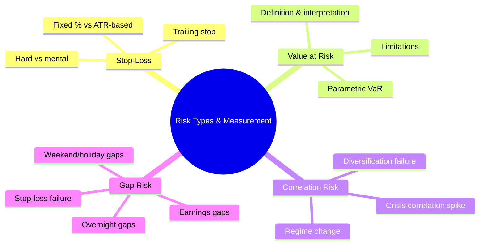
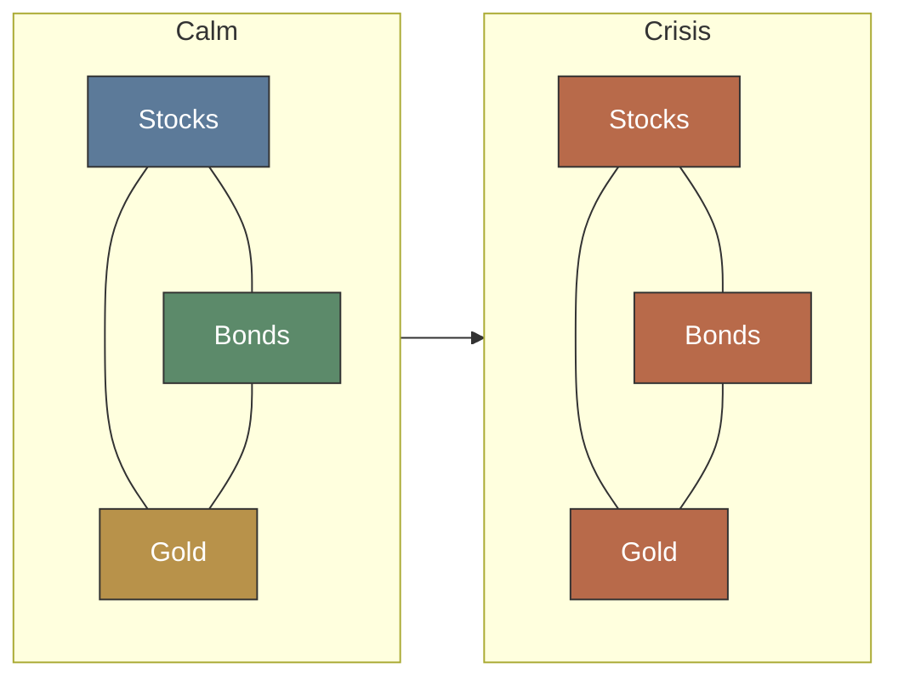

# Module 19: Risk Types & Measurement

Est. study time: 2.5h
Language: en

## Knowledge Map



---

## Learning Objectives
- Design stop-loss strategies: fixed, ATR-based, trailing
- Calculate and interpret Value at Risk (VaR)
- Explain correlation risk and diversification failure during crises
- Identify gap risk sources and protection methods

---

## Real-World Example: LTCM Collapse

Quant fund Long-Term Capital Management (LTCM) held highly diversified positions across global bonds. Models showed near-zero portfolio risk. In 1998, Russia defaulted on debt. Correlations went to 1. Everything fell simultaneously. LTCM lost $4.6B in 4 months. Fed had to organize bailout to prevent systemic collapse.

Diversification didn't fail because theory was wrong — it failed because correlations are not constant. They spike during stress.

> **Think**: Why did LTCM's risk models show near-zero risk when positions were clearly dangerous?
>
> *Answer: Models assumed normal correlations from recent history. 1998 was a 6-sigma event in their model — supposed to happen once per 10,000 years. But models using short histories miss regime changes. Correlations during calm periods (0.2-0.4) can spike to 0.9+ during crises.*

---

## Core Content

### Section 1: Stop-Loss Strategies

Stop-loss: pre-defined exit level that limits loss on position.

**Fixed % stop:** Set stop at fixed percentage below entry. Simple but ignores volatility.

```text
Stock at $100, 5% fixed stop → exit at $95
Max loss per share = $5
```

Problem: In volatile stock with $3 daily range, 5% stop gets hit by noise. In dead-quiet stock, 5% may be too wide.

**ATR-based stop:** Uses Average True Range (ATR) to set stop proportional to volatility.

```text
Stock at $100, ATR(14) = $4
Stop at 2 × ATR = $8 below entry → exit at $92
Stop widens when volatility rises, tightens when volatility drops
```

**Trailing stop:** Stop level moves with price. Locks in profit.

```text
Buy at $100. Trailing stop 10%.
Price hits $110 → stop rises to $99 (110 - 110×0.10)
Price hits $120 → stop rises to $108 (120 - 120×0.10)
Price drops to $105 → stop stays at $108 → exit triggered
Profit locked: $8/share (8% on initial capital)
```

> **Think**: Why would a trader choose 3× ATR over 2× ATR for stop distance?
>
> *Answer: Wider stop reduces whipsaw (false triggers) but increases loss per trade. Choice depends on win rate and risk tolerance. High win-rate strategies tighten stop. Low win-rate strategies widen stop to let trades breathe.*

> **Cloze**: "ATR stands for {Average True Range}. Stop set at {2} × ATR below entry in typical trend-following strategy. Higher multiplier reduces {whipsaw} risk but increases {loss per trade}."
>
> *Answer: Average True Range, 2, whipsaw, loss per trade*

> **Predict**: You set trailing stop at 8%. Stock rallies 40% then drops 12%. Are you stopped out?
>
> *Answer: Yes. Trailing stop follows price up, stays 8% below highest close ($40 gain → peak $140 → stop at $128.80. Drop to $123.20 = 12% drop → stop triggered at $128.80). Out at $128.80. Profit = 28.8% vs peak 40%.*


### Section 2: Value at Risk (VaR)

VaR answers: "What is max loss over N days with X% confidence?"

**Definition:** Loss threshold such that probability of exceeding it is (1 - confidence).

**Formula (parametric, zero-drift):** VaR = portfolio_value × z-score × sigma

**Example:**
```text
Portfolio: $1M
Daily sigma: 1.5% ($15,000)
95% VaR (z = 1.645): $1M × 1.645 × 0.015 = $24,675
Interpretation: 95% chance daily loss ≤ $24,675. 5% chance loss exceeds $24,675.

Note: A variant adjusts for expected return (subtracts E[R]), which lowers reported VaR
since the drift is assumed positive. Standard parametric VaR assumes zero drift and
focuses purely on the loss threshold.
```

> **Think**: If 95% VaR = $24K, what does the 5% tail look like?
>
> *Answer: VaR does NOT say anything about the 5% tail. Worst loss in that 5% could be -$30K or -$5M. VaR gives threshold, not max loss. This is why Expected Shortfall (CVaR) was introduced — it averages the tail.*

**Limitations:**
- Assumes normal distribution — markets have fat tails
- Time-varying volatility not captured in simple VaR
- Subject to model risk (wrong assumptions)
- Does not capture tail magnitude

> **Cloze**: "Value at Risk (VaR) measures {maximum loss} over given {time horizon} at specified {confidence level}. 95% VaR means loss exceeds VaR {5%} of time. Key weakness: VaR ignores {tail magnitude}."
>
> *Answer: maximum loss, time horizon, confidence level, 5%, tail magnitude*

### Section 3: Correlation Risk

Diversification relies on low/negative correlations between assets. Problem: correlations change.

**Correlation regimes:**

| Regime | Typical correlation | Example |
|--------|-------------------|---------|
| Normal bull | 0.2 – 0.5 | Stocks and bonds slightly positive |
| Crisis | 0.7 – 0.95 | Everything drops together |
| Stagflation | 0.5 – 0.8 | Stocks and bonds both down |
| Flight to safety | -0.3 – 0.1 | Bonds up while stocks down |

> **Think**: Your portfolio has stocks (60%), bonds (30%), gold (10%) with average correlation 0.3. Crisis hits and all pairwise correlations jump to 0.9. Portfolio drops from 15% volatility to what?
>
> *Answer: Portfolio variance ≈ sum(w_i² × sigma_i²) + 2 × sum(w_i × w_j × sigma_i × sigma_j × rho_ij). When rho jumps from 0.3 to 0.9, portfolio sigma roughly doubles. Diversification benefit drops proportionally. 60/30/10 with sigma 12% becomes ~21-22%. This is diversification failure.*



> **Cloze**: "Correlation risk = risk that {diversification} fails when needed most. During crises, correlations approach {1}. This is called {correlation breakdown} or {diversification failure}."
>
> *Answer: diversification, 1, correlation breakdown, diversification failure*

### Section 4: Gap Risk

Gap: price jump between close of one session and open of next where no trading occurred.

**Sources of gap risk:**
- **Overnight gaps:** Earnings reports after close, Fed announcements at 2 PM ET, geopolitical events
- **Weekend gaps:** 2.5 days of news accumulation (Friday close → Monday open)
- **Holiday gaps:** Multi-day breaks compound gap risk

**Example:**
```text
AAPL closes at $185. After close, earnings miss by 10%.
Next open: $166.50 (down 10%).
If stop-loss was at $175, it never executed. Limit order at $175 might fill at $166.50 (gap through).
Protection: Options (put), reduced position before events, avoid tight stops into earnings.
```

> **Think**: You have tight mental stop 3% below entry. Stock gaps down 15% at open. Does your stop work?
>
> *Answer: No. Mental stop or hard stop-loss order — neither executes if price opens below stop level. Order becomes market order at the open price. Gaps defeat mechanical stops unless volatility-based and wide enough to survive normal gaps.*

> **Predict**: Stock closes at $50. You have stop at $47.50 (5% below). Overnight, company announces SEC investigation. Stock opens at $38. Your stop executes at what price?
>
> *Answer: $38 (or slightly worse if slippage). Stop triggers market order at open. Order fills at $38 or market. Not $47.50. Effective loss = 24% instead of expected 5%. Lesson: stops do not protect against gaps.*

---

### Why This Matters

Every strategy eventually hits adverse conditions. Risk management separates surviving traders from blown-up ones. LTCM, Amaranth, Tiger Asia, and many unknown traders blew up not because strategies were wrong but because risk measurement was absent or flawed. Stops prevent catastrophic losses but fail in gaps. VaR tells daily risk but hides tail magnitude. Correlation spikes kill diversification at worst possible time. Gap risk defeats stops — you must understand what each risk tool does and doesn't protect against.

---

## Key Takeaways
- Stop-loss must match volatility: ATR-based more robust than fixed %.
- Trailing stops lock in profits but can exit prematurely in pullbacks.
- VaR gives loss threshold at confidence level — not max loss, not tail shape.
- VaR assumes normal distribution; markets have fat tails (use CVaR).
- Correlation risk: diversification fails when needed most, correlations spike to ~1.
- LTCM collapse is canonical example of correlation risk during crisis.
- Gap risk: stops do not protect against overnight gaps — reduce position before events.

---

## Common Misconception

**"I use stop-losses, so I'm fully protected."**

Stops fail in gaps. If stock closes $100, stop at $95, stock opens at $80 on earnings miss — stop executes at $80, not $95. Stops also fail in fast markets with slippage. Volatility-based stops help but don't eliminate gap risk. True protection: position sizing so gap doesn't blow account, and options for event risk.

---

## Spot the Mistake

VaR interpretation:

"95% VaR = $24K means max daily loss is $24K."

What's wrong?

*Answer: VaR is threshold, not maximum. 5% of days, loss exceeds $24K. Those losses could be $25K or $5M. VaR says nothing about how bad the tail is.*

---

## Feynman Explain
(Teach VaR to a child: "Weather says '95% chance rain ≤ 1 inch.' That's VaR. You know 95% of days, rain is 1 inch or less. But 5% of days — maybe 2 inches, maybe 20 inches (hurricane). VaR tells you the normal threshold, not the hurricane. Smart person prepares for hurricane even if 95% chance normal rain. VaR = normal rain gauge. CVaR = hurricane gauge.")

---

## Reframe
(Pause. Judge stop-loss logic: Does tight stop always reduce risk? When would no stop be better? Argument for no stop: position sizing alone controls risk — you size so small that 100% loss is acceptable. No stop means no whipsaw. Trend-followers using wide trailing stops accept larger drawdowns. Counterargument: Without stop, emotional discipline breaks under stress. Even sized correctly, gap can blow through any size reduction. Famous traders (Paul Tudor Jones, Ray Dalio) use both sizing AND stops.)

---

## Drill
Take quiz. MCQs test stop-loss types, VaR interpretation, correlation risk, gap risk.

Run: `learn.sh quiz equity-trading 19`
