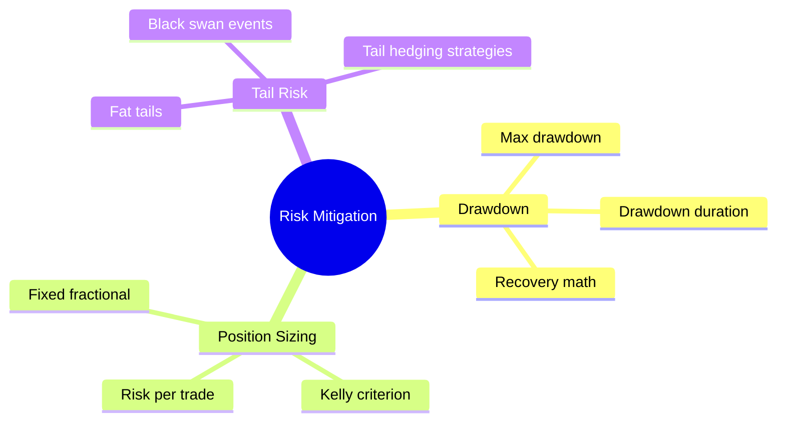

# Module 20: Risk Mitigation

Est. study time: 2h
Language: en

## Knowledge Map



---

## Learning Objectives
- Measure drawdown and drawdown duration
- Calculate recovery percentage needed after drawdown
- Apply position sizing rules for risk control
- Distinguish tail risk from normal market risk
- Implement tail hedging strategies

---

## Real-World Example

Professional trader starts year with $100K. Takes aggressive positions, risking 5% per trade. Hits 8 consecutive losses. Account drops to $100K × 0.95^8 = $66.3K (34% drawdown). Needs 51% gain just to break even. Rest of year, trades under pressure — takes bigger risks to recover, loses more. Finishes at $42K.

Another trader same account, risks 1% per trade. Same 8 losses: $100K × 0.99^8 = $92.3K (7.7% drawdown). Needs only 8.4% gain to recover. Trades calmly rest of year, recovers, finishes flat. Same strategy, different sizing — completely different outcome.

> **Think**: Why does position sizing matter more than entry timing for long-term survival?
>
> *Answer: Entry timing determines win/loss per trade. Position sizing determines whether you survive losing streaks. Even world-class entry accuracy has losing streaks. Proper sizing ensures you survive them. The difference between 5% and 1% risk per trade is difference between -34% and -7.7% after 8 losses. Survival is prerequisite to compounding.*

---

## Core Content

### Section 1: Drawdown

**Max drawdown (MDD):** Largest peak-to-trough decline before new peak.

**Drawdown duration:** Time from peak to recovery (days/months/years).

```text
Account: Start $100K
    → Peak: $150K
    → Trough: $90K (40% drop from $150K)
    → New peak: $155K (6 months later)

Max drawdown = ($150K - $90K) / $150K = 40%
Drawdown duration = 6 months
```

**Drawdown math for recovery:**
```text
Loss 20% → need 25% gain to break even
Loss 30% → need 42.9% gain
Loss 40% → need 66.7% gain
Loss 50% → need 100% gain
Loss 60% → need 150% gain
Loss 80% → need 400% gain
```

> **Think**: Why do professional traders cut losses at 10-15%?
>
> *Answer: Recovery math. 15% loss needs 17.6% gain to recover. 30% loss needs 42.9% gain. At 50% loss, you need 100% gain — entire year's gains wiped. Small losses are recoverable. Deep drawdowns destroy compounding.*

> **Cloze**: "Max drawdown = largest {peak-to-trough} decline. Recovery % = {1 / (1 - drawdown) - 1}. Drawdown of 50% requires {100%} gain to recover. Drawdown {duration} measures time from peak to new {peak}."
>
> *Answer: peak-to-trough, 1 / (1 - drawdown) - 1, 100%, duration, peak*


### Section 2: Position Sizing for Risk Control

Core principle: risk per trade = % of capital you are willing to lose.

**Fixed fractional sizing:**
```text
Risk per trade: 1% of capital ($10K account → $100 risk)
Stop distance: $2/share (entry $50, stop $48)
Position size = Risk / Stop distance = $100 / $2 = 50 shares
Value = 50 × $50 = $2,500 (25% of capital)
```

**Kelly criterion:** Optimal fraction = (p × b - q) / b where p = win prob, b = win/loss ratio, q = 1-p

```text
Strategy: 60% win rate, 2:1 reward:risk
Kelly = (0.60 × 2 - 0.40) / 2 = 0.80 / 2 = 0.40 (40% of capital)
Practical: Use fractional Kelly (25%) to avoid overbetting
```

> **Think**: Trader uses 5% risk per trade. Has 10 consecutive losses. Account drops how much?
>
> *Answer: Not 50%. Each loss = 5% of current capital, not initial. After 10 losses: 0.95^10 = 0.599 → 40% drawdown. Still severe. This is why pros risk 0.5-2% per trade, rarely 3%+. 5% risk almost guarantees 30%+ drawdown eventually.*

> **Cloze**: "Fixed fractional sizing: risk per trade = {fixed % of capital}. Position size = {risk amount} / {stop distance}. Kelly criterion optimizes long-term growth: f = {(p × b - q) / b}. Practical traders use {fractional Kelly} to reduce {variance}."
>
> *Answer: fixed % of capital, risk amount, stop distance, (p × b - q) / b, fractional Kelly, variance*

### Section 3: Tail Risk

Tail risk: risk of extreme moves far beyond what normal distribution predicts.

**Fat tails:** 3+ sigma events happen far more often than Gaussian predicts.

```text
Gaussian: 3-sigma event = 0.3% probability (≈1 in 333 days)
Reality: 3-sigma moves occur 1-5% of days (3-17× more often)
1987 crash: 22-sigma in Gaussian terms — "should not happen in universe lifetime"
```

**Tail hedging strategies:**
- Long out-of-the-money puts (insurance premium)
- Tail risk funds (e.g., Universa, run by Nassim Taleb collaborator Mark Spitznagel)
- Trend-following (captures and profits from tails on both sides)

> **Think**: If 95% VaR says max loss = $24K, but fat tails mean 2% chance of -$100K loss, is VaR misleading?
>
> *Answer: Yes. VaR tells threshold but not tail shape. Two portfolios with identical VaR can have very different tail risk. Portfolio A: 5% loss between $24K-$40K. Portfolio B: 4% loss in $24K-30K + 1% loss of $500K+. Same VaR, very different risk. This is why regulators now use Expected Shortfall (CVaR).*

> **Predict**: Your portfolio has 95% VaR = $24K, 99% VaR = $50K. CVaR (95%) = $60K. What does this gap tell you?
>
> *Answer: Large gap between VaR and CVaR indicates fat tails. If distribution were normal, CVaR would be ~$31K for same VaR. CVaR of $60K = tail losses are 2× normal. This is concrete evidence of tail risk in portfolio.*

> **Cloze**: "Tail risk = extreme moves beyond {3} standard deviations. Markets have {fat tails}: 3-sigma events occur {3-17}× more often than Gaussian predicts. Strategy for tail risk: buy {out-of-the-money puts} as insurance."
>
> *Answer: 3, fat tails, 3-17, out-of-the-money puts*

---

### Why This Matters

Drawdowns destroy compounding: 50% loss requires 100% gain to recover. Stops prevent catastrophic drawdowns but fail in gaps — position sizing is the ultimate protection. Tail risk is invisible in normal distribution models but causes blowups. LTCM, Amaranth, and countless others died not from wrong strategies but from unhedged tail risk. Every trader must understand drawdown math, sizing discipline, and tail hedging to survive long term.

---

## Key Takeaways
- Max drawdown determines survival: keep individual losses small (1-2% risk per trade).
- Recovery math: 50% drawdown needs 100% gain — avoid deep drawdowns at all cost.
- Position sizing is single most important risk control: risk % per trade > entry timing.
- Fixed fractional sizing: position = risk amount / stop distance.
- Kelly criterion maximizes growth; fractional Kelly safer for variance reduction.
- Tail risk: 3-sigma events happen 3-17× more often than normal distribution predicts.
- Tail hedging: out-of-the-money puts, trend-following, specialized tail funds.

---

## Common Misconception

**"My strategy has positive expectancy, so sizing doesn't matter."**

Even 90% win-rate strategy has losing streaks. With 5% risk per trade and 10% lose rate, probability of 5 consecutive losses = 0.1^5 = 0.001% — happens ~1 in 100K trades. But with 500 trades/year, that's once per 200 years — in your lifetime. And at 5% risk per trade, 5 losses = 22.6% drawdown. Sizing determines whether you survive inevitable losing streaks.

---

## Spot the Mistake

Drawdown recovery calculation:

"Account drops 30% from $100K to $70K. Needs 30% gain to recover."

What's wrong?

*Answer: Recovery % = drawdown / (1 - drawdown) = 30% / 70% = 42.9%. 30% gain on $70K = $91K, still $9K short. This mistake causes traders to underestimate how hard recovery is after big loss.*

---

## Feynman Explain
(Teach tail risk to child: "Weather forecast says '95% chance rain ≤ 1 inch.' That's normal risk. But 5% chance could be 2 inches or 20 inches (hurricane). Tail risk = preparing for hurricane, not just 1-inch rain. Buy insurance (umbrella) even though 95% of days you don't need it. Most people ignore hurricane risk because it's rare — until hurricane hits. Tail hedging = buying umbrella before storm clouds appear.")

---

## Reframe
(Pause. Judge: Is tail hedging worth the constant premium cost? Universa tail fund returned 3,000%+ in March 2020 crash, but lost ~5% per year in normal years. Over 10 years: nine years of -5% + one year of +3,000% = net positive. But psychological cost: paying insurance premium every year for something that may not happen for a decade. Most investors cannot endure 9 years of tail hedge decay. Alternative: position sizing so extreme moves don't blow account — self-insurance instead of buying puts. Which approach fits your psychology?)

---

## Drill
Take quiz. MCQs test drawdown math, position sizing, tail risk concepts.

Run: `learn.sh quiz equity-trading 20`
