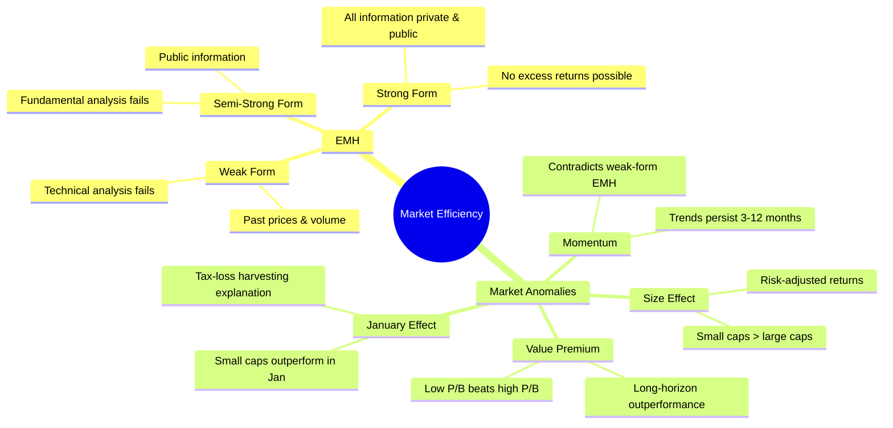
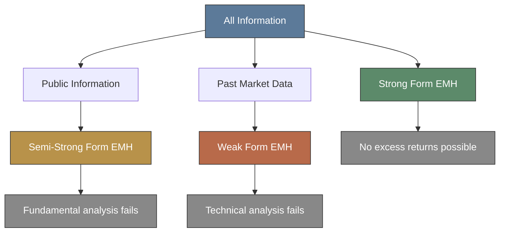
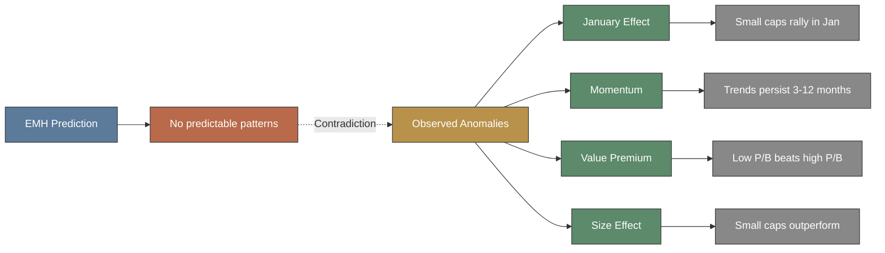

# Module 21: Market Efficiency

## Mindmap

## Learning Objectives

After completing this module, you will be able to:

- Explain three forms of Efficient Market Hypothesis and their implications for trading strategies
- Distinguish between weak, semi-strong, and strong form EMH
- Identify major market anomalies that challenge EMH predictions
- Analyze how anomalies like January effect create potential trading opportunities
- Evaluate empirical evidence both supporting and contradicting market efficiency

## Real-World Example

**The January Effect in Action**

From 1926–2020, US small-cap stocks outperformed large-cap stocks by an average of 3.2% in January alone. In 1975–1985, a trader buying small caps on December 31 and selling January 31 would have earned 8–10% monthly returns repeatedly. The anomaly persists — though weakened — because tax-loss harvesting pushes selling into December, then buying rebounds in January.

Yet many institutional investors refuse to trade this pattern. Why? They fear looking foolish if it fails in any given year. That fear — a behavioral bias — costs them consistent returns.

> **Think:** If the January effect is well-documented, why hasn't arbitrage eliminated it entirely?

---

## Core Content

> **Cloze**: The {Efficient Market Hypothesis} states asset prices reflect all available information. The {weak} form says past prices are reflected.
>
> *Answer: Efficient Market Hypothesis, weak*

### 1. Efficient Market Hypothesis (EMH)

EMH states asset prices fully reflect all available information. Three forms:

**Weak Form:** Prices reflect all past market data (price, volume). Technical analysis cannot generate excess returns.

**Semi-Strong Form:** Prices reflect all publicly available information (financial statements, news, economic data). Fundamental analysis cannot generate excess returns.

**Strong Form:** Prices reflect all information — including private/insider information. No one can beat the market.

| Form | Information Included | Strategies Rendered Useless |
|------|-------------------|---------------------------|
| Weak | Past prices, volume | Technical analysis |
| Semi-Strong | Public information | Fundamental analysis |
| Strong | All information (incl. private) | All active strategies |

> **Think:** If EMH strong form were true, would it matter which stocks you picked? What would happen to active fund managers?

### 2. Market Anomalies

Empirical patterns EMH cannot easily explain:

**January Effect:** Small-cap stocks outperform large-caps in January. Candidates for explanation: tax-loss selling (sell losers in December, buy back in January), window dressing (funds remove risky stocks from year-end reports).

**Momentum:** Stocks that performed well over past 3–12 months continue to outperform. This directly contradicts weak-form EMH (past returns should not predict future returns).

**Value Premium:** Stocks with low price-to-book ratios outperform high P/B stocks over long horizons.

**Size Effect:** Small-cap stocks earn higher risk-adjusted returns than large caps.

> **Think**: If EMH strong form were true, would it matter which stocks you picked? What would happen to active fund managers?
>
> *Answer: No stock picking would matter — all stocks priced correctly. Active fund managers would consistently fail to beat market, leading to industry collapse. Index funds would dominate completely.*
>
> **Predict**: If EMH semi-strong form holds, what happens day after unexpected earnings surprise? Will you profit buying next day?
>
> *Answer: No — semi-strong form says all public info (including earnings) is instantly priced in. Buying day after doesn't give edge. Anomalies contradict this, but EMH says you can't profit from public info alone.*
>
> **Cloze:** The ___ ___ predicts small-cap stocks outperform large-caps in January. A proposed explanation is ___ ___ ___ selling in December.
> **Answer:** January effect; tax-loss harvesting

> **Predict:** If EMH semi-strong form holds, what happens the day after a company announces unexpectedly high earnings? Will you profit buying the day after?

---

## Why This Matters

Every trading strategy implicitly takes a stance on EMH. Momentum traders bet against weak-form. Value investors bet against semi-strong. If markets were strong-form efficient, all active strategies would fail. Understanding which form holds helps you pick strategies that have a fighting chance. Anomalies show where markets are not perfectly efficient — but they also tend to shrink once discovered.

---

## Key Takeaways

1. EMH has three forms: weak (past prices), semi-strong (public info), strong (all info). Each implies different strategies are useless.
2. Weak-form EMH is well-supported: technical analysis has poor track record.
3. Semi-strong form has substantial evidence but anomalies challenge it.
4. Strong form is mostly rejected — insiders do earn excess returns.
5. Market anomalies (January effect, momentum, value premium, size effect) suggest EMH is not perfectly accurate.
6. Anomalies tend to weaken after discovery as traders arbitrage them away.

---

## Common Misconception

**"EMH means markets are perfectly efficient all the time."**

No. EMH is a spectrum. Weak form is well-supported. Semi-strong has substantial evidence but with anomalies. Strong form is mostly rejected — insiders do earn excess returns. Markets are *mostly* efficient, and anomalies shrink once discovered and traded upon.

---

## Spot the Mistake

> "I found a technical pattern that predicted the last 5 market moves. I'm going to trade it for consistent profits."

**Mistake:** Past performance of a pattern does not guarantee future results. Weak-form EMH says past price patterns cannot predict future prices. A pattern that worked 5 times may fail on the 6th. With enough data mining, you can always find patterns that worked historically.

**Fix:** Out-of-sample test the pattern on data you did not use to discover it. Account for multiple testing (Bonferroni correction). Expect anomaly to degrade once you trade it live.

---

## Feynman Explanation

EMH: Stock prices already reflect what everyone knows. You can't beat the market using information everyone already has. It's like trying to win a trivia contest by reading the same Wikipedia page as everyone else.

Anomalies: Sometimes markets do predictable things — like small stocks rising in January. But once people notice and trade on it, the pattern often weakens. Markets learn.

---

## Reframe

| EMH Form | Skeptic Says | Believer Says |
|----------|-------------|--------------|
| Weak | "Chart patterns work" | "Any pattern would be traded away" |
| Semi-Strong | "Value investing beats market" | "P/E ratios are public info — already priced" |
| Strong | "Buffett exists" | "Buffett is outlier in distribution of luck" |

---

## Drill

1. Name three forms of EMH from weakest to strongest.
2. Which market anomaly predicts small caps outperform in January?
3. What two explanations are proposed for the January effect?
4. Which form of EMH does momentum anomaly contradict most directly?
5. What does value premium refer to?
6. What is the size effect?
7. If semi-strong EMH holds, can fundamental analysis generate excess returns?
8. What happens to anomalies after they are discovered and published?
9. What information is included in weak-form EMH?
10. Which form of EMH is most strongly rejected by empirical evidence?
