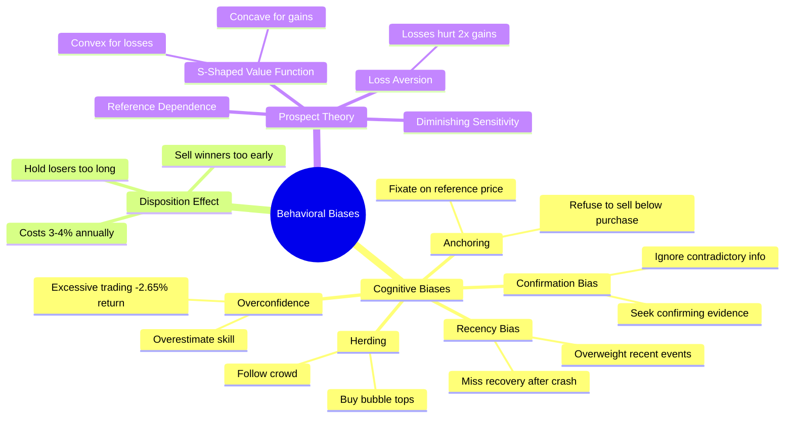
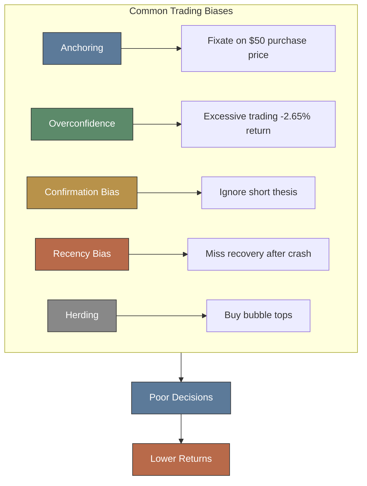
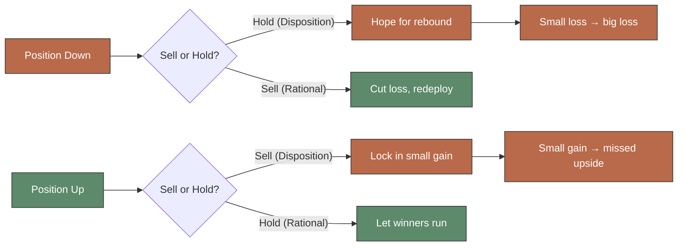
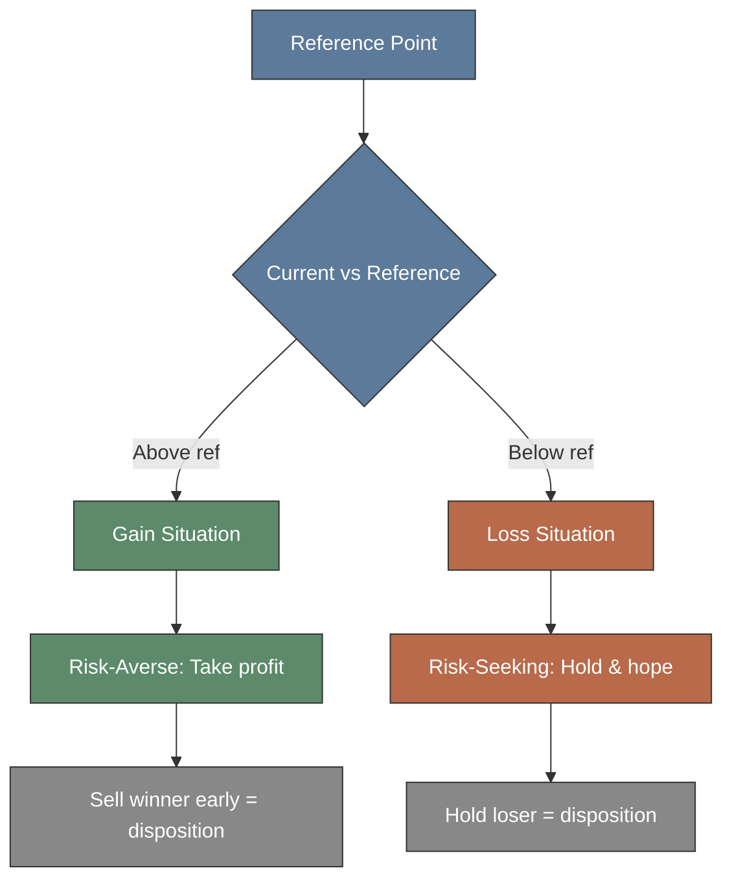

# Module 22: Behavioral Biases

## Mindmap

## Learning Objectives

After completing this module, you will be able to:

- Recognize five major cognitive biases that distort trading decisions
- Describe disposition effect and its impact on portfolio returns
- Apply prospect theory to understand loss aversion in markets
- Identify how anchoring and overconfidence lead to systematic trading errors
- Develop strategies to counteract behavioral biases using systematic rules

## Real-World Example

**The Disposition Effect Costs Real Money**

Odean (1998) analyzed 10,000 retail brokerage accounts and found investors realized gains 50% more often than losses. This cost them approximately 3–4% annual returns versus a simple buy-and-hold strategy. A trader holding a winner up 20% sells to lock in the gain, then watches the stock double. Meanwhile, a loser down 30% is held "until it gets back to even" — and often drops another 20%.

The error is systematic. It's not a few bad traders — it's nearly everyone.

> **Think:** Disposition effect says cut losers short, let winners run. Why is this hard emotionally?

---

## Core Content

### 1. Cognitive Biases

**Anchoring:** Fixating on reference point (purchase price, 52-week high). Trader buys stock at $50, it drops to $40. Instead of reassessing, anchors to $50 and refuses to sell until it "gets back."

**Overconfidence:** Overestimating skill, precision, and knowledge. Men trade 45% more than women; returns 2.65% lower annually (Barber & Odean). Overconfident traders churn portfolio, generating fees and poor timing.

**Confirmation Bias:** Seeking evidence confirming existing belief; ignoring contradictory evidence. Trader buys tech stock, reads bullish articles, dismisses short-seller reports.

**Recency Bias:** Overweighting recent events. After 2008 crash, investors avoided equities for years, missing 2009–2020 bull market. After COVID crash, some piled into tech at peak valuations.

**Herding:** Following crowd rather than independent analysis. Dot-com bubble (1999), crypto (2021) — herding inflates then crashes bubbles.

> **Think:** Which bias best explains why traders pile into a rising stock near its peak? Which explains why they refuse to sell a losing position?

> **Think**: Which bias best explains why traders pile into rising stock near its peak? Which explains why they refuse to sell losing position?
>
> *Answer: Peak buying = herding + overconfidence. Refusing to sell losers = anchoring (to purchase price) + loss aversion. Both examples show behavioral biases overriding rational analysis.*
>
> **Cloze**: The {recency} bias causes traders to {weight} recent events more heavily than older ones. This caused investors to {avoid stocks} after the 2008 crash.
>
> *Answer: Recency; weight; avoid stocks*

### 2. Disposition Effect

Selling winners too early; holding losers too long.

Why it happens:
- **Regret aversion**: Realizing loss means admitting mistake. Selling winner locks in gain and pride.
- **Mental accounting**: Tracking each position separately instead of portfolio-level thinking.
- **Mean reversion belief**: Losers must bounce back; winners must fall.

Evidence: Odean (1998) found retail investors realized gains 50% more often than losses. This cost them ~3–4% annual returns versus buy-and-hold strategy.

> **Think:** Disposition effect says cut losers short, let winners run. Why is this hard emotionally?

> **Cloze**: The {disposition} effect describes selling {winners} too early and holding {losers} too long. Research shows this costs investors {3-4}% annually.
>
> *Answer: disposition; winners; losers; 3-4*

### 3. Prospect Theory & Loss Aversion

Developed by Kahneman & Tversky (1979). Describes how people actually make decisions under uncertainty.

**Key features:**

1. **Loss Aversion**: Losses hurt ~2x more than equivalent gains feel good. Losing $100 feels as bad as gaining $200 feels good.

2. **S-Shaped Value Function**: Concave for gains (risk-averse), convex for losses (risk-seeking), steepest at reference point.

3. **Reference Dependence**: People evaluate outcomes relative to reference point (purchase price, expectation), not absolute wealth.

4. **Diminishing Sensitivity**: Difference between $0 and $100 feels bigger than $900 to $1,000.

**Implications for traders:**
- Fear of loss makes traders exit winning trades too quickly (lock in gain) and hold losing trades too long (avoid realizing loss)
- Setting stop-losses counteracts loss aversion by enforcing rational exits
- Taking profits in tranches helps overcome disposition effect

> **Think:** Loss aversion says losses hurt twice as much as gains. How might this affect your trading if you have 3 winning trades ($100 each) and 1 losing trade (-$100)?

> **Predict:** A trader with strong loss aversion sees their $50 stock drop to $40. What are they most likely to do? Why?

---

> **Predict**: Trader with strong loss aversion sees stock drop from $50 to $40. What most likely action? Why?
>
> *Answer: Hold (refuse to sell). Loss aversion makes realized loss feel ~2x worse than gain. Trader hopes for rebound to avoid painful loss realization. Rational move: cut loss, redeploy. Emotional move: hold and hope. Disposition effect in action.*

## Why This Matters

Every trade you make is influenced by behavioral biases. Understanding them tells you *why* markets deviate from efficiency — and gives you tools to fight back. The best traders don't eliminate biases; they build systems (checklists, stop-losses, trading plans) that override them.

---

## Key Takeaways

1. Cognitive biases (anchoring, overconfidence, confirmation bias, recency bias, herding) systematically distort decisions.
2. Overconfidence causes excessive trading: men trade 45% more than women, returns 2.65% lower (Barber & Odean).
3. Disposition effect — selling winners too early, holding losers too long — costs 3–4% annually.
4. Prospect theory explains loss aversion: losses hurt ~2x more than equivalent gains.
5. Reference dependence means traders evaluate outcomes relative to purchase price, not absolute wealth.
6. Best defense against biases is systematic rules, not willpower.

---

## Common Misconception

**"If I know about biases, I can avoid them through willpower."**

Knowing about biases does not eliminate them. Kahneman calls this the "illusion of understanding." Even professional traders with PhDs in finance exhibit anchoring and loss aversion. The solution is not willpower — it's automation: stop-losses, trading checklists, pre-commitment to rules, and post-trade reviews.

---

## Spot the Mistake

> "I bought ABC at $100. It's now $80. I'll wait until it gets back to $100 before selling."

**Mistake**: Anchoring to purchase price + loss aversion refusing to realize loss. Stock doesn't know your purchase price. The $80 price reflects current information. Holding because "it has to come back" is not an expectation — it's a bias.

**Fix**: Re-evaluate position based on current information. Would you buy ABC at $80 today? If not, sell.

---

## Feynman Explanation

Behavioral finance: People aren't perfectly rational computers. We get scared, greedy, stubborn. We anchor to prices, follow crowds, and feel losses more than gains. These predictable mistakes create patterns (anomalies) that disciplined traders can exploit.

---

## Reframe

| Bias | Reframe |
|------|---------|
| "I'll wait till it gets back to even" | "If I didn't own this stock today, would I buy it at this price?" |
| "I'm up 10%, time to sell" | "Would I sell this stock if I didn't know its purchase price?" |
| "Everyone is buying crypto" | "Crowd enthusiasm is a contrarian signal, not confirmation" |
| "I predicted that move perfectly" | "One correct call doesn't prove skill. Track 100 decisions." |

---

## Drill

1. What is anchoring in trading context?
2. Why does overconfidence reduce returns?
3. Which bias describes overweighting recent events?
4. What is the disposition effect?
5. How much more do losses hurt compared to gains, per prospect theory?
6. What is reference dependence?
7. How can stop-losses counteract loss aversion?
8. What is the difference between confirmation bias and recency bias?
9. What did Odean (1998) find about gain realization vs loss realization?
10. Name three cognitive biases that cause traders to hold losing positions too long.
