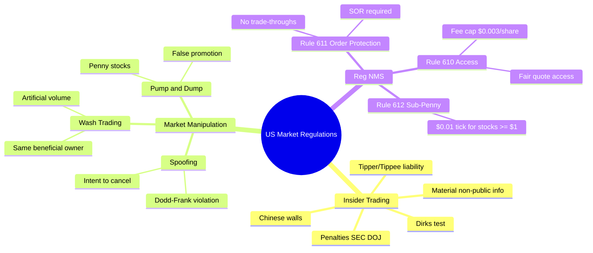
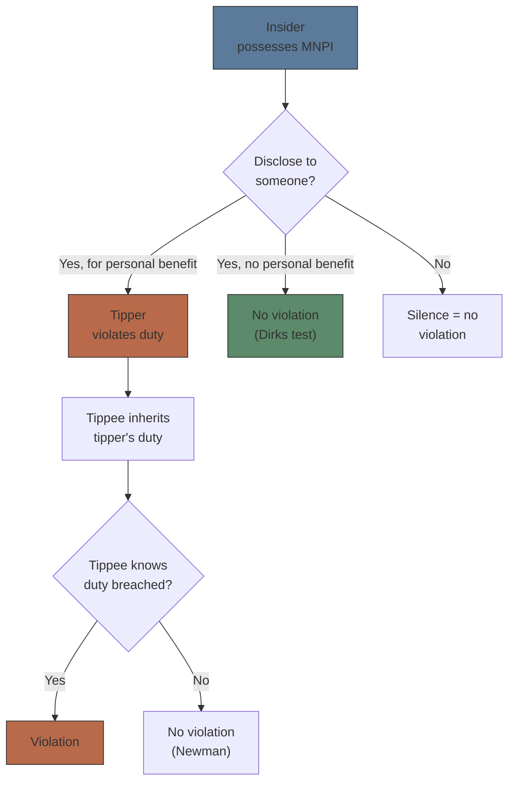
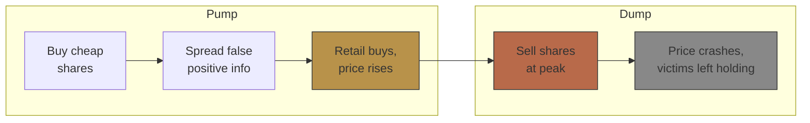
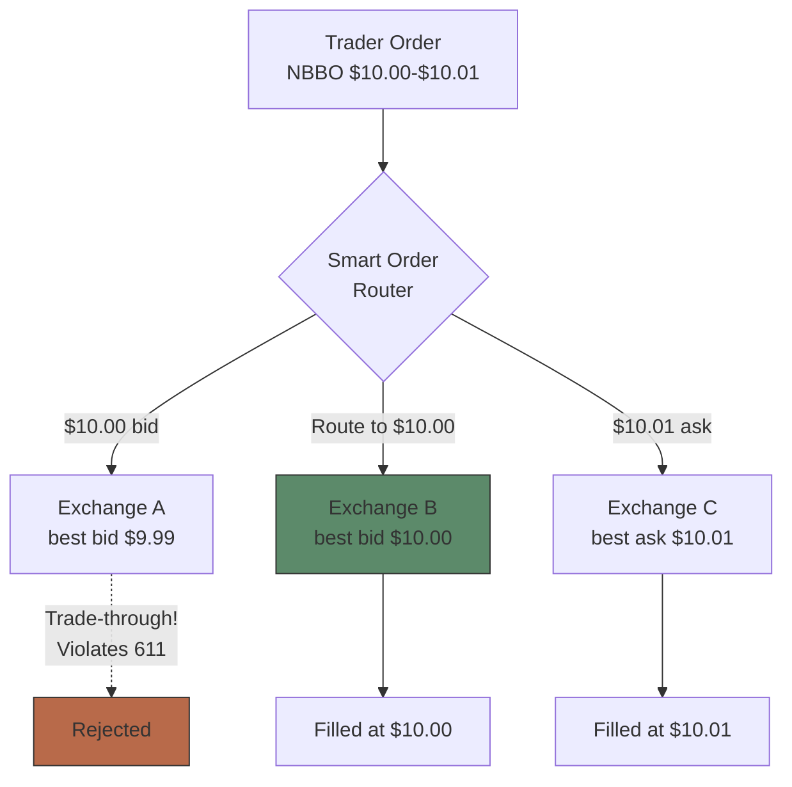

# Module 23: US Market Regulations

## Mindmap

## Learning Objectives

After completing this module, you will be able to:

- Define insider trading and distinguish lawful from unlawful information handling
- Identify market manipulation schemes: spoofing, wash trading, pump and dump
- Explain Reg NMS core provisions and their impact on market structure
- Apply the Dirks test to determine tipper/tippee liability
- Evaluate how Reg NMS rules affect order routing and execution quality

## Real-World Example

**The Overheard Acquisition Tip**

Your coworker overhears a VP say "Board approved the acquisition at $85/share" over the phone. He buys 500 shares before the announcement. Stock jumps to $83 — he sells, makes $14,000 profit. SEC traces the trade, interviews the VP, finds the phone record. Your coworker faces civil penalties, disgorgement, and criminal charges. He also gets fired.

The VP? Charged as a tipper — even though he didn't trade himself.

> **Think**: Did the VP violate insider trading laws even though he never traded and didn't ask anyone to trade?
>
> *Answer: Yes. Tipper liability attaches when a person in a position of trust discloses material non-public information (MNPI) for personal benefit — even an indirect benefit like a friendship. The tippee (coworker) inherits the tipper's duty. Both liable.*

---

## Core Content

### Section 1: Insider Trading

**Definition:** Trading securities based on material, non-public information (MNPI) in breach of a fiduciary duty.

**Elements (SEC v. Dirks 1983, SEC v. Newman 2014):**
- **Material:** Would reasonable investor consider info important? Would it alter total mix of information?
- **Non-public:** Not disseminated to general public (not yet on wire, earnings not released)
- **Breach of duty:** Tipper violates trust by disclosing MNPI
- **Personal benefit:** Tipper receives something (money, reputational gain, gift to friend)

**Tipper/Tippee Framework:**

**Penalties:**
- **SEC civil:** Disgorgement of profits + penalties up to 3× profit/loss avoided
- **DOJ criminal:** Up to 20 years prison per count, fines up to $5M individual, $25M entity
- **Career:** Industry bar (can't work in securities), FINRA disqualification

> **Think**: A research analyst reads a supplier's SEC filing that hints at a customer's upcoming earnings miss. Is this insider trading?
>
> *Answer: Not necessarily. If the info is publicly available (SEC filing) and analyst uses skill to connect dots — that's legitimate research (mosaic theory). Only a violation if analyst receives direct MNPI from an insider in breach of duty.*

> **Cloze**: "Insider trading requires {material}, {non-public} information, a {breach of duty}, and {personal benefit} to the tipper."

### Section 2: Market Manipulation

**Spoofing —** Bidding or offering with intent to cancel before execution. Creates false impression of supply/demand.

- Illegal under Dodd-Frank (2010)
- Intent must be shown (not just fat-finger errors)
- High-profile case: Navinder Sarao (2015) — spoofed E-mini S&P futures, contributed to 2010 Flash Crash

**Wash trading —** Simultaneous buy and sell of same security to create artificial volume. Buyer and seller are same entity.

- No genuine change of beneficial ownership
- Inflates volume to attract other traders
- Prohibited under SEC Rule 10b-5

**Pump and dump —** Promote stock (often penny stocks) with false claims, sell into the inflated price.

- Classic: Spam emails, social media hype, paid newsletters
- Victims — retail buyers at inflated prices

> **Think**: A trader repeatedly enters large buy orders at the ask, cancels them, enters smaller sell orders that fill at the higher price. What is this?
>
> *Answer: Spoofing. Large orders create illusion of buying demand → market moves up → trader sells real order at higher price → cancels large orders.*

> **Cloze**: "{Spoofing} involves entering orders with intent to {cancel} before execution. {Wash trading} involves simultaneous buy and sell by the same {beneficial owner}."

### Section 3: Reg NMS (Regulation National Market System)

Adopted 2005, effective 2007. Core goal: modernize US equity market structure for electronic trading.

**Three key rules:**

**Rule 611 — Order Protection Rule:**
- Trading centers must establish policies to prevent trade-throughs (executing at price worse than NBBO)
- Required: SOR (Smart Order Routing) to sweep protected quotes
- Exceptions: intermarket sweep orders (ISOs), manual/stopped orders

**Rule 610 — Access Rule:**
- Fair and non-discriminatory access to quotes
- Limit on access fees (capped at $0.003/share)
- NMS stocks must be accessible via SIP (Securities Information Processor)

**Rule 612 — Sub-Penny Rule:**
- Quotes for stocks priced ≥ $1.00 must be in minimum $0.01 increments
- Prevents pennying (queue-jumping by sub-penny increments)
- Sub-penny pricing allowed only for orders below $1.00

> **Think**: Why did Reg NMS cap access fees at $0.003/share?
>
> *Answer: Before the cap, exchanges competed by offering rebates to makers paid by taker fees. High fees distorted routing decisions — brokers routed to venues with lower fees, not better prices. Cap ensures price priority matters more than fee arbitrage.*

> **Predict**: If the sub-penny rule were repealed for liquid stocks priced over $100, what would happen?
>
> *Answer: Minimum increment drops to $0.001. Spread would narrow. Liquidity providers compete on sub-penny increments. Bid-ask spread shrinks but depth at each tick reduces.*

---

## Why This Matters

Regulation shapes every trade you execute. Insider trading enforcement changes how research is shared. Reg NMS determines where your order goes and what fill quality you get. Market manipulation rules define what order strategies are legal. Violations: career-ending fines, prison, industry bars. Understanding the rules isn't optional — it's the difference between a trading career and a criminal record.

---

## Key Takeaways

- Insider trading: MNPI + breach of duty + personal benefit. Tipper/Tippee both liable.
- Spoofing = order intent to cancel. Wash trading = artificial volume. Pump and dump = false promotion.
- Reg NMS: Order Protection (no trade-through), Access (fair quote access, fee cap $0.003), Sub-Penny ($0.01 tick for stocks ≥$1).
- Dirks test: tipper must receive personal benefit for liability.
- Mosaic theory: connecting public info dots is legal research, not insider trading.

---

## Common Misconception

**"Insider trading means trading on any non-public information."**

False. Trading on non-public information is often legal if:
- No fiduciary duty was breached (e.g., analyst builds mosaic from public filings)
- No tipper/tippee relationship (e.g., overhearing randomly in public — legal under Dirks)
- Not "tipped" in breach of duty (e.g., corporate insider accidentally leaves document — may not violate without personal benefit)

The key is breach of duty + personal benefit. Mere possession of MNPI is not enough.

---

## Spot the Mistake

"I have an idea that XYZ will release bad earnings. I'll buy puts. If I'm wrong, I only lose the premium. It's a limited-risk trade."

**Mistake:** If the "idea" is based on material non-public information (e.g., friend at supplier says "orders from XYZ dropped 40%"), buying puts is insider trading. The trade structure (options vs stock) doesn't matter. Insider trading laws apply to any securities transaction regardless of instrument.

---

## Feynman Explanation

Insider trading: You peek at your friend's Amazon order history and see they bought you a watch. You tell another friend. Both of you "know" the gift before it arrives. The peeker = tipper. The told friend = tippee. Both did something unfair — even though neither stole anything physical. The "breach" = breaking trust by looking and telling. The "personal benefit" = the satisfaction of knowing.

---

## Reframe

| Action | Legal or Not? | Why |
|--------|-------------|-----|
| Overhear MNPI in public coffee shop, trade | Legal (no tipper breach) | Risky — SEC may still investigate |
| Analyst reads 10 public filings, connects dots | Legal (mosaic theory) | Legitimate research |
| Friend at company tells you earnings early | Illegal (tipper/tippee) | Both liable |
| Spoof orders to manipulate price | Illegal (Dodd-Frank) | Intent to cancel is key |

---

## Drill

Run: `learn.sh quiz equity-trading 23`
Run: `learn.sh cloze equity-trading 23`
