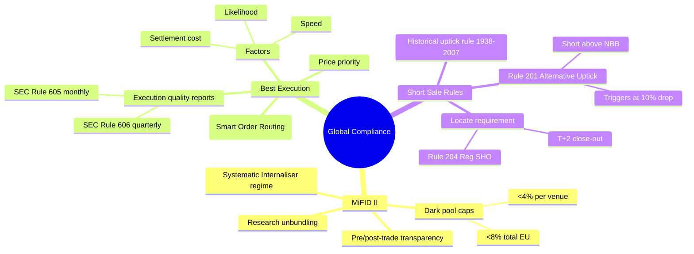
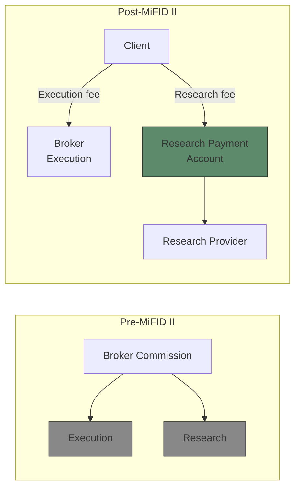
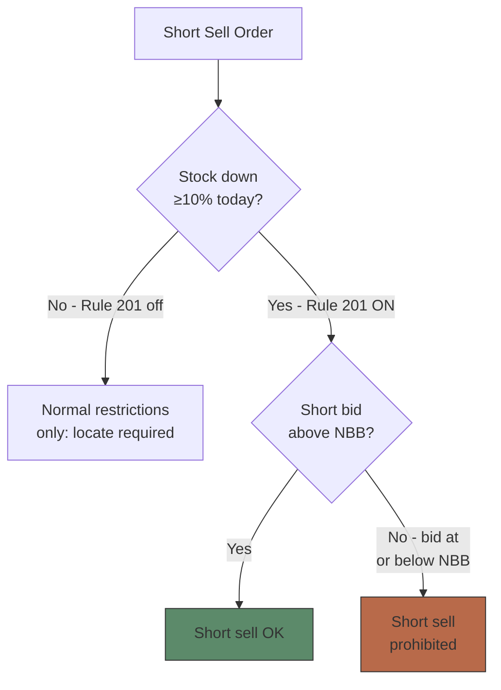

# Module 24: Global Compliance

## Mindmap

## Learning Objectives

After completing this module, you will be able to:

- Describe MiFID II transparency and research unbundling requirements
- Apply best execution obligations across multiple trading venues
- Interpret short sale regulations: uptick rule history and Rule 201
- Explain how MiFID II changed European market structure
- Evaluate conflicts of interest in payment for order flow and soft dollars

## Real-World Example

**The Post-MiFID II Research Crunch**

Before MiFID II, a London asset manager paid $10M in bundled commissions to a broker — $6M for execution, $4M hidden for research. Fund investors bore the cost without knowing. After MiFID II, the manager must charge the fund $6M execution + $4M research separately, or absorb research cost from own P&L.

Many managers chose to absorb research costs — and promptly cut research budgets by 20-30%. Small-cap research coverage in Europe collapsed. Companies with market caps under $500M lost analyst coverage. The regulation achieved transparency but at a cost: less public research for smaller companies.

> **Think**: Was the research coverage collapse an unintended consequence or a feature of MiFID II?

---

## Core Content

### Section 4: MiFID II (Markets in Financial Instruments Directive II)

Effective January 3, 2018 (EU/EEA). Major overhaul of European securities regulation.

**Key provisions:**

**Transparency:**
- Pre-trade transparency: Trading venues must publish current bid/ask quotes
- Post-trade transparency: Trades must be reported within 1 minute (equities), 15 minutes (bonds)
- Double volume caps: Trading under waiver limited to 4% per venue, 8% total across EU (for dark pools)

**Research unbundling:**
- Asset managers must pay for research separately from execution commissions
- Pre-MiFID: "Soft dollars" — bundled commission paid for both execution and research
- Post-MiFID: Research either from own P&L or from dedicated research payment account (RPA)

**Systematic Internaliser (SI) regime:**
- Firms that execute OTC client orders regularly must publish firm quotes
- Blurs line between exchange and broker

> **Think**: Why did MiFID II force asset managers to pay separately for research?
>
> *Answer: To eliminate conflict of interest. Pre-MiFID, soft dollars meant fund investors paid for research they may not benefit from. Unbundling made costs transparent and gave managers incentive to get value from research.*

> **Cloze**: "MiFID II requires equities trades be reported within {1 minute}, research must be {unbundled} from execution, and dark pool trading is capped at {4%} per venue and {8%} total."

### Section 5: Best Execution Obligations

**Definition:** Broker-dealers must seek the most favorable terms for client orders — not just price, but speed, likelihood of execution, settlement costs.

**Regulatory basis:**
- SEC Rule 10b-10, FINRA Rule 5310, MSRB Rule G-18
- MiFID II Article 27 (best execution reporting)

**Factors:**
- Price (primary but not sole factor)
- Speed of execution
- Likelihood of execution and settlement
- Size and nature of order
- Cost of routing to each venue
- Market impact

**Execution quality reporting:**
- SEC Rule 605: Monthly execution quality stats per stock per venue
- SEC Rule 606: Quarterly routing reports — where orders went and why
- Publicly available → used by institutional traders to assess brokers

> **Think**: A broker routes a client order to a venue that pays $0.002/share rebate instead of the venue with best price. Is this a best execution failure?
>
> *Answer: Yes, if price is worse. Best execution requires price priority. Payment for order flow (PFOF) is legally allowed but broker must still prove client got best price. If same price at multiple venues, broker can consider rebates.*

> **Predict**: If PFOF were banned, what happens to retail commission-free trading?
>
> *Answer: Brokers lose main revenue source. Likely outcomes: reintroduction of per-trade commissions, wider spreads, or subscription models.*

### Section 6: Short Sale Regulations

**Historical uptick rule (SEC Rule 10a-1, 1938-2007):**
- Short sale only on uptick (+) or zero-plus tick
- Purpose: prevent short selling driving price down
- Repealed 2007 after Reg NMS modernization
- Many academics argue repeal contributed to 2008 financial crisis accelerations

**Rule 201 — Alternative Uptick Rule (2010):**
- Trigger: Stock price drops ≥ 10% in one day
- Once triggered: Short selling allowed only at price above current national best bid
- Lasts: Rest of trading day + next day
- Applies to: All NMS stocks

**Locate requirement:**
- SEC Rule 204 (Regulation SHO): Before short selling, broker must:
  - Have reasonable grounds to believe shares can be borrowed
  - Locate shares available for borrow
  - Close out failures to deliver within T+2 (T+5 for bona fide market making)

> **Think**: Why did the SEC replace the original uptick rule with Rule 201 instead of bringing it back?
>
> *Answer: Original uptick rule was always on, regardless of market conditions. In normal markets, it may have reduced liquidity without benefit. Rule 201 is trigger-based — only activates during severe downward pressure (10% drop). Less intrusive in normal markets while providing circuit-breaker-like protection in crashes.*

> **Cloze**: "Rule 201 triggers when a stock drops {10%} in one day. Once triggered, short sales must be at price {above} the national best {bid}."

---

## Why This Matters

International regulations increasingly shape global trading. A US broker trading European stocks must comply with MiFID II. A European fund investing in US stocks faces SEC best execution rules. Short sale rules change during market stress. Understanding the global regulatory landscape prevents cross-border violations and helps you anticipate rule changes.

---

## Key Takeaways

- MiFID II: 1-min trade reporting, research unbundling, dark pool caps (4/8%).
- Best execution: price + speed + likelihood + cost. Rules 605/606 reports are public.
- Rule 201: triggered at 10% drop → short sales must be above NBB. Locate required always.
- Original uptick rule (1938-2007) was always on; Rule 201 is trigger-based.
- Regulation SHO Rule 204: locate shares before short selling, close fails in T+2.
- PFOF creates inherent conflict with best execution obligations.

---

## Common Misconception

**"Best execution means getting the best price."**

Best execution considers multiple factors: price, speed, likelihood of execution, settlement costs, and market impact. Price is primary but not sole. For a large institutional order, executing at NBBO might cause market impact that costs more than accepting a slightly worse price with less impact. FINRA Rule 5310 requires brokers to consider the "total mix" of factors.

---

## Spot the Mistake

"I shorted a stock that dropped 15% today. I entered the short at the market price — no issues."

**Mistake:** When a stock drops ≥10% in one day, Rule 201 activates. Short sales must be at price above the national best bid. Entering at market price might execute at or below the NBB (prohibited). The trader may have violated Rule 201 by not checking the restriction.

**Fix:** Check if Rule 201 is triggered before shorting any stock down 10%+ intraday. Route short orders with limit price above NBB.

---

## Feynman Explanation

Best execution: Imagine ordering a pizza. You want the best deal — cheapest price, fastest delivery, correct toppings, and the driver doesn't crash. A broker is like a pizza-ordering service that should consider all these factors, not just the price.

Short sale rules: Short selling is like borrowing a friend's video game and selling it, hoping to buy it back cheaper later. Regulators worry too much short selling might crash the price. Rule 201 is a speed bump: if the game's price drops 10%, you can only sell it short at a price higher than the current best offer.

---

## Reframe

| Regulation | Criticism | Defense |
|-----------|-----------|---------|
| MiFID II research unbundling | Killed small-cap research | Eliminated hidden fees |
| Best execution | Too vague to enforce | Flexible across order types |
| Rule 201 | Doesn't prevent crashes | Reduces panic selling pressure |
| Uptick rule repeal | May have worsened 2008 | Increased liquidity in normal times |

---

## Drill

Run: `learn.sh quiz equity-trading 24`
Run: `learn.sh cloze equity-trading 24`
