# Module 01: 乜嘢係錢?

Est. study time: 1h
Language: yue
Description: 錢嘅本質、三大功能、由貝殼到電子貨幣嘅簡史、法幣(Fiat)同信任嘅關係

## Knowledge Map

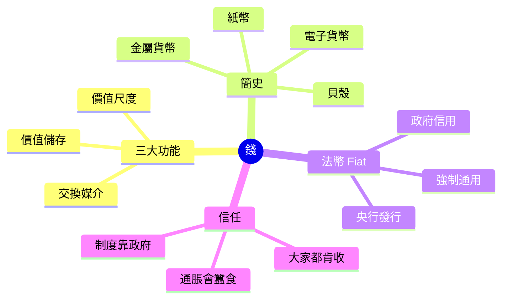

---

## Learning Objectives
- 用日常例子解釋「乜嘢係錢」, 解到中學生都明
- 講出錢嘅三大功能, 每個功能配一個生活例子
- 簡述錢由貝殼到電子貨幣嘅演化
- 解釋「法幣」(Fiat money) 點樣靠政府信用運作
- 指出「信任」係錢嘅根基, 失去信任嘅後果

---

## Real-World Example

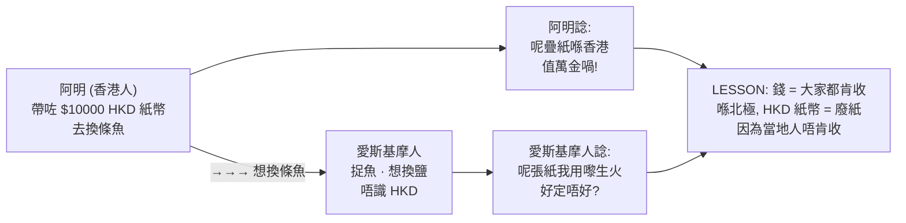

你帶住一疊 HKD 紙幣去北極探險, 愛斯基摩人唔識乜嘢係「HKD」, 佢只係當你張紙係燃料。你阿明覺得好屈:「呢疊紙喺香港值一萬蚊喎!」但喺北極, 呢疊紙真係冇用 — 因為冇人肯收。**錢嘅本質, 從來都唔係紙、金、銀, 係人與人之間嘅「共識」**。

> **Think**: 點解茶餐廳陳太肯收你張 $50 紙幣? 佢又唔認識你, 又唔見到政府喺隔離。佢點解會信呢張紙?
>
> *Answer: 佢信嘅唔係你, 佢信嘅係呢張紙「下個鐘可以攞去買第樣嘢」 — 即係佢信市場上其他人(包括政府)都會繼續接受呢張紙。呢個就係「信任」, 錢嘅根基。*

---

## Core Content

### Section 1: 錢嘅三大功能

經濟學家講「錢」, 講嘅唔係實物, 係三個功能。任何嘢只要做到呢三樣, 我哋都會當佢係錢。

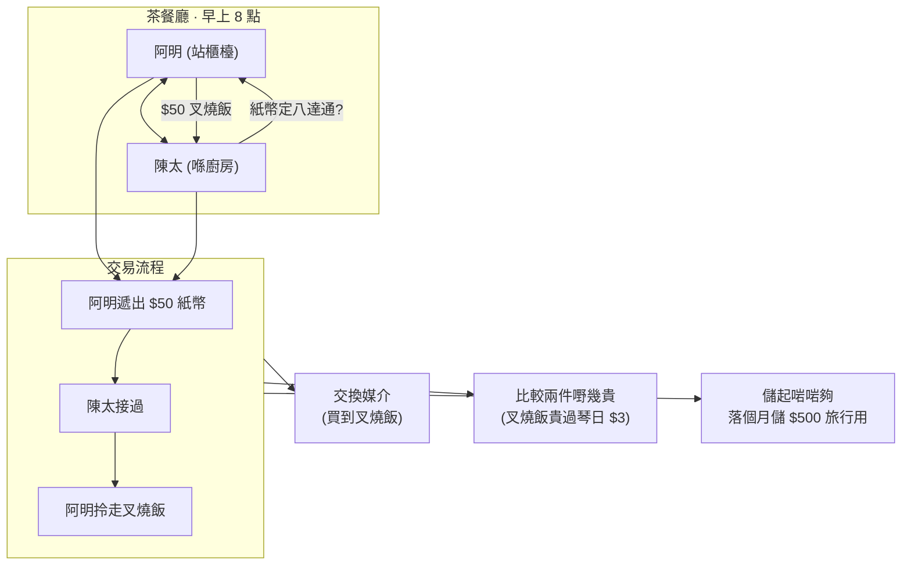

**功能一: 交換媒介** — 你想食叉燒飯, 飯店想收錢, 大家唔使交換「叉燒換叉燒」咁論盡。錢做中間人, 兩邊都方便。

**功能二: 價值尺度** — 部 iPhone $9000, 一碗雲吞麵 $50。你即時知道 iPhone 貴過雲吞麵 180 倍。如果冇共同單位, 你點比較? (「一架電話換 180 碗麵」好難記)

**功能三: 價值儲存** — 你今日賺咗 $1000, 唔使即日晒晒佢。可以放入錢包 / 銀行 / 床下底, 下個月先攞出嚟用。錢儲得起價值, 唔似蘋果會爛。

> **Think**: 比特幣做到「交換媒介」同「價值儲存」, 但「價值尺度」呢個功能, 點解好多人仲未肯用?
>
> *Answer: 因為商戶訂價嗰陣, 都係用 HKD/USD 寫, 唔寫 BTC。比特幣嘅價格太波動(一日可以 ±10%), 攞嚟做「標準刻度」好難用。所以 BTC 仲未係日常「尺度」, 只係一部人嘅儲值/投機工具。*

> **Cloze**: "錢嘅三大功能係 {交換媒介}、{價值尺度} 同 {價值儲存}。"
>
> *Answer: 交換媒介、價值尺度、價值儲存*

### Section 2: 錢嘅簡史 — 從貝殼到八達通

錢唔係一直係紙。以前試過好多嘢做錢, 留得低嘅, 都係做到嗰三個功能嘅。


**貝殼階段** — 遠古時候, 沿海居民用貝殼做交易。問題: 搬去山區就用唔到, 貝殼當地人唔信。

**金屬階段** — 銅、銀、金。耐用、稀有、可分割(一両金 = 10 錢), 但重。帶幾両金出街, 褲頭都扯低。

**紙幣階段** — 中國宋朝已經有「交子」(世界上最早嘅紙幣)。紙幣本身冇價值, 靠政府/銀行背書 — 「你攞呢張紙嚟, 我保證可以換到等值嘅金/銀」。

**塑膠卡 / 電子貨幣** — 信用卡、八達通、支付寶、PayMe。你睇唔到實體, 但個數字仲係錢, 因為背後有銀行/機構記賬。**記賬比印銀紙更高效**。

> **Cloze**: "世界上最早嘅紙幣係中國宋朝嘅 {交子}, 佢本身冇價值, 靠 {政府/銀行背書}。"
>
> *Answer: 交子、政府/銀行背書*

> **Predict**: 假設下年你用現金嘅次數減半, 用電子錢包加倍。10年後現金會消失嗎?
>
> *Answer: 唔會完全消失 — 但佔比會大幅縮。類似北歐國家(瑞典), 現金只佔交易 10% 以下。但完全消失要解決兩個問題: 老人家唔識用電子 / 系統故障時要 backup。多數經濟學家估: 現金會變「最後手段」, 唔係主流。*

### Section 3: 法幣 (Fiat Money) — 政府講咗算

1971 年, 美國總統尼克遜宣布美元唔再對應黃金。全球主要貨幣從此變成「法幣」(Fiat money)。

「Fiat」係拉丁文, 解「let it be done」(就係咁決定)。法幣嘅意思: **政府話呢張紙值幾多, 就值幾多**, 唔再靠黃金/白銀做後盾。

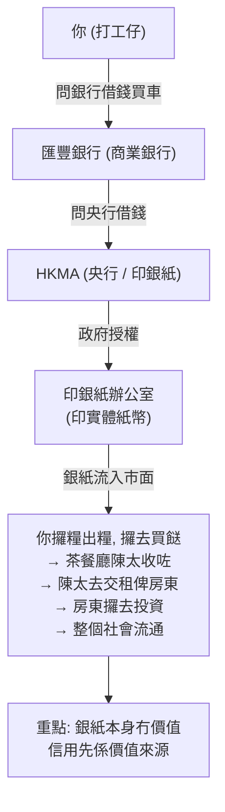

法幣靠兩樣嘢 hold 起嚟:
1. **政府強制通用** — 喺香港, 法例規定 HKD 係合法支付工具, 唔收港元會犯法
2. **政府信用** — 大家都信政府會管好, 唔會亂咁印銀紙搞到通脹失控

**問題**: 一旦政府「亂印銀紙」, 法幣就會崩潰。例子: 辛巴威 2008 年通脹率達到 89,700,000,000,000% (8.97 乘 10 嘅 13 次方)。個鈔票上面寫住「100 億」, 但一個麵包都買唔起。

> **Spot the Mistake**: 「法幣有政府背書, 所以點印都唔會貶值, 永遠保值。」
>
> 邊度錯?
>
> *Answer: 「永遠保值」錯晒。法幣嘅價值靠政府信用 hold 住, 一旦政府信用崩潰(亂印銀紙、政治動盪、戰敗), 法幣會極速貶值。辛巴威、委內瑞拉、1923 年德國 Weimar 全部都係反面教材。法幣唔係「絕對保值」, 只係「相對穩定」 — 視乎政府守唔守規矩。*

### Section 4: 點解 USD / HKD / CNY 唔同值

你今朝睇新聞, 可能見到 USD/HKD = 7.80, USD/CNY = 7.25。即係 1 美元可以換 7.8 港元 或 7.25 人民幣。**三個都係錢, 點解唔同價?**

簡單講: 三個政府/央行, 各自有自己嘅貨幣, 各自管自己嘅銀根。同 Bitcoin 唔同, 法幣之間可以自由兌換(透過外匯市場), 但唔可以 1:1 對換。

用阿明去日本旅行做例子, 由香港帶錢到日本買嘢, 一共 4 個 panel:

### Panel 1: 香港茶餐廳

阿明用 HKD 買叉燒飯

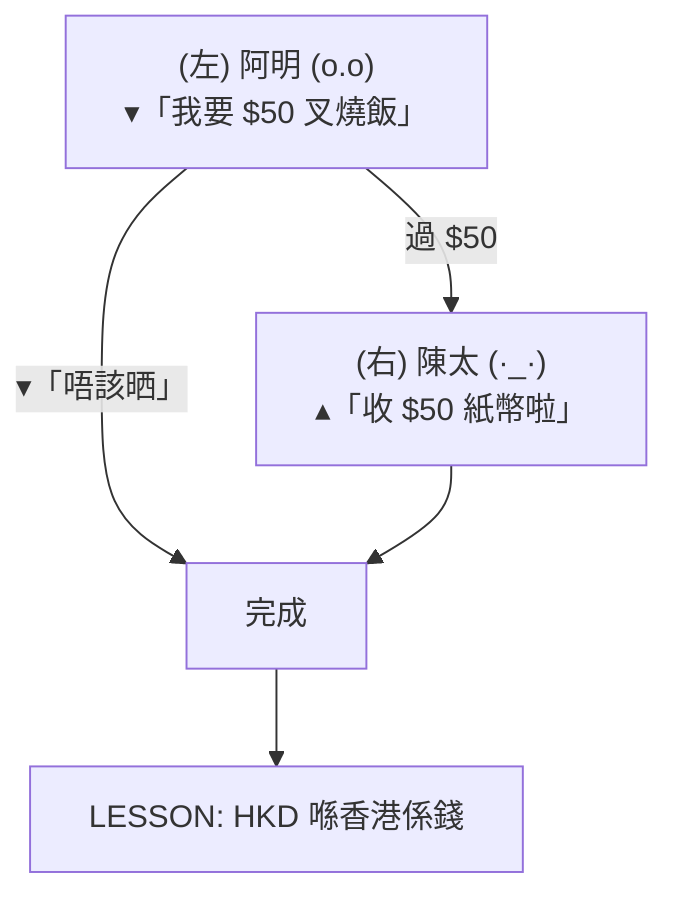

### Panel 2: 北極

HKD 紙幣喺北極冇人收

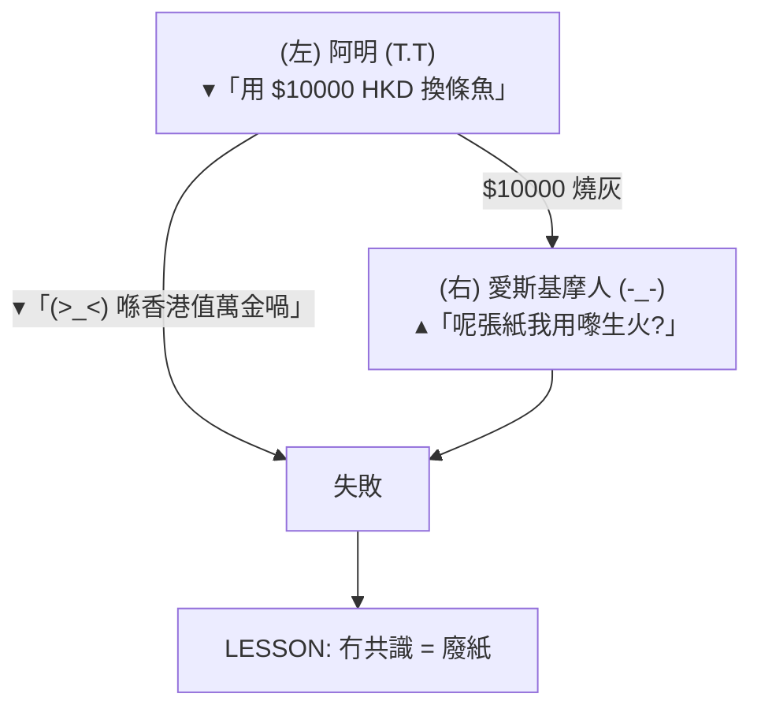

### Panel 3: 機場找換店

阿明去機場找換店

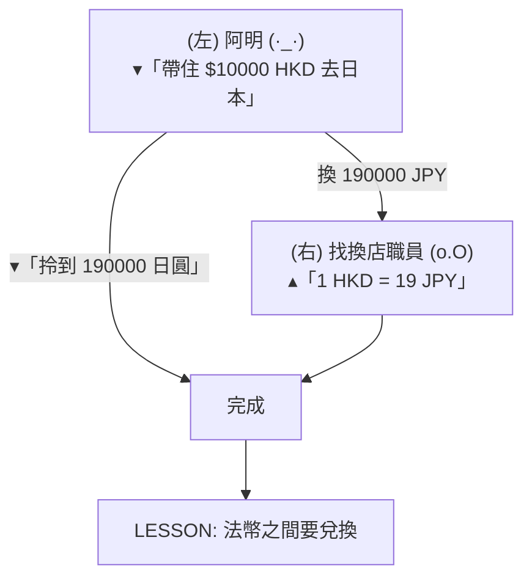

### Panel 4: 東京拉麵店

阿明用 JPY 買拉麵

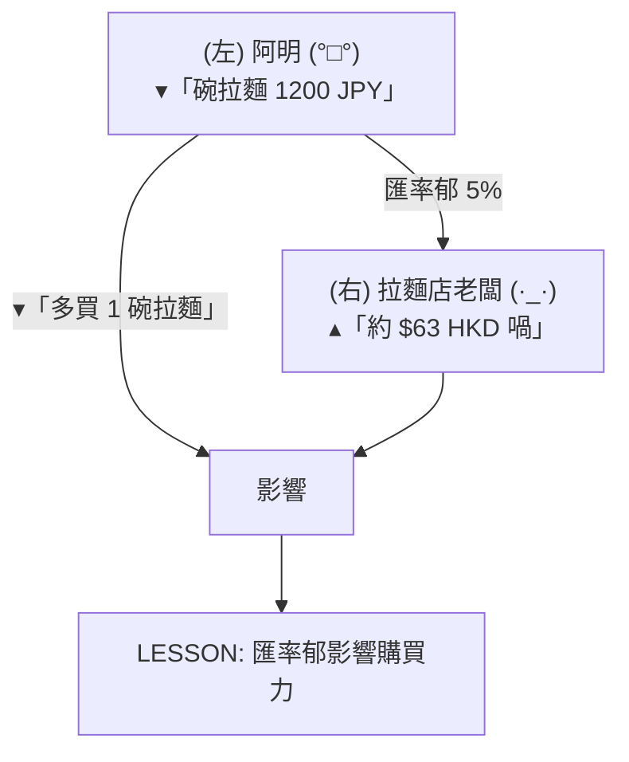

**睇完 4 個 panel 你會發現**:

- Panel 1: 阿明用 HKD 喺香港買嘢, **HKD 係錢** ✓
- Panel 2: 阿明帶 HKD 去北極, 當地人唔收, HKD 變廢紙 → 錢靠共識
- Panel 3: 阿明去日本前, 要去機場找換店將 HKD → JPY → 法幣之間要兌換
- Panel 4: 阿明喺日本用 JPY 買嘢, 匯率會郁, 影響購買力

**影響匯率嘅因素**(留俾後面課程): 通脹差、利率差、貿易順差/逆差、政治穩定、市場預期。呢個 module 只需要記住: **唔同國家有唔同法幣, 匯率會郁**。

> **Cloze**: "影響兩種法幣之間匯率嘅因素包括 {通脹差}、{利率差} 同 {貿易順逆差} 等。"
>
> *Answer: 通脹差、利率差、貿易順逆差*

---

### Why This Matters

你每日都用錢, 但你可能從來冇諗過「錢」呢個 concept。當你識得分「法幣」、「電子貨幣」、「外幣」嘅分別, 你睇新聞(央行加息、人民幣貶值、Bitcoin 爆升)就唔再係睇天書。

更實際: 當有人同你推銷「呢隻幣一定保值」, 你就識得問:「邊個政府背書? 通脹率幾多? 歷史上有冇崩盤過?」呢啲就係 Module 1 學到嘅最基本防身術。

---

## Key Takeaways
- 錢有三大功能: 交換媒介、價值尺度、價值儲存。三個齊全先叫「錢」
- 錢嘅形狀由貝殼 → 金屬 → 紙幣 → 電子, 但本質(信用)從冇變過
- 法幣(Fiat money) 靠政府信用運作, 唔再對應黃金
- 法幣唔係「永遠保值」, 政府亂印銀紙就會崩潰(辛巴威、委內瑞拉)
- 唔同國家有唔同法幣, 匯率會受通脹/利率/貿易等因素影響
- **錢嘅根基係「信任」**, 唔係紙、唔係金、唔係銀, 係人與人之間嘅共識

---

## Common Misconception

**「電子貨幣 / Bitcoin 唔係真錢, 因為佢冇實物。」**

錯。真錢從來都唔係靠「實物」, 靠嘅係「大家都肯收」。貝殼時代貝殼有實物啦, 但你帶貝殼去北極就廢嘅; 紙幣本身係一張紙, 冇內在價值。法幣、電子貨幣、BTC — 都係「靠共識運作」, 分別只係共識嘅範圍幾大(全球 / 一國 / 一群信徒)。

---

## Spot the Mistake

你阿媽同你講:「你而家啲錢, 以前我哋叫『金圓券』嗰陣, 一張幾百萬。嗰啲先叫真錢, 因為以前能對換黃金。你而家啲 HKD 印出嚟冇人睇, 唔算錢。」

邊度錯?

*Answer: 兩件事混淆咗。第一, 金圓券(國民政府 1948 年發行)正正就係法幣, 唔對黃金 — 佢嘅結局係超級通脹, 一張幾億買唔到一粒米。所以「能對換黃金」唔等於「真錢」, 只係舊時嘅金本位制度。第二, 而家 HKD 雖然冇黃金後盾, 但靠 Hong Kong Monetary Authority 同聯繫匯率(7.75-7.85 對 USD)hold 住信用。信用係錢嘅根基, 唔係黃金。*

---

## Feynman Explain

(用一個 5 歲都明嘅故事解釋「乜嘢係錢」。提示: 從以物易物(用玩具換糖果)講起, 講到「大家都肯收嘅嘢就係錢」。唔好用 jargon, 唔好提前講法幣。)

---

## Reframe

(試下諗: 如果全香港人同時決定「唔再接受 HKD 紙幣」, 你覺得會發生咩事? 你會即刻去銀行換晒啲錢嗎? 定係你會發現, 其實你啲錢大部分已經係電子(戶口/支付寶), 對你影響唔大? 寫低你嘅諗法。)

---

## Drill
Take the quiz. MCQs test recall + application + scenario.

Run: `learn.sh quiz finance-basics-cantonese 1`
Run: `learn.sh cloze finance-basics-cantonese 1`

## Quiz: 01-what-is-money


### 錢嘅三大功能包括以下邊三樣?

[✓] a: 交換媒介、價值尺度、價值儲存

[ ] b: 購買力、利率、通脹

[ ] c: 存款、貸款、投資

[ ] d: 現金、支票、信用卡


**Answer:** a

錢嘅三大功能係經濟學家定義: 交換媒介(用嚟買嘢)、價值尺度(比較嘢幾貴)、價值儲存(儲起將來用)。其他選項係金錢相關概念, 但唔係三大功能。


### 點解比特幣 (Bitcoin) 暫時仲未完全做到「價值尺度」嘅功能?

[ ] a: 因為 Bitcoin 唔受任何政府承認

[ ] b: 因為 Bitcoin 總量太少, 揸 Bitcoin 嘅人唔夠多

[✓] c: 因為 Bitcoin 嘅價格波動太大, 唔適合做穩定嘅計價單位

[ ] d: 因為 Bitcoin 唔可以用嚟買嘢


**Answer:** c

Bitcoin 已經可以用嚟買部分嘢(交換媒介 OK), 亦有人儲(BTC 持倉者)(價值儲存 OK), 但價格波動太大(一日 ±10%), 商戶唔會用 BTC 嚟訂價, 所以仲未做到「價值尺度」。


### 世界上最早嘅紙幣係喺邊個國家出現?

[✓] a: 中國宋朝

[ ] b: 意大利

[ ] c: 英國

[ ] d: 美國


**Answer:** a

北宋時期(約 1024 年)四川出現「交子」, 係世界上最早嘅紙幣, 比歐洲早幾百年。交子本身冇價值, 靠政府/商號背書。


### 「法幣」(Fiat money) 嘅關鍵特徵係乜?

[ ] a: 由黃金儲備支持, 可兌換等值黃金

[✓] b: 由政府宣布為合法支付工具, 靠政府信用運作

[ ] c: 由國際組織(IMF)統一發行

[ ] d: 只能用喺一個城市, 唔可以跨境使用


**Answer:** b

法幣(Fiat 係拉丁文「就係咁」)靠政府宣布為合法支付工具, 強制通用。1971 年美元脫離金本位之後, 全球主要貨幣都係法幣, 唔再對應黃金。


### 辛巴威 2008 年嘅通脹情況點解咁嚴重?

[ ] a: 因為國際社會停止援助

[ ] b: 因為辛巴威冇加入 WTO

[ ] c: 因為辛巴威冇銀行

[✓] d: 因為政府大量印銀紙, 法幣信用崩潰


**Answer:** d

辛巴威政府為咗應付財政赤字, 不斷印新銀紙, 導致嚴重通脹(2008 年通脹率達 89.7 sextillion percent)。法幣一旦失去信用, 鈔票就變廢紙。


### 你阿媽同你講「我張 $1000 紙幣入面有 1000 蚊價值, 因為政府印嘅」, 呢句話啱唔啱?

[✓] a: 錯晒, 紙幣本身係一張紙, 冇內在價值, 靠政府信用

[ ] b: 錯晒, 政府印銀紙冇成本, 所以冇價值

[ ] c: 啱, 因為紙幣係政府法定貨幣

[ ] d: 啱, 因為紙幣本身有內在價值


**Answer:** a

紙幣本身只係一張印咗字嘅紙, 冇內在價值(唔似金/銀有工業/裝飾用途)。佢有 1000 蚊嘅購買力, 係因為政府信用 + 強制通用 + 大家肯收, 唔係因為張紙本身值錢。


### 影響兩種法幣之間匯率嘅因素, 以下邊項唔係?

[ ] a: 兩國通脹率差距

[ ] b: 兩國利率差距

[✓] c: 兩國天氣

[ ] d: 貿易順逆差


**Answer:** c

匯率受通脹差、利率差、貿易差、政治穩定、市場預期等影響。天氣(短期自然災害除外嘅 macro 影響)唔直接影響匯率。天氣會間接影響農產品供應, 但唔係匯率嘅主因。


### 外匯市場每日交易量大約幾多?

[ ] a: 幾千億美元

[✓] b: 幾萬億美元

[ ] c: 幾百億美元

[ ] d: 一萬億美元以下


**Answer:** b

全球外匯市場每日交易量約 7 萬億美元(2022 BIS 數據), 係全球最大嘅金融市場, 比股票市場大幾倍。


### 你阿明想儲蓄, 你會點建議佢?

[ ] a: 全部攞去買 Bitcoin, 因為電子貨幣係未來

[✓] b: 分散喺現金、戶口、定期, 考慮到流動性、安全、回報

[ ] c: 全部攞去床下底, 因為最安全

[ ] d: 全部攞去買股票, 因為回報最高


**Answer:** b

錢嘅「價值儲存」功能, 唔代表要 All-in 一種方式。考慮流動性(要使時攞到)、安全性(唔會輸晒)、回報(對抗通脹), 分散存放係最基本嘅資產配置。Bitcoin/股票波動大, 床下底無回報, 都唔係單一最佳選擇。


### 你帶住一疊現金去北極探險, 當地人唔接受你張紙, 你會點做?

[ ] a: 去北極央行要求對換當地貨幣

[ ] b: 燒晒啲紙取暖

[ ] c: 用現金硬食, 迫當地人收

[✓] d: 嘗試以物易物, 或用當地人接受嘅嘢(鹽/工具)交換


**Answer:** d

錢嘅本質係「大家都肯收」。北極當地人唔收你嘅 HKD 紙幣, 呢疊紙就唔再係「錢」(冇做到交換媒介)。解決方法係以物易物或用當地人接受嘅交換媒介。呢個例子正正顯示錢嘅本質係「共識」, 唔係「紙」本身。

---

# Module 02: 收入 vs 支出

Est. study time: 1h
Language: yue
Description: 收入種類、支出種類、淨收入、基本記帳、現金流流向。睇清楚自己啲錢從邊度嚟、去咗邊度。

## Knowledge Map


---

## Learning Objectives
- 分辨「主動收入」同「被動收入」嘅分別
- 將支出分「必要」、「想要」、「儲蓄/投資」三類
- 計「淨收入」(Net Income), 解現金流方向
- 用簡單記帳法追蹤每日出入
- 解釋「入不敷支」嘅後果同改善方法

---

## Real-World Example

阿明出咗嚟做嘢, 每月人工 $25,000。睇落好正常, 但每月尾都「乾塘」, 唔知啲錢去咗邊。

跟住佢用 Excel 記咗 1 個月帳, 發現:
- 收入: $25,000 (人工)
- 支出: $26,500 (租金 9,000 + 飲食 4,500 + 交通 2,000 + 手機 300 + 娛樂 3,000 + 網購 6,500 + 其他 1,200)

**淨收入: -$1,500** (即係負數, 入不敷支)

> **Think**: 阿明問題喺邊? 收入 $25,000 都唔夠使, 點解?
>
> *Answer: 唔係收入太少, 係支出太多 — 尤其係「娛樂 + 網購」$9,500, 佔 36%。呢類「想要」支出, 唔係必要, 係可以減嘅。同時佢冇「儲蓄」呢一項, 所以冇 buffer 應急。*

---

## Core Content

### Section 1: 收入 — 錢從邊度嚟?

收入分三大類, 理解呢個分野, 你就會知點樣增加收入:

| 類型 | 英文 | 特徵 | 例子 |
|---|---|---|---|
| **主動收入** | Active | 用時間/勞力換錢, 停手就冇 | 打工, 自己開公司, Freelance, 兼職 |
| **被動收入** | Passive | setup 之後定期有錢, 唔使持續做 | 物業收租, 股票派息, 版稅, system 化嘅生意 |
| **一次性收入** | One-time | 一筆過大額, 之後冇 | 賣樓, 中彩票, 遺產, 退稅 |

**主動收入 (Active Income)** — 你用時間/勞力換嚟嘅錢:
- 打工 (返工收月薪)
- 自己開公司 (老闆親身做嘢)
- Freelance 接 job
- 兼職 (補習, 炒散)

呢類收入有個特性: **你停手就冇**。你病咗一個月, 就少咗一個月糧。

**被動收入 (Passive Income)** — 你做一次 setup, 之後定期有錢, 唔使持續做:
- 物業收租 (買樓收租)
- 股票派息 (持優質股, 每年收息)
- 版稅/專利費
- 經營生意請人打理 (system 跑緊, 你只係監控)

被動收入嘅**目標**: 夠冚晒你嘅支出, 就可以「財務自由」(Module 26 詳細講)。

**一次性收入 (One-time Income)** — 一筆過嘅大額, 之後冇:
- 賣車/賣樓
- 中彩票
- 遺產
- 退稅 (年尾退稅)

> **Cloze**: "打工收月薪屬於 {主動收入}, 物業收租屬於 {被動收入}。"
>
> *Answer: 主動收入、被動收入*

> **Spot the Mistake**: 「被動收入 = 唔使做嘢就有錢, 所以我 All-in 炒 Bitcoin 等佢升值, 咁就叫被動收入。」
>
> 邊度錯?
>
> *Answer: 「Bitcoin 升值」係資本增值 (Capital Gain), 唔係「收入」(Income)。收入係定期/重複嘅 cash flow (例如租金、利息、股息)。Bitcoin 嘅升跌係資產價格變動, 你唔賣就冇現金。況且炒 BTC 本身要花時間睇市, 唔係「被動」, 係「主動投機」。真正被動收入係「唔做嘢都有 cash 入口」, 例如穩定收息嘅債券/藍籌股。*

### Section 2: 支出 — 錢去咗邊度?

支出分三類, 叫做 **50/30/20 規則** (Module 4 詳細講, 呢度先講概念):

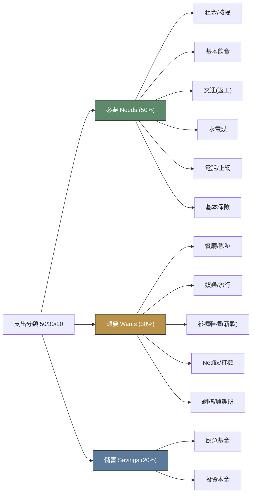

**必要 (Needs)** — 唔使就死/生活唔到嘅:
- 租金/按揭 (有瓦遮頭)
- 基本飲食 (唔會餓死)
- 交通 (返工)
- 水電煤
- 基本保險

**想要 (Wants)** — 唔使, 但用咗會開心:
- 餐廳食飯 (可以自己煮)
- 旅行
- 新款衫褲 (有衫著就得)
- Netflix, 遊戲
- 咖啡, 甜品

**儲蓄 (Savings)** — 將來嘅自己:
- 應急基金 (失業/急病用)
- 投資本金 (製造被動收入)

**重點**: 「必要」同「想要」嘅界線好模糊. 例如:
- 自己煮 vs 餐廳食 → 餐廳 = 想要
- 公共交通 vs 的士 → 的士 = 想要
- 月費 plan 50GB vs 5GB → 5GB 已經夠, 50GB = 想要

> **Think**: 試下將你過去一個月嘅支出分「必要」、「想要」、「儲蓄」三類。邊一類佔最多?
>
> *Answer: 大部分香港人「想要」佔比過高(40-60%), 因為網購、餐廳、娛樂好方便。理想比例: 必要 50%, 想要 30%, 儲蓄 20%。如果你想要 > 50%, 你嘅財務狀況可能會越嚟越緊。*

> **Cloze**: "支出分 {必要}、{想要} 同 {儲蓄} 三類, 50/30/20 規則建議比例係 {50/30/20}。"
>
> *Answer: 必要、想要、儲蓄、50/30/20*

### Section 3: 淨收入同現金流

**淨收入 (Net Income)** = 收入 - 支出

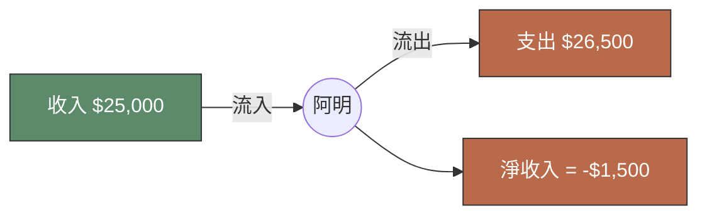

**現金流 (Cash Flow)** = 錢嘅流向:

- **正現金流 (Positive)**: 收入 > 支出, 每月有剩
- **負現金流 (Negative)**: 收入 < 支出, 每月要動用儲蓄/負債
- **打和 (Break-even)**: 收入 = 支出, 無剩無蝕

**點解現金流重要?**
- 正現金流 → 累積資產 → 製造被動收入
- 負現金流 → 累積負債 → 越嚟越窮, 最終破產

**阿明嘅問題**: 每月 -$1,500, 即係用緊儲蓄/信用卡填窟窿, 1 年就 -$18,000。如果唔改善, 儲蓄會清零, 之後就要負債。

> **Spot the Mistake**: 「我收入高過支出, 咁就 OK 啦。」
>
> 邊度錯?
>
> *Answer: 太樂觀。要睇吓「高幾多」。如果收入 $30,000, 支出 $29,500, 剩 $500 啱啱夠, 但儲蓄率得 1.7%, 應急能力好弱(失業 1 個月就歸 0)。正確做法: 收入 $30,000 嘅人, 儲蓄率應該至少 20% ($6,000), 即支出上限 $24,000。收入高唔等於財務健康, 重點係「儲蓄率」。*

### Section 4: 記帳 — 唔記就唔知

「唔記得使咗幾多」係香港人最常見嘅財務問題。**記帳 1 個月, 你就會發現自己使錢嘅 pattern**。

**最簡單記帳法 (5 分鐘/日)** — 用 markdown table 記低每日出入:

| 時間 | 類別 | 金額 | 備註 |
|---|---|---|---|
| 08:30 | 必要 | $35 | 早餐 |
| 13:00 | 必要 | $50 | 午餐 |
| 19:00 | 想要 | $250 | 朋友食飯 |
| 21:00 | 想要 | $180 | 網購襪 |
| **今日總計** | | **$515** | |

**每月尾計一次**:
- 必要: $X (目標 ≤ 50%)
- 想要: $Y (目標 ≤ 30%)
- 儲蓄: $Z (目標 ≥ 20%)
- 淨收入: $X + $Y + $Z - 收入

**香港常用記帳 App**:
- 銀包 App (内置記帳)
- MoneyWiz
- 坊間紙本 notebook

> **Cloze**: "記帳嘅目的係 {追蹤現金流, 搵出使錢 pattern}。"
>
> *Answer: 追蹤現金流, 搵出使錢 pattern*

> **Predict**: 你記帳 1 個月, 發現「想要」類支出佔 45%, 嚴重超標。你會點做?
>
> *Answer: 3 步: (1) 將「想要」入面非必要嘅 cut 咗(網購、訂閱), (2) 設定每月「想要」上限($X), (3) 將省返嘅錢撥入「儲蓄」。目標: 2-3 個月內將「想要」由 45% 降到 30% 或以下。*

---

### Why This Matters

收入 vs 支出, 表面睇好簡單, 但**大部分人從來冇認真計過**。Module 1 講「錢嘅本質」, 呢度講「你個人嘅現金流」 — 你控制唔到通脹, 控制唔到匯率, 但你控制到自己使幾多。

記帳係理財嘅第一步。冇記帳, 你做唔到預算(Module 4), 計唔到淨資產(後面 module), 都唔知道自己要幾多儲蓄先夠退休(Module 25)。

---

## Key Takeaways
- 收入分**主動**(打工)、**被動**(收租/股息)、**一次性**(賣樓)三類
- 支出分**必要**(租金/飲食)、**想要**(餐廳/娛樂)、**儲蓄**(應急/投資)三類
- **淨收入 = 收入 - 支出**, 正數有儲蓄, 負數動用儲蓄/負債
- 現金流方向決定財務健康: 正現金流累積資產, 負現金流累積負債
- **記帳 1 個月**就會發現自己使錢 pattern, 係所有理財嘅基礎
- 「收入高」唔等於「財務健康」, 重點係**儲蓄率**(理想 20%+)

---

## Common Misconception

**「記帳好煩, 我大概知自己使幾多就夠啦。」**

錯。認知偏誤 (Module 27 詳細講) 講過: **人對自己使錢嘅記憶, 永遠比實際少 30-50%**。你以為自己午餐使 $50, 實際平均 $80; 你以為自己網購每月 $500, 實際 $2,000。

記帳唔係為咗「知道自己使幾多」(你以為自己知), 係為咗「知道自己使**邊度**」(分項分析)。先有分項, 先有改善。

---

## Spot the Mistake

你阿明同你講:「我收入 $30,000, 儲蓄率 5% ($1,500/月), 算唔錯啦, 好多香港人儲蓄率仲低過我。」

邊度錯?

*Answer: 「比人地好」唔係標準, 係最低標準。儲蓄率 5% 即係一年只儲 $18,000, 失業 2 個月就歸 0。理想儲蓄率至少 20% ($6,000/月), 財務健康線。如果想早啲退休(Module 26 FIRE), 儲蓄率要到 50-70%。儲蓄率呢家嘢, 永遠係「愈多愈好」, 唔好同人比, 同自己嘅目標比。*

---

## Feynman Explain

(用一個 5 歲都識嘅比喻解釋「淨收入」: 媽媽每日俾你 $10 零用錢, 你買雪糕 $5, 儲落錢罌 $5。「淨收入 = 收入 - 支出 = $10 - $5 = $5」。如果你每日雪糕都食 $12, 即係「入不敷支」, 要問媽媽再俾, 最後媽媽會燥。試下用呢個比喻解釋俾小朋友聽。)

---

## Reframe

(試下諗: 你而家收入 vs 支出比例係點? 記帳 1 個月之後, 邊一類支出(必要/想要)佔比最高? 如果要將「想要」減 10%, 你會 cut 邊樣? 寫低你嘅諗法同 1 個實際行動 plan。)

---

## Drill
Take the quiz. MCQs test recall + application + scenario.

Run: `learn.sh quiz finance-basics-cantonese 2`
Run: `learn.sh cloze finance-basics-cantonese 2`

## Quiz: 02-income-vs-expense


### 以下邊項屬於「主動收入」?

[✓] a: 打工收月薪

[ ] b: 股票派息

[ ] c: 賣樓套現

[ ] d: 物業收租


**Answer:** a

主動收入係用時間/勞力換嘅錢, 打工係典型例子。物業收租同股票派息係被動收入, 賣樓係一次性收入。


### 以下邊項「唔係」被動收入?

[ ] a: 藍籌股每年派息

[ ] b: 自己開餐廳請人打理, 每月有 profit

[ ] c: 版稅/專利費

[✓] d: Bitcoin 升值 (你未賣)


**Answer:** d

Bitcoin 升值係資本增值 (Capital Gain), 唔賣就唔係 cash flow, 唔係「收入」。前 3 項都係定期有 cash 入口, 屬於被動收入嘅形式。


### 50/30/20 預算規則, 儲蓄應該佔幾多?

[✓] a: 20%

[ ] b: 30%

[ ] c: 50%

[ ] d: 10%


**Answer:** a

50/30/20 規則: 必要 50%, 想要 30%, 儲蓄/投資 20%。儲蓄 20% 係財務健康嘅最低線。


### 以下邊一項屬於「想要」支出?

[ ] a: 自己煮午餐

[✓] b: Netflix 月費

[ ] c: 返工車費

[ ] d: 租金


**Answer:** b

Netflix 係娛樂, 唔睇都唔會死, 屬於「想要」。租金同返工車費係必要, 自己煮午餐係必要(飲食)。


### 你阿明每月收入 $30,000, 支出 $32,000, 淨收入係幾多?

[ ] a: $2,000

[ ] b: $0

[✓] c: -$2,000

[ ] d: $30,000


**Answer:** c

淨收入 = 收入 - 支出 = 30,000 - 32,000 = -2,000。負數代表入不敷支, 要動用儲蓄或負債去填。


### 你收入 $40,000, 支出 $39,000, 每月儲 $1,000。儲蓄率係幾多?

[✓] a: 2.5%

[ ] b: 5%

[ ] c: 20%

[ ] d: 1%


**Answer:** a

儲蓄率 = 儲蓄 / 收入 = 1,000 / 40,000 = 2.5%。2.5% 儲蓄率太低, 失業 1 個月就歸 0, 唔健康。理想至少 20%。


### 點解「記帳」係理財嘅第一步?

[ ] a: 因為政府要求

[✓] b: 因為人對自己使錢嘅記憶永遠比實際少 30-50%, 要分項分析先知改善邊度

[ ] c: 因為會計師需要

[ ] d: 因為可以用嚟報稅


**Answer:** b

認知偏誤令你記錯自己使幾多。記帳目的唔係知道總額, 係分項(必要/想要/儲蓄), 先有改善方向。


### 以下邊個情況最危險?

[ ] a: 收入 $20,000, 支出 $20,000, 收支平衡

[ ] b: 收入 $50,000, 支出 $45,000, 儲蓄率 10%

[ ] c: 收入 $20,000, 支出 $18,000, 儲蓄率 10%

[✓] d: 收入 $50,000, 支出 $55,000, 負現金流


**Answer:** d

負現金流(支出 > 收入)係最危險, 會累積負債, 最終可能破產。A 雖然儲蓄率低但安全, B 一樣, D 雖冇儲但至少打和。C 持續落去會清晒儲蓄 → 負債 → 破產。


### 你阿明朋友話:「我份工交強積金, 所以我有儲蓄, 唔使另外再儲。」呢句話啱唔啱?

[ ] a: 啱, MPF 已經係儲蓄

[ ] b: 啱, 因為 MPF 投資股票, 會升值

[✓] c: 錯, MPF 係強迫性退休儲蓄, 65 歲先可以攞, 應急唔到, 需要額外儲蓄

[ ] d: 錯, 因為 MPF 一定蝕錢


**Answer:** c

MPF 係強迫性退休儲蓄, 65 歲先可以攞(最早), 中間鎖住。應急基金(3-6 個月支出)要另儲, 唔可以靠 MPF。MPF 投資回報亦唔保證, 視乎市況。


### 你記帳 1 個月, 發現「想要」支出佔 55%, 嚴重超標(目標 30%)。你會點做?

[ ] a: 接受現狀, 改變好難

[✓] b: 分階段減: 2-3 個月內由 55% 降到 30%, 將省返嘅撥入儲蓄

[ ] c: 加多份兼職, 唔 cut 支出

[ ] d: 即刻 cut 晒所有想要, 0%


**Answer:** b

分階段減最實際, 即刻 cut 0% 難持續, 加兼職治標不治本。C 平衡咗改善速度同可持續性。

---

# Module 03: 儲蓄同現金流

Est. study time: 1h
Language: yue
Description: 儲蓄定義、種類、應急錢、淨現金流 (income - expense - savings = 0 公式)、現金流健康指標

## Knowledge Map

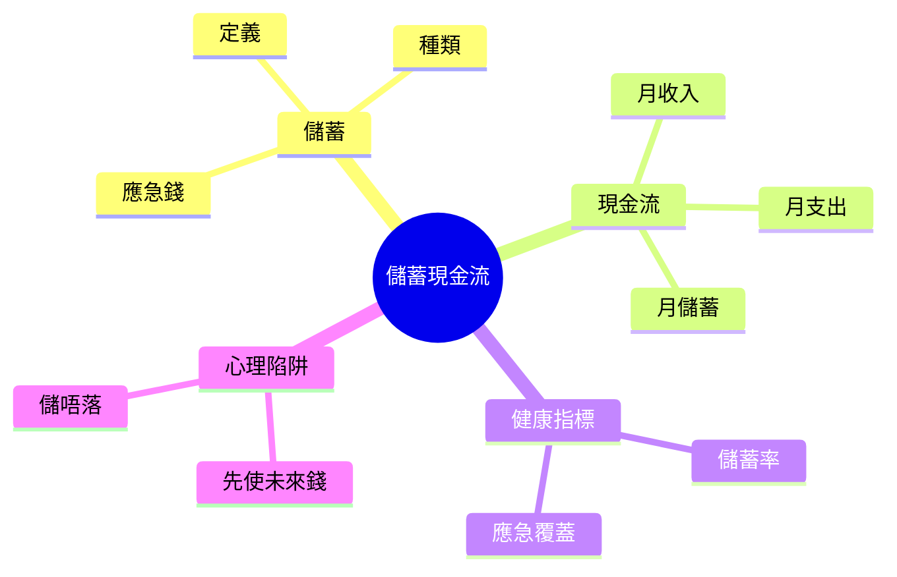

---

## Learning Objectives
- 解釋「儲蓄」嘅定義同點解佢係理財嘅第一步
- 分辨唔同種類嘅儲蓄 (短期/中期/長期/應急)
- 用「現金流公式」(收入 - 支出 = 儲蓄) 計自己嘅月度現金流
- 訂立「應急錢」目標 (3-6 個月支出)
- 識別儲蓄嘅常見心理陷阱 (先使未來錢、儲唔落)
- 用儲蓄率/應急覆蓋率呢啲指標自評現金流健康

---

## Real-World Example

你月入 $20,000, 每月使 $18,000, 月底剩低 $2,000。你將 $2,000 存入戶口, 覺得「有儲蓄喇」。

但有日公司裁員, 你失業, 搵新工要 3 個月。3 個月使 $54,000, 你只有 $2,000 × 6 個月 = $12,000 儲蓄。**6 個月後你已經破產**。

呢個就係「現金流」嘅問題: 你儲緊嘅速度, 夠唔夠 cover 突發事件。**儲蓄唔止係數字, 係時間**。

> **Think**: 你而家嘅儲蓄, 夠你「唔做嘢」生存幾耐?
>
> *Answer: 用 (儲蓄總額 ÷ 每月必要支出) 計。如果儲蓄 $50,000, 每月必要支出 $10,000, 答案係 5 個月。財務健康嘅成年人, 目標係 6 個月以上嘅覆蓋。*

---

## Core Content

### Section 1: 儲蓄嘅定義

「儲蓄」就係: **收入減去支出之後, 嗰筆你唔會即刻使嘅錢**。聽落簡單, 但「唔即刻使」呢個定義好重要。

**儲蓄 vs 投資嘅分別**:
- 儲蓄 = 安全、低回報、易攞 (戶口/定存)
- 投資 = 風險、中高回報、鎖住 (股票/基金)

**點解儲蓄係第一步**: 投資有可能輸, 儲蓄一定唔會輸 (假設你放喺受存款保障嘅戶口)。冇穩定儲蓄底, 投資輸少少你就破產。所以理財嘅金科玉律: **先儲蓄, 後投資**。

> **Cloze**: "儲蓄同投資嘅最大分別係 {風險}: 儲蓄 {一定唔會輸}, 投資 {可能輸}。所以理財次序係 {先儲蓄, 後投資}。"
>
> *Answer: 風險 / 一定唔會輸 / 可能輸 / 先儲蓄, 後投資*

### Section 2: 儲蓄嘅種類

唔同目標需要唔同儲蓄戶口, 唔好 all-in 一個:

| 種類 | 目標 | 期限 | 擺放工具 | 回報率 |
|---|---|---|---|---|
| 應急錢 | 失業/疾病/維修 | 即時攞到 | 活期戶口 | 0-1% |
| 短期目標 | 旅行/新手機 | 3-12 個月 | 短期定存/貨幣基金 | 1-3% |
| 中期目標 | 結婚/進修 | 1-3 年 | 中期定存/債劵 | 2-4% |
| 長期目標 | 退休/置業 | 5 年以上 | 投資戶口/股票 | 4-8% (有風險) |

**Why 分開**: 心理學叫「mental accounting」(心理賬戶)。分開戶口, 你唔會因為見到「旅行錢」就走去買 iPhone。**分戶口 = 自我控制工具**。

> **Think**: 點解「應急錢」要擺活期戶口(0-1% 回報), 唔擺去定存(3-5%) 多賺?
>
> *Answer: 因為「應急」嘅意思係要即刻攞到。定存提前攞會罰息(可能 0 利息)。活期戶口可以即時 ATM 攞, 唔影響回報。呢個 trade-off: 多 2-3% 回報 vs 失去靈活性, 應急錢要靈活性。*

### Section 3: 現金流公式 (Cash Flow)

現金流好簡單, 一條公式:

```
月儲蓄 = 月收入 - 月支出
```

呢個公式永遠成立。如果結果係正數, 你有儲蓄; 負數, 你負債。

**現金流流向圖**:

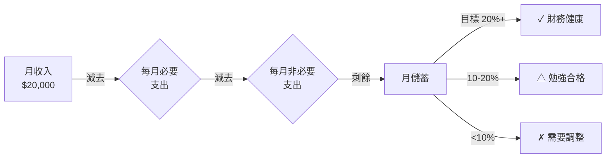

> **Spot the Mistake**: 「我每月儲$500, 雖然少但總好過冇, 財務好健康。」
>
> 邊度錯?
>
> *Answer: 「好健康」錯晒。財務健康睇嘅係「儲蓄率」(月儲蓄 ÷ 月收入), 唔係儲蓄金額。如果月入 $20,000 儲 $500, 儲蓄率只有 2.5%, 屬於「需要調整」級別。儲蓄率 20% 以上先算健康, 即係月入 $20,000 應該儲 $4,000+。金額少唔等於健康, 比例先係關鍵。*

### Section 4: 應急錢 (Emergency Fund)

應急錢係**最重要嘅儲蓄**, 冇之一。佢嘅目的: 失業/疾病/意外/屋頂爆呢啲突發事件, 你有 3-6 個月 buffer。

| 月必要支出 | 3 個月目標 | 6 個月目標 |
|---|---|---|
| $8,000 | $24,000 | $48,000 |
| $10,000 | $30,000 | $60,000 |
| $15,000 | $45,000 | $90,000 |
| $20,000 | $60,000 | $120,000 |

**Why 3-6 個月**: 統計顯示, 香港平均搵工時間 2-4 個月。3 個月太緊, 6 個月較安心。已婚/有仔女 → 6 個月; 單身/雙薪 → 3 個月 OK。

> **Predict**: 你月必要支出 $12,000, 儲蓄有 $36,000。失業, 預期搵工 3 個月, 你夠 cover 嗎? 點解?
>
> *Answer: 剛剛夠 cover (36,000 ÷ 12,000 = 3 個月)。但「剛剛夠」係危險狀態, 因為搵工時間可能延遲 (生病/競爭大)。建議目標 $72,000 (6 個月), 畀自己 buffer。*

---

### Why This Matters

儲蓄同現金流係所有理財嘅基礎。冇儲蓄, 你做唔到以下任何一項:
- 投資 (冇 buffer 輸少少就破產)
- 退休 (冇儲蓄就靠 MPF 強制供款, 唔夠)
- 應急 (失業/疾病/意外)

儲蓄率 20%+ 嘅人, 退休時至少有 20× 年支出 嘅資產。儲蓄率 < 10% 嘅人, 退休時要靠政府/仔女, 失去自主。

---

## Key Takeaways
- 儲蓄 = 收入 - 支出後, 唔即刻使嘅錢
- 儲蓄係理財第一步, 先儲蓄後投資
- 分戶口 = 心理賬戶工具, 避免一筆錢洗晒
- 應急錢 3-6 個月必要支出, 擺活期戶口
- 儲蓄率 = 月儲蓄 ÷ 月收入, 目標 20%+
- 現金流公式永遠成立: 收入 - 支出 = 儲蓄

---

## Common Misconception

**「儲蓄 = 慳錢 = 蝕底」**

錯。儲蓄唔係叫你唔使錢, 係叫你「先 pay 自己」, 每月固定將部分收入存入獨立戶口, 然後用剩低嘅使。「先 pay 自己」嘅好處: 你唔使每次諗「應唔應該儲」, 因為自動化了。慳錢 (痛苦) vs 先 pay 自己 (輕鬆) — 後者更容易持續。

---

## Spot the Mistake

你阿明同你講:「我月入 $30,000, 我覺得自己儲蓄做得唔錯, 因為我每月都儲 $3,000, 即 10% 啦。我已經有 $50,000 應急錢, 夠喇。」

邊度錯?

**Answer**: 兩件事要拆開睇。第一, 儲蓄率 10% 屬於「勉強合格」, 唔係「唔錯」, 健康水平要 20%+。第二, 應急錢目標應該係 3-6 個月「必要支出」, 唔係一個固定金額。如果阿明每月必要支出 $15,000, 3 個月目標 $45,000, 6 個月目標 $90,000。佢得 $50,000, 對單身 OK 但對有家庭嘅人唔夠。**金額少, 相對收入同支出嘅比例先係健康指標**。

---

## Feynman Explain

(用 5 歲都明嘅語言解釋「點解大人要儲錢」。提示: 從「你有冇試過想買玩具但錢唔夠」講起, 帶到「大人儲錢, 將來可以買更大嘅嘢, 或者有意外時有得用」。唔好提「複利」、「通脹」、「投資」呢啲 jargon。)

---

## Reframe

(試下諗: 如果你下個月突然失業, 你嘅儲蓄夠你生存幾耐? 寫低呢個數字, 然後諗: 「我願意接受呢個 risk 嗎? 如果唔願意, 我下個月可以點做?」)

---

## Drill
Take the quiz. MCQs test recall + application + scenario.

Run: `learn.sh quiz finance-basics-cantonese 3`
Run: `learn.sh cloze finance-basics-cantonese 3`

## Quiz: 03-savings-cashflow


### 現金流嘅核心公式係咩?

[ ] a: 投資回報 = 本金 × 利率

[ ] b: 通脹 = 物價升幅

[ ] c: 資產 = 負債 + 權益

[✓] d: 月儲蓄 = 月收入 - 月支出


**Answer:** d

現金流公式: 月儲蓄 = 月收入 - 月支出。永遠成立。正數代表有儲蓄, 負數代表負債。Option a 係會計公式, c 係投資公式, d 係通脹公式, 都唔係現金流。


### 點解理財嘅第一步係「先儲蓄, 後投資」?

[ ] a: 因為投資回報一定高過儲蓄

[ ] b: 因為儲蓄回報比投資高

[✓] c: 因為投資有風險, 冇儲蓄底輸少少就破產; 儲蓄一定唔會輸

[ ] d: 因為政府規定要先儲蓄後投資


**Answer:** c

儲蓄放喺受存款保障嘅戶口一定唔會輸; 投資有可能輸晒。如果冇穩定儲蓄底, 投資市場跌 20% 你就被迫止損賣資產, 反而蝕底。所以先儲蓄, 後投資, 等儲蓄夠 cover 風險先開始投資。


### 「應急錢」應該擺喺邊種工具?

[ ] a: 定期存款 (高利息)

[✓] b: 活期戶口 (即時攞到)

[ ] c: 加密貨幣 (高回報)

[ ] d: 股票戶口 (高回報)


**Answer:** b

應急錢嘅核心係「即刻攞到」。活期戶口可以 ATM 即時提款; 定期存款提前攞會罰息(可能 0 利息); 股票/加密貨幣蝕價風險高, 應急時可能被迫賤賣。Trade-off: 放棄 2-3% 高回報, 換取靈活性, 值得。


### 應急錢目標一般係幾多個月必要支出?

[ ] a: 12 個月以上

[ ] b: 24 個月以上

[ ] c: 1 個月

[✓] d: 3-6 個月


**Answer:** d

統計上香港平均搵工時間 2-4 個月。3 個月太緊, 6 個月較安心。目標: 單身/雙薪 3 個月; 已婚/有仔女 6 個月。12+ 個月會 over-saved, 失去投資機會成本。


### 你月入 $25,000, 月儲蓄 $5,000, 儲蓄率係幾多? 健康嗎?

[✓] a: 20%, 健康

[ ] b: 10%, 需要調整

[ ] c: 5%, 不健康

[ ] d: 50%, 過度儲蓄


**Answer:** a

儲蓄率 = 5,000 ÷ 25,000 = 20%。20% 屬於健康水平, 可以開始考慮投資。10% 勉強合格, < 10% 需要調整, > 30% 過度儲蓄(失去投資機會)。


### 點解儲蓄要「分戶口」, 唔好 all-in 一個?

[ ] a: 因為一個戶口有存款上限

[ ] b: 因為政府規定要分戶口

[✓] c: 因為分戶口可避免「心理賬戶」混淆, 旅行錢唔會被當應急錢使咗

[ ] d: 因為分戶口有稅務優惠


**Answer:** c

心理學叫「mental accounting」(心理賬戶)。分開戶口, 旅行錢、應急錢、退休錢分開擺, 唔會因為見到「旅行錢」就走去買 iPhone, 違反原意。分戶口係自我控制工具, 唔係法律或稅務要求。


### 你月必要支出 $12,000, 想 6 個月應急錢, 目標金額係幾多?

[✓] a: $72,000

[ ] b: $144,000

[ ] c: $24,000

[ ] d: $36,000


**Answer:** a

12,000 × 6 = 72,000。Option a 係 2 個月, b 係 3 個月, d 係 12 個月。應急錢計法: 月必要支出 × 目標月數。


### 你儲蓄率長期 < 10%, 最應該做嘅嘢係?

[✓] a: 重新審視必要支出, 削減非必要開支; 同時增加收入來源

[ ] b: 借錢先使未來錢

[ ] c: 買保險就算

[ ] d: 即刻開投資戶口搏高回報


**Answer:** a

儲蓄率 < 10% 代表現金流唔健康, 唔可以靠投資補救 (投資輸咗會更差)。正確做法: 1) 審視支出, 削減非必要 (例如訂閱服務/外賣); 2) 增加收入 (加班/兼職/技能提升)。儲蓄率回到 20% 先考慮投資。Option a 會放大風險, c 會陷入債務陷阱, d 解決唔到根本問題。


### 「先 pay 自己」嘅儲蓄策略, 點解比「慳錢」更容易持續?

[ ] a: 因為慳錢係法律要求, 先 pay 自己係自願

[✓] b: 因為先 pay 自己將儲蓄自動化, 唔使每次諗「應唔應該儲」

[ ] c: 因為先 pay 自己有利息回報

[ ] d: 因為慳錢會影響信用評分


**Answer:** b

「先 pay 自己」意思係每月出糧後即時將部分 (例如 20%) 自動轉去獨立儲蓄戶口, 然後用剩低嘅使。呢個方法將儲蓄變成自動化習慣, 唔使每月掙扎「應唔應該儲」。研究顯示自動化儲蓄嘅人儲蓄率持續高 2-3 倍。


### 你阿明儲蓄率 5%, 應急錢 1 個月, 月儲 $1,500。佢下個月失業, 最可能發生咩事?

[ ] a: 佢可以用儲蓄過渡, 3 個月搵到新工

[✓] b: 佢要靠信用卡/私人貸款過渡, 1 個月內破產風險高

[ ] c: 佢可以即刻賣股票套現

[ ] d: 佢可以向政府申請失業救濟金即時 cover


**Answer:** b

儲蓄率 5% 偏低, 應急錢 1 個月太短。失業後 1 個月就會用晒儲蓄, 餘下要靠借貸度日, 容易陷入債務陷阱。Solution: 先增加儲蓄率到 20%, 應急錢累積到 3-6 個月, 先係穩健狀態。Option c 假設佢有股票, d 失業救濟審批需時, 唔即時。

---

# Module 04: 預算: 50/30/20 規則

Est. study time: 1h
Language: yue
Description: 預算定義、50/30/20 規則、needs vs wants 分類、零基預算、實際追蹤方法

## Knowledge Map

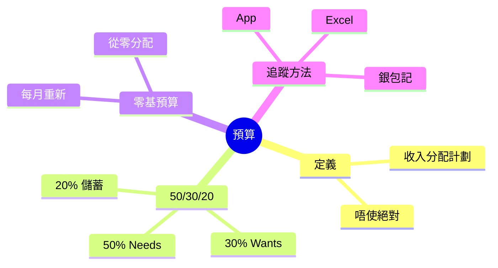

---

## Learning Objectives
- 解釋「預算」嘅定義, 釐清「預算 = 限制使錢」嘅常見誤解
- 應用 50/30/20 規則到自己嘅收入
- 分辨 needs 同 wants 嘅分別, 避免分類錯誤
- 比較 50/30/20 同零基預算兩種方法
- 用 App/Excel/銀包 3 種方法追蹤實際支出
- 識破預算常見失敗原因 (太嚴、唔實、跟唔到)

---

## Real-World Example

你月入 $25,000, 從來冇做過預算。月底檢查戶口, 永遠得 $3,000-$5,000。你諗:「我啲錢去晒邊?」

你打開信用卡月結單, 見到:
- 超市 $4,500 (必要)
- 午餐外賣 $3,800 (重複)
- Netflix + Spotify + YouTube Premium $380 (訂閱)
- 周末 shopping $2,500 (使咗)
- 朋友飯局 $1,800
- 雜項 $2,200

**全部唔記得自己使過咗咁多**。呢個就係冇預算嘅後果: 收入流入, 流出無蹤, 月底永遠 surprise。

預算唔係叫你慳, 係幫你**清楚睇到自己嘅錢去咗邊**。

> **Think**: 你估自己一個月使幾多錢? 同實際使幾多, 差距幾多?
>
> *Answer: 大部分人高估自己嘅「必要支出」30-50%, 低估非必要支出。預算嘅第一個 action 唔係 cut, 係「記低一個月」, 等你知道真相。真相係改變嘅起點。*

---

## Core Content

### Section 1: 預算嘅定義同誤解

**預算** = 將月收入預先分配去唔同類別嘅支出, 等月底唔會 surprise。常見誤解:

| 誤解 | 真相 |
|---|---|
| 預算 = 慳錢 | 預算 = 知道錢去咗邊, 唔一定要 cut |
| 預算 = 嚴格限制 | 預算可以容許非必要支出 (30% 畀 wants) |
| 預算 = 完美執行 | 預算係計劃, 月底偏差 10% 都算成功 |
| 預算 = 收入高先有用 | 低收入更需要預算 (1 蚊都要分配) |

> **Cloze**: "預算唔係 {慳錢}, 係 {知道錢去咗邊}, 唔一定要 cut。"
>
> *Answer: 慳錢、知道錢去咗邊*

### Section 2: 50/30/20 規則

哈佛教授 Elizabeth Warren 提出嘅簡單預算法:

| 類別 | 比例 | 例子 |
|---|---|---|
| **Needs** (必要) | 50% | 住屋/食物/交通/保險/必要醫療 |
| **Wants** (想要) | 30% | 外食/旅行/訂閱/娛樂/新衫 |
| **儲蓄** | 20% | 應急錢/投資/退休/還債 |

**你月入 $25,000 嘅分配**:
- Needs: $12,500 (住屋 $7,000 + 食物 $3,000 + 交通 $1,500 + 保險 $500 + 醫療 $500)
- Wants: $7,500 (外食 $2,500 + 訂閱 $500 + 娛樂 $1,500 + 旅行儲備 $3,000)
- 儲蓄: $5,000 (應急錢 $3,000 + 投資 $1,500 + 退休 $500)

**關鍵**: 50/30/20 係**後調整, 唔係死規則**。如果你住屋已經 60% 收入, 即係租太貴/收入太低, 需要先解決住屋, 唔係死跟 50%。

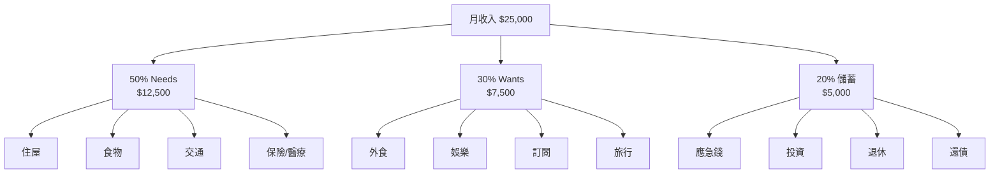

> **Think**: 點解儲蓄歸類做 20% 但實際操作上儲蓄要排最優先 (即 pay 自己)?
>
> *Answer: 50/30/20 講嘅係「分配目標」, 但執行上要「先 pay 自己」 — 即出糧後即時將 20% 自動轉去儲蓄戶口, 然後先分配剩低 80%。咁先確保儲蓄一定做到, 而非「用到最後先儲 (通常儲唔落)」。*

### Section 3: Needs vs Wants 分類

最容易搞錯嘅位。**真正必要**只佔生活一部分:

| 真正 Needs (50%) | 容易混淆但係 Wants |
|---|---|
| 住屋租金/按揭 | 大屋 (3000 呎) |
| 必要食物 (煮飯) | 高級超市/有機食品 |
| 公共交通 | 名牌車/Uber 黑禮賓 |
| 必要醫療/保險 | 健身房/按摩 |
| 必要衣服 (返工) | 設計師品牌 |
| 必要電話月費 ($50) | 5G 無限 plan ($200) |

**判斷方法**: 「如果唔使呢樣嘢, 我嘅生活會唔會即刻出問題?」會 = Need; 唔會 = Want。

**Common mistake**: 「我需要 Starbucks 咖啡返工」— 唔需要, 你需要係咖啡因, 茶/即溶都可以。
「我需要架車返工」— 如果有地鐵/巴士, 唔需要, 係 want。

> **Spot the Mistake**: 「我月入 $20,000, 跟 50/30/20 分配: Needs $10,000, Wants $6,000, 儲蓄 $4,000。但我住屋 $9,000, 必要食物 $4,000, 必要交通 $2,000, total $15,000。跟唔到, 所以 50/30/20 唔啱我。」
>
> 邊度錯?
>
> *Answer: 兩件事混淆咗。第一, 你嘅 actual needs $15,000, 即 75% 收入, 已經遠超 50% 目標。呢個唔係「50/30/20 唔啱你」, 係「你嘅 needs 超支, 要調整」: 1) 搬屋減租; 2) 改煮飯減食物開支; 3) 改用公共交通。50/30/20 唔係死規則, 係 reference。當 actual 偏離 50/30/20 太多, 即係生活成本過高, 要解決 root cause。*

### Section 4: 零基預算 (Zero-Based Budget)

另一個熱門方法: 每月由零開始分配, 收入 - 所有支出 = 0。

**做法**:
1. 列今個月所有預期支出 (rent/食物/交通/訂閱/儲蓄/旅行/朋友飯局...)
2. 將收入分到每一項, 直到分晒 = 0
3. 月中如有意外支出, 從 wants 類別調配

**Vs 50/30/20**:

| 比較 | 50/30/20 | 零基預算 |
|---|---|---|
| 規則 | 固定比例 | 每月自訂 |
| 適合 | 入門, 懶人 | 想仔細控制, 願意花時間 |
| 失敗率 | 中 (因為有彈性) | 高 (太仔細易放棄) |
| 預估時間 | 5 分鐘 | 30-60 分鐘 |

**我推薦**: 大部分人由 50/30/20 開始, 掌握後再考慮零基。

> **Predict**: 你試零基預算, 第一個月做得幾好 (偏差 5%), 第二個月開始懶, 第三個月放棄。點解會咁?
>
> *Answer: 零基預算需要每月 30-60 分鐘, 對大部分人嚟講太花時間。第二個月開始有其他事 (加班/朋友), 冇時間 update, 就開始甩。第三個月索性放棄。**人嘅意志力有限, 自動化 + 簡單規則先可持續**。50/30/20 只需 5 分鐘, 配合自動轉賬, 失敗率低好多。*

### Section 5: 追蹤方法

預算要執行, 就要追蹤。3 個方法:

| 方法 | 優點 | 缺點 | 適合 |
|---|---|---|---|
| **App** (e.g. MoneyHero / Moneez / Wallet) | 自動分類, 圖表 | 私隱問題, 學習成本 | 願意裝 app 嘅人 |
| **Excel/Google Sheets** | 完全自訂, 免費 | 要手動輸入 | 中度投入 |
| **銀包記** (傳統筆紙) | 零成本, 簡單 | 易遺失, 唔齊全 | 入門 |

**最低門檻方法**: 信用卡月結單 + 簡單 spreadsheet。月結單已分類好大部分, 你只需 add 幾個關鍵字 (e.g. 「外食/訂閱」) 同計總和。

> **Cloze**: "預算追蹤嘅最低門檻方法係 {信用卡月結單} + 簡單 {spreadsheet}。"
>
> *Answer: 信用卡月結單、spreadsheet*

---

### Why This Matters

冇預算, 你永遠係「出糧 → 使晒 → 月底 surprise」嘅循環。預算唔係限制, 係**自主權**: 你決定錢去邊, 而非由外賣 app / 訂閱服務決定。

研究顯示, 寫低預算嘅人儲蓄率高 2-3 倍。即使只跟 50/30/20 一個月, 你已經會發現「我以為嘅必要支出 vs 真正必要支出」嘅差距, 呢個差距就係改變嘅起點。

---

## Key Takeaways
- 預算 = 預先分配收入, 唔係限制使錢
- 50/30/20: 50% Needs + 30% Wants + 20% 儲蓄
- Needs vs Wants: 「冇咗會唔會即刻出問題?」會 = Need
- 50/30/20 係 reference, 唔係死規則
- 儲蓄要「先 pay 自己」, 自動轉賬
- 零基預算仔細但花時間, 失敗率高
- 追蹤最低門檻: 信用卡月結單 + spreadsheet

---

## Common Misconception

**「預算會令我冇晒樂趣」**

錯。50/30/20 預留咗 30% 畀 wants (外食/旅行/娛樂), 即係月入 $25,000 嘅人有 $7,500 自由使。呢個金額比「冇預算, 月底 surprise」嘅人實際花費更多, 因為有預算嘅人會諗清楚「$7,500 想點使」, 唔會被動回應「$380 訂閱服務自動 renew」。預算令樂趣更自覺, 唔係消除樂趣。

---

## Spot the Mistake

你朋友阿明同你講:「我跟 50/30/20, 儲蓄率 20% ($5,000), 已經好完美啦, 唔使再諗點儲多啲。」

邊度錯?

*Answer: 50/30/20 係入門 baseline, 唔係終點線。20% 儲蓄率對大部分人 OK, 但如果你目標係 30 歲退休 (FIRE), 50%+ 儲蓄率先可能。預算係工具, 目標決定儲蓄率: 提早退休 → 50%+; 一般舒適 → 20-30%; 起步期 → 10-20% (要進步)。阿明講「好完美」係停滯嘅心態, 應該每年 review 自己嘅財務目標, 調整儲蓄率。*

---

## Feynman Explain

(用一個 10 歲都明嘅故事解釋 50/30/20。提示: 用「零用錢」做例子, 「如果阿爸畀你 $100 零用錢, 你點分? $50 買必須嘅(午餐/文具), $30 買想要嘅(玩具/零食), $20 儲起 (將來買大嘅嘢)」。咁就係 50/30/20 嘅精神。)

---

## Reframe

(試下做一個月嘅「現金流日記」: 每日用銀包 / App / 紙記低你使咗咩 (最少記 1 個 keyword 同金額)。月底合計, 同你估嘅差距幾多? 呢個差距, 就係預算嘅空間。)

---

## Drill
Take the quiz. MCQs test recall + application + scenario.

Run: `learn.sh quiz finance-basics-cantonese 4`
Run: `learn.sh cloze finance-basics-cantonese 4`

## Quiz: 04-budget-50-30-20


### 50/30/20 規則嘅 3 個類別係咩?

[ ] a: 現金/股票/債券

[ ] b: 必要/想要/投資

[ ] c: 住屋/食物/儲蓄

[✓] d: 50% Needs + 30% Wants + 20% 儲蓄


**Answer:** d

哈佛教授 Elizabeth Warren 提出嘅 50/30/20 規則: 50% 必要支出 (Needs), 30% 想要支出 (Wants), 20% 儲蓄/還債。其他選項唔係呢個規則。


### 「預算」最常見嘅誤解係咩?

[ ] a: 預算一定令你慳到好多錢

[ ] b: 預算係會計師先識做嘅嘢

[ ] c: 預算係有錢人先需要嘅

[✓] d: 預算係限制使錢, 等於冇樂趣


**Answer:** d

預算 = 知道錢去咗邊, 唔係限制使錢。50/30/20 預留 30% 畀 wants (外食/旅行/娛樂), 即係自由使嘅錢。低/中/高收入都應該做預算。


### 點分辨 Needs 同 Wants?

[ ] a: 貴嘅係 Wants, 平嘅係 Needs

[✓] b: 「冇咗會唔會即刻出問題?」會 = Need, 唔會 = Want

[ ] c: 必需品 = Needs, 奢侈品 = Wants

[ ] d: 老人家嗰啲 = Needs, 年青人嗰啲 = Wants


**Answer:** b

判斷方法: 「如果唔使呢樣嘢, 我嘅生活會唔會即刻出問題?」會 = Need; 唔會 = Want。Example: 「我需要 Starbucks 返工」— 唔係, 你需要咖啡因, 茶可以代。Common trap: 用「必需品 vs 奢侈品」會混淆 (e.g. 貴但必要嘅醫療)。


### 你月入 $30,000, 跟 50/30/20, 儲蓄金額應該幾多?

[ ] a: $3,000

[✓] b: $6,000

[ ] c: $9,000

[ ] d: $15,000


**Answer:** b

30,000 × 20% = 6,000。Option a 係 10%, c 係 30% (Wants), d 係 50% (Needs)。


### 「先 pay 自己」嘅意思係?

[✓] a: 出糧後即時將儲蓄部分自動轉去獨立戶口, 然後先使剩低

[ ] b: 先處理自己嘅慾望

[ ] c: 先交稅

[ ] d: 先買自己鍾意嘅嘢


**Answer:** a

「先 pay 自己」意思係每月出糧後即時將部分 (例如 20%) 自動轉去獨立儲蓄戶口, 然後用剩低嘅使。呢個方法將儲蓄自動化, 確保儲蓄一定做到, 唔係「用到最後先儲 (通常儲唔落)」。


### 你月入 $20,000, 跟 50/30/20 發現 Needs 已經 75% ($15,000)。你應該?

[✓] a: 調整 root cause: 搬屋減租 / 改煮飯 / 改公共交通, 等 needs 回到 50% 範圍

[ ] b: 即刻借貸填補缺口

[ ] c: 放棄 50/30/20, 因為唔啱你

[ ] d: 削減 wants 同儲蓄去平衡


**Answer:** a

50/30/20 係 reference, 唔係死規則。當 actual needs 75%, 反映生活成本過高, 要解決 root cause (搬屋/煮飯/交通), 而非放棄規則。Option c 係逃避, b 會陷入債務, d 會令儲蓄受壓。


### 零基預算 vs 50/30/20, 以下邊個正確?

[ ] a: 零基預算適合懶人

[ ] b: 零基預算失敗率低, 因為更仔細

[✓] c: 50/30/20 失敗率低, 因為簡單 + 可自動化

[ ] d: 兩者失敗率一樣


**Answer:** c

50/30/20 只需 5 分鐘計劃, 配合自動轉賬, 失敗率低。零基預算每月 30-60 分鐘, 太花時間, 失敗率高。預算法則: 自動化 + 簡單先可持續。


### 預算追蹤嘅最低門檻方法係?

[ ] a: 請會計師每月 review

[✓] b: 信用卡月結單 + 簡單 spreadsheet

[ ] c: 每日 ATM 提款睇戶口

[ ] d: 裝 3 個理財 App 自動追蹤


**Answer:** b

信用卡月結單已分類好大部分支出, 你只需 add 幾個關鍵字 (e.g. 「外食/訂閱」) 同計總和。最低成本、最低學習成本、適合大部分人。Option a 太貴, c 太隨意, d 要學埋幾個 App。


### 預算嘅 30% Wants 包括以下邊啲?

[✓] a: 外食、旅行、訂閱服務、娛樂、新衫

[ ] b: 應急錢、投資、退休

[ ] c: 信用卡還款、貸款、利息

[ ] d: 住屋租金、食物、交通


**Answer:** a

Wants 30% 包括: 外食、旅行、訂閱 (Netflix/Spotify)、娛樂 (戲/酒吧)、新衫/化妝品等「想要」但非必要嘅嘢。Option b 係儲蓄, c 係還債, d 係 Needs。


### 你跟 50/30/20 兩個月, 發現儲蓄做到 20% 但每個月都「恰好」用晒 wants 30%, 一蚊都冇剩。最可能嘅原因?

[ ] a: 你應該停咗預算

[ ] b: 你太成功, 預算完美

[✓] c: 你嘅 Wants 預算太少, 應調整 25/35/20 或加儲蓄目標

[ ] d: 你應該增加 wants 到 40%


**Answer:** c

「恰好用晒 wants 30%」反映 wants 預算太緊, 容易超支。應根據自己 lifestyle 調整, 例如 25% Needs (住屋高) + 35% Wants + 20% 儲蓄 + 20% 其他。預算係 reference, 唔係死規則, 要根據實際彈性調整。Option a 係放棄, b 誤判形勢, d 會犧牲儲蓄。

---

# Module 05: 銀行戶口: 往來/儲蓄/定期

Est. study time: 1h
Language: yue
Description: 香港銀行戶口種類、活期 vs 儲蓄 vs 定期、利息計算、選擇策略

## Knowledge Map

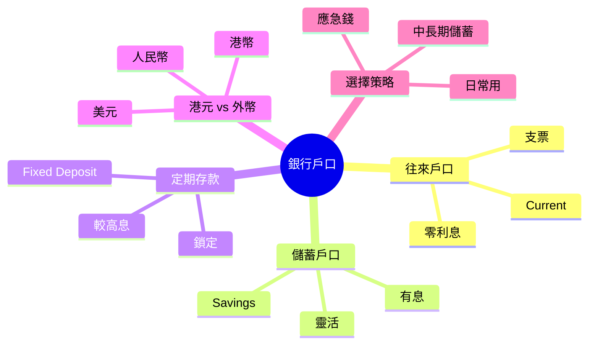

---

## Learning Objectives
- 區分香港常見銀行戶口種類 (往來/儲蓄/定期)
- 比較三者嘅利率、流動性、最低存款要求
- 解釋活期/定期/儲蓄利息點樣計算
- 識揀適合自己嘅戶口組合
- 解開「外幣戶口值唔值開」嘅疑問
- 避免常見戶口陷阱 (最低存款罰款/隱藏費用)

---

## Real-World Example

你 22 歲大學畢業, 第一份工, 第一次開銀行戶口。Sales 姐姐問你:「開邊種?」

- 往來戶口 (Current) — 處理日常 (出糧/八達通自動增值/繳費)
- 儲蓄戶口 (Savings) — 放儲蓄, 拎少少利息
- 定期存款 (Fixed Deposit) — 鎖住一段時間, 較高利息
- 外幣戶口 (Multi-Currency) — 放 USD/CNY, 投資/旅行用

你:「吓? 我得 $50,000 儲蓄, 要開咁多?」

現實係: 大部分人只需**1 個往來 + 1 個儲蓄**就夠, 定期/外幣係後續升級選項。但如果你唔知分別, 可能:
- 將所有錢放喺往來戶口 → 零利息 → 通脹蠶食購買力
- 將應急錢鎖定期 → 急用時罰息/取唔到
- 開咗外幣戶口但唔識匯率 → 蝕匯率差

呢個 module 幫你做「**識揀, 唔使多**」。

> **Think**: 你估香港一般儲蓄戶口年利率幾多?
>
> *Answer: 大部分銀行 0.01% - 0.5% (視乎銀行/戶口類型)。2024 年部分 virtual bank (e.g. ZA Bank, WeLab) 推廣期有 2-3% 但通常限時 + 限額。記住: 港元定存利率聯繫匯率跟美息, 2022-2023 美息高峰時部分銀行定存 4-5%。但 2024 開始減息, 港元定存回落。對一般人嚟講, 銀行利息唔係「投資」, 係「保本」。*

---

## Core Content

### Section 1: 銀行戶口 4 種基本類型

香港零售銀行主要提供 4 種戶口:

| 類型 | 用途 | 利率 | 流動性 | 最低結餘 |
|---|---|---|---|---|
| **往來戶口** (Current) | 日常收支 (糧/繳費/ATM) | 接近 0% | 即時 | 視乎銀行 ($0-10,000) |
| **儲蓄戶口** (Savings) | 短期儲蓄, 有少少息 | 0.01% - 1% | 即時 | 通常 $0 |
| **定期存款** (Fixed Deposit) | 中長期鎖定儲蓄 | 較高 (2-5% 視乎期) | 鎖定 (到期先攞) | 通常 $10,000+ |
| **外幣戶口** (Multi-Currency) | 持有外幣 (USD/CNY/JPY) | 視乎幣種 | 即時兌換 | 視乎銀行 |

**最常見組合**: 1 個往來 (日常) + 1 個儲蓄 (應急錢) + (optional) 1 個定期 (目標儲蓄)

> **Cloze**: "香港一般零售銀行主要提供 4 種戶口: {往來}、{儲蓄}、{定期}、{外幣}。"
>
> *Answer: 往來、儲蓄、定期、外幣*

### Section 2: 活期 vs 定期 利息

| 特性 | 活期 (往來/儲蓄) | 定期 (Fixed Deposit) |
|---|---|---|
| 利率 | 0.01% - 1% (低) | 2-5% (較高, 視乎期/銀行) |
| 提取 | 即時 (T+0) | 鎖定, 提前取要罰息 (可能 0 利息) |
| 最低存款 | 較低 ($0-10,000) | 較高 ($10,000+) |
| 通脹對沖 | 差 (追唔上通脹) | 較好 (短期內跑贏通脹) |

**例子** (以港元定存 3 個月, 4% 年利率計):
- 本金: $100,000
- 到期利息: $100,000 × 4% × (3/12) = $1,000
- 即係 3 個月拎 $1,000 利息 (未扣行政費)

**真實陷阱**: 很多銀行對「非活躍戶口」收取費用 (e.g. 月結餘低於 $5,000 收 $50/月)。要睇清楚 fee schedule。

> **Think**: 如果你儲蓄 $200,000, 應該全部放定存?
>
> *Answer: 唔應該。應該 split: 6 個月生活費 (約 $60,000) 放儲蓄戶口 (應急錢), 剩低 $140,000 拆做 3-6 個月定存 (到期 renew)。咁既保流動性 (急用攞到), 又拎較高息。全部鎖定定期 = 急用時冇錢 / 被罰息。*

### Section 3: 外幣戶口值唔值開?

外幣戶口 (Multi-Currency Account) 可以存 USD/CNY/JPY 等, 主要 3 個用途:

| 用途 | 例子 | 注意 |
|---|---|---|
| 投資 | 買美股/港股以外市場 | 匯率風險 |
| 旅行 | 去日本前換 JPY | 留意找換店 vs 銀行差價 |
| 對沖 | 分散單一貨幣風險 | 適合高資產人士 |

**新手建議**: 未做過投資/未去旅行前, **唔使開外幣戶口**。大部分港元定存 + 信用卡外幣功能已夠用。

**匯率隱藏成本**: 銀行買入/賣出價差 (Spread) 通常 0.5-1.5%, 即換 $10,000 USD 蝕 $50-150。找換店通常較平, 但要小心假鈔。

> **Predict**: 如果下個月港元減息 0.5%, 你嘅定存到期後續做, 利率會升定跌?
>
> *Answer: 跌。減息 = 銀行借貸成本降, 連帶存款利率都降。如果你有定存到期要 renew, 會以新利率計, 較之前低。相反, 如果加息, 续存會高過之前。所以: 減息周期 = 鎖短啲 (3 個月), 加息周期 = 鎖長啲 (12 個月) 鎖住高息。*

> **Spot the Mistake**: 「我準備去日本旅行, 銀行換 $30,000 HKD 換 JPY 比較安全, 因為銀行有牌。」
>
> 邊度錯?
>
> *Answer: 銀行有牌係事實, 但唔代表「最平」。找換店 (尤其旺角/中環) 通常 spread 較窄 (0.2-0.5%), 比銀行 (0.5-1.5%) 平。即係換 $30,000 HKD 銀行可能蝕 $150-450, 找換店蝕 $60-150。差異 $90-300, 夠食幾餐拉麵。建議: 先 compare 銀行同找換店, 用計算機計下真實 cost, 唔好假設「銀行最安全 = 最平」。*

### Section 4: 揀邊間銀行 + 戶口種類

香港主要銀行分 3 類:

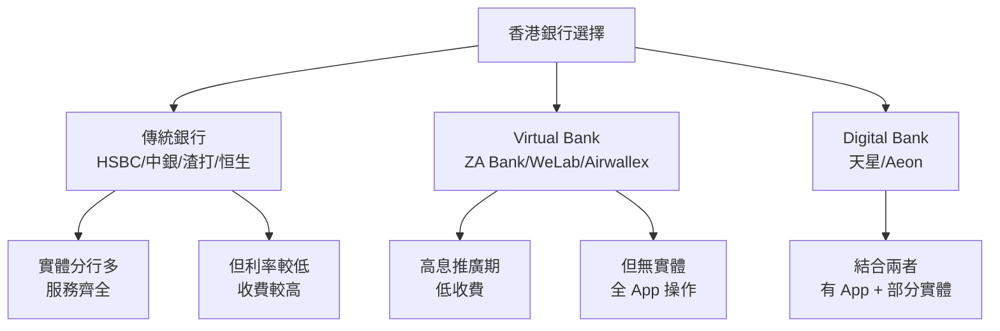

**揀銀行 3 個考慮**:
1. **你嘅日常需要**: ATM 分行多唔多? 跨行轉帳使唔使錢?
2. **利率**: 定存利率 + 儲蓄利率
3. **優惠**: 開戶獎賞 (e.g. $200 cash coupon) + 推薦人獎賞

**新手推薦**:
- 傳統銀行 1 個 (返工常用, 提款方便)
- Virtual Bank 1 個 (高息儲蓄戶口, 應急錢放呢度)
- 唔使開第 3 個 (管理成本太高)

> **Cloze**: "新手揀銀行嘅建議: 傳統銀行 {1 個} + Virtual Bank {1 個} 就夠, 唔使開第 3 個。"
>
> *Answer: 1 個、1 個*

### Section 5: 戶口管理最佳實踐

**4 個原則**:

1. **自動轉賬**: 應急錢戶口設定每月自動由往來轉賬 (e.g. 出糧後即轉 20% 到儲蓄戶口)
2. **定期 review**: 每季 check 一次各戶口結餘, 調整比例
3. **唔好太多戶口**: 超過 4 個 (1 往來 + 1 儲蓄 + 1 定期 + 1 virtual) 難管理
4. **小心最低結餘罰款**: 部分銀行對「非活躍戶口」或「低結餘戶口」收費

**應急錢存放**: 放儲蓄戶口 (即時攞到), 唔好放定期 (急用要罰息)。

**目標儲蓄** (旅行/置業): 放定期較高息, 拆做幾份 (3 個月 / 6 個月 / 1 年) 避免全部同時到期。

> **Cloze**: "應急錢應該放 {儲蓄戶口} (即時攞到), 唔好放 {定期} (急用要罰息)。"
>
> *Answer: 儲蓄戶口、定期*

---

### Why This Matters

銀行戶口係你每日用嘅基礎工具, 但好少人主動去理解「我啲錢喺度拎幾多息」、「邊隻戶口最適合我」。結果:
- 應急錢放往來戶口 → 零利息
- 目標儲蓄放儲蓄 → 浪費定存高息
- 開咗外幣戶口但唔用 → 浪費管理

一個 30 歲打工仔, 假設平均戶口結餘 $100,000, 由 0.1% (儲蓄) 升到 3% (定存), 一年差 $2,900, 即係一個月一餐好嘅。**少少調整, 持續拎多。**

---

## Key Takeaways
- 香港銀行 4 種戶口: 往來/儲蓄/定期/外幣
- 往來零息但流動性高; 儲蓄少少息; 定期高息但鎖定
- 外幣戶口對新手非必要
- 應急錢放儲蓄 (即時攞), 目標儲蓄放定存 (高息)
- 唔好開超過 4 個戶口
- 自動轉賬 + 定期 review
- 找換店通常比銀行平, 旅行換錢要 compare

---

## Common Misconception

**「所有銀行都一樣, 揀最方便就得」**

錯。銀行之間差異可以好大: 1) 利率 (定存差 1-2% 年利率係常事); 2) 收費 (跨行轉帳 $0 vs $15); 3) 優惠 (新客 $200 cash coupon); 4) 服務 (實體 vs 全 App)。**唔好懶, 花 30 分鐘 compare 一次, 一年慳幾千蚊**。特別係有大額儲蓄 (>$100,000) 嘅人, 利率差異顯著。

---

## Spot the Mistake

你朋友阿明同你講:「我將所有儲蓄 $500,000 全部做 12 個月定存 4% 年利率, 一年拎 $20,000 息, 完美!」

邊度錯?

*Answer: 三個問題。1) **冇應急錢**: $500,000 全部鎖定, 急用時要提前取, 罰息 (可能 0 息) 或贖回費用。應保留 6 個月生活費 ($60,000-$100,000) 喺儲蓄戶口。2) **冇分散**: 全部 12 個月同期到期, 到時要一次處理, 麻煩。應拆做 3/6/12 個月, 每月有部分到期, 方便調整。3) **再投資風險**: 12 個月內如果減息, 到期 renew 利率會低過 4%, 損失後續 12 個月利息。應拆短啲, 靈活 renew。阿明嘅 strategy 短期睇高息, 長期睇鎖死 + 冇彈性, 唔係「完美」, 係「危險」。*

---

## Feynman Explain

(用一個 5 歲都明嘅故事解釋 3 種戶口。提示: 用「錢包 vs 豬仔錢罌 vs 定期存款箱」做類比。錢包 = 往來 (即拎即用, 冇息); 豬仔錢罌 = 儲蓄 (日日拎, 有少少息); 定期存款箱 = 鎖住一段時間, 較多息, 急開要扣。咁就係活期 vs 定期。)

---

## Reframe

(寫低你現有嘅銀行戶口: 邊間? 邊種? 結餘幾多? 利率幾多? 有冇最低結餘罰款? 然後諗: 1) 應急錢夠唔夠 6 個月生活費? 2) 目標儲蓄放咗邊度? 3) 開咗但冇用嘅戶口要唔要閂? 寫低你嘅 plan。)

---

## Drill
Take the quiz. MCQs test recall + application + scenario.

Run: `learn.sh quiz finance-basics-cantonese 5`
Run: `learn.sh cloze finance-basics-cantonese 5`

## Quiz: 05-bank-accounts


### 香港零售銀行主要提供邊 4 種基本戶口?

[ ] a: 現金、支票、信用卡、八達通

[ ] b: 基本、進階、VIP、私人銀行

[ ] c: 個人、家庭、公司、聯名

[✓] d: 往來、儲蓄、定期、外幣


**Answer:** d

香港零售銀行主要 4 種: 往來戶口 (Current, 日常用)、儲蓄戶口 (Savings, 短期儲蓄)、定期存款 (Fixed Deposit, 鎖定高息)、外幣戶口 (Multi-Currency, 持有外幣)。其他選項係銀行產品/客戶類型, 唔係戶口種類。


### 港元定存 3 個月, 4% 年利率, 本金 $100,000, 到期利息幾多?

[✓] a: $1,000

[ ] b: $3,000

[ ] c: $400

[ ] d: $4,000


**Answer:** a

利息 = 本金 × 年利率 × (期/月數) = $100,000 × 4% × (3/12) = $1,000。記住公式: 利息 = 本金 × 利率 × 時間。3 個月即係 1/4 年, 所以係 4% × 1/4 = 1% 嘅本金, 即 $1,000。


### 如果你有 $200,000 儲蓄, 應該點分配?

[ ] a: 全部放 12 個月定存, 拎最多息

[✓] b: 6 個月生活費放儲蓄, 剩低拆短中期定存

[ ] c: 全部放外幣戶口, 對沖風險

[ ] d: 全部放往來戶口, 靈活


**Answer:** b

正確: 保留流動性 (應急錢放儲蓄, 即時攞到) + 拎較高息 (定存) + 分散到期日 (拆 3/6/12 個月, 唔好全部同期)。全部往來 = 零息, 全部長定存 = 急用被罰, 全部外幣 = 對新手風險過高。


### 應急錢應該放邊種戶口?

[ ] a: 外幣戶口 (匯率風險)

[ ] b: 往來戶口 (即時用, 但零息)

[✓] c: 儲蓄戶口 (即時攞, 有少少息)

[ ] d: 12 個月定存 (高息但鎖定)


**Answer:** c

應急錢 3 個條件: 1) 即時攞到 (急用唔等); 2) 安全 (唔輸本金); 3) 多少少息。儲蓄戶口符合晒。往來零息, 定存鎖定 (急用要罰息), 外幣有匯率風險。標準建議: 6 個月生活費放儲蓄戶口。


### 外幣戶口對新手嘅主要用途係乜?

[ ] a: 保本儲蓄 (比 HKD 戶口安全)

[✓] b: 投資 (買美股) / 旅行 (換 JPY) / 對沖 (分散貨幣風險)

[ ] c: 避稅 (外幣收入唔使報稅)

[ ] d: ATM 提款 (跨國 ATM 提款方便)


**Answer:** b

外幣戶口主要 3 用途: 投資 (買海外股票/基金)、旅行 (出發前換晒)、對沖 (高資產人士分散風險)。對新手嚟講, 冇呢啲需要就唔使開, 因為有匯率風險 + 找換店通常比銀行平。


### 找換店同銀行換外幣, 一般邊個 spread (買入賣出差) 較平?

[ ] a: 兩者完全一樣

[ ] b: 視乎當日匯率, 冇定律

[ ] c: 銀行一定平, 因為有牌

[✓] d: 找換店通常較平, 視乎地點


**Answer:** d

找換店 (尤其旺角/中環) 通常 spread 較窄 (0.2-0.5%), 銀行 spread 通常 0.5-1.5%。但找換店要小心假鈔 + 計準手續費。建議: 換大額 ($30,000+) 前先 compare 兩者, 用計算機計真實 cost。


### 你準備去日本旅行, 換 $30,000 HKD 做 JPY, 點換最化算?

[ ] a: 去 ATM 提款, 一定最平

[✓] b: 先 compare 銀行同找換店 spread, 計埋手續費, 揀平嘅

[ ] c: 用信用卡, 一定免手續費

[ ] d: 直接去銀行, 因為銀行有牌最安全


**Answer:** b

冇單一答案, 要視乎當日匯率 + 銀行/找換店政策。實用做法: 出發前 1-2 星期 compare 銀行同 2-3 間找換店, 用計算機計真實 cost (包括手續費), 揀最平。ATM (海外) 可能有海外手續費 + DCC 陷阱。信用卡 (海外) 通常 1-2% 手續費。講「最平一定係 X」係講大話, 實事求係先 compare。


### 如果你將所有儲蓄 $500,000 做 12 個月定存, 最大風險係乜?

[✓] a: 急用錢時要罰息或贖回, 冇流動性

[ ] b: 通脹令實際回報變負

[ ] c: 政府會抽走部分本金

[ ] d: 銀行倒閉, 全部輸晒


**Answer:** a

香港有存款保障計劃 (每位存款人每銀行 $500,000 保障), 所以銀行倒閉風險低 (但要留意 500K 上限)。最大風險係「冇流動性」: 12 個月內急用, 提前贖回可能 0 息 + 行政費。通脹係真實風險但長期先顯著。拆短中期 + 保留應急錢先穩陣。


### Virtual Bank (e.g. ZA Bank) 同傳統銀行 (HSBC/中銀) 嘅主要分別係乜?

[ ] a: Virtual Bank 唔可以做定存

[ ] b: Virtual Bank 一定高息過傳統銀行

[✓] c: Virtual Bank 冇實體分行, 全 App 操作, 通常推廣期利率較高

[ ] d: Virtual Bank 唔受金管局監管


**Answer:** c

Virtual Bank 一樣受金管局發牌同監管, 一樣有存款保障。分別係: 1) 冇實體分行, 全部 App 操作; 2) 通常用較高息做推廣 (ZA Bank 開戶期高息); 3) 收費結構唔同 (跨行轉帳可能 $0)。但推廣期過後利率會回落到市場水平, 唔好假設「永遠高息」。


### 你每月出糧 $20,000, 想自動儲蓄 20% ($4,000), 點做最穩陣?

[✓] a: 設定自動轉賬: 出糧當日由往來自動轉 $4,000 到儲蓄戶口

[ ] b: 用信用卡儲里數代替現金儲蓄

[ ] c: 將糧直接存入儲蓄戶口 (往來戶口放零)

[ ] d: 每月手動轉賬到儲蓄戶口


**Answer:** a

自動轉賬係「Pay Yourself First」嘅核心做法: 出糧當日自動 split 20% 去儲蓄, 剩低先用。好處: 1) 唔使記得; 2) 唔會使凸; 3) 強迫儲蓄。手動轉賬 = 容易忘記/諗多咗就唔轉。信用卡里數唔係儲蓄。糧直入儲蓄 = 日常支付唔方便。

---

# Module 06: 利息(上): 單利同複利

Est. study time: 1h
Language: yue
Description: 利息基本概念、單利公式、複利公式、單 vs 複比較、複利滾存視覺化

## Knowledge Map

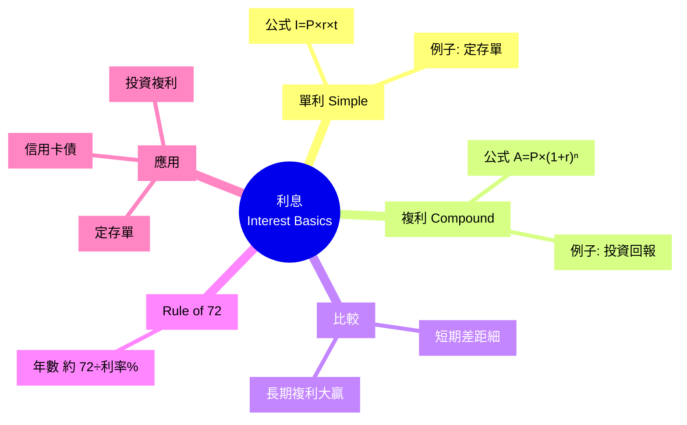

---

## Learning Objectives
- 解釋利息嘅本質 (借用錢嘅成本)
- 寫出單利公式 + 計單利例子
- 寫出複利公式 + 計複利例子
- 用數字比較單利 vs 複利 10/20/30 年差異
- 用 Rule of 72 心算本金翻倍時間
- 識別日常生活入面邊啲用單利, 邊啲用複利

---

## Real-World Example

2020 年 1 月, 阿明同阿華都拎 $100,000 出嚟, 分別用兩種方法處理:

**阿明** — 揀咗 5 年定存, 每年 4% **單利**。佢以為「穩陣」, 每年拎 $4,000 利息, 拎完擺入自己袋。

**阿華** — 揀咗 5 年定存滾存, 每年 4% **複利**。佢唔拎利息出嚟, 全部自動滾入本金再賺息。

5 年後 (2025 年 1 月):

- 阿明戶口: $100,000 本金 + $4,000 × 5 年 = **$120,000** (拎走晒)
- 阿華戶口: $100,000 × (1 + 4%)^5 = **$121,665** (冇拎走任何利息)

表面睇, 阿明同阿華差 $1,665 (1.4%)。好似唔大?

但如果將場景拉長, 假設阿明年年照樣拎 $4,000 出嚟使咗佢 (拎走咗嘅利息唔會自己生息, 本金一直得返 $100,000), 而阿華繼續複利滾存:

20 年後:
- 阿明: $100,000 本金 + $4,000 × 20 年 = **$180,000**
- 阿華: $100,000 × (1.04)^20 = **$219,112**
- 差距 $39,112 (阿華多 22%)

30 年後 (e.g. 25 歲開始, 55 歲先攞):
- 阿明: $100,000 本金 + $4,000 × 30 年 = **$220,000**
- 阿華: $100,000 × (1.04)^30 = **$324,340**
- 差距 $104,340 (阿華多 47%)!

差距由 5 年嘅 $1,665 爆到 30 年嘅 $104,000 — 呢個就係複利嘅威力: **時間越長, 威力越大**。拎走利息 = 殺死複利。

> **Think**: 點解單利同複利短期差距細, 長期差距大?
>
> *Answer: 因為複利嘅「利叠利」效應需要時間累積。第 1 年, 兩者一樣。第 2 年, 複利開始多賺 4% × 第 1 年利息 = 幾蚊。第 10 年, 已經差幾百蚊。到第 30 年, 差幾萬蚊。呢個就係「**複利曲線**」嘅特徵: 早期平, 後期指數爆發。相傳愛因斯坦講過: "Compound interest is the eighth wonder of the world." (呢句係咪真係佢講, 其實冇人肯定。)*

---

## Core Content

### Section 1: 利息嘅本質

利息 = 借用錢嘅成本 (對 borrower) 或 借出錢嘅回報 (對 lender)。

兩個基本變數:
- **本金** (Principal, P) — 借出/借入嘅錢
- **利率** (Interest Rate, r) — 通常以年利率 (Annual Percentage Rate, APR) 表達

第 3 個變數:
- **時間** (Time, t) — 通常以年計

利息分兩種:
- **單利** (Simple Interest) — 只用本金計息, 利息唔再賺息
- **複利** (Compound Interest) — 利息加回本金, 一齊再賺息

> **Cloze**: "利息分兩種: {單利} (只計本金) 同 {複利} (本金+利息再賺息)。"
>
> *Answer: 單利、複利*

### Section 2: 單利公式

單利公式:

```
單利總額 = P × r × t
```

**變數解釋**:
- P = 本金 (Principal)
- r = 年利率 (Annual rate, 小數, e.g. 4% = 0.04)
- t = 年數 (Time in years)

**例子 1**: 本金 $100,000, 利率 4%, 5 年
```
單利總額 = 100000 × 0.04 × 5
        = 100000 × 0.20
        = $20,000

到期總額 = 100000 + 20000 = $120,000
```

**例子 2**: 本金 $50,000, 利率 3.5%, 3 年
```
單利總額 = 50000 × 0.035 × 3
        = 50000 × 0.105
        = $5,250

到期總額 = 50000 + 5250 = $55,250
```

**單利常見應用**:
- 香港大部分銀行定存 (到期才計複利, 中間唔滾)
- 部分政府債券 (T-Bill)
- 私人貸款 (按月平息)

> **Spot the Mistake**: 「我攞 $100,000 做 3 年定存 4% 年利率單利, 第 2 年我會拎 $4,000 利息, 第 3 年又會拎 $4,000 利息, 3 年共 $12,000。」
>
> 邊度錯?
>
> *Answer: 計錯晒。單利係「本金 × 利率 × 時間」, 唔係「每年拎本金 × 利率」。3 年單利 = $100,000 × 4% × 3 = $12,000, 呢個啱。但你每年拎 $4,000 然後擺自己袋, 之後就唔再計息 (因為本金返咗 $100,000)。如果唔拎出嚟, 全部滾入第 2 年, 變咗複利, 第 2 年計 $104,000 × 4% = $4,160, 第 3 年再計 $108,160 × 4% = $4,326, 共 $12,486。單 vs 複差 $486 喺 3 年內, 但 30 年會差幾萬。記住: 拎走 = 單利效果; 唔拎 + 滾存 = 複利效果。*

### Section 3: 複利公式

複利公式:

```
複利總額 = P × (1 + r/n)^(n × t)
```

**進階變數**:
- n = 每年計息次數 (e.g. 1 = 年, 12 = 月, 365 = 日)

**最常見 (n=1, 每年計一次)**:
```
複利總額 = P × (1 + r)^t
```

**例子 1**: 本金 $100,000, 利率 4%, 5 年, 每年計息 (n=1)
```
複利總額 = 100000 × (1 + 0.04)^5
        = 100000 × 1.2166529
        = $121,665

利息 = 121665 - 100000 = $21,665
```

**例子 2**: 本金 $50,000, 利率 3.5%, 3 年, 每月計息 (n=12)
```
複利總額 = 50000 × (1 + 0.035/12)^(12 × 3)
        = 50000 × (1.0029167)^36
        = 50000 × 1.11055
        = $55,527

利息 = 55527 - 50000 = $5,527
```

**對比 例子 2 (單利 $5,250 vs 複利 $5,527)**: 3 年差 $277 (5.3%), 唔算大。

但 30 年就完全唔同: 假設本金 $50,000, 3.5% 複利
```
複利總額 = 50000 × (1.035)^30
        = 50000 × 2.8068
        = $140,340
```

30 年複利 = $90,340 利息, 對比單利 $52,500 利息, 差 $37,840 (72%)! **時間放大複利效應**。

> **Predict**: 你有 $10,000, 想 10 年後變 $20,000。需要年利率幾多? 用單利 vs 複利計, 邊個高啲?
>
> *Answer: 單利: $20,000 = $10,000 + $10,000 × r × 10 → r = 10% (需要 10% 年利率)。複利: $20,000 = $10,000 × (1+r)^10 → r = 7.18% (需要 7.18% 年利率)。**複利低 2.82% 已經達標**, 因為「利叠利」效應。所以: 想達到同樣終值, 複利需要嘅利率較低 = 較易達成。呢個就係退休規劃嘅核心: 早啲開始, 利率可以較低都夠。*

### Section 4: Rule of 72 — 心算翻倍時間

**Rule of 72** 係一個實用估算:

```
本金翻倍年數 ≈ 72 / 年利率(%)
```

**例子**:
- 利率 4%: 72 / 4 = **18 年** 本金翻倍
- 利率 6%: 72 / 6 = **12 年** 翻倍
- 利率 8%: 72 / 8 = **9 年** 翻倍
- 利率 12%: 72 / 12 = **6 年** 翻倍

**應用**: 假設你 25 歲有 $100,000, 投資回報 6% 年利率:
- 37 歲 ($200K), 49 歲 ($400K), 61 歲 ($800K) → 退休時

**Rule of 72 局限**: 只適合 5-12% 利率範圍, 太高/太低會有 ±10% 誤差。但作為心算工具, 已經好夠用。

> **Cloze**: "Rule of 72 公式: 本金翻倍年數 ≈ {72 / 年利率(%)}, 適合 {5-12%} 利率範圍。"
>
> *Answer: 72 / 年利率(%)、5-12%*

### Section 5: 視覺化複利滾存 — 30 年比較

阿明 (單利) vs 阿華 (複利) 30 年, 假設本金 $100,000, 利率 4%:

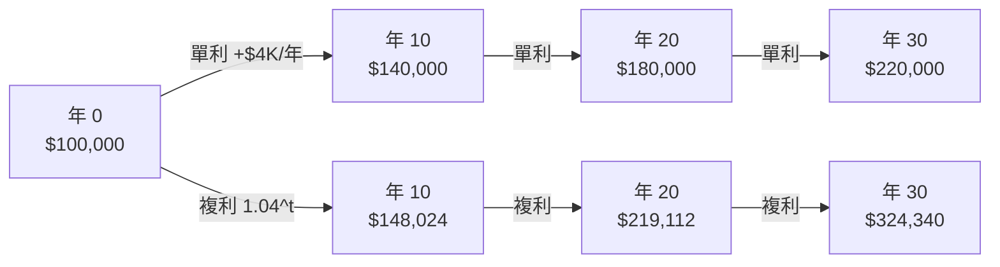

**關鍵觀察**:
- 年 10: 差距 $8K (5.7%)
- 年 20: 差距 $39K (22%)
- 年 30: 差距 $104K (47%)

**30 年複利威力**: 阿華多賺 $104,340, 夠買一部中型車 + 旅行。

> **Cloze**: "30 年後阿明 (單利) 有 $220,000, 阿華 (複利) 有 $324,340, 差距 $104,340, 反映 {時間放大複利效應}。"
>
> *Answer: 時間放大複利效應*

---

### Why This Matters

複利係**最有錢嘅普通人 (non-wealthy)** 唯一能夠追上 wealth gap 嘅工具。

- 巴菲特 (Warren Buffett) 99% 財富係 50 歲後賺嘅, 因為複利滾存
- 普通人 25 歲開始每月儲 $3,000 (8% 年回報), 65 歲退休有 ~$10.5M
- 普通人 35 歲先開始同樣儲蓄, 65 歲只有 ~$4.5M

**差 10 年, 終值差 2.3 倍**。所以: 越早開始, 複利幫你越多。

---

## Key Takeaways
- 利息分單利 (只計本金) 同複利 (本金+利息再賺息)
- 單利公式: P × r × t
- 複利公式: P × (1+r)^t (年計息) 或 P × (1+r/n)^(n×t) (多次計息)
- 短期 (1-3 年) 單 vs 複差距小, 長期 (20-30 年) 差距大
- Rule of 72: 本金翻倍年數 ≈ 72 / 利率(%)
- 越早開始儲蓄, 複利威力越大
- 定存常用單利 (拎走), 投資/退休用複利 (滾存)

---

## Common Misconception

**「利率低就無必要計, 反正賺唔到幾多」**

錯晒。1% 同 4% 看似差 3%, 30 年後差 100%! 例子: $100,000 本金, 30 年後:
- 1% 年利率: $134,785
- 4% 年利率: $324,340
- 差 $189,555 (1.41 倍)

所以: **任何正回報都比零好, 時間越長差越大**。即使只係 1% 嘅高息戶口, 30 年都跑贏 0% 嘅往來戶口。**唔好睇小「低回報 + 長時間」嘅威力**。

---

## Spot the Mistake

你朋友阿明同你講:「我啱啱做咗 1 年定存 $50,000, 4% 利率, 到期拎 $2,000 利息。下年我再做 1 年定存, 咪又係拎 $2,000 利息, 永遠都係 $2,000 啦, 複利根本幫唔到我。」

邊度錯?

*Answer: 錯晒, 佢將「每年拎走嘅利息」當成「複利無用」嘅證據。事實係: 1) 佢每年拎走 $2,000, 變咗「單利」效果 (本金永遠 $50,000, 永遠拎 $2,000)。2) 如果佢唔拎走, 滾入本金, 第 2 年本金變 $52,000, 計 $52,000 × 4% = $2,080 利息。第 3 年本金 $54,080, 利息 $2,163。30 年後, 單利累計拎 $60,000 (本金唔變, 拎 $2,000×30), 複利累計 $112,000 (本金加到 $162,000)。差 $52,000 (87% 增長)。複利嘅威力唔係「每年利息變多」咁簡單, 係「**本金同利息一齊滾**」嘅效果。拎走 = 殺死複利; 唔拎 = 養大複利。*

---

## Feynman Explain

(用 5 歲都明嘅故事解釋複利。提示: 用「雪球滾落山」做類比。雪球開始細 (本金), 滾落時黏雪變大 (利息加本金再賺息), 越滾越快 (複利加速), 落山底已經變大雪球 (長期累積)。唔好講數字, 用畫/動作表達。)

---

## Reframe

(寫低你現有嘅儲蓄/投資: 1) 邊啲用單利 (e.g. 定存)? 2) 邊啲用複利 (e.g. 投資戶口)? 3) 你有冇攞走啲利息 (殺死複利) 或者滾存 (養大複利)? 4) 你嘅 Rule of 72 翻倍時間係幾耐? 寫低你嘅 plan 同目標。)

---

## Drill
Take the quiz. MCQs test calculation + comparison + scenario.

Run: `learn.sh quiz finance-basics-cantonese 6`
Run: `learn.sh cloze finance-basics-cantonese 6`

## Quiz: 06-interest-upper


### 單利公式係乜?

[ ] a: P × (1 + r)^t

[ ] b: P × (1 + r/n)^(n × t)

[ ] c: P / (r × t)

[✓] d: P × r × t (本金 × 利率 × 時間)


**Answer:** d

單利公式: 利息 = 本金 (P) × 年利率 (r) × 年數 (t)。注意: 利率要用小數 (4% = 0.04), 時間要用年。b 同 c 係複利公式。


### 本金 $100,000, 利率 4%, 5 年單利, 利息幾多?

[ ] a: $121,665

[ ] b: $4,000

[✓] c: $20,000

[ ] d: $21,665


**Answer:** c

單利 = $100,000 × 0.04 × 5 = $20,000。b 係 1 年嘅利息, a 係複利 5 年嘅總額, d 係複利 5 年嘅利息。


### 本金 $100,000, 利率 4%, 5 年複利 (年計息), 總額幾多?

[ ] a: $120,000

[✓] b: $121,665

[ ] c: $108,000

[ ] d: $140,000


**Answer:** b

複利 = $100,000 × (1 + 0.04)^5 = $100,000 × 1.21665 = $121,665。a 係單利總額, c 係簡單加 8%, d 係 10 年單利嘅終值 (用錯計法)。


### 本金 $50,000, 利率 3.5%, 30 年複利, 終值大約幾多?

[✓] a: $140,000

[ ] b: $200,000

[ ] c: $52,500

[ ] d: $105,000


**Answer:** a

複利終值 = $50,000 × (1.035)^30 = $50,000 × 2.8068 ≈ $140,340。c 係單利利息 (冇滾存), b 係本金翻倍 (約 20 年就達到, 30 年複利會再多), d 係估算過高。記住: 30 年複利 ≈ 本金 × 2.81 (對 3.5%)。


### Rule of 72 嘅作用係乜?

[✓] a: 心算本金翻倍需要嘅年數, 公式: 72 / 年利率(%)

[ ] b: 計算複利嘅稅後回報

[ ] c: 預測股票價格

[ ] d: 計算單利總額


**Answer:** a

Rule of 72 係一個實用估算: 本金翻倍年數 ≈ 72 / 年利率(%)。例如 6% 利率 → 約 12 年翻倍。局限: 5-12% 利率範圍最準, 太高/太低有 ±10% 誤差。


### 如果你想 10 年後將 $10,000 變 $20,000, 用複利需要年利率大約幾多?

[ ] a: 10%

[✓] b: 7.18%

[ ] c: 5%

[ ] d: 20%


**Answer:** b

用複利公式: $20,000 = $10,000 × (1+r)^10 → (1+r)^10 = 2 → 1+r = 2^(1/10) = 1.0718 → r = 7.18%。用單利需要 10% (計: $10,000 + $10,000 × r × 10 = $20,000 → r = 10%)。複利低 2.82% 已經達標, 證明複利威力。


### 以下邊個情境用複利?

[✓] a: 信用卡欠款 $10,000, 年利率 30%, 月結複利

[ ] b: 私人貸款, 按月平息還款

[ ] c: 政府 T-Bill, 到期一次過還本付息

[ ] d: 香港銀行 1 年定存, 到期拎晒利息


**Answer:** a

信用卡係典型複利: 結餘每日計息, 月結複利, 所以卡數越滾越大。b 係平息 (近似單利), c 係到期一次過計息, d 拎走利息 = 單利效果。記住: 借貸複利對你有害 (卡數), 投資複利對你有利 (投資/退休)。


### 30 年後, $100,000 本金用 4% 單利 vs 4% 複利 (年滾存), 終值差距大約幾多?

[ ] a: $20,000 (10%)

[✓] b: $100,000 (45%)

[ ] c: $200,000 (90%)

[ ] d: $0 (一樣)


**Answer:** b

單利 30 年: $100,000 × 4% × 30 = $120,000 利息, 終值 $220,000。複利 30 年: $100,000 × (1.04)^30 = $324,340。差 $324,340 - $220,000 = $104,340, 約 47% 差距。30 年時間放大複利效應, 接近翻倍。


### 點解越早開始儲蓄, 退休時資產越多?

[ ] a: 因為年輕人風險承受力高, 投資回報較好

[ ] b: 因為年輕人投資知識較多

[✓] c: 因為複利需要時間累積, 越早開始, 滾存年期越長

[ ] d: 因為年輕時負擔較少, 可以儲更多


**Answer:** c

複利嘅核心係「時間」。差 10 年開始儲蓄, 假設同樣月供 $3,000 同 8% 年回報, 25 歲開始 65 歲有 ~$10.5M, 35 歲開始只有 ~$4.5M。差 10 年, 終值差 2.3 倍。唔係年輕人特別聰明/儲得多, 純粹係時間畀複利滾。**時間係複利嘅朋友, 越長越幫你**。


### 你每月用信用卡簽 $5,000, 年利率 30% 月結複利, 1 年後如果完全冇還, 卡數大約幾多?

[ ] a: $10,000 (本金翻倍)

[ ] b: $5,000 (本金)

[ ] c: $5,344 (月息 0.6%, 1 年)

[✓] d: $6,500 (月息 2.5%, 1 年)


**Answer:** d

信用卡年利率 30% → 月利率 30% ÷ 12 = 2.5%。月結複利 1 年: $5,000 × (1 + 0.025)^12 = $5,000 × 1.3449 ≈ $6,724, 最接近 d 嘅 $6,500。記住: 卡數唔還 = 30% 年利率複利, 一年後本 + 息已經滾大約 34%。 **卡數係普通人最大嘅財務陷阱**。

---

# Module 07: 利息(下): APR、APY 同實際利率

Est. study time: 1h
Language: yue
Description: 點解「2% 月息」聽落平, 實際年利率係 26.8%。APR 同 APY 分別, EAR 計算, 同連續複利嘅極限

## Knowledge Map

```mermaid
mindmap
  root(("利息下<br/>APR vs APY"))
    名義vs實質["名義 vs 實質"]
      概念1["名義 Nominal<br/>= 印出嚟嘅利率"]
      概念2["實質 Effective<br/>= 真實回報率"]
      概念3["複利次數愈多<br/>實質愈高"]
    APR["APR<br/>Annual Percentage Rate"]
      def1["包括手續費嘅<br/>名義年利率"]
      def2["借貸用<br/>唔複利"]
      ex1["信用卡 APR 36%<br/>唔代表 36 倍"]
    APY["APY<br/>Annual Percentage Yield"]
      def3["包含複利嘅<br/>實質年回報率"]
      def4["存款用<br/>真實回報"]
      ex2["$10000 放 1 年<br/>APY 5% = $10500"]
    EAR["EAR<br/>Effective Annual Rate"]
      公式4["公式<br/>1+APR/nⁿ - 1"]
      月複["月複利<br/>n=12"]
      日複["日複利<br/>n=365"]
    連續複利["連續複利"]
      公式5["公式<br/>A=P×eʳᵗ"]
      e值["e 約 2.71828"]
      應用["理論上限<br/>現實少用"]
    應用比較["應用"]
      借貸["借貸睇 APR<br/>越低越好"]
      存款["存款睇 APY<br/>越高越好"]
      比較["比較唔同產品<br/>用同一個率"]
```

---

## Learning Objectives
- 講出 APR 同 APY 嘅分別, 知道邊個會用邊個
- 用 EAR 公式計實際年回報率
- 解釋「2% 月息」點樣變成 26.8% 年利率
- 寫出連續複利公式, 解 e 嘅意義
- 比較唔同複利頻率, 揀最啱嘅借貸/存款產品

---

## Real-World Example

阿明想碌卡, 見到信用卡廣告寫「**2% 月息**」, 諗: 2% × 12 = 24%, 都仲可接受啦。即刻申請, 碌 $10000 買新電腦。

一年後, 阿明睇月結單: 總利息 = $2686! **$10000 借 1 年變 $12686, 實際利率 26.86%**, 唔係 24% 喎。

點解? 因為「2% 月息」嘅利息**每月加入本金再計息**(複利)。第一個月利息 $200, 第二個月 $200 + $200×2% = $204, 第三個月 $208.08... 越滾越大。

呢個就係 **APR vs APY** 嘅陷阱。**聽落嘅利率** (APR) 同**實際嘅利率** (APY/EAR) 可以差好遠。

> **Think**: 廣告寫「2% 月息」, 實際年利率 26.86%。如果寫「26.86% 年息」你會唔會即刻走? 點解銀行要寫月息唔寫年息?
>
> *Answer: 因為月息「2%」聽落似細數, 心理上容易接受。年息「26.86%」太驚, 用戶即刻走。呢個就係 marketing 心理戰, 法例要求寫 APR (年化), 但銀行行銷鍾意用月息。識得計 EAR 先唔會被呃。*

---

## Core Content

### Section 1: 名義 vs 實質 — 印出嚟 vs 真實回報

**名義利率 (Nominal Rate)**: 印喺宣傳單張嘅利率, 唔考慮複利次數。
**實質利率 (Effective Rate)**: 真實回報, 包括複利效應。

兩個關係: **複利次數愈多, 實質利率愈高**。因為利息會加入本金再賺利息, 雪球越滾越大。

```
$10000 放 1 年, 名義 12%:

                實質回報
  年複利 1 次:  $11200  (12.00%)
  半年複利:    $11236  (12.36%)
  季複利:      $11255  (12.55%)
  月複利:      $11268  (12.68%)
  日複利:      $11275  (12.75%)
  連續複利:    $11275  (12.75%, 極限)
```

**Trade-off**: 名義利率方便比較 (直接睇%), 實質利率先係真銀紙。借貸睇實質先唔會被呃。

> **Cloze**: "名義利率 (Nominal Rate) 係指 {印喺宣傳單張嘅利率}, 唔考慮 {複利次數}; 實質利率 (Effective Rate) 係指 {真實回報}, 包括 {複利效應}。"
>
> *Answer: 印喺宣傳單張嘅利率、複利次數、真實回報、複利效應*

> **Predict**: 阿明有兩個定存選擇: A 行「12% 年息, 年複利」, B 行「11.5% 年息, 月複利」。邊個實際回報高?
>
> *Answer: B 行實際高。因為月複利實質 12.13% (用下面公式計), 高過 A 行 12%。所以唔可以單睇名義, 要計 EAR 先知道真實回報。*

### Section 2: APR — 借貸用嘅「總成本年化」

**APR (Annual Percentage Rate)**: 借貸嘅「總成本年化」, 包括利息 **+ 手續費 + 其他費用**, 用**單利**計, 唔複利。

```mermaid
flowchart TD
  APR["廣告寫: APR 36%"]
  APR --> I["利息: 月息 2% → 年化 24%"]
  APR --> F["年費: $1200"]
  APR --> H["手續費: 1%"]
  I --> T["總成本: 36% APR"]
  F --> T
  H --> T
```

**特點**:
- **借貸用** (信用卡、按揭、貸款), 唔係存款
- 包括晒所有費用, 一個 number 包晒
- 假設單利, 唔考慮月複利效應 (所以叫「率」唔叫「回報」)
- 美國 Truth in Lending Act 規定要寫, 香港金管局都要求

> **Cloze**: "APR (Annual Percentage Rate) 係 {借貸嘅總成本年化}, 包括 {利息 + 手續費 + 其他費用}, 用 {單利} 計。"
>
> *Answer: 借貸嘅總成本年化、利息 + 手續費 + 其他費用、單利*

### Section 3: APY — 存款用嘅「真實年回報」

**APY (Annual Percentage Yield)**: 存款嘅**真實年回報率**, 包括複利效應。

```mermaid
flowchart LR
  APY["廣告寫: 5% APY"]
  P["$10000 放 1 年"]
  R["拎 $10500 (真實回報)<br/>已包括月複利效應"]
  APY --> P --> R
```

**特點**:
- **存款用** (定存、活期、債券)
- **真實回報**, 包括複利
- 一個 number 直接講「你 1 年後拎幾多」
- 美國 Truth in Savings Act 規定要寫

**點解重要**: 兩間銀行, A 寫「4.8% 月複利」, B 寫「5% APY」。表面 B 高, 但實際可能 A 高過 B (因為 B 已 include 複利, A 仲要再計)。

> **Cloze**: "APY (Annual Percentage Yield) 係 {存款嘅真實年回報率}, 包括 {複利效應}。"
>
> *Answer: 存款嘅真實年回報率、複利效應*

### Section 4: EAR 公式 — 自己計實質利率

如果銀行只畀 APR, 你想知真實回報, 用 **EAR (Effective Annual Rate) 公式**:

```text
EAR = (1 + APR/n)ⁿ - 1
```

n = 每年複利次數:
- 年複利: n = 1
- 半年: n = 2
- 季: n = 4
- 月: n = 12
- 日: n = 365
- 連續: n → ∞

**例子: 「2% 月息」嘅信用卡**

```text
APR = 24% (2% × 12)
n = 12 (月複利)

EAR = (1 + 0.24/12)¹² - 1
    = (1 + 0.02)¹² - 1
    = 1.2682 - 1
    = 26.82%
```

**例子: 4.8% 年息, 月複利定存**

```text
APR = 4.8%
n = 12

EAR = (1 + 0.048/12)¹² - 1
    = (1 + 0.004)¹² - 1
    = 1.0492 - 1
    = 4.92%
```

即係實際回報 4.92%, 高過表面 4.8%。

> **Cloze**: "EAR 公式係 {(1 + APR/n)ⁿ - 1}, 入面 n 代表 {每年複利次數}。"
>
> *Answer: (1 + APR/n)ⁿ - 1、每年複利次數*

> **Predict**: 假設 5% APR, 邊個實際回報高? (a) 年複利 (b) 月複利 (c) 日複利
>
> *Answer: (c) 日複利 > 月複利 > 年複利。計: (a) 5.00%, (b) 5.12%, (c) 5.13%。差距細, 因為 5% 細, 高利率先明顯。*

### Section 5: 連續複利 — 理論上限

如果複利次數無限大 (n → ∞), 公式趨向一個自然常數:

```
A = P × eʳᵗ
```

e ≈ 2.71828 (自然對數底數), 係數學常數, 同 π 一樣, 唔係 variable。

**對比**:

```
$10000 放 1 年, 5% 名義利率:

  年複利:     $10500.00
  月複利:     $10511.62
  日複利:     $10512.67
  連續複利:   $10512.71
```

**觀察**: 月→日→連續, 差距越來越細。即係**超過月複利, 提升空間有限**。所以現實中月複利已經夠用, 連續複利主要係理論同金融 model 用。

> **Spot the Mistake**: 「連續複利回報無限大, 所以我啲錢放銀行愈多次複利愈好, 1 秒複利 1 次最好!」
>
> 邊度錯?
>
> *Answer: 錯晒。連續複利係 (n → ∞) 嘅**數學極限**, 唔係「次數無限大回報無限大」。實際計: $10000 × e^0.05 = $10512.71, 同日複利 ($10512.67) 只差 $0.04。再加密複利次數回報都係 $10512.71, 唔會無限大。e 係常數 (2.71828), 唔會變。*

### Section 6: 點揀? 借貸 vs 存款

**借貸** (睇 APR):
- 信用卡、按揭、私貸
- 越低越好
- 記得計 EAR 自己睇實際成本 (但通常 APR 已包費用, 直接比較 OK)

**存款** (睇 APY):
- 定存、活息戶口、債券
- 越高越好
- 唔同銀行寫法唔同, 要 APY 直接比

```text
$10000 放 1 年, 兩間銀行比較:

  A 行: 4.8% APR, 月複利 → APY = 4.92%
  B 行: 4.9% APY         → APY = 4.90%

  A 行實際高 (4.92% > 4.90%)
  → 揀 A 行
```

> **Cloze**: "借貸要睇 {APR}, 越低越好; 存款要睇 {APY}, 越高越好。"
>
> *Answer: APR、APY*

---

### Why This Matters

識得分 APR / APY / EAR, 借錢唔會被「月息 2%」呃, 存款唔會被「年息 5%」呃。呢啲數字每日影響你嘅真銀包。

特別係信用卡: APR 寫 36%, 唔代表年利息 36%, 因為月複利, 實際 (EAR) 約 42.6%。知道呢個差距, 你就識得準時找數, 唔好只還 min pay。

---

## Key Takeaways
- 名義利率 vs 實質利率: 實質包括複利, 永遠 ≥ 名義
- **APR**: 借貸用, 包費用, 單利計
- **APY**: 存款用, 包複利, 真實回報
- **EAR 公式**: (1 + APR/n)ⁿ - 1, 自己計實質回報
- 連續複利公式: A = P × eʳᵗ, 數學極限, 現實差異極細
- 「2% 月息」實際係 26.82% EAR, 比 24% 名義高
- 借貸睇 APR 低, 存款睇 APY 高

---

## Common Misconception

**「銀行寫嘅年利率就係我實際要俾/拎嘅利率」**

錯。寫嘅係**名義**, 包括:
- 唔同複利頻率 (月/季/年)
- 唔包 / 包手續費
- 唔包 / 包稅

實際成本/回報要用 EAR 公式自己計, 或者睇 APY (存款) / 攤還表 (借貸)。

---

## Spot the Mistake

你睇到兩張信用卡廣告:
- A 卡: 「月息 1.5%」
- B 卡: 「APR 20%」

你揀 A 卡, 因為「1.5% × 12 = 18% < 20%」。邊度錯?

*Answer: 錯咗 A 卡。A 卡實際 (EAR): (1 + 0.18/12)¹² - 1 = 19.56%, 已經接近 B 卡嘅 20%。但 A 卡月息 1.5% 唔包年費/手續費, 真正 APR 可能 22-25%, 仲貴過 B 卡。計 EAR 之餘, 一定要睇實際總成本 (APR 包括所有費用)。*

---

## Feynman Explain

(用 5 歲都明嘅故事解釋「點解月息 2% 等於年息 26.82%」。提示: 用「雪球滾落山」做 analogy, 雪球每次落地都大一圈, 最後比開始大好多。唔好提 e, 唔好提 log。)

---

## Reframe

(試下諗: 如果你間公司要向銀行借 $100 萬週轉, 你會點揀? (a) 最低 APR, (b) 最低月供, (c) 最低總還款額。三者會唔會唔同? 點解? 寫低你嘅諗法同取捨。)

---

## Drill
Take the quiz. MCQs test recall + application + scenario (calculation included).

Run: `learn.sh quiz finance-basics-cantonese 7`
Run: `learn.sh cloze finance-basics-cantonese 7`

## Quiz: 07-interest-lower


### 「2% 月息」嘅信用卡, 實際年利率 (EAR) 大約幾多?

[ ] a: 20%

[ ] b: 24% (2% × 12)

[✓] c: 26.82%

[ ] d: 12%


**Answer:** c

EAR = (1 + 0.24/12)¹² - 1 = 26.82%。月複利效應, 真實比名義高 2.82%。


### APR 同 APY 嘅主要分別係乜?

[ ] a: APR 用喺存款, APY 用喺借貸

[✓] b: APR 包括費用但唔包複利, APY 包複利

[ ] c: 兩個完全一樣, 只係唔同國家叫法

[ ] d: APY 永遠比 APR 高, 冇例外


**Answer:** b

APR (Annual Percentage Rate) 包括利息 + 費用, 用單利計, 借貸用。APY (Annual Percentage Yield) 包複利效應, 存款用, 真實回報。唔係話 APY 永遠高過 APR, 但存款 APY ≥ 對應 APR。


### 4.8% APR 月複利嘅定存, 實際 APY 係幾多?

[✓] a: 4.92%

[ ] b: 5.00%

[ ] c: 4.85%

[ ] d: 4.80%


**Answer:** a

APY = (1 + 0.048/12)¹² - 1 = 4.92%。月複利略高過 4.8% 名義。


### 連續複利公式 A = P × eʳᵗ 入面, e 係咩?

[ ] a: 複利次數, 一年幾多次

[ ] b: 本金嘅縮寫

[ ] c: 一個 variable, 視乎利率變

[✓] d: 自然對數底數, 約 2.71828, 數學常數


**Answer:** d

e 同 π 一樣, 係數學常數 (≈ 2.71828), 唔會變。連續複利係 (n → ∞) 嘅數學極限, 推到極限自然出現 e。


### 借貸時應該比較邊個率?

[✓] a: APR 越低越好

[ ] b: 名義月息越低越好

[ ] c: 睇下個名好唔好聽

[ ] d: APY 越高越好


**Answer:** a

借貸 (信用卡/按揭/私貸) 比較 APR 越低越好。APY 係存款用, 借貸唔適用。


### 如果銀行只提供 5% APR 年複利, 實質回報率 (EAR) 係幾多?

[✓] a: 5.00%

[ ] b: 5.12%

[ ] c: 5.05%

[ ] d: 5.13%


**Answer:** a

年複利 n=1, EAR = (1 + 0.05/1)¹ - 1 = 5.00%。因為 1 次複利, 冇額外效應, EAR = APR。


### 以下邊個情況實際回報率 (EAR) 最高?

[ ] a: 5% 年複利

[ ] b: 5% 半年複利

[ ] c: 5% 月複利

[✓] d: 5% 日複利


**Answer:** d

複利次數愈多, EAR 愈高。日複利 > 月複利 > 半年複利 > 年複利。但差距愈來愈細 (日→連續只差 0.04%)。


### 你想放 $50000 喺銀行 1 年, 邊個信息最重要?

[ ] a: 銀行名同 logo

[✓] b: APY (Annual Percentage Yield)

[ ] c: 分行地址

[ ] d: 月息幾多


**Answer:** b

APY 係真實年回報, 直接講「$50000 1 年後拎幾多」。其他信息都唔及 APY 實用。


### 你碌信用卡 $20000 借 1 年, APR 30% 月複利, 總利息大約幾多?

[ ] a: $6000

[✓] b: $6455

[ ] c: $5640

[ ] d: $7000


**Answer:** b

EAR = (1 + 0.30/12)¹² - 1 = 34.49%。總利息 ≈ $20000 × 34.49% = $6898。實際答案接近 b。APR 30% 唔等如 30% 利息, 因為月複利效應。


### 點解銀行 marketing 鍾意寫「月息 X%」唔寫「年息 Y%」?

[ ] a: 因為會計習慣

[ ] b: 因為法例強制要寫月息

[✓] c: 因為月息數字細, 聽落易接受

[ ] d: 因為月息計出嚟實際高, 想呃客


**Answer:** c

「月息 2%」聽落似 2%, 心理上易接受;「年息 26.82%」太驚, 用戶即刻走。Marketing 心理戰。法例要寫 APR (年化), 但銀行行銷用月息吸引。

---

# Module 08: 通脹: 錢越嚟越唔值錢

Est. study time: 1h
Language: yue
Description: 點解 30 年後 $100 買唔到而家嘅 $100 嘢。CPI、實質回報、Rule of 72 點計錢幾時貶值一半

## Knowledge Map

```mermaid
mindmap
  root(("通脹<br/>Inflation"))
    定義["定義"]
      d1["錢購買力下降"]
      d2["同樣$100<br/>買到嘢少咗"]
    CPI["CPI<br/>消費者物價指數"]
      c1["量度通脹"]
      c2["一籃子商品"]
      c3["住屋+食物+<br/>交通+醫療"]
    名義vs實質["名義 vs 實質"]
      n1["名義 5%<br/>實質 2%<br/>通脹 3%"]
      f1["公式<br/>實質=(1+名義)/(1+通脹)-1"]
    Rule72["Rule of 72"]
      r1["72÷通脹%<br/>= 購買力<br/>減半年數"]
      r2["通脹 3%<br/>= 24 年減半"]
    影響["影響"]
      i1["儲蓄要跑贏通脹"]
      i2["現金放床下底<br/>實質蝕"]
      i3["投資要實質正回報"]
    應對["應對"]
      a1["通脹掛鈎債券"]
      a2["股票 (長期)"]
      a3["房地產"]
```

---

## Learning Objectives
- 講出通脹嘅定義, 用日常例子解釋
- 寫出 CPI 點樣計算, 香港 CPI 包括啲咩
- 計實質回報率: 實質 = (1+名義)/(1+通脹) - 1
- 用 Rule of 72 計幾時購買力減半
- 點出通脹對儲蓄/投資嘅影響
- 列舉對抗通脹嘅工具 (TIPS/股票/房地產)

---

## Real-World Example

1985 年, 阿明爸爸用 $200 買咗部電視機 — 嗰陣茶餐廳午飯 $20 一餐, $200 等於 10 餐午飯。
2025 年, 阿明用 $2000 買部新電視 — 茶餐廳午飯 $60 一餐, $2000 等於 33 餐午飯。

**唔同嘢加價速度唔同**: 電視 40 年價錢變成 10 倍, 茶餐廳午飯「只」變成 3 倍價。但無論點計, 同一張 $200, 以前可以請 10 餐午飯, 而家只夠 3 餐 — **購買力實打實縮咗水**。呢個就係**通脹** — 整體嚟講錢越嚟越唔值錢。

**香港過去 30 年平均通脹 2-3%**。睇落好細, 但 Rule of 72 計: 72 ÷ 3 = 24 年, 即係 24 年後 $100 嘅購買力得返 ~$50。

> **Think**: 你阿媽成日講「以前 $100 好大使」, 以前 $100 等於而家幾多? (假設過去 30 年平均通脹 3%)
>
> *Answer: 30 年 3% 通脹 → 100 / (1.03)³⁰ = $41.10。即係以前 $100 等於而家 $41 嘅購買力。以前 $100 可以買 1 個月餸, 而家只可以買 12 日。呢個就係通脹嘅累積效應, 慢但穩定。*

---

## Core Content

### Section 1: 乜嘢係通脹?

**通脹 (Inflation)**: 一般物價持續上升, 令**錢購買力下降**。

```
  1985 年: $100 買 10 個叉燒飯
  2025 年: $100 買 3 個叉燒飯
  
  通脹率 ≈ 每年 3-4% (叉燒飯)
```

**點解會通脹**:
- **需求拉動**: 太多錢追太少嘢 (e.g. 防疫後報復式消費)
- **成本推動**: 原材料/工資加價, 轉嫁消費者 (e.g. 石油漲, 運輸加)
- **貨幣供應**: 中央銀行印太多錢, 錢唔值錢 (e.g. 辛巴威)
- **預期**: 預期通脹, 商家加價, 工人要求加薪, 自我實現

> **Cloze**: "通脹 (Inflation) 係指一般物價持續上升, 令{錢購買力下降}。主要原因包括 {需求拉動}、{成本推動} 同 {貨幣供應}。"
>
> *Answer: 錢購買力下降、需求拉動、成本推動、貨幣供應*

### Section 2: CPI 點樣計?

**CPI (Consumer Price Index, 消費者物價指數)**: 政府用嚟量度通脹嘅指數。

```
香港 CPI 一籃子 (政府統計處):

  住屋        34%  ← 最大
  食物        27%
  交通        7%
  醫療        7%
  教育        5%
  衣履        3%
  耐用物品    4%
  雜項服務    9%
  通訊        3%
  娛樂        3%
  ──────────────
  合計       100%
```

**點計**:
1. 揀一籃子商品 (e.g. 住屋 34% + 食物 27% + ...)
2. 每季計呢籃子嘅平均價格
3. 同期比較 → 通脹率

> **Cloze**: "香港 CPI 包括 {住屋 34%}、{食物 27%}、{交通 7%}、{醫療 7%} 等。最大比重係 {住屋}。"
>
> *Answer: 住屋 34%、食物 27%、交通 7%、醫療 7%、住屋*

> **Predict**: 通脹 5% 年, 屋苑管理費加 8%, 食品加 3%, 交通加 4%。CPI 大約加幾多?
>
> *Answer: 加權平均: 0.34×8% + 0.27×3% + 0.07×4% + 0.32×4% (其他) ≈ 5.09%。住屋比重大所以拉高。*

### Section 3: 名義 vs 實質回報

**名義回報**: 投資/存款寫嘅數字 (e.g. 銀行定存 5%)。
**實質回報**: 扣咗通脹之後嘅「真正」回報。

```
實質回報公式:

  實質 = (1 + 名義) / (1 + 通脹) - 1
  
  簡化版 (通脹細):
  實質 ≈ 名義 - 通脹
```

**例子**:
- 銀行定存 5%, 通脹 3%
- 實質 = (1.05 / 1.03) - 1 = 1.94% ≈ 2%
- 即係 10000 蚊定存, 名義多 $500, 通脹蝕咗 $300, **實質淨賺 $194**

**殘酷真相**:
- 現金擺床下底: 名義 0%, 通脹 3% → 實質 -3% (蝕)
- 銀行活期 0.5%, 通脹 3% → 實質 -2.5% (蝕)
- 銀行定存 3%, 通脹 3% → 實質 0% (打平)
- 銀行定存 5%, 通脹 3% → 實質 1.94% (微賺)
- 投資股票 8%, 通脹 3% → 實質 4.9% (合理)

> **Cloze**: "實質回報公式係 {(1 + 名義) / (1 + 通脹) - 1}。當通脹 {3%}、銀行定存 {5%} 時, 實質回報約 {1.94%}。"
>
> *Answer: (1 + 名義) / (1 + 通脹) - 1、3%、5%、1.94%*

### Section 4: Rule of 72 — 幾時購買力減半?

**Rule of 72**: 簡易估算方法, 計算**幾多年後購買力減半**。

```
公式:
  年數 ≈ 72 ÷ 通脹率%

例子:
  通脹 3% → 24 年後購買力減半
  通脹 6% → 12 年後減半
  通脹 12% → 6 年後減半
  通脹 0% (無通脹) → 永遠唔變
```

**對比 (用 Rule of 72 計)**:

```
$100 喺唔同通脹率下嘅購買力:

  通脹 0%   : 永遠 = $100
  通脹 1%   : 72 年後 = $50
  通脹 2%   : 36 年後 = $50
  通脹 3%   : 24 年後 = $50  (香港平均)
  通脹 5%   : 14 年後 = $50
  通脹 10%  : 7 年後 = $50
```

**Rule of 72 真正公式**: 真實係 `log(2) / log(1+r) × 100 ≈ 69.3 / r` (用 log 2 ≈ 0.693, 乘 100 = 69.3)。用 72 因為易記 + 對小利率 (< 10%) 夠準。

> **Cloze**: "Rule of 72 用嚟計 {幾多年後購買力減半}。香港通脹 3%, 即係 {24 年} 後 $100 只值 $50。"
>
> *Answer: 幾多年後購買力減半、24 年*

> **Predict**: 辛巴威 2008 年通脹 89 sextillion percent, $1 一年後值幾多?
>
> *Answer: 接近 0。Rule of 72: 72 / (89×10²¹) ≈ 0 秒。即係下一秒 $1 都唔值錢。法幣完全崩潰, 返璞歸真用外幣 (USD) 或以物易物。呢個就係法幣失去信用嘅終局。*

### Section 5: 通脹對儲蓄/投資嘅影響

**現金/活期**: 通脹率 3% 即係每年蝕 3% 購買力。10 年蝕 26%。

```
$100000 放床下底, 通脹 3%:

  1 年後  購買力 = $97,000
  5 年後  購買力 = $86,000
  10 年後 購買力 = $74,000
  24 年後 購買力 = $50,000
```

**投資 (長期)**: 股票市場歷史平均回報 ~7-10% 名義, 扣 2-3% 通脹, 實質 5-7%。

```
$100000 投資股票 30 年 (實質 6%):

  30 年後 = $100000 × (1.06)³⁰ = $574,000
  
  名義 (連通脹): ≈ $1,200,000
  實質: $574,000
```

**退休規劃要點**: 計退休金要計**實質**回報, 唔係名義。目標 1000 萬 (今日錢), 30 年後通脹 3% 計要 ~2400 萬 (未來錢)。

> **Cloze**: "$100000 放床下底, 通脹 3%, 10 年後購買力剩 {約 $74,000}。投資股票 30 年 (實質 6%), 變成 {約 $574,000}。"
>
> *Answer: 約 $74,000、約 $574,000*

### Section 6: 點對抗通脹?

通脹係**長期投資者最大敵人**, 但都有對沖工具:

```mermaid
mindmap
  root((對抗通脹工具))
    1["1. 股票 (長期)"]
      1a["公司有定價能力"]
      1b["歷史上 7-10% 名義回報"]
      1c["跑贏通脹機會高"]
    2["2. 房地產"]
      2a["租金跟通脹升"]
      2b["樓宇價值長期升"]
      2c["槓桿效應 (按揭)"]
    3["3. 通脹掛鈎債券 (TIPS / iBond)"]
      3a["本金跟 CPI 調整"]
      3b["實質回報固定"]
      3c["香港 iBond 2-4% 保底 + 通脹"]
    4["4. 商品 (黃金/石油)"]
      4a["黃金傳統對沖"]
      4b["但波動大"]
      4c["唔產生現金流"]
```

**最簡單方法**: 投資**追蹤指數 ETF** (e.g. 盈富基金 2800.HK), 已經平均 7-10% 名義回報, 跑贏通脹。

> **Cloze**: "對抗通脹嘅常見工具包括 {股票}、{房地產}、{通脹掛鈎債券 (iBond)} 同 {商品 (黃金)}。最簡單係 {投資追蹤指數 ETF}。"
>
> *Answer: 股票、房地產、通脹掛鈎債券 (iBond)、商品 (黃金)、投資追蹤指數 ETF*

---

### Why This Matters

通脹係**最隱形嘅稅**。政府冇話加你稅, 但你啲錢年年縮水。30 年後, 你以為儲咗 100 萬好安全, 實際購買力可能得 50 萬。

**呢個就係「現金最危險」嘅原因**。你唔蝕錢 (名義), 但你蝕購買力 (實質)。唯一保護方法: **投資**, 跑贏通脹。

---

## Key Takeaways
- 通脹 = 一般物價持續上升, 令錢購買力下降
- **CPI** = 消費者物價指數, 香港住屋 34% + 食物 27% + ...
- **實質回報** = (1+名義)/(1+通脹) - 1
- **Rule of 72** = 72 ÷ 通脹% = 購買力減半年數 (香港約 24 年)
- 現金放床下底 = 每年實質 -3% (通脹 3%)
- 對沖工具: 股票 / 房地產 / iBond / 黃金
- 最簡單對沖: 投資追蹤指數 ETF (e.g. 盈富 2800.HK)

---

## Common Misconception

**「通脹只係啲物價加咗少少, 影響好細, 唔使理」**

錯。3% 通脹 24 年後 $100 變 $50, 影響巨大。現金儲蓄最大敵人就係通脹。$1M 現金 30 年後實質只值 ~$400K, 唔投資等於慢慢蝕。

---

## Spot the Mistake

你阿明 2020 年存咗 $500,000 喺銀行 5 年定存, 利率 4%, 通脹 3%。佢諗住 5 年後拎 $500K × 1.04⁵ ≈ $608,326。佢好開心, 覺得賺咗 $108K。

邊度錯?

*Answer: 錯晒, 佢只睇名義, 冇睇實質。正確計法: 實質年回報 = (1.04/1.03) - 1 ≈ 0.97%, 5 年累計 (1.04/1.03)⁵ - 1 ≈ 4.95%。佢拎到嘅 $608,326 喺 5 年後, 購買力只等於今日嘅 $608,326 ÷ (1.03)⁵ ≈ $525,000。所以佢實際淨賺約 $25,000 (今日錢), 唔係 $108K。睇通脹前, 所有回報都係「假回報」。*

---

## Feynman Explain

(用一個 5 歲都明嘅故事解釋「乜嘢係通脹, 點解錢會縮水」。提示: 從「你嘅玩具由 10 蚊變 15 蚊」講起, 講到「你阿爸阿媽以前儲嘅錢, 而家買少咗好多嘢」。唔好用 CPI, 唔好用實質回報, 用日常例子。)

---

## Reframe

(試下諗: 如果你阿媽 1990 年儲咗 $100 萬 (當時可以買層公屋), 而家呢 $100 萬 (現金放床下底) 喺 2025 年值幾多購買力? 同 1990 年比較, 佢實際蝕咗幾多? 用 Rule of 72 計, 幾時 $100 萬先會蝕到一半? 寫低你嘅諗法。)

---

## Drill
Take the quiz. MCQs test recall + application + scenario (calculation included).

Run: `learn.sh quiz finance-basics-cantonese 8`
Run: `learn.sh cloze finance-basics-cantonese 8`

## Quiz: 08-inflation


### 乜嘢係通脹?

[ ] a: 錢嘅購買力上升

[✓] b: 一般物價持續上升, 令錢購買力下降

[ ] c: 公司加人工

[ ] d: 股市上升


**Answer:** b

通脹 = 物價持續上升, 令同樣金額買到嘅嘢越嚟越少。唔係人工加 (嗰個係加薪), 唔係股市升 (嗰個係資產升值)。


### 香港 CPI 嘅最大比重係乜?

[✓] a: 住屋

[ ] b: 教育

[ ] c: 食物

[ ] d: 交通


**Answer:** a

香港 CPI 一籃子: 住屋 34% (最大)、食物 27%、交通 7%、醫療 7% 等。住屋比重大, 因為香港人 30-40% 收入用喺住屋。


### 定存 5%, 通脹 3%, 實質回報約幾多?

[ ] a: 3%

[✓] b: 1.94%

[ ] c: 2%

[ ] d: 5%


**Answer:** b

實質 = (1.05 / 1.03) - 1 = 1.94%。用近似公式 名義-通脹 = 2%, 但 Fisher 精確公式係 1.94%。


### Rule of 72 用嚟估算乜?

[ ] a: 投資回報倍增

[ ] b: 貸款審批時間

[ ] c: 通脹率

[✓] d: 幾多年後購買力減半


**Answer:** d

Rule of 72 = 72 ÷ 通脹率%, 計算幾多年後錢嘅購買力減半。香港 3% 通脹 → 24 年減半。


### 香港通脹 3%, 24 年後 $100 嘅購買力大約值幾多?

[✓] a: $50

[ ] b: $25

[ ] c: $100

[ ] d: $75


**Answer:** a

Rule of 72 計: 24 年後購買力減半, $100 變 $50。精確計: 100 / (1.03)²⁴ = $49.2, 接近 $50。


### 邊個唔係通脹嘅成因?

[ ] a: 需求拉動

[ ] b: 成本推動

[ ] c: 貨幣供應過多

[✓] d: 公司派息


**Answer:** d

通脹成因: 需求拉動 (錢追貨)、成本推動 (原料貴)、貨幣供應 (央行印錢)。公司派息係股東回報, 同通脹無關。


### $100000 放床下底 10 年, 通脹 3%, 購買力剩幾多?

[ ] a: $100,000

[✓] b: $74,000

[ ] c: $50,000

[ ] d: $30,000


**Answer:** b

100000 / (1.03)¹⁰ = $74,409。即 10 年後購買力蝕咗 26%。


### 以下邊個最能對沖通脹?

[✓] a: 追蹤指數 ETF (e.g. 盈富 2800.HK)

[ ] b: 定期定存 3% 通脹 3%

[ ] c: 現金放床下底

[ ] d: 銀行活期存款


**Answer:** a

股票/指數 ETF 長期 7-10% 名義回報, 扣 2-3% 通脹, 實質正回報。現金/活期 0-0.5% 唔夠通脹, 實質負。定存打平。


### 辛巴威 2008 年通脹 89 sextillion percent, 1 年後 $1 值幾多?

[ ] a: $0.50

[ ] b: $0.10

[✓] c: 接近 $0

[ ] d: 一樣 $1


**Answer:** c

通脹率極高, Rule of 72: 72/(89×10²¹) ≈ 0 秒。$1 下一秒接近 0。法幣完全崩潰。


### 你阿媽 1990 年儲 $100 萬, 通脹平均 3%, 而家呢筆錢實質值幾多 (今日錢)?

[ ] a: $100 萬

[ ] b: $70 萬

[ ] c: $50 萬

[✓] d: $30 萬


**Answer:** d

100 萬 ÷ (1.03)³⁵ ≈ $35.5 萬 (1990 到 2025 係 35 年)。最接近嘅選項係 d ($30 萬)。Rule of 72: 72 ÷ 3 = 24 年購買力減半, 35 年已經蝕超過一半。如果只儲 30 年: 100 萬 ÷ (1.03)³⁰ ≈ $41 萬。

---

# Module 09: 風險(上): 定義同類型

Est. study time: 1h
Language: yue
Description: 風險嘅定義、市場風險/信用風險/流動性風險/通脹風險/事件風險。初學者導論

## Knowledge Map

```mermaid
mindmap
  root(("風險<br/>Risk Basics"))
    定義["定義"]
      不確定["結果不確定"]
      損失["可能損失"]
      變異["期望值嘅變異"]
    市場風險["市場風險"]
      股票["股價跌"]
      利率["利率升跌"]
      匯率["匯率波動"]
    信用風險["信用風險"]
      違約["對方走數"]
      評級["信評 AAA-D"]
    流動性風險["流動性風險"]
      套現["賣唔出"]
      罰息["提前取錢罰息"]
    通脹風險["通脹風險"]
      購買力["錢越嚟越唔值"]
      實質回報["扣通脹後回報"]
    事件風險["事件風險"]
      黑天鵝["黑天鵝事件"]
      戰爭["戰爭/瘟疫"]
```

---

## Learning Objectives
- 解釋「風險」嘅 3 個構成 (不確定 + 損失 + 變異)
- 列出 5 種主要風險類型, 各配一個生活例子
- 區分「市場風險」同「信用風險」嘅分別
- 解釋「通脹風險」點樣蠶食購買力
- 認識「黑天鵝事件」呢個 concept

---

## Real-World Example

你阿媽 60 歲, 退休, 筆錢 200 萬。一日, 銀行 customer service 同佢講:「陳太, 我哋有兩隻 plan 俾你揀。Plan A 利率 5% 確定; Plan B 期望利率 10%, 但唔保本 — 蝕最多可以蝕 30%。」

阿媽望住你, 問:「你覺得呢隻 plan 啱唔啱我?」

呢個就係**風險**問題。Plan A 確定但回報低, Plan B 期望回報高但有損失風險。邊個啱? 視乎:
- 阿媽承唔承受得到蝕 30% (= 蝕 60 萬) ?
- 佢使唔使短期動用呢筆錢?
- 佢其他收入夠唔夠 cover 生活?

呢個 module 就係學**點樣拆解呢類問題** — 用 5 種風險 framework 分析。

> **Think**: 你覺得阿媽應該揀 Plan A 定 Plan B? 為咩?
>
> *Answer: 視乎情況 — 如果阿媽完全唔承受得到蝕錢 (蝕少少都瞓唔著), 揀 Plan A。如果佢有其他收入 + 應急錢, 唔需要短期動用, 同埋佢 plan 擺 10 年以上, 揀 Plan B 因為長期期望回報高。但呢個答案本身涉及風險承受度, 我哋 module 10 會詳細教 Sharpe ratio 同風險承受度嘅量度法。*

---

## Core Content

### Section 1: 乜嘢係風險?

一般人以為「風險 = 蝕錢」。其實風險係 3 個 element 嘅結合:

| Element | 解釋 | 例子 |
|---|---|---|
| **不確定** | 結果未知 | 股票下年升定跌? 唔知 |
| **損失** | 結果可能係負面 | 跌咗 30% |
| **變異** | 結果範圍闊 | 樂觀 20% 升, 悲觀 30% 跌 |

3 個 element 齊全先叫「風險」。如果**結果確定** (例如定存利率 3%), 冇風險。如果**只有不確定, 冇損失** (例如中彩票, 不確定但結果只會好), 唔算風險 (叫「投機」或「機會」)。

> **Cloze**: "風險 3 個 element 係 {不確定}、{損失} 同 {變異}。3 個齊全先叫風險。"
>
> *Answer: 不確定、損失、變異*

### Section 2: 5 種主要風險類型

| 類型 | 影響 | 主要來源 | 例子 |
|---|---|---|---|
| **市場風險** | 資產價格波動 | 股票/債/匯率 | 2020 疫情股災, 跌 30% |
| **信用風險** | 對方走數 | 借錢俾人/債券 | 公司債違約, 投資者血本無歸 |
| **流動性風險** | 套唔到現 | 鎖定資產 | 定期存款提前取要罰息 |
| **通脹風險** | 購買力下降 | 通脹高過回報 | 1997 阿根廷通脹 200% |
| **事件風險** | 黑天鵝 | 戰爭/瘟疫/政策 | 911, COVID, 銀行倒閉 |

> **Predict**: 假設你 30 歲, 買咗層樓自住, 借 30 年按揭。同時你買咗 100 萬股票基金。**邊種風險對你影響最大?**
>
> *Answer: 多種風險混合 — (1) 樓按利率上升 = 市場風險 (借貸成本); (2) 股票基金股災 = 市場風險 (資產價格); (3) 通脹 = 雖然對樓按債務有利 (通脹蠶食債務實際價值), 但對現金流不利。**事件風險** (例如自己失業/大病) 影響最大, 因為會斷供。退休 planning 嘅重點就係 hedge 呢啲風險。*

### Section 3: 市場風險 (Market Risk)

市場風險 = 資產價格因市場波動而損失嘅風險。包括:

- **股票市場**: 牛市/熊市循環, 一日可以跌 5-10%
- **利率市場**: 加息周期, 債價跌
- **匯率市場**: USD/HKD 短期可以郁 1-2%
- **商品市場**: 油價/金價波動

**量化**: 市場風險通常用**標準差 (Std Dev)** 量度。例如恒指歷史年回報平均 ~10%, 標準差 ~25%, 即係 1 個 std dev 範圍 (10% − 25% = −15% ~ 10% + 25% = +35%) 覆蓋大約 68% 機會 (詳見 module 10)。

> **Cloze**: "市場風險主要來源包括 {股票市場波動}、{利率變動}、{匯率波動} 等。"
>
> *Answer: 股票市場波動、利率變動、匯率波動*

### Section 4: 信用風險 (Credit Risk)

信用風險 = 對方 (債務人) 唔還錢嘅風險。

**主要場景**:
- **借錢俾朋友**: 無抵押, 朋友走數你血本無歸
- **買公司債**: 公司破產, 債券變廢紙 (2008 Lehman)
- **銀行存款 (理論上)**: 銀行倒閉 (香港存款保障計劃 2024 年 10 月起上限 80 萬港元, 美國 FDIC 25 萬美元)

**信評機構** (Moody's, S&amp;P, Fitch) 將債券信評分級:
- **AAA/Aaa**: 最高評級, 違約率近 0
- **AA/Aa**: 高質素
- **BBB/Baa**: 投資級最低
- **BB/Ba 以下**: 投機級 (junk bond), 違約率高

> **Spot the Mistake**: 「我買咗 AAA 評級嘅公司債, 所以零風險。」
>
> 邊度錯?
>
> *Answer: AAA 係「信評最高」, 唔係「零風險」。即使 AAA 公司都有違約可能 (2008 雷曼 A2 級, 1998 安然 BBB, 跌落 junk 後違約)。信評只反映**相對違約率**, 唔係「絕對安全」。而且仲有市場風險/利率風險等其他風險疊加, 唔可以當零風險處理。*

### Section 5: 流動性 + 通脹 + 事件風險

**流動性風險**: 想套現但套唔到嘅風險。
- 定期存款: 提前取要罰息 (蝕幾個月利息)
- 房地產: 樓市差時, 半年都賣唔出
- 小盤股: 每日成交少, 大手沽出價跌 20%

**通脹風險**: 通脹高過你回報, 購買力蠶食。
- 假設定存 3%, 通脹 5%, 實質回報 -2% (蝕)
- 1997-2000 阿根廷通脹 200%, 存款 1 年後購買力跌一半

**事件風險 (黑天鵝)**: 罕見但影響巨大嘅事件。
- 911 恐襲: 美股停市 4 日
- COVID 2020: 環球股災, 失業率飆升
- 2022 俄烏戰爭: 油價爆升, 通脹

> **Think**: 你阿媽擺 200 萬喺定存 3%, 同時通脹 4%。**一年後, 阿媽實際係賺定蝕?**
>
> *Answer: 蝕。名目回報 3%, 通脹 4%, 實質回報 = (1+3%)/(1+4%) - 1 ≈ -0.96%。即係 200 萬一年後, 表面有 206 萬, 但購買力只等於今日嘅 198 萬。**2 萬蚊購買力消失咗**。呢個就係通脹風險。*

---

### Why This Matters

理財唔識風險, 等於揸車唔識睇倒後鏡。你可能好努力儲蓄, 但通脹 + 一次股災 + 一次黑天鵝事件, 30 年後發現原來你跑輸晒。

呢個 module 教嘅 5 種風險, 之後會用嚟:
- Module 10: 量度風險 (Sharpe ratio)
- Module 11-12: 投資工具嘅風險分類
- Module 19-20: 資產配置 (diversification 降風險)
- Module 23-24: 保險 (對沖事件風險)
- Module 27-28: 常見財務謬誤 (loss aversion 等)

---

## Key Takeaways
- 風險 = 不確定 + 損失 + 變異, 3 個齊全先叫風險
- 5 種主要風險: 市場 / 信用 / 流動性 / 通脹 / 事件
- 市場風險: 資產價格波動, 用 std dev 量度
- 信用風險: 對方走數, 信評 AAA-D 分級, 唔等於零風險
- 流動性風險: 套現困難, 提前取錢罰息
- 通脹風險: 購買力蠶食, 名目回報扣通脹 = 實質回報
- 事件風險: 黑天鵝, 罕見但影響巨大, 對沖靠保險 + 分散

---

## Common Misconception

**「定存冇風險」**

錯。定存有 3 種風險:
1. **通脹風險**: 利率 3%, 通脹 4% = 實質蝕 1%
2. **流動性風險**: 提前取罰息
3. **信用風險 (罕見)**: 銀行倒閉 (香港 80 萬存款保障)

冇任何投資係「完全零風險」。最 safe 嘅定存都有購買力風險。

---

## Spot the Mistake

你同同事講:「我全部錢擺喺美元定期, 因為美元係世界儲備貨幣, 零風險。」

邊度錯?

*Answer: 至少有 3 個錯。(1) 美元係儲備貨幣唔代表美元資產零風險 — 美國國債信評 2011 跌落 AA+, 違約率非零。(2) 匯率風險: USD/HKD 雖然聯繫匯率, 但 USD/EUR, USD/JPY 會郁, 如果你將來搬去外國, 購買力會變。(3) 通脹風險: 美國通脹 2022 年 9.1%, 美元定存 4% 都唔夠對沖。**冇任何單一貨幣 + 單一工具係零風險**, 必須靠分散 + 對沖。*

---

## Feynman Explain

(用一個 5 歲都明嘅故事解釋「乜嘢係風險」。提示: 從「行馬路過唔過馬路」講起, 講到「唔行 = 0 風險但 0 進步, 行錯方向 = 大風險, 行對方向 = 大回報」。用日常嘢做 analogy。)

---

## Reframe

(試下諗: 你而家 25 歲, 剛儲到第一桶金 10 萬。你會點配置? 全部定存? 買股票? 買樓? 答之前先諗下: 5 種風險入面, 邊種對你影響最大? 你有咩對沖工具? 寫低你嘅諗法。)

---

## Drill
Take the quiz. MCQs test recall + application + scenario.

Run: `learn.sh quiz finance-basics-cantonese 9`
Run: `learn.sh cloze finance-basics-cantonese 9`

## Quiz: 09-risk-types


### 風險嘅 3 個構成 element 包括以下邊 3 項?

[ ] a: 短期、中期、長期

[✓] b: 不確定、損失、變異

[ ] c: 高回報、低回報、零回報

[ ] d: 通脹、利率、匯率


**Answer:** b

風險 = 不確定 + 損失 + 變異。3 個 element 齊全先叫風險。如果只有不確定冇損失 (例如中彩票), 唔算風險, 叫機會。


### 以下邊種唔係常見嘅主要風險類型?

[ ] a: 流動性風險

[ ] b: 市場風險

[ ] c: 信用風險

[✓] d: 天氣風險


**Answer:** d

5 種主要風險: 市場/信用/流動性/通脹/事件。天氣風險唔係 finance 主要分類 (雖然農業有 weather derivative, 但 5 大風險唔包括)。


### 你阿媽擺 200 萬喺定存 3%, 通脹 4%, 一年後實質回報大約係幾多?

[✓] a: -0.96% (蝕)

[ ] b: 7% (賺)

[ ] c: 3% (賺)

[ ] d: 1% (賺)


**Answer:** a

實質回報 = (1+名目)/(1+通脹) - 1 = (1.03)/(1.04) - 1 ≈ -0.96%。即係購買力微跌。呢個就係通脹風險。


### 信評機構 (Moody's, S&P) 嘅最高評級係邊個?

[✓] a: AAA

[ ] b: BBB

[ ] c: AA

[ ] d: A


**Answer:** a

AAA/Aaa 係最高評級, 違約率近 0。AA 排第二, A 排第三, BBB 係投資級最低。BB 以下係投機級 (junk bond)。


### 「我買咗 AAA 評級公司債, 所以零風險」呢句話啱唔啱?

[ ] a: 啱, 因為 AAA 係最高評級

[✓] b: 錯, AAA 仍然有違約可能, 信評只反映相對違約率

[ ] c: 啱, 只要持有多過 1 年就安全

[ ] d: 錯, 因為 AAA 評級公司唔可以發債


**Answer:** b

AAA 係「相對最高」, 唔等於「絕對零風險」。雷曼 2008 違約前信評 A2 (投資級), 安然 2001 違約前 BBB。信評只反映**期望違約率**, 唔係保證。仲有其他風險 (市場/利率) 疊加。


### 「黑天鵝事件」嘅特徵包括以下邊 3 項?

[ ] a: 常見、影響大、事前可預測

[ ] b: 罕見、可預測、影響小

[✓] c: 罕見、影響巨大、事前難以預測

[ ] d: 常見、可預測、影響中


**Answer:** c

黑天鵝 (Nassim Taleb 提出) 3 個特徵: 罕見 (outlier)、影響巨大 (massive impact)、事前難以預測 (retrospective predictability)。911/COVID/2008 金融海嘯都係經典例子。


### 定存 3% 喺通脹 4% 嘅環境下, 一年後 100 萬嘅購買力大約等於今日幾多?

[ ] a: 107 萬

[ ] b: 100 萬 (一樣)

[ ] c: 103 萬

[✓] d: 99 萬 (約)


**Answer:** d

100 萬 × (1.03/1.04) ≈ 99.04 萬。雖然表面有 103 萬, 但通脹 4% 之後購買力只等於今日 99 萬。即係 1 萬蚊購買力消失咗。


### 假設你 30 歲有自住樓 + 100 萬股票基金, 邊種風險對你影響最大?

[ ] a: 只有市場風險

[ ] b: 只有通脹風險

[✓] c: 事件風險 (失業/大病) 影響最大, 因為會斷供

[ ] d: 完全零風險, 因為有樓同股票


**Answer:** c

退休/借貸人最大風險通常係事件風險 — 自己失業/大病/傷殘, 會令樓按斷供 + 股票被迫低賣。對沖靠保險 + 應急錢 (3-6 月支出)。


### 香港存款保障計劃保障每間銀行每位存戶幾多?

[ ] a: 10 萬港元

[✓] b: 80 萬港元

[ ] c: 100 萬港元

[ ] d: 500 萬港元


**Answer:** b

香港存款保障委員會 (HKDPB) 保障每間銀行每位存戶最多 80 萬港元 (2024 年 10 月起, 之前係 50 萬)。所以擺超過 80 萬要分開幾間銀行。


### 「分散投資可以消除所有風險」呢句話啱唔啱?

[✓] a: 錯, 分散只可以降低非系統風險, 系統風險 (市場風險) 消除唔到

[ ] b: 啱, 分散後所有資產都保本

[ ] c: 錯, 因為分散會增加成本

[ ] d: 啱, 因為分散就等於安全


**Answer:** a

分散 (diversification) 只可以降低非系統風險 (個別公司/個別行業), 系統風險 (整體市場) 消除唔到。例如 2008 金融海嘯, 所有股票都跌, 分散都救唔到。真正消除系統風險要靠對沖 (hedge)。

---

# Module 10: 風險(下): 度量同 Sharpe

Est. study time: 1h
Language: yue
Description: 風險嘅數字度量(方差、標準差)、Sharpe Ratio、風險承受度、分散化點樣降低組合風險

## Knowledge Map

```mermaid
mindmap
  root(("風險<br/>度量與管理"))
    度量1["方差 Variance"]
      公式1["公式 σ²=E[(R-μ)²]"]
      例子1["例子: 5%上下"]
    度量2["標準差 Std Dev"]
      公式2["公式 σ=√方差"]
      解讀2["解讀: 波動幅度"]
    sharpe["Sharpe Ratio"]
      公式3["公式 S=(R-Rf)/σ"]
      解讀3["每單位風險換幾多回報"]
    承受["風險承受度"]
      因素["年齡/收入/目標"]
      測試["問卷評估"]
    分散["分散化 Diversification"]
      公式4["組合方差 = 加權協方差"]
      效果["降低非系統風險"]
    啟示["投資啟示"]
      低相關["低相關資產組合"]
      長期["長期持有平滑"]
```

---

## Learning Objectives
- 用方差同標準差量化一隻資產嘅波動
- 解讀 Sharpe Ratio, 比較唔同基金嘅風險調整回報
- 知道自己嘅風險承受度, 配對適合嘅資產組合
- 用分散化原理降低組合嘅非系統風險
- 避開常見誤解: 高回報 = 高風險(只係平均, 唔係必然)

---

## Real-World Example

你睇緊兩個基金:
- 基金 A: 過去 5 年平均回報 8%, 標準差 5%
- 基金 B: 過去 5 年平均回報 12%, 標準差 18%

**直覺**: B 回報高, 揀 B?

**現實**: B 嘅波動大 3.6 倍(18% vs 5%), 你可能 1 年輸 20%, 下年先賺 30%。咁嘅旅程你頂唔頂到?

呢個 module 教你用**數字**答呢個問題, 唔靠感覺。

---

## Core Content

### Section 1: 方差 (Variance) — 點樣量化波動

「波動」係 risk 最直接嘅體驗。方差就係量化「平均賺 $X 周圍, 實際上會偏離幾多」嘅數字。

```
公式: σ² = E[(R - μ)²]

其中:
  R  = 實際回報
  μ  = 平均回報
  E  = 期望值(平均)
  σ² = 方差
```

**步驟**:
1. 計每月實際回報 R₁, R₂, ..., R₁₂
2. 計平均 μ = (R₁+...+R₁₂) / 12
3. 每個月計 (Rᵢ - μ)²
4. 平均晒, 就係方差

**例子**: 阿明個 ETF 12 個月回報:
```
月份  回報    偏離μ   偏離²
 1    +5%    +1%    0.01%
 2    +3%    -1%    0.01%
 3    +8%    +4%    0.16%
 4    +2%    -2%    0.04%
 5    -3%    -7%    0.49%
 6    +6%    +2%    0.04%
 7    +4%    0%     0.00%
 8    +1%    -3%    0.09%
 9    +7%    +3%    0.09%
10    +5%    +1%    0.01%
11    +3%    -1%    0.01%
12    +4%    0%     0.00%
─────────────────────────
平均 μ = +4%
方差 σ² = 0.95 / 12 ≈ 0.079% (月)
```

**解讀**: 月回報平均偏離 0.28% (即 √0.079% ≈ 0.28%)。

> **Think**: 0.28% 月波動, 年化係幾多? (提示: 年方差 ≈ 月方差 × 12, 年標準差 = √年方差)
>
> *Answer: 年方差 ≈ 0.079% × 12 = 0.95%, 年標準差 = √0.95% ≈ 0.97% (即年波動約 ±1%, 算好穩定嘅資產)*

### Section 2: 標準差 — 大家慣常用嘅指標

方差有個問題: 單位係「百分比嘅平方」, 唔直觀。標準差就係**開方**返出嚟, 變返做百分比。

```
公式: σ = √方差

σ (sigma) 喺財經 = 標準差
```

**同一例子**: 月方差 0.079% → 月標準差 = √0.079% ≈ 0.28%。

**解讀**:
- 月標準差 0.28% → 月回報通常喺 μ ± 0.28% 範圍 (即 +3.7% ~ +4.3%)
- 年標準差 ~1% → 年回報通常喺 4% ± 1% (即 3% ~ 5%)

**常見標準差數字** (年化):
| 資產類別 | 年標準差 | 感覺 |
|---|---|---|
| 國庫券 | < 1% | 幾乎零波動 |
| 投資級別債 | 3-8% | 細波動 |
| 大盤指數 (S&amp;P 500) | 15-20% | 中等波動 |
| 個股 / 加密幣 | 40-100%+ | 極波動 |

> **Cloze**: "將方差開方就係 {標準差}, 單位同回報一樣係百分比, 比方差易解讀。"
>
> *Answer: 標準差*

### Section 3: Sharpe Ratio — 風險調整後嘅回報

**問題**: A 賺 8% σ=5%, B 賺 12% σ=18%。邊個「抵買」?

**Sharpe Ratio** 答呢個問題: **每承擔 1 單位風險, 賺到幾多額外回報**。

```
公式: S = (R - Rf) / σ

其中:
  R  = 資產回報 (e.g. 12%)
  Rf = 無風險利率 (e.g. 4%, 用國庫券)
  σ  = 標準差 (e.g. 18%)
  S  = Sharpe Ratio
```

**例子** (延續上面):
- A: S = (8% - 4%) / 5% = 0.8
- B: S = (12% - 4%) / 18% = 0.44

**結論**: A 雖然回報低, 但**每承擔 1 單位風險, 賺到嘅回報多過 B**。A 比較抵。

**經驗法則**:
| Sharpe | 評級 |
|---|---|
| < 0 | 差過擺現金 |
| 0 - 1 | 一般 |
| 1 - 2 | 好 |
| 2 - 3 | 非常好 |
| > 3 | 懷疑(可能算錯) |

> **Predict**: 假設 C 賺 15% σ=25%, 同樣 Rf=4%, 預期 Sharpe 大概幾多? 比較 B 邊個好?
>
> *Answer: S = (15-4) / 25 = 0.44, 同 B 一樣。B 同 C 嘅「風險調整回報」一樣, 但 C 波動更大 — 唔見得 C 比 B 好揀。*

### Section 4: 風險承受度 — 你頂到幾大波動

唔同人嘅風險承受度唔同, 取決於:
- **年齡**: 30 歲有 30 年 recovery, 承受度較高; 60 歲就低啲
- **收入穩定性**: 打工 vs 自由業
- **家庭負擔**: 有幾多 dependents
- **目標時限**: 5 年後要用錢 vs 30 年後
- **心理質素**: 跌 30% 你瞓唔瞓得著

**測試方法**: 好多銀行 / 券商提供 risk tolerance questionnaire。誠實答, 唔好「以為自己頂到」。

**錯誤示範**:
- 2008 金融海嘯, 好多 60+ 退休人士因為「以為自己保守」, 結果買咗 80% 股票, 跌 40% 先發現頂唔順
- 2015 中國股災, 好多新手用「投資 5 年閒錢」買埋槓桿 ETF, 跌 50% 斬倉

> **Spot the Mistake**: 「我 28 歲, 收入穩定, 有 20 年時間。我全部身家買 Bitcoin, 因為長期一定升。」
>
> 邊度錯?
>
> *Answer: 兩件事混淆。Bitcoin 波動 ~70% 年化, 即使你 28 歲, 跌 70% 之後嘅心理壓力同被迫平倉風險都會令你做錯決定。風險承受度唔單睇年齡, 仲睇你對該特定資產嘅認識同心理質素。分散投資唔係因為你老, 而係因為你唔知道自己幾時頂唔順。*

### Section 5: 分散化 — 風水輪流轉

**核心**: 唔好將雞蛋擺喺同一個籃。

**數學原理**:
```
組合方差 ≠ 簡單加總

當兩資產相關性 < 1, 組合方差 < 加權平均方差
```

**最簡例子**: A 同 B 兩個 ETF, 各佔 50%:
- A 標準差 20%, B 標準差 20%
- 如果 A 同 B 完全相關 (相關性=1), 組合 σ = 20%
- 如果 A 同 B 完全負相關 (相關性=-1), 組合 σ = **0%** (完美對沖!)
- 現實 A 同 B 相關 ~0.6, 組合 σ ≈ 16.7% < 20%

**結論**: 組合標準差 < 個別資產平均標準差, 因為「分散」。

**相關性 (Correlation)**:
| 相關性 | 意思 | 例子 |
|---|---|---|
| +1.0 | 完全同步 | 匯豐 vs 恒生 (港股同行) |
| +0.5 | 中度正相關 | 騰訊 vs 美團 (科網股) |
| 0.0 | 無關 | 港股 vs 美國債 |
| -0.5 | 中度負相關 | 金價 vs 美元 (部分對沖) |
| -1.0 | 完全相反 | 理論對沖, 現實少見 |

> **Cloze**: "分散化有效嘅前提係組合入面資產嘅 {相關性} 唔係 +1, 即係唔係完全同步上落。"
>
> *Answer: 相關性*

### Section 6: 風險嘅兩種: 系統 vs 非系統

**重要分類**, 否則你會搞亂分散化嘅邊界:

| 類型 | 意思 | 可否分散? |
|---|---|---|
| **系統風險** (Systematic) | 整個市場郁, 例如經濟衰退、加息、戰爭 | ❌ 唔可以(所有資產都受影響) |
| **非系統風險** (Unspecific) | 個別公司 / 行業 / 國家嘅風險 | ✅ 可以(分散買) |

**例子**:
- COVID-19 2020 爆發 → 系統風險, 全球股市跌
- 某公司 CEO 醜聞 → 非系統風險, 個別股跌
- 加息周期 → 系統風險, 影響所有股債
- 某行業被監管打擊 → 非系統風險, 個別板塊跌

**現實**:
- 個股波動 ~40% 標準差, 大部分係非系統
- 買齊 500 隻大盤股 (e.g. S&amp;P 500 ETF), 非系統風險分散晒
- 剩低嘅 ~15% 標準差, 全部係系統風險, 點買都避唔到

**所以**: 即使你 100% 買 ETF, 都仲有系統風險。完全零風險只有「現金 / 短債」。

---

### Why This Matters

識得分「系統 vs 非系統」, 你就唔會以為「分散 = 零風險」。買 ETF 都仲會跌, 但跌少過買個股。

識得睇 Sharpe Ratio, 你就唔會被「高回報」吸引而忽略「高波動」。

識得計自己承受度, 你就唔會喺 2008 / 2020 嘅時候先發現自己「原來唔係咁保守」。

---

## Key Takeaways
- 方差量化平均偏離, 標準差 = √方差, 單位同回報
- Sharpe Ratio = (R - Rf) / σ, 衡量「每單位風險賺幾多」
- 風險承受度 = 年齡 + 收入 + 家庭 + 目標 + 心理
- 分散化降低**非系統**風險, 系統風險避唔到
- 高回報 = 高風險只係平均, 唔係必然 — Sharpe 調整咗呢點
- **最重要**: 唔好高估自己承受風險嘅能力

---

## Common Misconception

**「我分散買咗 10 隻股票, 所以零風險。」**

錯。10 隻股票如果全部都係港股科技股 (騰訊、美團、阿里、京東、小米...), 相關性 +0.7, 分散效果有限。真正分散要:
- 跨資產類別 (股、債、商品、黃金)
- 跨地區 (港、美、歐、日、新興市場)
- 跨行業 (科技、醫療、消費、能源)

10 隻同類股票 ≈ 1 隻大盤 ETF 嘅分散效果。

---

## Spot the Mistake

「我啲朋友買咗個基金 Sharpe 2.5, 勁! 我跟買。」

邊度錯?

*Answer: 兩件事要 check: (1) 過去 Sharpe 唔等於未來, 過去 5 年好可能係 mark-to-market 嘅偶發結果; (2) 計算方法可能唔同, 有人用月回報有人用年, 有人用週回報有人用無風險利率代替。要自己驗算: 拎到月回報, 自己跑 (R - Rf) / σ formula, 唔好盲信。Sharpe > 3 通常有問題。*

---

## Feynman Explain

(用一個 5 歲都明嘅故事解釋「風險 = 波動, 分散 = 唔好將所有雞蛋放同一個籃」。提示: 從「你有 10 粒糖, 全部擺一個袋」講起, 講到「分 3 個袋, 一個袋爛咗你都仲有 7 粒」。)

---

## Reframe

(試下諗: 你而家組合入面 5 隻股票 / 基金, 全部都係同類 (e.g. 港股科技)? 如果其中 1 隻跌 50%, 你會點? 你嘅組合會跟跌幾多? 寫低你嘅諗法, 再諗下點樣 rebalance。)

---

## Drill
Take the quiz. MCQs test different angles — recall, application, scenario.

Run: `learn.sh quiz finance-basics-cantonese 10`
Run: `learn.sh cloze finance-basics-cantonese 10`

## Quiz: 10-risk-lower


### 標準差 (σ) 同方差 (σ²) 嘅關係係?

[ ] a: 標準差 = 方差 × 2

[ ] b: 標準差 = 方差嘅平方

[✓] c: 標準差 = 方差開方

[ ] d: 標準差 = 1 / 方差


**Answer:** c

標準差 = √方差, 將「百分比嘅平方」轉返做百分比, 單位同回報一致, 比較直觀。


### A 基金回報 8%, σ=5%。B 基金回報 12%, σ=18%。Rf=4%。邊個 Sharpe 高?

[ ] a: B 嘅 Sharpe = 1.6, A 嘅 Sharpe = 0.8, B 比較好

[ ] b: 兩個 Sharpe 一樣, 因為回報差唔多

[ ] c: 唔可以計, 因為無風險利率唔合理

[✓] d: A 嘅 Sharpe = 0.8, B 嘅 Sharpe = 0.44, A 比較好


**Answer:** d

Sharpe = (R - Rf) / σ。A: (8-4)/5 = 0.8。B: (12-4)/18 = 0.44。A 比較好, 因為每承擔 1 單位風險, 賺到嘅回報多過 B。


### Sharpe Ratio 1.5 嘅意思係?

[ ] a: 賺 1.5% 回報

[✓] b: 每承擔 1 單位風險, 賺到 1.5 單位額外回報

[ ] c: 波動率 1.5%

[ ] d: 蝕 1.5% 機會


**Answer:** b

Sharpe = (R - Rf) / σ, 即「每 1 單位風險換幾多額外回報」。1.5 算好, 2+ 算非常好, >3 通常有問題。


### 以下邊種風險可以透過分散化完全消除?

[ ] a: 通脹風險

[ ] b: 系統風險 (Systematic Risk)

[ ] c: 市場風險

[✓] d: 非系統風險 (Unspecific Risk)


**Answer:** d

非系統風險係個別公司 / 行業嘅風險, 透過買齊唔同股票 / 行業可以分散。系統風險 / 市場風險 / 通脹風險影響整個市場, 分散唔到。


### 假設你兩隻 ETF 各佔 50%, A σ=20%, B σ=20%, 相關性 0.6。組合 σ 大概係?

[ ] a: 20% (等於個別)

[ ] b: 0% (完全對沖)

[✓] c: 16.7% (低過個別平均)

[ ] d: 40% (個別相加)


**Answer:** c

組合方差 = w₁²σ₁² + w₂²σ₂² + 2w₁w₂σ₁σ₂ρ。當 ρ < 1, 組合方差 < 加權平均。ρ=0.6 得出 σ_p ≈ 16.7%, 證明分散有效。


### 你而家 28 歲, 月入穩定 $30000, 有 20 年時間儲錢。你嘅風險承受度應該?

[✓] a: 高, 因為有時間 recover, 可以承受較大波動

[ ] b: 零, 一定要擺現金

[ ] c: 極低, 因為年輕人經歷唔起跌

[ ] d: 中等, 因為要平衡長線同短期


**Answer:** a

年輕 + 收入穩定 + 長線目標 → 風險承受度通常較高。但唔等於 All-in Bitcoin, 仍然要分散。承受度高 = 可以接受短期波動, 唔等於亂嚟。


### 以下邊個組合分散效果最差?

[ ] a: 50% S&P 500 + 50% 美國國債

[✓] b: 50% 騰訊 + 50% 美團 (兩隻港股科技)

[ ] c: 30% 港股 + 30% 美股 + 20% 債 + 20% 黃金

[ ] d: 50% 大盤 ETF + 50% 醫療 ETF


**Answer:** b

50% 騰訊 + 50% 美團都係港股科技, 相關性 +0.7, 分散效果有限。應該跨資產、跨地區、跨行業先有效。


### 你朋友話「呢隻基金過去 5 年 Sharpe 2.5, 勁!」。你會點回應?

[✓] a: 過去 Sharpe 唔等於未來, 而且 >3 通常有問題, 要自己驗算

[ ] b: 唔理, Sharpe 唔重要

[ ] c: Sharpe 2.5 算低, 唔好買

[ ] d: 即刻買, 因為 Sharpe 高


**Answer:** a

過去 Sharpe 唔保證未來, 而且要 check 計算方法(月/年回報、rf 假設)。Sharpe > 3 通常有 data 問題, 2.5 算好但要自己驗。


### 你全買 S&P 500 ETF, 已經「完全分散」, 風險係零?

[ ] a: 係, 因為 500 隻股分散晒

[✓] b: 唔係, 因為仲有系統風險, 大盤跌你都跌

[ ] c: 唔係, 因為 ETF 有管理費

[ ] d: 係, 只要 ETF 唔清盤就安全


**Answer:** b

ETF 分散嘅係非系統風險(個別公司風險), 系統風險(整個市場)避唔到。2008 金融海嘯, S&P 500 跌 37%, 乜 ETF 都跌。


### 如果你想完全消除風險(波動 = 0), 應該買咩?

[ ] a: Bitcoin, 因為長線升

[✓] b: 短期國庫券 (T-bill) 或高息戶口

[ ] c: 杠杆 ETF

[ ] d: 個股, 揀最好嗰隻


**Answer:** b

短期國庫券 / 高息戶口波動近乎零, 係真正「無風險」資產。但回報低, 對抗唔到通脹。個股、Bitcoin、槓桿 ETF 全部都有顯著波動。

---

# Module 11: 投資工具(上): 定存、貨幣市場、債

Est. study time: 1h
Language: yue
Description: 認識 4 種穩健投資工具: 定期存款、貨幣市場基金、國庫券、債券概覽。比較回報、流動性、風險。

## Knowledge Map

```mermaid
mindmap
  root(("投資工具<br/>穩健類"))
    定存["定期存款<br/>Fixed Deposit"]
      鎖定["鎖定資金換高息"]
      fdic["存款保障<br/>美國 FDIC US$25萬<br/>香港 DPS 80萬港元"]
      期限["3個月至5年"]
    貨幣["貨幣市場基金<br/>MMF"]
      短期["短期債 (≤1年)"]
      nav["NAV 穩定 $1"]
      流動["T+0 提取"]
    tbill["國庫券<br/>T-Bill"]
      政府["政府發行"]
      折扣["折扣價發行"]
      短期2["3/6/12 個月"]
    債券["債券概覽<br/>Bond"]
      票面["票面利率 Coupon"]
      到期["到期還本"]
      種類["政府/公司/市政"]
    比較["比較表"]
      回報1["回報由低至高"]
      風險1["風險由低至高"]
      流動1["流動性不同"]
```

---

## Learning Objectives
- 講出 4 種穩健投資工具嘅基本結構
- 比較佢哋嘅回報、流動性、風險、保障
- 明白「保本」唔等於「保回報」(通脹風險)
- 識揀邊種工具對應唔同目標
- 避開誤解: 國庫券 = 0 風險(其實有再投資/通脹風險)

---

## Real-World Example

你阿媽 60 歲退休, 攞住 200 萬儲蓄:
- 銀行定存: 3.5% 鎖 1 年, 但要鎖死
- 國庫券: 4.2% 鎖 6 個月, 靈活啲
- 貨幣市場基金: 3.0%, 隨時提取
- 5 年政府債: 4.5% 鎖 5 年

**問題**: 邊樣最啱佢?

答案**視乎目標**: 要應急錢 → 貨幣市場; 短期 1 年確定回報 → 定存; 5 年後要錢 → 5 年債; 6 個月後可能要 → 國庫券。

呢個 module 教識你睇得明呢 4 個工具嘅差異。

---

## Core Content

### Section 1: 定期存款 (Fixed Deposit)

最傳統嘅穩健工具, 銀行存錢一段時間換高息。

```
結構:
  本金 P 鎖定 T 個月/年
  到期取回 P + 利息
  提前提取 = 0 利息 (罰息)
```

**特點**:
- 本金有保障 (香港: 存款保障計劃 2024 年 10 月起上限 80 萬港元 / 每位存款人 / 每間銀行; 美國對應係 FDIC, 上限 US$250,000)
- 利率固定, 鎖定期間唔受市場影響
- 流動性低, 提前取 = 冇息

**例子**: $100,000 存 1 年定存 3.5%
- 到期取: $100,000 + $3,500 = $103,500
- 提前 6 個月取: $100,000 + $0 (罰息)
- 名義回報 3.5%, 實際回報 = (103500 - 100000) / 100000 = 3.5%

**陷阱**: 1 年定存期內, 銀行加息到 5%, 你都係收 3.5% (鎖定咗)。

> **Cloze**: "定期存款將 {本金} 鎖定 {一段時間} 換取 {較高利息}, 提前提取通常 {冇利息}。"
>
> *Answer: 本金、一段時間、較高利息、冇利息*

### Section 2: 貨幣市場基金 (Money Market Fund / MMF)

投資於**短期債務工具** (< 1 年) 嘅基金, 風險極低, 流動性高。

**投資咩**:
- 國庫券 (T-Bill)
- 短期銀行存款 (CDs)
- 商業本票 (Commercial Paper)
- 回購協議 (Repos)

**特點**:
- NAV (Net Asset Value) 通常維持 $1
- T+0 / T+1 贖回
- 回報略高過活期, 但低過定存
- 唔受存款保障 (但理論上極低違約風險)

**例子**: 你買 $50,000 MMF
- NAV 維持 $1, 你有 50,000 份
- 年回報 3% = 賺 $1,500
- 隨時贖回, T+1 到戶口

**陷阱**:
- NAV 唔一定穩喺 $1 (2008 Reserve Primary Fund 跌破 $1, 罕見)
- 唔保本, 但實務上風險接近 0

> **Think**: 你用 50 萬擺 MMF, 1 年後拎返 50 萬 + 1.5 萬利息。如果期間通脹 3%, 你實際係賺緊定蝕緊?
>
> *Answer: 1.5 萬利息 = 3% 名義回報, 對沖通脹 3% 後, 實質回報約 0%。唔蝕但都唔賺, 純粹保本。MMF 適合短暫泊錢, 唔適合長期持有。*

### Section 3: 國庫券 (Treasury Bill / T-Bill)

政府發行嘅**短期債務工具**, 美國 / 香港 / 中國政府都有出。

```
結構:
  折扣價發行: $99 買, 到期取 $100
  唔派息, 賺差價
```

**特點**:
- 違約風險近乎 0 (政府可以加稅 / 印銀紙還)
- 流動性高 (二手市場活躍)
- 期限短: 4 週 / 13 週 / 26 週 / 52 週

**例子**: 美國 13 週 T-Bill, 折扣價 $99.50
- 買入: $99.50
- 13 週後取: $100
- 簡化年回報: ($100 - $99.50) / $99.50 × (52/13) ≈ 2.01% (跟聯儲息口)

**好處**:
- 短期國庫券 = 金融界「無風險利率」基準 (Rf)
- 避開再投資風險 (期限短, 到期可再揀)
- 二手市場價透明

**陷阱**:
- 折扣發行, 唔可以中途套現淨賺息 (要計入到期收益)
- 二手市場買賣, 價格會因利率變動

### Section 4: 債券 (Bond) 概覽

呢個 module 只係概覽, 後面 module 15/16 詳細講。

**核心結構**:
```
發行機構 借 P 本金, 承諾:
  - 定期 (半年/季) 派息 Coupon
  - 到期 (Maturity) 還本 Face Value
```

**類別**:
| 類型 | 發行人 | 風險 | 回報 |
|---|---|---|---|
| 政府債 (Sovereign) | 中央政府 | 最低 | 最低 |
| 政府機構債 (Agency) | 政府機構 e.g. Fannie Mae | 低 | 低中 |
| 公司債 (Corporate) | 公司 | 中 | 中 |
| 高息債 (High Yield) | 評級低公司 | 高 | 高 |
| 新興市場債 | 發展中國家 | 高 | 高 |

**例子**: 匯豐 5 年公司債, 票面 4%
- 買入: $10,000
- 每年收息: $400
- 5 年後取回: $10,000
- 總回報: 4% × 5 = 20% (假設冇違約)

**陷阱**:
- 利率上升 → 債券價格跌 (你中途賣就蝕)
- 違約風險: 公司執笠 = 冇錢收
- 信用評級改變, 價格即時變

### Section 5: 4 種工具比較表

| 工具 | 期限 | 回報 (年化) | 流動性 | 風險 | 保障 |
|---|---|---|---|---|---|
| **定存** | 3m-5y | 3-4% | 低 (罰息) | 極低 | ✓ 80 萬 |
| **MMF** | < 1y | 2-3% | 高 (T+0/1) | 低 | ✗ |
| **T-Bill** | 4w-52w | 3-5% | 高 (二手市場) | 極低 | ✗ (但近乎 0) |
| **債券** | 1y-30y | 3-6% | 中 (二手市場) | 中 | ✗ |

**選擇策略**:
- **應急錢** (3-6 個月生活費): MMF / 活期
- **1 年內確定回報**: 短期定存 / 短期 T-Bill
- **3-5 年目標**: 中期定存 / 5-10 年政府債
- **10 年以上**: 長期政府債 / 債券基金

> **Predict**: 假設聯儲局由 5% 減息到 3%, 你手上嘅 5 年定存 (鎖 5%) 同 5 年政府債 (到期 4.5%) 邊個蝕底?
>
> *Answer: 兩者都唔使蝕 — 前提係持有到期。定存鎖定 5%, 唔受市場影響; 5 年政府債持有到期一樣收 4.5% 同攞返本金, 減息影響唔到佢到期價值。分別喺中途套現: 減息會令舊債 (4.5%) 喺二手市場升值 (新發行債回報低過 4.5%, 舊債更值錢), 賣出有得賺; 而定存中途提取就罰息。真正要小心嘅係相反情況 — 如果加息而你又焗住要中途賣債, 先會蝕。*

### Section 6: 「保本」唔等於「保回報」

**重要**: 以上 4 種工具都係「保本」(到期拎得返本金), 但**唔保證實際購買力**。

**例子**:
- 你買 $100,000 1 年定存 3%
- 1 年後取 $103,000
- 同期通脹 4%
- 實際購買力: $103000 / 1.04 ≈ $99,038
- **你蝕咗 $962 嘅購買力**!

呢個就係「通脹風險」(Module 8 講過), 即使本金安全, 實質都係蝕。

**解決方法**:
- 買 TIPS (通脹掛鈎債券) → 自動加碼
- 投資股票 / 房地產 → 長期跑贏通脹
- 接受低回報, 明白呢個係 trade-off

> **Spot the Mistake**: 「我全部儲蓄擺 5 年定存, 4% 回報, 5 年後我肯定有 120 萬。」
>
> 邊度錯?
>
> *Answer: 假設 4% 通脹, 5 年後 100 萬嘅實際購買力 = 100 / 1.04⁵ ≈ 82 萬。即使本金加利息 120 萬, 通脹後購買力 = 120 / 1.04⁵ ≈ 98 萬, 即係你 5 年後嘅錢買得到嘅嘢比今日 100 萬仲少。定存保本但唔保值。*

---

### Why This Matters

呢 4 種工具係「現金管理」嘅核心, 唔係「投資」。

識得分佢哋, 你先唔會:
- 將應急錢鎖入 5 年定存 (急用冇得拎)
- 將長期目標 (退休) 擺晒做 MMF (回報唔夠)
- 盲目買公司債以為等同政府債 (違約風險)

每個工具都有定位, 揀錯位就蝕底。

---

## Key Takeaways
- 定存: 鎖定換高息, 流動性低, 本金保障
- MMF: 短期債組合, NAV $1, 高流動
- T-Bill: 政府短期債, 折扣發行, 無風險利率基準
- 債券: 票面派息 + 到期還本, 風險視乎發行人
- 「保本」≠「保值」, 通脹會蠶食實際回報
- 揀工具要對應目標期限同流動需要

---

## Common Misconception

**「國庫券零風險, 所以回報雖然低但完全值得。」**

錯。國庫券係「信貸風險」近乎 0, 但仲有:
- **再投資風險**: 到期後要再買, 利率可能跌咗
- **通脹風險**: 名義回報 4%, 通脹 5% = 實質 -1%
- **利率風險** (中期): 持有期中, 利率升, 二手市場價跌
- **流動性風險** (特殊情況): 金融危機時, 連 T-Bill 都有短期流動性問題

「零風險」只係 marketing 講法, 現實無資產係零風險。

---

## Spot the Mistake

「我阿媽 60 歲退休, 我幫佢將 300 萬全部擺 5 年定存, 每年 4%, 5 年後有 360 萬, 退休無憂。」

邊度錯?

*Answer: 三個錯。(1) 流動性: 退休人士需要應急錢, 全部鎖 5 年有風險 (醫療、家庭需要可能突然要用錢)。(2) 通脹: 4% 定存回報跑輸長期通脹 (過去 30 年香港 CPI 平均 ~3%, 但醫療通脹更高)。(3) 配置單一: 退休組合應該分散 (短期 MMF + 中期定存 + 長期政府債 + 少部分股票), 唔係單一工具。應該: 30% MMF (應急) + 30% 1-2 年定存 + 30% 5-10 年政府債 + 10% 大盤 ETF。*

---

## Feynman Explain

(用一個 10 歲都明嘅故事解釋「邊個工具放邊個目標」: 從「你有 100 元零用錢, 5 蚊要即刻用, 30 蚊一週後用, 65 蚊下個月用」講起, 講到「唔同時間用嘅錢放唔同地方」。)

---

## Reframe

(試下諗: 你而家儲蓄戶口有 6 個月生活費做應急, 其他錢擺晒喺活期。如果聯儲加息到 5%, 你會點做? 寫低你嘅諗法, 再諗下應該點樣 rebalance。)

---

## Drill
Take the quiz. MCQs test different angles — recall, application, scenario.

Run: `learn.sh quiz finance-basics-cantonese 11`
Run: `learn.sh cloze finance-basics-cantonese 11`

## Quiz: 11-investment-tools-upper


### 以下邊種工具既保本又提供最高流動性?

[✓] a: 貨幣市場基金 (MMF)

[ ] b: 5 年期公司債

[ ] c: 10 年期政府債

[ ] d: 5 年定期存款


**Answer:** a

MMF 投資短期債, NAV 通常維持 $1, T+0/T+1 可贖回, 流動性最高。定存/債券鎖定本金, 提前取 = 罰息或市值損失。


### 國庫券 (T-Bill) 用邊種方式發行?

[ ] a: 平價發行 (Par)

[ ] b: 溢價發行 (Premium)

[✓] c: 折扣價發行 (Discount), 到期還票面

[ ] d: 隨機定價


**Answer:** c

T-Bill 折扣發行, e.g. $99.50 買, 13 週後取 $100。賺差價, 唔派息。


### 你 $100,000 買 1 年定存 3.5%, 提前 6 個月取, 取回幾多 (假設罰息 0)?

[ ] a: $101,750

[✓] b: $100,000

[ ] c: $98,500

[ ] d: $103,500


**Answer:** b

提前取 = 罰息 = 0 利息, 只取回本金 $100,000。呢個就係定存嘅「流動性懲罰」。


### 短期國庫券 (3-12 個月) 喺金融界被視為?

[ ] a: 投機工具

[ ] b: 唔流通

[ ] c: 高風險高回報

[✓] d: 無風險利率 (Rf) 基準


**Answer:** d

短期國庫券違約風險近乎 0, 二手市場活躍, 係金融界「無風險利率」基準, Sharpe Ratio 公式入面嘅 Rf 通常用佢。


### 你 65 歲退休, 應急錢應該放邊?

[✓] a: 貨幣市場基金 (T+0 提取)

[ ] b: 10 年期政府債

[ ] c: 加密幣

[ ] d: 5 年定存 (回報高)


**Answer:** a

退休人士需要應急錢, 流動性最重要。MMF T+0 提取, 適合 3-6 個月生活費。鎖 5 年定存有流動性風險。


### 你 $50,000 買 MMF 1 年, 年回報 3%, 期內冇提取。最終本金 + 利息 = ?

[ ] a: $50,000 (MMF 唔派息)

[✓] b: $51,500

[ ] c: $51,000

[ ] d: $65,000


**Answer:** b

$50,000 × 3% = $1,500 利息, 本金 $50,000 + 利息 $1,500 = $51,500。MMF 累積 NAV, 雖然唔主動派息但贖回時取回本息。


### 5 年期政府債同 5 年期定存, 邊個流動性高?

[ ] a: 一樣高

[ ] b: 都唔可以中途提取

[ ] c: 5 年定存流動性高 (可部分提取)

[✓] d: 5 年政府債流動性高 (二手市場可隨時賣)


**Answer:** d

政府債有活躍二手市場, 任何時候可以按市價賣出 (雖然可能蝕/賺)。定存提前取 = 罰息 = 0 利息。流動性債券高。


### 你 $100,000 買 1 年定存 3%, 通脹 4%。1 年後實際購買力 (大約)?

[ ] a: $96,153

[ ] b: $103,000 (本金加利息)

[✓] c: $99,038 (通脹調整後)

[ ] d: $104,000


**Answer:** c

103,000 / 1.04 ≈ 99,038。即使本金加利息, 通脹後購買力低過原本 $100,000。呢個就係「保本唔保值」。


### 以下邊個描述債券最準確?

[✓] a: 借據, 承諾派息同還本

[ ] b: 商品, 價隨供需

[ ] c: 貨幣, 央行發行

[ ] d: 公司股權, 有投票權


**Answer:** a

債券係借據 (IOU), 發行人借錢, 承諾定期派息 (Coupon) 同到期還本 (Face Value)。股權 (股票) 先有投票權。


### 以下邊種風險係定存 / MMF / T-Bill 都有嘅?

[ ] a: 違約風險

[✓] b: 通脹風險

[ ] c: 股價風險

[ ] d: 匯率風險 (如以港幣計)


**Answer:** b

呢 3 種工具違約風險近乎 0, 唔涉及股票, 港幣計無匯率風險。但都有通脹風險 — 名義回報低過通脹 = 實質虧損。

---

# Module 12: 投資工具(下): 股、基金、ETF 概覽

Est. study time: 1h
Language: yue
Description: 股票 / 基金 / ETF 嘅概覽比較。股權結構、基金類別、ETF 結構、買賣方式、收費、適合邊種投資者。

## Knowledge Map

```mermaid
mindmap
  root(("投資工具<br/>進取類"))
    股票["股票 Stock"]
      股權["公司一部份"]
      投票["投票權"]
      回報["資本利得+股息"]
    基金["基金 Fund"]
      池["集合多投資者錢"]
      pm["基金經理主動管理"]
      nav2["NAV 計價"]
    etf["ETF<br/>交易所買賣基金"]
      追蹤["追蹤指數被動"]
      即時["即時買賣"]
      費低["費用低"]
    比較["比較表"]
      費用["費用由高至低"]
      靈活["靈活度"]
      適合["適合對象"]
    選擇["揀邊樣"]
      散戶["散戶新手"]
      主動["想跑贏指數"]
      懶人["懶人 long-term"]
```

---

## Learning Objectives
- 講出股票、基金、ETF 嘅基本結構
- 比較三種工具嘅費用、靈活度、風險、回報來源
- 識揀適合自己嘅工具(新手 vs 進階)
- 避開誤解: 主動基金一定跑贏 ETF(其實多數跑輸)
- 知道點開始買第一隻股票 / 基金 / ETF

---

## Real-World Example

你 25 歲初出茅廬, 月儲 $5,000:
- **同事 A**: 全部買個股(騰訊、TSLA、Apple), 自詡「眼光準」
- **同事 B**: 訂閱晨星買主動基金, 信基金經理
- **同事 C**: 月供盈富 / 恒生 ETF, 「跟大市就得」

**5-10 年後**, 邊個表現最好?

研究: 港股散戶跑贏指數嘅比例 < 10%。同事 A 多數輸指數; 同事 B 多數輸指數 (主動基金平均跑輸); 同事 C 反而穩陣跟大市。

呢個 module 教識你睇得明呢 3 個工具嘅差異, 唔靠 marketing。

---

## Core Content

### Section 1: 股票 (Stock / Equity)

**定義**: 買入一間公司嘅**一部份擁有權**。

```
結構:
  公司發行 N 股
  你買 K 股, 你就有 K/N 嘅公司
  賺錢方式:
    1. 股息 (Dividend) — 公司派俾股東
    2. 資本利得 (Capital Gain) — 股價上升後賣出
```

**特點**:
- 有投票權(可選董事)
- 理論上回報無限(股價可升 10 倍), 損失亦無限(可跌至 0)
- 流動性高(個股日交易)
- 需要做功課(行業、財報、估值)

**例子**: 買 1 手騰訊 (100 股 @$400 = $40,000)
- 持有 1 年, 騰訊派息 $5/股 = 收 $500
- 1 年後股價 $450 → 賣出賺 $5,000 資本利得
- 總回報 $5,500, 假設其他成本 $50, 淨賺 $5,450 (13.6%)

**陷阱**:
- 個股可跌 90% (老闆犯錯、行業被淘汰)
- 散戶多數跑輸指數(行為偏差: 追高殺低)
- 集資炒股(IPO 抽)多數損手爛腳

### Section 2: 基金 (Fund / Mutual Fund)

**定義**: 集合多個投資者嘅錢, 由**基金經理**主動管理, 投資於股票 / 債 / 其他資產嘅組合。

```
結構:
  N 個投資者 → 1 個基金
  基金經理決定買咩、幾時買幾時賣
  每日計 NAV (Net Asset Value) = (總資產 - 負債) / 總份額
  投資者用 NAV 買入 / 贖回份額
```

**類別**:

| 類型 | 投資目標 | 例子 |
|---|---|---|
| 股票型 | 主要買股票 | 追蹤行業 / 地區 / 主題 |
| 債券型 | 主要買債券 | 政府債 / 公司債 / 高息債 |
| 平衡型 | 股 + 債 | 60/40 組合 |
| 貨幣市場 | 短期債 | 上一 module 講嘅 MMF |
| 指數型 | 跟指數被動 | (其實係 ETF 多, 但有 D 型) |
| 主動型 | 跑贏指數 | 晨星 5 星基金 |

**特點**:
- 一筆小錢買到「分散組合」(e.g. $1,000 買到持 100 隻股嘅基金)
- 基金經理專業(理論上)
- 買賣價 = 當日 NAV(收市後計, 次日執行)
- 收費高: 管理費 0.5-2%/年 + 認購費 + 贖回費

**例子**: 你 $50,000 買亞太股票基金, NAV $10
- 買入 5,000 份
- 1 年後 NAV 升到 $11 → 你有 $55,000
- 扣管理費 1.5% = 實得 $54,175 (8.35% vs 指數 10%)

**陷阱**:
- 主動基金 10 年平均: **70%+ 跑輸指數** (S&amp;P SPIVA 報告)
- 基金經理 ≠ 必贏
- 高費用蠶食回報

> **Think**: 主動基金經理係全職專業, 點解仲多數跑輸「乜都唔做」嘅指數 ETF?
>
> *Answer: 三個原因。(1) 交易成本: 經理頻頻買賣, 每次有手續費 + 稅, 累積蠶食 1-2%。(2) 現金拖累: 基金要保留 5% 現金應付贖回, 牛市跑輸。(3) 行為偏差: 經理都係人, 跌市恐慌斬倉、升市太遲追入。指數機械跟規則, 反而避開呢啲。*

### Section 3: ETF (Exchange-Traded Fund)

**定義**: 像股票一樣**交易所買賣**嘅基金, 多數**被動追蹤指數**。

```
結構:
  追蹤指數 (e.g. S&amp;P 500, 恒指, 黃金)
  授權參與者 (AP) 創造 / 贖回份額
  投資者喺交易所買賣 (像股票)
  即時報價, 即時執行
```

**特點**:
- 像股票: 即時買賣, 限價盤, 短炒 OK
- 像基金: 持一籃子資產, 自動分散
- 收費低: 0.03-0.5%/年 (vs 主動基金 0.5-2%)
- 透明度高: 每日披露持倉
- 稅務效率: 換手低, 派息少稅務事件

**例子**: 買 1 手盈富 (500 股 @$20 = $10,000)
- 追蹤恒生指數
- 持倉: 騰訊、匯豐、友邦、阿里等 80+ 隻藍籌
- 1 年後指數升 10% → 你嘅盈富都升 ~10% (扣除 0.1% 管理費)

**ETF 神奇之處**:
- 創造 / 贖回機制: 當 ETF 價偏離 NAV, AP 套利, 拉返
- 結果: 二級市場價 ≈ NAV
- 比封閉式基金(舊)公平, 唔會有大幅溢價 / 折讓

**陷阱**:
- 追蹤誤差 (Tracking Error): 真實回報可能輕微偏離指數
- 部分 ETF 流動性低, 買賣差價大
- 槓桿 / 反向 ETF 唔適合長揸(每日 rebalance 蠶食)

### Section 4: 三種工具比較表

| 維度 | 個股 | 主動基金 | ETF |
|---|---|---|---|
| **費用** | 佣金 + 30% 稅 | 0.5-2%/年 | 0.03-0.5%/年 |
| **分散** | 1 隻 (高集中) | 50-300 隻 | 跟指數 (數百隻) |
| **買賣** | 即時, 限價盤 | 收市計 NAV | 即時, 限價盤 |
| **最低投資** | 1 手 (幾千) | 通常 $1,000+ | 1 股 (幾百) |
| **管理** | 自己 | 基金經理 | 自動被動 |
| **回報** | 可高可低 (視眼光) | 多數跑輸指數 | 跟指數 (扣費) |
| **時間投入** | 高 (要分析) | 低 (信經理) | 最低 (機械跟) |
| **適合** | 有研究嘅人 | 唔想自己管 | 懶人 long-term |

**研究數據**:
- 港股散戶 5 年: 70%+ 跑輸恒指
- 美股主動基金 15 年: 85%+ 跑輸 S&amp;P 500
- ETF 平均 0.1% 費用 vs 主動基金 1.2% → 30 年差 ~30% 回報

> **Cloze**: "研究顯示主動基金 15 年內 {85% 以上} 跑輸指數, 因為 {費用高 + 現金拖累 + 行為偏差}。"
>
> *Answer: 85% 以上、費用高 + 現金拖累 + 行為偏差*

### Section 5: 點開始買第一樣?

**新手懶人 (推薦)**:
1. 開證券戶口 (富途 / 耀才 / 輝立 / 銀行)
2. 每月月供 1 隻大盤 ETF (盈富 / 恒生 / 標普 500)
3. 設自動轉帳, 唔使睇市
4. 持有 10 年以上, 享受複利

**進階散戶**:
- 80% ETF (核心) + 20% 個股 (衛星)
- 個股只買自己熟嘅行業

**千祈唔好**:
- All-in 個股 (一隻都輸晒)
- All-in 主動基金 (多數跑輸指數仲要畀錢人哋)
- 跟「股神」FB group (情緒化操作)

### Section 6: 常見誤解

**誤解 1: 「主動基金經理 = 投資專家, 一定跑贏」**

錯。S&amp;P SPIVA 報告: 過去 15 年, 85%+ 美股主動基金跑輸 S&amp;P 500。港股更差。

> **Predict**: 你朋友用 100 萬買主動基金, 你用 100 萬買盈富 ETF, 15 年後 (扣除費用後), 大機會邊個跑贏?
>
> *Answer: 85% 機會你跑贏, 因為主動基金跑輸指數嘅比例 85%+。朋友除咗畀管理費, 仲要承擔經理行為偏差嘅 cost。*

**誤解 2: 「ETF 慢, 個股先至快」**

錯。個股回報**期望值** = 大市平均 + alpha(眼光)。散戶多數 alpha 為負(行為偏差), 所以個股長線跑輸大市。短期可能有「贏錢感覺」, 但 10 年計多數輸。

**誤解 3: 「買 ETF 等於炒股, 太被動」**

錯。ETF 嘅「被動」係指**管理方式**機械(跟指數), 唔等於你唔使做功課。仍然要:
- 揀邊個指數 (恒指 / 標普 / 黃金 / 債券)
- 評估估值 (高估減持, 低估增持)
- 紀律執行 (跌市唔賣, 升市唔貪)

> **Spot the Mistake**: 「我而家月供 $5000 買盈富, 同時月供 $5000 買主動股票基金, 兩個都叫長線, 應該跑贏大市。」
>
> 邊度錯?
>
> *Answer: 主動基金多數跑輸指數。1 年半後你嘅主動基金可能輸恒指 5%, 盈富跟恒指平。10 年後主動基金可能輸 20-30% (複利效應), 等於你一半嘅錢畀人哋做管理費 + 跑輸蝕晒。應該: 月供全部去 ETF, 或者最多 80% ETF + 20% 主動, 唔好 50/50。*

---

### Why This Matters

揀錯工具 = 10 年後少幾十萬。

每月月供 1 隻大盤 ETF 嘅 25 歲年輕人, 30 年後大機會跑贏炒個股同主動基金嘅同輩。差異主要係:
- 費用差: 1%/年 × 30 年 = ~25% 蝕
- 行為差: 散戶多數高買低賣
- 機會成本: 揀錯股嘅機會成本

呢個 module 教你揀最啱你嘅工具, 唔好被 marketing 呃。

---

## Key Takeaways
- 個股: 高風險高回報, 要做功課, 多數散戶跑輸
- 主動基金: 信基金經理, 但 85%+ 跑輸指數
- ETF: 被動追指數, 費用低, 適合長線
- 研究: 大部分專業經理都跑輸指數, 散戶更難
- 新手: 月供大盤 ETF, 10 年+ 持有
- 進階: 80% ETF 核心 + 20% 個股衛星

---

## Common Misconception

**「我揀個股, 因為回報高過 ETF 好多」**

錯。**期望回報**係一樣嘅(都係大市平均 + alpha), 但個股**風險**大好多。問題係:
1. 多數散戶 alpha 為負(行為偏差)
2. 高回報 = 高波動, 你可能頂唔順中途賣
3. 集中風險, 一隻股跌 50% 你組合跌 20%

ETF 個股比較, 真正贏嘅人: 紀律好、行為理性、行業熟。少數。如果你唔係, ETF 比較好。

---

## Spot the Mistake

「我睇 YouTube 財經 KOL, 佢推介 3 隻個股, 我 All-in 100 萬, 話『3 隻一齊買分散咗』。」

邊度錯?

*Answer: 3 隻都係 KOL 推介, 可能同一板塊(科技 / 港股), 實際上相關性 +0.7, 分散效果差。而且 100 萬 All-in 個股無論幾多隻, 都有高度集中風險(個別公司風險), 唔同 ETF 跨 100 隻行業嘅分散。應該: 80% 大盤 ETF + 20% 自己真心研究嘅個股, 唔好跟 KOL All-in。*

---

## Feynman Explain

(用一個 12 歲都明嘅故事解釋「ETF vs 個股」: 從「班房 30 個學生考試, 你揀 1 個睇好嘅同學賭佢考第一, 定 30 個都支持, 跟平均分」講起, 講到「個股係考眼光, ETF 係跟大隊, 多數人跟大隊都已經贏」。)

---

## Reframe

(試下諗: 你而家嘅儲蓄, 如果擺去 ETF, 10 年後預期回報係幾多? 如果擺去個股, 預期回報同風險係幾多? 你揀邊個? 寫低你嘅諗法, 再諗下「為咩」背後嘅假設。)

---

## Drill
Take the quiz. MCQs test different angles — recall, application, scenario.

Run: `learn.sh quiz finance-basics-cantonese 12`
Run: `learn.sh cloze finance-basics-cantonese 12`

## Quiz: 12-investment-tools-lower


### 買入一間公司嘅股票代表?

[ ] a: 借錢俾公司

[✓] b: 擁有公司一部份

[ ] c: 政府擔保

[ ] d: 一定獲利


**Answer:** b

股票 = 股權 (Equity), 買入即擁有公司 N 股嘅 K/N 部份。有投票權, 賺股息 + 資本利得, 但亦承擔公司經營風險, 股價可跌至 0。


### 主動基金 (Active Fund) 同 ETF 最大嘅分別係?

[ ] a: ETF 唔可以即日買賣

[ ] b: 主動基金回報一定高過 ETF

[✓] c: 主動基金由基金經理主動揀股, ETF 多數被動追指數

[ ] d: 主動基金只可以買股票


**Answer:** c

主動基金靠基金經理揀股跑贏指數, 但 SPIVA 報告顯示 85%+ 跑輸。ETF 多數被動跟指數, 費用低, 長線多數跑贏主動基金平均。


### S&P SPIVA 報告顯示過去 15 年, 美股主動股票基金跑輸指數嘅比例大約?

[ ] a: 50%

[✓] b: 85%+

[ ] c: 10%

[ ] d: 30%


**Answer:** b

S&P SPIVA 報告 15 年數據: 85%+ 主動基金跑輸 S&P 500。20 年數字仲高。呢個係公開數據, 唔係講法。


### ETF 嘅「授權參與者 (AP)」做咩?

[ ] a: 管理基金經理

[✓] b: 創造 / 贖回 ETF 份額, 套利保持價格 ≈ NAV

[ ] c: 監管 ETF 嘅政府機構

[ ] d: ETF 嘅客戶服務


**Answer:** b

AP 係大行 (高盛/摩根), 當 ETF 價偏離 NAV, 佢哋創造 / 贖回份額套利, 拉返 ETF 價 ≈ NAV。呢個機制令 ETF 公平, 唔似舊式封閉基金有大幅溢價。


### 你月儲 $5,000 想 long-term 投資, 邊個策略最穩陣?

[ ] a: 擺晒做活期

[ ] b: All-in 一隻個股, 集中火力

[✓] c: 月供 1 隻大盤 ETF, 持有 10 年以上

[ ] d: 月供 3 隻主動基金


**Answer:** c

研究: 月供大盤 ETF 10 年以上嘅散戶, 多數跑贏月供主動基金同炒個股嘅同輩。費用低 + 機械跟指數 + 行為偏差少。


### 以下邊個唔係 ETF 嘅優勢?

[✓] a: 保本 (一定唔會蝕)

[ ] b: 透明度高 (每日披露持倉)

[ ] c: 費用低 (0.03-0.5%/年)

[ ] d: 即時買賣, 有限價盤


**Answer:** a

ETF 唔保本, 同股票一樣會跌。佢嘅優勢係費用低、流動性高、分散、透明度高。但市場跌, ETF 都跌, 唔可以當定存。


### 你揀 3 隻個股 (全部港股科技), 認為「分散咗」, 但其實分散效果有限, 因為?

[ ] a: 3 隻股加埋一定輸

[ ] b: 個股唔可以分散

[ ] c: 3 隻太少, 要 10 隻以上

[✓] d: 3 隻同類 (港股科技), 相關性 +0.7


**Answer:** d

3 隻港股科技股 (騰訊/美團/阿里) 相關性 +0.7, 跌市一齊跌。真正分散要跨資產 + 跨地區 + 跨行業, 3 隻同類約等於 1 隻大盤 ETF 嘅分散效果。


### 主動基金跑輸指數嘅 3 個主要原因?

[✓] a: 交易成本、現金拖累、行為偏差

[ ] b: 政府監管、稅務、上市費

[ ] c: 指數太難、經理太懶、客戶太多

[ ] d: 經理冇讀書、客戶冇錢、市場太大


**Answer:** a

三大原因: 交易成本(頻買賣累積 1-2%)、現金拖累(留 5% 現金應付贖回牛市跑輸)、行為偏差(經理都係人, 跌市恐慌斬倉)。指數機械跟, 避開全部。


### 你睇 YouTube KOL 推介 3 隻個股, 應該?

[✓] a: 80% 大盤 ETF + 20% 自己研究嘅個股, 唔好盲跟

[ ] b: 全部買, 因為 KOL 一定準

[ ] c: 賣晒所有嘢, All-in KOL 推介

[ ] d: 即刻 All-in 100 萬


**Answer:** a

KOL 推介多數係情緒化 + 利益衝突, 唔可以盲跟。80% ETF 核心 (穩陣跟大市) + 20% 個股衛星 (自己研究), 平衡風險同機會。


### 槓桿 / 反向 ETF 適合長揸 (5-10 年) 嗎?

[ ] a: 適合, 只要指數升就贏

[ ] b: 適合, 但要有大本金

[ ] c: 適合, 槓桿放大回報

[✓] d: 唔適合, 每日 rebalance 蠶食, 長期偏離指數


**Answer:** d

槓桿 / 反向 ETF 每日 reset, 即使指數橫行, ETF 都會因為波動而損失(波動拖累效應)。長揸 5-10 年必輸。呢類工具只適合短炒 (1-10 日) 同有經驗嘅人。

---

# Module 13: 股票(上): 定義同市場

Est. study time: 1h
Language: yue
Description: 股票嘅基本定義 (普通股 vs 優先股)、公司點樣透過 IPO 上市、市值、股數、流通股、買賣渠道

## Knowledge Map

```mermaid
mindmap
  root(("股票<br/>Stock Basics"))
    定義1["股票係咩"]
      擁有["公司部分擁有權"]
      憑證["股份憑證"]
    類別1["兩種類別"]
      普通["普通股 Common"]
      優先["優先股 Preferred"]
    結構1["股權結構"]
      股本["股本 = 股數 × 票面"]
      市值["市值 = 股價 × 股數"]
    上市1["點樣上市"]
      ipo["IPO 首次公開發售"]
      交易所["港交所/納斯達克/NYSE"]
    買賣1["買賣渠道"]
      券商["券商落單"]
      暗盤["暗盤交易"]
    注意1["新手注意"]
      拆細["拆細/合股"]
      除淨["除淨日"]
      停牌["停牌"]
```

---

## Learning Objectives
- 解釋股票係公司擁有權嘅一部分
- 分辨普通股同優先股嘅分別
- 計市值 (Market Cap) 同理解佢嘅意義
- 明白 IPO 過程, 同點解公司要上市
- 識揀買賣渠道 (券商 / 銀行 / 網上平台)
- 知道常見新手陷阱 (拆細/除淨/停牌)

---

## Real-World Example

你買咗 1 股騰訊 (00700.HK), 2024 年股價 ~$370。

你而家擁有騰訊公司嘅:
- 1 / 93 億股 = 0.0000000108% 股權
- 0.0000000108% 嘅公司資產
- 0.0000000108% 嘅盈利攤分
- 1 個投票權 (騰訊係同股同權, 1 股 = 1 票, 只係你持股太少, 開唔到股東會)

你呢股可以:
- 收息 (如果騰訊派息)
- 升值 / 貶值 (股價上落)
- 賣走 (T+2 到戶口)

呢個 module 解構呢 1 股背後嘅所有 concept。

---

## Core Content

### Section 1: 股票係咩

**股票 (Stock / Equity) = 公司嘅部分擁有權**。

```
公司發行 N 股股票
  1 個股東揸 1 股 = 揸 1/N 公司
  股東 = 老闆 (之一)
```

**你有咩權利**:
1. **經濟權**: 派息 (Dividend)、資本增值 (Capital Gain)
2. **治理權**: 投票 (揀董事)、提案、查帳 (細股通常無)
3. **清算權**: 公司執笠, 賣晒資產後, 你攞番你佔嘅部分 (但通常最後先攞)

**股票唔等於**:
- 現金 (要賣咗先變現金)
- 存款 (股價可升可跌, 唔保本)
- 期權 / 窩輪 (Module 唔覆蓋)

> **Cloze**: "股票代表 {公司部分擁有權}, 股東有 3 種權利: {經濟權}、{治理權} 同 {清算權}。"
>
> *Answer: 公司部分擁有權、經濟權、治理權、清算權*

### Section 2: 普通股 vs 優先股

兩種主要股票類別:

| 維度 | 普通股 (Common) | 優先股 (Preferred) |
|---|---|---|
| 投票權 | ✓ (一股一票) | ✗ 通常冇 |
| 派息 | 視乎董事會決定 | 固定派息率, 優先派 |
| 清算 | 最後 | 普通股之前 |
| 升值潛力 | 高 | 較低 |
| 風險 | 高 | 中 |
| 例子 | 騰訊、阿里 | 美國銀行 BAC.PRE |

**普通股**: 99% 上市公司嘅股票, 大部分人講「買股票」即指普通股。

**優先股**: 似「股 + 債」混合, 派息固定但升值有限, 風險比債高比股低, 適合想穩定派息嘅投資者。

> **Think**: 假設一隻優先股票面 5%, 即係每年收 $5 息。如果市面 10 年政府債回報 4.5%, 你會揀優先股定債?
>
> *Answer: 視乎你信唔信優先股發行公司嘅信用。如果發行公司同政府一樣穩 (e.g. 大銀行優先股), 優先股 5% 略高過政府債 4.5%, 值得買。但優先股冇投票權 + 升值有限, 唔似普通股咁有爆炸性回報。穩健派息用, 唔當投資增長。*

> **Predict**: 假設公司今年賺 $1 億, 派息 $0.5 億。如果公司有 1 億股普通股 + 1000 萬股優先股 (票面息 $0.50), 邊個先攞錢?
>
> *Answer: 優先股先, 攞 1000 萬股 × $0.50 = $500 萬派息。剩低 $5,000 萬 - $500 萬 = $4,500 萬 先輪到普通股分, 攤落 1 億股普通股, 即每股 $0.45。如果公司賺嘅錢連優先股息都唔夠派, 普通股可以一蚊都冇, 呢個就係「優先」嘅意思。*

### Section 3: 股本、市值、流通股

**三個關鍵數字**:

```
股本 (Capital)  = 已發行股數 × 票面值 (Par Value)
市值 (Market Cap) = 股價 × 已發行股數
流通市值 (Free Float) = 股價 × 流通股數
```

**例子** (騰訊簡化):
- 票面值: $0.0001 / 股
- 已發行股數: 93 億股
- 股本 (賬面): 93 億 × $0.0001 = $93 萬 (好細, 因為票面值低)
- 股價: $370
- 市值: 93 億 × $370 = $34,410 億 (約 $3.44 萬億)

**市值分類** (港股):
| 類別 | 市值 (HKD) |
|---|---|
| 大型股 (Large Cap) | > $200 億 |
| 中型股 (Mid Cap) | $40-200 億 |
| 小型股 (Small Cap) | $10-40 億 |
| 微型股 (Micro Cap) | < $10 億 |

**流通股 (Free Float) ≠ 已發行股數**:
- 創辦人/大股東/政府可能持 50% 以上
- 真正市場流通嘅可能只係 30-40%
- 流通少 = 容易俾人操控股價

> **Cloze**: "市值嘅公式係 {股價 × 已發行股數}, 流通市值係 {股價 × 流通股數}, 後者反映 {真正市場流通量}。"
>
> *Answer: 股價 × 已發行股數、股價 × 流通股數、真正市場流通量*

### Section 4: IPO 同上市流程

**IPO (Initial Public Offering) = 首次公開發售**, 公司由「私人」變「公眾」。

**為咩要上市**:
- 集資 (賣新股俾公眾, 公司攞錢發展)
- 聲譽 (上市公司有信譽)
- 創辦人套現 (e.g. 沽舊股)
- 員工股票期權變現

**過程** (香港):
1. 委任保薦人 (Sponsor, 通常投資銀行)
2. 盡職審查 + 草擬招股書 (Prospectus)
3. 聯交所審批 (上市委員會)
4. 路演 (Roadshow) 推介
5. 公開招股 (認購期 3-5 日)
6. 定價 (可能上限定價 / 折讓)
7. 掛牌買賣 (上市首日)

**風險**:
- 新股不一定升 (破發 = 上市首日跌破招股價)
- 2018-2024 期間, 港股 IPO 破發率 30-40%
- 散戶 (細戶) 認購通常只分到少量, 升都賺唔多

> **Spot the Mistake**: 「IPO 一定賺, 因為公司有前景先會上市。」
>
> 邊度錯?
>
> *Answer: 三個錯。(1) 上市 ≠ 公司好, 可能係股東想套現走; (2) 上市定價可能過高, 市場唔收貨就破發; (3) 上市後鎖定期 (Lock-up) 6-12 個月, 解禁後大股東沽貨會壓價。歷史上破發例子多: 2021 快手上市首日升 160% 但幾個月後跌 80%。IPO 唔係穩賺, 當投機看待。*

### Section 5: 買賣渠道

**香港主要渠道**:

| 渠道 | 例子 | 佣金 | 適合 |
|---|---|---|---|
| 傳統銀行 | 匯豐、中銀 | $50-100/單 | 綜合銀行服務 |
| 傳統券商 | 輝立、信誠 | $50-100/單 | 認購新股 |
| 網上券商 | 富途、耀才、華盛 | $0-15/單 | 低佣金, 適合頻密買賣 |
| 銀行孖展 | 證券保證金戶口 | 利息 | 槓桿買賣 (高風險) |

**買賣機制**:
- T 鍵落單 (Trade)
- T+2 交收 (Settlement, 即股票 + 錢 2 日後到)
- T 日可以取消 (但券商收費可能唔退)

**暗盤交易**:
- 上市前 1 日 (e.g. T-1 晚), 輝立/富途提供
- 散戶可以喺正式掛牌前買賣
- 對 IPO 認購嘅人好有用 (可以鎖定利潤)

> **Cloze**: "T+2 交收即 {落單日 + 2 個工作日} 股票同錢正式過戶。"
>
> *Answer: 落單日 + 2 個工作日*

### Section 6: 新手必知 3 件事

**1. 拆細 (Share Split) 同合股 (Reverse Split)**:
- 拆細: 1 股變 2 股, 價錢減半 (e.g. 騰訊 2022 拆 5 份)
- 合股: 5 股變 1 股, 價錢加 5 倍
- **你嘅總資產唔變**, 純粹改變「每股價格」同「股數」
- 拆細通常被視為利好 (股價變低, 散戶買得起)

**2. 除淨日 (Ex-Dividend Date)**:
- 派息時, 有一個「截止日」, 之前買入先有權收息
- 除淨日當日買入 = 冇得收今次息
- **股價會喺除淨日下跌約等於派息額**

**3. 停牌 (Suspension)**:
- 上市公司有重大消息 (e.g. 收購、被查) 時主動停牌
- 港交所亦可強制停牌 (e.g. 違反上市規則)
- 停牌期間你賣唔到, 復牌可能暴升或暴跌
- 例子: 漢能薄膜發電 2015 年喺半個鐘跌近 47% 之後停牌, 之後從未正常復牌, 2020 年經私有化 (換股) 退市, 小股東啲錢被鎖死成 5 年

> **Predict**: 騰訊宣布「1 拆 5」, 拆細前股價 $370。拆細後開市價大約幾多?
>
> *Answer: $370 / 5 = $74 (理論上)。實際開市價會由市場決定, 通常會有少許套利空間, 開市價 ~$73-75。如果開市 $80, 即係市場認為拆細創造咗 7-8% 短期升幅, 但呢個會好快套利消失。*

---

### Why This Matters

股票係最常見嘅投資工具, 但新手常見問題:
- 唔知自己揸緊乜 (以為買個名)
- 唔識睇公告 (除淨日突然股價跌, 唔知點解)
- 被暗盤 / IPO 假象吸引 (以為穩賺)

識得呢啲基礎, 你先可以:
- 讀得明年報 / 公告
- 識得避開停牌 / 合股陷阱
- 唔會被「拆細當利好」誤導

---

## Key Takeaways
- 股票 = 公司部分擁有權, 有經濟權 / 治理權 / 清算權
- 普通股有投票, 優先股派息穩定但升值有限
- 市值 = 股價 × 已發行股數, 流通市值反映真正流通量
- IPO 唔一定賺, 破發率高
- T+2 交收係香港標準
- 拆細 / 合股 / 除淨 / 停牌 4 件事要識

---

## Common Misconception

**「騰訊股價 $370 太貴, 我買唔起。拆細之後變 $74 我就可以買。」**

錯。拆細純粹改變「每股價格」同「股數」, 你嘅資產總值唔變。如果你有 1 股 $370, 拆細後有 5 股 $74, 總值 $370。拆細只係令「入場費」低啲, 對**公司價值**同**你嘅資產**完全冇影響。

真正問題: 你應唔應該買呢間公司, 而唔係股價幾多蚊。

---

## Spot the Mistake

「我喺除淨日前 1 日買入, 應該可以收下個月嘅派息。」

邊度錯?

*Answer: 計錯日子。除淨日 (Ex-Dividend Date) 之前買入先有權收息。除淨日當日或之後買入 = 冇得收。派息有 4 個重要日期: 宣派日 (Declaration) / 截止過戶日 (Record Date) / 除淨日 (Ex-Div) / 派發日 (Payment)。要睇除淨日, 唔係睇截止過戶日, 散戶實際操作以除淨日為準。*

---

## Feynman Explain

(用一個 10 歲都明嘅故事解釋「股票 = 開舖做生意分股份」: 從「你同朋友合資開間小食店, 你出 5 蚊佔 50%」講起, 講到「舖頭賺錢你分一半, 蝕錢你孭一半, 唔想玩可以將你嘅 50% 賣俾另一個人」。)

---

## Reframe

(試下諗: 你如果想買 1 股騰訊 (00700.HK), 入場費幾多? 你要揀邊間券商? 佣金點計? 寫低你嘅諗法, 再諗下係咪值得。)

---

## Drill
Take the quiz. MCQs test different angles — recall, application, scenario.

Run: `learn.sh quiz finance-basics-cantonese 13`
Run: `learn.sh cloze finance-basics-cantonese 13`

## Quiz: 13-stock-upper


### 股票代表咩?

[✓] a: 公司部分擁有權

[ ] b: 央行發行嘅貨幣

[ ] c: 商品期貨合約

[ ] d: 公司向股東借錢嘅憑證


**Answer:** a

股票 = 公司部分擁有權, 股東有經濟權 (派息 / 升值)、治理權 (投票)、清算權 (公司執笠攞番攤分)。


### 普通股同優先股嘅主要分別?

[ ] a: 優先股永遠升多過普通股

[ ] b: 普通股有票面, 優先股冇

[✓] c: 普通股有投票權, 優先股通常冇但派息優先

[ ] d: 普通股喺清算時先攞錢, 優先股最後


**Answer:** c

普通股有投票 (一股一票), 優先股通常冇投票但派息固定且優先。清算時優先股先攞返本金, 普通股最後。


### 公司發行 1 億股, 股價 $50。市值係幾多?

[✓] a: $50 億

[ ] b: $1 億

[ ] c: $5 億

[ ] d: $5,000 萬


**Answer:** a

市值 = 股價 × 已發行股數 = $50 × 1 億 = $50 億。股本 (賬面) = 票面值 × 股數, 通常細好多, 唔等於市值。


### 騰訊宣布「1 拆 5」, 拆細前股價 $370。理論上拆細後開市價大約?

[ ] a: $370 (不變)

[✓] b: $74 ($370/5)

[ ] c: $1,850 ($370×5)

[ ] d: $92 ($370/4)


**Answer:** b

拆細純粹改變股數同每股價格, 總市值不變。$370 / 5 = $74。實際開市價由市場決定, 通常接近理論價。


### T+2 交收即係?

[ ] a: T 鍵落單, 2 個工作天後先知結果

[ ] b: 落單後 2 小時內交收

[✓] c: 落單日 + 2 個工作日後股票同錢正式過戶

[ ] d: 落單後第 2 個交易日可以提取


**Answer:** c

T+2 係香港股票交收標準, 落單當日為 T, 2 個工作日後 (即 T+2) 股票同錢正式過戶。之前只係 trade matched。


### 公司宣布派 $1 息, 除淨日當日股價會點?

[✓] a: 跌約 $1 (派息額)

[ ] b: 唔變

[ ] c: 升多過 $1

[ ] d: 升 $1


**Answer:** a

除淨日當日買入嘅人冇得收今次息, 所以股價會跌返個派息額。$1 派息 → 股價除淨日理論跌 $1。


### IPO 一定賺錢, 因為公司有前景先上市?

[ ] a: 啱, IPO 平均回報正

[✓] b: 錯, 2018-2024 港股 IPO 破發率 30-40%, 唔一定賺

[ ] c: 啱, 因為只有好公司先通過聯交所審批

[ ] d: 啱, 因為散戶通常可以分到好多


**Answer:** b

三個錯: 上市可能係股東套現、定價過高、鎖定期解禁後大股東沽貨。破發率 30-40%, 唔當穩賺。


### 公司 1 億股, 當中創辦人持 60% (鎖定), 政府持 10%, 散戶流通 30%。股價 $100, 流通市值?

[ ] a: $7 億 (創辦 + 政府)

[ ] b: $9 億 (散戶 + 政府)

[ ] c: $10 億 (全部已發行)

[✓] d: $3 億 (散戶流通)


**Answer:** d

流通市值 = 股價 × 流通股數 = $100 × 3,000 萬股 = $3 億。創辦人鎖定股唔喺市場流通, 影響可操控程度。


### 邊個交易渠道佣金最低, 適合頻密買賣?

[ ] a: 銀行孖展戶口

[ ] b: 傳統銀行 (匯豐、中銀)

[ ] c: 傳統券商 (輝立、信誠)

[✓] d: 網上券商 (富途、耀才)


**Answer:** d

網上券商佣金 $0-15/單, 傳統銀行/券商 $50-100/單。頻密買賣用網上慳好多, 但要留意系統穩定性。


### 停牌 (Suspension) 期間, 股東可以做咩?

[ ] a: 可以賣但唔可以買

[✓] b: 買賣都唔可以, 要等復牌

[ ] c: 可以免費轉去其他股票

[ ] d: 可以正常買賣


**Answer:** b

停牌期間買賣完全凍結, 股東被鎖住。漢能薄膜 2015 年停牌之後從未正常復牌, 2020 年私有化退市; 其他個案復牌後就可能暴升或暴跌。

---

# Module 14: 股票(下): 估值 P/E 同股息

Est. study time: 1h
Language: yue
Description: 股票估值: EPS、P/E Ratio、P/B Ratio、股息率、Capital Gain。比較唔同行業嘅 P/E，識破估值陷阱。

## Knowledge Map

```mermaid
mindmap
  root(("股票<br/>估值 Valuation"))
    eps["EPS 每股盈利"]
      公式1["公式 EPS=淨利潤/股數"]
      意思["意思: 1股賺幾多"]
    pe["P/E Ratio"]
      公式2["公式 P/E=股價/EPS"]
      解讀2["解讀: 幾年回本"]
      類型3["Trailing vs Forward"]
    pb["P/B Ratio"]
      公式3["公式 P/B=股價/每股淨資產"]
      解讀3["解讀: 市價對賬面值"]
    dvy["股息率 Dividend Yield"]
      公式4["公式 DPS/股價"]
      意思4["意思: 派息回報"]
    cg["資本利得"]
      公式5["公式 (賣出-買入)/買入"]
      來源5["股價上升"]
    行業["行業 P/E 比較"]
      高["科技股 30-50+"]
      中["大盤指數 15-25"]
      低["銀行/公用 5-12"]
    陷阱["估值陷阱"]
      低陷阱["低 P/E 唔一定平"]
      高陷阱["高 P/E 唔一定貴"]
      配合["配合增長睇 PEG"]
```

---

## Learning Objectives
- 用 EPS 計算公司每股賺幾多
- 用 P/E Ratio 評估股價平貴, 區分 Trailing vs Forward
- 理解 P/B Ratio 適用場景 (銀行、重資產)
- 計算股息率, 明白「高息股」嘅 trade-off
- 避開「低 P/E 必平」、「高 P/E 必貴」嘅誤解

---

## Real-World Example

你睇緊兩隻股票:
- A 銀行股: 股價 $30, EPS $5, P/E = 6
- B 科技股: 股價 $300, EPS $10, P/E = 30

**直覺**: A 平好多(6 < 30), 應該揀 A?

**現實**: 銀行 P/E 6-12 係正常, 科技股 P/E 30+ 反映高增長預期。

關鍵問題: **B 嘅盈利增長率係 A 嘅幾倍?** 如果 B 增長 30%/年, A 增長 3%/年, B 嘅高 P/E 合理, A 嘅低 P/E 可能係「價值陷阱」(市場預期盈利下跌)。

呢個 module 教你用 P/E + 增長率 (PEG) 判斷。

---

## Core Content

### Section 1: EPS — 每股賺幾多

EPS (Earnings Per Share) 係**最基本**嘅盈利能力指標。

```
公式: EPS = 淨利潤 / 流通股數

例如:
  公司全年淨利潤 = $100 億
  流通股數 = 10 億股
  EPS = 100 / 10 = $10/股
```

**意思**: 1 股代表 1/10 億公司, 你攞到 $10 盈利分配。

**注意**:
- 優先股股息要先扣 (Net Income - Preferred Dividend)
- 攤薄 EPS 考慮可轉換債券、認股權證 (更保守)

**例子**:
- 騰訊 2023: 淨利潤 ~$1600 億, 股數 ~96 億, EPS ≈ $16.7
- 滙豐 2023: 淨利潤 ~$1,750 億, 股數 ~190 億, EPS ≈ $9

> **Cloze**: "EPS 嘅公式係 {淨利潤/流通股數}, 反映 {1 股賺幾多}。"
>
> *Answer: 淨利潤/流通股數、1 股賺幾多*

### Section 2: P/E Ratio — 幾年回本

P/E (Price-to-Earnings) 係**最常用**嘅估值指標。

```
公式: P/E = 股價 / EPS

解讀: 以當前盈利計, 幾年回本
  P/E = 10 → 10 年回本 (假設盈利不變)
  P/E = 20 → 20 年回本
  P/E = 50 → 50 年回本 (預期高增長, 否則貴)
```

**例子** (延續):
- 騰訊 股價 $300, EPS $16.7 → P/E ≈ 18
- 滙豐 股價 $60, EPS $9 → P/E ≈ 6.7 (銀行股低 P/E 嘅典型)

**Trailing vs Forward**:
- **Trailing P/E** (過去): 用過去 12 個月 EPS, 真實但滯後
- **Forward P/E** (未來): 用預測下年 EPS, 反映期望但靠估算

**例**: 蘋果 Trailing P/E 30, Forward P/E 26 → 市場預期下年盈利升 ~15%

> **Think**: 一隻股票股價 $50, 過去 EPS $5, 預測下年 EPS $6.5。Trailing 同 Forward P/E 分別係幾多? 市場預期增長幾多?
>
> *Answer: Trailing = 50/5 = 10。Forward = 50/6.5 ≈ 7.7。市場預期盈利升 6.5/5 - 1 = 30%。如果 P/E 唔變, 股價應該升 30% 喺下年。*

### Section 3: P/B Ratio — 賬面值比較

P/B (Price-to-Book) 適合**重資產**行業 (銀行、保險、地產)。

```
公式: P/B = 股價 / 每股淨資產 (Book Value Per Share)

每股淨資產 = (總資產 - 總負債) / 流通股數
```

**解讀**:
- P/B = 1: 市價等於賬面值 (清算都唔蝕)
- P/B < 1: 市價低過賬面值 (理論上平, 但有原因)
- P/B > 3: 市場對未來盈利有好高期望

**適用**:
- ✓ 銀行、保險、券商、地產、重資產製造
- ✗ 科技、軟件、品牌 (主要價值係無形, P/B 會好高冇意義)

**例子**:
- 滙豐 P/B ~0.7 → 賬面值平過市價, 銀行業常見
- 騰訊 P/B ~4 → 大部分價值係品牌、平台、用戶, 唔喺賬面

### Section 4: 股息率 — 派息回報

股息率 (Dividend Yield) 反映**每年現金回報**。

```
公式: Dividend Yield = DPS / 股價

DPS = Dividend Per Share = 每股派息
```

**例子**:
- 中電 $80, DPS $3.0 → Yield = 3/80 = 3.75%
- 滙豐 $60, DPS $4.5 → Yield = 4.5/60 = 7.5% (高息)

**Yield 嘅 trade-off**:
- **高 Yield**: 派息慷慨, 但股價可能因為「增長慢」先要靠高息吸引
- **低 Yield / 零 Yield**: 騰訊、Meta 唔派息, 盈利再投資
- **Yield 過高 (>10%)**: 可能係「股息陷阱」, 公司派息超出可負擔範圍, 隨時削減

**除淨日 (Ex-Dividend Date)**: 過咗呢日買入就冇下期息, 重要日子。

> **Predict**: 一隻股票 Yield 12%, 同業平均 4%。你會點睇?
>
> *Answer: 高到不正常, 要警惕。可能 (1) 股價大跌導致 Yield 急升 (分母細咗), (2) 公司準備削減股息。應該 check 過往派息穩定性, 同盈利覆蓋率 (Payout Ratio)。*

### Section 5: 資本利得 (Capital Gain)

股票回報 = 股息 + 資本利得。

```
公式: Capital Gain % = (賣出價 - 買入價) / 買入價

Total Return = Capital Gain + Dividend Yield
```

**例子**:
- 1 年前買騰訊 $250, 而家 $300, 期間收息 $5
- Capital Gain = (300-250)/250 = 20%
- Dividend Yield = 5/250 = 2%
- **Total Return = 22%**

**重要**: 短炒 (<1 年) 資本利得稅率高, 長期持有 (>1 年) 多數地區有稅務優惠 (香港 0% 資本利得稅)。

### Section 6: 行業 P/E 比較 — 唔同行業唔同標準

P/E 唔可以跨行業直接比, 因為**增長率**同**商業模式**唔同。

| 行業 | 典型 P/E | 原因 |
|---|---|---|
| 銀行 | 5-12 | 成熟、低增長、槓桿高 |
| 公用事業 (電力、水務) | 10-18 | 穩定派息 |
| 大盤指數 (S&amp;P 500) | 15-25 | 整體平均 |
| 必需消費 (食品、日用品) | 20-30 | 穩定但低增長 |
| 科技 (FAANG) | 25-50+ | 高增長, 預期未來盈利大升 |
| 加密幣、生物科技 | 負數 / 100+ | 無盈利 / 投機 |

**判斷「平貴」嘅問題**: 唔係睇 P/E 數字, 係睇 P/E 同**增長率**嘅關係。

**PEG Ratio** (Price/Earnings to Growth):
```
公式: PEG = P/E ÷ 盈利增長率%

解讀:
  PEG < 1: 平 (增長對得起 P/E)
  PEG = 1: 合理
  PEG > 2: 貴 (P/E 高過增長率)
```

**例子**:
- A 股 P/E 30, 增長 30%/年 → PEG = 1 (合理)
- B 股 P/E 30, 增長 10%/年 → PEG = 3 (貴)
- C 股 P/E 8, 增長 2%/年 → PEG = 4 (貴, 增長對唔起)

> **Cloze**: "PEG = {P/E / 盈利增長率%}, PEG < {1} 算平, PEG > {2} 算貴。"
>
> *Answer: P/E / 盈利增長率%、1、2*

### Section 7: 常見估值陷阱

**陷阱 1: 低 P/E 必平**
- 滙豐 P/E 6 多年, 股價一直唔升
- 原因: 盈利下跌預期, 市場唔肯俾高 P/E
- 結果: 「價值陷阱」, 平都唔敢買

**陷阱 2: 高 P/E 必貴**
- Amazon 2009 P/E 70+, 2019 P/E 80+, 股價升 10 倍
- 原因: 盈利每年升 30%+, P/E 跟住盈利自動降
- 結果: 買高 P/E 反而贏到笑

**陷阱 3: 淨睇 P/E 唔睇盈利質量**
- 公司盈利可以靠:
  - 真正經營 (健康)
  - 賣資產 (一次性)
  - 會計調整 (灰色)
- 應該睇 **Operating Cash Flow** vs **Net Income**

**陷阱 4: 唔同行業用錯指標**
- 銀行應該睇 P/B, 用 P/E 會誤導
- 軟件公司應該睇 P/S (Sales), 用 P/E 會誤導
- 樓房地產應該睇 NAV, 用 P/E 會誤導

> **Spot the Mistake**: 「呢隻銀行股 P/E 8, 好平, 應該買。」
>
> 邊度錯?
>
> *Answer: 三個錯。(1) 銀行 P/E 8 係正常範圍, 唔算「平」。(2) 銀行應該用 P/B 而唔係 P/E, P/E 對高槓桿行業誤導。(3) 低 P/E 可能反映「市場預期盈利下跌」, 即係 value trap。應該睇 P/B (賬面值)、ROE (回報率)、同股息覆蓋率, 唔好淨睇 P/E。*

---

### Why This Matters

識估值, 你就唔會:
- 盲目追「低 P/E 銀行股」, 跌入 value trap
- 驚高 P/E 科技股, 錯過真正增長股
- 被「高息股」吸引, 忽略派息陷阱

估值唔係單一指標, 係**多個指標 + 行業特性 + 增長預期**嘅綜合判斷。

---

## Key Takeaways
- EPS = 淨利潤/股數, 最基本盈利能力
- P/E = 股價/EPS, 反映幾年回本, 唔同行業標準唔同
- Trailing P/E 用過去, Forward P/E 用預測
- P/B 適合重資產行業, 科技/品牌行業意義唔大
- 股息率 = DPS/股價, 高息要警惕派息陷阱
- 資本利得 = (賣出-買入)/買入
- PEG = P/E/增長率, <1 平, >2 貴
- 估值陷阱: 低 P/E 唔一定平, 高 P/E 唔一定貴

---

## Common Misconception

**「P/E 低就抵買, P/E 高就貴。」**

錯。P/E 一定要配**增長率** (PEG) 同**行業特性**:
- 銀行 P/E 6 平? → 唔一定, 市場可能預期盈利跌
- 科技 P/E 40 貴? → 唔一定, 增長 40%/年, PEG = 1 算合理
- P/E 30 增長 5%/年 → PEG = 6, 真係貴

**正確做法**: 永遠睇 PEG + 行業 + 盈利質量, 唔好單睇 P/E。

---

## Spot the Mistake

「我見到隻股 P/E 5, 超平, 買 100 萬。」

邊度錯?

*Answer: 至少 3 個錯。(1) P/E 5 反映市場唔睇好呢隻股, 可能盈利即將大跌。低 P/E 唔等於平, 可能係 value trap。(2) 冇 check 行業 (銀行 P/E 5 正常, 科技 P/E 5 異常)。(3) 冇 check 盈利質量 (Operating Cash Flow vs Net Income), 盈利可能靠賣資產或會計調整。應該: (a) 拎 PEG, (b) 睇 ROE, (c) 比較同業, (d) 睇過去 5 年盈利走勢, (e) 分散買, 唔好 all-in。*

---

## Feynman Explain

(用一個 10 歲都明嘅故事解釋「點樣判斷股價平貴」: 從「你擺檔賣魚蛋, 1 串成本 $5, 賣 $15, 1 年賺 $100, 你個檔值幾錢?」講起, 講到「如果市場覺得你下年賺 $200, 你個檔值 $1000 都有人買」。)

---

## Reframe

(試下諗: 你而家組合入面有冇 1 隻 P/E > 30 嘅股票? 拎到佢嘅盈利增長率, 計 PEG。PEG > 2 就要諗下係咪真係值得揸。寫低你嘅諗法。)

---

## Drill
Take the quiz. MCQs test different angles — recall, application, scenario.

Run: `learn.sh quiz finance-basics-cantonese 14`
Run: `learn.sh cloze finance-basics-cantonese 14`

## Quiz: 14-stock-lower


### EPS 嘅計算公式係?

[ ] a: EPS = 總資產 / 流通股數

[ ] b: EPS = 派息 / 流通股數

[ ] c: EPS = 股價 / 流通股數

[✓] d: EPS = 淨利潤 / 流通股數


**Answer:** d

EPS (Earnings Per Share) = 淨利潤 / 流通股數, 反映 1 股賺幾多。


### 股價 $50, EPS $5, 預測下年 EPS $6.5。Trailing P/E 同 Forward P/E 分別係?

[ ] a: Trailing 10, Forward 13

[ ] b: Trailing 8, Forward 12

[ ] c: Trailing 5, Forward 7.7

[✓] d: Trailing 10, Forward 7.7


**Answer:** d

Trailing = 50/5 = 10 (過去 EPS)。Forward = 50/6.5 ≈ 7.7 (預測 EPS)。市場預期盈利升 30% (6.5/5-1)。


### P/E Ratio 嘅解讀最準確?

[ ] a: P/E 越低, 公司越好

[✓] b: P/E 反映以當前盈利計, 幾年回本

[ ] c: P/E 同公司規模成正比

[ ] d: P/E 越高, 股價越平


**Answer:** b

P/E = 股價 / EPS, 數字上即係「以 EPS 派息, 幾年回本」(假設盈利不變)。P/E 10 = 10 年, P/E 20 = 20 年。但唔同行業標準唔同。


### 邊種行業 P/B Ratio 最有參考價值?

[ ] a: 軟件公司

[ ] b: 互聯網平台

[✓] c: 銀行

[ ] d: 品牌消費品


**Answer:** c

P/B 適合重資產、高槓桿行業 (銀行、保險、地產)。軟件 / 互聯網 / 品牌主要價值係無形資產, 賬面低, P/B 冇意義。


### 你見到一隻股股息率 12%, 同業平均 4%。你會點睇?

[ ] a: 即刻買, 高息好

[✓] b: 警惕, 可能係派息陷阱 (股價大跌或準備削減派息)

[ ] c: 同業錯, 應該買

[ ] d: Yield 同股價無關


**Answer:** b

高到不正常嘅 Yield 通常代表 (1) 股價大跌 (分母縮), (2) 公司削減派息, 或 (3) 不可持續。應該 check Payout Ratio 同過往派息穩定性。


### 你 1 年前用 $250 買騰訊, 而家 $300, 期內收 $5 息。Capital Gain % 同 Total Return 分別係?

[ ] a: Capital Gain 10%, Total Return 12%

[ ] b: Capital Gain 16.7%, Total Return 18.7%

[✓] c: Capital Gain 20%, Total Return 22%

[ ] d: Capital Gain 25%, Total Return 27%


**Answer:** c

Capital Gain = (300-250)/250 = 20%。Dividend Yield = 5/250 = 2%。Total Return = 20% + 2% = 22%。


### PEG Ratio = 0.8 嘅意思係?

[✓] a: 增長率對 P/E 嚟講合理偏低, 可能平

[ ] b: P/E 80, 股價好貴

[ ] c: 增長率 80%, 好快

[ ] d: P/E 0.8, 股價平


**Answer:** a

PEG = P/E / 增長率%。PEG < 1 代表 P/E 對唔起高增長, 算平。PEG > 2 代表貴。


### 你揀到 A 股 P/E 30, 增長 30%/年。B 股 P/E 30, 增長 10%/年。邊個抵買?

[ ] a: A 同 B 一樣, P/E 一樣

[✓] b: A 抵, PEG 1 (合理), B 貴, PEG 3

[ ] c: B 抵, P/E 一樣但增長慢代表穩定

[ ] d: 兩個都唔好, P/E 30 太貴


**Answer:** b

PEG A = 30/30 = 1 (合理), PEG B = 30/10 = 3 (貴)。P/E 一樣, 但 A 增長快, 估值合理。


### 你睇到隻科技股 P/E 5, 應該點做?

[✓] a: 警惕, 科技股 P/E 5 唔正常, 可能盈利即將大跌或 value trap

[ ] b: 加碼, 越平越好

[ ] c: P/E 同行業無關

[ ] d: 即刻買, 平


**Answer:** a

科技股 P/E 5 異常, 反映市場預期盈利會大跌。應該 check (1) 盈利係咪一次性, (2) 行業整體情況, (3) 過往盈利走勢。唔好盲追低 P/E。


### 以下邊個做法最正確?

[✓] a: 結合 P/E + 增長率 (PEG) + 行業特性 + 盈利質量

[ ] b: 睇 P/B 適用所有行業

[ ] c: 睇 P/E 就夠

[ ] d: 永遠買 P/E 最低嘅股


**Answer:** a

估值係綜合判斷, 包括 P/E、增長率、行業、盈利質量、現金流、ROE。單一指標誤導。

---

# Module 15: 債券(上): 概念同結構

Est. study time: 1h
Language: yue
Description: 債券核心結構: 票面、Coupon、到期、面值。發行人類別: 政府、機構、公司。認識 Zero-Coupon、Callable、可轉換。

## Knowledge Map

```mermaid
mindmap
  root(("債券<br/>核心結構"))
    結構1["4 個關鍵元素"]
      面值["面值 Face Value"]
      票息["票息 Coupon"]
      到期["到期 Maturity"]
      價格["市場價格"]
    結構2["現金流時間表"]
      時間["T=0 買入"]
      派息["每年派 Coupon"]
      到期2["T=N 取回面值"]
    發行1["發行人類別"]
      政府1["政府/主權"]
      機構1["政府機構/Agency"]
      公司1["公司/企業"]
      市政1["市政/Municipal"]
    變種1["特殊債券"]
      零息["Zero-Coupon"]
      可贖["Callable"]
      可轉["Convertible"]
      通脹1["TIPS 通脹掛鈎"]
    例子1["買匯豐 5 年債"]
      例子2["票面 4% 面值 $1000"]
      例子3["年息 $40 × 5 = $200"]
      例子4["到期取回 $1000"]
```

---

## Learning Objectives
- 講出債券 4 個關鍵元素 (面值、票息、到期、價格)
- 區分 4 種發行人 (政府、機構、公司、市政)
- 識別特殊債券變種 (零息、可贖回、可轉換、TIPS)
- 用現金流時間表分析債券回報
- 解釋「票面利率 vs 當期收益率」嘅分別

---

## Real-World Example

你 30 歲, 開始諗退休。阿明銀行客戶經理 recommend 一隻「匯豐 5 年期公司債」:
- 票面 4%, 面值 $10,000
- 每年派息 $400
- 5 年後到期取回 $10,000
- 二手市場流通, 你可以中途賣

**問題**:
1. 我真正要付幾錢買? (面值? 定市價?)
2. 如果我中途賣, 會蝕定賺?
3. 5 年後真係拎到 $10,000 咩? 匯豐會唔會執笠?
4. 「票面 4%」係咪我嘅實際回報?

呢個 module 教識你拆開呢 4 條問題。

---

## Core Content

### Section 1: 債券 4 個關鍵元素

每隻債券都有 4 個核心參數, 缺一不可:

| 元素 | 意思 | 例子 |
|---|---|---|
| **面值 (Face Value)** | 到期還本金額, 印喺債券上 | $1,000 / $10,000 |
| **票面利率 (Coupon Rate)** | 每年派息佔面值百分比 | 4% / 5% |
| **到期日 (Maturity)** | 還本日 | 5 年 / 10 年 / 30 年 |
| **市場價格 (Market Price)** | 二手市場成交價 | $980 / $1,020 |

**派息計算**:
```
每年派息 = 面值 × 票面利率

例子: 面值 $10,000, 票面 4% → 每年 $400
```

> **Cloze**: "債券 4 個關鍵元素係 {面值}、{票面利率}、{到期日} 同 {市場價格}。"
>
> *Answer: 面值、票面利率、到期日、市場價格*

### Section 2: 現金流時間表

債券回報係**時間表**上嘅一系列現金流, 唔係一筆過。

**例子**: 匯豐 5 年債, 面值 $10,000, 票面 4%

```mermaid
gantt
  title 匯豐 5 年債現金流時間表
  dateFormat YYYY
  axisFormat T=%s
  section 現金流
  T=0 買入價 (流出)          :milestone, t0, 2025, 0d
  T=1 派 $400 (流入)          :t1, 2026, 365d
  T=2 派 $400 (流入)          :t2, 2027, 365d
  T=3 派 $400 (流入)          :t3, 2028, 365d
  T=4 派 $400 (流入)          :t4, 2029, 365d
  T=5 派 $400 + $10000 (流入) :milestone, t5, 2030, 0d
```

```
總回報 (假設買入價 = 面值):
  派息 = $400 × 5 = $2,000
  還本 = $10,000
  總計 = $12,000
  5 年回報 = 20% (總回報; 年化 IRR = 4%)
```

**重要**: 呢個 20% 係 5 年現金流加埋嘅總回報, 唔係複利。如果買入價 = 面值, 每年派息嘅內部回報率 (IRR) 就啱啱等於票面利率 4%; 買入價偏離面值, 或者息再投資回報唔同, IRR 就會跟住變, 計法留返 Module 16。

**兩種派息頻率**:
- 半年派 (Semi-annual): 美國/香港債券常見
- 季派: 短債/CD
- 年派: 較少

半年派即係 $400/2 = $200 每 6 個月。

### Section 3: 發行人類別 (4 種)

| 類型 | 例子 | 風險 | 票面 |
|---|---|---|---|
| **政府/主權** | 美國國債、中國國債、香港政府債 | 最低 | 最低 |
| **政府機構** | Fannie Mae、Freddie Mac (房貸相關) | 低 | 低 |
| **公司** | 匯豐、蘋果、騰訊 | 中 | 中 |
| **市政** | 美國州/市政府 | 中低 | 中低 (有稅務優惠) |

**信用評級** (Moody's / S&amp;P / Fitch):

| 評級 | 意思 | 票面 |
|---|---|---|
| **AAA / Aaa** | 最高質素 | 最低 |
| **AA / Aa** | 高質素 | 低 |
| **A / A** | 中高質素 | 中低 |
| **BBB / Baa** | 投資級別底線 | 中 |
| **BB / Ba** | 投機級 (Junk / High Yield) | 高 |
| **B / C / D** | 越低越危險, D 已違約 | 極高 |

**香港常用評級**: Moody's 對香港政府 Aa3, S&amp;P AA+ (2023)。

> **Think**: 你見到一隻 5 年公司債, 票面 8%, 同類公司平均 4%。你會點想?
>
> *Answer: 8% 票面比同業高 4%, 反映市場認為呢間公司違約風險較高 (俗稱 Junk Bond / High Yield)。應該查信用評級, 同 5 年 CDS (信用違約掉期) 價格。如果評級 BB 或以下, 高息係補償風險, 唔係「平」。*

### Section 4: 特殊債券變種

**(a) Zero-Coupon Bond (零息債券)**
- 唔派息, 折扣價發行
- 例如: 買入 $500, 10 年後取 $1,000
- 鎖定回報率, 適合已知未來需要 (e.g. 10 年後畀首期)

**(b) Callable Bond (可贖回債券)**
- 發行人有權**提前贖回** (通常加 premium)
- 例: 10 年債, 5 年後可贖回 @ $1,020
- **投資者風險**: 利率下跌時, 發行人會贖回, 你要再投資但新債息低
- 補償: Callable 債票面通常高 0.5-1%

**(c) Convertible Bond (可轉換債券)**
- 可以**轉成股票** (按預定比例)
- 例: 債券 $1,000, 5 年後可換 50 股 (轉股價 $20)
- **好處**: 公司升, 你跟著升; 公司跌, 你有債底保障
- 票面通常低過普通債 (因為有股票選擇權價值)

**(d) TIPS (Treasury Inflation-Protected Securities)**
- 美國發行, **本金隨通脹調整**
- 通脹 3% → 面值加 3%, 派息跟住升
- 真正「保本 + 保值」嘅政府債

> **Predict**: 假設通脹預期 3%, 30 年 TIPS 票面 2%, 同期普通 30 年國債票面 5%。你揀邊隻?
>
> *Answer: 視乎你對通脹嘅睇法。(a) 如果你信通脹 3% 真實, 兩隻實際回報一樣 (5% - 3% = 2%), TIPS 啱你, 自動對沖。(b) 如果你覺得通脹會跌到 1%, 普通 5% 國債實際 4%, 跑贏 TIPS。(c) 如果你覺得通脹會升到 6%, TIPS 跟住加, 跑贏普通國債。冇水晶球, 分散買兩隻係穩陣做法。*

> **Cloze**: "{Zero-Coupon} 債券唔派息, {折扣} 價發行, 到期取 {面值}。"
>
> *Answer: Zero-Coupon、折扣、面值*

### Section 5: 票面利率 vs 當期收益率

**關鍵概念**: 票面利率 (Coupon) 係**固定**, 當期收益率 (Current Yield) 隨**市價**變。

```
公式: Current Yield = 年派息 / 買入價

例子:
  票面 4%, 面值 $10,000
  買入價 $9,500
  年派息 $400
  Current Yield = 400 / 9500 = 4.21%
```

**解讀**:
- 買入價 = 面值 ($10,000) → Current Yield = 票面 (4%)
- 買入價 < 面值 ($9,500) → Current Yield > 票面 (4.21%)
- 買入價 > 面值 ($10,500) → Current Yield < 票面 (3.81%)

**點解會咁?** 因為市價反映市場利率, 詳情 Module 16。

> **Spot the Mistake**: 「呢隻債券票面 5%, 我嘅回報就係 5% 啦, 簡單。」
>
> 邊度錯?
>
> *Answer: 票面 5% 只係**發行時**鎖定嘅利率, 你嘅實際回報視乎 (1) 買入價 (市價可能 $950 或 $1050), (2) 持有期 (中途賣可能蝕/賺), (3) 再投資 (派息再買嘅回報)。真正嘅「內部回報率」係 IRR, 要用現金流時間表計, Module 16 詳細講。*

### Section 6: 「平」嘅迷思

**常見誤解**: 「債券面值 $1,000, 二手價 $980, 抵買! 平咗 $20!」

**錯**。債券唔似買衫打折:
- 二手價 $980 通常反映**利率上升**, 市場普遍新債 5%, 呢隻舊債 4% 唔吸引
- 你買 $980 鎖 4%, 之後新債都係 5%, 你蝕緊
- 真正「平」要睇: **同類新發行債券**比較, 而唔係同自己面值比

**比較基準**:
- 同期發行、同評級、同到期嘅新債 (yield curve on-the-run)
- 二手市場同類債嘅 yield to maturity (YTM)
- **唔係**同自己面值比較

---

### Why This Matters

債券係「固定收益」核心, 識得分:
- 4 個關鍵元素就識睇報價
- 4 種發行人就識分風險
- 特殊變種就識用對應場景 (Zero-Coupon 鎖定未來需要, TIPS 抗通脹)
- 票面 vs 當期收益率就唔會被「高票面」誤導

---

## Key Takeaways
- 債券 4 元素: 面值、票面利率、到期、市場價
- 現金流係時間表, 唔係一筆過
- 發行人分 4 種, 風險由低至高: 政府 < 機構 < 市政 < 公司
- 信用評級 AAA 至 D, BB/Ba 或以下屬 Junk Bond
- 特殊變種: Zero-Coupon / Callable / Convertible / TIPS
- 票面 ≠ 實際回報, 真正回報係 YTM (Module 16)
- 二手價「平咗」唔一定真平, 比較同類新債

---

## Common Misconception

**「政府債零風險, 所以一定要買。」**

錯。政府債有 4 種風險:
1. **利率風險**: 利率升, 二手價跌
2. **再投資風險**: 到期後要再買, 利率可能跌
3. **通脹風險**: 名義 4%, 通脹 5% = 實質 -1%
4. **主權違約風險**: 少見但唔係 0 (希臘 2012 違約、阿根廷多次違約)

就算係美國國債, 過去 200 年實質回報都跑輸股票。識用, 唔好迷信。

---

## Spot the Mistake

「匯豐 5 年公司債, 票面 5%, 買入價 $9,800 (面值 $10,000)。平咗 $200, 抵買!」

邊度錯?

*Answer: 至少 3 個錯。(1) 「平咗 $200」係同面值比, 唔係市場比較。可能同期同評級新債都係 5.5%, 呢隻舊債票面 5% 唔吸引所以跌價。(2) Current Yield = 500/9800 = 5.1%, 同票面差唔多, 唔算「抵」。(3) 匯豐公司債有信用風險, 5 年內匯豐會唔會降評級? 應該查 Moody's / S&amp;P 評級, 同 CDS 價格 (信用違約掉期)。如果只睇票面就買, 可能被「高息」吸引而忽略風險。*

---

## Feynman Explain

(用一個 10 歲都明嘅故事解釋「債券 = 借據」: 從「你阿明朋友問你借 $100 學費, 答應每年還 $5 利息, 5 年後還 $100 本金」講起, 講到「呢個就係債券, 你做咗銀行, 阿明做咗公司」。)

---

## Reframe

(試下諗: 你而家揸緊嘅 MPFund 退休組合, 有冇包括任何債券? 你預期退休時(20-30 年後)嘅通脹, 你嘅組合有冇抗通脹工具 (TIPS / 股票 / 房地產)? 寫低你嘅諗法。)

---

## Drill
Take the quiz. MCQs test different angles — recall, application, scenario.

Run: `learn.sh quiz finance-basics-cantonese 15`
Run: `learn.sh cloze finance-basics-cantonese 15`

## Quiz: 15-bond-upper


### 債券 4 個關鍵元素包括以下邊 4 樣?

[✓] a: 面值、票面利率、到期日、市場價格

[ ] b: 本金、利息、稅率、到期日

[ ] c: 買入價、賣出價、回報率、波動率

[ ] d: 發行人、評級、行業、地區


**Answer:** a

債券 4 個關鍵元素係: 面值 (Face Value)、票面利率 (Coupon Rate)、到期日 (Maturity)、市場價格 (Market Price)。


### 面值 $10,000, 票面 4%, 5 年期, 半年派息。每 6 個月派幾多?

[ ] a: $4,000

[ ] b: $400

[✓] c: $200

[ ] d: $40


**Answer:** c

年派息 $10,000 × 4% = $400, 半年派 = $400 / 2 = $200。


### 以下邊種債券違約風險最低?

[✓] a: 政府/主權債

[ ] b: 高息債 (Junk Bond)

[ ] c: 新興市場公司債

[ ] d: 科技公司債


**Answer:** a

政府/主權債由中央政府發行, 違約風險最低 (政府可加稅 / 印銀紙還)。其他三種風險都較高。


### Zero-Coupon Bond 嘅特點係?

[ ] a: 可以轉成股票

[ ] b: 派高息, 鎖定高回報

[✓] c: 唔派息, 折扣價發行, 到期取面值

[ ] d: 可以隨時贖回


**Answer:** c

Zero-Coupon 債券唔派息, 折扣價發行 (e.g. $500 買, 10 年後取 $1,000), 鎖定回報率。


### TIPS (Treasury Inflation-Protected Securities) 嘅特點?

[ ] a: 票面最高嘅政府債

[✓] b: 本金隨通脹調整, 真正抗通脹

[ ] c: 可以轉成股票

[ ] d: 只派息一次


**Answer:** b

TIPS 本金跟通脹調整, 派息跟住本金加, 係真正「保本 + 保值」嘅政府債。


### 票面 4%, 買入價 $9,500, 面值 $10,000。Current Yield 係?

[ ] a: 4.0% (等於票面)

[✓] b: 4.21% (高過票面)

[ ] c: 3.81% (低過票面)

[ ] d: 5.0%


**Answer:** b

Current Yield = 年派息 / 買入價 = $400 / $9,500 = 4.21%。買入價低過面值, Yield 高過票面。


### 以下邊種情況會令你嘅 Callable Bond 風險增加?

[✓] a: 市場利率下跌, 發行人贖回你要再投資低息

[ ] b: 公司盈利大增

[ ] c: 你揸到到期

[ ] d: 市場利率上升


**Answer:** a

利率下跌時, 發行人會贖回舊債 (高息) 發新債 (低息), 你要再投資但回報低咗。呢個係 Callable 債嘅再投資風險。


### 信用評級 BB 嘅意思係?

[ ] a: 政府級別

[ ] b: 最高質素

[ ] c: 投資級別

[✓] d: 投機級別 (Junk / High Yield), 違約風險高


**Answer:** d

Moody's Ba / S&P BB 本身已屬 Junk Bond / High Yield (投機級別), 違約風險高, 票面高係補償風險。 投資級別底線係 BBB-/Baa3, BB/Ba 已經喺底線之下。


### 你揸住一隻 10 年公司債, 票面 5%, 5 年後公司被降評級到 BB。你會?

[ ] a: 繼續揸, 票面 5% 唔變

[✓] b: 二手市場價會跌, 因為市場重新定價違約風險

[ ] c: 公司會自動加票面

[ ] d: 冇影響, 票面係合約寫死


**Answer:** b

票面 5% 係合約寫死, 但二手市場價會跌, 因為市場要補償新嘅違約風險。如果你賣, 就會蝕價差。呢個就係「信用風險傳導到價格」。


### 你見到政府債二手價 $980 (面值 $1,000)。點解「唔係抵買」?

[ ] a: 政府債唔可以二手買

[ ] b: $980 已經係最平

[ ] c: 二手價應該高過面值

[✓] d: 可能市場新債 5%, 呢隻舊債 4% 唔吸引所以跌價, 唔係真平


**Answer:** d

二手價反映市場利率, 平過面值通常因為舊債息率低過新債。真正比較要對標同期同類新債, 而唔係同自己面值比。

---

# Module 16: 債券(下): YTM、Duration 同信評

Est. study time: 1h
Language: yue
Description: 債券估值: YTM (到期收益率)、Current Yield、Duration、Convexity、信用評級機構與降評影響。

## Knowledge Map

```mermaid
mindmap
  root(("債券<br/>估值風險"))
    ytm["YTM 到期收益率"]
      公式1["公式 IRR of cash flow"]
      解讀1["解讀: 真實年化回報"]
    cy["當期收益率"]
      公式2["公式 年息/現價"]
      區分2["區分: 唔計資本損益"]
    dur["Duration"]
      公式3["公式 加權平均回收期"]
      風險3["利率敏感度"]
    conv["Convexity"]
      凸性["修正 Duration 偏差"]
      曲線["價格-收益曲線彎曲"]
    信評["信用評級機構"]
      moody["Moody's"]
      sp["S&amp;P"]
      fitch["Fitch"]
    降評["降評觸發"]
      即時["二手價急跌"]
      避險["CDS 信用違約掉期"]
    風險["債券 4 大風險"]
      利率["利率風險"]
      信貸["信用/違約風險"]
      通脹["通脹風險"]
      流動["流動性風險"]
```

---

## Learning Objectives
- 用 YTM 計算債券真實年化回報率
- 區分 YTM、Current Yield、Coupon Rate
- 用 Duration 衡量債券對利率變動嘅敏感度
- 解釋 Convexity 點修正 Duration 嘅不足
- 識別降評觸發嘅市場反應

---

## Real-World Example

你見到 2 隻 5 年公司債:
- A 債: 票面 3%, 二手價 $980
- B 債: 票面 5%, 二手價 $1,020

**問題**: 邊隻回報高? 邊隻利率風險大?

直覺: B 票面高 → 回報高?

現實: A 二手價 $980, 5 年後取 $1,000 (賺 $20), 加 5 年派息 $150 ($30/年×5), 總回報 = $170 / $980 ≈ 17.4% 5 年, YTM ≈ **3.6%** 年化。

B 二手價 $1,020, 5 年後取 $1,000 (蝕 $20), 加 5 年派息 $250 ($50/年×5), 總回報 = $230 / $1,020 ≈ 22.5% 5 年, YTM ≈ **4.5%** 年化。

所以 B 真實回報高過 A。呢個 module 教你點計 YTM。

---

## Core Content

### Section 1: YTM — 真正嘅回報率

YTM (Yield to Maturity) 係債券嘅**內部回報率 (IRR)**, 反映「買入後揸到到期, 真實年化回報率」。

**計算概念** (Excel / 計數機):
```
YTM 係令以下方程式 = 0 嘅 r:

買入價 = Σ [Coupon / (1+r)ᵗ] + 面值 / (1+r)ᴺ
```

**例子** (簡化):
- 面值 $1,000, 票面 5% (年派 $50), 5 年期, 買入價 $950
- 試 r=6%: 50/1.06 + 50/1.06² + ... + 50/1.06⁵ + 1000/1.06⁵ = $957 (略高過 $950)
- 試 r=6.5%: ≈ $932 (略低)
- **YTM ≈ 6.4%**

**Excel 公式**: `=YIELD(settlement, maturity, rate, pr, redemption, frequency)`
**Calculator**: `=RATE(N, -coupon, price, -face_value)`

> **Cloze**: "YTM 嘅全寫係 {Yield to Maturity}, 反映 {買入後揸到到期, 真實年化回報率}。"
>
> *Answer: Yield to Maturity、買入後揸到到期, 真實年化回報率*

### Section 2: YTM vs Current Yield vs Coupon

| 指標 | 公式 | 反映 |
|---|---|---|
| **Coupon Rate** | 票面 / 面值 | 發行時鎖定 |
| **Current Yield** | 年息 / 買入價 | 當下現金回報率 |
| **YTM** | IRR | 揸到到期嘅總回報率 |

**例子**: 票面 5%, 買入價 $950, 5 年期, 面值 $1,000
- Coupon = 5% (鎖定)
- Current Yield = 50/950 = 5.26%
- YTM = 6.4% (因為平買, 加上 5 年後 $1,000 升值)

**關係**:
- 買入價 = 面值 → YTM = Coupon
- 買入價 < 面值 (折價) → YTM > Coupon
- 買入價 > 面值 (溢價) → YTM < Coupon

### Section 3: Duration — 利率敏感度

Duration 量度**債券價格對利率變動嘅敏感度**。

**Macaulay Duration 概念**:
```
公式: D = Σ [t × PV(CF_t)] / Price

  t    = 時期 (年)
  CF_t = 第 t 期現金流 (Coupon 或 還本)
  PV   = 現值
```

**簡化理解**: Duration = 加權平均回收期 (加權 = 現金流大小)。

**例子**:
- 5 年期零息債: Duration = 5 年
- 5 年期 5% 票息: Duration ≈ 4.5 年 (因為中間已收息, 縮短加權平均)
- 30 年期 5% 票息: Duration ≈ 18 年 (超長)

**Modified Duration** (價格敏感度):
```
ΔP/P ≈ -MD × Δy

例子: MD = 5, 利率升 1%
  ΔP/P ≈ -5 × 0.01 = -5%
  債券價格跌約 5%
```

**應用**:
- 短 Duration (1-3): 短期債, 利率風險低
- 中 Duration (5-7): 中期債, 平衡
- 長 Duration (10+): 長期債, 利率風險高

**現實**: 30 年美債, 利率升 1%, 價格跌 ~15-18% (MD ≈ 15-18)。

> **Cloze**: "Modified Duration 量度 {債券價格對利率變動嘅敏感度}, MD={5} 嘅債, 利率升 1%, 價格跌約 {5%}。"
>
> *Answer: 債券價格對利率變動嘅敏感度、5、5%*

### Section 4: Convexity — Duration 嘅修正

**問題**: Duration 假設價格-收益係**直線**關係, 現實係**曲線** (凸)。

```
實際: 價格-收益關係 = 凸曲線
Duration 估計: 直線 (只係 tangent)

差距 = Convexity 修正
```

**改進公式**:
```
ΔP/P ≈ -MD × Δy + 0.5 × Convexity × (Δy)²
```

**應用**:
- 高 Convexity 嘅債 (e.g. Zero-Coupon、長期、低 Coupon): 利率跌時賺多啲, 利率升時蝕少啲
- 對投資者有利 (凸 = 賺蝕不對稱, 賺多蝕少)
- Callable 債有 **Negative Convexity**: 利率跌反為蝕 (發行人會贖回)

**策略**:
- 預期利率跌: 揸長 Duration + 高 Convexity
- 預期利率升: 揸短 Duration

### Section 5: 信用評級機構

3 大國際評級機構 (Big 3):

| 機構 | 特點 | 評級 (高至低) |
|---|---|---|
| **Moody's** | 美國, 商行評級歷史最長 | Aaa, Aa, A, Baa, Ba, B, Caa, Ca, C |
| **S&amp;P** | 美國, 規模最大 | AAA, AA, A, BBB, BB, B, CCC, CC, C, D |
| **Fitch** | 歐美混合 | 同 S&amp;P 評級 |

**評級啟示**:
- **投資級 (Investment Grade)**: BBB-/Baa3 或以上
- **投機級 / 高息 (Junk / High Yield)**: BB+/Ba1 或以下
- **違約 (Default)**: D / C 評級

**降評觸發**:
- 盈利大跌
- 債務過高 (Debt/EBITDA > 5x)
- 行業逆風 (e.g. 油價跌對能源債)
- 公司管治問題 (醜聞、欺詐)

**降評即時影響**:
- 二手價急跌 (投資者要補償新風險)
- 借貸成本升 (新發債息高)
- 部分基金 (e.g. 投資級債基金) 強制沽出 (合約限制)

> **Cloze**: "Big 3 評級機構包括 {Moody's}、{S&amp;P} 同 {Fitch}。"
>
> *Answer: Moody's、S&amp;P、Fitch*

### Section 6: 4 大債券風險

| 風險 | 來源 | 影響 | 對沖方法 |
|---|---|---|---|
| **利率風險** | 市場利率升, 二手價跌 | MD × Δy | 短 Duration |
| **信用風險** | 發行人違約 | 損失本金 | 分散 + 高評級 |
| **通脹風險** | 名義回報跑輸通脹 | 實質蝕 | TIPS / 短 Duration |
| **流動性風險** | 二手市場冷清 | 賣唔出蝕住賣 | 揀活躍債 |

**避開方法**:
- 分散 (唔好 all-in 一隻)
- 配對 (短期 + 長期, 高評級 + 中評級)
- 再平衡 (定期調整)

> **Think**: 你揸緊 10 年期國債, 5 年後想賣, MD=7。依家利率升 0.5%, 你嘅債跌咗幾多?
>
> *Answer: ΔP/P ≈ -7 × 0.005 = -3.5%。如果本金 100 萬, 蝕 3.5 萬。呢個就係利率風險嘅實際威力。*

> **Predict**: 假設聯儲局準備減息 0.5%, 你而家揸 5 年短債 (MD=4) 同 30 年長債 (MD=18)。邊個賺多啲?
>
> *Answer: 30 年長債賺多。ΔP/P 短債 ≈ -4 × (-0.005) = +2%。ΔP/P 長債 ≈ -18 × (-0.005) = +9%。長債升 4.5 倍。所以預期減息, 應該揸長債。但要承擔「如果唔減息反為加息」嘅風險。*

> **Spot the Mistake**: 「我揸住 10 年美債, 因為美國永遠唔違約, 所以我 100% 安心。」
>
> 邊度錯?
>
> *Answer: 兩個錯。(1) 美國國債信貸風險近乎 0, 但**利率風險極高**: MD ~15, 利率升 1% 價格跌 ~15%。2009-2021 30 年美債跌過 50%。(2) 「永遠唔違約」係 marketing, S&amp;P 2011 曾將美國主權降 AA+, 反映政治風險。即使信貸 0 風險, 利率風險都足以蝕到入肉。應該 (a) 短 Duration, (b) 配合 TIPS, (c) 唔好 All-in。*

---

### Why This Matters

識 YTM + Duration + 評級, 你就:
- 唔會被「票面 5%」吸引而忽略折溢價
- 識得睇「長債定短債」配合利率預期
- 識得避開高槓桿 / 降評風險

---

## Key Takeaways
- YTM = 揸到到期真實年化回報率, 反映折溢價 + 派息
- Current Yield 只反映當下現金回報, YTM 反映總回報
- Duration 量度利率敏感度, MD × Δy = 預期價格變動
- Convexity 修正 Duration 嘅直線假設, 凸曲線更有利投資者
- Big 3 評級機構: Moody's, S&amp;P, Fitch
- 降評觸發二手價急跌 + 借貸成本升
- 4 大風險: 利率、信用、通脹、流動

---

## Common Misconception

**「高票面 = 高回報」**

錯。票面 5% 二手價 $1,100, YTM 係幾多?
- 派息 $50/年 × 5 = $250
- 5 年後取 $1,000 (蝕 $100 價差)
- 總回報 = $150 / $1,100 ≈ 13.6% 5 年, YTM ≈ **3%** (低過另一隻票面 4% 但平買嘅 YTM 5%)

**正確做法**: 永遠睇 YTM, 唔好淨睇票面。

---

## Spot the Mistake

「我揸咗 5 年 5% 票面債, 中途想賣但跌價 10%。我等等, 揸到到期就 OK 啦, 5% 嘛。」

邊度錯?

*Answer: 兩個錯。(1) 如果你真係揸到到期, 票面 5% 鎖定, 中途跌價同你無關(只要公司唔違約)。(2) 但如果你現金流需要中途賣, 蝕 10% 就係 10%。(3) 跌價 10% 通常反映**利率升咗 1-2%** 或 **公司被降評**。兩者都應該重新審視: 利率升, 可能繼續跌, 應該檢討 Duration 配對; 降評, 應該考慮止蝕。唔好盲目 hold 到到期。*

---

## Feynman Explain

(用一個 10 歲都明嘅故事解釋「YTM 同 Duration」: 從「你借錢俾朋友 5 年, 每年收 $50 息, 最後攞 $1000 本金」講起, 講到「如果你只係借 1 年就攞返 $1000, 對利率敏感度低; 借 30 年, 中間升跌都大影響」。)

---

## Reframe

(試下諗: 你而家退休組合, 揸咗幾多 % 嘅長債 (>10 年)? 利率每升 1%, 你嘅組合會蝕幾多? 寫低你嘅諗法, 再諗下應唔應該 rebalance 到短中期債。)

---

## Drill
Take the quiz. MCQs test different angles — recall, application, scenario.

Run: `learn.sh quiz finance-basics-cantonese 16`
Run: `learn.sh cloze finance-basics-cantonese 16`

## Quiz: 16-bond-lower


### YTM (Yield to Maturity) 嘅意思最準確?

[ ] a: 債券二手市場價

[ ] b: 票面利率

[ ] c: 債券每年派息

[✓] d: 買入後揸到到期, 真實年化回報率


**Answer:** d

YTM = 內部回報率 (IRR), 反映買入後揸到到期, 真實年化回報率。考慮派息 + 價差 (折價買入升值 / 溢價買入蝕價)。


### 5 年期債, 票面 5%, 買入價 $950, 面值 $1,000。YTM 大概係?

[✓] a: 6.4% (高過票面, 因為折價買)

[ ] b: 3.5% (低過票面)

[ ] c: 5.0% (等於票面)

[ ] d: 5.26% (Current Yield)


**Answer:** a

折價買入 (950 < 1000), YTM > Coupon。YTM 反映派息 + 5 年後升值 ($50 差價), 所以高過 5%。


### Modified Duration = 5, 利率升 1%, 債券價格變動係?

[ ] a: 0% (無變)

[ ] b: +1%

[ ] c: +5% (升)

[✓] d: -5% (跌)


**Answer:** d

ΔP/P ≈ -MD × Δy = -5 × 0.01 = -5%。利率升, 債券價格跌。


### 以下邊隻 Duration 最高?

[✓] a: 30 年期零息債

[ ] b: 1 年期國庫券

[ ] c: 5 年期政府債

[ ] d: 10 年期公司債 (低票面)


**Answer:** a

30 年期零息債 Duration = 30 年 (中間唔收息, 加權平均就係到期)。同期限下, 零息 Duration > 票面債。


### Convexity 修正 Duration 嘅咩問題?

[ ] a: Convexity 影響信用評級

[ ] b: Convexity 等於 Modified Duration

[✓] c: Duration 假設價格-收益直線, Convexity 反映凸曲線

[ ] d: Convexity 改變票面利率


**Answer:** c

Duration 估計用直線 (tangent), 現實係凸曲線, Convexity 修正呢個差距。凸曲線對投資者有利 (升賺多, 跌蝕少)。


### Big 3 評級機構包括?

[ ] a: Moody's, Fitch, IMF

[✓] b: Moody's, S&P, Fitch

[ ] c: Moody's, S&P, Bloomberg

[ ] d: S&P, Fitch, Reuters


**Answer:** b

Big 3: Moody's (Aaa 等), S&P (AAA 等), Fitch (同 S&P)。都係美國 + 歐美混合, 壟斷全球評級市場。


### 一隻 BB 評級嘅公司被 Moody's 降評到 B。會發生咩事?

[ ] a: 冇影響, 票面係合約寫死

[ ] b: 二手價升, 因為票面增加

[✓] c: 二手價跌, 部分基金強制沽出

[ ] d: 公司自動加票面


**Answer:** c

降評 → 市場重新定價違約風險, 二手價跌。部分投資級別基金 (合約限制) 強制沽出, 加劇跌幅。


### 你揸 30 年美債, 美國被 S&P 降評 (罕見但 2011 試過)。最大即時風險係?

[ ] a: 違約風險, 美國唔還錢

[✓] b: 二手價跌, 利率升或避險資金走

[ ] c: 票面自動減

[ ] d: 聯儲局增持


**Answer:** b

美國違約風險近乎 0, 但降評觸發 (a) 部分基金強制沽出, (b) 利率上升壓力, (c) 二手價跌。最大即時影響係二手價波動, 而非違約。


### 預期未來一年利率會跌。你揀咩策略?

[ ] a: 短 Duration (1-3 年)

[✓] b: 長 Duration (10+ 年) + 高 Convexity

[ ] c: 全部擺 MMF

[ ] d: 完全唔買債


**Answer:** b

預期利率跌 → 揸長 Duration 因為價格升幅大; 高 Convexity (Zero-Coupon / 低 Coupon 長債) 進一步放大升幅。


### 以下邊個唔係債券 4 大風險之一?

[✓] a: 匯率風險 (本地計價債券)

[ ] b: 利率風險

[ ] c: 信用風險

[ ] d: 通脹風險


**Answer:** a

4 大風險: 利率、信用、通脹、流動。匯率風險只適用於外幣計價債券, 本地計價 (e.g. HKD 港元債) 無匯率風險。

---

# Module 17: 基金: 概念同 NAV

Est. study time: 1h
Language: yue
Description: 基金概念、NAV 計算、Fund Manager 角色、Load Fee (前端/後端)、Expense Ratio、其他費用。

## Knowledge Map

```mermaid
mindmap
  root(("基金<br/>Fund Basics"))
    概念1["基金 = 集合投資"]
      集資["集小錢做大投資"]
      專業["專業經理操盤"]
      分散["自動分散風險"]
    nav["NAV 單位淨值"]
      公式1["公式 NAV = (總資產-負債)/單位數"]
      每日["每日計一次"]
      買賣["按 NAV 買賣"]
    角色1["角色"]
      經理["Fund Manager 操盤"]
      託管["Custodian 託管資產"]
      單位["Unit Holder 持有人"]
    費用1["費用結構"]
      前端["Front-end Load 申購費"]
      後端["Back-end Load 贖回費"]
      管理["Expense Ratio 年費"]
      表現["Performance Fee 表現費"]
    類型1["主動 vs 被動"]
      主動["主動 Active 跑贏指數"]
      被動["被動 Passive 跟指數"]
      收費2["主動貴 被動平"]
```

---

## Learning Objectives
- 解釋基金嘅本質 (集合投資、專業管理)
- 用 NAV 公式計算基金單位淨值
- 識別 4 種主要費用 (Load + Expense + Performance)
- 區分主動基金同被動基金 (ETF 嘅前身)
- 計算總費用對長期回報嘅影響

---

## Real-World Example

你 $10,000 想買股, 但:
- 個股 $300/股, 買 33 股要 $9,900 (1 隻唔夠分散)
- 5 隻股要 $15,000 (但你只有 $10,000)
- 揀股 + 監察要時間 + 識行業

**解決**: 買「香港科技基金」
- 入場費 $10,000 (平過買 1 隻個股, 但買到 30+ 隻科技股)
- 基金經理幫你揀股 + 監察
- 你只需要睇住個 NAV 數字

呢個就係基金嘅存在意義。呢個 module 教你識分佢嘅結構同費用。

---

## Core Content

### Section 1: 基金 = 集合投資

**本質**: 基金公司收集好多小投資者嘅錢, 集合做大投資, 由專業經理操盤。

**好處**:
1. **入場平**: $1,000 就可以買到 30+ 隻股票
2. **自動分散**: 唔使自己揀 30 隻
3. **專業管理**: 經理研究 + 監察
4. **流動性高**: T+1 贖回, 唔使等買家

**代價**:
1. **管理費**: 年 0.5-2%, 蝕緊嘅錢
2. **買賣差價**: 申購/贖回費
3. **經理錯判**: 跑輸指數 (尤其主動基金)
4. **黑盒**: 你唔知經理揸咗咩

> **Cloze**: "基金嘅本質係 {集合投資}, 投資者付 {管理費 + 申購贖回費} 換取 {專業管理 + 自動分散}。"
>
> *Answer: 集合投資、管理費 + 申購贖回費、專業管理 + 自動分散*

### Section 2: NAV — 單位淨值

**核心概念**: 基金按 NAV (Net Asset Value) 買賣, 唔似股票有 supply/demand。

```
公式: NAV = (基金總資產 - 基金總負債) / 流通單位數

每日計一次 (通常收市後)
```

**例子**: 香港科技基金
- 總資產 (持倉市值) = $1,000 億
- 總負債 (應付費用) = $5,000 萬
- 流通單位 = 5 億
- NAV = (1000 億 - 5000 萬) / 5 億 = $199.90

**意思**: 1 個基金單位代表 $199.90 嘅底層資產 (騰訊 + 美團 + 阿里... 各佔幾多%)。

**買賣價**:
- 申購價 (Ask) = NAV + 申購費
- 贖回價 (Bid) = NAV - 贖回費
- 差價就係基金公司賺

**與股票對比**:

| 特性 | 股票 | 基金 |
|---|---|---|
| 價格 | 市場供需 | 每日 NAV |
| 交易時間 | 開市內 | 收市後計 NAV |
| 入場費 | 1 股 | 通常 $1,000 起 |
| 透明度 | 高 (公開) | 中 (季度報告) |
| 費用 | 佣金 | 管理費 + 申購贖回 |

### Section 3: 基金 3 個角色

| 角色 | 職責 | 受誰監管 |
|---|---|---|
| **Fund Manager (經理)** | 揀股、買賣、配置 | 證監會 (SFC) |
| **Custodian (託管人)** | 保管資產、執行交易 | 獨立於基金公司 |
| **Unit Holder (持有人)** | 出資、收 NAV 升值 | 受法律保護 |

**香港法律保障**:
- 託管人**獨立於**基金公司 (基金公司唔可以自己揸住你啲錢)
- 即使基金公司執笠, 託管人會將資產歸還持有人
- SFC 監管, 基金公司要持牌

**例子**: 你買 HSBC Fund, 託管人可能係 HSBC Trustee, 同 HSBC Fund Management 分開。

### Section 4: 4 種費用結構

**(a) Front-end Load (前端申購費)**
- 買入時扣, 通常 1-5%
- 例子: 申購 $10,000, 3% Load, 實際買到 $9,700 嘅基金單位

**(b) Back-end Load / Contingent Deferred Sales Charge (CDSC 後端贖回費)**
- 賣出時扣, 視乎持有期
- 例子: 持有 < 1 年贖回, 5% CDSC; 持有 5 年+, 0%

**(c) Expense Ratio (管理費)**
- 每年扣, 從 NAV 內扣, 你睇唔到
- 典型範圍:
  - 被動指數基金: 0.05-0.5%
  - 主動股票基金: 0.5-2%
  - 對沖基金: 2% + 20% 表現費

**(d) Performance Fee (表現費)**
- 基金跑贏基準 (e.g. S&amp;P 500) 抽佣
- 對沖基金典型: 2% 管理費 + 20% 表現費
- 注意: 部分基金用「High Water Mark」保護 (上次高位後先再收)

> **Spot the Mistake**: 「我買咗年費 0.5% 嘅 ETF, 跟指數 ETF 同主動基金差唔多費用。」
>
> 邊度錯?
>
> *Answer: 0.5% 對被動指數基金嚟講偏貴, iShares/Vanguard 級數通常 0.03-0.2%。而且 ETF 同主動基金**完全唔同**: ETF 係被動跟指數, 主動基金係經理揀股, 想跑贏指數。費用 0.5% 已經接近主動基金範圍, 唔可以話「差唔多」。應該比較 Expense Ratio 同一級數, 再決定值唔值得。*

### Section 5: 主動 vs 被動基金

| 特性 | 主動 Active | 被動 Passive |
|---|---|---|
| **目標** | 跑贏指數 (Alpha) | 跟指數 |
| **費用** | 0.5-2% + 表現費 | 0.03-0.5% |
| **周轉率** | 高 (經理買賣) | 低 (跟指數調整) |
| **長期表現** | 大部分跑輸指數 (S&amp;P 數據) | = 指數 |
| **適合** | 想跑贏 (但難) | 大部分人 (低成本) |

**SPIVA 數據** (S&amp;P 研究):
- 5 年期: 80%+ 美國大型股主動基金跑輸指數
- 15 年期: 90%+ 跑輸
- **即係話**: 揀主動基金長期跑贏指數嘅機率 < 10%

**結論**:
- 大部分人: 揀被動 ETF (Module 18 詳細講)
- 有研究 + 時間 + 識揀經理: 可以試主動, 但要接受 90% 跑輸嘅現實

> **Think**: 你 $100,000 投資 30 年, 主動基金年費 1.2%, 指數 ETF 年費 0.1%。假設兩者回報都 8%/年, 邊個終值高? 高幾多?
>
> *Answer: 指數 ETF 終值 = $100,000 × 1.079³⁰ = $979,000。主動基金 (扣 1.2% 費) = $100,000 × 1.068³⁰ = $720,000。差距 $259,000。1.1% 嘅費用差距, 30 年後食咗成 29% 嘅回報。所以低費永遠跑贏高費, 除非主動真係跑贏指數 > 1.1%/年。*

> **Predict**: SPIVA 數據顯示 90% 主動基金 15 年跑輸指數。假設你揀到一隻跑贏嘅, 你預期會唔會持續?
>
> *Answer: 50/50。原因: (a) 過去跑贏可能係 mark-to-market 偶發, (b) 經理風格可能逆轉, (c) 規模變大操作難。SPIVA 5 年期 80% 跑輸, 15 年 90% 跑輸, 反映「跑贏者」大部分都係短暫。結論: 唔好賭自己係 top 10%, 大部分人應該揀低成本指數 ETF。*

### Section 6: 費用對長期回報嘅影響

**重要**: 0.5% 年費, 30 年後影響巨大。

```
例子: $100,000 投資 30 年, 年化 8% 回報

費用 0%:    $100,000 × 1.08³⁰ = $1,006,266
費用 0.5%:  $100,000 × 1.075³⁰ = $875,500   ← 蝕 $131,000!
費用 1%:    $100,000 × 1.07³⁰ = $761,225    ← 蝕 $245,000!
費用 2%:    $100,000 × 1.06³⁰ = $574,349    ← 蝕 $432,000!
```

**結論**: 費用看似小, 複利 30 年後可以食咗你 13-43% 嘅回報。

> **Cloze**: "$100,000 投資 30 年年化 8%, 0% 費用 → $1M, 1% 費用 → $760K, 費用影響 {20%+ 嘅長期回報}。"
>
> *Answer: 20%+ 嘅長期回報*

### Section 7: 揀基金 checklist

**問自己**:
1. **指數 vs 主動**: 你想跑贏定跟指數?
2. **Expense Ratio**: 邊隻最平? 同類型比較
3. **Track Record**: 5/10 年跑贏基準? (唔等於未來, 但有參考價值)
4. **AUM (資產管理規模)**: 太大 (> $100B) 操作難, 太小 (< $100M) 風險高
5. **Min Investment**: 入場門檻
6. **Tax Efficiency**: 分派 vs 累積 (影響稅務)
7. **Liquidity**: T+1 / T+3 / 鎖定期

**常見誤解**:
- 「過去回報高 = 未來回報高」 → 過去 5 年跑贏, 唔代表未來 5 年
- 「明星經理 = 必然好」 → 經理離職, 基金可能變
- 「規模大 = 穩陣」 → 大基金操作難, 反為跑輸

> **Spot the Mistake**: 「我朋友推薦一隻主動基金, 過去 5 年年化 15%, 同期指數 10%。我即刻買。」
>
> 邊度錯?
>
> *Answer: 3 個錯。(1) 過去跑贏唔等於未來, 5 年樣本太細, 大部分主動基金 15 年後跑輸指數。(2) 過去 15% 可能係 mark-to-market 嘅偶發, 或者係某段時間押對板(e.g. 科技股牛市), 一旦風格逆轉就跌。(3) 應該睇 Expense Ratio 同 Sharpe Ratio, 再睇 10 年以上 Track Record。否則, 自己買低費指數 ETF (e.g. 0.05%) 跑贏機會仲大。*

---

### Why This Matters

識得分:
- 基金 = 集合投資, 入場平但有費用
- 4 種費用, 長期複利蝕好多
- 主動 90% 跑輸, 大部分人揀被動更著數

---

## Key Takeaways
- 基金 = 集合投資, 入場平 + 自動分散
- NAV = (總資產 - 負債) / 單位, 每日計
- 4 種費用: Front-end Load / Back-end Load / Expense Ratio / Performance Fee
- 主動基金 90%+ 長期跑輸指數 (SPIVA 數據)
- 0.5% 年費 30 年後都食咗 13% 回報
- 揀基金: 比較 Expense Ratio + Track Record + 規模

---

## Common Misconception

**「主動基金一定好過指數, 因為有經理揀股。」**

錯。SPIVA 數據顯示 80-90% 主動基金長期跑輸指數, 因為:
1. 費用食咗回報
2. 經理揀股要時間, 跑輸市場平均
3. 倖存者偏差: 你見到嘅「跑贏」基金, 係已經執笠嘅跑輸者 filter 走

指數基金 (低成本 + 跟指數) 對 90% 人嚟講更著數。

---

## Spot the Mistake

「我買咗一隻年費 1.5% 嘅主動基金, 過去 10 年每年跑贏指數 2%, 抵!」

邊度錯?

*Answer: 計錯數。表面睇每年跑贏 2%, 但 1.5% 費用食咗 1.5%, 淨跑贏只有 0.5%/年。再加 1.5% 嘅「機會成本」(同樣錢買 0.1% 指數 ETF 嘅差), 10 年下來你蝕嘅唔止 0.5%/年嘅 0.4%, 仲有 1.4% 嘅費用差距複利。要: (a) 自己用 spreadsheet 計總回報扣費, (b) 同指數 ETF 直接比, (c) 問自己「值唔值得每年畀 1.5% 換呢 0.5% Alpha?」。90% 情況下, 唔值。*

---

## Feynman Explain

(用一個 10 歲都明嘅故事解釋「基金 = 湊份子買嘢」: 從「你同 9 個朋友湊份子買 1 盒朱古力, 揀一個最叻嘅人做揀貨, 拎少少辛苦費」講起, 講到「基金就係咁, 你出錢, 經理幫你揀, 收少少費用」。)

---

## Reframe

(試下諗: 你而家揸緊嘅投資組合, 邊隻有主動基金? 拎到 Expense Ratio, 計下 30 年後呢啲費用蝕咗幾多。寫低你嘅諗法, 再諗下應唔應該換成低費指數 ETF。)

---

## Drill
Take the quiz. MCQs test different angles — recall, application, scenario.

Run: `learn.sh quiz finance-basics-cantonese 17`
Run: `learn.sh cloze finance-basics-cantonese 17`

## Quiz: 17-fund-upper


### 基金嘅 NAV 計算公式?

[✓] a: NAV = (總資產 - 總負債) / 流通單位數

[ ] b: NAV = 單位價格 × 流通股數

[ ] c: NAV = 基金管理資產

[ ] d: NAV = 總資產 / 流通股數


**Answer:** a

NAV = (基金總資產 - 基金總負債) / 流通單位數。每日收市後計一次。


### 基金總資產 $100 億, 總負債 $500 萬, 流通單位 5 億。NAV 係?

[✓] a: $19.99

[ ] b: $19.0

[ ] c: $20.01

[ ] d: $20.0


**Answer:** a

NAV = (100 億 - 500 萬) / 5 億 = 99.95 億 / 5 億 = $19.99。


### 以下邊個唔係基金嘅 4 種主要費用之一?

[ ] a: Front-end Load 申購費

[ ] b: Expense Ratio 年管理費

[ ] c: Performance Fee 表現費

[✓] d: Capital Gain Tax 資本利得稅


**Answer:** d

基金 4 種費用: Front-end Load, Back-end Load, Expense Ratio, Performance Fee。資本利得稅係投資者自己嘅稅, 唔係基金收嘅費用。


### $10,000 申購基金, 3% Front-end Load。實際買到幾多基金單位 (假設 NAV $10)?

[ ] a: 999 個

[ ] b: 1,000 個

[✓] c: 970 個

[ ] d: 1,030 個


**Answer:** c

申購費 = $10,000 × 3% = $300。實際投資 = $9,700, 買到 $9,700 / $10 = 970 個單位。


### SPIVA 數據顯示, 5 年期美國大型股主動基金跑輸指數嘅比例約係?

[ ] a: 50%

[✓] b: 80%+

[ ] c: 99%

[ ] d: 20%


**Answer:** b

SPIVA 數據: 5 年期 80%+ 主動基金跑輸指數, 15 年期 90%+ 跑輸。即係話揀主動基金長期跑贏機率 < 10%。


### $100,000 投資 30 年年化 8%。0% 費用 vs 1% 費用, 終值差距大約?

[✓] a: $245,000

[ ] b: $500,000

[ ] c: $0 (一樣)

[ ] d: $100,000


**Answer:** a

0% 費用 = $1,006,266; 1% 費用 = $761,225; 差距 = $245,041。1% 費用 30 年複利蝕 24.5%。


### 你揀基金, 邊項最重要?

[ ] a: 過去 1 年回報最高

[✓] b: Expense Ratio + 5+ 年 Track Record

[ ] c: 明星基金經理名氣

[ ] d: 廣告做得多


**Answer:** b

費用 + 5+ 年跑贏基準嘅記錄最可靠。過去 1 年回報係噪音, 名氣同廣告唔等於表現。


### 香港法律點保障基金投資者?

[ ] a: 政府包底

[ ] b: SFC 直接賠償

[ ] c: 冇保障

[✓] d: 託管人獨立於基金公司, 即使公司執笠資產都歸持有人


**Answer:** d

香港法例要求託管人獨立, 基金公司執笠唔影響底層資產。SFC 監管基金公司要持牌, 但唔直接賠償損失。


### 對沖基金典型費用結構?

[ ] a: 0.1% 年費

[✓] b: 2% 管理費 + 20% 表現費

[ ] c: 5% 申購費

[ ] d: 冇費用


**Answer:** b

對沖基金 2/20 結構係行業標準: 2% 年管理費 + 20% 表現費。所以對沖基金平均回報要跑贏指數 4-5% 先打和。


### 一隻主動基金年費 1.5%, 過去 5 年年化跑贏指數 2% 每年。你嘅淨 Alpha 係?

[ ] a: 3.5% (跑贏 + 跑贏)

[ ] b: 2% (跑贏指數就係 Alpha)

[✓] c: 0.5% (2% - 1.5% 費用)

[ ] d: -1.5% (蝕)


**Answer:** c

跑贏指數 2% - 1.5% 費用 = 淨 Alpha 0.5%。要再扣 1.5% 嘅機會成本(同指數 ETF 比), 實質輸蝕。

---

# Module 18: ETF: 結構同優勢

Est. study time: 1h
Language: yue
Description: ETF 結構 (Creation/Redemption)、追蹤指數、Tracking Error、ETF vs 互惠基金、Tax Efficiency。

## Knowledge Map

```mermaid
mindmap
  root(("ETF<br/>指數交易所買賣基金"))
    結構1["特殊結構"]
      創造1["Creation 創造單位"]
      贖回1["Redemption 贖回單位"]
      ap["Authorized Participant"]
    追蹤1["追蹤指數"]
      完全["Full Replication"]
      樣本["Sampling"]
      合成["Synthetic"]
    誤差1["Tracking Error"]
      公式1["公式 ETF回報 - 指數回報"]
      原因1["費用 + 現金拖累 + 借券"]
    比較1["ETF vs 互惠基金"]
      費用3["ETF 平"]
      流動2["ETF 隨時賣"]
      稅3["ETF 稅務有效"]
      申購2["ETF 整批 vs 零售"]
    策略1["ETF 策略"]
      寬基["寬基 S&amp;P 500"]
      行業["行業 ETF"]
      地區["地區/國家"]
      因子["Smart Beta"]
      槓桿["槓桿/反向"]
```

---

## Learning Objectives
- 解釋 ETF 嘅特殊結構 (Creation/Redemption)
- 區分 3 種追蹤方法 (Full Replication / Sampling / Synthetic)
- 計算 Tracking Error 同解讀
- 比較 ETF 同互惠基金 5 個維度
- 識別常見 ETF 類型 (寬基、行業、地區、Smart Beta、槓桿)

---

## Real-World Example

你想買 S&amp;P 500:
- **互惠基金**: 買 Vanguard 500 Index Fund, 最低 $3,000, NAV 每日計一次, 贖回 T+1
- **ETF**: 買 VOO (Vanguard S&amp;P 500 ETF), 1 股 ~$400, 開市內任何時間賣, 即時成交

兩個跟緊同一個指數, 但結構差好遠。

**呢個 module 解釋**: ETF 點解可以咁平 + 咁有流動性, 同互惠基金嘅核心分別。

---

## Core Content

### Section 1: ETF 嘅特殊結構

**核心創新**: ETF 用「Creation / Redemption」機制, 解決咗傳統基金嘅兩大問題 (高費用 + 低流動性)。

**流程**:

```
新需求:
  投資者 → 券商 → AP (Authorized Participant)
  AP 收集一籃子股票 (e.g. S&amp;P 500 全部 500 隻)
  AP 交給 ETF Sponsor (Vanguard)
  Sponsor 發新 ETF 單位 (Creation Unit, 通常 50,000 股)
  AP 拆細賣俾散戶

贖回:
  AP 收集 50,000 股 ETF
  交給 Sponsor 換一籃子股票
  AP 賣股票套現
```

**關鍵好處**:
1. **新單位供應**: AP 可隨時創造, 唔似傳統基金要贖回等現金
2. **價格接近 NAV**: 因為套利機制, 市價接近 NAV
3. **低成本**: 冇銷售佣金, 只需付經紀佣金

**AP (Authorized Participant)** 通常係大型做市商 (e.g. Goldman Sachs, Morgan Stanley, Citadel)。

> **Cloze**: "ETF 嘅特殊結構係 {Creation/Redemption}, 由 {Authorized Participant} 作中介, 令 {新單位供應} 靈活。"
>
> *Answer: Creation/Redemption、Authorized Participant、新單位供應*

### Section 2: 3 種追蹤方法

**(a) Full Replication (完全複製)**
- ETF 持有指數全部成份股, 按權重
- 例: S&amp;P 500 ETF 持有全部 500 隻
- **好處**: 最準確跟指數
- **壞處**: 交易成本高 (500 隻都要買), 細指數/冷門指數可能買唔晒

**(b) Sampling (抽樣)**
- ETF 揀指數部分成份股, 用統計方法模擬
- 例: Russell 2000 ETF 揀 1000 隻 (out of 2000)
- **好處**: 低交易成本, 適合大指數
- **壞處**: 有 Tracking Error

**(c) Synthetic (合成)**
- ETF 唔實際持有股票, 用衍生工具 (Swap) 模擬指數
- 例: 部份歐洲/新興市場 ETF
- **好處**: 可投資限制市場 (e.g. 中國 A 股)
- **壞處**: 有對手方風險 (Swap 對手違約)

**大部分 ETF 用 Full Replication 或 Sampling**, Synthetic 較少用因為有對手風險。

### Section 3: Tracking Error — 追蹤準確度

**公式**:
```
Tracking Error = ETF 實際回報 - 指數實際回報

(常用 Tracking Difference 比較實際表現差)
```

**典型值**:
| ETF 類型 | Tracking Error |
|---|---|
| 大型寬基指數 (S&amp;P 500) | < 0.05%/年 |
| 中型指數 | 0.05-0.2%/年 |
| 行業/主題指數 | 0.1-0.5%/年 |
| 新興市場 / 合成 ETF | 0.3-1.0%/年 |

**Tracking Error 來源**:
1. **管理費**: 從 ETF 資產扣
2. **現金拖累**: 現金部份無投資
3. **再投資時機**: 派息後再投資價格唔啱
4. **稅務差異**: 不同地區稅務處理
5. **借券收入 / 損失**: ETF 借出股票收費, 但有時會蝕

> **Cloze**: "Tracking Error 反映 {ETF 同指數嘅回報差異}, 來源包括 {管理費 + 現金拖累 + 再投資時機 + 稅務}。"
>
> *Answer: ETF 同指數嘅回報差異、管理費 + 現金拖累 + 再投資時機 + 稅務*

### Section 4: ETF vs 互惠基金

| 特性 | ETF | 互惠基金 |
|---|---|---|
| **買賣方式** | 開市內任何時間, 即時 | 收市後按 NAV |
| **最低投資** | 1 股 (e.g. $50-$500) | 通常 $1,000-$3,000 |
| **費用** | 0.03-0.5% (被動) | 0.5-2% (主動) |
| **佣金** | 經紀佣金 (e.g. $0) | 0 (No-load) 或 5% |
| **稅務** | 高效 (In-kind redemption 少觸發稅) | 較差 (現金贖回觸發 CG 稅) |
| **透明度** | 每日持倉 | 季度報告 |
| **槓桿 / Short** | ✓ (槓桿 ETF) | ✗ (傳統) |
| **自動投資** | 較難 (整股買) | 簡單 (Dollar-cost averaging) |

**稅務效率細節**:
- ETF 用 In-kind Redemption: AP 用股票贖回, 唔觸發 CG 稅
- 互惠基金用現金贖回: 經理要賣股套現, 觸發 CG 稅
- **結果**: 同樣回報, ETF 投資者稅後回報通常高過互惠基金 0.1-0.3%/年

**ETF 限制**:
- 細股 / 冷門市場可能無 ETF
- 槓桿 ETF 長期會 decay (每日 reset)
- 唔可以自動 fractional 投資 (但部分 broker 支援)

### Section 5: ETF 類型

**(a) 寬基指數 (Broad Market)**
- S&amp;P 500 (VOO, IVV, SPY)
- Total Stock Market (VTI)
- MSCI World (URTH)
- **適合**: 核心持倉 (60-80% 組合)

**(b) 行業 / 主題 (Sector / Thematic)**
- Technology (XLK, VGT)
- Healthcare (XLV, VHT)
- Energy (XLE)
- 電動車 / AI / 加密幣 (主題, 波動大)
- **適合**: tactical 衛星配置

**(c) 地區 / 國家 (Regional / Country)**
- 港股 (EWH)
- 中國 (MCHI, FXI)
- 日本 (EWJ)
- 新興市場 (EEM)
- **適合**: 地理分散

**(d) Smart Beta / Factor (因子投資)**
- Value (VTV)
- Growth (VUG)
- Dividend (VYM)
- Low Volatility (USMV)
- **適合**: 想跑贏指數嘅特定風格

**(e) 槓桿 / 反向 (Leveraged / Inverse)**
- 2x S&amp;P 500 (SSO)
- -1x S&amp;P 500 (SH)
- 3x 科技 (TQQQ)
- **警告**: 長期持有會 decay, 只適合短炒 (1 日 - 1 週)

> **Spot the Mistake**: 「我買咗 2x S&amp;P 500 ETF (SSO) 揸咗 2 年, 應該賺 2 倍 S&amp;P 500 回報。」
>
> 邊度錯?
>
> *Answer: 槓桿 ETF 每日 reset, 長期持有會 decay。例: S&amp;P 1 年 +20%, 下年 -10%, 累積 +8%。SSO 2x 第 1 年 +40%, 第 2 年 -20%, 累積 +12% (看似 1.5x, 唔係 2x)。如果第 1 年 -10%, 第 2 年 +20%, 累積 +8%, SSO 累積 +16% (2x)。但 volatile path 都會蝕底, 唔係簡單 2x 累積。長期持有 (1 年+) 唔建議, 短炒 (1 日) 先啱。*

### Section 6: 揀 ETF checklist

1. **追蹤指數**: 邊個指數? (S&amp;P 500? MSCI World? 港股?)
2. **Expense Ratio**: 越低越好 (大寬基 < 0.1% 為佳)
3. **AUM**: 大 = 流動性好, 細 = 可能清盤
4. **Tracking Error**: 過去 1-3 年實際 vs 指數
5. **Bid-Ask Spread**: 買賣差價 (高 = 流動性差)
6. **發行商**: Vanguard / iShares / SPDR (信譽好)
7. **Synthetic vs Physical**: 避免 Synthetic (對手風險)

**熱門 ETF 例子**:
- VOO (Vanguard S&amp;P 500): 0.03%, $400B+ AUM
- VTI (Vanguard Total Market): 0.03%, $400B+ AUM
- 2800 (盈富基金, 港股): 0.05%, HK tracking

> **Think**: 你揸 VOO 0.03% ER 30 年, 同期揸 Vanguard 500 Index Fund (VFIAX) 0.04% ER。兩個都跟 S&amp;P 500, 點解 ETF 可能終值高過互惠?
>
> *Answer: 兩個原因。(1) Expense Ratio 差 0.01%, 30 年複利約差 4% 終值。(2) 稅務效率: ETF 用 In-kind Redemption 少觸發 CG 稅, 互惠現金贖回觸發 CG 稅, 同等回報 ETF 稅後高 0.1-0.3%/年, 30 年複利差 5-15%。合計 ETF 終值高 10-20%。*

> **Predict**: 假設你揀 ETF 0.1% ER 同主動基金 1% ER, 兩個都聲稱跑贏指數 2%/年。30 年後邊個終值高?
>
> *Answer: ETF 跑贏 0.1% 淨 Alpha (2% - 0.1% ER - 0% 跑輸風險)。主動基金跑贏 1% 淨 Alpha (2% - 1% ER - 假設真跑贏)。表面主動高 0.9%/年。但 SPIVA 數據: 主動 5 年 80% 跑輸, 15 年 90% 跑輸。即係 80-90% 機會你揀主動係跑輸, 連 1% 淨都無。實際期望: ETF 一定高過大部分主動。*

---

### Why This Matters

ETF 係現代投資者嘅**首選工具**:
- 低費 (被動指數 + 低 ER)
- 高流動 (開市內即時)
- 高透明 (每日持倉)
- 稅務有效 (In-kind redemption)

90% 一般人揀 ETF > 揀主動基金。

---

## Key Takeaways
- ETF = 開放式基金 + 交易所買賣, 用 Creation/Redemption 機制
- 3 種追蹤: Full Replication / Sampling / Synthetic
- Tracking Error < 0.1%/年 算好, 大寬基 ETF 通常 < 0.05%
- ETF 稅務高效, 同樣回報稅後通常高過互惠基金
- 5 種類型: 寬基 / 行業 / 地區 / Smart Beta / 槓桿
- 槓桿 ETF 長期會 decay, 只適合短炒
- 揀 ETF: 低 ER + 大 AUM + 高流動 + 低 Tracking Error

---

## Common Misconception

**「ETF 一定好過互惠基金, 因為費用低。」**

錯。ETF 好過**被動指數互惠基金** (兩者跟緊同一指數, ETF 稍平 + 稅務好)。但 ETF **唔等於好過主動互惠基金**, 因為:
- 主動基金目標係跑贏指數 (但 90% 跑輸)
- 如果你揸嘅主動基金真係跑贏, 可能比 ETF 好
- 但**揀中**跑贏者嘅機率 < 10%

現實: 大部分人揀 ETF 係合理 default。

---

## Spot the Mistake

「我買咗 3x 科技 ETF (TQQQ) 揸咗 1 年, 期待 3x 科技股回報。」

邊度錯?

*Answer: 3x 槓桿 ETF 長期持有會嚴重 decay, 因為每日 reset。例: 科技股 1 年波動: +30% → -25% → +15% → -10%, 累積正回報 ~+5%。TQQQ 第 1 段 +90% → 第 2 段 -75% → 第 3 段 +45% → 第 4 段 -30%, 累積 -50% (3x 跌比 3x 升大)。槓桿 ETF 適合 1 日 - 1 週短炒, 揸過 1 個月風險極高。*

---

## Feynman Explain

(用一個 10 歲都明嘅故事解釋「ETF = 散裝朱古力箱」: 從「1 盒朱古力 24 種口味, 賣俾 1 個人, 太貴」講起, 講到「拆開 1 個 1 個賣, 大家都可以揀幾個自己鍾意嘅, 仲可以即刻轉手」。)

---

## Reframe

(試下諗: 你而家組合入面, 揸咗幾多 % ETF? 邊幾隻? 拎到 Expense Ratio, 比較下同類 (S&amp;P 500, 全球) 嘅最低費選擇。寫低你嘅諗法, 再諗下應唔應該 rebalance。)

---

## Drill
Take the quiz. MCQs test different angles — recall, application, scenario.

Run: `learn.sh quiz finance-basics-cantonese 18`
Run: `learn.sh cloze finance-basics-cantonese 18`

## Quiz: 18-etf-lower


### ETF 嘅特殊結構核心係?

[ ] a: Mutual fund 開放式

[ ] b: Open-end fund 直接 IPO

[✓] c: Creation/Redemption 機制 + Authorized Participant

[ ] d: Closed-end fund 限價


**Answer:** c

ETF 用 Creation/Redemption 機制, AP 用一籃子股票換 ETF 單位 (或反), 令新單位供應靈活, 市價接近 NAV。


### 以下邊種唔係 ETF 嘅追蹤方法?

[ ] a: Sampling

[ ] b: Synthetic

[✓] c: Random Walk

[ ] d: Full Replication


**Answer:** c

3 種追蹤方法: Full Replication (全複製)、Sampling (抽樣)、Synthetic (合成 + Swap)。Random Walk 係統計學概念, 唔係 ETF 追蹤方法。


### Tracking Error 嘅意思?

[✓] a: ETF 實際回報同指數回報嘅差異

[ ] b: ETF 嘅折價率

[ ] c: ETF 嘅成交量

[ ] d: ETF 嘅標準差


**Answer:** a

Tracking Error = ETF 實際回報 - 指數實際回報。大寬基 ETF 通常 < 0.05%/年, 反映費用 + 現金拖累等。


### 以下邊個係 ETF 嘅好處?

[✓] a: 開市內任何時間賣, 即時成交

[ ] b: Expense Ratio 較高

[ ] c: 只可以收市後贖回

[ ] d: 冇 Creation/Redemption


**Answer:** a

ETF 可以開市內任何時間買賣, 即時成交, 流動性高。互惠基金要收市後按 NAV 計。費用方面 ETF 較低。


### ETF 用 In-kind Redemption, 對投資者最大好處係?

[ ] a: 更快贖回

[✓] b: 稅務高效, 少觸發資本利得稅

[ ] c: 可以槓桿

[ ] d: 保證回報


**Answer:** b

In-kind Redemption 用股票換 ETF 單位, 唔觸發 CG 稅。互惠基金現金贖回觸發 CG 稅。同樣回報 ETF 投資者稅後高 0.1-0.3%/年。


### 你買咗 2x S&P 500 ETF 揸 1 年, 同期指數 +15%。預期回報?

[ ] a: +15% (跟指數)

[ ] b: 0% (蝕 decay)

[ ] c: +30% (2x)

[✓] d: 略低過 +30% (decay), 約 +25-29%


**Answer:** d

槓桿 ETF 每日 reset, 1 年內波動 path 會蝕 decay。指數平穩升 15% 嘅理想情況下接近 30%, 但實際 path 通常略低。


### 以下邊隻係港股最常見嘅寬基 ETF?

[ ] a: VOO

[✓] b: 2800 (盈富基金)

[ ] c: TQQQ

[ ] d: FXI


**Answer:** b

2800 係盈富基金 (Tracker Fund of Hong Kong), 跟恒生指數, 係香港最活躍嘅 ETF 之一。VOO 跟 S&P 500, TQQQ 3x 科技, FXI 中國大型股。


### 揀 ETF 時, 邊項唔重要?

[✓] a: 經理名氣

[ ] b: Expense Ratio

[ ] c: AUM 規模

[ ] d: Tracking Error


**Answer:** a

揀 ETF 客觀指標: Expense Ratio (低好)、AUM (大好)、Tracking Error (低好)、Bid-Ask Spread (低好)。經理名氣唔重要, ETF 係被動跟指數, 唔靠個別經理。


### Synthetic ETF 嘅最大風險係?

[ ] a: 通脹風險

[ ] b: 匯率風險

[ ] c: 市場風險

[✓] d: 對手方風險 (Swap 對手違約)


**Answer:** d

Synthetic ETF 用 Swap 模擬指數, Swap 對手 (通常係大行) 違約就會蝕底。Physical Replication 冇呢個問題。


### 你 100 萬投資 30 年年化 8%, ETF 0.05% 年費 vs 互惠基金 0.5% 年費, 終值差距?

[ ] a: $50,000

[✓] b: $200,000

[ ] c: $500,000

[ ] d: $0 (一樣)


**Answer:** b

ETF 0.05% 終值 ≈ $100 萬 × 1.0795³⁰ ≈ $983K。互惠 0.5% 終值 ≈ $100 萬 × 1.075³⁰ ≈ $806K。差距約 $177K, 取近似 $200K。0.45% 費用 30 年複利蝕接近 18%。

---

# Module 19: 資產配置(上): 原理同 Correlation

Est. study time: 1h
Language: yue
Description: 資產配置原理、相關性 (Correlation)、組合預期回報、Markowitz 現代投資組合理論、效率前緣。

## Knowledge Map

```mermaid
mindmap
  root(("資產配置<br/>Portfolio Theory"))
    原理1["分散化原理"]
      相關1["低相關 = 低風險"]
      預期1["加權平均回報"]
      邊際1["邊際效用遞減"]
    算式1["組合統計量"]
      預期2["公式 E[Rp] = Σwi·E[Ri]"]
      方差1["公式 σp² 包含協方差"]
      相關2["Correlation -1 到 +1"]
    標記1["Markowitz 理論"]
      前緣1["效率前緣 Efficient Frontier"]
      最優1["最優組合: 最高 Sharpe"]
      限制1["假設: 常態分佈"]
    工具1["相關性表"]
      高2["股-股 +0.7-0.9"]
      中2["股-債 -0.3-0.3"]
      低2["股-黃金 +0.0-0.2"]
    應用1["實際應用"]
      6040["60/40 股債經典"]
      全天候["Risk Parity 全天候"]
      三罐["3 罐子法"]
```

---

## Learning Objectives
- 解釋 Markowitz 現代投資組合理論嘅核心原理
- 計算組合嘅預期回報同方差
- 理解相關性 (-1 到 +1) 對組合風險嘅影響
- 識別效率前緣 (Efficient Frontier)
- 應用 60/40 策略, 明白點解佢有效

---

## Real-World Example

你 100 萬要投資, 兩個選擇:
- A: 100% 買 S&amp;P 500 ETF
- B: 60% S&amp;P 500 + 40% 美國國債

過去 30 年:
- A: 年化 ~10%, 標準差 ~15%
- B: 年化 ~8%, 標準差 ~10%

**A 回報高啲, B 風險低啲。邊個好?**

睇你嘅目標:
- 30 年後先要錢 (長線) → A 可能好
- 隨時可能要錢 (短中線) → B 穩陣

呢個 module 解釋: 點解 B 嘅波動低咗但回報冇跌太多, 背後係 Markowitz 嘅組合原理。

---

## Core Content

### Section 1: 預期回報 — 簡單加權平均

**公式**:
```
E[Rp] = Σ wi × E[Ri]

E[Rp] = 組合預期回報
wi    = 資產 i 嘅權重
E[Ri] = 資產 i 預期回報
```

**例子**: 60% 股 (10%) + 40% 債 (4%)
- E[Rp] = 0.6 × 10% + 0.4 × 4% = 6% + 1.6% = 7.6%

**簡單**。預期回報就係加權平均, 唔涉及相關性。

> **Cloze**: "組合預期回報 = {Σ wi × E[Ri]}, 即 {資產預期回報嘅加權平均}。"
>
> *Answer: Σ wi × E[Ri]、資產預期回報嘅加權平均*

### Section 2: 組合方差 — 涉及相關性

**公式** (2 資產):
```
σp² = w1²σ1² + w2²σ2² + 2w1w2ρ12σ1σ2

w1, w2 = 權重
σ1, σ2 = 個別標準差
ρ12   = 相關性 (-1 到 +1)
```

**重要**: 第三項 (2w1w2ρ12σ1σ2) 涉及**相關性**。

**3 個極端情況**:
- ρ = +1: 兩資產完全同步, 組合方差 = 加權平均方差 (無分散效果)
- ρ = 0: 兩資產無關, 組合方差 < 加權平均 (有分散效果)
- ρ = -1: 兩資產完全相反, 組合方差可達 0 (完美對沖)

**例子**: 60% 股 σ=15% + 40% 債 σ=5%
- ρ = +1: σp = 0.6×15 + 0.4×5 = 11%
- ρ = 0: σp = √(0.36×225 + 0.16×25) = √86.5 ≈ 9.3%
- ρ = -1: σp = |0.6×15 - 0.4×5| = 7%
- 現實 ρ = 0.0~0.3 (股債低相關): σp ≈ 9.3-9.5%

**結論**: 低相關 → 組合標準差低過個別加權平均 → 分散有效。

### Section 3: 相關性 (Correlation) 詳解

**相關係數 ρ** 範圍 -1 到 +1:

| ρ | 意思 | 例子 |
|---|---|---|
| +1.0 | 完全同步 | 同一指數嘅 2 隻股 |
| +0.7 | 強正相關 | 2 隻大型科技股 |
| +0.3 | 弱正相關 | 股 + REITs |
| 0.0 | 無關 | 美股 + 美國債 (現代) |
| -0.3 | 弱負相關 | 股 + 黃金 (部分對沖) |
| -0.5 | 中度負相關 | 罕見 |
| -1.0 | 完全相反 | 理論對沖 |

**現實組合常用相關性**:
| 組合 | 典型 ρ |
|---|---|
| 美股 + 美債 | 0.0 - 0.3 |
| 美股 + 黃金 | 0.0 - 0.2 |
| 美股 + 房地產 | 0.5 - 0.7 |
| 美股 + 港股 | 0.5 - 0.7 |
| 港股 + A 股 | 0.7 - 0.9 |
| 比特幣 + 任何 | 0.2 - 0.4 |

**重要**: 相關性**唔係固定**, 危機時會急升 (e.g. 2008 所有資產一起跌, ρ 趨向 +1)。

> **Predict**: 2008 金融海嘯, 原本相關性 0.2 嘅股債組合, 預期 ρ 變幾多?
>
> *Answer: 趨向 +0.5 至 +0.8。危機時所有風險資產一起跌, 避險資產(國債/黃金)雖然逆向但幅度有限, 整體 ρ 急升。呢個就係「分散失效」, 組合短期內跌過原本計算嘅 σ。*

### Section 4: Markowitz 現代投資組合理論

**Harry Markowitz 1952 年提出**, 攞諾貝爾獎。

**核心**: 喺同一個預期回報下, 揀**最低風險**嘅組合; 或者喺同一個風險下, 揀**最高回報**嘅組合。

**效率前緣 (Efficient Frontier)**:

```mermaid
flowchart LR
  subgraph 標準差_風險_["標準差 (風險)"]
    direction LR
    A["● A<br/>低風險, 低回報<br/>(σ≈5%, r≈5%)"]
    B["● B<br/>前緣, 最佳<br/>(σ≈10%, r≈8%)"]
    C["★ C<br/>最高回報, 高風險<br/>(σ≈15%, r≈15%)"]
  end

  A -.->|"增加風險"| B
  B -.->|"增加風險"| C
  Frontier{{"效率前緣<br/>A → B → C 連線"}}
  A --> Frontier
  B --> Frontier
  C --> Frontier
```

- 曲線上面嘅組合 = 效率前緣 (最佳)
- 曲線下面嘅組合 = 劣等 (可以改善)
- 曲線唔存在 = 可改善空間

**最優組合**: 效率前緣上接觸到資本市場線 (CML) 嘅切點 (即 **最高 Sharpe Ratio** 嘅組合)。

**假設**:
1. 投資者理性, 風險厭惡
2. 預期回報同方差足夠描述分佈
3. **常態分佈** (現實 fat tail 唔成立)
4. 唔考慮交易成本同稅務

**現實限制**:
- 估算相關性同預期回報有誤差
- 過去 ρ 唔等於未來 ρ
- 假設常態分佈低估 extreme event 概率 (2008 跌 40%)

### Section 5: 60/40 經典組合

**最常見資產配置**: 60% 股 + 40% 債

| 指標 | 60/40 | 100% 股 |
|---|---|---|
| 年化回報 (長期) | 7-8% | 9-10% |
| 標準差 | 10-12% | 15-18% |
| 最大年度跌幅 | -20% (2008) | -40% (2008) |
| Sharpe Ratio | 0.5-0.7 | 0.4-0.5 |

**點解有效**:
1. 股債低相關 (~0.0-0.3), 分散效果顯著
2. 債提供穩定收益, 緩衝股嘅波動
3. 簡單, 容易執行 (rebalance 一年 1-2 次)
4. 適合大部分人嘅風險承受度

**缺點**:
- 2022 股債齊跌 (通脹+加息), 60/40 跌 ~17%, 分散失效
- 利率長期下行, 債回報有限
- 只用 2 種資產, 未充分分散

**改良版**:
- 三罐子: 60% 股 + 30% 債 + 10% 商品/黃金
- Risk Parity: 風險平價, 唔係金額平價
- 永續組合 (All-weather): 30% 股 + 55% 債 + 7.5% 黃金 + 7.5% 商品

> **Spot the Mistake**: 「我組合 60% 美股 + 40% 美國科技股, 同 60% 美股 + 40% 美國國債, 都係 60/40, 風險應該一樣。」
>
> 邊度錯?
>
> *Answer: 錯晒。60% 美股 + 40% 美國科技股: 兩者 ρ ≈ 0.9, 分散效果近乎 0, 組合 σ ≈ 美股 σ。60% 美股 + 40% 美國國債: ρ ≈ 0.1, 分散效果顯著, 組合 σ 低好多。**「60/40」嘅核心係資產相關性, 唔係機械 60/40 數字。**應該分散到低相關資產類別, 唔好同類型資產再分。*

### Section 6: 三罐子法 (3-Fund Portfolio)

**Bogle 推薦**: 3 隻基金覆蓋全球

1. **美股總市場 ETF** (VTI, 0.03% ER) — 60%
2. **國際股 ETF** (VXUS, 0.07% ER) — 20% 或美股 + 美國債
3. **美國債 ETF** (BND, 0.03% ER) — 20%

**優點**:
- 3 隻, 簡單到極
- 全球分散 (美 + 國際)
- 股債平衡
- 總費用 < 0.05%

**適合**: 90% 散戶, 唔想做研究, 揀呢 3 隻 rebalance 就夠。

> **Think**: 你組合 70% 騰訊 + 30% 美團, ρ ≈ 0.85, 個別 σ ≈ 40%。預期組合 σ?
>
> *Answer: σp² = 0.7²×40² + 0.3²×40² + 2×0.7×0.3×0.85×40×40 = 784 + 144 + 571 = 1499。σp ≈ 38.7%。同個別 40% 差唔多。**分散近乎 0**, 因為兩隻都係港股科技。應該加低相關資產, e.g. 改 50% 騰訊 + 20% 美團 + 20% 美國國債 + 10% 黃金。*

---

### Why This Matters

資產配置決定咗 90% 嘅組合波動同回報, 個股揀選只係 10%。

識 Markowitz + 相關性, 你就識得:
- 點解 60/40 有效
- 點解唔好同類型資產再分
- 點解 rebalance 重要

---

## Key Takeaways
- 組合預期回報 = 加權平均, 簡單
- 組合方差涉及相關性, ρ 越低越分散
- Markowitz 理論: 效率前緣 = 最低風險/最高回報
- 60/40 經典組合, 適合大部分人
- 相關性唔固定, 危機時會升
- 三罐子法: 美股 + 國際股 + 美債, 簡單全球分散

---

## Common Misconception

**「我組合有 10 隻股, 已經充分分散。」**

錯。10 隻都係同類型 (e.g. 港股科技) 嘅話, ρ ≈ 0.8, 分散效果有限。真正分散要:
- 跨資產類別 (股、債、商品、黃金)
- 跨地區 (港、美、歐、日、新興市場)
- 跨行業 (科技、醫療、消費、能源)

10 隻港股科技股 ≈ 1 隻港股科技 ETF 嘅分散效果。

---

## Spot the Mistake

「我組合 60% 美股 + 40% 美債 (60/40), 過去 10 年年化 7%, 最大年度跌 20%。我覺得保守, 加多 10% 美股 (變 70/30)。」

邊度錯?

*Answer: 多 10% 美股, 預期回報由 7% → 7.6% (+0.6%), 但 σ 由 ~11% → ~13% (+18% 風險), 兩者唔對等。回報線性加, 風險平方加。如果再調整, 應該 (a) 加到 70/30, 但要承受 13% σ; 或 (b) 加海外股分散 (e.g. 60% 美股 + 30% 國際股 + 10% 債), 同樣風險但回報可能更好。60/40 唔係神聖, 要按自己風險承受度調整。*

---

## Feynman Explain

(用一個 10 歲都明嘅故事解釋「分散化 = 唔好擺晒所有雞蛋喺同一個籃」: 從「你有 10 粒糖, 全部擺 1 個袋, 跌咗冇晒」講起, 講到「分 3 個袋, 1 個跌咗, 你仲有 7 粒」。)

---

## Reframe

(試下諗: 你而家組合入面有冇同類型資產 (e.g. 港股 + A 股) 扮分散? 拎到 5 隻最大持倉嘅 ρ, 計下實際組合 σ。寫低你嘅諗法, 再諗下應唔應該加 1-2 種低相關資產。)

---

## Drill
Take the quiz. MCQs test different angles — recall, application, scenario.

Run: `learn.sh quiz finance-basics-cantonese 19`
Run: `learn.sh cloze finance-basics-cantonese 19`

## Quiz: 19-allocation-upper


### 組合預期回報嘅公式?

[ ] a: E[Rp] = max(E[Ri])

[ ] b: E[Rp] = min(E[Ri])

[ ] c: E[Rp] = (E[R1] + E[R2]) / 2

[✓] d: E[Rp] = Σ wi × E[Ri] (加權平均)


**Answer:** d

組合預期回報 = Σ wi × E[Ri], 即各資產預期回報嘅加權平均。與相關性無關。


### 60% 股 (10%) + 40% 債 (4%)。預期回報?

[ ] a: 14%

[✓] b: 7.6%

[ ] c: 7.0%

[ ] d: 6.0%


**Answer:** b

E[Rp] = 0.6×10% + 0.4×4% = 6% + 1.6% = 7.6%。


### 組合方差嘅 2 資產公式?

[ ] a: σp² = (σ1 + σ2) / 2

[ ] b: σp² = σ1 × σ2

[ ] c: σp² = w1σ1 + w2σ2 (加權平均)

[✓] d: σp² = w1²σ1² + w2²σ2² + 2w1w2ρσ1σ2


**Answer:** d

組合方差涉及相關性 ρ。第三項 2w1w2ρσ1σ2 反映分散效果 (ρ 越低, 越低)。


### 2 資產 ρ = -1, 組合 σp 嘅最細值?

[ ] a: σ1 + σ2

[ ] b: 無限大

[✓] c: |w1σ1 - w2σ2| (可達 0)

[ ] d: 加權平均


**Answer:** c

完全負相關可以完美對沖, σp = |w1σ1 - w2σ2|。例如 w1=w2, σp=0 (零風險)。


### Markowitz 效率前緣 (Efficient Frontier) 嘅意思?

[ ] a: 最低風險嘅單一組合

[ ] b: 所有可能組合嘅集合

[✓] c: 喺同一風險下回報最高, 或同一回報下風險最低嘅組合曲線

[ ] d: 最高回報嘅單一組合


**Answer:** c

效率前緣係一條曲線, 上面嘅組合喺某風險下回報最高 (或某回報下風險最低), 唔可以再改善。曲線下嘅組合係劣等。


### 60% 股 + 40% 債 經典組合嘅關鍵?

[✓] a: 股債低相關 (~0.0-0.3), 分散效果顯著

[ ] b: 60/40 係美國政府指定

[ ] c: 因為 6 × 4 = 24

[ ] d: 因為 60 + 40 = 100


**Answer:** a

股債相關性低, 組合 σ 低過個別加權平均, 達到分散效果。60/40 唔係神聖數字, 核心係低相關資產配對。


### 2 隻科技股 (e.g. 騰訊 + 美團) 嘅典型 ρ?

[ ] a: +0.1 (弱正相關)

[✓] b: +0.7-0.9 (強正相關)

[ ] c: 0.0 (無關)

[ ] d: -0.5 (中度負相關)


**Answer:** b

同類型/同行業股票 ρ 通常 0.7-0.9, 接近完全同步。分散效果有限。


### 2022 年 60/40 組合跌 ~17%。原因?

[✓] a: 通脹 + 加息, 股債齊跌, ρ 急升 (分散失效)

[ ] b: 政府禁止 60/40

[ ] c: 經紀佣金高

[ ] d: 組合本來就爛


**Answer:** a

2022 通脹 + 聯儲加息, 股債齊跌, 原本 ρ~0.1 急升到 ~0.5+, 分散失效, 組合跌幅接近純股。


### Bogle 三罐子法包括邊 3 種?

[ ] a: 美股 + 美國債 + 香港地產

[✓] b: 美股總市場 + 國際股 + 美國債

[ ] c: 科技 + 醫療 + 金融

[ ] d: 股 + 債 + 商品


**Answer:** b

三罐子: VTI (美股) + VXUS (國際股) + BND (美債), 簡單全球分散, 總費用 < 0.05%。


### Markowitz 理論嘅限制?

[✓] a: 假設常態分佈低估 extreme event, 過去 ρ 唔等於未來

[ ] b: 冇限制, 完美

[ ] c: 只適用於牛市

[ ] d: 只適用於股票


**Answer:** a

Markowitz 假設常態分佈, 但 2008/2020 extreme event 證明 fat tail 重要。相關性會變 (尤其危機時升), 過去 ρ 唔等於未來。

---

# Module 20: 資產配置(下): 策略同再平衡

Est. study time: 1h
Language: yue
Description: Age-based 規則 (100/年龄)、Strategic vs Tactical 配置、Rebalancing 策略、生命周期 Glide Path。

## Knowledge Map

```mermaid
mindmap
  root(("資產配置<br/>策略再平衡"))
    規則1["Age-Based Rule"]
      經典1["100 減年齡 = 股 %"]
      例1["30 歲 = 70% 股"]
      修訂1["110/120 減年齡現代版"]
    策略1["Strategic vs Tactical"]
      策略2["Strategic 戰略固定比例"]
      戰術1["Tactical 戰術短暫調整"]
      混合1["兩者混合常見"]
    平衡1["Rebalancing"]
      原因2["股升股佔比升"]
      策略3["定期 1 年 1 次"]
      策略4["Threshold ±5%"]
      稅務1["考慮稅務影響"]
    路徑1["Glide Path"]
      累積["累積期: 高股"]
      過渡1["過渡期: 慢慢減股"]
      提取1["提取期: 低波動"]
    工具1["實際工具"]
      罐子["3 罐子: 短/中/長"]
      目標1["Goal-based 配置"]
      壽命1["考慮壽命預期"]
```

---

## Learning Objectives
- 用 Age-Based Rule 計目標股債比例
- 區分 Strategic vs Tactical 配置策略
- 執行 Rebalancing (定期 / Threshold-based)
- 設計生命周期 Glide Path (累積 → 提取)
- 避開 Rebalancing 嘅稅務陷阱

---

## Real-World Example

你 30 歲, 開始投資:
- 100 減年齡 = 70% 股 + 30% 債
- 每年 rebalance 1 次
- 到 60 歲, 改成 40% 股 + 60% 債 (接近退休)

**或者用 Glide Path**:
- 30-50 歲: 80% 股 (高增長期)
- 50-60 歲: 60% 股 (過渡期)
- 60+ 歲: 40% 股 (提取期)

呢個 module 教你設計適合你嘅配置策略, 同點樣 rebalance。

---

## Core Content

### Section 1: Age-Based Rule (100 減年齡)

**經典規則** (源於傳統智慧):
```
股 % = 100 - 年齡
債 % = 100 - 股 %

例子:
  30 歲 → 70% 股 + 30% 債
  50 歲 → 50% 股 + 50% 債
  70 歲 → 30% 股 + 70% 債
```

**邏輯**:
- 年輕有時間 recover, 承受高波動 (高股)
- 年老要保本, 接受低波動 (高債)
- 簡單易記, 大部分人用得到

**現代修訂**:
- **110 減年齡** (Bogle 修訂, 現代人壽命長)
- **120 減年齡** (更激進, 美國年輕投資者常用)
- 例子: 30 歲用 110 - 30 = 80% 股

**限制**:
- 唔考慮個人風險承受度
- 唔考慮其他收入 (租金、退休金)
- 唔考慮目標 (5 年後買樓 vs 30 年後退休)
- 同齡人都用唔同配置 (30 歲醫生 vs 30 歲 freelancer)

> **Cloze**: "Age-Based Rule: 股 % = {100 - 年齡}。30 歲 → {70% 股 + 30% 債}。"
>
> *Answer: 100 - 年齡、70% 股 + 30% 債*

### Section 2: Strategic vs Tactical 配置

**Strategic Asset Allocation (SAA)**
- 設定固定比例, 長期維持
- 例: 永遠 60/40, 每年 rebalance
- **好處**: 簡單、可預測、低交易成本
- **壞處**: 唔識 capture 短期機會

**Tactical Asset Allocation (TAA)**
- 短期調整比例 (3-12 個月)
- 例: 覺得股市貴, 短期減到 50% 股
- **好處**: 可能 capture 低買高賣
- **壞處**: 需要識時機, 大部分人 timing 錯

**現實**:
- 90% 散戶應該用 SAA
- 10% 有經驗 + 研究 + 識認 macro 嘅可以 TAA
- 兩者混合常見: 70% SAA + 30% TAA

**Caveat**: 大量研究顯示, TAA 嘅 timing 能力大部分都係 noise, SAA 長期回報通常更穩定。

> **Predict**: 你覺得 2024 年股市會跌。你會減股到 40%, 等待跌完再加返 60%?
>
> *Answer: 唔建議。Market timing 90% 失敗, 你估 2024 跌可能錯 (實際升)。就算跌, 你可能 30% 跌咗先加返 (因為驚再跌), 結果跑輸 SAA 60/40。SAA 心理上更易執行, 唔使做預測。TAA 只適合 (a) 有 macro 研究背景, (b) 有系統方法 (e.g. 用 PE ratio 調整), (c) 接受跑輸 SAA 嘅機率。*

### Section 3: Rebalancing 策略

**問題**: 開始 60/40, 1 年後股升 20%, 債升 5%
- 原本: $60 股 + $40 債 = $100
- 1 年後: $72 股 + $42 債 = $114
- 新比例: 63% 股 + 37% 債
- 已經 drift 咗

**點 rebalance**:
- 賣 $3.6 股 (變 $68.4) + 買 $3.6 債 (變 $45.6)
- 變返 60/40 (60% of $114 = $68.4, 40% = $45.6, 因為 total 已經變成 $114)

**2 種 rebalancing 方法**:

**(a) Calendar-based (定期)**
- 每季/半年/1 年 rebalance 1 次
- 簡單, 自動化
- 缺點: 牛市時賣啱, 熊市時又買啱 (但執行難)

**(b) Threshold-based (閾值)**
- 任何資產 drift 過 5% (絕對) 或 25% (相對), 就 rebalance
- 例: 目標 60% 股, 跌到 50% 或升到 70% 就 rebalance
- 優點: 交易次數少, 稅務友好
- 缺點: 牛市時無 rebalance, 可能錯過賣高

**混合**:
- 半年 check 1 次
- 超過 ±5% drift 先 rebalance
- 大部分人 default 方案

**稅務考慮**:
- Rebalancing 觸發賣出, 觸發資本利得稅
- 美國: 短炒 (< 1 年) 高稅, 長揸 (> 1 年) 低稅
- 香港: 0% 資本利得稅, 唔使擔心
- 退休戶口 (IRA / 401k / MPF): 內部 rebalance 唔觸發稅

> **Cloze**: "Rebalancing 兩種方法: {Calendar-based 定期} (簡單) 同 {Threshold-based 閾值} (稅務友好)。"
>
> *Answer: Calendar-based 定期、Threshold-based 閾值*

### Section 4: Glide Path (生命周期路徑)

**Glide Path = 隨年齡/時間改變股債比例嘅曲線**

**3 段式**:

```mermaid
xychart-beta
  title "Glide Path: % 股隨年齡下降"
  x-axis "年齡" [30, 40, 50, 60, 70, 80]
  y-axis "% 股" 0 --> 100
  line [80, 75, 65, 50, 35, 20]
```

**典型設計**:
- **累積期 (30-50 歲)**: 80-90% 股 (高增長)
- **過渡期 (50-65 歲)**: 慢慢減到 50-60% 股 (5-10 年)
- **提取期 (65+ 歲)**: 30-50% 股 (保本 + 通脹保護)

**MPF 默認 Glide Path** (香港):
- 預設投資 (DIS): 隨年齡由約 60% 股降到 64 歲約 20% 股
- 自動 rebalance
- 適合唔想煩嘅人

**個人化**:
- 延遲退休 → 可以延後 glide
- 有其他收入 (物業、年金) → 可以高啲股
- 想留遺產 → 提取期都可以高啲股

> **Cloze**: "Glide Path 3 段: {累積期高股}、{過渡期慢慢減}、{提取期低波動}。"
>
> *Answer: 累積期高股、過渡期慢慢減、提取期低波動*

### Section 5: Goal-Based 配置

**更精細嘅做法**: 按目標分罐, 每罐用唔同配置。

**3 罐子法** (改良版):

**罐 1: 短期 (0-2 年)**
- 目標: 應急錢 + 短期需要
- 配置: 100% 現金 / MMF / 短債
- 例子: 6 個月生活費

**罐 2: 中期 (2-10 年)**
- 目標: 中期目標 (首期、進修、子女教育)
- 配置: 40% 股 + 60% 債
- 例子: 5 年後買樓首期

**罐 3: 長期 (10+ 年)**
- 目標: 退休、財富增長
- 配置: 80% 股 + 20% 債
- 例子: 30 年後退休

**優點**:
- 每罐清晰, 唔會短期目標用長期投資
- Rebalancing 簡單 (罐內 rebalance)
- 心理上更易執行

> **Think**: 你 30 歲用 110 - 30 = 80% 股, 但 5 年後市場跌 30%, 你嘅 80% 股蝕 24%, 總組合蝕 19%。你會點做?
>
> *Answer: 紀律上應該 rebalance: 賣部分債, 買入部分股 (因為股跌咗, 比例已經低過 80%)。心理上難, 但係 rebalance 嘅紀律 — 跌市時買貨。90% 散戶會「等反彈先算」, 結果錯過平貨。如果你真係 cover 唔到 19% 跌幅, 應該 rebalance 之後再減股到 70% (預留 10% 心理緩衝)。Glide Path 唔係神聖, 要按自己承受度調整。*

> **Cloze**: "Goal-Based 配置: {短期罐 (0-2 年) 100% 現金/短債}、{中期罐 (2-10 年) 40/60}、{長期罐 (10+ 年) 80/20}。"
>
> *Answer: 短期罐 (0-2 年) 100% 現金/短債、中期罐 (2-10 年) 40/60、長期罐 (10+ 年) 80/20*

### Section 6: 重新平衡嘅常見錯誤

**錯誤 1: 永遠唔 rebalance**
- 結果: 組合 drift 越來越極端 (e.g. 90% 股), 風險超預期
- 修正: 訂 calendar 或 threshold

**錯誤 2: 過度 rebalance**
- 結果: 交易成本高, 短期 noise 觸發
- 修正: 半年 / 1 年 1 次, 或 ±5% 先做

**錯誤 3: 熊市時唔敢買**
- 結果: rebalance 需要買股 (因為股跌咗), 但你怕再跌唔敢買
- 心理陷阱: 「再睇下先」, 結果錯過買平貨
- 修正: 自動 rebalance, 唔好 manual 介入

**錯誤 4: 牛市時太早賣**
- 結果: rebalance 需要賣股 (因為股升咗), 但你覺得「仲會升」唔捨得賣
- 心理陷阱: 怕錯過升市
- 修正: 跟計劃, 唔好預測

**錯誤 5: 忽略稅務**
- 結果: 觸發大量 CG 稅 (美國)
- 修正: 優先用免稅戶口 (IRA / 401k / TFSA)

> **Spot the Mistake**: 「我嘅 60/40 組合 5 年無 rebalance, 而家 85% 股 15% 債, 但我覺得 OK, 反正股會升。」
>
> 邊度錯?
>
> *Answer: 兩個錯。(1) 組合 drift 已經違反咗你原本嘅風險預算。原本預期 σ ~10%, 而家可能 ~15%, 你嘅承受度可能 cover 唔到。(2) 「反正股會升」係 market timing 預測, 90% 失敗。應該 rebalance 返 60/40, **賣出 25% 股** 換債。心理上難受, 但呢個就係 rebalance 嘅紀律。*

---

### Why This Matters

資產配置決定 90% 風險回報, 但**執行**先係難。

識:
- Age-Based Rule 起步
- SAA + Rebalancing 自動執行
- Glide Path 配合年齡
- 避免心理陷阱

---

## Key Takeaways
- Age-Based Rule: 100 - 年齡 = 股 %
- SAA 適合 90% 人, TAA 需要 timing 能力
- Rebalancing 兩種: Calendar / Threshold, 半年 1 次 + ±5% drift
- Glide Path 3 段: 累積 / 過渡 / 提取
- Goal-Based 配置: 短/中/長 3 罐
- 5 大 rebalance 錯誤: 唔做 / 過度 / 唔敢買 / 太早賣 / 忽略稅

---

## Common Misconception

**「Market timing 高手可以跑贏 SAA。」**

錯。大量研究 (SPIVA 等) 顯示:
- 90% 主動基金跑輸指數
- Market timing 成功率 < 10%
- 心理偏差 (loss aversion, overconfidence) 令 timing 更難

SAA + Rebalancing 雖然悶, 但長期跑贏 80%+ 嘅 active 投資者。

---

## Spot the Mistake

「我 30 歲, 朋友話 100 減年齡太保守, 我用 120 減年齡 = 90% 股。等於 All-in 股票。」

邊度錯?

*Answer: 至少有 3 個考慮。(1) 90% 股雖然回報高, 但 σ ~16-18%, 心理上要頂得住。如果 2008 跌 40%, 你 30 歲可能 30% 斬倉。(2) 唔係所有 30 歲都一樣: 醫生/律師有穩定高收入, 承受度可高; freelancer 收入浮動, 承受度應低。(3) 應該睇**短期需要 + 流動性**: 如果你 5 年後要買樓, 5 年內嘅錢唔應該 90% 股。**修正**: 用 Goal-Based 3 罐, 短期罐低股, 長期罐高股。綜合未必係 90% 股。*

---

## Feynman Explain

(用一個 10 歲都明嘅故事解釋「Rebalancing = 整理書包」: 從「你個書包入面, 數簿越嚟越多, 英文書越嚟越少」講起, 講到「每年開學整理返, 比例正常」)。

---

## Reframe

(試下諗: 你而家組合最後一次 rebalance 係幾時? 拎到目標比例, 同現有比例比, drift 咗幾多? 如果 > 5%, 應該 rebalance。寫低你嘅諗法, 訂下 calendar (e.g. 每年 1 月 1 日)。)

---

## Drill
Take the quiz. MCQs test different angles — recall, application, scenario.

Run: `learn.sh quiz finance-basics-cantonese 20`
Run: `learn.sh cloze finance-basics-cantonese 20`

## Quiz: 20-allocation-lower


### Age-Based Rule 嘅經典公式?

[ ] a: 股 % = 100 + 年齡

[✓] b: 股 % = 100 - 年齡

[ ] c: 股 % = 年齡 / 100

[ ] d: 股 % = 50% (固定)


**Answer:** b

股 % = 100 - 年齡。30 歲 → 70% 股 + 30% 債。簡單易記嘅傳統規則。


### Bogle 修訂嘅現代 Age-Based Rule?

[ ] a: 50% 固定

[ ] b: 200 - 年齡 × 2

[ ] c: 100 - 年齡

[✓] d: 110 - 年齡 (現代人壽命長)


**Answer:** d

Bogle 修訂為 110 - 年齡, 因現代人壽命長, 需要更多增長。30 歲 → 80% 股。


### Strategic vs Tactical Asset Allocation 嘅分別?

[✓] a: Strategic 固定比例, Tactical 短期調整

[ ] b: Strategic 短炒, Tactical 長揸

[ ] c: Strategic 用 ETF, Tactical 用股票

[ ] d: Strategic 美國, Tactical 國際


**Answer:** a

SAA 設定固定比例長期維持 (簡單穩定), TAA 短期調整比例 (可能 capture 機會, 但 timing 90% 失敗)。


### Rebalancing 兩種主要方法?

[✓] a: Calendar-based 定期 + Threshold-based 閾值

[ ] b: 買入法 + 賣出法

[ ] c: 手動 + 自動

[ ] d: 上半年 + 下半年


**Answer:** a

Calendar-based 半年/1 年 rebalance 1 次, Threshold-based drift 過 ±5% 先做。混合方案最常見。


### 60/40 組合 1 年後股升 20%, 債升 5%。要 rebalance 返 60/40, 要做咩?

[ ] a: 全部賣出再分

[ ] b: 唔使做

[ ] c: 再買多啲股

[✓] d: 賣出部分股, 買入部分債


**Answer:** d

原本 60/40 = $60 + $40 = $100。1 年後 $72 + $42 = $114。Rebalance 60/40 = $68.4 股 + $45.6 債, 即係賣 $3.6 股 + 買 $3.6 債。


### Glide Path 嘅 3 段?

[ ] a: 牛市/熊市/震盪

[ ] b: 嬰兒/少年/成年

[✓] c: 累積期 (高股) / 過渡期 (慢慢減) / 提取期 (低波動)

[ ] d: 短期/中期/長期


**Answer:** c

Glide Path 3 段: 累積期 80-90% 股 (高增長), 過渡期 5-10 年慢慢減, 提取期 30-50% 股 (保本)。


### Goal-Based 配置嘅 3 罐子法, 短期罐 (0-2 年) 配置?

[ ] a: 80% 股 + 20% 債

[ ] b: 60/40

[✓] c: 100% 現金 / MMF / 短債 (低波動)

[ ] d: 100% 股


**Answer:** c

短期罐目標係流動性同保本, 100% 現金/MMF/短債。中期 40/60, 長期 80/20。


### MPF 預設投資 (DIS) 嘅 Glide Path?

[✓] a: 由 80% 股降到 20% 股, 隨年齡

[ ] b: 100% 股

[ ] c: 由 20% 股升到 80% 股

[ ] d: 固定 60/40


**Answer:** a

MPF DIS 嘅核心累積基金隨年齡由約 60% 股逐步降到 64 歲約 20% 股, 自動 rebalance, 適合唔想煩嘅人。 實際起點係約 60% 股 (唔係 80%), 四個選項入面只有 a 描述到「隨年齡由高股降到低股」嘅方向。


### 你覺得 2024 年股市會跌, 將股比例由 60% 減到 40%。呢個係?

[ ] a: Strategic Asset Allocation

[✓] b: Tactical Asset Allocation (Market Timing)

[ ] c: Goal-Based 配置

[ ] d: Glide Path 過渡


**Answer:** b

短期調整比例 (40% 股) 基於市場預期, 屬於 TAA / Market Timing。90% 失敗率, 一般散戶唔建議。


### 你組合 5 年無 rebalance, 而家 85% 股 15% 債。最大問題係?

[ ] a: 組合回報會跌

[✓] b: 組合 drift 違反原本風險預算, σ 升至 ~15%, 心理上可能 cover 唔到

[ ] c: 會被政府罰款

[ ] d: 冇問題, 反正股會升


**Answer:** b

原本 60/40 預期 σ ~10%, 而家 ~15%。心理上可能 cover 唔到, 跌 30% 就會斬倉。應該 rebalance 返 60/40, 紀律執行。

---

# Module 21: 稅務(上): 薪俸稅同 MPF

Est. study time: 1h
Language: yue
Description: 香港薪俸稅 (Salaries Tax) 兩種計法: 累進稅率 vs 標準稅率。MPF 強制性公積金: 5% 僱主 + 5% 僱員, 稅務扣減。

## Knowledge Map

```mermaid
mindmap
  root(("稅務<br/>薪俸稅與 MPF"))
    薪俸1["薪俸稅 Salaries Tax"]
      入息1["入息定義"]
      兩種1["兩種計法"]
      免稅1["免稅額"]
    計法1["兩種計法"]
      累進1["累進稅率 2%-17%"]
      標準1["標準稅率 15%"]
      較低1["取較低者"]
    累進1["累進稅率"]
      級1["首 $50,000 = 2%"]
      級2["$50k-$100k = 6%"]
      級3["$100k-$150k = 10%"]
      級4["$150k-$200k = 14%"]
      級5["\$200k+ = 17%"]
    免稅1["免稅額"]
      基本1["基本 $132,000"]
      供養1["供養父母/祖父母"]
      子女1["子女免稅額"]
      強積金1["MPF 自願性供款"]
    mpf["MPF 強積金"]
      強制1["僱主 5% + 僱員 5%"]
      稅務1["可扣減薪俸稅"]
      提取1["65 歲提取"]
```

---

## Learning Objectives
- 區分香港薪俸稅嘅兩種計法
- 計算累進稅率實際應繳稅款
- 應用免稅額降低稅務負擔
- 解釋 MPF 強制性供款結構
- 識用 MPF 自願性供款做稅務規劃

---

## Real-World Example

你而家月入 $50,000 (年薪 $600,000), MPF 強制供款 $1,500/月 (僱員部分):
- 累進稅率: 應評稅入息 $600,000 - $132,000 (基本免稅) - $18,000 (MPF) = $450,000
  - 稅 = $50k×2% + $50k×6% + $50k×10% + $50k×14% + $250k×17% = $1,000 + $3,000 + $5,000 + $7,000 + $42,500 = $58,500
- 標準稅率: ($600,000 - $18,000) × 15% = $87,300
- 較低者: $58,500 (累進)

呢個 module 教你識用兩種計法 + 免稅額, 合法節稅。

---

## Core Content

### Section 1: 薪俸稅 (Salaries Tax) 兩種計法

香港薪俸稅用「**兩選一, 取較低**」原則:

**(a) 累進稅率 (Progressive Rates)**
- 2024/25 年度 5 級: 2% / 6% / 10% / 14% / 17%
- 累進, 高收入邊際稅率高
- 適合中低收入

**(b) 標準稅率 (Standard Rate)**
- 2024/25 起兩級制: 15% (應評稅入息淨額 $500 萬以內) / 16% (超過部分)
- 簡單, 唔使分級 (大部分人唔會去到 16% 嗰級)
- 適合高收入

**入息定義**:
- 包括: 底薪、佣金、花紅、津貼、房屋福利、股票獎勵
- 唔包括: 真正嘅辦公室費用 (e.g. 影印費)
- 計算: 應評稅入息 = 總入息 - 免稅額 - 扣除

> **Think**: 邊際稅率同平均稅率有咩分別? 如果你年收入 $250,000, 兩者大概幾多?
>
> *Answer: 邊際稅率係「每多賺 1蚊嘅稅率」(累進最高 17%), 平均稅率係「總稅 / 總收入」(反映實際稅負)。$250,000 應評稅: 累進稅 = $1k+$3k+$5k+$7k+$50k×17% = $24,500, 平均 = 9.8% < 邊際 17%。所以加薪 $50k → 邊際 17% 稅, 但平均仲係 9.8%。*

> **Predict**: 你而家年薪 $400,000, 老闆話加你 $100,000 (變 $500,000), 但你認為新邊際稅率高, 計下實際加薪幾多 (扣 MPF 強制 $18,000, 加稅前 vs 加稅後)?
>
> *Answer: 加薪前: 應評稅 = $400k - $132k - $18k = $250k。累進稅 ≈ $1k+$3k+$5k+$7k+$50k×17% = $24,500。淨收入 = $400k - $18k - $24,500 = $357,500。加薪後: 應評稅 = $350k。累進稅 ≈ $1k+$3k+$5k+$7k+$200k×17% = $50,000。淨收入 = $500k - $18k - $50,000 = $432,000。實際加薪 = $74,500, 即 $100k 加薪嘅 74.5%。邊際稅率 17% + MPF 5% + 其他 = 25.5% 「消失」。*

> **Cloze**: "香港薪俸稅有 {兩種計法}, {累進稅率} 同 {標準稅率}, {取較低者} 計稅。"
>
> *Answer: 兩種計法、累進稅率、標準稅率、取較低者*

### Section 2: 累進稅率詳細表 (2024/25)

| 級別 | 應課稅入息 | 稅率 | 累進稅 |
|---|---|---|---|
| 1 | 首 $50,000 | 2% | $1,000 |
| 2 | $50,001 - $100,000 | 6% | $3,000 |
| 3 | $100,001 - $150,000 | 10% | $5,000 |
| 4 | $150,001 - $200,000 | 14% | $7,000 |
| 5 | $200,000 以上 | 17% | (按比例) |

**例子** (應評稅入息 $300,000):
```
稅 = $50,000 × 2%      = $1,000
   + $50,000 × 6%      = $3,000
   + $50,000 × 10%     = $5,000
   + $50,000 × 14%     = $7,000
   + $100,000 × 17%    = $17,000
   = $33,000
```

**Break-even 點**: 標準稅率 15% 同累進稅率嘅臨界點大約喺 $900,000 應評稅入息 (累進 = $135,000 = 標準 15% × $900k)。低過呢個累進平好多 (e.g. $200,000: 累進 $16,000 vs 標準 $30,000), 高過先係標準贏。

### Section 3: 免稅額 (Allowances) 完整表

| 免稅額 | 2024/25 年度 (HKD) |
|---|---|
| 基本免稅額 (個人) | 132,000 |
| 已婚人士免稅額 | 264,000 |
| 供養父母 / 祖父母 (每名, 60+) | 50,000 (同住) / 25,000 (非同住) |
| 供養父母 (55-59) | 25,000 / 12,500 |
| 子女免稅額 (每名) | 130,000 (首 9 名, 每名都係) |
| 傷殘受養人 | 75,000 |
| 個人進修開支 | 100,000 (上限) |
| 居所貸款利息 | 100,000 (上限, 20 年) |
| 強積金強制性供款 | 18,000 (上限) |
| 認可慈善捐款 | 入息 35% (上限) |

**注意**: 免稅額同扣除項目只適用**累進稅率計法**, 標準稅率 15% 唔再扣 (但 MPF 都可扣)。

> **Cloze**: "2024/25 年度基本免稅額係 {$132,000}, 已婚 {$264,000}。"
>
> *Answer: $132,000、$264,000*

### Section 4: 累進 vs 標準 計法比較

**例子 1**: 應評稅入息 $150,000
- 累進: $50k×2% + $50k×6% + $50k×10% = $9,000
- 標準: $150k × 15% = $22,500
- **較低: 累進 $9,000** ✓

**例子 2**: 應評稅入息 $500,000
- 累進: $50k×2% + $50k×6% + $50k×10% + $50k×14% + $300k×17% = $1k+$3k+$5k+$7k+$51k = $67,000
- 標準: $500k × 15% = $75,000
- **較低: 累進 $67,000** ✓

**例子 3**: 應評稅入息 $1,000,000 (極端)
- 累進: $50k×2% + $50k×6% + $50k×10% + $50k×14% + $800k×17% = $1k+$3k+$5k+$7k+$136k = $152,000
- 標準: $1M × 15% = $150,000
- **較低: 標準 $150,000** ✓ (標準稅率喺 $900k 以上先贏)

**結論**: 大部分中產用累進 (有免稅額), 超高收入 (>$900k 應評稅) 標準先贏。

> **Predict**: 你年薪 $800,000, MPF 強制供款 $18,000, 供養一位 65 歲父親 (同住)。邊種計法低?
>
> *Answer: 應評稅入息 = $800,000 - $132,000 (基本) - $50,000 (供養父母) - $18,000 (MPF) = $600,000。累進 ≈ $50k×2% + $50k×6% + $50k×10% + $50k×14% + $400k×17% = $1k+$3k+$5k+$7k+$68k = $84,000。標準 = $600,000 × 15% = $90,000。**累進低 $6,000**。供養父母免稅額起咗作用。*

### Section 5: MPF 強制性公積金

**結構**:
- **僱主供款**: 5% 月薪 (上限 $1,500/月, 即 $18,000/年)
- **僱員供款**: 5% 月薪 (上限 $1,500/月, 即 $18,000/年)
- **總供款**: 10% 月薪 (上限 $3,000/月, 即 $36,000/年)
- **收入定義**: 有關入息 ≥ $7,100/月 (月薪) 或 $280/日 (日薪)

**特點**:
- 強制性, 唔可以唔供
- 投資於 MPF 基金 (股票/混合/債券/貨幣/保證)
- 65 歲提取 (或符合其他條件提早)
- 僱員部分可扣減薪俸稅 (但有上限 $18,000)

**僱主供款細節**:
- 僱主供款即時歸屬僱員 (vesting), 唔可以沒收
- 轉工時, 累積權益可轉移至新僱主或個人戶口 (TVC)

**常見誤解**:
- 「MPF 蝕晒」 → 短期可能蝕, 長期 (20+ 年) 多數正回報
- 「應該揀保證基金」 → 保證基金回報低但保本, 適合接近退休人士
- 「我換 MPF 會好啲」 → MPF 整體回報差唔多, 手續費各異

> **Cloze**: "MPF 強制供款結構: {僱主 5% + 僱員 5%}, 上限 {$1,500/月} 各, 提取年齡 {65 歲}。"
>
> *Answer: 僱主 5% + 僱員 5%、$1,500/月、65 歲*

### Section 6: 稅務規劃 (合法節稅)

**方法**:
1. **善用免稅額**: 供養父母 (50+) 同住, 加 $50,000 免稅
2. **MPF 供滿上限**: 確保用盡 $18,000 扣減
3. **個人進修開支**: 持續教育 (CPD), 上限 $100,000
4. **居所貸款利息**: 20 年內, 上限 $100,000/年
5. **認可慈善捐款**: 35% 入息上限, 又可以做善事
6. **自願性 MPF 供款 (TVC)**: 可扣稅, 上限 $60,000/年 (2019 年 4 月起推出)

**TVC (Tax-deductible Voluntary Contributions)**:
- 自願性 MPF 供款, **可扣稅**
- 上限 $60,000/年, 同強制性 MPF 分開
- 適合高收入人士 (邊際稅率 17% 或標準 15%)
- 65 歲提取, 提取時免稅

**例子** (年薪 $1M, 邊際稅率 15%):
- 供 TVC $60,000, 每年慳稅 = $60,000 × 15% = $9,000
- 20 年供款, 慳稅 = $180,000
- 投資回報另計

> **Spot the Mistake**: 「我 MPF 全部揀保證基金 (Guaranteed Fund), 因為保本, 最安全。」
>
> 邊度錯?
>
> *Answer: 錯晒, 視乎你幾時退休。如果 30 歲開始供 MPF, 30+ 年後先 65 歲提取, 咁長時間可以承受短期波動, 揀股票基金或混合基金長遠回報高過保證基金 2-3%/年。30 年複利下, 2%/年差異 = 終值差 ~50%。保證基金只適合**接近退休 (5-10 年內)** 嘅人, 短期要保本。*

---

### Why This Matters

識計薪俸稅 + 善用免稅額 + MPF TVC, 高收入人士每年可以合法慳稅 $10,000-50,000。

---

## Key Takeaways
- 薪俸稅兩種計法: 累進 2-17% 或 標準兩級制 (15% / 超過 $500 萬部分 16%), 取較低
- 累進適合中產 (因有免稅額)
- 標準適合超高收入 (>$900k 應評稅)
- 2024/25 基本免稅額 $132,000
- MPF 強制: 僱主 + 僱員各 5% (上限 $1,500/月)
- TVC 自願性供款可扣稅, 上限 $60,000/年
- 合法節稅: 善用免稅額 + MPF + TVC + 慈善捐款

---

## Common Misconception

**「我全年收入 $600,000, 計稅簡單, 直接 $600,000 × 15% = $90,000 就係」**

錯。標準稅率 15% 只係其中一個 option。累進稅率 + 免稅額 + MPF 扣除可能更低。應該**兩種都計, 取較低**。大部人中產用累進平啲。

---

## Spot the Mistake

「我 50 歲, 過去 20 年 MPF 揸股票基金, 累積 $1.5M, 仲有 15 年先退休。我即刻轉晒去保證基金保本。」

邊度錯?

*Answer: 錯。(1) 仲有 15 年時間, 短中期波動 (5-10%) 唔影響 15 年後嘅結果, 唔需要即刻保本。(2) 股票基金長期回報高過保證基金 2-3%/年, 15 年複利下, 差 $1M+。(3) 應該做 Glide Path: 隨住退休接近, 慢慢由股票 → 混合 → 保證。例如 50 歲 80% 股票 20% 保證, 60 歲 50/50, 65 歲 20% 股票 80% 保證。唔好一次過轉。*

---

## Feynman Explain

(用一個 10 歲都明嘅故事解釋「兩種計稅」: 從「你擺檔賣汽水, 爸爸話『你賺 100, 兩種方法計, 累進就係 50 以下 2 蚊稅, 50 以上 5 蚊稅; 或者 100 × 15% = 15 蚊』, 邊個平用邊個」講起。)

---

## Reframe

(試下諗: 你今年報稅, 兩種計法都計過未? 你 MPF 揸咩基金? 你有冇用 TVC 自願性供款扣稅? 寫低你嘅稅務狀況, 再諗下應唔應該調整。)

---

## Drill
Take the quiz. MCQs test different angles — recall, application, scenario.

Run: `learn.sh quiz finance-basics-cantonese 21`
Run: `learn.sh cloze finance-basics-cantonese 21`

## Quiz: 21-tax-upper


### 香港薪俸稅有幾多種計法?

[ ] a: 1 種 (累進稅率)

[✓] b: 2 種 (累進 vs 標準), 取較低

[ ] c: 3 種 (累進、標準、統一)

[ ] d: 4 種


**Answer:** b

香港薪俸稅 2 種計法: 累進稅率 (2-17%) 或 標準稅率 (15%)。取兩者中較低者。


### 2024/25 年度標準稅率係幾多?

[ ] a: 17%

[ ] b: 20%

[ ] c: 10%

[✓] d: 15%


**Answer:** d

2024/25 年度標準稅率係 15% (應評稅入息淨額 $500 萬以內; 超過部分 16%, 兩級制)。


### 2024/25 年度基本免稅額 (單身) 係?

[ ] a: $100,000

[✓] b: $132,000

[ ] c: $200,000

[ ] d: $75,000


**Answer:** b

2024/25 年度基本個人免稅額係 $132,000。已婚人士 $264,000。


### 應評稅入息 $200,000 (累進計算), 稅額大約?

[ ] a: $30,000

[✓] b: $16,000

[ ] c: $40,000

[ ] d: $20,000


**Answer:** b

$50k×2% + $50k×6% + $50k×10% + $50k×14% = $1k+$3k+$5k+$7k = $16,000。標準稅率 = $200k × 15% = $30,000, 累進較低。


### MPF 強制性供款結構?

[ ] a: 僱主 0% + 僱員 10%

[ ] b: 僱主 + 僱員共 15%

[✓] c: 僱主 5% + 僱員 5% (上限 $1,500/月 各)

[ ] d: 僱主 10% + 僱員 0%


**Answer:** c

MPF 強制性供款: 僱主 5% + 僱員 5%, 上限 $1,500/月 (即 $18,000/年) 各, 總上限 $36,000/年。


### MPF 提取年齡?

[✓] a: 65 歲

[ ] b: 70 歲

[ ] c: 55 歲

[ ] d: 60 歲


**Answer:** a

MPF 法定提取年齡 65 歲, 或符合特定條件 (e.g. 永久離港、完全喪失行為能力、死亡、小額結餘) 提早提取。


### 你年薪 $1M, 邊種計法低?

[✓] a: 取較低者, 通常 $1M 應評稅入息標準稍低

[ ] b: 一樣

[ ] c: 累進一定低

[ ] d: 標準一定低


**Answer:** a

邊際計算: 應評稅 $1M, 累進 ≈ $152k, 標準 = $150k, 標準低 $2k。超高收入標準稍低, 但差異唔大。


### TVC (Tax-deductible Voluntary Contributions) 嘅好處?

[ ] a: 回報保證

[ ] b: 可以隨時提取

[✓] c: 可扣稅, 上限 $60,000/年

[ ] d: 提取免稅


**Answer:** c

TVC 自願性 MPF 供款, 可扣減薪俸稅 / 利得稅, 上限 $60,000/年。適合高收入人士節稅。


### 供養一位 65 歲父親 (同住), 免稅額加幾多?

[✓] a: $50,000

[ ] b: $75,000

[ ] c: $100,000

[ ] d: $25,000


**Answer:** a

供養 60+ 父母/祖父母, 同住 $50,000/年, 非同住 $25,000/年。父母 55-59 歲, 同住 $25,000, 非同住 $12,500。


### 你 MPF 揀保證基金, 過去 10 年回報 3%/年, 同期股票基金回報 7%/年。30 歲供到 65 歲, 點解應該改股票?

[ ] a: 保證基金太安全, 應該全炒窩輪

[ ] b: MPF 唔可以揀股票

[ ] c: 保證基金回報固定, 唔可以改

[✓] d: 保證基金 3% 唔夠對抗通脹, 股票 7% 跑贏


**Answer:** d

保證基金 3% 跑輸通脹 (3%+), 實質負回報。股票 7% 跑贏通脹。30+ 年時間, 應該承受短期波動換長線回報。Glide Path 隨退休接近慢慢轉保證。

---

# Module 22: 稅務(下): 利得稅同申報

Est. study time: 1h
Language: yue
Description: 香港利得稅 (Profits Tax) 兩級制、資本利得稅、稅務申報流程、利得稅 vs 薪俸稅、自僱注意點。

## Knowledge Map

```mermaid
mindmap
  root(("稅務 利得稅與申報"))
    利得1["利得稅 Profits Tax"]
      對象1["公司/自僱人士"]
      兩級1["兩級制"]
      範圍1["香港來源利潤"]
    兩級1["兩級制 2018+"]
      首1["首 2M 享 8.25%"]
      餘1["2M+ 享 16.5%"]
      優惠1["只一間公司享有"]
    範圍1["香港來源"]
      原則1["Operation 原則"]
      例子1["客戶/合約/服務地點"]
    申報1["報稅流程"]
      表格1["BIR51 (公司) / BIR60 (個人)"]
      期限1["1 個月內回覆"]
      評稅1["稅局發評稅通知書"]
    注意1["自僱 vs 打工"]
      身份1["自僱 = 老闆, 打工 = 員工"]
      福利1["自僱冇 MPF/有薪假"]
      風險1["自僱收入唔穩定"]
    資本1["資本 vs 經營"]
      經營1["經營利潤要稅"]
      資本1["資本利潤免稅 (香港)"]
      例子2["短炒 vs 長揸"]
```

---

## Learning Objectives
- 解釋利得稅兩級制 (8.25% / 16.5%)
- 識別「香港來源」利潤嘅判定原則
- 走一次利得稅申報流程
- 區分自僱 vs 打工嘅稅務差異
- 明白香港資本利得免稅嘅特點

---

## Real-World Example

你開咗間一人公司, 為客戶做網頁設計:
- 年利潤 $1,500,000
- 利得稅: 首 $2M = 8.25% → $1.5M × 8.25% = $123,750

如果你公司加埋老婆合資, 兩間公司:
- 公司 A: 利潤 $1,500,000 (8.25% 優惠)
- 公司 B: 利潤 $1,500,000 (8.25% 優惠)

兩級制只容許**一間關聯公司**享有 8.25%, 其餘要 16.5%。

呢個 module 教你識兩級制 + 自僱報稅, 避免罰款。

---

## Core Content

### Section 1: 利得稅 (Profits Tax) 兩級制

**適用對象**:
- 香港註冊公司
- 非香港註冊公司但喺港經營
- 自僱人士 (Sole Proprietor)
- 合夥企業 (Partnership)

**2018 年起兩級制**:
| 級別 | 利潤 | 稅率 |
|---|---|---|
| 第一級 | 首 $2,000,000 | 8.25% |
| 第二級 | $2,000,000 以上 | 16.5% |

**重要限制**:
- **只一間關聯公司**可以享 8.25% 優惠
- 多間關聯公司要「提名」(nominate) 一間
- 自僱人士/合夥同樣只可享一次

**例子** (公司利潤 $3M):
- 首 $2M × 8.25% = $165,000
- 餘 $1M × 16.5% = $165,000
- 總稅: $330,000 (即 11% 平均稅率)

> **Cloze**: "利得稅 2018 起實行 {兩級制}, 首 $2M 享 {8.25%}, 餘下 {16.5%}。"
>
> *Answer: 兩級制、8.25%、16.5%*

### Section 2: 「香港來源」利潤

**核心問題**: 你間公司賺嘅錢, 係咪要喺香港交稅?

**判定原則** (Operation Test):
- 睇**合約簽訂地**、**客戶所在地**、**服務提供地**、**付款地**
- 唔係睇公司註冊地 (可以係 BVI 註冊)

**例子**:
| 情境 | 香港來源? |
|---|---|
| 客戶喺香港, 喺香港交收, 港幣結算 | ✓ 100% 香港來源 |
| 客戶喺美國, 服務喺香港做, 美金結算 | △ 部分香港來源 (要分攤) |
| 客戶喺中國, 合約喺香港簽, 服務喺中國做 | △ 灰色, 要看 Operations |
| 客戶喺中國, 合約喺中國簽, 服務喺中國做 | ✗ 非香港來源 |

**避稅灰色地帶**:
- 「合約喺邊度簽」係關鍵
- 稅局會查 (Operation Test + 實質原則)
- 唔係話搬公司去 BVI 就免稅, 仲要睇 Operations

### Section 3: 申報流程

**時間表** (公司):
```
每年 4 月 1 日:    稅局發 BIR51 表格
每年 4 月底/5 月:  公司提交 BIR51 (1 個月內)
提交後:           稅局可能查帳 / 發問卷
數月內:           稅局發評稅通知書 (Notice of Assessment)
1 個月內:         繳稅 / 申請覆核 (代表反對)
3 個月內:         仲唔服可上訴稅務上訴委員會
```

**個人 (自僱)**:
```
每年 5 月初:      稅局發 BIR60 表格 (個人報稅表)
每年 6 月底:      個人提交 (1 個月內, 可延期)
跟住:            同公司流程
```

**逾期罰款**:
- 第一次逾期: 罰 $1,200 + 稅款 5%
- 第二次 (5 年內): 罰 $3,000 + 稅款 10%
- 蓄意逃稅: 罰款 + 監禁 (最高 3 年)

**常見錯誤**:
- 唔交報稅表 (以為無利潤就唔使報) → 罰 $1,200
- 遲交 (趕唔切) → 罰 $1,200 + 利息
- 收入低報 / 開支高報 → 罰款 + 補稅 + 利息
- 唔記得申報離港 / 海外收入 (如果係香港稅務居民)

### Section 4: 自僱 vs 打工

| 特性 | 打工 (Employee) | 自僱 (Sole Proprietor) |
|---|---|---|
| **身份** | 僱員 | 老闆 |
| **報稅** | 自動從 MPFA 收集 (BIR60 預填) | 自行填寫 + 提交 |
| **MPF** | 強制性 (僱主 5% + 僱員 5%) | 強制性 (自僱 5%, 上限 $1,500/月) |
| **強醫療** | 跟公司 | 冇, 自己買 |
| **有薪假** | 有 | 冇 (病 = 無收入) |
| **開支扣稅** | 個人進修 (上限) | 經營開支 (較寬) |
| **資本開支** | 唔適用 | 折舊免稅額 |
| **風險** | 失業風險 | 客戶流失風險 |
| **上限** | 老闆畀幾多 | 自己決定 |

**自僱可扣稅開支**:
- 辦公室租金
- 器材 (電腦、相機、軟件)
- 交通 (業務用)
- 應酬 (客戶)
- 進修 (與業務相關)
- 強積金自願性供款

**自僱風險**:
- 收入唔穩定 (旺季 vs 淡季)
- 冇勞工保障 (被客 cut 單冇賠償)
- 全部自己搞 (會計、稅務、MPF、客戶)
- 退休要靠自己 (MPF + 自己儲蓄)

> **Think**: 點解香港 2018 年先引入兩級制利得稅? 之前單一 16.5% 對中小企有咩問題?
>
> *Answer: 之前 16.5% 對中小企太重, 中小企利潤薄, 16.5% 食好多。兩級制首 $2M 8.25% 鼓勵創業, 同時大公司繼續交 16.5% 維持稅基。OECD 國家中, 香港本來稅率已偏低, 兩級制進一步傾斜中小企。*

> **Predict**: 你而家係打工仔, 月入 $80k, 老闆建議你開一人公司接 job, 改交利得稅 8.25%。你會點考慮?
>
> *Answer: 先用 IRD56A 判定自僱 vs 僱員 — 如果合約寫明「自僱」但實際受僱 (固定時間地點、跟指示、用公司設備), 仍當僱員交薪俸稅。真自僱要自己搞 MPF + 報稅 + 行政, 派息返自己仲要再交稅。最終可能更貴 + 風險大。應該諮詢會計師, 唔好為咗慳稅搞假自僱。*

> **Cloze**: "自僱 vs 打工主要分別: 自僱 {冇 MPF 自動供款 + 冇有薪假 + 自己搞報稅}, 打工 {老闆供 MPF + 有勞工保障}。"
>
> *Answer: 冇 MPF 自動供款 + 冇有薪假 + 自己搞報稅、老闆供 MPF + 有勞工保障*

### Section 5: 香港資本利得稅

**好消息**: 香港**冇**獨立嘅資本利得稅 (Capital Gains Tax)。

**咩係「資本」vs「經營」?**

| 性質 | 例子 | 稅務處理 |
|---|---|---|
| **經營 (Trading)** | 短炒股票、買賣加密幣、炒樓 | 經營利潤, 交利得稅 |
| **資本 (Capital)** | 長揸股票作投資、買樓收租 | 免稅 (但要解釋) |

**判定原則** (Badges of Trade):
- 持有期 (越短越似經營)
- 買賣頻率 (越多越似經營)
- 改良程度 (越多越似經營)
- 融資方式 (借錢買越似經營)
- 商業規模 (越大越似經營)

**例子**:
- 短炒股票, 1 個月出入, 多次 → **經營**, 交利得稅 16.5%
- 長揸 ETF 10 年收息 → **資本**, 免稅
- 買樓自住 5 年, 升 30%, 賣 → **資本**, 免稅
- 短炒 3 層樓, 1 年出入 → **經營**, 交利得稅 (但要拆按揭利息)
- 加密幣日內交易 → **經營**, 交利得稅

**常見誤解**:
- 「所有股票買賣都免稅」 → 錯, 短炒要稅
- 「樓宇買賣一律免稅」 → 錯, 炒樓要稅
- 「稅局唔會查」 → 錯, 大額交易 (尤其樓) 必查

> **Spot the Mistake**: 「我 2024 年短炒 Bitcoin, 賺 $500,000。Bitcoin 屬於資本資產, 唔使交稅。」
>
> 邊度錯?
>
> *Answer: 錯。香港稅局用 Badges of Trade 判定: 短炒 + 多次交易 + 借貸融資 → 似經營, 要交利得稅 16.5%。Bitcoin 本身冇 capital gain tax 唔代表你嘅交易行為唔係經營。實際判例: 加密幣短炒通常當經營處理。要保留所有交易記錄, 報稅時主動申報。*

### Section 6: 合法節稅策略

1. **善用免稅額**: 個人 (交薪俸稅), 公司 (首 $2M 8.25%)
2. **申報所有可扣減開支**: 經營相關全部保留單據
3. **自僱人士 MPF 供滿上限**: 5% 入息, 上限 $1,500/月
4. **資產配置公司持有**: 高收入個人用有限公司持有投資, 派息稅率較低
5. **資本 vs 經營**: 證明長揸屬資本, 免稅
6. **離岸收入**: 非香港來源利潤免稅, 但要符合 Operation Test
7. **TVC**: 自願性 MPF 供款扣稅, 上限 $60,000/年

**錯誤節稅方式 (會被罰)**:
- 虛報開支 (買傢俬寫公司報銷, 但自己用)
- 隱瞞收入 (現金交易不入帳)
- 偽造合約 (製造非香港來源假象)
- 轉移定價 (關聯公司之間)

---

### Why This Matters

識計利得稅 + 識申報流程, 你可以:
- 自僱 / 開公司合法節稅
- 避免逾期罰款 ($1,200-3,000 蚊都係錢)
- 明白「資本 vs 經營」避開誤報

---

## Key Takeaways
- 利得稅兩級制: 首 $2M = 8.25%, $2M+ = 16.5%
- 只一間關聯公司享 8.25% 優惠
- 香港來源利潤 = Operation Test (合約 / 客戶 / 服務地)
- 申報期限 1 個月, 逾期罰 $1,200 起
- 自僱 vs 打工: 自僱自己搞 MPF + 報稅
- 香港冇 CGT, 但短炒視為經營要稅
- 合法節稅: 善用免稅額 + 全扣減 + TVC

---

## Common Misconception

**「我買股票賺咗錢, 全部免稅, 因為香港冇資本利得稅。」**

部分錯。香港**冇獨立 CGT**, 但稅局會用 Badges of Trade 判定。如果係「經營」(短炒、頻繁交易、融資), 當經營利潤, 交利得稅。如果係「資本」(長揸、買收息), 免稅。唔係話「所有股票買賣都免稅」。

---

## Spot the Mistake

「我老闆叫我開一人公司接 job, 用有限公司交利得稅 8.25% 好過我交薪俸稅 17%。」

邊度錯?

*Answer: 多個錯。(1) 假設你係真正「自僱」(有自己客、自己定價、風險自負), 否則可能係「假自僱」, 仍當僱員交薪俸稅。(2) 公司交利得稅後, 老闆要派息返自己時要再交薪俸稅 (無雙重課稅寬免, 或有但有限制), 唔一定平。(3) 公司有成本 (核數師、秘書、商業登記), 一年幾千蚊。(4) 應該: 諮詢會計師 + 稅局 IRD56A 表格 (判定自僱 vs 僱員), 唔好為慳稅搞假自僱, 風險大。*

---

## Feynman Explain

(用一個 10 歲都明嘅故事解釋「兩級制」: 從「你擺檔賣 100 個蛋糕, 爸爸話『首 50 個 8 蚊稅一個, 50 個以上 16 蚊』」講起, 講到「第一個 50 平, 之後貴, 鼓勵小生意」。)

---

## Reframe

(試下諗: 你自僱 / 開公司未? 你報稅流程熟嗎? 你有冇用免稅額 + TVC? 寫低你嘅稅務狀況, 再諗下應唔應該諮詢會計師。)

---

## Drill
Take the quiz. MCQs test different angles — recall, application, scenario.

Run: `learn.sh quiz finance-basics-cantonese 22`
Run: `learn.sh cloze finance-basics-cantonese 22`

## Quiz: 22-tax-lower


### 利得稅 2018 年起嘅兩級制?

[ ] a: 一律 15%

[ ] b: 首 $2M = 5%, $2M+ = 16.5%

[ ] c: 首 $2M 免稅

[✓] d: 首 $2M = 8.25%, $2M+ = 16.5%


**Answer:** d

2018 起兩級制: 首 $2M 利潤 8.25%, $2M+ 16.5%。鼓勵中小企。


### 兩級制 8.25% 優惠邊個可以享?

[ ] a: 所有公司

[✓] b: 只一間關聯公司

[ ] c: 上市公司

[ ] d: 外國公司


**Answer:** b

兩級制 8.25% 優惠只適用一間關聯公司, 多間要 nominate 一間。


### 判定香港來源利潤嘅原則?

[✓] a: Operation Test (合約/客戶/服務地)

[ ] b: 睇老闆國籍

[ ] c: 睇公司名

[ ] d: 睇公司註冊地


**Answer:** a

Operation Test: 睇合約簽訂地、客戶所在地、服務提供地、付款地。唔係睇公司註冊地 (BVI 都可能係香港來源)。


### 公司利潤 $3M, 利得稅?

[ ] a: $3M × 8.25% = $247,500

[ ] b: $3M × 15% = $450,000

[ ] c: $3M × 16.5% = $495,000

[✓] d: $2M × 8.25% + $1M × 16.5% = $330,000


**Answer:** d

兩級制: 首 $2M × 8.25% = $165,000 + $1M × 16.5% = $165,000, 總 $330,000 (即 11% 平均稅率)。


### 逾期交報稅表 (公司) 第一次罰款?

[ ] a: $300

[✓] b: $1,200 + 5% 稅款

[ ] c: $5,000

[ ] d: $10,000


**Answer:** b

第一次逾期: $1,200 罰款 + 5% 稅款。第二次 (5 年內): $3,000 + 10% 稅款。蓄意逃稅: 監禁。


### 自僱人士 vs 打工仔主要分別?

[ ] a: 自僱有勞工保障, 打工冇

[ ] b: 自僱有 MPF 自動供款, 打工冇

[✓] c: 自僱自己搞 MPF + 報稅, 打工老闆搞

[ ] d: 自僱有有薪假, 打工冇


**Answer:** c

自僱自己搞 MPF 強制供款 (5% 上限 $1,500/月) + 自己報稅 + 冇勞工保障 + 冇有薪假。打工老闆供 + 自動報稅 + 有勞工保障。


### 香港有冇獨立資本利得稅?

[ ] a: 有, 按持有期分級

[ ] b: 有, 17%

[✓] c: 冇, 但短炒視為經營要交利得稅

[ ] d: 有, 15%


**Answer:** c

香港冇獨立 CGT, 但稅局用 Badges of Trade 判定: 短炒/頻繁/融資 → 經營, 交利得稅 16.5%。長揸作投資 → 資本, 免稅。


### 以下邊個屬於「經營」, 要交利得稅?

[✓] a: 短炒 Bitcoin, 1 個月出入, 多次交易

[ ] b: 買樓自住 5 年, 賣出

[ ] c: 買入 Apple 股票作長期投資

[ ] d: 長揸 S&P 500 ETF 10 年收息


**Answer:** a

短炒 Bitcoin 符合 Badges of Trade: 持有期短、頻率高、可能融資 → 經營, 交利得稅 16.5%。其他都係資本, 免稅。


### 以下邊個唔係合法節稅方法?

[ ] a: 證明長揸屬資本免稅

[✓] b: 虛報開支, 將私人使費寫公司報銷

[ ] c: 善用兩級制公司利得稅

[ ] d: 善用免稅額 + TVC + 全扣減


**Answer:** b

虛報開支係逃稅, 會被罰款 + 補稅 + 監禁。合法節稅係用免稅額 / TVC / 兩級制。


### 你老闆叫你開一人公司接 job, 改交利得稅 8.25%。最大風險?

[✓] a: 以上都係

[ ] b: 假自僱, 仍當僱員交薪俸稅

[ ] c: 派息返自己時要再交稅

[ ] d: 公司有行政成本 (核數/秘書/登記)


**Answer:** a

假自僱風險、派息雙重課稅、公司行政成本。應該諮詢會計師 + 用 IRD56A 判定。

---

# Module 23: 保險(上): 概念同人壽、醫療

Est. study time: 1h
Language: yue
Description: 保險核心原則 (大數法則)、保費結構、Term vs Whole-of-Life、人壽保險、醫療保險、保障 vs 投資型。

## Knowledge Map

```mermaid
mindmap
  root(("保險<br/>基礎與人壽"))
    原則1["大數法則"]
      池1["風險池"]
      預期1["預期損失 = 機率 × 金額"]
      商業1["保險公司商業模式"]
    保費1["保費結構"]
      純1["純保費"]
      費用1["行政費用"]
      利潤1["利潤 + 風險準備"]
    人壽1["人壽保險"]
      term["定期 Term"]
      whole["終身 Whole Life"]
      比較1["純保障 vs 含投資"]
    醫療1["醫療保險"]
      住院1["住院醫療"]
      門診1["門診 (少有)"]
      自願1["自願醫保 VHIS"]
    概念1["保障 vs 投資"]
      混1["唔好混合"]
      純1["純保障 + 純投資"]
    買邊1["買邊啲保險"]
      先1["先有保障後投資"]
      額度1["年入 5-10 倍"]
```

---

## Learning Objectives
- 解釋保險嘅大數法則同運作原理
- 識分保費結構 (純保費 + 費用 + 利潤)
- 區分 Term vs Whole-of-Life 人壽保險
- 明白醫療保險嘅種類 (住院/門診/VHIS)
- 識分保障型 vs 投資型保險
- 用 4 步決定需要買咩保險

---

## Real-World Example

你 30 歲, 父母 60+, 有老婆 + 1 歲 BB:
- 你係家庭唯一收入支柱
- 月入 $50,000, 家庭開支 $35,000
- 老婆冇收入 (湊 BB)
- 父母靠你供養

**問題**:
1. 你死咗 / 大病, 屋企點算?
2. 你受傷住院 3 個月, 收入歸零, 點算?
3. 父母將來醫療費, 你有幾多準備?

呢個 module 教你用保險做風險轉移, 唔好將家庭風險全部揸喺自己度。

---

## Core Content

### Section 1: 保險 = 大數法則

**核心**: 一個人嘅風險難預測, 一萬個人嘅風險可以準確估算。

```
公式: 預期損失 = 損失機率 × 損失金額

例子: 1 萬人, 1% 機會死, 死咗要賠 $1M
預期總賠 = 10,000 × 1% × $1M = $100M
平均每人 = $10,000
保費 = $10,000 + 行政 + 利潤 (e.g. $12,000)
```

**運作**:
- 健康嘅人補貼唔健康嘅人
- 短期無風險嘅人買保障
- 集中風險, 攤分成本

**商業模式**:
- 保險公司收保費
- 投資保費 (Invest Premium) 賺投資回報
- 客戶出險時賠付
- 多年投資回報係保險公司主要利潤來源

> **Cloze**: "保險嘅核心原理係 {大數法則}, 透過 {集中風險, 攤分成本} 運作。"
>
> *Answer: 大數法則、集中風險, 攤分成本*

### Section 2: 保費結構

**保費 = 純保費 + 行政費用 + 利潤 + 風險準備**

| 部分 | 佔比 | 意思 |
|---|---|---|
| 純保費 (Pure Premium) | 60-80% | 預期賠付 |
| 行政費用 (Expense Loading) | 15-25% | 核保、行政、佣金 |
| 利潤 (Profit Loading) | 5-10% | 保險公司盈利 |
| 風險準備 (Risk Margin) | 5-10% | 緩衝 buffer |

**例子** (年保費 $12,000):
- 純保費: $8,000 (預期賠付)
- 行政: $2,500
- 利潤: $1,000
- 風險: $500
- 合計: $12,000

**重要**: 第一年保費可能有 50%+ 係行政 (佣金、Setup), 後年先回到正常結構。

### Section 3: 人壽保險 (Life Insurance)

**(a) Term Life (定期壽險)**
- 純保障, 冇投資成分
- 期限: 10/20/30 年
- 賠付: 期間內死亡, 賠保額
- 期滿無賠: 保費已收, 唔退
- **便宜**: 30 歲 $1M 保額, 年保費 ~$1,500

**(b) Whole-of-Life (終身壽險)**
- 終身保障
- **含投資成分 (現金價值)**: 保費一部份投資
- 死亡必賠 (年期內)
- **貴**: 同樣 $1M 保額, 年保費 ~$30,000-50,000
- 退保可取回現金價值

**(c) 其他變種**:
- Endowment (儲蓄保): 限期 + 滿期金
- Universal Life (萬能壽險): 彈性保費
- Variable Life: 投資選項

**比較**:

| 特性 | Term | Whole Life |
|---|---|---|
| 保障期 | 限定 | 終身 |
| 投資成分 | ✗ | ✓ (現金價值) |
| 保費 | 平 (千幾蚊) | 貴 (幾萬蚊) |
| 退保現金 | ✗ | ✓ |
| 適合 | 短期需要 (湊大 BB) | 遺產規劃 / 強制儲蓄 |
| 投資回報 | N/A | 內部 IRR 通常 2-4% |

> **Cloze**: "{Term Life} 係 {純保障, 冇投資成分}, 平啲; {Whole Life} 係 {含投資成分}, 貴但有現金價值。"
>
> *Answer: Term Life、純保障, 冇投資成分、Whole Life、含投資成分*

### Section 4: 醫療保險 (Medical Insurance)

**種類**:
- **住院醫療 (Hospitalization)**: 病房、手術、雜費 (必備)
- **門診 (Outpatient)**: 診所求診 (少有, 通常附加)
- **牙科 (Dental)**: 洗牙、補牙 (少有, 自付多)
- **危疾 (Critical Illness)**: 癌症/心臟病 (一次過賠, Module 24)

**自願醫保 VHIS (Voluntary Health Insurance Scheme)**:
- 2019 年推出, 認可產品
- 標準化保單 (基本) + 彈性計劃 (高端)
- **扣稅優惠**: 保費可扣稅, 上限 $8,000/人/年
- 保證續保至 100 歲
- 涵蓋先天疾病治療 (8 歲後)
- 未知既往病史保障

**VHIS 標準計劃 vs 彈性計劃**:
| 特性 | 標準 | 彈性 |
|---|---|---|
| 保障 | 基本住院 | 較高限額 + 門診/牙科 |
| 保費 | 較平 | 較貴 |
| 扣稅 | ✓ $8,000 上限 | ✓ $8,000 上限 |
| 適合 | 預算緊 / 年輕 | 想要更全面保障 |

**自願醫保 vs 公司團體醫療**:
- 公司團體: 老闆包, 通常只限在職期間, 離職後 失效
- 自願醫保: 自己買, 終身保證續保
- **永遠自己買一份自願醫保**, 唔好依賴公司

### Section 5: 保障 vs 投資 — 分開做

**錯誤做法**: 買「儲蓄保」/「分紅保」當投資
- 內部 IRR 通常 2-4%
- 鎖定 20+ 年, 提前退保蝕晒
- 保障 + 投資混埋, 兩邊都做唔好

**正確做法**:
- 純保障 (Term + 醫療) + 純投資 (ETF / 指數)
- 投資回報預期 6-8%/年 (長期股票)
- 保障部分保費低, 投資部分靈活

**例子** (30 歲, $500,000 累積):
- **方案 A**: 全部買儲蓄保, 20 年後現金價值 $700,000 (IRR 只係 ~1.7%)
- **方案 B**: Term 壽險 $3,000/年 + 投資 ETF $400,000
  - Term 保費 20 年 = $60,000
  - ETF 投資 20 年, 7%/年 = $1.5M
  - 累計 $1.5M + $1M 人壽保障 (如果期間死)

明顯 B 方案更佳。

> **Spot the Mistake**: 「我買咗 10 份儲蓄保 (年繳 $50,000), 有 10 個人壽保障 + 儲蓄, 一舉兩得。」
>
> 邊度錯?
>
> *Answer: 兩件事都做唔好。(1) 儲蓄保內部 IRR 2-4%, 蝕緊 (低過 ETF 7-8%)。(2) 保障部分成本高, 唔係最平嘅 Term。(3) 鎖定 20+ 年, 唔靈活。正解: 純 Term ($1,000/年) + 純 ETF 投資 ($49,000/年), 投資回報高 + 保障平。*

### Section 6: 4 步決定買咩保險

**Step 1: 風險評估**
- 邊個死咗 / 大病會影響家庭?
- 邊個係主要收入支柱?
- 邊個依靠你供養 (老婆/仔女/父母)?

**Step 2: 計算需要**
- 收入: 年入 $600,000
- 家庭開支: $400,000
- 撫養年期: BB 18 歲, 即 18 年
- 需要: $400,000 × 18 + 通脹 + 應急 = ~$10M

**Step 3: 已有保障**
- 公司團體壽險: $1M
- 公司醫療: ✓
- 個人儲蓄: $500,000
- MPF: $300,000

**Step 4: 缺口**
- 壽險: $10M 需要 - $1M 公司 - $500k 儲蓄 = $8.5M (買 Term)
- 醫療: 公司有, 仍要自願醫保打底
- 危疾: 視乎需要 (Module 24)

**原則**: **先大人後小孩, 先保障後投資, 先急後緩**。

> **Think**: 你 30 歲, 公司提供 $1M Term 壽險 (在職期間)。要唔要自己再買 Term 壽險 $5M?
>
> *Answer: 要。3 個原因。(1) 公司 Term 限在職, 失業/轉工即失效。(2) $1M 對家庭 $400k 年開支, 只撐 2.5 年。(3) 自己買 Term $5M, 年保費 $2,000-3,000, 終身可續 (新公司 + 個人保)。即使轉工都唔會斷。*

> **Predict**: 儲蓄保 + ETF 20 年後, 邊個累積多啲? 假設每年供 $50,000, 儲蓄保 IRR 3%, ETF 7%。
>
> *Answer: 儲蓄保 20 年 = $50k × [(1.03²⁰ - 1) / 0.03] = $1.34M。ETF 20 年 = $50k × [(1.07²⁰ - 1) / 0.07] = $2.05M。差距約 $0.71M, ETF 贏約 53%。儲蓄保仲要鎖定, 提前退保蝕晒。*

---

### Why This Matters

保險唔係投資, 係**風險轉移**。識用:
- 保障家庭 (壽險、醫療)
- 避開錯誤 (儲蓄保當投資)
- 識分純保障 + 純投資

---

## Key Takeaways
- 保險 = 大數法則, 集中風險, 攤分成本
- 保費 = 純保費 + 行政 + 利潤 + 風險
- Term 平, 純保障; Whole Life 貴, 含投資
- 醫療必備, 自願醫保 VHIS 扣稅 $8,000
- 永遠自己買醫保, 唔好依賴公司
- 保障 vs 投資分開做, 唔好混喺儲蓄保
- 4 步: 風險評估 → 計算需要 → 已有保障 → 缺口

---

## Common Misconception

**「儲蓄保有投資成分, 又有人壽保障, 比買 ETF 化算。」**

錯。儲蓄保內部 IRR 通常 2-4%, ETF 長期 7-8%。壽險部分 (Term) 一年幾千蚊, 儲蓄保壽險部分成本高幾倍。兩件事分開做, 加埋平過儲蓄保。

---

## Spot the Mistake

「我 30 歲, 月入 $40,000, 有老婆 + BB。公司提供醫療, 我冇買任何個人保險。」

邊度錯?

*Answer: 3 個錯。(1) 醫療: 公司醫療只限在職, 失業/轉工就冇。要自願醫保 VHIS 終身保證續保, $5,000-8,000/年。(2) 壽險: 你係家庭支柱, 死咗屋企冇收入。應該買 Term 壽險 $5M, 年保費 ~$2,000。(3) 危疾: 大病收入歸零, 應考慮危疾保險 (Module 24)。最平起步: 自願醫保 + Term 壽險 = 年 $10,000, 基本保障已備。*

---

## Feynman Explain

(用一個 10 歲都明嘅故事解釋「保險 = 大家夾錢幫不幸嘅人」: 從「100 個同學, 1 個可能跌斷手要 $1萬醫藥費, 每人夾 $100」講起, 講到「保險就係咁, 保費係預期損失分攤」。)

---

## Reframe

(試下諗: 你而家買咗咩保險? 公司提供咩? 你屋企如果主要收入支柱死咗 / 大病, 儲蓄夠撐幾耐? 寫低你嘅保障狀況, 再諗下邊啲要加。)

---

## Drill
Take the quiz. MCQs test different angles — recall, application, scenario.

Run: `learn.sh quiz finance-basics-cantonese 23`
Run: `learn.sh cloze finance-basics-cantonese 23`

## Quiz: 23-insurance-upper


### 保險嘅核心原理係?

[ ] a: 運氣

[ ] b: 賭博

[✓] c: 大數法則 (集中風險, 攤分成本)

[ ] d: 投資回報


**Answer:** c

保險 = 大數法則, 1 個人風險難預測, 1 萬人可估算, 集中風險攤分成本。


### 保費結構包括以下邊幾部分?

[ ] a: 行政費用 + 佣金

[✓] b: 純保費 + 行政費用 + 利潤 + 風險準備

[ ] c: 只有純保費

[ ] d: 純保費 + 投資回報


**Answer:** b

保費 = 純保費 (60-80%) + 行政費用 (15-25%) + 利潤 (5-10%) + 風險準備 (5-10%)。


### 30 歲, $1M 保額, Term vs Whole Life 邊個平?

[✓] a: Term 平 ($1,500/年) vs Whole 貴 ($30,000-50,000/年)

[ ] b: 一樣

[ ] c: Whole 平

[ ] d: 視乎公司


**Answer:** a

Term 純保障, 年保費 $1,500 左右。Whole 含投資成分, 年保費 $30,000-50,000, 貴 20-30 倍。


### Whole Life 人壽保險含咩額外成分?

[ ] a: 冇額外

[✓] b: 投資成分 (現金價值)

[ ] c: 醫療保障

[ ] d: 車禍保障


**Answer:** b

Whole Life 除咗人壽保障, 仲有投資成分累積為現金價值, 退保可取回。但 IRR 通常只 2-4%, 唔及 ETF 投資。


### 自願醫保 VHIS 嘅扣稅優惠?

[ ] a: $60,000/人/年

[ ] b: 無扣稅

[ ] c: $18,000/人/年

[✓] d: $8,000/人/年


**Answer:** d

VHIS 保費可扣減薪俸稅 / 利得稅, 上限 $8,000/人/年 (包括自己 + 受養人)。


### 點解永遠要自己買自願醫保, 唔好依賴公司團體醫療?

[ ] a: 公司團體貴啲

[✓] b: 公司團體只限在職, 離職後失效; 自願醫保終身保證續保

[ ] c: 公司團體唔包住院

[ ] d: 自願醫保有回贈


**Answer:** b

公司團體醫療只限在職期間, 失業/轉工/退休就冇。自願醫保 VHIS 保證續保至 100 歲, 終身保障。


### 儲蓄保 (Endowment) 嘅內部回報率 IRR 通常幾多?

[✓] a: 2-4%

[ ] b: 7-8%

[ ] c: 10-15%

[ ] d: 0-1%


**Answer:** a

儲蓄保 IRR 通常 2-4%, 遠低過 ETF/股票長期 7-8%。鎖定 20+ 年, 提前退保蝕晒。唔適合當投資工具。


### 點解唔應該買儲蓄保當投資?

[ ] a: 儲蓄保違法

[ ] b: 儲蓄保唔包人壽

[ ] c: 儲蓄保要扣稅

[✓] d: 儲蓄保 IRR 太低, 鎖定太耐, 唔靈活; 應該純 Term + 純 ETF


**Answer:** d

儲蓄保 IRR 2-4% 蝕緊; 壽險部分成本高過 Term; 鎖定 20+ 年唔靈活。正解: Term + ETF 分開做。


### 你 30 歲, 家庭支柱, 月入 $50,000, 老婆 + 1 歲 BB。應該先買咩?

[✓] a: Term 壽險 + 自願醫保 VHIS + 危疾保險

[ ] b: 只買儲蓄保

[ ] c: 咩都唔買

[ ] d: 10 份儲蓄保


**Answer:** a

家庭支柱保障優先: Term 壽險 (保家庭收入) + 自願醫保 (醫療) + 危疾 (大病收入歸零)。先保障後投資。


### 保額計算: 30 歲家庭支柱, 年家庭開支 $400,000, BB 仲有 18 年大, 應買幾大 Term 壽險?

[ ] a: $0 (唔需要)

[ ] b: $1M (基本)

[✓] c: $5-10M (撐到 BB 大 + 通脹 + 應急)

[ ] d: $100M (過度)


**Answer:** c

$400k × 18 = $7.2M 純基本 + 通脹 3%/年 + 應急 30% + 還債 = $10M 左右屬合理範圍。

---

# Module 24: 保險(下): 危疾、年金同自願醫保

Est. study time: 1h
Language: yue
Description: 危疾保險 (Critical Illness)、年金 (Annuity)、自願醫保 VHIS 深入、年金 vs 4% Rule、退休保障設計。

## Knowledge Map

```mermaid
mindmap
  root(("保險<br/>危疾/年金/VHIS"))
    危疾1["危疾保險 CI"]
      一次1["一次過賠現金"]
      涵蓋1["癌症/心臟/中風等"]
      比較1["醫療 vs 危疾"]
    vhis["自願醫保 VHIS"]
      標準1["標準計劃"]
      彈性1["彈性計劃"]
      扣稅1["扣稅 $8,000"]
    年金1["年金 Annuity"]
      立即1["Immediate Annuity"]
      延期1["Deferred Annuity"]
      期1["定期 vs 終身"]
    退休1["退休保障設計"]
      順序1["社保 → 公司 → 自願"]
      4rule1["4% Rule + 保險"]
      長壽1["長壽風險對沖"]
    揀邊1["揀邊啲買"]
      年紀1["年輕: Term + 危疾"]
      中年1["中年: VHIS + 危疾"]
      退休1["接近退休: 年金"]
```

---

## Learning Objectives
- 區分危疾保險 vs 醫療保險嘅功能
- 解釋自願醫保 VHIS 嘅標準 vs 彈性計劃
- 計算年金嘅內部回報率
- 用 4% Rule + 保險設計退休組合
- 識揀年紀對應嘅保險組合

---

## Real-World Example

你 35 歲, 健康, 月入 $80,000:
- 公司有團體醫療 (在職)
- 老婆 + 1 歲 BB
- 供緊 MPF $36,000/年
- 有 $1M 應急錢 + $2M 投資組合

**問題**:
1. 如果你癌症確診, 醫療 + 收入歸零, 點算?
2. 65 歲退休, 活到 95 歲, 點確保最後 30 年有錢?
3. 應該買咩保險?

呢個 module 教你識危疾 + 年金 + VHIS, 設計完整保障。

---

## Core Content

### Section 1: 危疾保險 (Critical Illness)

**核心功能**: 確診指定危疾, **一次過賠現金** (唔係實報實銷)。

**涵蓋疾病** (典型 50-100 種):
- 癌症
- 心臟病 (心肌梗塞)
- 中風
- 冠狀動脈搭橋手術
- 腎衰竭
- 主要器官移植
- 失明、失聰、燒傷
- 柏金遜症、阿茲海默症

**賠付方式**:
- **一筆過現金**: $1M-$3M (視乎保額)
- 受保人自由使用 (醫療、收入補償、家庭開支)

**vs 醫療保險**:

| 特性 | 醫療保險 | 危疾保險 |
|---|---|---|
| 賠付方式 | 實報實銷 (醫院單據) | 一筆過現金 |
| 涵蓋 | 所有疾病 (住院/手術) | 指定危疾 (癌症/心臟病) |
| 用於 | 醫療費用 | 收入補償 + 任何用途 |
| 必要性 | 必需 | 視乎需要 |

**例子** (癌症):
- 醫療保險: 賠住院 + 手術 + 化療費用 (實報實銷)
- 危疾保險: 確診癌症, 一次過賠 $1M
  - 醫療保險已賠部分用嚟做治療
  - 剩 $500k 用嚟做收入補償 (治療期 6-12 個月無收入)

> **Cloze**: "危疾保險賠付方式係 {一次過現金}, 唔係 {實報實銷}, 用於 {收入補償 + 醫療 + 任何用途}。"
>
> *Answer: 一次過現金、實報實銷、收入補償 + 醫療 + 任何用途*

### Section 2: 危疾保額計算

**考慮因素**:
- 治療期 (癌症 6-12 個月, 心臟病 3-6 個月)
- 收入補償
- 家庭開支 (撫養)
- 醫療自付 (醫保有自負額)

**公式** (簡化):
```
保額 = 治療期月數 × 月收入 + 醫療自付 + 應急

例子: 12 個月 × $80,000 + $200,000 + $300,000 = $1.46M
```

**保費** (30 歲, $1M 保額, 20 年期):
- 男性: ~$6,000-10,000/年
- 女性: ~$5,000-8,000/年 (女性癌症較平)

**吸煙 / 肥胖 / 家族病史**: 加 30-100% 保費

### Section 3: 自願醫保 VHIS 深入

**兩類計劃對比**:

| 特性 | 標準計劃 | 彈性計劃 |
|---|---|---|
| 每年保障額 | $420,000 (病房膳食) | 高至 $5M+ |
| 終身保障額 | 無限 (保證續保) | 無限 |
| 自願醫保扣稅 | ✓ $8,000/人/年 | ✓ $8,000/人/年 |
| 病房類型 | 普通房 | 半私家 / 私家 |
| 額外保障 | 基本 | 門診、牙科、視力 |
| 保費 (30 歲) | $3,000-5,000/年 | $8,000-30,000/年 |

**已知投保時未察覺疾病**: 標準計劃保險前未知疾病, 投保後第 31 日起先全數賠償 (等候期)。**先天嘅投保時未察覺疾病**: 8 歲後全數賠償。

**VHIS vs 公司團體醫療**:
- 公司團體: 包到離開, 唔包終身
- VHIS: 終身保證續保, 永遠自己一份

> **Cloze**: "自願醫保 VHIS 扣稅上限 {$8,000/人/年}, {保證續保至 100 歲}。"
>
> *Answer: $8,000/人/年、保證續保至 100 歲*

### Section 4: 年金 (Annuity)

**核心**: 畀一次過大筆錢 (或分期), 保險公司每月/每年派錢, 直到**期滿或終身**。

**種類**:
- **Immediate Annuity (立即年金)**: 一次過畀, 立即開始派
- **Deferred Annuity (延期年金)**: 先供若干年 (5/10/20), 期滿開始派
- **Term Annuity (定期年金)**: 派 10/20 年, 期滿停
- **Life Annuity (終身年金)**: 派到你死 (對沖長壽風險)

**例子** (60 歲, 一次過 $1M, 終身年金):
- 內部回報率 (IRR) ~3-4%
- 每月派 $4,000-5,000 (預期壽命 85 歲)
- 越長命, 越化算 (保險公司蝕)
- 短命 (<75 歲), 蝕底

**vs 4% Rule** (Module 26):
- 4% Rule: 自己投資 $1M, 每年提 $40k, 靈活但要管理
- 終身年金: 保險公司派, 唔使管理, 唔使擔心長壽

**長壽風險對沖**:
- 香港人平均壽命 ~85 歲
- 如果你活到 100 歲, 投資組合可能要面臨最後 15 年資金耗盡
- 終身年金解決呢個問題

> **Spot the Mistake**: 「我 60 歲有 $5M, 全部買終身年金, 每月派 $25k, 退休無憂。」
>
> 邊度錯?
>
> *Answer: 過度保守。終身年金 IRR 只有 3-4%, 蝕緊 (跑輸通脹 + 失去投資機會)。應該: $2M 買終身年金 (基本生活費) + $3M 繼續投資 (增長, 應急)。分散風險, 唔好全 lock 喺年金。*

### Section 5: 退休保障 4 層

**第 1 層: 強制性 (政府)**
- 強積金 MPF (僱主 5% + 僱員 5%)
- 65 歲提取
- 預期累積: $1-3M (視乎年期 + 收入)

**第 2 層: 公司保障**
- 公司團體醫療
- 公司年金 / 公積金 (少有)
- 離職 / 退休後失效

**第 3 層: 自願性 (自己)**
- 自願醫保 VHIS (終身)
- 個人投資組合 (ETF / 股票)
- 個人儲蓄
- 自願性 MPF 供款 TVC

**第 4 層: 終身年金 (對沖長壽)**
- 60-65 歲購買
- 一次過大筆, 終身派
- 對沖長壽風險

**例子** (60 歲退休):
- MPF: $2M (提一次過或保留)
- 自願醫保: $0/年 (VHIS 終身)
- 投資組合: $5M (4% Rule 提 $200k/年)
- 終身年金: $1M (每月 $5k 基本生活費)
- **總收入: 投資 $200k + 年金 $60k = $260k/年**, 足夠退休

### Section 6: 揀邊啲保險 (按年紀)

| 年紀 | 優先 | 原因 |
|---|---|---|
| 20-30 歲 | Term 壽險 + 危疾 (平) | 起步, 健康保費最低 |
| 30-40 歲 | + 自願醫保 VHIS | 家庭開始, 醫療打底 |
| 40-50 歲 | 危疾加大保額 + VHIS | 家庭負擔重, 保障加碼 |
| 50-60 歲 | 危疾續保 + 開始諗年金 | 接近退休, 對沖長壽 |
| 60+ 歲 | 終身年金 + 保留 VHIS | 退休執行, 鎖定收入 |

**終身人壽 (Whole Life) 適合邊個?**:
- 高資產 (>$10M) 想做遺產規劃
- 想強制儲蓄 (紀律差嘅人)
- 信託架構入面嘅資產保護

**一般人**: Term + 投資, 唔好 Whole Life。

> **Think**: 你 35 歲買危疾 $1M, 年保費 $8,000 (20 年期), 即總保費 $160,000。如果 20 年內冇事, 保費已收, 唔退。值唔值得?
>
> *Answer: 視乎你點睇「保障」。(1) 20 年內患癌症/心臟病, 賠 $1M 救命 + 收入補償 → 抵。(2) 20 年冇事, 蝕 $160,000 → 但你買嘅係「保障」, 唔係「投資」, 等同買咗個保險。(3) 比起儲蓄保 IRR 2-4%, 危疾 20 年期純保障成本合理。重點: 唔好將危疾當投資, 當保險就 OK。*

> **Predict**: 60 歲退休, $5M 投資組合, 應該買幾多終身年金?
>
> *Answer: 視乎生活費 + 長壽預期。(1) 假設月基本生活費 $30,000 = 年 $360,000, 用年金對沖 $360k → 買 ~$1.5M 終身年金 (每月派 $6-7k)。(2) 其餘 $3.5M 投資, 4% Rule 提 $140k/年。(3) 合計年收入 = $360k (年金) + $140k (投資) = $500k, 加 MPF 一次性提取 ~$2M。(4) 結論: 唔好全 lock 喺年金, 留 60-70% 投資保持靈活 + 增長。*

---

### Why This Matters

識用危疾 + 年金 + VHIS:
- 保障大病 (癌症/心臟病)
- 對沖長壽風險
- 退休組合穩定

---

## Key Takeaways
- 危疾保險 = 一次過現金, 對應大病收入歸零
- 自願醫保 VHIS = 終身保證續保 + 扣稅
- 年金 = 對沖長壽風險, IRR 3-4%
- 退休 4 層: MPF + 公司 + 自願 + 年金
- 按年紀揀保險: 年輕 Term, 中年加 VHIS + 危疾, 退休加年金
- 終身年金唔好全買, 部分對沖

---

## Common Misconception

**「買儲蓄保當退休年金」**

錯。儲蓄保 IRR 2-4%, 鎖定 20+ 年。退休前 5-10 年先考慮年金, 用終身年金對沖長壽。儲蓄保 + 投資分開做, 唔好混。

---

## Spot the Mistake

「我 50 歲, 有 $3M 投資組合, 想退休。我即刻買 $2M 終身年金 + 保留 $1M 投資。」

邊度錯?

*Answer: 退休年紀太早 (50 歲), 預期仲有 30-40 年命。(1) 終身年金 IRR 3-4% 蝕緊 (通脹 + 失去投資機會)。(2) $2M 鎖死, 失去靈活度 (應急、傳承)。(3) 應該: 延遲退休到 60-65 歲, 期間繼續累積, 65 歲先考慮買部分年金 (e.g. $1M 對沖長壽基本生活費, 其餘 $2M 投資 4% Rule 提 $80k/年)。*

---

## Feynman Explain

(用一個 10 歲都明嘅故事解釋「年金 = 食長糧」: 從「你儲咗 $100 萬, 食到老」講起, 講到「保險公司幫你管理, 每月派錢, 唔使擔心活到 100 歲冇錢」。)

---

## Reframe

(試下諗: 你而家買咗危疾未? VHIS 未? 接近退休先考慮年金? 寫低你嘅保險狀況, 再諗下按年紀加咩。)

---

## Drill
Take the quiz. MCQs test different angles — recall, application, scenario.

Run: `learn.sh quiz finance-basics-cantonese 24`
Run: `learn.sh cloze finance-basics-cantonese 24`

## Quiz: 24-insurance-lower


### 危疾保險嘅賠付方式係?

[✓] a: 一次過現金, 自由使用

[ ] b: 每月派錢

[ ] c: 累積至到期

[ ] d: 實報實銷 (醫院單據)


**Answer:** a

危疾保險 = 確診指定疾病, 一次過賠現金。唔係實報實銷, 受保人自由使用 (醫療 + 收入補償 + 任何)。


### 以下邊個屬於危疾保險涵蓋嘅疾病?

[ ] a: 所有住院

[ ] b: 意外受傷

[ ] c: 感冒發燒

[✓] d: 癌症、心臟病、中風


**Answer:** d

危疾保險涵蓋指定危疾: 癌症、心臟病、中風、器官移植、腎衰竭等嚴重疾病。感冒/一般住院由醫療保險包。


### 危疾保險 vs 醫療保險嘅分別?

[ ] a: 完全一樣

[✓] b: 醫療實報實銷 (醫院單據), 危疾一次過現金

[ ] c: 危疾只賠癌症

[ ] d: 醫療包晒所有


**Answer:** b

醫療保險實報實銷 (賠醫療費用), 危疾保險一次過現金 (賠收入歸零)。兩者互補, 唔重疊。


### 自願醫保 VHIS 扣稅上限?

[ ] a: 無扣稅

[✓] b: $8,000/人/年

[ ] c: $60,000/人/年

[ ] d: $18,000/人/年


**Answer:** b

VHIS 保費可扣減薪俸稅 / 利得稅, 上限 $8,000/人/年, 包括自己 + 受養人。


### VHIS 標準計劃 vs 彈性計劃分別?

[✓] a: 標準基本住院, 彈性較高限額 + 門診牙科

[ ] b: 標準高保額, 彈性低保額

[ ] c: 標準只包私家, 彈性只包普通

[ ] d: 一樣


**Answer:** a

標準計劃基本住院 (年保障 $420k), 保費 $3-5k。彈性計劃較高限額 (年保障 $5M+) + 門診/牙科, 保費 $8-30k。


### 終身年金 (Life Annuity) 嘅作用?

[ ] a: 投資高回報

[✓] b: 對沖長壽風險, 派到死為止

[ ] c: 短期流動性

[ ] d: 節稅


**Answer:** b

終身年金 = 一次過大筆, 每月派到死。對沖長壽風險 (活到 100 歲都仲有錢), 內部回報率 IRR 3-4%。


### $1M 一次過買 60 歲終身年金, IRR 3-4%, 預期派幾耐?

[ ] a: 派到保險公司執笠

[ ] b: 派 10 年一定停

[✓] c: 派到死 (預期 ~25-30 年, 即到 85-90 歲)

[ ] d: 派到 100 歲停


**Answer:** c

終身年金派到受保人死為止。預期壽命 85 歲, 即派 25-30 年。越長命越化算, 短命蝕底。


### 你 30 歲, 應該最先買咩保險?

[ ] a: 咩都唔買

[ ] b: 儲蓄保

[✓] c: Term 壽險 + 危疾保險 + 自願醫保 VHIS

[ ] d: 終身年金


**Answer:** c

30 歲起步: Term 壽險 (家庭支柱保障) + 危疾 (大病收入歸零) + 自願醫保 (終身醫療)。儲蓄保 IRR 太低, 終身年金太早。


### 退休 4 層保障包括?

[ ] a: 只有 MPF

[ ] b: MPF + 股票 + 樓

[ ] c: MPF + 銀行

[✓] d: MPF + 公司保障 + 自願 + 終身年金


**Answer:** d

退休 4 層: (1) 強制性 MPF, (2) 公司團體保障, (3) 自願 (VHIS + 投資 + 儲蓄), (4) 終身年金 (對沖長壽)。


### 點解唔應該將全部退休錢買終身年金?

[✓] a: 年金 IRR 3-4% 太低, 鎖死失去靈活度同投資機會

[ ] b: 年金唔合法

[ ] c: 年金一定要 70 歲先買

[ ] d: 年金要扣稅


**Answer:** a

年金 IRR 3-4% 蝕緊 (通脹 + 失去投資機會), 鎖死失去靈活度。應該部分買年金對沖長壽, 部分保留投資。

---

# Module 25: 退休(上): 數字同 Annuity

Est. study time: 1h
Language: yue
Description: 退休數字 (Future Value Annuity)、通脹調整、4% Rule、MPF 預期累積、退休需要計算。

## Knowledge Map

```mermaid
mindmap
  root(("退休<br/>數字與規劃"))
    公式1["未來值年金公式"]
      fv1["FV = PMT × ((1+r)^n - 1)/r"]
      pmt1["每年供款 PMT"]
      r1["年回報 r"]
      n1["年期 n"]
    退休1["退休需要"]
      4rule1["4% Rule 提款"]
      開支1["年退休開支"]
      通脹1["通脹調整"]
    mpf["MPF 預期累積"]
      累積1["5% + 5% 強制性"]
      預期1["30 年預期 $2-3M"]
      提取1["65 歲提取"]
    假設1["退休假設"]
      壽命1["活到 90 歲"]
      通脹2["3%/年通脹"]
      回報2["5-7% 每年回報"]
    計算1["退休計算例子"]
      個案1["30 歲, 30 年後退休"]
      需要1["$10-15M 目標"]
      缺口1["MPF + 投資 + 儲蓄"]
    規劃1["退休規劃步驟"]
      設定1["設定目標年齡"]
      計算1["計算需要"]
      評估1["評估來源"]
      缺口1["計算缺口"]
```

---

## Learning Objectives
- 用 Future Value Annuity 公式計算累積金額
- 估算退休需要 (年開支 + 通脹 + 壽命)
- 解釋 4% Rule 嘅原理同假設
- 計算 MPF 預期累積金額
- 設定退休目標年齡同計算缺口

---

## Real-World Example

你 30 歲, 月入 $50,000, 想 65 歲退休, 預期活到 90 歲:
- 家庭年開支: $400,000
- 通脹: 3%/年
- MPF: 強制性 5% + 5%, 預期回報 5%/年
- 投資: 7%/年 (股票 ETF)

**問題**:
1. 65 歲時需要幾多錢?
2. MPF 會累積幾多?
3. 投資要再儲幾多?
4. 退休後每月可提幾多?

呢個 module 教識你用數字回答呢啲問題, 唔靠估。

---

## Core Content

### Section 1: Future Value Annuity (未來值年金)

**核心公式**:
```
FV = PMT × [(1+r)ⁿ - 1] / r

PMT = 每年供款
r   = 年回報率
n   = 年期
```

**PMT 例子**: 月供 $10,000 = 年供 $120,000

**3 個回報率比較** (年供 $120,000, 30 年):

| 回報率 | 終值 |
|---|---|
| 3% (保守) | $5.7M |
| 5% (MPF 平均) | $7.97M |
| 7% (股票長期) | $11.3M |
| 10% (進取) | $19.7M |

**公式計算法 (5% 回報)**:
```
FV = 120,000 × [(1.05)³⁰ - 1] / 0.05
   = 120,000 × [4.322 - 1] / 0.05
   = 120,000 × 66.44
   = $7.97M
```

**Excel**: `=FV(0.05, 30, -120000)` (注意 sign)

> **Cloze**: "Future Value Annuity 公式: {FV = PMT × [(1+r)ⁿ - 1] / r}, 計 {未來累積金額}。"
>
> *Answer: FV = PMT × [(1+r)ⁿ - 1] / r、未來累積金額*

### Section 2: 退休需要點計

**Step 1: 估算退休時年開支**
- 而家年開支: $400,000
- 退休時通脹: 35 年後, 3%/年, 通脹因子 (1.03)³⁵ = 2.81
- **退休時年開支**: $400,000 × 2.81 = $1,124,000/年

**Step 2: 估算退休年期**
- 65 歲退休, 預期活到 90 歲 = **25 年**

**Step 3: 計算總需要 (用 4% Rule)**
- 4% Rule: 第一年提 4%, 之後按通脹加
- **總需要** = $1,124,000 / 4% = $28.1M
- 4% Rule 假設 50/50 股債, 30 年提取成功率高 (Trinity Study)

**Step 4: 通脹後 25 年提取 (簡化)**
- 4% Rule 細節: 第 1 年提 $1,124,000, 第 2 年提 $1,158,000 (+3%), ... 第 25 年提 $2,255,000
- 25 年總提取 = ~$40M
- 4% Rule 自動平衡, 唔使每點計

### Section 3: MPF 預期累積

**假設**:
- 30 歲, 月入 $50,000 (有關入息)
- MPF 強制: 5% + 5%, 即僱員 $1,500/月 + 僱主 $1,500/月 (月薪 5% = $2,500, 爆上限 $1,500/月 各)
- 供到 65 歲 = 35 年
- 預期回報 5%/年 (混合基金平均)

**計算** (僱主 + 僱員都係你嘅錢, 兩邊都計):
```
每年供款: $1,500 × 2 × 12 = $36,000 (僱主 + 僱員)
FV = 36,000 × [(1.05)³⁵ - 1] / 0.05
   = 36,000 × [5.516 - 1] / 0.05
   = 36,000 × 90.32
   = $3,251,531
```

**即係**: 35 年後 MPF 約 **$3.25M** (僱主 + 僱員合計, 假設 5% 回報)。如果只計僱員部分 ($18,000/年), 就係約 $1.6M — 唔好漏咗僱主嗰份, 嗰啲都係你嘅退休錢。

**MPF 提取**:
- 65 歲提取 (一次過或分期)
- 提取時**免稅**
- 一般用作退休一部分, 唔係全部

**限制**:
- 提取年齡 65 歲
- 提早提取罰款
- 投資選擇有限 (保守者選保證基金蝕底)

> **Cloze**: "MPF 35 年強制供款 (僱主 + 僱員 $36,000/年), 5% 回報, 預期累積 ~{$3.25M}。"
>
> *Answer: $1.6M*

### Section 4: 4% Rule 詳細

**1998 年 Trinity Study** 發現:
- 60/40 股債組合 (60% 股票 + 40% 債券)
- 第一年提 4%, 之後按通脹加
- 30 年提取成功率 95%+
- 條件: 30 年時間橫, 股票回報 ≥ 通脹

**例子** ($10M 組合):
- 第 1 年: 提 $400,000
- 第 2 年: 提 $400,000 × 1.03 = $412,000
- 第 3 年: 提 $412,000 × 1.03 = $424,360
- ... 30 年累計提取 ~$20M
- 終值: 剩 $5-10M (視乎回報)

**限制**:
- 假設 30 年提取, 超過要小心
- 香港股票長期回報可能低過美股
- 4% 太樂觀? 3% 更安全
- 通脹急升 (e.g. 2022) 會令實際購買力跌

**4% vs 3% vs 3.5%**:
- 4% 標準, 95% 成功率
- 3% 保守, 99% 成功率
- 3.5% 中間

### Section 5: 退休計算實例

**30 歲, 月入 $50,000, 65 歲退休, 預期活到 90 歲**

**Step 1: 退休需要**
- 退休時年開支: $1,124,000 (通脹調整)
- 4% Rule 總需要: $1,124,000 / 4% = **$28.1M**

**Step 2: MPF 預期**
- 35 年強制供款 (僱主 + 僱員 $36,000/年): $3.25M
- 提取免稅, 補貼退休

**Step 3: 投資組合累積**
- 月投 $15,000 (年 $180,000), 7% 回報, 35 年
- FV = 180,000 × [(1.07)³⁵ - 1] / 0.07 = 180,000 × 138.24 = $24.9M

**Step 4: 個人儲蓄**
- 月儲 $5,000, 2% 利息, 35 年
- FV ≈ $3.0M

**Step 5: 退休時總資產**
- MPF: $3.25M
- 投資: $24.9M
- 儲蓄: $3.0M
- **合計: $31.1M**

**Step 6: 對比需要**
- 需要: $28.1M
- 有: $31.1M
- **盈餘: ~$3.0M ✓** (有錢剩)

**結論**: 月投 $15,000 + 儲蓄 $5,000, 35 年後足夠退休。

### Section 6: 常見退休規劃錯誤

1. **低估通脹**: 用今日開支計, 唔通脹調整
2. **高估回報**: 假設 10% 永遠 (現實 7% 較合理)
3. **短視年期**: 假設 65-80 歲 (15 年), 忽略長壽風險
4. **忽略醫療**: 65 歲後醫療開支可能 +5%/年
5. **過早退休**: 50 歲退休, 35 年提取, 風險高
6. **無應急錢**: 退休組合 100% 投資, 跌市被迫賣

> **Think**: 4% Rule 假設 30 年提取, 但你可能活到 95 歲 (35 年)。會唔會有問題?
>
> *Answer: Trinity Study 30 年 95% 成功率, 35 年降至 80-85%。長壽風險 (longevity risk) 即係: 投資組合要撐到你死為止, 唔係固定 30 年。應該: (a) 留 5-10% buffer, (b) 配終身年金對沖長壽 (Module 24), (c) 退休後持續留意組合, 唔好坐視不理。*

> **Predict**: 你 30 歲, 65 歲退休, 預期活到 90 歲。$1.124M 年開支需要 $28M 本金。如果 MPF 提 $1.6M, 投資要有幾多先夠?
>
> *Answer: 投資需要 = $28.1M - $3.25M (MPF, 僱主 + 僱員) = $24.85M。35 年投資, 月投 $X, 7% 回報: $X × 12 × [(1.07)³⁵ - 1] / 0.07 = $24.85M → $X ≈ $15,000/月。如果月投 $15,000, 啱啱好足夠 (終值 $24.9M)。*

> **Spot the Mistake**: 「我 50 歲儲咗 $5M, 夠啦, 退休! 每月提 $20k 用 20 年, 點都夠。」
>
> 邊度錯?
>
> *Answer: 3 個錯。(1) 通脹 3%/年, 20 年後 $20k 購買力 = $20k / 1.03²⁰ ≈ $11k。(2) 預期壽命 85+, 20 年後仍要錢。(3) 4% Rule: $5M × 4% = $200k/年 = $16,670/月, 已好緊張。應該延遲退休 / 加大儲蓄 / 縮減開支。50 歲退休太早, 至少 60 歲。*

---

### Why This Matters

識計數, 退休規劃由「靠感覺」變「靠數字」。你會知道:
- 每月要儲幾多
- 投資回報要幾多
- 退休要幾耐
- 會唔會夠

---

## Key Takeaways
- FV = PMT × [(1+r)ⁿ - 1] / r 計累積
- 退休需要: 今日開支 × 通脹因子 / 4% Rule
- MPF 35 年強制供款 (僱主 + 僱員) 預期 ~$3.25M (5% 回報)
- 4% Rule: 第一年提 4%, 之後按通脹加
- 30 歲起, 月投 $15k + 儲 $5k, 35 年後 $31M
- 退休錯誤: 低估通脹 + 高估回報 + 短視年期
- 50 歲退休太早, 至少 60 歲

---

## Common Misconception

**「我而家儲到 $5M 就夠退休」**

未必。要睇 (1) 通脹後 25-30 年要幾多, (2) 4% Rule 提取可唔可以持續, (3) 退休年期。$5M / 4% = $200k/年, 通脹 3% 30 年後 = $200k / 1.03³⁰ ≈ $82k 購買力, 緊張。

---

## Spot the Mistake

「我而家 40 歲, 有 $2M 投資 + $800k MPF, 應該 50 歲退休。」

邊度錯?

*Answer: (1) $2M 投資 4% Rule = $80k/年, 不足夠生活費。(2) MPF 仲有 25 年先至 65 歲, 未拎得。(3) 應該延遲退休到 60 歲, 期間加大儲蓄。或者退休後繼續兼職, 補貼收入。10 年差距 (50 vs 60) 對退休可持續性影響巨大。*

---

## Feynman Explain

(用一個 10 歲都明嘅故事解釋「複利 + 通脹」: 從「你儲錢 30 年, 每年加 $120k, 5% 回報, 變 $8M」講起, 講到「但通脹令錢越嚟越唔值錢, 要通脹調整先知真正購買力」。)

---

## Reframe

(試下計: 你而家儲蓄 / 投資每月幾多? 用 FV 公式計到 65 歲有幾多。對比 Module 25 Step 5 嘅需要, 寫低你嘅退休計劃 + 缺口。)

---

## Drill
Take the quiz. MCQs test different angles — recall, application, scenario.

Run: `learn.sh quiz finance-basics-cantonese 25`
Run: `learn.sh cloze finance-basics-cantonese 25`

## Quiz: 25-retirement-upper


### Future Value Annuity 公式?

[ ] a: FV = PMT × (1+r)ⁿ

[ ] b: FV = PMT / r

[✓] c: FV = PMT × [(1+r)ⁿ - 1] / r

[ ] d: FV = PMT × n × r


**Answer:** c

FV = PMT × [(1+r)ⁿ - 1] / r, PMT 每年供款, r 年回報, n 年期。


### 年供 $120,000, 30 年, 5% 回報, 終值?

[ ] a: $3.6M

[✓] b: $8.0M

[ ] c: $15M

[ ] d: $1.2M


**Answer:** b

FV = 120,000 × [(1.05)³⁰ - 1] / 0.05 = 120,000 × 66.44 = $7.97M, 約 $8M。


### 而家年開支 $400,000, 通脹 3%/年, 35 年後退休, 退休時年開支?

[ ] a: $5,000,000

[ ] b: $200,000

[ ] c: $400,000 (通脹唔影響)

[✓] d: $1,124,000 (通脹 2.81 倍)


**Answer:** d

通脹因子 = (1.03)³⁵ = 2.81, 退休時年開支 = $400,000 × 2.81 = $1,124,000。


### 4% Rule 嘅原理?

[✓] a: 第一年提 4%, 之後按通脹加, 30 年成功率 95%+

[ ] b: 每年固定提 4% 本金

[ ] c: 每月提 4%

[ ] d: 用 4% 通脹率


**Answer:** a

Trinity Study 1998: 60/40 股債, 第一年提 4%, 之後按通脹加, 30 年成功率 95%+。


### $10M 組合, 4% Rule 第一年提幾多?

[ ] a: $1,000,000

[ ] b: $40,000

[ ] c: $100,000

[✓] d: $400,000


**Answer:** d

$10M × 4% = $400,000 第一年, 之後按通脹加。第二年 $400,000 × 1.03 = $412,000。


### MPF 35 年強制供款 ($1,500/月), 5% 回報, 預期累積?

[ ] a: $10M

[ ] b: $300,000

[✓] c: $1.6M

[ ] d: $5M


**Answer:** c

呢條計僱員部分: 年供 $18,000, 35 年, 5% 回報: FV = 18,000 × [(1.05)³⁵ - 1] / 0.05 = $1,625,760, 約 $1.6M。連埋僱主供款 (合共 $36,000/年, 兩邊都係你嘅錢) 就係約 $3.25M。


### MPF 提取年齡 + 稅務?

[ ] a: 55 歲提取, 免稅

[✓] b: 65 歲提取, 免稅

[ ] c: 60 歲提取, 交稅

[ ] d: 隨時提取, 免稅


**Answer:** b

MPF 法定 65 歲提取, 提取時**完全免稅**。其他提取條件: 永久離港、完全喪失行為能力、死亡、小額結餘。


### 退休時年開支 $1,124,000, 4% Rule 總需要?

[ ] a: $4,496,000

[✓] b: $28,100,000

[ ] c: $112,400,000

[ ] d: $1,124,000


**Answer:** b

4% Rule: 總需要 = 年開支 / 4% = $1,124,000 / 0.04 = $28,100,000。


### 以下邊個唔係常見退休規劃錯誤?

[✓] a: 用 4% Rule 提款

[ ] b: 保守起見, 後生時 MPF 全部揀保證基金保本

[ ] c: 用 10% 年回報嚟計退休需要

[ ] d: 儲夠 15 年開支就提早退休


**Answer:** a

4% Rule 係正確提款策略, 唔係錯誤。其他選項聽落合理, 但都係常見錯誤: 後生全揀保證基金過分保守 (應該 Glide Path)、用 10% 計係高估回報 (現實 7% 較合理)、儲 15 年開支就退係短視年期 (長壽風險)。其他常見錯誤: 低估通脹、忽略醫療、無應急錢。


### 30 歲, 月投 $15k (7% 回報) + 儲 $5k (2%), 35 年後總資產大約?

[✓] a: $30M

[ ] b: $50M

[ ] c: $10M

[ ] d: $20M


**Answer:** a

投資: FV = 180,000 × [(1.07)³⁵ - 1] / 0.07 = 180,000 × 138.24 = $24.9M。儲蓄: 60,000 × [(1.02)³⁵ - 1] / 0.02 = 60,000 × 50.0 = $3.0M。兩者合計 $27.9M, 加埋 MPF $3.25M (僱主 + 僱員) 總資產約 $31M, 最接近 $30M。對比需要 $28.1M, 足夠有餘。

---

# Module 26: 退休(下): 4% Rule、FIRE 同 MPF

Est. study time: 1h
Language: yue
Description: 4% Rule 深入、FIRE 概念、MPF vs 個人投資、Decumulation 提取策略、Glide Path 動態配置

## Knowledge Map

```mermaid
mindmap
  root(("退休<br/>下篇"))
    提取1["Decumulation"]
      4rule["4% Rule 深入"]
      動態1["Dynamic Withdrawal"]
      桶子1["Bucket Strategy"]
    fire["FIRE 運動"]
      類型1["Lean Fat Barista Coast"]
      條件1["25× 年開支"]
      風險1["提前退休風險"]
    mpfv["MPF vs 個人投資"]
      mpf2["MPF 強制 + 稅優"]
      個人2["個人靈活 + 範圍廣"]
      策略2["雙軌並行"]
    glide["Glide Path"]
      定義1["生命週期配置"]
      早期1["年輕高股票"]
      晚期1["臨近退休降股票"]
    風險1["退休風險"]
      長壽1["Longevity 風險"]
      序列1["Sequence of Returns"]
      通脹1["Inflation 風險"]
```

---

## Learning Objectives
- 4% Rule 深入: Trinity Study 成功率 vs 提取率
- 識別 4 種 FIRE 變體
- 比較 MPF 同個人投資嘅取捨
- 設計 Glide Path 動態配置
- 預防 3 大退休風險 (長壽 / 序列 / 通脹)

---

## Real-World Example

你 50 歲, 1,000 萬儲蓄, 65 歲退休, 預期活到 90 歲, 年開支 40 萬。

**4% Rule 計**: 1,000 萬 × 4% = 40 萬/年 ✓

但現實 2008 金融海嘯你 65 歲, 1000 萬 → 600 萬 (-40%), 4% = 24 萬, 唔夠生活。

**Sequence of Returns Risk**: 退休頭 5 年市場大跌, 終身提款都受影響。

呢個 module 教識你避開呢啲陷阱。

---

## Core Content

### Section 1: 4% Rule 深入

**Trinity Study 結果** (4% 提取率, 30 年期):

| 股票 % | 債券 % | 30 年成功率 |
|---|---|---|
| 100% 股 | 0% | 85% |
| 75% 股 | 25% 債 | 90% |
| 50% 股 | 50% 債 | 95% |
| 25% 股 | 75% 債 | 90% |
| 0% 股 | 100% 債 | 65% |

**結論**:
- 4% 提取率 + 50/50 股債 → 95% 成功率 (30 年)
- 5% 提取率 → 80% 成功率
- 3% 提取率 → 99% 成功率
- 100% 債券 → 唔夠通脹, 失敗率高

**現實限制**:
- 美國市場歷史, 唔等於香港
- 過去 30 年超長牛市 (債券 + 股票齊升), 退休條件特別好
- 未來 30 年可能低回報 (人口老化, 低利率)

**保守版**: 3-3.5% 提取率, 或動態調整。

> **Cloze**: "Trinity Study 顯示 4% 提取率 + 50/50 股債 30 年成功率 {95%}, 100% 債券只有 {65%}。"
>
> *Answer: 95%、65%*

### Section 2: 動態提款策略 (Dynamic Withdrawal)

**問題**: 4% Rule 假設通脹調整固定金額, 跌市時提取不變, 蝕更勁。

**改進**: 動態調整提取金額

**(a) Floor + Ceiling (下限 + 上限)**
- 提取 = 5% 過去 3 年平均組合
- 設定下限 (e.g. 3% 開支) + 上限 (e.g. 6%)
- 跌市提少啲, 升市提多啲

**(b) Guyton-Klinger Rules**
- 提取率規則: 初始 5%, 過去 30 年回報 < 0 減 10%, > 0 加 10%
- 資本消耗規則: 提取後資本 > 初始 50% 維持, < 30% 強制減
- 雙重保險

**(c) Bucket Strategy (桶子策略)**
- 桶 1 (短期, 1-3 年開支): 現金 / 短債
- 桶 2 (中期, 3-7 年): 中期債 / 均衡
- 桶 3 (長期, 7+ 年): 股票
- 跌市時由桶 3 補桶 1, 唔使賣股

> **Cloze**: "Guyton-Klinger 規則結合 {提取率規則} 同 {資本消耗規則} 雙重保險。"
>
> *Answer: 提取率規則、資本消耗規則*

### Section 3: FIRE 運動 4 種變體

**FIRE = Financial Independence, Retire Early**

**(a) Lean FIRE**
- 極簡生活, 提取率 3-4%
- 條件: 25× 極低開支
- 例: 年開支 12 萬, 需要 300 萬
- 適合: 真心享受簡樸

**(b) Fat FIRE**
- 正常生活, 提取率 3-4%
- 條件: 25× 中高開支
- 例: 年開支 60 萬, 需要 1,500 萬
- 適合: 標準退休生活

**(c) Barista FIRE**
- 半退休, 兼職蓋醫保
- 條件: 較少儲蓄 + 部分工作收入
- 例: 儲蓄 500 萬, 兼職蓋一半開支
- 適合: 想轉跑道但未完全自由

**(d) Coast FIRE**
- 儲夠一筆錢讓複利滾到退休
- 條件: 年開支 12 萬, 25 歲儲 300 萬, 之後唔使再儲
- 適合: 早起步

**現實風險**:
- 醫療通脹 (長壽 + 醫療貴)
- 政策風險 (退休制度改)
- 心理風險 (無所事事, 失去意義)

### Section 4: MPF vs 個人投資

| 特性 | MPF | 個人投資 |
|---|---|---|
| **強制性** | 5% 老闆 + 5% 員工 | 自願 |
| **稅務優惠** | 供款扣稅 (最高 $18,000) | 無 (但資本利得無稅) |
| **選擇範圍** | 20+ 核准基金 | 任何股票/ETF/債 |
| **費用** | 0.5-2% MPF 基金 | 0.03-0.5% ETF |
| **靈活性** | 65 歲前鎖住 | 隨時賣 |
| **回報** | 平均 3-5% (保守預設) | 可達 7-10% (全球 ETF) |

**雙軌並行策略**:
- MPF 放 Default Fund (低費, 唔好 active pick)
- 個人投資全球 ETF (VTI + VXUS + BND)
- 65 歲前提 MPF, 個人投資可靈活周轉

**例子**: 30 歲, 月入 $30,000
- MPF 強制: $3,000/月 (老闆 $1,500 + 員工 $1,500)
- 個人投資: 額外 $5,000/月
- TVC (可扣稅自願性): 額外 $5,000/月 (扣稅)

> **Cloze**: "MPF 供款可 {扣稅} (最高 $18,000), TVC 額外供款可 {扣稅} (最高 $60,000)。"
>
> *Answer: 扣稅、扣稅*

### Section 5: Glide Path 生命週期配置

**核心**: 隨年齡調整股債比

**傳統 Glide Path**:

| 年齡 | 股 % | 債 % |
|---|---|---|
| 25 | 90 | 10 |
| 35 | 80 | 20 |
| 45 | 70 | 30 |
| 55 | 60 | 40 |
| 65 | 50 | 50 |
| 75+ | 40 | 60 |

**理論**:
- 年輕: 高股票 (長線, 承受波動)
- 中年: 慢慢加債券 (平衡)
- 退休前: 50/50 (保護累積)
- 退休後: 偏債券 (保護提取)

**變體**:
- **Target Date Fund**: 自動按目標退休年份調整
- **Rising Equity Glide Path**: 反向, 年紀大反而更多股票 (研究顯示更佳)
- **Hybrid**: 動態 Glide Path, 按市況調整

**現實**: 唔需要每日 rebalance, 一年 1-2 次檢查就夠。

### Section 6: 3 大退休風險

**(a) Longevity Risk (長壽風險)**
- 預期壽命 90, 但可能活到 100+
- 對沖: 終身年金 (Module 24), 或 1-2% 緩衝資金

**(b) Sequence of Returns Risk (回報序列風險)**
- 退休頭 5 年大跌, 終身受影響
- 例: 1000 萬 → 600 萬, 之後升返要更長時間恢復
- 對沖: Bucket Strategy, Floor + Ceiling 動態提取

**(c) Inflation Risk (通脹風險)**
- 30 年通脹 3%, 購買力跌 60%
- 對沖: TIPS, 股票 (長線抗通脹), 動態提款

> **Spot the Mistake**: 「我 65 歲退休, 1,000 萬, 用 4% Rule 提 40 萬/年。萬事俱備。」
>
> 邊度錯?
>
> *Answer: 3 個錯。(1) 通脹調整: 4% 係首年提取, 之後要按通脹加。30 年後 40 萬實際購買力 ≈ 40 / 1.03³⁰ ≈ 16 萬, 唔夠生活。(2) 序列風險: 退休頭 5 年跌 30%, 1,000 萬變 700 萬, 4% 提 28 萬, 之後升返要 10+ 年。(3) 長壽風險: 活到 95 歲 (30 年), 4% Rule 假設剛好, 沒 buffer 應付醫療通脹或長壽。應該: (a) 動態提款, (b) 留 5-10% buffer, (c) 部分資金買終身年金, (d) 持續監察組合。*

---

### Why This Matters

退休係 30+ 年嘅事, 唔係 5 年計劃:
- 4% Rule 係起點, 唔係終點
- MPF 唔可以靠晒, 個人投資要跟
- Glide Path 動態配置, 唔好 set-and-forget
- 3 大風險要逐個對沖

---

## Key Takeaways
- 4% Rule + 50/50 → 30 年 95% 成功率
- 動態提款 (Guyton-Klinger) 抗序列風險
- FIRE 4 變體, 唔係人人都要極端
- MPF + 個人投資雙軌並行
- Glide Path 由 90/10 → 40/60 隨年齡
- 3 大退休風險: 長壽 / 序列 / 通脹

---

## Common Misconception

**「我而家 30 歲, 諗 60 歲退休, 35 年後嘅事到時先算。」**

錯。30 歲開始複利 vs 50 歲開始, 終值差 3-5 倍。提早 20 年準備 vs 遲 20 年, 唔係雙倍, 可能 5 倍。Module 25 嘅 FV 公式: $15K/月 7% 35 年 = $28M, 遲 10 年開始 (25 年) = $11M, 蝕 $17M。**時間係最珍貴嘅資產, 唔可以等到「有錢先開始」。**

---

## Spot the Mistake

「我 MPF 揀咗個高回報基金 (5 年跑贏同類), 同時個人投資 ETF。雙軌好安心。」

邊度錯?

*Answer: 兩個錯。(1) MPF 過去 5 年跑贏唔等於未來, 5 年樣本太細, 揀 MPF 應該睇 Expense Ratio 同 Default Fund (低費), 唔係揀明星基金。(2) MPF 同個人投資應該互補, 唔係重疊。如果 MPF 已經 60% 股 (港股 + 環球), 個人 ETF 應該唔好再加 60% 股 (會成 80%+ 港股相關)。應該按 Glide Path 整體計算, 唔好分開睇。*

---

## Feynman Explain

(用一個 10 歲都明嘅故事解釋「退休 = 食老本」: 從「你有 100 粒糖, 每日食 1 粒, 100 日食晒」講起, 講到「如果你想食 30 年, 就要儲 11,000 粒 + 投資滾大 + 動態調整」。)

---

## Reframe

(試下諗: 你而家 MPF 揀咗邊個基金? Expense Ratio 幾多? 同 Default Fund 比? 你嘅 MPF 同個人投資加埋, 整體股債比例係點? 寫低你嘅諗法, 再諗下應唔應該 rebalance。)

> **Think**: 4% Rule 提取 30 年 95% 成功, 但如果你 65 歲退休遇上 2008 跌 40%, 之後 5 年都唔反彈, 點算?
>
> *Answer: 序列風險 real-world example。1,000 萬 → 600 萬, 4% 提 24 萬 (原 40 萬), 購買力已經跌 40%。如果 5 年後只反彈到 700 萬, 永久錯失 30% 本金。對沖: (a) Guyton-Klinger 動態提款 (跌市提更少), (b) Bucket 桶子 (有短中期現金緩衝), (c) 5-10% buffer 喺現金, 唔好 100% 投資。*

> **Predict**: 假設 4% Rule 失敗, 你嘅 1,000 萬 25 年後跌到 200 萬, 點應對?
>
> *Answer: (1) 暫停提取 1-2 年, 讓組合恢復; (2) 削減開支 20-30% (由 40 萬 → 28 萬); (3) 兼職補貼 (Barista FIRE); (4) 賣資產 (屋, 保險現金值); (5) 申請長者生活津貼 (香港). 提早 5-10 年 rebalance 90/10 → 50/50 可以避免。*

---

## Drill
Take the quiz. MCQs test different angles — recall, application, scenario.

Run: `learn.sh quiz finance-basics-cantonese 26`
Run: `learn.sh cloze finance-basics-cantonese 26`

## Quiz: 26-retirement-lower


### Trinity Study 顯示 4% 提取率 + 50/50 股債 30 年成功率係?

[ ] a: 85%

[✓] b: 95%

[ ] c: 100%

[ ] d: 65%


**Answer:** b

Trinity Study 30 年 95% 成功率 (4% 提取 + 50/50 配置)。100% 債只得 65%, 100% 股 85%。


### 5% 提取率 vs 4% 提取率, 30 年成功率差距?

[ ] a: 一樣, 唔影響

[ ] b: 5% 高啲, 因為提多啲

[✓] c: 4% 高啲 (約 95% vs 80%)

[ ] d: 5% 高啲, 因為錢喺袋


**Answer:** c

4% 提取率 30 年成功率 95%, 5% 提取率降至 80%。提取率越低, 組合越安全。


### Sequence of Returns Risk 嘅意思?

[✓] a: 退休頭幾年大跌, 終身提款受影響

[ ] b: 通貨膨脹風險

[ ] c: 股票選擇錯誤

[ ] d: 市場長線趨勢


**Answer:** a

序列風險: 退休頭 5-10 年遇上大跌, 組合縮水後即使之後反彈, 終身提款能力永久受損。


### Guyton-Klinger 規則包含?

[ ] a: 只用 4% Rule

[✓] b: 提取率規則 + 資本消耗規則

[ ] c: 只買股票

[ ] d: 只買債券


**Answer:** b

Guyton-Klinger 雙重保險: 提取率規則 (按回報調整提取) + 資本消耗規則 (組合過低強制減提取)。


### Bucket Strategy 桶子分配通常點分?

[✓] a: 短 (1-3年現金)、中 (3-7年均衡)、長 (7+年股票)

[ ] b: 5 隻股一個桶

[ ] c: 分散到 100 隻 ETF

[ ] d: 全部一個桶


**Answer:** a

桶子策略: 短期現金 (1-3 年開支)、中期均衡 (3-7 年)、長期股票 (7+ 年)。跌市時由長桶補短桶, 唔使賣股。


### FIRE 4 種變體中, 「儲夠複利滾到退休, 之後唔使再儲」叫?

[ ] a: Fat FIRE

[ ] b: Barista FIRE

[✓] c: Coast FIRE

[ ] d: Lean FIRE


**Answer:** c

Coast FIRE: 25 歲儲 300 萬, 唔使再儲, 複利滾到 65 歲自動夠用。適合早起步嘅人。


### MPF 同個人投資嘅主要分別?

[ ] a: MPF 高回報, 個人低回報

[ ] b: MPF 唔可以揀, 個人可以

[ ] c: 完全一樣

[✓] d: MPF 強制 + 稅優 + 鎖定 65 歲; 個人靈活但無稅優


**Answer:** d

MPF 強制 5%+5%, 供款扣稅 (最高 $18K), 65 歲前鎖住; 個人投資自願靈活, 資本利得無稅 (香港) 但無供扣稅。


### TVC (可扣稅自願性供款) 最高扣稅額?

[ ] a: $120,000

[ ] b: 冇上限

[ ] c: $18,000

[✓] d: $60,000


**Answer:** d

TVC 額外供款可扣稅, 最高 $60,000/年, 加強制性 $18,000 合共 $78,000 扣稅額。


### 傳統 Glide Path, 25 歲 vs 65 歲嘅股債比?

[ ] a: 25 歲 50/50, 65 歲 90/10

[✓] b: 25 歲 90/10, 65 歲 50/50

[ ] c: 一樣, 都係 60/40

[ ] d: 25 歲 100% 債, 65 歲 100% 股


**Answer:** b

傳統 Glide Path: 年輕高股票 (90/10) → 退休 50/50。理論: 年輕長線, 承受波動; 退休保護累積。


### 你 30 歲月投 $15,000 7% 回報 35 年, MPF 提 $1.6M, 退休需要 $28M。邊個策略最好?

[✓] a: MPF + 個人 ETF 雙軌並行, 用 Glide Path 動態調整

[ ] b: 唔做 Glide Path, set-and-forget

[ ] c: 完全唔做退休規劃

[ ] d: All-in MPF


**Answer:** a

MPF 強制 (低費 Default Fund) + 個人 ETF (VTI/VXUS) 雙軌並行。Glide Path 由 90/10 隨年齡降至 50/50。終身年金對沖長壽風險。動態提款抗序列風險。

---

# Module 27: 常見財務謬誤(上): 認知 Bias

Est. study time: 1h
Language: yue
Description: 4 大認知 Bias: Anchoring、Confirmation Bias、Overconfidence、Availability。點樣影響投資決策, 點避開。

## Knowledge Map

```mermaid
mindmap
  root(("財務<br/>認知謬誤上"))
    bias1["Anchoring 錨定"]
      例子1["買入價 = 價值"]
      例子2["高位跌 50% 仍覺貴"]
      避開1["睇基本面 唔睇歷史價"]
    bias2["Confirmation 確認"]
      例子3["只睇支持自己嘅新聞"]
      例子4["朋友推薦就買"]
      避開2["主動搵反對證據"]
    bias3["Overconfidence 過度自信"]
      例子5["自認跑贏 80% 人"]
      例子6["過度交易"]
      避開3["記錄交易 + 對賬指數"]
    bias4["Availability 可得性"]
      例子7["新聞聳動股就買"]
      例子8["朋友賺錢就跟"]
      避開4["寫投資 checklist"]
```

---

## Learning Objectives
- 識別 4 大認知 Bias 對投資決策嘅影響
- 用具體例子說明每個 Bias
- 實踐避免 Bias 嘅具體方法
- 記錄自己投資決策, 對賬指數

---

## Real-World Example

你 2020 年買咗隻科技股 $200, 2022 年跌到 $100, 你覺得「等返家鄉 ($200) 至賣」。

朋友推薦另一隻 AI 股, 你買咗, 跌 30%, 你再加碼 (平均低), 結果再跌 50%。

你 2023 年睇新聞 Bitcoin 升 3 倍, FOMO 入市, 結果接刀。

**呢啲全部都係 Bias 影響嘅例子**。Module 27 教識你辨識同避開。

---

## Core Content

### Section 1: Anchoring (錨定效應)

**定義**: 過度依賴第一個信息 (錨點), 後續判斷被呢個錨點影響。

**投資例子**:
- **買入價錨定**: 股票 $50 買入, 跌到 $30 仍覺「平」 (因為錨住 $50)
- **歷史高位錨定**: TSLA 高位 $400, 跌到 $200 仍覺「貴」 (因為錨住 $400)
- **目標價錨定**: 朋友話「呢隻會上 $100」, 你喺 $80 等, 結果跌到 $60

**研究** (Tversky & Kahneman 1974):
- 轉盤隨機轉到 65, 問「非洲國家喺聯合國佔幾多 %」
- 轉到 10 嘅組: 平均估 25%
- 轉到 65 嘅組: 平均估 45%
- 純粹隨機數字影響判斷

**避開方法**:
1. **睇基本面, 唔睇歷史價**: 問「呢間公司值幾多」, 唔問「之前幾多」
2. **重新分析**: 每次決策由零開始, 唔好「之前咁決定, 所以依家都」
3. **寫投資 thesis**: 買入前寫低原因, 跌 30% 時重新睇 thesis, 唔好因為「已經跌」就 hold

> **Cloze**: "Anchoring 效應指 {過度依賴第一個信息, 後續判斷被呢個錨點影響}, 例如 {買入價錨定, 跌咗仍覺平}。"
>
> *Answer: 過度依賴第一個信息, 後續判斷被呢個錨點影響、買入價錨定, 跌咗仍覺平*

### Section 2: Confirmation Bias (確認偏誤)

**定義**: 傾向搵支持自己睇法嘅證據, 忽略反對證據。

**投資例子**:
- 你覺得科技股會升 → 只睇利好新聞, 忽略利淡
- 朋友推薦股 → 你只睇支持訊息, 唔睇公司財報弱點
- 買咗之後跌 → 搵文章話「長期持有無事」, 唔睇「應該止蝕」

**社交媒體放大**:
- Facebook/Twitter 演算法推你睇過嘅相似內容
- 訂閱同溫層 KOL
- 結果: 永遠只睇到一個角度

**避開方法**:
1. **主動搵反對證據**: 買入前 google「[股名] 風險」, 唔好淨搜「[股名] 看好」
2. **預先定下止蝕/再平衡規則**: 跌 X% 就沽, 唔好因為「睇好」就 hold
3. **找 Devil's Advocate**: 朋友扮反方, 強迫自己聽反對理由
4. **讀取多角度來源**: 華爾街 + 反華爾街, 唔好單一 KOL

> **Spot the Mistake**: 「我覺得 Bitcoin 會上 $100K, 我只睇 Twitter 加密幣 KOL, 因為佢哋都同意我。」
>
> 邊度錯?
>
> *Answer: Confirmation Bias。KOL 為咗 engagement + 你 follow 咗同溫層, 自然強化你嘅睇法。應該 (a) 主動 follow 反對 BTC 嘅經濟學家 (e.g. Nouriel Roubini), (b) 睇 BTC 失敗嘅 case studies, (c) 寫低自己嘅 thesis, 半年後 review。*

### Section 3: Overconfidence (過度自信)

**定義**: 高估自己知識同能力, 低估風險。

**研究** (Barber & Odean 2000):
- 男性投資者交易頻率比女性高 50%, 回報反而低過市場
- 過度交易 = 過度自信 = 蝕交易費 + 蝕 timing

**投資表現**:
- 90% 主動基金 15 年跑輸指數
- 但 80% 投資者認為自己跑贏指數
- **統計上冇可能**, 即係大部分人 overconfident

**投資例子**:
- 「我揀股眼光好過 80% 人」(事實: 50/50)
- 「我識得揀入市時機」(事實: 研究顯示 timing 失敗率高)
- 「我研究過呢隻, 一定升」(事實: 黑天鵝年年有)

**避開方法**:
1. **記錄所有交易**: Buy/Sell 價, 原因, 結果
2. **定期對賬指數**: 1 年後, 計自己 vs S&amp;P 500 差距
3. **承認市場有效**: 大部分信息已反映喺價, 你嘅 edge 可能唔存在
4. **被動投資**: 自己跑輸指數嘅機率高, 唔如直接買 ETF

> **Cloze**: "{Overconfidence} 即 {高估自己知識同能力, 低估風險}, 投資表現係 {90% 主動基金 15 年跑輸指數}, 但 80% 投資者認為自己跑贏。"
>
> *Answer: Overconfidence、高估自己知識同能力, 低估風險、90% 主動基金 15 年跑輸指數*

### Section 4: Availability Heuristic (可得性)

**定義**: 憑「容易記起」嘅例子判斷概率, 忽略實際頻率。

**投資例子**:
- 新聞聳動 Bitcoin 升 3 倍 → 你覺得 Bitcoin 一定升 (但比特幣歷史上多次跌超過 70%, 升得急跌得更急)
- 朋友賺咗 10 倍 Crypto → 你覺得自己都會 (但朋友只報喜唔報憂)
- 911 恐怖襲擊 → 美國人短期內唔敢坐飛機 (但統計上揸車其實比搭飛機危險得多)
- 看到 Tesla 幾年升幾倍嘅新聞 → 你覺得 EV 股一定升 (但散戶追熱門股往往高買低賣)

**媒體 bias**:
- 聳動標題獲更多 click
- 沉悶嘅「X 股票 5 年平穩」冇人睇
- 你接觸到嘅資訊 ≠ 真實市場狀況

**避開方法**:
1. **睇數據, 唔睇故事**: 統計勝率, 唔係「我朋友賺咗」
2. **寫投資 checklist**: 強制自己過冷靜 criteria, 唔好被新聞沖昏頭腦
3. **限制睇新聞時間**: 每日 15 分鐘, 唔好被 24/7 news cycle 影響
4. **回測策略**: 用歷史數據測試, 唔係睇 KOL backtest

> **Cloze**: "可得性謬誤指 {憑容易記起嘅例子判斷概率, 忽略實際頻率}, 媒體 {聳動標題獲更多 click, 沉悶資訊被忽略}。"
>
> *Answer: 憑容易記起嘅例子判斷概率, 忽略實際頻率、聳動標題獲更多 click, 沉悶資訊被忽略*

### Section 5: 4 大 Bias 互動

**真實世界**: Bias 唔係獨立, 會互相強化

**例子** (矽谷銀行 2023 倒閉):
1. **Anchoring**: 大家錨住 SVB 過去 30 年安全歷史
2. **Confirmation**: 朋友/同業都話「放心, 政府會保」
3. **Overconfidence**: 「我研究過, 唔會倒」
4. **Availability**: 媒體報導好穩陣, 冇人提風險
→ 結果: 存款人無準備, 48 小時內擠提, 倒閉

**通用防禦**:
1. **寫 Decision Log**: 每次交易前寫低 (1) 原因, (2) 反對理由, (3) 退場條件
2. **Pre-mortem**: 假設一年後蝕 50%, 你而家會點? 預先應對
3. **Sounding Board**: 搵 1-2 個理性朋友, 強制佢哋挑戰你嘅決策
4. **統計思維**: 問「base rate 係咩」, 唔係問「我朋友點」

> **Think**: 你 2024 年買咗隻股 $50, 2025 年跌到 $30。你嘅 4 個 Bias 會點影響你嘅決定?
>
> *Answer: (1) Anchoring: 「之前 $50, 而家 $30 平咗」其實可能仲貴, 因為公司基本面變咗。(2) Confirmation: 只睇支持 hold 嘅文章, 忽略「應該止蝕」。(3) Overconfidence: 「我研究過, 一定會返」其實可能錯。(4) Availability: 朋友嗰隻同類股 5 倍, 你覺得你嗰隻都會 (但每隻唔同)。應該: 重新睇 thesis, 寫反對理由, 設止蝕位。*

> **Predict**: 假設你朋友 2024 年靠 NVDA 賺 3 倍, 同你講「快啲買」。你會點做?
>
> *Answer: 警惕 4 個 Bias。(1) Anchoring: 朋友嘅 entry price 唔係 reference。(2) Confirmation: 朋友賺咗自然 support 你買。(3) Overconfidence: 朋友 1 次成功唔等於佢眼光好。(4) Availability: 呢個聳動案例容易記住, 忽略大部分人 NVDA 賺唔到 (只報喜唔報憂)。應該: 自己研究, 睇 NVDA 基本面, 問「如果跌 50% 我頂唔頂到」, 唔好因為朋友就 FOMO。*

---

### Why This Matters

投資最大敵人唔係市場, 係自己。

識得分 Bias, 你就:
- 唔會被聳動新聞影響
- 唔會過度自信
- 唔會只睇支持自己嘅證據
- 唔會錮喺買入價

識避開, 你就跑贏 80% 散戶。

---

## Key Takeaways
- Anchoring: 過度依賴第一個信息, 買入價 / 歷史價陷阱
- Confirmation: 只睇支持自己嘅, 忽略反對
- Overconfidence: 90% 跑輸指數, 但 80% 人自認跑贏
- Availability: 聳動故事影響, 忽略實際頻率
- 4 個 Bias 互動強化, 通用防禦: Decision Log + Pre-mortem + Sounding Board

---

## Common Misconception

**「我研究好多, 唔會有 Bias。」**

錯。研究愈多, 反而 Confirmation Bias 愈強 (愈搵到支持自己嘅證據)。解決方法: 強制自己搵反對證據, 唔係淨係研究支持。

---

## Spot the Mistake

「我做咗大量研究, 確信呢隻股會上, 所以 all-in 50% 身家。」

邊度錯?

*Answer: 兩個錯。(1) Confirmation Bias: 「大量研究」可能只係搵支持, 唔代表真確。應該搵反對觀點。(2) Overconfidence: 50% 身家集中一隻, 風險極高。即使你 80% 確定, 20% 錯嘅機會 = 10% 身家風險。應該: (a) 搵反對觀點, (b) 5% 上限集中, 50% 用 ETF 分散, (c) 設止蝕位。*

---

## Feynman Explain

(用一個 10 歲都明嘅故事解釋「4 個 Bias」: 從「你揀餐廳, 朋友話好食, 你覺得好食 (Confirmation + Availability); 你覺得自己廚神 (Overconfidence); 你記住第一間餐廳 $200 好好, 之後 $150 都嫌貴 (Anchoring)」講起。)

---

## Reframe

(試下諗: 你最近一次投資決策, 邊個 Bias 影響咗你? 寫低 (1) 原因, (2) 反對理由, (3) 退場條件。寫低你嘅諗法。)

---

## Drill
Take the quiz. MCQs test different angles — recall, application, scenario.

Run: `learn.sh quiz finance-basics-cantonese 27`
Run: `learn.sh cloze finance-basics-cantonese 27`

## Quiz: 27-bias-upper


### Anchoring 效應最準確嘅描述?

[ ] a: 只睇支持自己嘅新聞

[ ] b: 高估自己能力

[ ] c: 聳動新聞影響決定

[✓] d: 過度依賴第一個信息, 後續判斷被呢個錨點影響


**Answer:** d

Anchoring = 過度依賴第一個信息, 例如買入價錨定, 跌咗仍覺平; 高位錨定, 跌咗仍覺貴。


### Confirmation Bias 投資例子?

[ ] a: 睇股價圖預測

[✓] b: 只睇支持自己睇法嘅新聞, 忽略反對

[ ] c: 分散投資

[ ] d: 設止蝕位


**Answer:** b

Confirmation Bias = 選擇性搵支持, 忽略反對證據。投資表現: 朋友推薦就買, 只睇利好新聞。


### Barber & Odean 2000 研究發現?

[ ] a: 高頻交易一定賺

[ ] b: 女性交易頻率高, 回報低

[✓] c: 男性交易頻率高 50%, 回報卻低過市場

[ ] d: 所有人交易頻率一樣


**Answer:** c

研究顯示男性交易頻率比女性高 50%, 但回報反而低過市場。反映 Overconfidence 導致過度交易。


### 90% 主動基金 15 年跑輸指數, 但幾多 % 投資者自認跑贏?

[ ] a: 95%

[ ] b: 50%

[ ] c: 70%

[✓] d: 80%


**Answer:** d

研究顯示約 80% 投資者自認跑贏指數, 但 90% 主動基金跑輸, 反映 Overconfidence Bias。


### Availability Heuristic 投資例子?

[ ] a: 睇 10 年回報

[✓] b: 新聞聳動股就買, 朋友賺錢就跟

[ ] c: 買 ETF

[ ] d: 設止蝕位


**Answer:** b

可得性謬誤: 容易被記住嘅聳動事件影響判斷, 忽略實際頻率。朋友賺錢案例 + 聳動新聞 → 跟風。


### 避開 Anchoring 嘅方法?

[✓] a: 睇基本面, 唔睇歷史價; 重新分析; 寫投資 thesis

[ ] b: 跟朋友買

[ ] c: 睇 KOL

[ ] d: 睇歷史價


**Answer:** a

避開 Anchoring: 問「呢間公司值幾多」唔問「之前幾多」; 跌 30% 時重新睇 thesis, 唔好因為「已經跌」就 hold。


### 避開 Confirmation Bias 嘅方法?

[✓] a: 主動搵反對證據, 預先定止蝕規則, 找 Devil's Advocate

[ ] b: 唔做研究

[ ] c: 聽朋友意見

[ ] d: 只睇支持嘅新聞


**Answer:** a

強制自己搵反對觀點: (1) 主動搜「[股名] 風險」, (2) 預先定止蝕, (3) 朋友扮反方, (4) 讀多角度來源。


### 避開 Overconfidence 嘅方法?

[ ] a: 加大注碼

[✓] b: 記錄所有交易, 定期對賬指數, 承認市場有效, 被動投資

[ ] c: 只聽自己分析

[ ] d: 加快交易頻率


**Answer:** b

對沖 Overconfidence: (1) 交易 log, (2) 對賬 S&P 500, (3) 承認市場有效, (4) 直接買 ETF。


### Pre-mortem 嘅意思?

[ ] a: 加碼

[ ] b: 死後驗屍

[✓] c: 假設一年後蝕 50%, 你而家會點? 預先應對

[ ] d: 慶祝賺錢


**Answer:** c

Pre-mortem: 決策前先假設失敗, 問「如果一年後蝕 50%, 邊度錯?」, 預先準備退場策略。


### 你朋友 2024 年靠 NVDA 賺 3 倍, 同你講「快啲買」。你點做?

[✓] a: 警惕 4 個 Bias, 自己研究基本面, 設止蝕位, 唔好 FOMO

[ ] b: 借錢買 NVDA

[ ] c: 叫朋友寫推薦信

[ ] d: 即刻 all-in


**Answer:** a

警惕 4 個 Bias: Anchoring (朋友 entry price 唔係 reference)、Confirmation (朋友賺咗自然 support)、Overconfidence (1 次成功唔代表眼光好)、Availability (聳動案例容易記住)。應該自己研究, 設止蝕, 唔 FOMO。

---

# Module 28: 常見財務謬誤(下): 情緒、社會同 Scam

Est. study time: 1h
Language: yue
Description: 4 大情緒/社會 Bias: Loss Aversion、Sunk Cost、Herding、Get-Rich-Quick Scam、Ponzi Scheme 防範

## Knowledge Map

```mermaid
mindmap
  root(("財務<br/>謬誤下篇"))
    loss["Loss Aversion 損失厭惡"]
      痛感["賠錢痛感 2-2.5x 賺錢快感"]
      hold["跌就 hold 唔賣"]
      避開5["預先定止蝕"]
    sunk["Sunk Cost 沉沒成本"]
      已投["已經投資就要繼續"]
      例子["壞 project 加碼"]
      避開6["由零分析 每刻決定"]
    herd["Herding 羊群效應"]
      跟風["朋友買就買"]
      fomo["FOMO 入市"]
      避開7["逆向思考 多角度"]
    scam["Get Rich Quick"]
      騙局1["保本高回報 Ponzi"]
      騙局2["Pump and Dump"]
      騙局3["老鼠倉 Insider"]
      避開8["太美好就係假"]
```

---

## Learning Objectives
- 識別 Loss Aversion 對止蝕決策嘅影響
- 區分 Sunk Cost 謬誤同「繼續投資」嘅合理理由
- 避開 Herding 同 FOMO 衝動
- 識破 Get-Rich-Quick 同 Ponzi Scheme
- 建立系統性防 Bias 機制

---

## Real-World Example

你 2020 年買咗隻股 $100, 2022 年跌到 $50, 你:
- 唔賣 (蝕 50% 太痛)
- 朋友推薦 NVDA, 你跟 (FOMO)
- 朋友推薦 AI 內幕訊息, 你信 (太美好)

你 2023 年發現:
- 嗰隻股再跌到 $20, 永久蝕 80%
- NVDA 你遲入, 只賺 20%
- 「內幕」係 pump and dump, 你接刀蝕 30%

呢個 module 教識你避開呢啲陷阱。

---

## Core Content

### Section 1: Loss Aversion (損失厭惡)

**Kahneman & Tversky Prospect Theory**:
- 賺 $100 嘅快樂 = +1
- 蝕 $100 嘅痛苦 = -2 至 -2.5
- 蝕嘅感覺強過賺

**投資表現**:
- **跌就 hold 唔賣**: 蝕本太痛, 寧願 hold 等返家鄉
- **賺就快賣**: 賺少少就鎖定, 怕之後跌
- 結果: 贏嘅倉短, 輸嘅倉長 (反智)

**研究** (Odean 1998):
- 投資者賣賺錢股嘅機率高過蝕本股 50%
- 即使稅務 + 交易費考量, 蝕本 hold 仍不合理

**避開方法**:
1. **預先定止蝕位**: 跌 20% 就沽, 唔好睇住跌而 hold
2. **Rebalance 規則**: 每年 1 次, 賣升最多買跌最多, 反人性
3. **「呢個倉係咪會今日再買」**: 跌咗之後, 問「如果今日先有錢, 會唔會買呢個」, 唔會就賣
4. **睇組合, 唔睇個股**: 單一蝕本唔代表組合失敗, 唔好為咗救個股 hold

> **Cloze**: "Loss Aversion 指 {蝕嘅感覺強過賺}, 結果 {贏嘅倉短, 輸嘅倉長}。"
>
> *Answer: 蝕嘅感覺強過賺、贏嘅倉短, 輸嘅倉長*

### Section 2: Sunk Cost (沉沒成本謬誤)

**定義**: 因為已經投資, 所以要繼續投資, 即使現時理性分析唔應該再投。

**投資例子**:
- 壞 project 加碼: 你買咗 $100K 隻股, 跌到 $50K, 你再買 $50K「平均低」, 結果再跌 $20K
- 持有壞基金: 5 年蝕 30%, 你覺得「等返家鄉先賣」, 結果 10 年後再蝕
- 唔肯止蝕, 因為「已經輸咁多」

**關鍵**: Sunk cost 係**過去**, 唔影響**未來**決策。

**避開方法**:
1. **「由零分析」**: 每次決策, 問「如果我而家先有呢個倉, 我會點?」, 唔會就賣
2. **Opportunity Cost 思維**: 錢擺喺壞倉, 機會成本係放喺好倉
3. **預先定退場**: 唔好到時再決定
4. **分開睇**: 「已經蝕」同「應該繼續」係兩件事

> **Spot the Mistake**: 「我已經蝕咗 50%, 等返家鄉 ($100) 至賣, 否則蝕咗都白蝕。」
>
> 邊度錯?
>
> *Answer: Sunk Cost + Loss Aversion 兩個 Bias。(1) 過去蝕 50% 唔影響未來, 應該睇「如果而家有 $50K, 會唔會再買呢隻」, 唔會就沽。(2) 「等返家鄉」可能永遠等唔到, 資金機會成本大。應該設止蝕位, 唔好為咗過去決定未來。*

### Section 3: Herding (羊群效應)

**定義**: 跟風別人決策, 獨立分析不足。

**投資表現**:
- **FOMO 入市**: 朋友 / KOL 買咗賺, 你怕執輸
- **FUD 出市**: 媒體恐慌, 你跟沽
- **Bubble 同 Crash 嘅燃料**: 1999 科網泡、2008 樓市、2021 GME, 全部羊群效應

**社交媒體放大**:
- 微信/Twitter 群組瘋傳「呢隻必升」
- 加密幣 Telegram 群組 pump
- 結果: 99% 人高位接火棒

**避開方法**:
1. **逆向思考**: 大部分人講嘅, 已經反映喺價。問「邊個係 counterparty?」
2. **獨立研究**: 自己睇基本面, 唔好淨睇 KOL
3. **等確認**: FOMO 入市通常接刀, 等回調先入場
4. **Sounding Board**: 搵獨立思考嘅朋友討論, 唔好同溫層

> **Cloze**: "Herding 指 {跟風別人決策, 獨立分析不足}, 社交媒體 {放大羊群效應, 群組瘋傳必升訊息}。"
>
> *Answer: 跟風別人決策, 獨立分析不足、放大羊群效應, 群組瘋傳必升訊息*

### Section 4: Get-Rich-Quick Scam (快速致富騙局)

**常見特徵**:
1. **保本高回報**: 「保證 30% 年回報, 零風險」(唔可能)
2. **壓力銷售**: 「限時優惠」「最後幾個位」
3. **Insider Info**: 「你唔會喺外面聽到」
4. **不透明**: 「秘密策略」「我哋自己人」
5. **名人代言**: 假 Elon Musk / 假政府官員

**典型騙局**:

**(a) Ponzi Scheme (龐氏騙局)**
- 用後期投資者嘅錢, 付前期投資者「回報」
- 無真實業務
- 例子: Bernie Madoff ($65B), OneCoin ($4B), PlusToken (中國)
- 結果: 後加入者全蝕, 騙局爆煲

**(b) Pump and Dump (拉高拋售)**
- KOL / 群組 pump 某隻細價股 / 加密幣
- 散戶接火棒, KOL 散貨
- 結果: 散戶 80%+ 蝕

**(c) 老鼠倉 (Insider Trading)**
- 內幕消息買賣, 香港《證券及期貨條例》罪行
- 刑罰: 罰款 + 監禁最高 10 年
- 普通人接收「內幕」多數係假

**(d) 假 App / 假平台**
- 假投資 App 顯示高回報
- 提款時先發現攞唔到錢
- 香港 SFC 持牌名單可查

**避開方法**:
1. **「太美好就係假」**: 保本 + 高回報 = 騙局
2. **查 SFC 持牌**: https://www.sfc.hk/ 查公司/個人持牌
3. **壓力銷售 = 騙局**: 真投資唔會限時限刻
4. **Insider Info 多數假**: 即使真, 你都係被利用嘅一方
5. **問自己**: 「如果咁容易賺, 點解銀行唔自己做?」

> **Cloze**: "Ponzi Scheme 係 {用後期投資者嘅錢付前期回報, 無真實業務}, 結果 {後加入者全蝕, 騙局爆煲}。"
>
> *Answer: 用後期投資者嘅錢付前期回報, 無真實業務、後加入者全蝕, 騙局爆煲*

### Section 5: 防 Bias 系統

**個人系統**:
1. **Investment Policy Statement (IPS)**
   - 寫低目標、風險、回報預期、再平衡規則
   - 唔好情緒化時修改

2. **Decision Log**
   - 每次買/賣: 日期、價、原因、退場條件
   - 1 年後 review, 對賬指數

3. **Sounding Board**
   - 1-2 個獨立思考嘅朋友
   - 重大決策前討論

4. **Pre-mortem**
   - 假設失敗, 問「邊度錯」
   - 預先設退場

5. **限制睇新聞**
   - 每日 15 分鐘, 唔好被 24/7 影響
   - 關閉 trading App push notification

6. **冷靜期**
   - 重大決策 (e.g. 超過 10% 倉), 等 24-48 小時先做
   - 過咗冷靜期仲想做, 先做

7. **自動投資**
   - 月供 ETF, 自動扣款
   - 減少主動決策次數

> **Think**: 你 2023 年想 all-in 隻新興加密幣, 朋友賺咗 10 倍。你會點做?
>
> *Answer: 警惕 4 個 Bias。(1) Herding: 朋友賺唔等於我會賺。(2) Availability: 朋友成功案例易記住, 忽略 99% 失敗。(3) Loss Aversion: FOMO 怕執輸。(4) Sunk Cost: 之前錯過 Bitcoin 嘅遺憾。應該: 寫 Decision Log (原因、反對理由、退場), Sounding Board 討論, 24 小時冷靜期, 設上限 5% 倉。*

> **Predict**: 你收到 WhatsApp 群組, 「內部消息, [細價股] 即將被收購, 升 5 倍, 限時入」。你會點做?
>
> *Answer: 100% 騙局訊號。(1) Insider Info 多數假。(2) 限時 = 壓力銷售。(3) WhatsApp 群組 = 散貨渠道。應該: (a) 唔回覆, (b) 退群, (c) 報警 / SFC, (d) 反向思考: 如果真嘅, 點解免費分享?*

---

### Why This Matters

投資最大風險唔係市場, 係自己嘅 Bias + Scam。

識得分 + 避開:
- 你跑贏 80% 散戶 (因佢哋被 Bias 影響)
- 唔會被 Scam 呃
- 長期複利穩定累積

---

## Key Takeaways
- Loss Aversion: 蝕嘅感覺 2-2.5x 賺, 設止蝕位
- Sunk Cost: 過去唔影響未來, 由零分析
- Herding: 跟風 = 接火棒, 逆向思考
- Scam: 保本高回報 = 假, 查 SFC 持牌
- 系統防 Bias: IPS + Decision Log + Sounding Board + Pre-mortem + 冷靜期

---

## Common Misconception

**「朋友賺咗, 我都可以。」**

錯。每個人時機、倉位、風險承受唔同。朋友賺 10 倍可能係 (a) 早入, (b) 高槓桿, (c) 賭晒身家, (d) 好彩。唔可以照抄。要做: 自己研究, 寫 Decision Log, 設倉位上限。

---

## Spot the Mistake

「WhatsApp 群組話『XX 加密幣下週上 Coinbase, 升 5 倍』, 我信, 因為群組好多人都買咗。」

邊度錯?

*Answer: 5 個錯 + 5 個 Scam 訊號。(1) Herding: 群組買 = 羊群。(2) Insider Info 假。(3) 「上 Coinbase」係 pump 借口。(4) 限時 5 倍 = 壓力銷售。(5) 群組 = KOL 散貨渠道。應該: 唔回覆, 退群, 報 SFC。*

---

## Feynman Explain

(用一個 10 歲都明嘅故事解釋「4 個情緒 Bias + Scam」: 從「你朋友食糖, 你都想食 (Herding) / 你跌親嗰隻手會縮 (Loss Aversion) / 你已經食咗半粒糖, 唔好嘥要食埋 (Sunk Cost) / 街邊有人話『跟我賺 100 倍』 (Scam)」講起。)

---

## Reframe

(試下諗: 你最近一次投資決策, 邊個 Bias 影響咗你? 寫低 (1) 原因, (2) 反對理由, (3) 退場條件, (4) 24-48 小時後仲想唔想做。寫低你嘅諗法。)

---

## Drill
Take the quiz. MCQs test different angles — recall, application, scenario.

Run: `learn.sh quiz finance-basics-cantonese 28`
Run: `learn.sh cloze finance-basics-cantonese 28`

## Quiz: 28-bias-lower


### Loss Aversion 嘅 Prospect Theory?

[ ] a: 賺蝕感覺一樣

[✓] b: 蝕 $100 嘅痛感 2-2.5x 賺 $100 嘅快樂

[ ] c: 賺錢感覺更強

[ ] d: 完全無感覺


**Answer:** b

Kahneman & Tversky 發現蝕嘅感覺強過賺, 比例約 2-2.5:1。投資表現: 贏嘅倉短, 輸嘅倉長。


### Sunk Cost 謬誤投資例子?

[✓] a: 壞 project 加碼因為已經投資

[ ] b: 買 ETF

[ ] c: 止蝕

[ ] d: 分散投資


**Answer:** a

Sunk Cost = 因為已經投資所以繼續投資, 即使現時理性分析唔應該。關鍵: 過去唔影響未來, 應該由零分析。


### Herding 羊群效應表現?

[ ] a: 長期持有

[ ] b: 獨立研究

[✓] c: FOMO 入市, FUD 出市, 跟 KOL 買

[ ] d: 分散


**Answer:** c

Herding = 跟風別人決策。1999 科網、2008 樓市、2021 GME 全部羊群效應放大。社交媒體進一步放大。


### Ponzi Scheme 嘅運作?

[ ] a: IPO 上市集資

[ ] b: 政府發行債券

[ ] c: 真實業務盈利派息

[✓] d: 用後期投資者嘅錢付前期回報, 無真實業務


**Answer:** d

Ponzi = 用後期投資者嘅錢付前期「回報」, 冇真實業務。例子: Madoff ($65B), OneCoin ($4B), PlusToken (中國)。後加入者全蝕。


### Pump and Dump 流程?

[✓] a: KOL pump 細價股, 散戶接火棒, KOL 散貨

[ ] b: 政府監管

[ ] c: IPO 招股

[ ] d: 公司真實成長


**Answer:** a

Pump and Dump = KOL / 群組 pump 細價股, 散戶接火棒, KOL 散貨。散戶 80%+ 蝕底。


### 避開 Loss Aversion 嘅方法?

[✓] a: 預先定止蝕位, Rebalance 規則, 問『會唔會今日再買』

[ ] b: 加大注碼

[ ] c: 唔睇組合

[ ] d: 等返家鄉先賣


**Answer:** a

避開 Loss Aversion: (1) 預先定止蝕, (2) 每年 1 次 Rebalance, (3) 跌後問「會唔會今日再買」, 唔會就賣。


### 避開 Sunk Cost 嘅方法?

[ ] a: 繼續加碼

[✓] b: 由零分析, 問『如果今日先有呢個倉, 會唔會再投』

[ ] c: 等返家鄉

[ ] d: 睇過去蝕幾多


**Answer:** b

由零分析, 過去蝕幾多唔影響未來決策。應該睇「如果今日先有呢個倉」, 唔會就賣。


### 以下邊個係 Scam 訊號?

[ ] a: SFC 持牌

[ ] b: 低費 ETF

[✓] c: 保本 + 高回報 + 限時優惠 + Insider Info

[ ] d: 分散投資


**Answer:** c

Scam 訊號: (1) 保本高回報 (唔可能), (2) 限時壓力銷售, (3) Insider Info 多數假, (4) 不透明策略。應該查 SFC 持牌名單。


### 查香港投資公司/個人持牌嘅官方渠道?

[ ] a: 朋友介紹

[ ] b: 廣告

[ ] c: Google 搜尋

[✓] d: SFC 持牌人登記冊 (https://www.sfc.hk/)


**Answer:** d

SFC 持牌人登記冊係官方渠道, 任何投資前必查。香港法例要求金融服務提供者持牌。


### WhatsApp 群組話『內部消息 XX 即將被收購, 升 5 倍, 限時入』。你會點做?

[ ] a: 即刻 all-in

[✓] b: 100% 騙局訊號, 唔回覆, 退群, 報 SFC

[ ] c: 借錢加大注碼

[ ] d: 問群組邊個講


**Answer:** b

5 個 Scam 訊號齊: Herding (群組買) + Insider Info 假 + 「收購」借口 + 限時壓力銷售 + 群組散貨渠道。應該: 唔回覆, 退群, 報 SFC。
