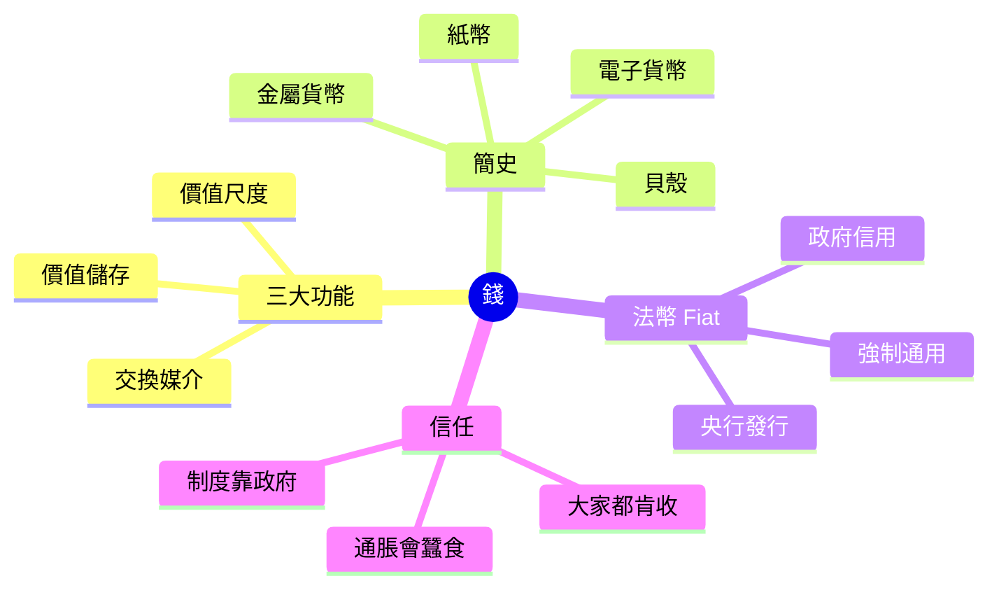
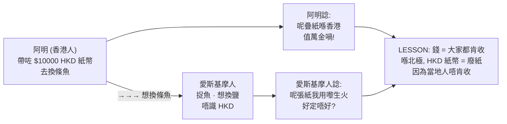
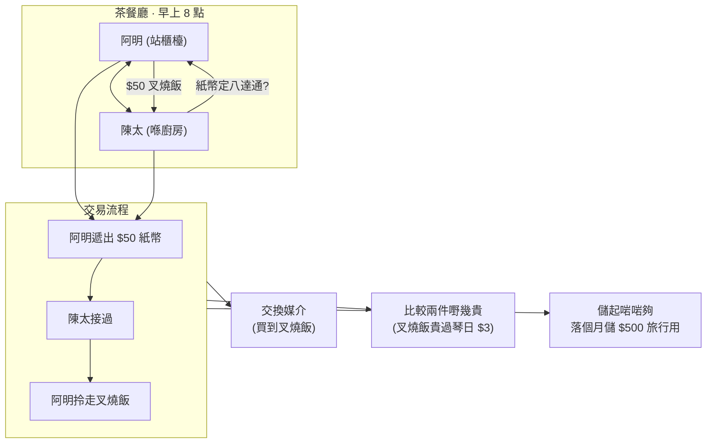
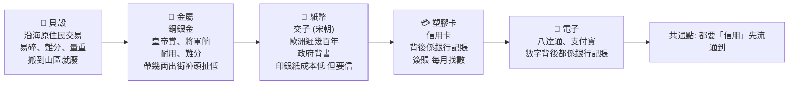
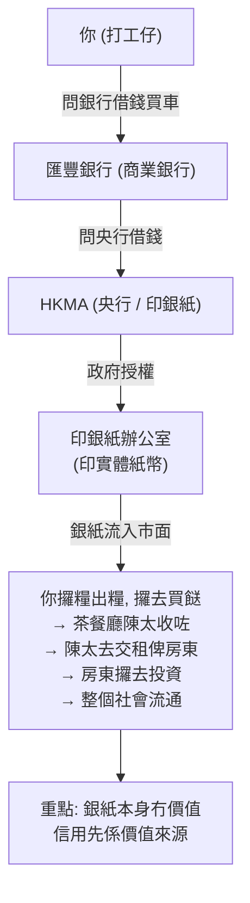
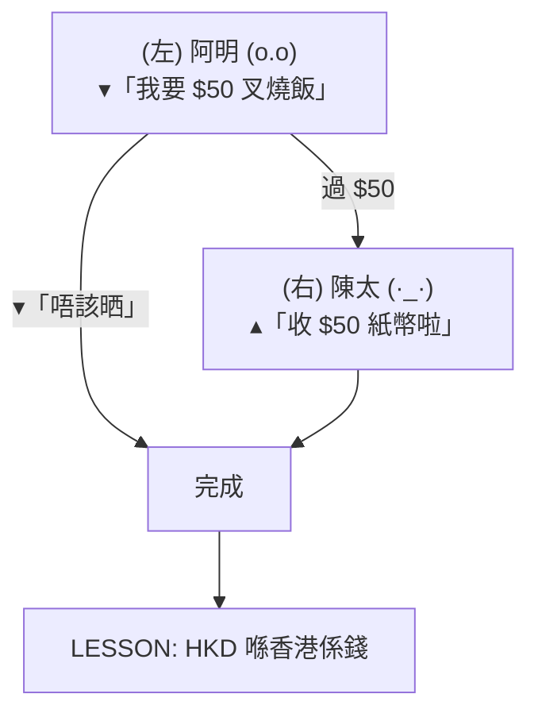
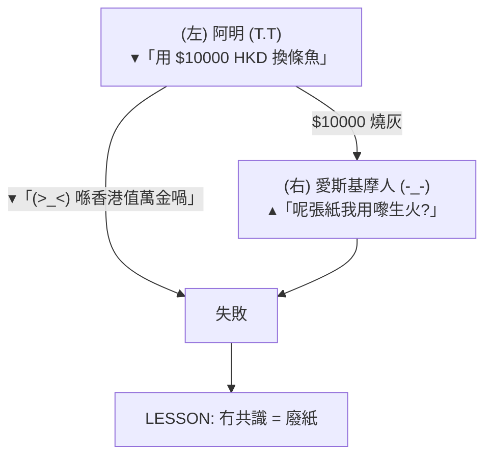
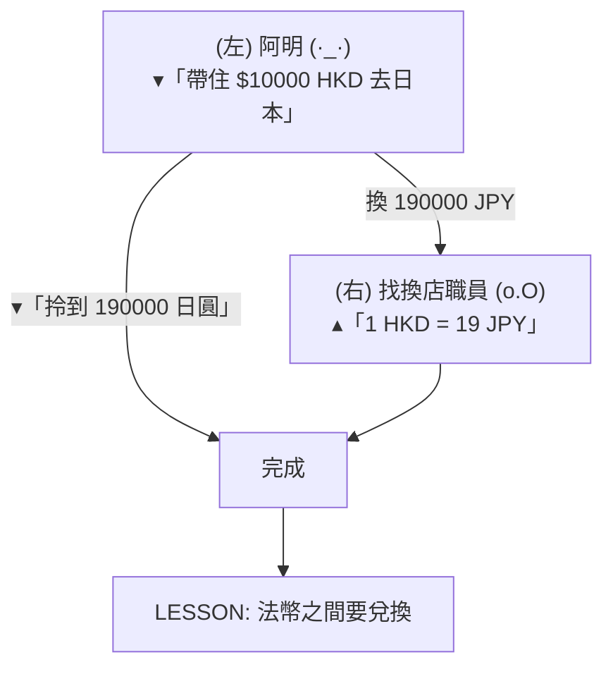
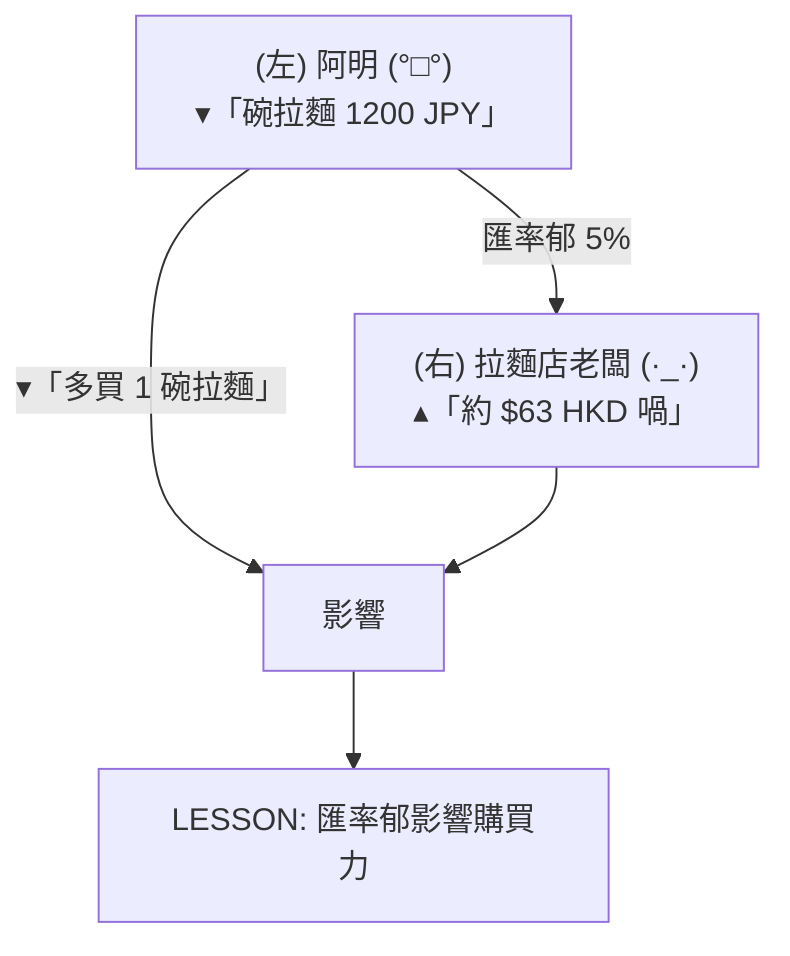

# Module 01: 乜嘢係錢?

Est. study time: 1h
Language: yue
Description: 錢嘅本質、三大功能、由貝殼到電子貨幣嘅簡史、法幣(Fiat)同信任嘅關係

## Knowledge Map

---

## Learning Objectives
- 用日常例子解釋「乜嘢係錢」, 解到中學生都明
- 講出錢嘅三大功能, 每個功能配一個生活例子
- 簡述錢由貝殼到電子貨幣嘅演化
- 解釋「法幣」(Fiat money) 點樣靠政府信用運作
- 指出「信任」係錢嘅根基, 失去信任嘅後果

---

## Real-World Example

你帶住一疊 HKD 紙幣去北極探險, 愛斯基摩人唔識乜嘢係「HKD」, 佢只係當你張紙係燃料。你阿明覺得好屈:「呢疊紙喺香港值一萬蚊喎!」但喺北極, 呢疊紙真係冇用 — 因為冇人肯收。**錢嘅本質, 從來都唔係紙、金、銀, 係人與人之間嘅「共識」**。

> **Think**: 點解茶餐廳陳太肯收你張 $50 紙幣? 佢又唔認識你, 又唔見到政府喺隔離。佢點解會信呢張紙?
>
> *Answer: 佢信嘅唔係你, 佢信嘅係呢張紙「下個鐘可以攞去買第樣嘢」 — 即係佢信市場上其他人(包括政府)都會繼續接受呢張紙。呢個就係「信任」, 錢嘅根基。*

---

## Core Content

### Section 1: 錢嘅三大功能

經濟學家講「錢」, 講嘅唔係實物, 係三個功能。任何嘢只要做到呢三樣, 我哋都會當佢係錢。

**功能一: 交換媒介** — 你想食叉燒飯, 飯店想收錢, 大家唔使交換「叉燒換叉燒」咁論盡。錢做中間人, 兩邊都方便。

**功能二: 價值尺度** — 部 iPhone $9000, 一碗雲吞麵 $50。你即時知道 iPhone 貴過雲吞麵 180 倍。如果冇共同單位, 你點比較? (「一架電話換 180 碗麵」好難記)

**功能三: 價值儲存** — 你今日賺咗 $1000, 唔使即日晒晒佢。可以放入錢包 / 銀行 / 床下底, 下個月先攞出嚟用。錢儲得起價值, 唔似蘋果會爛。

> **Think**: 比特幣做到「交換媒介」同「價值儲存」, 但「價值尺度」呢個功能, 點解好多人仲未肯用?
>
> *Answer: 因為商戶訂價嗰陣, 都係用 HKD/USD 寫, 唔寫 BTC。比特幣嘅價格太波動(一日可以 ±10%), 攞嚟做「標準刻度」好難用。所以 BTC 仲未係日常「尺度」, 只係一部人嘅儲值/投機工具。*

> **Cloze**: "錢嘅三大功能係 {交換媒介}、{價值尺度} 同 {價值儲存}。"
>
> *Answer: 交換媒介、價值尺度、價值儲存*

### Section 2: 錢嘅簡史 — 從貝殼到八達通

錢唔係一直係紙。以前試過好多嘢做錢, 留得低嘅, 都係做到嗰三個功能嘅。

**貝殼階段** — 遠古時候, 沿海居民用貝殼做交易。問題: 搬去山區就用唔到, 貝殼當地人唔信。

**金屬階段** — 銅、銀、金。耐用、稀有、可分割(一両金 = 10 錢), 但重。帶幾両金出街, 褲頭都扯低。

**紙幣階段** — 中國宋朝已經有「交子」(世界上最早嘅紙幣)。紙幣本身冇價值, 靠政府/銀行背書 — 「你攞呢張紙嚟, 我保證可以換到等值嘅金/銀」。

**塑膠卡 / 電子貨幣** — 信用卡、八達通、支付寶、PayMe。你睇唔到實體, 但個數字仲係錢, 因為背後有銀行/機構記賬。**記賬比印銀紙更高效**。

> **Cloze**: "世界上最早嘅紙幣係中國宋朝嘅 {交子}, 佢本身冇價值, 靠 {政府/銀行背書}。"
>
> *Answer: 交子、政府/銀行背書*

> **Predict**: 假設下年你用現金嘅次數減半, 用電子錢包加倍。10年後現金會消失嗎?
>
> *Answer: 唔會完全消失 — 但佔比會大幅縮。類似北歐國家(瑞典), 現金只佔交易 10% 以下。但完全消失要解決兩個問題: 老人家唔識用電子 / 系統故障時要 backup。多數經濟學家估: 現金會變「最後手段」, 唔係主流。*

### Section 3: 法幣 (Fiat Money) — 政府講咗算

1971 年, 美國總統尼克遜宣布美元唔再對應黃金。全球主要貨幣從此變成「法幣」(Fiat money)。

「Fiat」係拉丁文, 解「let it be done」(就係咁決定)。法幣嘅意思: **政府話呢張紙值幾多, 就值幾多**, 唔再靠黃金/白銀做後盾。

法幣靠兩樣嘢 hold 起嚟:
1. **政府強制通用** — 喺香港, 法例規定 HKD 係合法支付工具, 唔收港元會犯法
2. **政府信用** — 大家都信政府會管好, 唔會亂咁印銀紙搞到通脹失控

**問題**: 一旦政府「亂印銀紙」, 法幣就會崩潰。例子: 辛巴威 2008 年通脹率達到 89,700,000,000,000% (8.97 乘 10 嘅 13 次方)。個鈔票上面寫住「100 億」, 但一個麵包都買唔起。

> **Spot the Mistake**: 「法幣有政府背書, 所以點印都唔會貶值, 永遠保值。」
>
> 邊度錯?
>
> *Answer: 「永遠保值」錯晒。法幣嘅價值靠政府信用 hold 住, 一旦政府信用崩潰(亂印銀紙、政治動盪、戰敗), 法幣會極速貶值。辛巴威、委內瑞拉、1923 年德國 Weimar 全部都係反面教材。法幣唔係「絕對保值」, 只係「相對穩定」 — 視乎政府守唔守規矩。*

### Section 4: 點解 USD / HKD / CNY 唔同值

你今朝睇新聞, 可能見到 USD/HKD = 7.80, USD/CNY = 7.25。即係 1 美元可以換 7.8 港元 或 7.25 人民幣。**三個都係錢, 點解唔同價?**

簡單講: 三個政府/央行, 各自有自己嘅貨幣, 各自管自己嘅銀根。同 Bitcoin 唔同, 法幣之間可以自由兌換(透過外匯市場), 但唔可以 1:1 對換。

用阿明去日本旅行做例子, 由香港帶錢到日本買嘢, 一共 4 個 panel:

### Panel 1: 香港茶餐廳

阿明用 HKD 買叉燒飯

### Panel 2: 北極

HKD 紙幣喺北極冇人收

### Panel 3: 機場找換店

阿明去機場找換店

### Panel 4: 東京拉麵店

阿明用 JPY 買拉麵

**睇完 4 個 panel 你會發現**:

- Panel 1: 阿明用 HKD 喺香港買嘢, **HKD 係錢** ✓
- Panel 2: 阿明帶 HKD 去北極, 當地人唔收, HKD 變廢紙 → 錢靠共識
- Panel 3: 阿明去日本前, 要去機場找換店將 HKD → JPY → 法幣之間要兌換
- Panel 4: 阿明喺日本用 JPY 買嘢, 匯率會郁, 影響購買力

**影響匯率嘅因素**(留俾後面課程): 通脹差、利率差、貿易順差/逆差、政治穩定、市場預期。呢個 module 只需要記住: **唔同國家有唔同法幣, 匯率會郁**。

> **Cloze**: "影響兩種法幣之間匯率嘅因素包括 {通脹差}、{利率差} 同 {貿易順逆差} 等。"
>
> *Answer: 通脹差、利率差、貿易順逆差*

---

### Why This Matters

你每日都用錢, 但你可能從來冇諗過「錢」呢個 concept。當你識得分「法幣」、「電子貨幣」、「外幣」嘅分別, 你睇新聞(央行加息、人民幣貶值、Bitcoin 爆升)就唔再係睇天書。

更實際: 當有人同你推銷「呢隻幣一定保值」, 你就識得問:「邊個政府背書? 通脹率幾多? 歷史上有冇崩盤過?」呢啲就係 Module 1 學到嘅最基本防身術。

---

## Key Takeaways
- 錢有三大功能: 交換媒介、價值尺度、價值儲存。三個齊全先叫「錢」
- 錢嘅形狀由貝殼 → 金屬 → 紙幣 → 電子, 但本質(信用)從冇變過
- 法幣(Fiat money) 靠政府信用運作, 唔再對應黃金
- 法幣唔係「永遠保值」, 政府亂印銀紙就會崩潰(辛巴威、委內瑞拉)
- 唔同國家有唔同法幣, 匯率會受通脹/利率/貿易等因素影響
- **錢嘅根基係「信任」**, 唔係紙、唔係金、唔係銀, 係人與人之間嘅共識

---

## Common Misconception

**「電子貨幣 / Bitcoin 唔係真錢, 因為佢冇實物。」**

錯。真錢從來都唔係靠「實物」, 靠嘅係「大家都肯收」。貝殼時代貝殼有實物啦, 但你帶貝殼去北極就廢嘅; 紙幣本身係一張紙, 冇內在價值。法幣、電子貨幣、BTC — 都係「靠共識運作」, 分別只係共識嘅範圍幾大(全球 / 一國 / 一群信徒)。

---

## Spot the Mistake

你阿媽同你講:「你而家啲錢, 以前我哋叫『金圓券』嗰陣, 一張幾百萬。嗰啲先叫真錢, 因為以前能對換黃金。你而家啲 HKD 印出嚟冇人睇, 唔算錢。」

邊度錯?

*Answer: 兩件事混淆咗。第一, 金圓券(國民政府 1948 年發行)正正就係法幣, 唔對黃金 — 佢嘅結局係超級通脹, 一張幾億買唔到一粒米。所以「能對換黃金」唔等於「真錢」, 只係舊時嘅金本位制度。第二, 而家 HKD 雖然冇黃金後盾, 但靠 Hong Kong Monetary Authority 同聯繫匯率(7.75-7.85 對 USD)hold 住信用。信用係錢嘅根基, 唔係黃金。*

---

## Feynman Explain

(用一個 5 歲都明嘅故事解釋「乜嘢係錢」。提示: 從以物易物(用玩具換糖果)講起, 講到「大家都肯收嘅嘢就係錢」。唔好用 jargon, 唔好提前講法幣。)

---

## Reframe

(試下諗: 如果全香港人同時決定「唔再接受 HKD 紙幣」, 你覺得會發生咩事? 你會即刻去銀行換晒啲錢嗎? 定係你會發現, 其實你啲錢大部分已經係電子(戶口/支付寶), 對你影響唔大? 寫低你嘅諗法。)

---

## Drill
Take the quiz. MCQs test recall + application + scenario.

Run: `learn.sh quiz finance-basics-cantonese 1`
Run: `learn.sh cloze finance-basics-cantonese 1`
