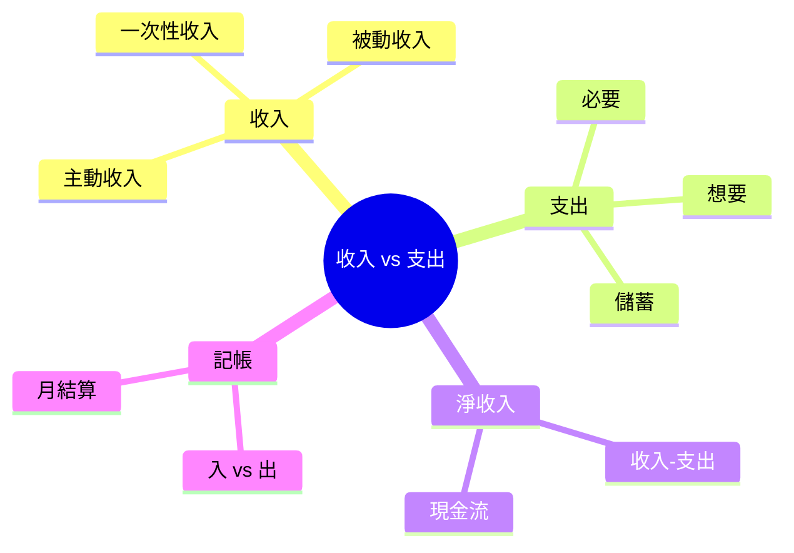
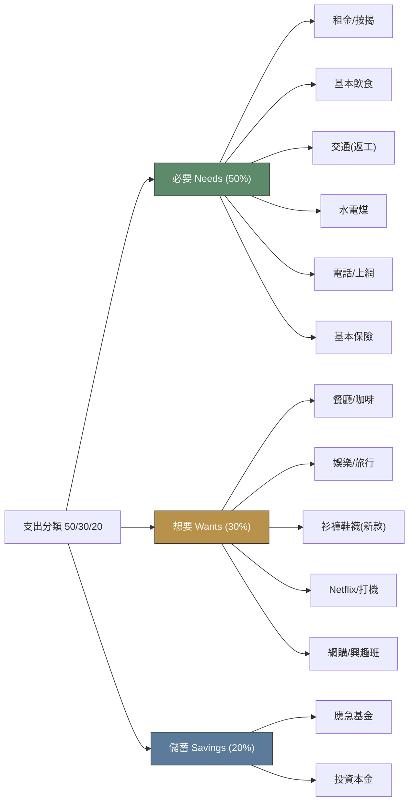
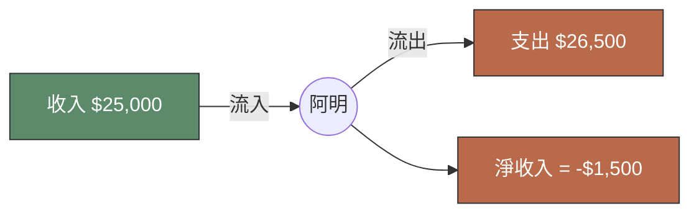

# Module 02: 收入 vs 支出

Est. study time: 1h
Language: yue
Description: 收入種類、支出種類、淨收入、基本記帳、現金流流向。睇清楚自己啲錢從邊度嚟、去咗邊度。

## Knowledge Map

---

## Learning Objectives
- 分辨「主動收入」同「被動收入」嘅分別
- 將支出分「必要」、「想要」、「儲蓄/投資」三類
- 計「淨收入」(Net Income), 解現金流方向
- 用簡單記帳法追蹤每日出入
- 解釋「入不敷支」嘅後果同改善方法

---

## Real-World Example

阿明出咗嚟做嘢, 每月人工 $25,000。睇落好正常, 但每月尾都「乾塘」, 唔知啲錢去咗邊。

跟住佢用 Excel 記咗 1 個月帳, 發現:
- 收入: $25,000 (人工)
- 支出: $26,500 (租金 9,000 + 飲食 4,500 + 交通 2,000 + 手機 300 + 娛樂 3,000 + 網購 6,500 + 其他 1,200)

**淨收入: -$1,500** (即係負數, 入不敷支)

> **Think**: 阿明問題喺邊? 收入 $25,000 都唔夠使, 點解?
>
> *Answer: 唔係收入太少, 係支出太多 — 尤其係「娛樂 + 網購」$9,500, 佔 36%。呢類「想要」支出, 唔係必要, 係可以減嘅。同時佢冇「儲蓄」呢一項, 所以冇 buffer 應急。*

---

## Core Content

### Section 1: 收入 — 錢從邊度嚟?

收入分三大類, 理解呢個分野, 你就會知點樣增加收入:

| 類型 | 英文 | 特徵 | 例子 |
|---|---|---|---|
| **主動收入** | Active | 用時間/勞力換錢, 停手就冇 | 打工, 自己開公司, Freelance, 兼職 |
| **被動收入** | Passive | setup 之後定期有錢, 唔使持續做 | 物業收租, 股票派息, 版稅, system 化嘅生意 |
| **一次性收入** | One-time | 一筆過大額, 之後冇 | 賣樓, 中彩票, 遺產, 退稅 |

**主動收入 (Active Income)** — 你用時間/勞力換嚟嘅錢:
- 打工 (返工收月薪)
- 自己開公司 (老闆親身做嘢)
- Freelance 接 job
- 兼職 (補習, 炒散)

呢類收入有個特性: **你停手就冇**。你病咗一個月, 就少咗一個月糧。

**被動收入 (Passive Income)** — 你做一次 setup, 之後定期有錢, 唔使持續做:
- 物業收租 (買樓收租)
- 股票派息 (持優質股, 每年收息)
- 版稅/專利費
- 經營生意請人打理 (system 跑緊, 你只係監控)

被動收入嘅**目標**: 夠冚晒你嘅支出, 就可以「財務自由」(Module 26 詳細講)。

**一次性收入 (One-time Income)** — 一筆過嘅大額, 之後冇:
- 賣車/賣樓
- 中彩票
- 遺產
- 退稅 (年尾退稅)

> **Cloze**: "打工收月薪屬於 {主動收入}, 物業收租屬於 {被動收入}。"
>
> *Answer: 主動收入、被動收入*

> **Spot the Mistake**: 「被動收入 = 唔使做嘢就有錢, 所以我 All-in 炒 Bitcoin 等佢升值, 咁就叫被動收入。」
>
> 邊度錯?
>
> *Answer: 「Bitcoin 升值」係資本增值 (Capital Gain), 唔係「收入」(Income)。收入係定期/重複嘅 cash flow (例如租金、利息、股息)。Bitcoin 嘅升跌係資產價格變動, 你唔賣就冇現金。況且炒 BTC 本身要花時間睇市, 唔係「被動」, 係「主動投機」。真正被動收入係「唔做嘢都有 cash 入口」, 例如穩定收息嘅債券/藍籌股。*

### Section 2: 支出 — 錢去咗邊度?

支出分三類, 叫做 **50/30/20 規則** (Module 4 詳細講, 呢度先講概念):

**必要 (Needs)** — 唔使就死/生活唔到嘅:
- 租金/按揭 (有瓦遮頭)
- 基本飲食 (唔會餓死)
- 交通 (返工)
- 水電煤
- 基本保險

**想要 (Wants)** — 唔使, 但用咗會開心:
- 餐廳食飯 (可以自己煮)
- 旅行
- 新款衫褲 (有衫著就得)
- Netflix, 遊戲
- 咖啡, 甜品

**儲蓄 (Savings)** — 將來嘅自己:
- 應急基金 (失業/急病用)
- 投資本金 (製造被動收入)

**重點**: 「必要」同「想要」嘅界線好模糊. 例如:
- 自己煮 vs 餐廳食 → 餐廳 = 想要
- 公共交通 vs 的士 → 的士 = 想要
- 月費 plan 50GB vs 5GB → 5GB 已經夠, 50GB = 想要

> **Think**: 試下將你過去一個月嘅支出分「必要」、「想要」、「儲蓄」三類。邊一類佔最多?
>
> *Answer: 大部分香港人「想要」佔比過高(40-60%), 因為網購、餐廳、娛樂好方便。理想比例: 必要 50%, 想要 30%, 儲蓄 20%。如果你想要 > 50%, 你嘅財務狀況可能會越嚟越緊。*

> **Cloze**: "支出分 {必要}、{想要} 同 {儲蓄} 三類, 50/30/20 規則建議比例係 {50/30/20}。"
>
> *Answer: 必要、想要、儲蓄、50/30/20*

### Section 3: 淨收入同現金流

**淨收入 (Net Income)** = 收入 - 支出

**現金流 (Cash Flow)** = 錢嘅流向:

- **正現金流 (Positive)**: 收入 > 支出, 每月有剩
- **負現金流 (Negative)**: 收入 < 支出, 每月要動用儲蓄/負債
- **打和 (Break-even)**: 收入 = 支出, 無剩無蝕

**點解現金流重要?**
- 正現金流 → 累積資產 → 製造被動收入
- 負現金流 → 累積負債 → 越嚟越窮, 最終破產

**阿明嘅問題**: 每月 -$1,500, 即係用緊儲蓄/信用卡填窟窿, 1 年就 -$18,000。如果唔改善, 儲蓄會清零, 之後就要負債。

> **Spot the Mistake**: 「我收入高過支出, 咁就 OK 啦。」
>
> 邊度錯?
>
> *Answer: 太樂觀。要睇吓「高幾多」。如果收入 $30,000, 支出 $29,500, 剩 $500 啱啱夠, 但儲蓄率得 1.7%, 應急能力好弱(失業 1 個月就歸 0)。正確做法: 收入 $30,000 嘅人, 儲蓄率應該至少 20% ($6,000), 即支出上限 $24,000。收入高唔等於財務健康, 重點係「儲蓄率」。*

### Section 4: 記帳 — 唔記就唔知

「唔記得使咗幾多」係香港人最常見嘅財務問題。**記帳 1 個月, 你就會發現自己使錢嘅 pattern**。

**最簡單記帳法 (5 分鐘/日)** — 用 markdown table 記低每日出入:

| 時間 | 類別 | 金額 | 備註 |
|---|---|---|---|
| 08:30 | 必要 | $35 | 早餐 |
| 13:00 | 必要 | $50 | 午餐 |
| 19:00 | 想要 | $250 | 朋友食飯 |
| 21:00 | 想要 | $180 | 網購襪 |
| **今日總計** | | **$515** | |

**每月尾計一次**:
- 必要: $X (目標 ≤ 50%)
- 想要: $Y (目標 ≤ 30%)
- 儲蓄: $Z (目標 ≥ 20%)
- 淨收入: $X + $Y + $Z - 收入

**香港常用記帳 App**:
- 銀包 App (内置記帳)
- MoneyWiz
- 坊間紙本 notebook

> **Cloze**: "記帳嘅目的係 {追蹤現金流, 搵出使錢 pattern}。"
>
> *Answer: 追蹤現金流, 搵出使錢 pattern*

> **Predict**: 你記帳 1 個月, 發現「想要」類支出佔 45%, 嚴重超標。你會點做?
>
> *Answer: 3 步: (1) 將「想要」入面非必要嘅 cut 咗(網購、訂閱), (2) 設定每月「想要」上限($X), (3) 將省返嘅錢撥入「儲蓄」。目標: 2-3 個月內將「想要」由 45% 降到 30% 或以下。*

---

### Why This Matters

收入 vs 支出, 表面睇好簡單, 但**大部分人從來冇認真計過**。Module 1 講「錢嘅本質」, 呢度講「你個人嘅現金流」 — 你控制唔到通脹, 控制唔到匯率, 但你控制到自己使幾多。

記帳係理財嘅第一步。冇記帳, 你做唔到預算(Module 4), 計唔到淨資產(後面 module), 都唔知道自己要幾多儲蓄先夠退休(Module 25)。

---

## Key Takeaways
- 收入分**主動**(打工)、**被動**(收租/股息)、**一次性**(賣樓)三類
- 支出分**必要**(租金/飲食)、**想要**(餐廳/娛樂)、**儲蓄**(應急/投資)三類
- **淨收入 = 收入 - 支出**, 正數有儲蓄, 負數動用儲蓄/負債
- 現金流方向決定財務健康: 正現金流累積資產, 負現金流累積負債
- **記帳 1 個月**就會發現自己使錢 pattern, 係所有理財嘅基礎
- 「收入高」唔等於「財務健康」, 重點係**儲蓄率**(理想 20%+)

---

## Common Misconception

**「記帳好煩, 我大概知自己使幾多就夠啦。」**

錯。認知偏誤 (Module 27 詳細講) 講過: **人對自己使錢嘅記憶, 永遠比實際少 30-50%**。你以為自己午餐使 $50, 實際平均 $80; 你以為自己網購每月 $500, 實際 $2,000。

記帳唔係為咗「知道自己使幾多」(你以為自己知), 係為咗「知道自己使**邊度**」(分項分析)。先有分項, 先有改善。

---

## Spot the Mistake

你阿明同你講:「我收入 $30,000, 儲蓄率 5% ($1,500/月), 算唔錯啦, 好多香港人儲蓄率仲低過我。」

邊度錯?

*Answer: 「比人地好」唔係標準, 係最低標準。儲蓄率 5% 即係一年只儲 $18,000, 失業 2 個月就歸 0。理想儲蓄率至少 20% ($6,000/月), 財務健康線。如果想早啲退休(Module 26 FIRE), 儲蓄率要到 50-70%。儲蓄率呢家嘢, 永遠係「愈多愈好」, 唔好同人比, 同自己嘅目標比。*

---

## Feynman Explain

(用一個 5 歲都識嘅比喻解釋「淨收入」: 媽媽每日俾你 $10 零用錢, 你買雪糕 $5, 儲落錢罌 $5。「淨收入 = 收入 - 支出 = $10 - $5 = $5」。如果你每日雪糕都食 $12, 即係「入不敷支」, 要問媽媽再俾, 最後媽媽會燥。試下用呢個比喻解釋俾小朋友聽。)

---

## Reframe

(試下諗: 你而家收入 vs 支出比例係點? 記帳 1 個月之後, 邊一類支出(必要/想要)佔比最高? 如果要將「想要」減 10%, 你會 cut 邊樣? 寫低你嘅諗法同 1 個實際行動 plan。)

---

## Drill
Take the quiz. MCQs test recall + application + scenario.

Run: `learn.sh quiz finance-basics-cantonese 2`
Run: `learn.sh cloze finance-basics-cantonese 2`
