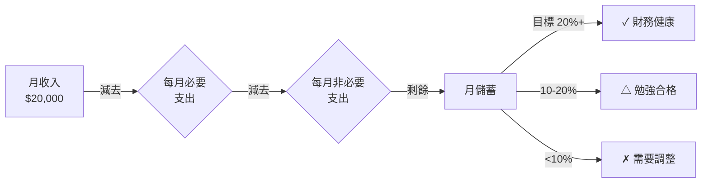

# Module 03: 儲蓄同現金流

Est. study time: 1h
Language: yue
Description: 儲蓄定義、種類、應急錢、淨現金流 (income - expense - savings = 0 公式)、現金流健康指標

## Knowledge Map


---

## Learning Objectives
- 解釋「儲蓄」嘅定義同點解佢係理財嘅第一步
- 分辨唔同種類嘅儲蓄 (短期/中期/長期/應急)
- 用「現金流公式」(收入 - 支出 = 儲蓄) 計自己嘅月度現金流
- 訂立「應急錢」目標 (3-6 個月支出)
- 識別儲蓄嘅常見心理陷阱 (先使未來錢、儲唔落)
- 用儲蓄率/應急覆蓋率呢啲指標自評現金流健康

---

## Real-World Example

你月入 $20,000, 每月使 $18,000, 月底剩低 $2,000。你將 $2,000 存入戶口, 覺得「有儲蓄喇」。

但有日公司裁員, 你失業, 搵新工要 3 個月。3 個月使 $54,000, 你只有 $2,000 × 6 個月 = $12,000 儲蓄。**6 個月後你已經破產**。

呢個就係「現金流」嘅問題: 你儲緊嘅速度, 夠唔夠 cover 突發事件。**儲蓄唔止係數字, 係時間**。

> **Think**: 你而家嘅儲蓄, 夠你「唔做嘢」生存幾耐?
>
> *Answer: 用 (儲蓄總額 ÷ 每月必要支出) 計。如果儲蓄 $50,000, 每月必要支出 $10,000, 答案係 5 個月。財務健康嘅成年人, 目標係 6 個月以上嘅覆蓋。*

---

## Core Content

### Section 1: 儲蓄嘅定義

「儲蓄」就係: **收入減去支出之後, 嗰筆你唔會即刻使嘅錢**。聽落簡單, 但「唔即刻使」呢個定義好重要。

**儲蓄 vs 投資嘅分別**:
- 儲蓄 = 安全、低回報、易攞 (戶口/定存)
- 投資 = 風險、中高回報、鎖住 (股票/基金)

**點解儲蓄係第一步**: 投資有可能輸, 儲蓄一定唔會輸 (假設你放喺受存款保障嘅戶口)。冇穩定儲蓄底, 投資輸少少你就破產。所以理財嘅金科玉律: **先儲蓄, 後投資**。

> **Cloze**: "儲蓄同投資嘅最大分別係 {風險}: 儲蓄 {一定唔會輸}, 投資 {可能輸}。所以理財次序係 {先儲蓄, 後投資}。"
>
> *Answer: 風險 / 一定唔會輸 / 可能輸 / 先儲蓄, 後投資*

### Section 2: 儲蓄嘅種類

唔同目標需要唔同儲蓄戶口, 唔好 all-in 一個:

| 種類 | 目標 | 期限 | 擺放工具 | 回報率 |
|---|---|---|---|---|
| 應急錢 | 失業/疾病/維修 | 即時攞到 | 活期戶口 | 0-1% |
| 短期目標 | 旅行/新手機 | 3-12 個月 | 短期定存/貨幣基金 | 1-3% |
| 中期目標 | 結婚/進修 | 1-3 年 | 中期定存/債劵 | 2-4% |
| 長期目標 | 退休/置業 | 5 年以上 | 投資戶口/股票 | 4-8% (有風險) |

**Why 分開**: 心理學叫「mental accounting」(心理賬戶)。分開戶口, 你唔會因為見到「旅行錢」就走去買 iPhone。**分戶口 = 自我控制工具**。

> **Think**: 點解「應急錢」要擺活期戶口(0-1% 回報), 唔擺去定存(3-5%) 多賺?
>
> *Answer: 因為「應急」嘅意思係要即刻攞到。定存提前攞會罰息(可能 0 利息)。活期戶口可以即時 ATM 攞, 唔影響回報。呢個 trade-off: 多 2-3% 回報 vs 失去靈活性, 應急錢要靈活性。*

### Section 3: 現金流公式 (Cash Flow)

現金流好簡單, 一條公式:

```
月儲蓄 = 月收入 - 月支出
```

呢個公式永遠成立。如果結果係正數, 你有儲蓄; 負數, 你負債。

**現金流流向圖**:



> **Spot the Mistake**: 「我每月儲$500, 雖然少但總好過冇, 財務好健康。」
>
> 邊度錯?
>
> *Answer: 「好健康」錯晒。財務健康睇嘅係「儲蓄率」(月儲蓄 ÷ 月收入), 唔係儲蓄金額。如果月入 $20,000 儲 $500, 儲蓄率只有 2.5%, 屬於「需要調整」級別。儲蓄率 20% 以上先算健康, 即係月入 $20,000 應該儲 $4,000+。金額少唔等於健康, 比例先係關鍵。*

### Section 4: 應急錢 (Emergency Fund)

應急錢係**最重要嘅儲蓄**, 冇之一。佢嘅目的: 失業/疾病/意外/屋頂爆呢啲突發事件, 你有 3-6 個月 buffer。

| 月必要支出 | 3 個月目標 | 6 個月目標 |
|---|---|---|
| $8,000 | $24,000 | $48,000 |
| $10,000 | $30,000 | $60,000 |
| $15,000 | $45,000 | $90,000 |
| $20,000 | $60,000 | $120,000 |

**Why 3-6 個月**: 統計顯示, 香港平均搵工時間 2-4 個月。3 個月太緊, 6 個月較安心。已婚/有仔女 → 6 個月; 單身/雙薪 → 3 個月 OK。

> **Predict**: 你月必要支出 $12,000, 儲蓄有 $36,000。失業, 預期搵工 3 個月, 你夠 cover 嗎? 點解?
>
> *Answer: 剛剛夠 cover (36,000 ÷ 12,000 = 3 個月)。但「剛剛夠」係危險狀態, 因為搵工時間可能延遲 (生病/競爭大)。建議目標 $72,000 (6 個月), 畀自己 buffer。*

---

### Why This Matters

儲蓄同現金流係所有理財嘅基礎。冇儲蓄, 你做唔到以下任何一項:
- 投資 (冇 buffer 輸少少就破產)
- 退休 (冇儲蓄就靠 MPF 強制供款, 唔夠)
- 應急 (失業/疾病/意外)

儲蓄率 20%+ 嘅人, 退休時至少有 20× 年支出 嘅資產。儲蓄率 < 10% 嘅人, 退休時要靠政府/仔女, 失去自主。

---

## Key Takeaways
- 儲蓄 = 收入 - 支出後, 唔即刻使嘅錢
- 儲蓄係理財第一步, 先儲蓄後投資
- 分戶口 = 心理賬戶工具, 避免一筆錢洗晒
- 應急錢 3-6 個月必要支出, 擺活期戶口
- 儲蓄率 = 月儲蓄 ÷ 月收入, 目標 20%+
- 現金流公式永遠成立: 收入 - 支出 = 儲蓄

---

## Common Misconception

**「儲蓄 = 慳錢 = 蝕底」**

錯。儲蓄唔係叫你唔使錢, 係叫你「先 pay 自己」, 每月固定將部分收入存入獨立戶口, 然後用剩低嘅使。「先 pay 自己」嘅好處: 你唔使每次諗「應唔應該儲」, 因為自動化了。慳錢 (痛苦) vs 先 pay 自己 (輕鬆) — 後者更容易持續。

---

## Spot the Mistake

你阿明同你講:「我月入 $30,000, 我覺得自己儲蓄做得唔錯, 因為我每月都儲 $3,000, 即 10% 啦。我已經有 $50,000 應急錢, 夠喇。」

邊度錯?

**Answer**: 兩件事要拆開睇。第一, 儲蓄率 10% 屬於「勉強合格」, 唔係「唔錯」, 健康水平要 20%+。第二, 應急錢目標應該係 3-6 個月「必要支出」, 唔係一個固定金額。如果阿明每月必要支出 $15,000, 3 個月目標 $45,000, 6 個月目標 $90,000。佢得 $50,000, 對單身 OK 但對有家庭嘅人唔夠。**金額少, 相對收入同支出嘅比例先係健康指標**。

---

## Feynman Explain

(用 5 歲都明嘅語言解釋「點解大人要儲錢」。提示: 從「你有冇試過想買玩具但錢唔夠」講起, 帶到「大人儲錢, 將來可以買更大嘅嘢, 或者有意外時有得用」。唔好提「複利」、「通脹」、「投資」呢啲 jargon。)

---

## Reframe

(試下諗: 如果你下個月突然失業, 你嘅儲蓄夠你生存幾耐? 寫低呢個數字, 然後諗: 「我願意接受呢個 risk 嗎? 如果唔願意, 我下個月可以點做?」)

---

## Drill
Take the quiz. MCQs test recall + application + scenario.

Run: `learn.sh quiz finance-basics-cantonese 3`
Run: `learn.sh cloze finance-basics-cantonese 3`
