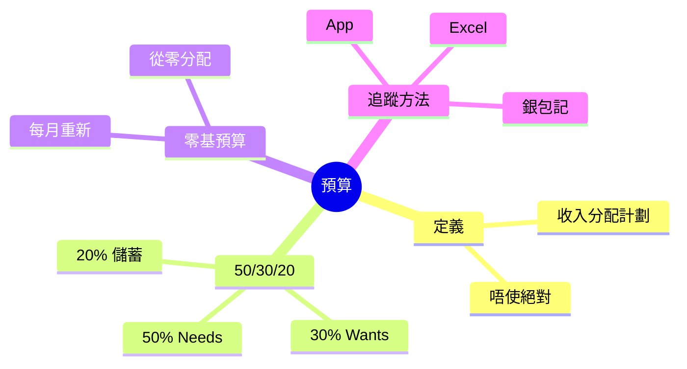
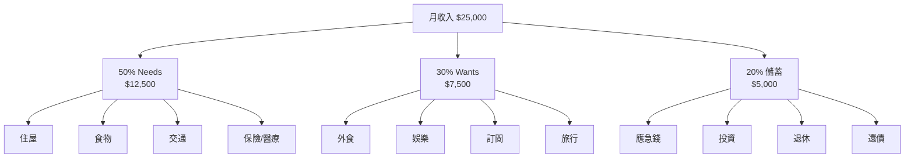

# Module 04: 預算: 50/30/20 規則

Est. study time: 1h
Language: yue
Description: 預算定義、50/30/20 規則、needs vs wants 分類、零基預算、實際追蹤方法

## Knowledge Map

---

## Learning Objectives
- 解釋「預算」嘅定義, 釐清「預算 = 限制使錢」嘅常見誤解
- 應用 50/30/20 規則到自己嘅收入
- 分辨 needs 同 wants 嘅分別, 避免分類錯誤
- 比較 50/30/20 同零基預算兩種方法
- 用 App/Excel/銀包 3 種方法追蹤實際支出
- 識破預算常見失敗原因 (太嚴、唔實、跟唔到)

---

## Real-World Example

你月入 $25,000, 從來冇做過預算。月底檢查戶口, 永遠得 $3,000-$5,000。你諗:「我啲錢去晒邊?」

你打開信用卡月結單, 見到:
- 超市 $4,500 (必要)
- 午餐外賣 $3,800 (重複)
- Netflix + Spotify + YouTube Premium $380 (訂閱)
- 周末 shopping $2,500 (使咗)
- 朋友飯局 $1,800
- 雜項 $2,200

**全部唔記得自己使過咗咁多**。呢個就係冇預算嘅後果: 收入流入, 流出無蹤, 月底永遠 surprise。

預算唔係叫你慳, 係幫你**清楚睇到自己嘅錢去咗邊**。

> **Think**: 你估自己一個月使幾多錢? 同實際使幾多, 差距幾多?
>
> *Answer: 大部分人高估自己嘅「必要支出」30-50%, 低估非必要支出。預算嘅第一個 action 唔係 cut, 係「記低一個月」, 等你知道真相。真相係改變嘅起點。*

---

## Core Content

### Section 1: 預算嘅定義同誤解

**預算** = 將月收入預先分配去唔同類別嘅支出, 等月底唔會 surprise。常見誤解:

| 誤解 | 真相 |
|---|---|
| 預算 = 慳錢 | 預算 = 知道錢去咗邊, 唔一定要 cut |
| 預算 = 嚴格限制 | 預算可以容許非必要支出 (30% 畀 wants) |
| 預算 = 完美執行 | 預算係計劃, 月底偏差 10% 都算成功 |
| 預算 = 收入高先有用 | 低收入更需要預算 (1 蚊都要分配) |

> **Cloze**: "預算唔係 {慳錢}, 係 {知道錢去咗邊}, 唔一定要 cut。"
>
> *Answer: 慳錢、知道錢去咗邊*

### Section 2: 50/30/20 規則

哈佛教授 Elizabeth Warren 提出嘅簡單預算法:

| 類別 | 比例 | 例子 |
|---|---|---|
| **Needs** (必要) | 50% | 住屋/食物/交通/保險/必要醫療 |
| **Wants** (想要) | 30% | 外食/旅行/訂閱/娛樂/新衫 |
| **儲蓄** | 20% | 應急錢/投資/退休/還債 |

**你月入 $25,000 嘅分配**:
- Needs: $12,500 (住屋 $7,000 + 食物 $3,000 + 交通 $1,500 + 保險 $500 + 醫療 $500)
- Wants: $7,500 (外食 $2,500 + 訂閱 $500 + 娛樂 $1,500 + 旅行儲備 $3,000)
- 儲蓄: $5,000 (應急錢 $3,000 + 投資 $1,500 + 退休 $500)

**關鍵**: 50/30/20 係**後調整, 唔係死規則**。如果你住屋已經 60% 收入, 即係租太貴/收入太低, 需要先解決住屋, 唔係死跟 50%。

> **Think**: 點解儲蓄歸類做 20% 但實際操作上儲蓄要排最優先 (即 pay 自己)?
>
> *Answer: 50/30/20 講嘅係「分配目標」, 但執行上要「先 pay 自己」 — 即出糧後即時將 20% 自動轉去儲蓄戶口, 然後先分配剩低 80%。咁先確保儲蓄一定做到, 而非「用到最後先儲 (通常儲唔落)」。*

### Section 3: Needs vs Wants 分類

最容易搞錯嘅位。**真正必要**只佔生活一部分:

| 真正 Needs (50%) | 容易混淆但係 Wants |
|---|---|
| 住屋租金/按揭 | 大屋 (3000 呎) |
| 必要食物 (煮飯) | 高級超市/有機食品 |
| 公共交通 | 名牌車/Uber 黑禮賓 |
| 必要醫療/保險 | 健身房/按摩 |
| 必要衣服 (返工) | 設計師品牌 |
| 必要電話月費 ($50) | 5G 無限 plan ($200) |

**判斷方法**: 「如果唔使呢樣嘢, 我嘅生活會唔會即刻出問題?」會 = Need; 唔會 = Want。

**Common mistake**: 「我需要 Starbucks 咖啡返工」— 唔需要, 你需要係咖啡因, 茶/即溶都可以。
「我需要架車返工」— 如果有地鐵/巴士, 唔需要, 係 want。

> **Spot the Mistake**: 「我月入 $20,000, 跟 50/30/20 分配: Needs $10,000, Wants $6,000, 儲蓄 $4,000。但我住屋 $9,000, 必要食物 $4,000, 必要交通 $2,000, total $15,000。跟唔到, 所以 50/30/20 唔啱我。」
>
> 邊度錯?
>
> *Answer: 兩件事混淆咗。第一, 你嘅 actual needs $15,000, 即 75% 收入, 已經遠超 50% 目標。呢個唔係「50/30/20 唔啱你」, 係「你嘅 needs 超支, 要調整」: 1) 搬屋減租; 2) 改煮飯減食物開支; 3) 改用公共交通。50/30/20 唔係死規則, 係 reference。當 actual 偏離 50/30/20 太多, 即係生活成本過高, 要解決 root cause。*

### Section 4: 零基預算 (Zero-Based Budget)

另一個熱門方法: 每月由零開始分配, 收入 - 所有支出 = 0。

**做法**:
1. 列今個月所有預期支出 (rent/食物/交通/訂閱/儲蓄/旅行/朋友飯局...)
2. 將收入分到每一項, 直到分晒 = 0
3. 月中如有意外支出, 從 wants 類別調配

**Vs 50/30/20**:

| 比較 | 50/30/20 | 零基預算 |
|---|---|---|
| 規則 | 固定比例 | 每月自訂 |
| 適合 | 入門, 懶人 | 想仔細控制, 願意花時間 |
| 失敗率 | 中 (因為有彈性) | 高 (太仔細易放棄) |
| 預估時間 | 5 分鐘 | 30-60 分鐘 |

**我推薦**: 大部分人由 50/30/20 開始, 掌握後再考慮零基。

> **Predict**: 你試零基預算, 第一個月做得幾好 (偏差 5%), 第二個月開始懶, 第三個月放棄。點解會咁?
>
> *Answer: 零基預算需要每月 30-60 分鐘, 對大部分人嚟講太花時間。第二個月開始有其他事 (加班/朋友), 冇時間 update, 就開始甩。第三個月索性放棄。**人嘅意志力有限, 自動化 + 簡單規則先可持續**。50/30/20 只需 5 分鐘, 配合自動轉賬, 失敗率低好多。*

### Section 5: 追蹤方法

預算要執行, 就要追蹤。3 個方法:

| 方法 | 優點 | 缺點 | 適合 |
|---|---|---|---|
| **App** (e.g. MoneyHero / Moneez / Wallet) | 自動分類, 圖表 | 私隱問題, 學習成本 | 願意裝 app 嘅人 |
| **Excel/Google Sheets** | 完全自訂, 免費 | 要手動輸入 | 中度投入 |
| **銀包記** (傳統筆紙) | 零成本, 簡單 | 易遺失, 唔齊全 | 入門 |

**最低門檻方法**: 信用卡月結單 + 簡單 spreadsheet。月結單已分類好大部分, 你只需 add 幾個關鍵字 (e.g. 「外食/訂閱」) 同計總和。

> **Cloze**: "預算追蹤嘅最低門檻方法係 {信用卡月結單} + 簡單 {spreadsheet}。"
>
> *Answer: 信用卡月結單、spreadsheet*

---

### Why This Matters

冇預算, 你永遠係「出糧 → 使晒 → 月底 surprise」嘅循環。預算唔係限制, 係**自主權**: 你決定錢去邊, 而非由外賣 app / 訂閱服務決定。

研究顯示, 寫低預算嘅人儲蓄率高 2-3 倍。即使只跟 50/30/20 一個月, 你已經會發現「我以為嘅必要支出 vs 真正必要支出」嘅差距, 呢個差距就係改變嘅起點。

---

## Key Takeaways
- 預算 = 預先分配收入, 唔係限制使錢
- 50/30/20: 50% Needs + 30% Wants + 20% 儲蓄
- Needs vs Wants: 「冇咗會唔會即刻出問題?」會 = Need
- 50/30/20 係 reference, 唔係死規則
- 儲蓄要「先 pay 自己」, 自動轉賬
- 零基預算仔細但花時間, 失敗率高
- 追蹤最低門檻: 信用卡月結單 + spreadsheet

---

## Common Misconception

**「預算會令我冇晒樂趣」**

錯。50/30/20 預留咗 30% 畀 wants (外食/旅行/娛樂), 即係月入 $25,000 嘅人有 $7,500 自由使。呢個金額比「冇預算, 月底 surprise」嘅人實際花費更多, 因為有預算嘅人會諗清楚「$7,500 想點使」, 唔會被動回應「$380 訂閱服務自動 renew」。預算令樂趣更自覺, 唔係消除樂趣。

---

## Spot the Mistake

你朋友阿明同你講:「我跟 50/30/20, 儲蓄率 20% ($5,000), 已經好完美啦, 唔使再諗點儲多啲。」

邊度錯?

*Answer: 50/30/20 係入門 baseline, 唔係終點線。20% 儲蓄率對大部分人 OK, 但如果你目標係 30 歲退休 (FIRE), 50%+ 儲蓄率先可能。預算係工具, 目標決定儲蓄率: 提早退休 → 50%+; 一般舒適 → 20-30%; 起步期 → 10-20% (要進步)。阿明講「好完美」係停滯嘅心態, 應該每年 review 自己嘅財務目標, 調整儲蓄率。*

---

## Feynman Explain

(用一個 10 歲都明嘅故事解釋 50/30/20。提示: 用「零用錢」做例子, 「如果阿爸畀你 $100 零用錢, 你點分? $50 買必須嘅(午餐/文具), $30 買想要嘅(玩具/零食), $20 儲起 (將來買大嘅嘢)」。咁就係 50/30/20 嘅精神。)

---

## Reframe

(試下做一個月嘅「現金流日記」: 每日用銀包 / App / 紙記低你使咗咩 (最少記 1 個 keyword 同金額)。月底合計, 同你估嘅差距幾多? 呢個差距, 就係預算嘅空間。)

---

## Drill
Take the quiz. MCQs test recall + application + scenario.

Run: `learn.sh quiz finance-basics-cantonese 4`
Run: `learn.sh cloze finance-basics-cantonese 4`
