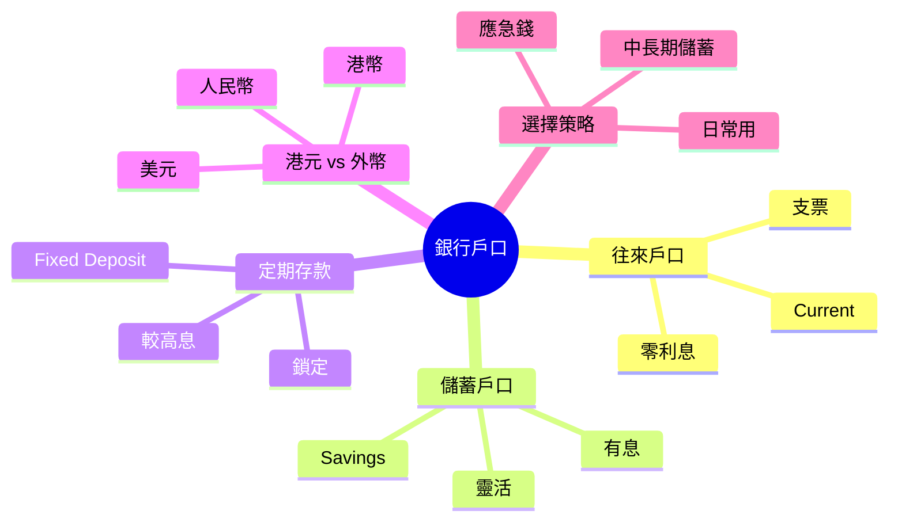
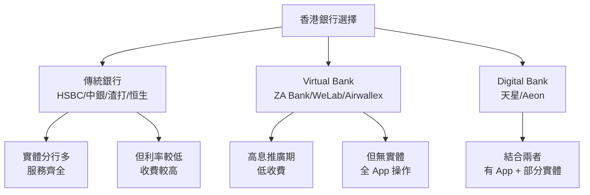

# Module 05: 銀行戶口: 往來/儲蓄/定期

Est. study time: 1h
Language: yue
Description: 香港銀行戶口種類、活期 vs 儲蓄 vs 定期、利息計算、選擇策略

## Knowledge Map

---

## Learning Objectives
- 區分香港常見銀行戶口種類 (往來/儲蓄/定期)
- 比較三者嘅利率、流動性、最低存款要求
- 解釋活期/定期/儲蓄利息點樣計算
- 識揀適合自己嘅戶口組合
- 解開「外幣戶口值唔值開」嘅疑問
- 避免常見戶口陷阱 (最低存款罰款/隱藏費用)

---

## Real-World Example

你 22 歲大學畢業, 第一份工, 第一次開銀行戶口。Sales 姐姐問你:「開邊種?」

- 往來戶口 (Current) — 處理日常 (出糧/八達通自動增值/繳費)
- 儲蓄戶口 (Savings) — 放儲蓄, 拎少少利息
- 定期存款 (Fixed Deposit) — 鎖住一段時間, 較高利息
- 外幣戶口 (Multi-Currency) — 放 USD/CNY, 投資/旅行用

你:「吓? 我得 $50,000 儲蓄, 要開咁多?」

現實係: 大部分人只需**1 個往來 + 1 個儲蓄**就夠, 定期/外幣係後續升級選項。但如果你唔知分別, 可能:
- 將所有錢放喺往來戶口 → 零利息 → 通脹蠶食購買力
- 將應急錢鎖定期 → 急用時罰息/取唔到
- 開咗外幣戶口但唔識匯率 → 蝕匯率差

呢個 module 幫你做「**識揀, 唔使多**」。

> **Think**: 你估香港一般儲蓄戶口年利率幾多?
>
> *Answer: 大部分銀行 0.01% - 0.5% (視乎銀行/戶口類型)。2024 年部分 virtual bank (e.g. ZA Bank, WeLab) 推廣期有 2-3% 但通常限時 + 限額。記住: 港元定存利率聯繫匯率跟美息, 2022-2023 美息高峰時部分銀行定存 4-5%。但 2024 開始減息, 港元定存回落。對一般人嚟講, 銀行利息唔係「投資」, 係「保本」。*

---

## Core Content

### Section 1: 銀行戶口 4 種基本類型

香港零售銀行主要提供 4 種戶口:

| 類型 | 用途 | 利率 | 流動性 | 最低結餘 |
|---|---|---|---|---|
| **往來戶口** (Current) | 日常收支 (糧/繳費/ATM) | 接近 0% | 即時 | 視乎銀行 ($0-10,000) |
| **儲蓄戶口** (Savings) | 短期儲蓄, 有少少息 | 0.01% - 1% | 即時 | 通常 $0 |
| **定期存款** (Fixed Deposit) | 中長期鎖定儲蓄 | 較高 (2-5% 視乎期) | 鎖定 (到期先攞) | 通常 $10,000+ |
| **外幣戶口** (Multi-Currency) | 持有外幣 (USD/CNY/JPY) | 視乎幣種 | 即時兌換 | 視乎銀行 |

**最常見組合**: 1 個往來 (日常) + 1 個儲蓄 (應急錢) + (optional) 1 個定期 (目標儲蓄)

> **Cloze**: "香港一般零售銀行主要提供 4 種戶口: {往來}、{儲蓄}、{定期}、{外幣}。"
>
> *Answer: 往來、儲蓄、定期、外幣*

### Section 2: 活期 vs 定期 利息

| 特性 | 活期 (往來/儲蓄) | 定期 (Fixed Deposit) |
|---|---|---|
| 利率 | 0.01% - 1% (低) | 2-5% (較高, 視乎期/銀行) |
| 提取 | 即時 (T+0) | 鎖定, 提前取要罰息 (可能 0 利息) |
| 最低存款 | 較低 ($0-10,000) | 較高 ($10,000+) |
| 通脹對沖 | 差 (追唔上通脹) | 較好 (短期內跑贏通脹) |

**例子** (以港元定存 3 個月, 4% 年利率計):
- 本金: $100,000
- 到期利息: $100,000 × 4% × (3/12) = $1,000
- 即係 3 個月拎 $1,000 利息 (未扣行政費)

**真實陷阱**: 很多銀行對「非活躍戶口」收取費用 (e.g. 月結餘低於 $5,000 收 $50/月)。要睇清楚 fee schedule。

> **Think**: 如果你儲蓄 $200,000, 應該全部放定存?
>
> *Answer: 唔應該。應該 split: 6 個月生活費 (約 $60,000) 放儲蓄戶口 (應急錢), 剩低 $140,000 拆做 3-6 個月定存 (到期 renew)。咁既保流動性 (急用攞到), 又拎較高息。全部鎖定定期 = 急用時冇錢 / 被罰息。*

### Section 3: 外幣戶口值唔值開?

外幣戶口 (Multi-Currency Account) 可以存 USD/CNY/JPY 等, 主要 3 個用途:

| 用途 | 例子 | 注意 |
|---|---|---|
| 投資 | 買美股/港股以外市場 | 匯率風險 |
| 旅行 | 去日本前換 JPY | 留意找換店 vs 銀行差價 |
| 對沖 | 分散單一貨幣風險 | 適合高資產人士 |

**新手建議**: 未做過投資/未去旅行前, **唔使開外幣戶口**。大部分港元定存 + 信用卡外幣功能已夠用。

**匯率隱藏成本**: 銀行買入/賣出價差 (Spread) 通常 0.5-1.5%, 即換 $10,000 USD 蝕 $50-150。找換店通常較平, 但要小心假鈔。

> **Predict**: 如果下個月港元減息 0.5%, 你嘅定存到期後續做, 利率會升定跌?
>
> *Answer: 跌。減息 = 銀行借貸成本降, 連帶存款利率都降。如果你有定存到期要 renew, 會以新利率計, 較之前低。相反, 如果加息, 续存會高過之前。所以: 減息周期 = 鎖短啲 (3 個月), 加息周期 = 鎖長啲 (12 個月) 鎖住高息。*

> **Spot the Mistake**: 「我準備去日本旅行, 銀行換 $30,000 HKD 換 JPY 比較安全, 因為銀行有牌。」
>
> 邊度錯?
>
> *Answer: 銀行有牌係事實, 但唔代表「最平」。找換店 (尤其旺角/中環) 通常 spread 較窄 (0.2-0.5%), 比銀行 (0.5-1.5%) 平。即係換 $30,000 HKD 銀行可能蝕 $150-450, 找換店蝕 $60-150。差異 $90-300, 夠食幾餐拉麵。建議: 先 compare 銀行同找換店, 用計算機計下真實 cost, 唔好假設「銀行最安全 = 最平」。*

### Section 4: 揀邊間銀行 + 戶口種類

香港主要銀行分 3 類:

**揀銀行 3 個考慮**:
1. **你嘅日常需要**: ATM 分行多唔多? 跨行轉帳使唔使錢?
2. **利率**: 定存利率 + 儲蓄利率
3. **優惠**: 開戶獎賞 (e.g. $200 cash coupon) + 推薦人獎賞

**新手推薦**:
- 傳統銀行 1 個 (返工常用, 提款方便)
- Virtual Bank 1 個 (高息儲蓄戶口, 應急錢放呢度)
- 唔使開第 3 個 (管理成本太高)

> **Cloze**: "新手揀銀行嘅建議: 傳統銀行 {1 個} + Virtual Bank {1 個} 就夠, 唔使開第 3 個。"
>
> *Answer: 1 個、1 個*

### Section 5: 戶口管理最佳實踐

**4 個原則**:

1. **自動轉賬**: 應急錢戶口設定每月自動由往來轉賬 (e.g. 出糧後即轉 20% 到儲蓄戶口)
2. **定期 review**: 每季 check 一次各戶口結餘, 調整比例
3. **唔好太多戶口**: 超過 4 個 (1 往來 + 1 儲蓄 + 1 定期 + 1 virtual) 難管理
4. **小心最低結餘罰款**: 部分銀行對「非活躍戶口」或「低結餘戶口」收費

**應急錢存放**: 放儲蓄戶口 (即時攞到), 唔好放定期 (急用要罰息)。

**目標儲蓄** (旅行/置業): 放定期較高息, 拆做幾份 (3 個月 / 6 個月 / 1 年) 避免全部同時到期。

> **Cloze**: "應急錢應該放 {儲蓄戶口} (即時攞到), 唔好放 {定期} (急用要罰息)。"
>
> *Answer: 儲蓄戶口、定期*

---

### Why This Matters

銀行戶口係你每日用嘅基礎工具, 但好少人主動去理解「我啲錢喺度拎幾多息」、「邊隻戶口最適合我」。結果:
- 應急錢放往來戶口 → 零利息
- 目標儲蓄放儲蓄 → 浪費定存高息
- 開咗外幣戶口但唔用 → 浪費管理

一個 30 歲打工仔, 假設平均戶口結餘 $100,000, 由 0.1% (儲蓄) 升到 3% (定存), 一年差 $2,900, 即係一個月一餐好嘅。**少少調整, 持續拎多。**

---

## Key Takeaways
- 香港銀行 4 種戶口: 往來/儲蓄/定期/外幣
- 往來零息但流動性高; 儲蓄少少息; 定期高息但鎖定
- 外幣戶口對新手非必要
- 應急錢放儲蓄 (即時攞), 目標儲蓄放定存 (高息)
- 唔好開超過 4 個戶口
- 自動轉賬 + 定期 review
- 找換店通常比銀行平, 旅行換錢要 compare

---

## Common Misconception

**「所有銀行都一樣, 揀最方便就得」**

錯。銀行之間差異可以好大: 1) 利率 (定存差 1-2% 年利率係常事); 2) 收費 (跨行轉帳 $0 vs $15); 3) 優惠 (新客 $200 cash coupon); 4) 服務 (實體 vs 全 App)。**唔好懶, 花 30 分鐘 compare 一次, 一年慳幾千蚊**。特別係有大額儲蓄 (>$100,000) 嘅人, 利率差異顯著。

---

## Spot the Mistake

你朋友阿明同你講:「我將所有儲蓄 $500,000 全部做 12 個月定存 4% 年利率, 一年拎 $20,000 息, 完美!」

邊度錯?

*Answer: 三個問題。1) **冇應急錢**: $500,000 全部鎖定, 急用時要提前取, 罰息 (可能 0 息) 或贖回費用。應保留 6 個月生活費 ($60,000-$100,000) 喺儲蓄戶口。2) **冇分散**: 全部 12 個月同期到期, 到時要一次處理, 麻煩。應拆做 3/6/12 個月, 每月有部分到期, 方便調整。3) **再投資風險**: 12 個月內如果減息, 到期 renew 利率會低過 4%, 損失後續 12 個月利息。應拆短啲, 靈活 renew。阿明嘅 strategy 短期睇高息, 長期睇鎖死 + 冇彈性, 唔係「完美」, 係「危險」。*

---

## Feynman Explain

(用一個 5 歲都明嘅故事解釋 3 種戶口。提示: 用「錢包 vs 豬仔錢罌 vs 定期存款箱」做類比。錢包 = 往來 (即拎即用, 冇息); 豬仔錢罌 = 儲蓄 (日日拎, 有少少息); 定期存款箱 = 鎖住一段時間, 較多息, 急開要扣。咁就係活期 vs 定期。)

---

## Reframe

(寫低你現有嘅銀行戶口: 邊間? 邊種? 結餘幾多? 利率幾多? 有冇最低結餘罰款? 然後諗: 1) 應急錢夠唔夠 6 個月生活費? 2) 目標儲蓄放咗邊度? 3) 開咗但冇用嘅戶口要唔要閂? 寫低你嘅 plan。)

---

## Drill
Take the quiz. MCQs test recall + application + scenario.

Run: `learn.sh quiz finance-basics-cantonese 5`
Run: `learn.sh cloze finance-basics-cantonese 5`
