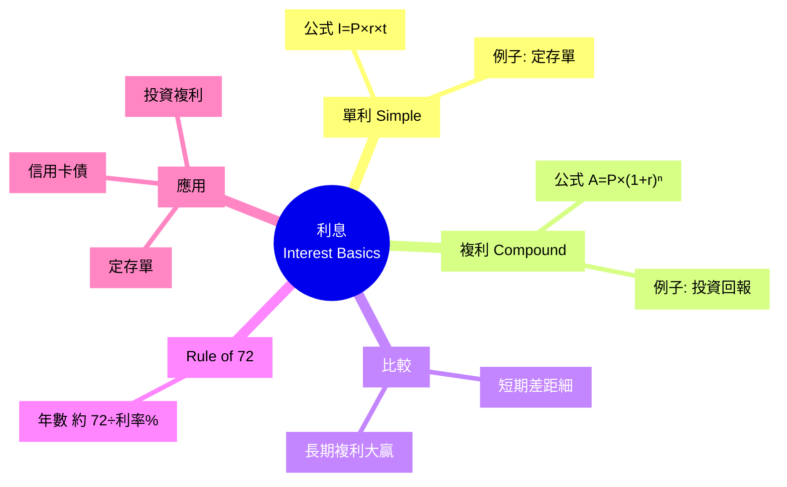
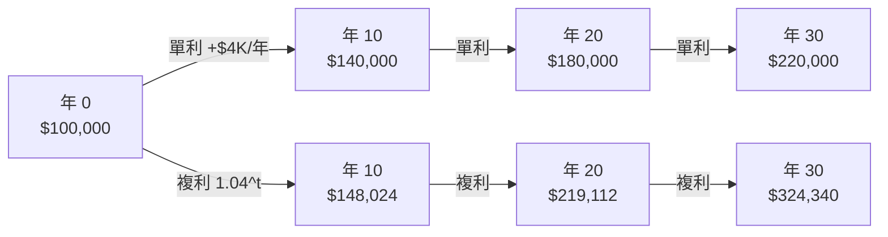

# Module 06: 利息(上): 單利同複利

Est. study time: 1h
Language: yue
Description: 利息基本概念、單利公式、複利公式、單 vs 複比較、複利滾存視覺化

## Knowledge Map



---

## Learning Objectives
- 解釋利息嘅本質 (借用錢嘅成本)
- 寫出單利公式 + 計單利例子
- 寫出複利公式 + 計複利例子
- 用數字比較單利 vs 複利 10/20/30 年差異
- 用 Rule of 72 心算本金翻倍時間
- 識別日常生活入面邊啲用單利, 邊啲用複利

---

## Real-World Example

2020 年 1 月, 阿明同阿華都拎 $100,000 出嚟, 分別用兩種方法處理:

**阿明** — 揀咗 5 年定存, 每年 4% **單利**。佢以為「穩陣」, 每年拎 $4,000 利息, 拎完擺入自己袋。

**阿華** — 揀咗 5 年定存滾存, 每年 4% **複利**。佢唔拎利息出嚟, 全部自動滾入本金再賺息。

5 年後 (2025 年 1 月):

- 阿明戶口: $100,000 本金 + $4,000 × 5 年 = **$120,000** (拎走晒)
- 阿華戶口: $100,000 × (1 + 4%)^5 = **$121,665** (冇拎走任何利息)

表面睇, 阿明同阿華差 $1,665 (1.4%)。好似唔大?

但如果將場景拉長, 假設阿明年年照樣拎 $4,000 出嚟使咗佢 (拎走咗嘅利息唔會自己生息, 本金一直得返 $100,000), 而阿華繼續複利滾存:

20 年後:
- 阿明: $100,000 本金 + $4,000 × 20 年 = **$180,000**
- 阿華: $100,000 × (1.04)^20 = **$219,112**
- 差距 $39,112 (阿華多 22%)

30 年後 (e.g. 25 歲開始, 55 歲先攞):
- 阿明: $100,000 本金 + $4,000 × 30 年 = **$220,000**
- 阿華: $100,000 × (1.04)^30 = **$324,340**
- 差距 $104,340 (阿華多 47%)!

差距由 5 年嘅 $1,665 爆到 30 年嘅 $104,000 — 呢個就係複利嘅威力: **時間越長, 威力越大**。拎走利息 = 殺死複利。

> **Think**: 點解單利同複利短期差距細, 長期差距大?
>
> *Answer: 因為複利嘅「利叠利」效應需要時間累積。第 1 年, 兩者一樣。第 2 年, 複利開始多賺 4% × 第 1 年利息 = 幾蚊。第 10 年, 已經差幾百蚊。到第 30 年, 差幾萬蚊。呢個就係「**複利曲線**」嘅特徵: 早期平, 後期指數爆發。相傳愛因斯坦講過: "Compound interest is the eighth wonder of the world." (呢句係咪真係佢講, 其實冇人肯定。)*

---

## Core Content

### Section 1: 利息嘅本質

利息 = 借用錢嘅成本 (對 borrower) 或 借出錢嘅回報 (對 lender)。

兩個基本變數:
- **本金** (Principal, P) — 借出/借入嘅錢
- **利率** (Interest Rate, r) — 通常以年利率 (Annual Percentage Rate, APR) 表達

第 3 個變數:
- **時間** (Time, t) — 通常以年計

利息分兩種:
- **單利** (Simple Interest) — 只用本金計息, 利息唔再賺息
- **複利** (Compound Interest) — 利息加回本金, 一齊再賺息

> **Cloze**: "利息分兩種: {單利} (只計本金) 同 {複利} (本金+利息再賺息)。"
>
> *Answer: 單利、複利*

### Section 2: 單利公式

單利公式:

```
單利總額 = P × r × t
```

**變數解釋**:
- P = 本金 (Principal)
- r = 年利率 (Annual rate, 小數, e.g. 4% = 0.04)
- t = 年數 (Time in years)

**例子 1**: 本金 $100,000, 利率 4%, 5 年
```
單利總額 = 100000 × 0.04 × 5
        = 100000 × 0.20
        = $20,000

到期總額 = 100000 + 20000 = $120,000
```

**例子 2**: 本金 $50,000, 利率 3.5%, 3 年
```
單利總額 = 50000 × 0.035 × 3
        = 50000 × 0.105
        = $5,250

到期總額 = 50000 + 5250 = $55,250
```

**單利常見應用**:
- 香港大部分銀行定存 (到期才計複利, 中間唔滾)
- 部分政府債券 (T-Bill)
- 私人貸款 (按月平息)

> **Spot the Mistake**: 「我攞 $100,000 做 3 年定存 4% 年利率單利, 第 2 年我會拎 $4,000 利息, 第 3 年又會拎 $4,000 利息, 3 年共 $12,000。」
>
> 邊度錯?
>
> *Answer: 計錯晒。單利係「本金 × 利率 × 時間」, 唔係「每年拎本金 × 利率」。3 年單利 = $100,000 × 4% × 3 = $12,000, 呢個啱。但你每年拎 $4,000 然後擺自己袋, 之後就唔再計息 (因為本金返咗 $100,000)。如果唔拎出嚟, 全部滾入第 2 年, 變咗複利, 第 2 年計 $104,000 × 4% = $4,160, 第 3 年再計 $108,160 × 4% = $4,326, 共 $12,486。單 vs 複差 $486 喺 3 年內, 但 30 年會差幾萬。記住: 拎走 = 單利效果; 唔拎 + 滾存 = 複利效果。*

### Section 3: 複利公式

複利公式:

```
複利總額 = P × (1 + r/n)^(n × t)
```

**進階變數**:
- n = 每年計息次數 (e.g. 1 = 年, 12 = 月, 365 = 日)

**最常見 (n=1, 每年計一次)**:
```
複利總額 = P × (1 + r)^t
```

**例子 1**: 本金 $100,000, 利率 4%, 5 年, 每年計息 (n=1)
```
複利總額 = 100000 × (1 + 0.04)^5
        = 100000 × 1.2166529
        = $121,665

利息 = 121665 - 100000 = $21,665
```

**例子 2**: 本金 $50,000, 利率 3.5%, 3 年, 每月計息 (n=12)
```
複利總額 = 50000 × (1 + 0.035/12)^(12 × 3)
        = 50000 × (1.0029167)^36
        = 50000 × 1.11055
        = $55,527

利息 = 55527 - 50000 = $5,527
```

**對比 例子 2 (單利 $5,250 vs 複利 $5,527)**: 3 年差 $277 (5.3%), 唔算大。

但 30 年就完全唔同: 假設本金 $50,000, 3.5% 複利
```
複利總額 = 50000 × (1.035)^30
        = 50000 × 2.8068
        = $140,340
```

30 年複利 = $90,340 利息, 對比單利 $52,500 利息, 差 $37,840 (72%)! **時間放大複利效應**。

> **Predict**: 你有 $10,000, 想 10 年後變 $20,000。需要年利率幾多? 用單利 vs 複利計, 邊個高啲?
>
> *Answer: 單利: $20,000 = $10,000 + $10,000 × r × 10 → r = 10% (需要 10% 年利率)。複利: $20,000 = $10,000 × (1+r)^10 → r = 7.18% (需要 7.18% 年利率)。**複利低 2.82% 已經達標**, 因為「利叠利」效應。所以: 想達到同樣終值, 複利需要嘅利率較低 = 較易達成。呢個就係退休規劃嘅核心: 早啲開始, 利率可以較低都夠。*

### Section 4: Rule of 72 — 心算翻倍時間

**Rule of 72** 係一個實用估算:

```
本金翻倍年數 ≈ 72 / 年利率(%)
```

**例子**:
- 利率 4%: 72 / 4 = **18 年** 本金翻倍
- 利率 6%: 72 / 6 = **12 年** 翻倍
- 利率 8%: 72 / 8 = **9 年** 翻倍
- 利率 12%: 72 / 12 = **6 年** 翻倍

**應用**: 假設你 25 歲有 $100,000, 投資回報 6% 年利率:
- 37 歲 ($200K), 49 歲 ($400K), 61 歲 ($800K) → 退休時

**Rule of 72 局限**: 只適合 5-12% 利率範圍, 太高/太低會有 ±10% 誤差。但作為心算工具, 已經好夠用。

> **Cloze**: "Rule of 72 公式: 本金翻倍年數 ≈ {72 / 年利率(%)}, 適合 {5-12%} 利率範圍。"
>
> *Answer: 72 / 年利率(%)、5-12%*

### Section 5: 視覺化複利滾存 — 30 年比較

阿明 (單利) vs 阿華 (複利) 30 年, 假設本金 $100,000, 利率 4%:



**關鍵觀察**:
- 年 10: 差距 $8K (5.7%)
- 年 20: 差距 $39K (22%)
- 年 30: 差距 $104K (47%)

**30 年複利威力**: 阿華多賺 $104,340, 夠買一部中型車 + 旅行。

> **Cloze**: "30 年後阿明 (單利) 有 $220,000, 阿華 (複利) 有 $324,340, 差距 $104,340, 反映 {時間放大複利效應}。"
>
> *Answer: 時間放大複利效應*

---

### Why This Matters

複利係**最有錢嘅普通人 (non-wealthy)** 唯一能夠追上 wealth gap 嘅工具。

- 巴菲特 (Warren Buffett) 99% 財富係 50 歲後賺嘅, 因為複利滾存
- 普通人 25 歲開始每月儲 $3,000 (8% 年回報), 65 歲退休有 ~$10.5M
- 普通人 35 歲先開始同樣儲蓄, 65 歲只有 ~$4.5M

**差 10 年, 終值差 2.3 倍**。所以: 越早開始, 複利幫你越多。

---

## Key Takeaways
- 利息分單利 (只計本金) 同複利 (本金+利息再賺息)
- 單利公式: P × r × t
- 複利公式: P × (1+r)^t (年計息) 或 P × (1+r/n)^(n×t) (多次計息)
- 短期 (1-3 年) 單 vs 複差距小, 長期 (20-30 年) 差距大
- Rule of 72: 本金翻倍年數 ≈ 72 / 利率(%)
- 越早開始儲蓄, 複利威力越大
- 定存常用單利 (拎走), 投資/退休用複利 (滾存)

---

## Common Misconception

**「利率低就無必要計, 反正賺唔到幾多」**

錯晒。1% 同 4% 看似差 3%, 30 年後差 100%! 例子: $100,000 本金, 30 年後:
- 1% 年利率: $134,785
- 4% 年利率: $324,340
- 差 $189,555 (1.41 倍)

所以: **任何正回報都比零好, 時間越長差越大**。即使只係 1% 嘅高息戶口, 30 年都跑贏 0% 嘅往來戶口。**唔好睇小「低回報 + 長時間」嘅威力**。

---

## Spot the Mistake

你朋友阿明同你講:「我啱啱做咗 1 年定存 $50,000, 4% 利率, 到期拎 $2,000 利息。下年我再做 1 年定存, 咪又係拎 $2,000 利息, 永遠都係 $2,000 啦, 複利根本幫唔到我。」

邊度錯?

*Answer: 錯晒, 佢將「每年拎走嘅利息」當成「複利無用」嘅證據。事實係: 1) 佢每年拎走 $2,000, 變咗「單利」效果 (本金永遠 $50,000, 永遠拎 $2,000)。2) 如果佢唔拎走, 滾入本金, 第 2 年本金變 $52,000, 計 $52,000 × 4% = $2,080 利息。第 3 年本金 $54,080, 利息 $2,163。30 年後, 單利累計拎 $60,000 (本金唔變, 拎 $2,000×30), 複利累計 $112,000 (本金加到 $162,000)。差 $52,000 (87% 增長)。複利嘅威力唔係「每年利息變多」咁簡單, 係「**本金同利息一齊滾**」嘅效果。拎走 = 殺死複利; 唔拎 = 養大複利。*

---

## Feynman Explain

(用 5 歲都明嘅故事解釋複利。提示: 用「雪球滾落山」做類比。雪球開始細 (本金), 滾落時黏雪變大 (利息加本金再賺息), 越滾越快 (複利加速), 落山底已經變大雪球 (長期累積)。唔好講數字, 用畫/動作表達。)

---

## Reframe

(寫低你現有嘅儲蓄/投資: 1) 邊啲用單利 (e.g. 定存)? 2) 邊啲用複利 (e.g. 投資戶口)? 3) 你有冇攞走啲利息 (殺死複利) 或者滾存 (養大複利)? 4) 你嘅 Rule of 72 翻倍時間係幾耐? 寫低你嘅 plan 同目標。)

---

## Drill
Take the quiz. MCQs test calculation + comparison + scenario.

Run: `learn.sh quiz finance-basics-cantonese 6`
Run: `learn.sh cloze finance-basics-cantonese 6`
