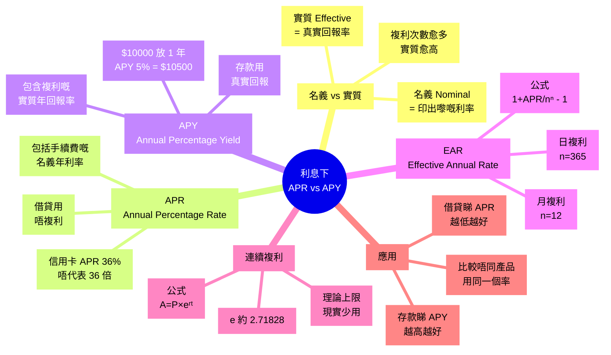
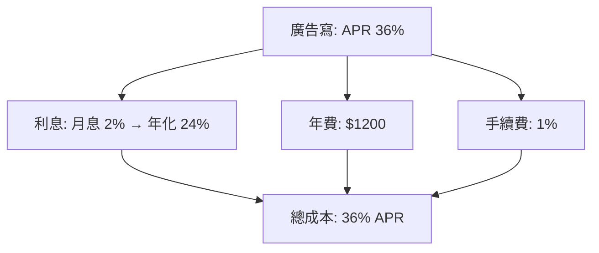

# Module 07: 利息(下)

Est. study time: 1h
Language: yue
Description: 點解「2% 月息」聽落平, 實際年利率係 26.8%。APR 同 APY 分別, EAR 計算, 同連續複利嘅極限

## Knowledge Map



---

## Learning Objectives
- 講出 APR 同 APY 嘅分別, 知道邊個會用邊個
- 用 EAR 公式計實際年回報率
- 解釋「2% 月息」點樣變成 26.8% 年利率
- 寫出連續複利公式, 解 e 嘅意義
- 比較唔同複利頻率, 揀最啱嘅借貸/存款產品

---

## Real-World Example

阿明想碌卡, 見到信用卡廣告寫「**2% 月息**」, 諗: 2% × 12 = 24%, 都仲可接受啦。即刻申請, 碌 $10000 買新電腦。

一年後, 阿明睇月結單: 總利息 = $2686! **$10000 借 1 年變 $12686, 實際利率 26.86%**, 唔係 24% 喎。

點解? 因為「2% 月息」嘅利息**每月加入本金再計息**(複利)。第一個月利息 $200, 第二個月 $200 + $200×2% = $204, 第三個月 $208.08... 越滾越大。

呢個就係 **APR vs APY** 嘅陷阱。**聽落嘅利率** (APR) 同**實際嘅利率** (APY/EAR) 可以差好遠。

> **Think**: 廣告寫「2% 月息」, 實際年利率 26.86%。如果寫「26.86% 年息」你會唔會即刻走? 點解銀行要寫月息唔寫年息?
>
> *Answer: 因為月息「2%」聽落似細數, 心理上容易接受。年息「26.86%」太驚, 用戶即刻走。呢個就係 marketing 心理戰, 法例要求寫 APR (年化), 但銀行行銷鍾意用月息。識得計 EAR 先唔會被呃。*

---

## Core Content

### Section 1: 名義 vs 實質 — 印出嚟 vs 真實回報

**名義利率 (Nominal Rate)**: 印喺宣傳單張嘅利率, 唔考慮複利次數。
**實質利率 (Effective Rate)**: 真實回報, 包括複利效應。

兩個關係: **複利次數愈多, 實質利率愈高**。因為利息會加入本金再賺利息, 雪球越滾越大。

```
$10000 放 1 年, 名義 12%:

                實質回報
  年複利 1 次:  $11200  (12.00%)
  半年複利:    $11236  (12.36%)
  季複利:      $11255  (12.55%)
  月複利:      $11268  (12.68%)
  日複利:      $11275  (12.75%)
  連續複利:    $11275  (12.75%, 極限)
```

**Trade-off**: 名義利率方便比較 (直接睇%), 實質利率先係真銀紙。借貸睇實質先唔會被呃。

> **Cloze**: "名義利率 (Nominal Rate) 係指 {印喺宣傳單張嘅利率}, 唔考慮 {複利次數}; 實質利率 (Effective Rate) 係指 {真實回報}, 包括 {複利效應}。"
>
> *Answer: 印喺宣傳單張嘅利率、複利次數、真實回報、複利效應*

> **Predict**: 阿明有兩個定存選擇: A 行「12% 年息, 年複利」, B 行「11.5% 年息, 月複利」。邊個實際回報高?
>
> *Answer: B 行實際高。因為月複利實質 12.13% (用下面公式計), 高過 A 行 12%。所以唔可以單睇名義, 要計 EAR 先知道真實回報。*

### Section 2: APR — 借貸用嘅「總成本年化」

**APR (Annual Percentage Rate)**: 借貸嘅「總成本年化」, 包括利息 **+ 手續費 + 其他費用**, 用**單利**計, 唔複利。



**特點**:
- **借貸用** (信用卡、按揭、貸款), 唔係存款
- 包括晒所有費用, 一個 number 包晒
- 假設單利, 唔考慮月複利效應 (所以叫「率」唔叫「回報」)
- 美國 Truth in Lending Act 規定要寫, 香港金管局都要求

> **Cloze**: "APR (Annual Percentage Rate) 係 {借貸嘅總成本年化}, 包括 {利息 + 手續費 + 其他費用}, 用 {單利} 計。"
>
> *Answer: 借貸嘅總成本年化、利息 + 手續費 + 其他費用、單利*

### Section 3: APY — 存款用嘅「真實年回報」

**APY (Annual Percentage Yield)**: 存款嘅**真實年回報率**, 包括複利效應。


**特點**:
- **存款用** (定存、活期、債券)
- **真實回報**, 包括複利
- 一個 number 直接講「你 1 年後拎幾多」
- 美國 Truth in Savings Act 規定要寫

**點解重要**: 兩間銀行, A 寫「4.8% 月複利」, B 寫「5% APY」。表面 B 高, 但實際可能 A 高過 B (因為 B 已 include 複利, A 仲要再計)。

> **Cloze**: "APY (Annual Percentage Yield) 係 {存款嘅真實年回報率}, 包括 {複利效應}。"
>
> *Answer: 存款嘅真實年回報率、複利效應*

### Section 4: EAR 公式 — 自己計實質利率

如果銀行只畀 APR, 你想知真實回報, 用 **EAR (Effective Annual Rate) 公式**:

```text
EAR = (1 + APR/n)ⁿ - 1
```

n = 每年複利次數:
- 年複利: n = 1
- 半年: n = 2
- 季: n = 4
- 月: n = 12
- 日: n = 365
- 連續: n → ∞

**例子: 「2% 月息」嘅信用卡**

```text
APR = 24% (2% × 12)
n = 12 (月複利)

EAR = (1 + 0.24/12)¹² - 1
    = (1 + 0.02)¹² - 1
    = 1.2682 - 1
    = 26.82%
```

**例子: 4.8% 年息, 月複利定存**

```text
APR = 4.8%
n = 12

EAR = (1 + 0.048/12)¹² - 1
    = (1 + 0.004)¹² - 1
    = 1.0492 - 1
    = 4.92%
```

即係實際回報 4.92%, 高過表面 4.8%。

> **Cloze**: "EAR 公式係 {(1 + APR/n)ⁿ - 1}, 入面 n 代表 {每年複利次數}。"
>
> *Answer: (1 + APR/n)ⁿ - 1、每年複利次數*

> **Predict**: 假設 5% APR, 邊個實際回報高? (a) 年複利 (b) 月複利 (c) 日複利
>
> *Answer: (c) 日複利 > 月複利 > 年複利。計: (a) 5.00%, (b) 5.12%, (c) 5.13%。差距細, 因為 5% 細, 高利率先明顯。*

### Section 5: 連續複利 — 理論上限

如果複利次數無限大 (n → ∞), 公式趨向一個自然常數:

```
A = P × eʳᵗ
```

e ≈ 2.71828 (自然對數底數), 係數學常數, 同 π 一樣, 唔係 variable。

**對比**:

```
$10000 放 1 年, 5% 名義利率:

  年複利:     $10500.00
  月複利:     $10511.62
  日複利:     $10512.67
  連續複利:   $10512.71
```

**觀察**: 月→日→連續, 差距越來越細。即係**超過月複利, 提升空間有限**。所以現實中月複利已經夠用, 連續複利主要係理論同金融 model 用。

> **Spot the Mistake**: 「連續複利回報無限大, 所以我啲錢放銀行愈多次複利愈好, 1 秒複利 1 次最好!」
>
> 邊度錯?
>
> *Answer: 錯晒。連續複利係 (n → ∞) 嘅**數學極限**, 唔係「次數無限大回報無限大」。實際計: $10000 × e^0.05 = $10512.71, 同日複利 ($10512.67) 只差 $0.04。再加密複利次數回報都係 $10512.71, 唔會無限大。e 係常數 (2.71828), 唔會變。*

### Section 6: 點揀? 借貸 vs 存款

**借貸** (睇 APR):
- 信用卡、按揭、私貸
- 越低越好
- 記得計 EAR 自己睇實際成本 (但通常 APR 已包費用, 直接比較 OK)

**存款** (睇 APY):
- 定存、活息戶口、債券
- 越高越好
- 唔同銀行寫法唔同, 要 APY 直接比

```text
$10000 放 1 年, 兩間銀行比較:

  A 行: 4.8% APR, 月複利 → APY = 4.92%
  B 行: 4.9% APY         → APY = 4.90%

  A 行實際高 (4.92% > 4.90%)
  → 揀 A 行
```

> **Cloze**: "借貸要睇 {APR}, 越低越好; 存款要睇 {APY}, 越高越好。"
>
> *Answer: APR、APY*

---

### Why This Matters

識得分 APR / APY / EAR, 借錢唔會被「月息 2%」呃, 存款唔會被「年息 5%」呃。呢啲數字每日影響你嘅真銀包。

特別係信用卡: APR 寫 36%, 唔代表年利息 36%, 因為月複利, 實際 (EAR) 約 42.6%。知道呢個差距, 你就識得準時找數, 唔好只還 min pay。

---

## Key Takeaways
- 名義利率 vs 實質利率: 實質包括複利, 永遠 ≥ 名義
- **APR**: 借貸用, 包費用, 單利計
- **APY**: 存款用, 包複利, 真實回報
- **EAR 公式**: (1 + APR/n)ⁿ - 1, 自己計實質回報
- 連續複利公式: A = P × eʳᵗ, 數學極限, 現實差異極細
- 「2% 月息」實際係 26.82% EAR, 比 24% 名義高
- 借貸睇 APR 低, 存款睇 APY 高

---

## Common Misconception

**「銀行寫嘅年利率就係我實際要俾/拎嘅利率」**

錯。寫嘅係**名義**, 包括:
- 唔同複利頻率 (月/季/年)
- 唔包 / 包手續費
- 唔包 / 包稅

實際成本/回報要用 EAR 公式自己計, 或者睇 APY (存款) / 攤還表 (借貸)。

---

## Spot the Mistake

你睇到兩張信用卡廣告:
- A 卡: 「月息 1.5%」
- B 卡: 「APR 20%」

你揀 A 卡, 因為「1.5% × 12 = 18% < 20%」。邊度錯?

*Answer: 錯咗 A 卡。A 卡實際 (EAR): (1 + 0.18/12)¹² - 1 = 19.56%, 已經接近 B 卡嘅 20%。但 A 卡月息 1.5% 唔包年費/手續費, 真正 APR 可能 22-25%, 仲貴過 B 卡。計 EAR 之餘, 一定要睇實際總成本 (APR 包括所有費用)。*

---

## Feynman Explain

(用 5 歲都明嘅故事解釋「點解月息 2% 等於年息 26.82%」。提示: 用「雪球滾落山」做 analogy, 雪球每次落地都大一圈, 最後比開始大好多。唔好提 e, 唔好提 log。)

---

## Reframe

(試下諗: 如果你間公司要向銀行借 $100 萬週轉, 你會點揀? (a) 最低 APR, (b) 最低月供, (c) 最低總還款額。三者會唔會唔同? 點解? 寫低你嘅諗法同取捨。)

---

## Drill
Take the quiz. MCQs test recall + application + scenario (calculation included).

Run: `learn.sh quiz finance-basics-cantonese 7`
Run: `learn.sh cloze finance-basics-cantonese 7`
