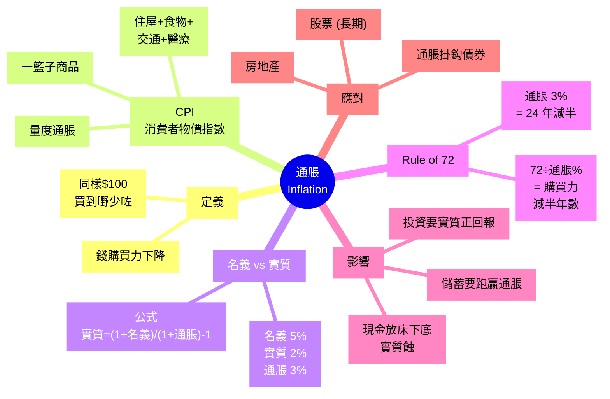
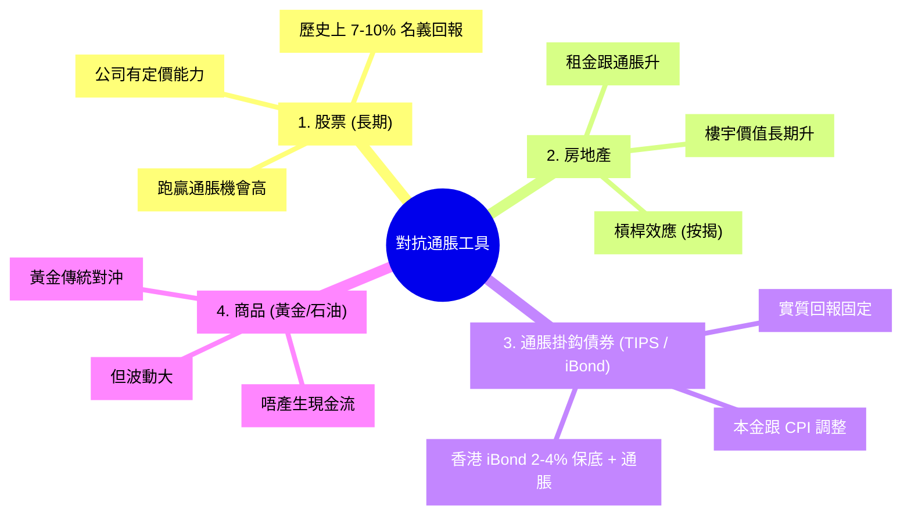

# Module 08: 通脹

Est. study time: 1h
Language: yue
Description: 點解 30 年後 $100 買唔到而家嘅 $100 嘢。CPI、實質回報、Rule of 72 點計錢幾時貶值一半

## Knowledge Map



---

## Learning Objectives
- 講出通脹嘅定義, 用日常例子解釋
- 寫出 CPI 點樣計算, 香港 CPI 包括啲咩
- 計實質回報率: 實質 = (1+名義)/(1+通脹) - 1
- 用 Rule of 72 計幾時購買力減半
- 點出通脹對儲蓄/投資嘅影響
- 列舉對抗通脹嘅工具 (TIPS/股票/房地產)

---

## Real-World Example

1985 年, 阿明爸爸用 $200 買咗部電視機 — 嗰陣茶餐廳午飯 $20 一餐, $200 等於 10 餐午飯。
2025 年, 阿明用 $2000 買部新電視 — 茶餐廳午飯 $60 一餐, $2000 等於 33 餐午飯。

**唔同嘢加價速度唔同**: 電視 40 年價錢變成 10 倍, 茶餐廳午飯「只」變成 3 倍價。但無論點計, 同一張 $200, 以前可以請 10 餐午飯, 而家只夠 3 餐 — **購買力實打實縮咗水**。呢個就係**通脹** — 整體嚟講錢越嚟越唔值錢。

**香港過去 30 年平均通脹 2-3%**。睇落好細, 但 Rule of 72 計: 72 ÷ 3 = 24 年, 即係 24 年後 $100 嘅購買力得返 ~$50。

> **Think**: 你阿媽成日講「以前 $100 好大使」, 以前 $100 等於而家幾多? (假設過去 30 年平均通脹 3%)
>
> *Answer: 30 年 3% 通脹 → 100 / (1.03)³⁰ = $41.10。即係以前 $100 等於而家 $41 嘅購買力。以前 $100 可以買 1 個月餸, 而家只可以買 12 日。呢個就係通脹嘅累積效應, 慢但穩定。*

---

## Core Content

### Section 1: 乜嘢係通脹?

**通脹 (Inflation)**: 一般物價持續上升, 令**錢購買力下降**。

```
  1985 年: $100 買 10 個叉燒飯
  2025 年: $100 買 3 個叉燒飯
  
  通脹率 ≈ 每年 3-4% (叉燒飯)
```

**點解會通脹**:
- **需求拉動**: 太多錢追太少嘢 (e.g. 防疫後報復式消費)
- **成本推動**: 原材料/工資加價, 轉嫁消費者 (e.g. 石油漲, 運輸加)
- **貨幣供應**: 中央銀行印太多錢, 錢唔值錢 (e.g. 辛巴威)
- **預期**: 預期通脹, 商家加價, 工人要求加薪, 自我實現

> **Cloze**: "通脹 (Inflation) 係指一般物價持續上升, 令{錢購買力下降}。主要原因包括 {需求拉動}、{成本推動} 同 {貨幣供應}。"
>
> *Answer: 錢購買力下降、需求拉動、成本推動、貨幣供應*

### Section 2: CPI 點樣計?

**CPI (Consumer Price Index, 消費者物價指數)**: 政府用嚟量度通脹嘅指數。

```
香港 CPI 一籃子 (政府統計處):

  住屋        34%  ← 最大
  食物        27%
  交通        7%
  醫療        7%
  教育        5%
  衣履        3%
  耐用物品    4%
  雜項服務    9%
  通訊        3%
  娛樂        3%
  ──────────────
  合計       100%
```

**點計**:
1. 揀一籃子商品 (e.g. 住屋 34% + 食物 27% + ...)
2. 每季計呢籃子嘅平均價格
3. 同期比較 → 通脹率

> **Cloze**: "香港 CPI 包括 {住屋 34%}、{食物 27%}、{交通 7%}、{醫療 7%} 等。最大比重係 {住屋}。"
>
> *Answer: 住屋 34%、食物 27%、交通 7%、醫療 7%、住屋*

> **Predict**: 通脹 5% 年, 屋苑管理費加 8%, 食品加 3%, 交通加 4%。CPI 大約加幾多?
>
> *Answer: 加權平均: 0.34×8% + 0.27×3% + 0.07×4% + 0.32×4% (其他) ≈ 5.09%。住屋比重大所以拉高。*

### Section 3: 名義 vs 實質回報

**名義回報**: 投資/存款寫嘅數字 (e.g. 銀行定存 5%)。
**實質回報**: 扣咗通脹之後嘅「真正」回報。

```
實質回報公式:

  實質 = (1 + 名義) / (1 + 通脹) - 1
  
  簡化版 (通脹細):
  實質 ≈ 名義 - 通脹
```

**例子**:
- 銀行定存 5%, 通脹 3%
- 實質 = (1.05 / 1.03) - 1 = 1.94% ≈ 2%
- 即係 10000 蚊定存, 名義多 $500, 通脹蝕咗 $300, **實質淨賺 $194**

**殘酷真相**:
- 現金擺床下底: 名義 0%, 通脹 3% → 實質 -3% (蝕)
- 銀行活期 0.5%, 通脹 3% → 實質 -2.5% (蝕)
- 銀行定存 3%, 通脹 3% → 實質 0% (打平)
- 銀行定存 5%, 通脹 3% → 實質 1.94% (微賺)
- 投資股票 8%, 通脹 3% → 實質 4.9% (合理)

> **Cloze**: "實質回報公式係 {(1 + 名義) / (1 + 通脹) - 1}。當通脹 {3%}、銀行定存 {5%} 時, 實質回報約 {1.94%}。"
>
> *Answer: (1 + 名義) / (1 + 通脹) - 1、3%、5%、1.94%*

### Section 4: Rule of 72 — 幾時購買力減半?

**Rule of 72**: 簡易估算方法, 計算**幾多年後購買力減半**。

```
公式:
  年數 ≈ 72 ÷ 通脹率%

例子:
  通脹 3% → 24 年後購買力減半
  通脹 6% → 12 年後減半
  通脹 12% → 6 年後減半
  通脹 0% (無通脹) → 永遠唔變
```

**對比 (用 Rule of 72 計)**:

```
$100 喺唔同通脹率下嘅購買力:

  通脹 0%   : 永遠 = $100
  通脹 1%   : 72 年後 = $50
  通脹 2%   : 36 年後 = $50
  通脹 3%   : 24 年後 = $50  (香港平均)
  通脹 5%   : 14 年後 = $50
  通脹 10%  : 7 年後 = $50
```

**Rule of 72 真正公式**: 真實係 `log(2) / log(1+r) × 100 ≈ 69.3 / r` (用 log 2 ≈ 0.693, 乘 100 = 69.3)。用 72 因為易記 + 對小利率 (< 10%) 夠準。

> **Cloze**: "Rule of 72 用嚟計 {幾多年後購買力減半}。香港通脹 3%, 即係 {24 年} 後 $100 只值 $50。"
>
> *Answer: 幾多年後購買力減半、24 年*

> **Predict**: 辛巴威 2008 年通脹 89 sextillion percent, $1 一年後值幾多?
>
> *Answer: 接近 0。Rule of 72: 72 / (89×10²¹) ≈ 0 秒。即係下一秒 $1 都唔值錢。法幣完全崩潰, 返璞歸真用外幣 (USD) 或以物易物。呢個就係法幣失去信用嘅終局。*

### Section 5: 通脹對儲蓄/投資嘅影響

**現金/活期**: 通脹率 3% 即係每年蝕 3% 購買力。10 年蝕 26%。

```
$100000 放床下底, 通脹 3%:

  1 年後  購買力 = $97,000
  5 年後  購買力 = $86,000
  10 年後 購買力 = $74,000
  24 年後 購買力 = $50,000
```

**投資 (長期)**: 股票市場歷史平均回報 ~7-10% 名義, 扣 2-3% 通脹, 實質 5-7%。

```
$100000 投資股票 30 年 (實質 6%):

  30 年後 = $100000 × (1.06)³⁰ = $574,000
  
  名義 (連通脹): ≈ $1,200,000
  實質: $574,000
```

**退休規劃要點**: 計退休金要計**實質**回報, 唔係名義。目標 1000 萬 (今日錢), 30 年後通脹 3% 計要 ~2400 萬 (未來錢)。

> **Cloze**: "$100000 放床下底, 通脹 3%, 10 年後購買力剩 {約 $74,000}。投資股票 30 年 (實質 6%), 變成 {約 $574,000}。"
>
> *Answer: 約 $74,000、約 $574,000*

### Section 6: 點對抗通脹?

通脹係**長期投資者最大敵人**, 但都有對沖工具:



**最簡單方法**: 投資**追蹤指數 ETF** (e.g. 盈富基金 2800.HK), 已經平均 7-10% 名義回報, 跑贏通脹。

> **Cloze**: "對抗通脹嘅常見工具包括 {股票}、{房地產}、{通脹掛鈎債券 (iBond)} 同 {商品 (黃金)}。最簡單係 {投資追蹤指數 ETF}。"
>
> *Answer: 股票、房地產、通脹掛鈎債券 (iBond)、商品 (黃金)、投資追蹤指數 ETF*

---

### Why This Matters

通脹係**最隱形嘅稅**。政府冇話加你稅, 但你啲錢年年縮水。30 年後, 你以為儲咗 100 萬好安全, 實際購買力可能得 50 萬。

**呢個就係「現金最危險」嘅原因**。你唔蝕錢 (名義), 但你蝕購買力 (實質)。唯一保護方法: **投資**, 跑贏通脹。

---

## Key Takeaways
- 通脹 = 一般物價持續上升, 令錢購買力下降
- **CPI** = 消費者物價指數, 香港住屋 34% + 食物 27% + ...
- **實質回報** = (1+名義)/(1+通脹) - 1
- **Rule of 72** = 72 ÷ 通脹% = 購買力減半年數 (香港約 24 年)
- 現金放床下底 = 每年實質 -3% (通脹 3%)
- 對沖工具: 股票 / 房地產 / iBond / 黃金
- 最簡單對沖: 投資追蹤指數 ETF (e.g. 盈富 2800.HK)

---

## Common Misconception

**「通脹只係啲物價加咗少少, 影響好細, 唔使理」**

錯。3% 通脹 24 年後 $100 變 $50, 影響巨大。現金儲蓄最大敵人就係通脹。$1M 現金 30 年後實質只值 ~$400K, 唔投資等於慢慢蝕。

---

## Spot the Mistake

你阿明 2020 年存咗 $500,000 喺銀行 5 年定存, 利率 4%, 通脹 3%。佢諗住 5 年後拎 $500K × 1.04⁵ ≈ $608,326。佢好開心, 覺得賺咗 $108K。

邊度錯?

*Answer: 錯晒, 佢只睇名義, 冇睇實質。正確計法: 實質年回報 = (1.04/1.03) - 1 ≈ 0.97%, 5 年累計 (1.04/1.03)⁵ - 1 ≈ 4.95%。佢拎到嘅 $608,326 喺 5 年後, 購買力只等於今日嘅 $608,326 ÷ (1.03)⁵ ≈ $525,000。所以佢實際淨賺約 $25,000 (今日錢), 唔係 $108K。睇通脹前, 所有回報都係「假回報」。*

---

## Feynman Explain

(用一個 5 歲都明嘅故事解釋「乜嘢係通脹, 點解錢會縮水」。提示: 從「你嘅玩具由 10 蚊變 15 蚊」講起, 講到「你阿爸阿媽以前儲嘅錢, 而家買少咗好多嘢」。唔好用 CPI, 唔好用實質回報, 用日常例子。)

---

## Reframe

(試下諗: 如果你阿媽 1990 年儲咗 $100 萬 (當時可以買層公屋), 而家呢 $100 萬 (現金放床下底) 喺 2025 年值幾多購買力? 同 1990 年比較, 佢實際蝕咗幾多? 用 Rule of 72 計, 幾時 $100 萬先會蝕到一半? 寫低你嘅諗法。)

---

## Drill
Take the quiz. MCQs test recall + application + scenario (calculation included).

Run: `learn.sh quiz finance-basics-cantonese 8`
Run: `learn.sh cloze finance-basics-cantonese 8`
