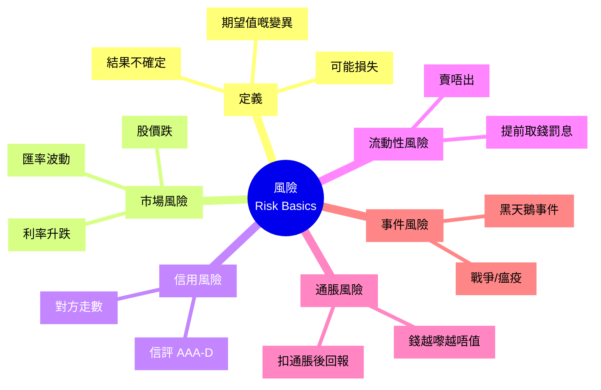

# Module 09: 風險(上): 定義同類型

Est. study time: 1h
Language: yue
Description: 風險嘅定義、市場風險/信用風險/流動性風險/通脹風險/事件風險。初學者導論

## Knowledge Map

---

## Learning Objectives
- 解釋「風險」嘅 3 個構成 (不確定 + 損失 + 變異)
- 列出 5 種主要風險類型, 各配一個生活例子
- 區分「市場風險」同「信用風險」嘅分別
- 解釋「通脹風險」點樣蠶食購買力
- 認識「黑天鵝事件」呢個 concept

---

## Real-World Example

你阿媽 60 歲, 退休, 筆錢 200 萬。一日, 銀行 customer service 同佢講:「陳太, 我哋有兩隻 plan 俾你揀。Plan A 利率 5% 確定; Plan B 期望利率 10%, 但唔保本 — 蝕最多可以蝕 30%。」

阿媽望住你, 問:「你覺得呢隻 plan 啱唔啱我?」

呢個就係**風險**問題。Plan A 確定但回報低, Plan B 期望回報高但有損失風險。邊個啱? 視乎:
- 阿媽承唔承受得到蝕 30% (= 蝕 60 萬) ?
- 佢使唔使短期動用呢筆錢?
- 佢其他收入夠唔夠 cover 生活?

呢個 module 就係學**點樣拆解呢類問題** — 用 5 種風險 framework 分析。

> **Think**: 你覺得阿媽應該揀 Plan A 定 Plan B? 為咩?
>
> *Answer: 視乎情況 — 如果阿媽完全唔承受得到蝕錢 (蝕少少都瞓唔著), 揀 Plan A。如果佢有其他收入 + 應急錢, 唔需要短期動用, 同埋佢 plan 擺 10 年以上, 揀 Plan B 因為長期期望回報高。但呢個答案本身涉及風險承受度, 我哋 module 10 會詳細教 Sharpe ratio 同風險承受度嘅量度法。*

---

## Core Content

### Section 1: 乜嘢係風險?

一般人以為「風險 = 蝕錢」。其實風險係 3 個 element 嘅結合:

| Element | 解釋 | 例子 |
|---|---|---|
| **不確定** | 結果未知 | 股票下年升定跌? 唔知 |
| **損失** | 結果可能係負面 | 跌咗 30% |
| **變異** | 結果範圍闊 | 樂觀 20% 升, 悲觀 30% 跌 |

3 個 element 齊全先叫「風險」。如果**結果確定** (例如定存利率 3%), 冇風險。如果**只有不確定, 冇損失** (例如中彩票, 不確定但結果只會好), 唔算風險 (叫「投機」或「機會」)。

> **Cloze**: "風險 3 個 element 係 {不確定}、{損失} 同 {變異}。3 個齊全先叫風險。"
>
> *Answer: 不確定、損失、變異*

### Section 2: 5 種主要風險類型

| 類型 | 影響 | 主要來源 | 例子 |
|---|---|---|---|
| **市場風險** | 資產價格波動 | 股票/債/匯率 | 2020 疫情股災, 跌 30% |
| **信用風險** | 對方走數 | 借錢俾人/債券 | 公司債違約, 投資者血本無歸 |
| **流動性風險** | 套唔到現 | 鎖定資產 | 定期存款提前取要罰息 |
| **通脹風險** | 購買力下降 | 通脹高過回報 | 1997 阿根廷通脹 200% |
| **事件風險** | 黑天鵝 | 戰爭/瘟疫/政策 | 911, COVID, 銀行倒閉 |

> **Predict**: 假設你 30 歲, 買咗層樓自住, 借 30 年按揭。同時你買咗 100 萬股票基金。**邊種風險對你影響最大?**
>
> *Answer: 多種風險混合 — (1) 樓按利率上升 = 市場風險 (借貸成本); (2) 股票基金股災 = 市場風險 (資產價格); (3) 通脹 = 雖然對樓按債務有利 (通脹蠶食債務實際價值), 但對現金流不利。**事件風險** (例如自己失業/大病) 影響最大, 因為會斷供。退休 planning 嘅重點就係 hedge 呢啲風險。*

### Section 3: 市場風險 (Market Risk)

市場風險 = 資產價格因市場波動而損失嘅風險。包括:

- **股票市場**: 牛市/熊市循環, 一日可以跌 5-10%
- **利率市場**: 加息周期, 債價跌
- **匯率市場**: USD/HKD 短期可以郁 1-2%
- **商品市場**: 油價/金價波動

**量化**: 市場風險通常用**標準差 (Std Dev)** 量度。例如恒指歷史年回報平均 ~10%, 標準差 ~25%, 即係 1 個 std dev 範圍 (10% − 25% = −15% ~ 10% + 25% = +35%) 覆蓋大約 68% 機會 (詳見 module 10)。

> **Cloze**: "市場風險主要來源包括 {股票市場波動}、{利率變動}、{匯率波動} 等。"
>
> *Answer: 股票市場波動、利率變動、匯率波動*

### Section 4: 信用風險 (Credit Risk)

信用風險 = 對方 (債務人) 唔還錢嘅風險。

**主要場景**:
- **借錢俾朋友**: 無抵押, 朋友走數你血本無歸
- **買公司債**: 公司破產, 債券變廢紙 (2008 Lehman)
- **銀行存款 (理論上)**: 銀行倒閉 (香港存款保障計劃 2024 年 10 月起上限 80 萬港元, 美國 FDIC 25 萬美元)

**信評機構** (Moody's, S&amp;P, Fitch) 將債券信評分級:
- **AAA/Aaa**: 最高評級, 違約率近 0
- **AA/Aa**: 高質素
- **BBB/Baa**: 投資級最低
- **BB/Ba 以下**: 投機級 (junk bond), 違約率高

> **Spot the Mistake**: 「我買咗 AAA 評級嘅公司債, 所以零風險。」
>
> 邊度錯?
>
> *Answer: AAA 係「信評最高」, 唔係「零風險」。即使 AAA 公司都有違約可能 (2008 雷曼 A2 級, 1998 安然 BBB, 跌落 junk 後違約)。信評只反映**相對違約率**, 唔係「絕對安全」。而且仲有市場風險/利率風險等其他風險疊加, 唔可以當零風險處理。*

### Section 5: 流動性 + 通脹 + 事件風險

**流動性風險**: 想套現但套唔到嘅風險。
- 定期存款: 提前取要罰息 (蝕幾個月利息)
- 房地產: 樓市差時, 半年都賣唔出
- 小盤股: 每日成交少, 大手沽出價跌 20%

**通脹風險**: 通脹高過你回報, 購買力蠶食。
- 假設定存 3%, 通脹 5%, 實質回報 -2% (蝕)
- 1997-2000 阿根廷通脹 200%, 存款 1 年後購買力跌一半

**事件風險 (黑天鵝)**: 罕見但影響巨大嘅事件。
- 911 恐襲: 美股停市 4 日
- COVID 2020: 環球股災, 失業率飆升
- 2022 俄烏戰爭: 油價爆升, 通脹

> **Think**: 你阿媽擺 200 萬喺定存 3%, 同時通脹 4%。**一年後, 阿媽實際係賺定蝕?**
>
> *Answer: 蝕。名目回報 3%, 通脹 4%, 實質回報 = (1+3%)/(1+4%) - 1 ≈ -0.96%。即係 200 萬一年後, 表面有 206 萬, 但購買力只等於今日嘅 198 萬。**2 萬蚊購買力消失咗**。呢個就係通脹風險。*

---

### Why This Matters

理財唔識風險, 等於揸車唔識睇倒後鏡。你可能好努力儲蓄, 但通脹 + 一次股災 + 一次黑天鵝事件, 30 年後發現原來你跑輸晒。

呢個 module 教嘅 5 種風險, 之後會用嚟:
- Module 10: 量度風險 (Sharpe ratio)
- Module 11-12: 投資工具嘅風險分類
- Module 19-20: 資產配置 (diversification 降風險)
- Module 23-24: 保險 (對沖事件風險)
- Module 27-28: 常見財務謬誤 (loss aversion 等)

---

## Key Takeaways
- 風險 = 不確定 + 損失 + 變異, 3 個齊全先叫風險
- 5 種主要風險: 市場 / 信用 / 流動性 / 通脹 / 事件
- 市場風險: 資產價格波動, 用 std dev 量度
- 信用風險: 對方走數, 信評 AAA-D 分級, 唔等於零風險
- 流動性風險: 套現困難, 提前取錢罰息
- 通脹風險: 購買力蠶食, 名目回報扣通脹 = 實質回報
- 事件風險: 黑天鵝, 罕見但影響巨大, 對沖靠保險 + 分散

---

## Common Misconception

**「定存冇風險」**

錯。定存有 3 種風險:
1. **通脹風險**: 利率 3%, 通脹 4% = 實質蝕 1%
2. **流動性風險**: 提前取罰息
3. **信用風險 (罕見)**: 銀行倒閉 (香港 80 萬存款保障)

冇任何投資係「完全零風險」。最 safe 嘅定存都有購買力風險。

---

## Spot the Mistake

你同同事講:「我全部錢擺喺美元定期, 因為美元係世界儲備貨幣, 零風險。」

邊度錯?

*Answer: 至少有 3 個錯。(1) 美元係儲備貨幣唔代表美元資產零風險 — 美國國債信評 2011 跌落 AA+, 違約率非零。(2) 匯率風險: USD/HKD 雖然聯繫匯率, 但 USD/EUR, USD/JPY 會郁, 如果你將來搬去外國, 購買力會變。(3) 通脹風險: 美國通脹 2022 年 9.1%, 美元定存 4% 都唔夠對沖。**冇任何單一貨幣 + 單一工具係零風險**, 必須靠分散 + 對沖。*

---

## Feynman Explain

(用一個 5 歲都明嘅故事解釋「乜嘢係風險」。提示: 從「行馬路過唔過馬路」講起, 講到「唔行 = 0 風險但 0 進步, 行錯方向 = 大風險, 行對方向 = 大回報」。用日常嘢做 analogy。)

---

## Reframe

(試下諗: 你而家 25 歲, 剛儲到第一桶金 10 萬。你會點配置? 全部定存? 買股票? 買樓? 答之前先諗下: 5 種風險入面, 邊種對你影響最大? 你有咩對沖工具? 寫低你嘅諗法。)

---

## Drill
Take the quiz. MCQs test recall + application + scenario.

Run: `learn.sh quiz finance-basics-cantonese 9`
Run: `learn.sh cloze finance-basics-cantonese 9`
