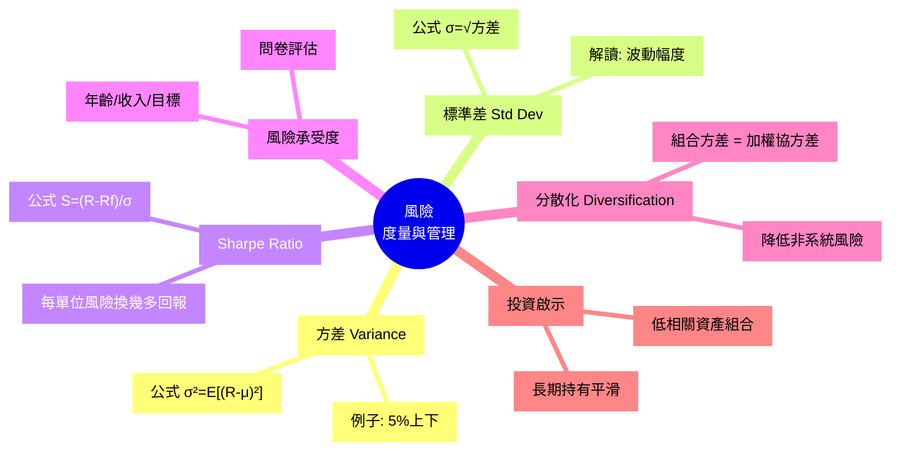

# Module 10: 風險(下)

Est. study time: 1h
Language: yue
Description: 風險嘅數字度量(方差、標準差)、Sharpe Ratio、風險承受度、分散化點樣降低組合風險

## Knowledge Map



---

## Learning Objectives
- 用方差同標準差量化一隻資產嘅波動
- 解讀 Sharpe Ratio, 比較唔同基金嘅風險調整回報
- 知道自己嘅風險承受度, 配對適合嘅資產組合
- 用分散化原理降低組合嘅非系統風險
- 避開常見誤解: 高回報 = 高風險(只係平均, 唔係必然)

---

## Real-World Example

你睇緊兩個基金:
- 基金 A: 過去 5 年平均回報 8%, 標準差 5%
- 基金 B: 過去 5 年平均回報 12%, 標準差 18%

**直覺**: B 回報高, 揀 B?

**現實**: B 嘅波動大 3.6 倍(18% vs 5%), 你可能 1 年輸 20%, 下年先賺 30%。咁嘅旅程你頂唔頂到?

呢個 module 教你用**數字**答呢個問題, 唔靠感覺。

---

## Core Content

### Section 1: 方差 (Variance) — 點樣量化波動

「波動」係 risk 最直接嘅體驗。方差就係量化「平均賺 $X 周圍, 實際上會偏離幾多」嘅數字。

```
公式: σ² = E[(R - μ)²]

其中:
  R  = 實際回報
  μ  = 平均回報
  E  = 期望值(平均)
  σ² = 方差
```

**步驟**:
1. 計每月實際回報 R₁, R₂, ..., R₁₂
2. 計平均 μ = (R₁+...+R₁₂) / 12
3. 每個月計 (Rᵢ - μ)²
4. 平均晒, 就係方差

**例子**: 阿明個 ETF 12 個月回報:
```
月份  回報    偏離μ   偏離²
 1    +5%    +1%    0.01%
 2    +3%    -1%    0.01%
 3    +8%    +4%    0.16%
 4    +2%    -2%    0.04%
 5    -3%    -7%    0.49%
 6    +6%    +2%    0.04%
 7    +4%    0%     0.00%
 8    +1%    -3%    0.09%
 9    +7%    +3%    0.09%
10    +5%    +1%    0.01%
11    +3%    -1%    0.01%
12    +4%    0%     0.00%
─────────────────────────
平均 μ = +4%
方差 σ² = 0.95 / 12 ≈ 0.079% (月)
```

**解讀**: 月回報平均偏離 0.28% (即 √0.079% ≈ 0.28%)。

> **Think**: 0.28% 月波動, 年化係幾多? (提示: 年方差 ≈ 月方差 × 12, 年標準差 = √年方差)
>
> *Answer: 年方差 ≈ 0.079% × 12 = 0.95%, 年標準差 = √0.95% ≈ 0.97% (即年波動約 ±1%, 算好穩定嘅資產)*

### Section 2: 標準差 — 大家慣常用嘅指標

方差有個問題: 單位係「百分比嘅平方」, 唔直觀。標準差就係**開方**返出嚟, 變返做百分比。

```
公式: σ = √方差

σ (sigma) 喺財經 = 標準差
```

**同一例子**: 月方差 0.079% → 月標準差 = √0.079% ≈ 0.28%。

**解讀**:
- 月標準差 0.28% → 月回報通常喺 μ ± 0.28% 範圍 (即 +3.7% ~ +4.3%)
- 年標準差 ~1% → 年回報通常喺 4% ± 1% (即 3% ~ 5%)

**常見標準差數字** (年化):
| 資產類別 | 年標準差 | 感覺 |
|---|---|---|
| 國庫券 | < 1% | 幾乎零波動 |
| 投資級別債 | 3-8% | 細波動 |
| 大盤指數 (S&amp;P 500) | 15-20% | 中等波動 |
| 個股 / 加密幣 | 40-100%+ | 極波動 |

> **Cloze**: "將方差開方就係 {標準差}, 單位同回報一樣係百分比, 比方差易解讀。"
>
> *Answer: 標準差*

### Section 3: Sharpe Ratio — 風險調整後嘅回報

**問題**: A 賺 8% σ=5%, B 賺 12% σ=18%。邊個「抵買」?

**Sharpe Ratio** 答呢個問題: **每承擔 1 單位風險, 賺到幾多額外回報**。

```
公式: S = (R - Rf) / σ

其中:
  R  = 資產回報 (e.g. 12%)
  Rf = 無風險利率 (e.g. 4%, 用國庫券)
  σ  = 標準差 (e.g. 18%)
  S  = Sharpe Ratio
```

**例子** (延續上面):
- A: S = (8% - 4%) / 5% = 0.8
- B: S = (12% - 4%) / 18% = 0.44

**結論**: A 雖然回報低, 但**每承擔 1 單位風險, 賺到嘅回報多過 B**。A 比較抵。

**經驗法則**:
| Sharpe | 評級 |
|---|---|
| < 0 | 差過擺現金 |
| 0 - 1 | 一般 |
| 1 - 2 | 好 |
| 2 - 3 | 非常好 |
| > 3 | 懷疑(可能算錯) |

> **Predict**: 假設 C 賺 15% σ=25%, 同樣 Rf=4%, 預期 Sharpe 大概幾多? 比較 B 邊個好?
>
> *Answer: S = (15-4) / 25 = 0.44, 同 B 一樣。B 同 C 嘅「風險調整回報」一樣, 但 C 波動更大 — 唔見得 C 比 B 好揀。*

### Section 4: 風險承受度 — 你頂到幾大波動

唔同人嘅風險承受度唔同, 取決於:
- **年齡**: 30 歲有 30 年 recovery, 承受度較高; 60 歲就低啲
- **收入穩定性**: 打工 vs 自由業
- **家庭負擔**: 有幾多 dependents
- **目標時限**: 5 年後要用錢 vs 30 年後
- **心理質素**: 跌 30% 你瞓唔瞓得著

**測試方法**: 好多銀行 / 券商提供 risk tolerance questionnaire。誠實答, 唔好「以為自己頂到」。

**錯誤示範**:
- 2008 金融海嘯, 好多 60+ 退休人士因為「以為自己保守」, 結果買咗 80% 股票, 跌 40% 先發現頂唔順
- 2015 中國股災, 好多新手用「投資 5 年閒錢」買埋槓桿 ETF, 跌 50% 斬倉

> **Spot the Mistake**: 「我 28 歲, 收入穩定, 有 20 年時間。我全部身家買 Bitcoin, 因為長期一定升。」
>
> 邊度錯?
>
> *Answer: 兩件事混淆。Bitcoin 波動 ~70% 年化, 即使你 28 歲, 跌 70% 之後嘅心理壓力同被迫平倉風險都會令你做錯決定。風險承受度唔單睇年齡, 仲睇你對該特定資產嘅認識同心理質素。分散投資唔係因為你老, 而係因為你唔知道自己幾時頂唔順。*

### Section 5: 分散化 — 風水輪流轉

**核心**: 唔好將雞蛋擺喺同一個籃。

**數學原理**:
```
組合方差 ≠ 簡單加總

當兩資產相關性 < 1, 組合方差 < 加權平均方差
```

**最簡例子**: A 同 B 兩個 ETF, 各佔 50%:
- A 標準差 20%, B 標準差 20%
- 如果 A 同 B 完全相關 (相關性=1), 組合 σ = 20%
- 如果 A 同 B 完全負相關 (相關性=-1), 組合 σ = **0%** (完美對沖!)
- 現實 A 同 B 相關 ~0.6, 組合 σ ≈ 16.7% < 20%

**結論**: 組合標準差 < 個別資產平均標準差, 因為「分散」。

**相關性 (Correlation)**:
| 相關性 | 意思 | 例子 |
|---|---|---|
| +1.0 | 完全同步 | 匯豐 vs 恒生 (港股同行) |
| +0.5 | 中度正相關 | 騰訊 vs 美團 (科網股) |
| 0.0 | 無關 | 港股 vs 美國債 |
| -0.5 | 中度負相關 | 金價 vs 美元 (部分對沖) |
| -1.0 | 完全相反 | 理論對沖, 現實少見 |

> **Cloze**: "分散化有效嘅前提係組合入面資產嘅 {相關性} 唔係 +1, 即係唔係完全同步上落。"
>
> *Answer: 相關性*

### Section 6: 風險嘅兩種: 系統 vs 非系統

**重要分類**, 否則你會搞亂分散化嘅邊界:

| 類型 | 意思 | 可否分散? |
|---|---|---|
| **系統風險** (Systematic) | 整個市場郁, 例如經濟衰退、加息、戰爭 | ❌ 唔可以(所有資產都受影響) |
| **非系統風險** (Unspecific) | 個別公司 / 行業 / 國家嘅風險 | ✅ 可以(分散買) |

**例子**:
- COVID-19 2020 爆發 → 系統風險, 全球股市跌
- 某公司 CEO 醜聞 → 非系統風險, 個別股跌
- 加息周期 → 系統風險, 影響所有股債
- 某行業被監管打擊 → 非系統風險, 個別板塊跌

**現實**:
- 個股波動 ~40% 標準差, 大部分係非系統
- 買齊 500 隻大盤股 (e.g. S&amp;P 500 ETF), 非系統風險分散晒
- 剩低嘅 ~15% 標準差, 全部係系統風險, 點買都避唔到

**所以**: 即使你 100% 買 ETF, 都仲有系統風險。完全零風險只有「現金 / 短債」。

---

### Why This Matters

識得分「系統 vs 非系統」, 你就唔會以為「分散 = 零風險」。買 ETF 都仲會跌, 但跌少過買個股。

識得睇 Sharpe Ratio, 你就唔會被「高回報」吸引而忽略「高波動」。

識得計自己承受度, 你就唔會喺 2008 / 2020 嘅時候先發現自己「原來唔係咁保守」。

---

## Key Takeaways
- 方差量化平均偏離, 標準差 = √方差, 單位同回報
- Sharpe Ratio = (R - Rf) / σ, 衡量「每單位風險賺幾多」
- 風險承受度 = 年齡 + 收入 + 家庭 + 目標 + 心理
- 分散化降低**非系統**風險, 系統風險避唔到
- 高回報 = 高風險只係平均, 唔係必然 — Sharpe 調整咗呢點
- **最重要**: 唔好高估自己承受風險嘅能力

---

## Common Misconception

**「我分散買咗 10 隻股票, 所以零風險。」**

錯。10 隻股票如果全部都係港股科技股 (騰訊、美團、阿里、京東、小米...), 相關性 +0.7, 分散效果有限。真正分散要:
- 跨資產類別 (股、債、商品、黃金)
- 跨地區 (港、美、歐、日、新興市場)
- 跨行業 (科技、醫療、消費、能源)

10 隻同類股票 ≈ 1 隻大盤 ETF 嘅分散效果。

---

## Spot the Mistake

「我啲朋友買咗個基金 Sharpe 2.5, 勁! 我跟買。」

邊度錯?

*Answer: 兩件事要 check: (1) 過去 Sharpe 唔等於未來, 過去 5 年好可能係 mark-to-market 嘅偶發結果; (2) 計算方法可能唔同, 有人用月回報有人用年, 有人用週回報有人用無風險利率代替。要自己驗算: 拎到月回報, 自己跑 (R - Rf) / σ formula, 唔好盲信。Sharpe > 3 通常有問題。*

---

## Feynman Explain

(用一個 5 歲都明嘅故事解釋「風險 = 波動, 分散 = 唔好將所有雞蛋放同一個籃」。提示: 從「你有 10 粒糖, 全部擺一個袋」講起, 講到「分 3 個袋, 一個袋爛咗你都仲有 7 粒」。)

---

## Reframe

(試下諗: 你而家組合入面 5 隻股票 / 基金, 全部都係同類 (e.g. 港股科技)? 如果其中 1 隻跌 50%, 你會點? 你嘅組合會跟跌幾多? 寫低你嘅諗法, 再諗下點樣 rebalance。)

---

## Drill
Take the quiz. MCQs test different angles — recall, application, scenario.

Run: `learn.sh quiz finance-basics-cantonese 10`
Run: `learn.sh cloze finance-basics-cantonese 10`
