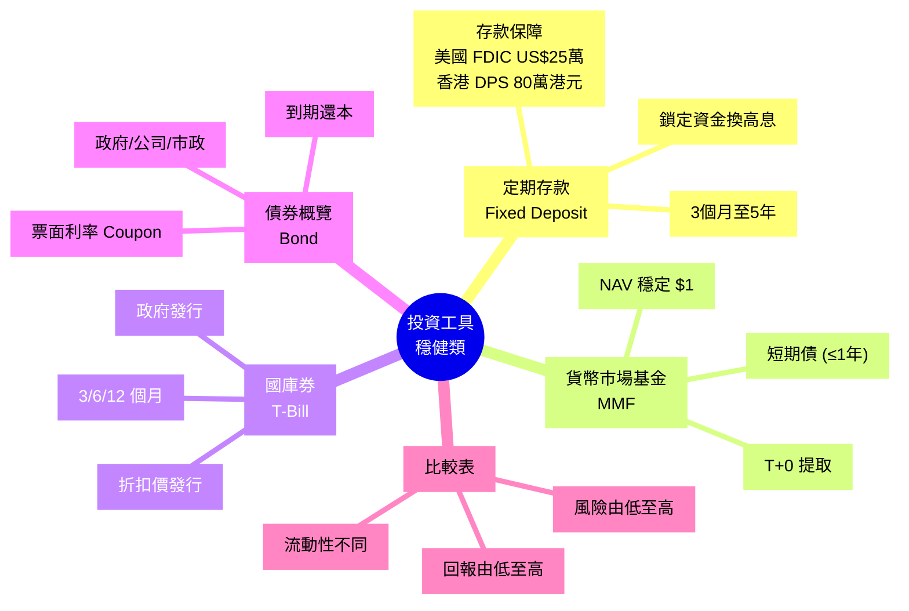

# Module 11: 投資工具(上): 定存、貨幣市場、債

Est. study time: 1h
Language: yue
Description: 認識 4 種穩健投資工具: 定期存款、貨幣市場基金、國庫券、債券概覽。比較回報、流動性、風險。

## Knowledge Map

---

## Learning Objectives
- 講出 4 種穩健投資工具嘅基本結構
- 比較佢哋嘅回報、流動性、風險、保障
- 明白「保本」唔等於「保回報」(通脹風險)
- 識揀邊種工具對應唔同目標
- 避開誤解: 國庫券 = 0 風險(其實有再投資/通脹風險)

---

## Real-World Example

你阿媽 60 歲退休, 攞住 200 萬儲蓄:
- 銀行定存: 3.5% 鎖 1 年, 但要鎖死
- 國庫券: 4.2% 鎖 6 個月, 靈活啲
- 貨幣市場基金: 3.0%, 隨時提取
- 5 年政府債: 4.5% 鎖 5 年

**問題**: 邊樣最啱佢?

答案**視乎目標**: 要應急錢 → 貨幣市場; 短期 1 年確定回報 → 定存; 5 年後要錢 → 5 年債; 6 個月後可能要 → 國庫券。

呢個 module 教識你睇得明呢 4 個工具嘅差異。

---

## Core Content

### Section 1: 定期存款 (Fixed Deposit)

最傳統嘅穩健工具, 銀行存錢一段時間換高息。

**結構**:
- 本金 P 鎖定 T 個月/年
- 到期取回 P + 利息
- 提前提取 = 0 利息 (罰息)

**特點**:
- 本金有保障 (香港: 存款保障計劃 2024 年 10 月起上限 80 萬港元 / 每位存款人 / 每間銀行; 美國對應係 FDIC, 上限 US$250,000)
- 利率固定, 鎖定期間唔受市場影響
- 流動性低, 提前取 = 冇息

**例子**: $100,000 存 1 年定存 3.5%
- 到期取: $100,000 + $3,500 = $103,500
- 提前 6 個月取: $100,000 + $0 (罰息)
- 名義回報 3.5%, 實際回報 = (103500 - 100000) / 100000 = 3.5%

**陷阱**: 1 年定存期內, 銀行加息到 5%, 你都係收 3.5% (鎖定咗)。

> **Cloze**: "定期存款將 {本金} 鎖定 {一段時間} 換取 {較高利息}, 提前提取通常 {冇利息}。"
>
> *Answer: 本金、一段時間、較高利息、冇利息*

### Section 2: 貨幣市場基金 (Money Market Fund / MMF)

投資於**短期債務工具** (< 1 年) 嘅基金, 風險極低, 流動性高。

**投資咩**:
- 國庫券 (T-Bill)
- 短期銀行存款 (CDs)
- 商業本票 (Commercial Paper)
- 回購協議 (Repos)

**特點**:
- NAV (Net Asset Value) 通常維持 $1
- T+0 / T+1 贖回
- 回報略高過活期, 但低過定存
- 唔受存款保障 (但理論上極低違約風險)

**例子**: 你買 $50,000 MMF
- NAV 維持 $1, 你有 50,000 份
- 年回報 3% = 賺 $1,500
- 隨時贖回, T+1 到戶口

**陷阱**:
- NAV 唔一定穩喺 $1 (2008 Reserve Primary Fund 跌破 $1, 罕見)
- 唔保本, 但實務上風險接近 0

> **Think**: 你用 50 萬擺 MMF, 1 年後拎返 50 萬 + 1.5 萬利息。如果期間通脹 3%, 你實際係賺緊定蝕緊?
>
> *Answer: 1.5 萬利息 = 3% 名義回報, 對沖通脹 3% 後, 實質回報約 0%。唔蝕但都唔賺, 純粹保本。MMF 適合短暫泊錢, 唔適合長期持有。*

### Section 3: 國庫券 (Treasury Bill / T-Bill)

政府發行嘅**短期債務工具**, 美國 / 香港 / 中國政府都有出。

**結構**:
- 折扣價發行: $99 買, 到期取 $100
- 唔派息, 賺差價

**特點**:
- 違約風險近乎 0 (政府可以加稅 / 印銀紙還)
- 流動性高 (二手市場活躍)
- 期限短: 4 週 / 13 週 / 26 週 / 52 週

**例子**: 美國 13 週 T-Bill, 折扣價 $99.50
- 買入: $99.50
- 13 週後取: $100
- 簡化年回報: ($100 - $99.50) / $99.50 × (52/13) ≈ 2.01% (跟聯儲息口)

**好處**:
- 短期國庫券 = 金融界「無風險利率」基準 (Rf)
- 避開再投資風險 (期限短, 到期可再揀)
- 二手市場價透明

**陷阱**:
- 折扣發行, 唔可以中途套現淨賺息 (要計入到期收益)
- 二手市場買賣, 價格會因利率變動

### Section 4: 債券 (Bond) 概覽

呢個 module 只係概覽, 後面 module 15/16 詳細講。

**核心結構**:
**結構** — 發行機構 借 P 本金, 承諾:
- 定期 (半年/季) 派息 Coupon
- 到期 (Maturity) 還本 Face Value

**類別**:
| 類型 | 發行人 | 風險 | 回報 |
|---|---|---|---|
| 政府債 (Sovereign) | 中央政府 | 最低 | 最低 |
| 政府機構債 (Agency) | 政府機構 e.g. Fannie Mae | 低 | 低中 |
| 公司債 (Corporate) | 公司 | 中 | 中 |
| 高息債 (High Yield) | 評級低公司 | 高 | 高 |
| 新興市場債 | 發展中國家 | 高 | 高 |

**例子**: 匯豐 5 年公司債, 票面 4%
- 買入: $10,000
- 每年收息: $400
- 5 年後取回: $10,000
- 總回報: 4% × 5 = 20% (假設冇違約)

**陷阱**:
- 利率上升 → 債券價格跌 (你中途賣就蝕)
- 違約風險: 公司執笠 = 冇錢收
- 信用評級改變, 價格即時變

### Section 5: 4 種工具比較表

| 工具 | 期限 | 回報 (年化) | 流動性 | 風險 | 保障 |
|---|---|---|---|---|---|
| **定存** | 3m-5y | 3-4% | 低 (罰息) | 極低 | ✓ 80 萬 |
| **MMF** | < 1y | 2-3% | 高 (T+0/1) | 低 | ✗ |
| **T-Bill** | 4w-52w | 3-5% | 高 (二手市場) | 極低 | ✗ (但近乎 0) |
| **債券** | 1y-30y | 3-6% | 中 (二手市場) | 中 | ✗ |

**選擇策略**:
- **應急錢** (3-6 個月生活費): MMF / 活期
- **1 年內確定回報**: 短期定存 / 短期 T-Bill
- **3-5 年目標**: 中期定存 / 5-10 年政府債
- **10 年以上**: 長期政府債 / 債券基金

> **Predict**: 假設聯儲局由 5% 減息到 3%, 你手上嘅 5 年定存 (鎖 5%) 同 5 年政府債 (到期 4.5%) 邊個蝕底?
>
> *Answer: 兩者都唔使蝕 — 前提係持有到期。定存鎖定 5%, 唔受市場影響; 5 年政府債持有到期一樣收 4.5% 同攞返本金, 減息影響唔到佢到期價值。分別喺中途套現: 減息會令舊債 (4.5%) 喺二手市場升值 (新發行債回報低過 4.5%, 舊債更值錢), 賣出有得賺; 而定存中途提取就罰息。真正要小心嘅係相反情況 — 如果加息而你又焗住要中途賣債, 先會蝕。*

### Section 6: 「保本」唔等於「保回報」

**重要**: 以上 4 種工具都係「保本」(到期拎得返本金), 但**唔保證實際購買力**。

**例子**:
- 你買 $100,000 1 年定存 3%
- 1 年後取 $103,000
- 同期通脹 4%
- 實際購買力: $103000 / 1.04 ≈ $99,038
- **你蝕咗 $962 嘅購買力**!

呢個就係「通脹風險」(Module 8 講過), 即使本金安全, 實質都係蝕。

**解決方法**:
- 買 TIPS (通脹掛鈎債券) → 自動加碼
- 投資股票 / 房地產 → 長期跑贏通脹
- 接受低回報, 明白呢個係 trade-off

> **Spot the Mistake**: 「我全部儲蓄擺 5 年定存, 4% 回報, 5 年後我肯定有 120 萬。」
>
> 邊度錯?
>
> *Answer: 假設 4% 通脹, 5 年後 100 萬嘅實際購買力 = 100 / 1.04⁵ ≈ 82 萬。即使本金加利息 120 萬, 通脹後購買力 = 120 / 1.04⁵ ≈ 98 萬, 即係你 5 年後嘅錢買得到嘅嘢比今日 100 萬仲少。定存保本但唔保值。*

---

### Why This Matters

呢 4 種工具係「現金管理」嘅核心, 唔係「投資」。

識得分佢哋, 你先唔會:
- 將應急錢鎖入 5 年定存 (急用冇得拎)
- 將長期目標 (退休) 擺晒做 MMF (回報唔夠)
- 盲目買公司債以為等同政府債 (違約風險)

每個工具都有定位, 揀錯位就蝕底。

---

## Key Takeaways
- 定存: 鎖定換高息, 流動性低, 本金保障
- MMF: 短期債組合, NAV $1, 高流動
- T-Bill: 政府短期債, 折扣發行, 無風險利率基準
- 債券: 票面派息 + 到期還本, 風險視乎發行人
- 「保本」≠「保值」, 通脹會蠶食實際回報
- 揀工具要對應目標期限同流動需要

---

## Common Misconception

**「國庫券零風險, 所以回報雖然低但完全值得。」**

錯。國庫券係「信貸風險」近乎 0, 但仲有:
- **再投資風險**: 到期後要再買, 利率可能跌咗
- **通脹風險**: 名義回報 4%, 通脹 5% = 實質 -1%
- **利率風險** (中期): 持有期中, 利率升, 二手市場價跌
- **流動性風險** (特殊情況): 金融危機時, 連 T-Bill 都有短期流動性問題

「零風險」只係 marketing 講法, 現實無資產係零風險。

---

## Spot the Mistake

「我阿媽 60 歲退休, 我幫佢將 300 萬全部擺 5 年定存, 每年 4%, 5 年後有 360 萬, 退休無憂。」

邊度錯?

*Answer: 三個錯。(1) 流動性: 退休人士需要應急錢, 全部鎖 5 年有風險 (醫療、家庭需要可能突然要用錢)。(2) 通脹: 4% 定存回報跑輸長期通脹 (過去 30 年香港 CPI 平均 ~3%, 但醫療通脹更高)。(3) 配置單一: 退休組合應該分散 (短期 MMF + 中期定存 + 長期政府債 + 少部分股票), 唔係單一工具。應該: 30% MMF (應急) + 30% 1-2 年定存 + 30% 5-10 年政府債 + 10% 大盤 ETF。*

---

## Feynman Explain

(用一個 10 歲都明嘅故事解釋「邊個工具放邊個目標」: 從「你有 100 元零用錢, 5 蚊要即刻用, 30 蚊一週後用, 65 蚊下個月用」講起, 講到「唔同時間用嘅錢放唔同地方」。)

---

## Reframe

(試下諗: 你而家儲蓄戶口有 6 個月生活費做應急, 其他錢擺晒喺活期。如果聯儲加息到 5%, 你會點做? 寫低你嘅諗法, 再諗下應該點樣 rebalance。)

---

## Drill
Take the quiz. MCQs test different angles — recall, application, scenario.

Run: `learn.sh quiz finance-basics-cantonese 11`
Run: `learn.sh cloze finance-basics-cantonese 11`
