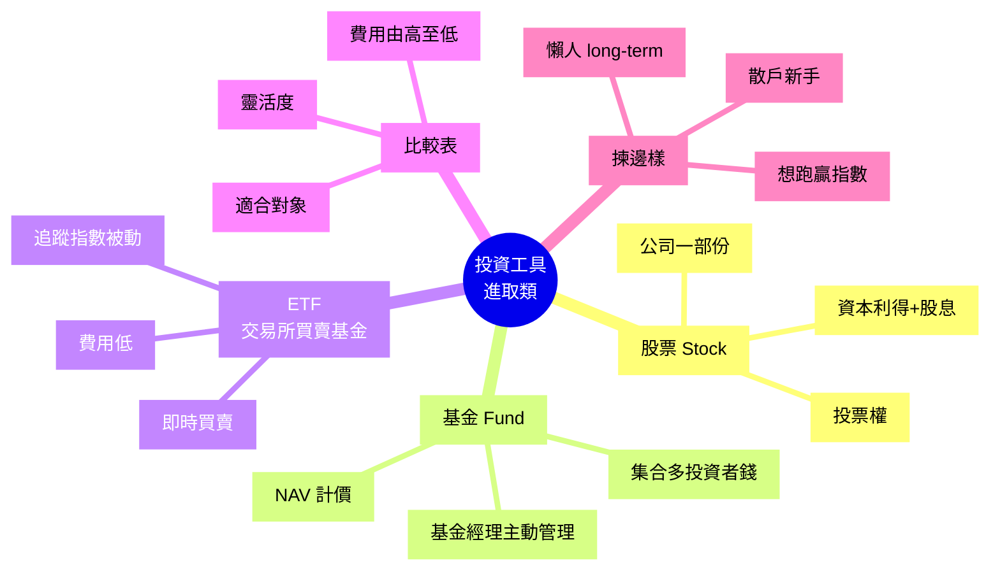

# Module 12: 投資工具(下)

Est. study time: 1h
Language: yue
Description: 股票 / 基金 / ETF 嘅概覽比較。股權結構、基金類別、ETF 結構、買賣方式、收費、適合邊種投資者。

## Knowledge Map



---

## Learning Objectives
- 講出股票、基金、ETF 嘅基本結構
- 比較三種工具嘅費用、靈活度、風險、回報來源
- 識揀適合自己嘅工具(新手 vs 進階)
- 避開誤解: 主動基金一定跑贏 ETF(其實多數跑輸)
- 知道點開始買第一隻股票 / 基金 / ETF

---

## Real-World Example

你 25 歲初出茅廬, 月儲 $5,000:
- **同事 A**: 全部買個股(騰訊、TSLA、Apple), 自詡「眼光準」
- **同事 B**: 訂閱晨星買主動基金, 信基金經理
- **同事 C**: 月供盈富 / 恒生 ETF, 「跟大市就得」

**5-10 年後**, 邊個表現最好?

研究: 港股散戶跑贏指數嘅比例 < 10%。同事 A 多數輸指數; 同事 B 多數輸指數 (主動基金平均跑輸); 同事 C 反而穩陣跟大市。

呢個 module 教識你睇得明呢 3 個工具嘅差異, 唔靠 marketing。

---

## Core Content

### Section 1: 股票 (Stock / Equity)

**定義**: 買入一間公司嘅**一部份擁有權**。

```
結構:
  公司發行 N 股
  你買 K 股, 你就有 K/N 嘅公司
  賺錢方式:
    1. 股息 (Dividend) — 公司派俾股東
    2. 資本利得 (Capital Gain) — 股價上升後賣出
```

**特點**:
- 有投票權(可選董事)
- 理論上回報無限(股價可升 10 倍), 損失亦無限(可跌至 0)
- 流動性高(個股日交易)
- 需要做功課(行業、財報、估值)

**例子**: 買 1 手騰訊 (100 股 @$400 = $40,000)
- 持有 1 年, 騰訊派息 $5/股 = 收 $500
- 1 年後股價 $450 → 賣出賺 $5,000 資本利得
- 總回報 $5,500, 假設其他成本 $50, 淨賺 $5,450 (13.6%)

**陷阱**:
- 個股可跌 90% (老闆犯錯、行業被淘汰)
- 散戶多數跑輸指數(行為偏差: 追高殺低)
- 集資炒股(IPO 抽)多數損手爛腳

### Section 2: 基金 (Fund / Mutual Fund)

**定義**: 集合多個投資者嘅錢, 由**基金經理**主動管理, 投資於股票 / 債 / 其他資產嘅組合。

```
結構:
  N 個投資者 → 1 個基金
  基金經理決定買咩、幾時買幾時賣
  每日計 NAV (Net Asset Value) = (總資產 - 負債) / 總份額
  投資者用 NAV 買入 / 贖回份額
```

**類別**:

| 類型 | 投資目標 | 例子 |
|---|---|---|
| 股票型 | 主要買股票 | 追蹤行業 / 地區 / 主題 |
| 債券型 | 主要買債券 | 政府債 / 公司債 / 高息債 |
| 平衡型 | 股 + 債 | 60/40 組合 |
| 貨幣市場 | 短期債 | 上一 module 講嘅 MMF |
| 指數型 | 跟指數被動 | (其實係 ETF 多, 但有 D 型) |
| 主動型 | 跑贏指數 | 晨星 5 星基金 |

**特點**:
- 一筆小錢買到「分散組合」(e.g. $1,000 買到持 100 隻股嘅基金)
- 基金經理專業(理論上)
- 買賣價 = 當日 NAV(收市後計, 次日執行)
- 收費高: 管理費 0.5-2%/年 + 認購費 + 贖回費

**例子**: 你 $50,000 買亞太股票基金, NAV $10
- 買入 5,000 份
- 1 年後 NAV 升到 $11 → 你有 $55,000
- 扣管理費 1.5% = 實得 $54,175 (8.35% vs 指數 10%)

**陷阱**:
- 主動基金 10 年平均: **70%+ 跑輸指數** (S&amp;P SPIVA 報告)
- 基金經理 ≠ 必贏
- 高費用蠶食回報

> **Think**: 主動基金經理係全職專業, 點解仲多數跑輸「乜都唔做」嘅指數 ETF?
>
> *Answer: 三個原因。(1) 交易成本: 經理頻頻買賣, 每次有手續費 + 稅, 累積蠶食 1-2%。(2) 現金拖累: 基金要保留 5% 現金應付贖回, 牛市跑輸。(3) 行為偏差: 經理都係人, 跌市恐慌斬倉、升市太遲追入。指數機械跟規則, 反而避開呢啲。*

### Section 3: ETF (Exchange-Traded Fund)

**定義**: 像股票一樣**交易所買賣**嘅基金, 多數**被動追蹤指數**。

```
結構:
  追蹤指數 (e.g. S&amp;P 500, 恒指, 黃金)
  授權參與者 (AP) 創造 / 贖回份額
  投資者喺交易所買賣 (像股票)
  即時報價, 即時執行
```

**特點**:
- 像股票: 即時買賣, 限價盤, 短炒 OK
- 像基金: 持一籃子資產, 自動分散
- 收費低: 0.03-0.5%/年 (vs 主動基金 0.5-2%)
- 透明度高: 每日披露持倉
- 稅務效率: 換手低, 派息少稅務事件

**例子**: 買 1 手盈富 (500 股 @$20 = $10,000)
- 追蹤恒生指數
- 持倉: 騰訊、匯豐、友邦、阿里等 80+ 隻藍籌
- 1 年後指數升 10% → 你的盈富都升 ~10% (扣除 0.1% 管理費)

**ETF 神奇之處**:
- 創造 / 贖回機制: 當 ETF 價偏離 NAV, AP 套利, 拉返
- 結果: 二級市場價 ≈ NAV
- 比封閉式基金(舊)公平, 唔會有大幅溢價 / 折讓

**陷阱**:
- 追蹤誤差 (Tracking Error): 真實回報可能輕微偏離指數
- 部分 ETF 流動性低, 買賣差價大
- 槓桿 / 反向 ETF 唔適合長揸(每日 rebalance 蠶食)

### Section 4: 三種工具比較表

| 維度 | 個股 | 主動基金 | ETF |
|---|---|---|---|
| **費用** | 佣金 + 30% 稅 | 0.5-2%/年 | 0.03-0.5%/年 |
| **分散** | 1 隻 (高集中) | 50-300 隻 | 跟指數 (數百隻) |
| **買賣** | 即時, 限價盤 | 收市計 NAV | 即時, 限價盤 |
| **最低投資** | 1 手 (幾千) | 通常 $1,000+ | 1 股 (幾百) |
| **管理** | 自己 | 基金經理 | 自動被動 |
| **回報** | 可高可低 (視眼光) | 多數跑輸指數 | 跟指數 (扣費) |
| **時間投入** | 高 (要分析) | 低 (信經理) | 最低 (機械跟) |
| **適合** | 有研究嘅人 | 唔想自己管 | 懶人 long-term |

**研究數據**:
- 港股散戶 5 年: 70%+ 跑輸恒指
- 美股主動基金 15 年: 85%+ 跑輸 S&amp;P 500
- ETF 平均 0.1% 費用 vs 主動基金 1.2% → 30 年差 ~30% 回報

> **Cloze**: "研究顯示主動基金 15 年內 {85% 以上} 跑輸指數, 因為 {費用高 + 現金拖累 + 行為偏差}。"
>
> *Answer: 85% 以上、費用高 + 現金拖累 + 行為偏差*

### Section 5: 點開始買第一樣?

**新手懶人 (推薦)**:
1. 開證券戶口 (富途 / 耀才 / 輝立 / 銀行)
2. 每月月供 1 隻大盤 ETF (盈富 / 恒生 / 標普 500)
3. 設自動轉帳, 唔使睇市
4. 持有 10 年以上, 享受複利

**進階散戶**:
- 80% ETF (核心) + 20% 個股 (衛星)
- 個股只買自己熟嘅行業

**千祈唔好**:
- All-in 個股 (一隻都輸晒)
- All-in 主動基金 (多數跑輸指數仲要畀錢人哋)
- 跟「股神」FB group (情緒化操作)

### Section 6: 常見誤解

**誤解 1: 「主動基金經理 = 投資專家, 一定跑贏」**

錯。S&amp;P SPIVA 報告: 過去 15 年, 85%+ 美股主動基金跑輸 S&amp;P 500。港股更差。

> **Predict**: 你朋友用 100 萬買主動基金, 你用 100 萬買盈富 ETF, 15 年後 (扣除費用後), 大機會邊個跑贏?
>
> *Answer: 85% 機會你跑贏, 因為主動基金跑輸指數嘅比例 85%+。朋友除咗畀管理費, 仲要承擔經理行為偏差嘅 cost。*

**誤解 2: 「ETF 慢, 個股先至快」**

錯。個股回報**期望值** = 大市平均 + alpha(眼光)。散戶多數 alpha 為負(行為偏差), 所以個股長線跑輸大市。短期可能有「贏錢感覺」, 但 10 年計多數輸。

**誤解 3: 「買 ETF 等於炒股, 太被動」**

錯。ETF 嘅「被動」係指**管理方式**機械(跟指數), 唔等於你唔使做功課。仍然要:
- 揀邊個指數 (恒指 / 標普 / 黃金 / 債券)
- 評估估值 (高估減持, 低估增持)
- 紀律執行 (跌市唔賣, 升市唔貪)

> **Spot the Mistake**: 「我而家月供 $5000 買盈富, 同時月供 $5000 買主動股票基金, 兩個都叫長線, 應該跑贏大市。」
>
> 邊度錯?
>
> *Answer: 主動基金多數跑輸指數。1 年半後你嘅主動基金可能輸恒指 5%, 盈富跟恒指平。10 年後主動基金可能輸 20-30% (複利效應), 等於你一半嘅錢畀人哋做管理費 + 跑輸蝕晒。應該: 月供全部去 ETF, 或者最多 80% ETF + 20% 主動, 唔好 50/50。*

---

### Why This Matters

揀錯工具 = 10 年後少幾十萬。

每月月供 1 隻大盤 ETF 嘅 25 歲年輕人, 30 年後大機會跑贏炒個股同主動基金嘅同輩。差異主要係:
- 費用差: 1%/年 × 30 年 = ~25% 蝕
- 行為差: 散戶多數高買低賣
- 機會成本: 揀錯股嘅機會成本

呢個 module 教你揀最啱你嘅工具, 唔好被 marketing 呃。

---

## Key Takeaways
- 個股: 高風險高回報, 要做功課, 多數散戶跑輸
- 主動基金: 信基金經理, 但 85%+ 跑輸指數
- ETF: 被動追指數, 費用低, 適合長線
- 研究: 大部分專業經理都跑輸指數, 散戶更難
- 新手: 月供大盤 ETF, 10 年+ 持有
- 進階: 80% ETF 核心 + 20% 個股衛星

---

## Common Misconception

**「我揀個股, 因為回報高過 ETF 好多」**

錯。**期望回報**係一樣嘅(都係大市平均 + alpha), 但個股**風險**大好多。問題係:
1. 多數散戶 alpha 為負(行為偏差)
2. 高回報 = 高波動, 你可能頂唔順中途賣
3. 集中風險, 一隻股跌 50% 你組合跌 20%

ETF 個股比較, 真正贏嘅人: 紀律好、行為理性、行業熟。少數。如果你唔係, ETF 比較好。

---

## Spot the Mistake

「我睇 YouTube 財經 KOL, 佢推介 3 隻個股, 我 All-in 100 萬, 話『3 隻一齊買分散咗』。」

邊度錯?

*Answer: 3 隻都係 KOL 推介, 可能同一板塊(科技 / 港股), 實際上相關性 +0.7, 分散效果差。而且 100 萬 All-in 個股無論幾多隻, 都有高度集中風險(個別公司風險), 唔同 ETF 跨 100 隻行業嘅分散。應該: 80% 大盤 ETF + 20% 自己真心研究嘅個股, 唔好跟 KOL All-in。*

---

## Feynman Explain

(用一個 12 歲都明嘅故事解釋「ETF vs 個股」: 從「班房 30 個學生考試, 你揀 1 個睇好嘅同學賭佢考第一, 定 30 個都支持, 跟平均分」講起, 講到「個股係考眼光, ETF 係跟大隊, 多數人跟大隊都已經贏」。)

---

## Reframe

(試下諗: 你而家嘅儲蓄, 如果擺去 ETF, 10 年後預期回報係幾多? 如果擺去個股, 預期回報同風險係幾多? 你揀邊個? 寫低你嘅諗法, 再諗下「為咩」背後嘅假設。)

---

## Drill
Take the quiz. MCQs test different angles — recall, application, scenario.

Run: `learn.sh quiz finance-basics-cantonese 12`
Run: `learn.sh cloze finance-basics-cantonese 12`
